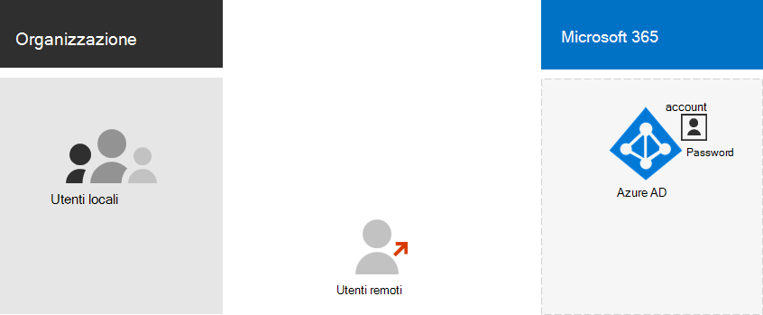
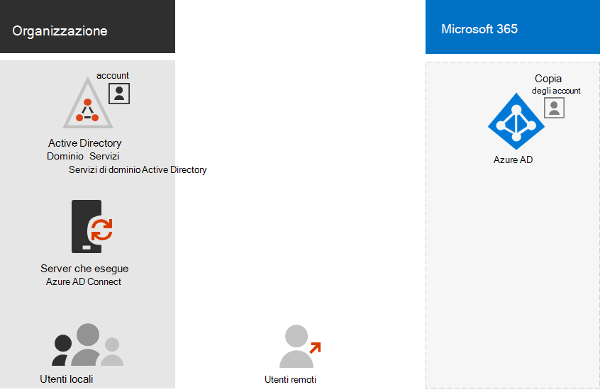

# Microsoft 365 modelli di identità e Azure Active DirectoryMicrosoft 365 identity models and Azure Active Directory

*Questo articolo può essere applicato sia a Microsoft 365 Enterprise che a Office 365 Enterprise.**This article applies to both Microsoft 365 Enterprise and Office 365 Enterprise.*

Microsoft 365 utilizza Azure Active Directory (Azure AD), un servizio di autenticazione e identità utente basato sul cloud incluso nell'abbonamento a Microsoft 365, per gestire le identità e l'autenticazione di Microsoft 365.Microsoft 365 uses Azure Active Directory (Azure AD), a cloud-based user identity and authentication service that is included with your Microsoft 365 subscription, to manage identities and authentication for Microsoft 365. Ottenere l'infrastruttura di identità configurata in modo corretto è fondamentale per la gestione dell'accesso utente e delle autorizzazioni di Microsoft 365 per l'organizzazione.Getting your identity infrastructure configured correctly is vital to managing Microsoft 365 user access and permissions for your organization.

Prima di iniziare, guardare questo video che illustra i modelli di identità e l'autenticazione per Microsoft 365.Before you begin, watch this video for an overview of identity models and authentication for Microsoft 365.

> [!VIDEO https://www.microsoft.com/videoplayer/embed/RE2Pjwu]

La prima scelta di pianificazione è il modello di identità Microsoft 365.Your first planning choice is the Microsoft 365 identity model.

## Modelli di identità Microsoft 365Microsoft 365 identity models

Per pianificare gli account utente, è necessario prima di tutto conoscere i due modelli di gestione delle identità disponibili in Microsoft 365.To plan for user accounts, you first need to understand the two identity models in Microsoft 365. È possibile mantenere le identità dell'organizzazione solo nel cloud. In alternativa, è possibile mantenere le identità Active Directory Domain Services (AD DS) in locale e usarle per l'autenticazione quando gli utenti accedono ai servizi cloud di Microsoft 365.You can maintain your organization's identities only in the cloud, or you can maintain your on-premises Active Directory Domain Services (AD DS) identities and use them for authentication when users access Microsoft 365 cloud services.  

Ecco i due tipi di identità con la descrizione dei vantaggi e dell'ambiente in cui sono più indicati.Here are the two types of identity and their best fit and benefits.

| AttributoAttribute | Identità solo cloudCloud-only identity | Identità ibridaHybrid identity |
|:-------|:-----|:-----|
| **Definizione****Definition** | L'account utente esiste solo nel tenant di Azure AD per l'abbonamento a Microsoft 365.User account only exists in the Azure AD tenant for your Microsoft 365 subscription. | L'account utente esiste in AD DS, ma una copia si trova anche nel tenant di Azure AD per l'abbonamento a Microsoft 365.User account exists in AD DS and a copy is also in the Azure AD tenant for your Microsoft 365 subscription. L'account utente in Azure AD potrebbe includere anche una versione con hash della password dell'account utente di AD DS già sottoposto a hash.The user account in Azure AD might also include a hashed version of the already hashed AD DS user account password. |
| **Autenticazione delle credenziali utente in Microsoft 365****How Microsoft 365 authenticates user credentials** | Per eseguire l'autenticazione, il tenant di Azure AD per l'abbonamento a Microsoft 365 usa l'account dell'identità cloud.The Azure AD tenant for your Microsoft 365 subscription performs the authentication with the cloud identity account. | Il tenant di Azure AD per l'abbonamento a Microsoft 365 gestisce il processo di autenticazione oppure reindirizza l'utente a un altro provider di identità.The Azure AD tenant for your Microsoft 365 subscription either handles the authentication process or redirects the user to another identity provider. |
| **Indicato per****Best for** | Organizzazioni che non hanno o necessitano di un'istanza locale di AD DS.Organizations that do not have or need an on-premises AD DS. | Organizzazioni che usano AD DS o un altro provider di identità.Organizations using AD DS or another identity provider. |
| **Principale vantaggio****Greatest benefit** | Semplice da usare.Simple to use. Non richiede altri strumenti o server di directory.No extra directory tools or servers required. | Gli utenti possono usare le stesse credenziali per accedere a risorse locali o basate sul cloud.Users can use the same credentials when accessing on-premises or cloud-based resources. |
||||

## Identità solo cloudCloud-only identity

Un'identità solo cloud usa solo gli account utente che esistono in Azure AD.A cloud-only identity uses user accounts that exist only in Azure AD. Viene in genere usata da organizzazioni di piccole dimensioni che non dispongono di server locali o non usano AD DS per gestire le identità locali.Cloud identity is typically used by small organizations that do not have on-premises servers or do not use AD DS to manage local identities. 

Ecco i componenti di base dell'identità solo cloud.Here are the basic components of cloud-only identity.
 

Sia gli utenti locali che quelli remoti (online) usano gli account utente e le password di Azure AD per accedere ai servizi cloud di Microsoft 365.Both on-premises and remote (online) users use their Azure AD user accounts and passwords to access Microsoft 365 cloud services. Azure AD autentica le credenziali utente in base agli account utente e alle password archiviate.Azure AD authenticates user credentials based on its stored user accounts and passwords.

### AmministrazioneAdministration
Poiché gli account utente sono archiviati solo in Azure Active Directory, è possibile gestire le identità cloud con strumenti quali l'interfaccia di [amministrazione di Microsoft 365](https://admin.microsoft.com) e [Windows PowerShell](manage-user-accounts-and-licenses-with-microsoft-365-powershell.md).Because user accounts are only stored in Azure AD, you manage cloud identities with tools such as the [Microsoft 365 admin center](https://admin.microsoft.com) and [Windows PowerShell](manage-user-accounts-and-licenses-with-microsoft-365-powershell.md). 

## Identità ibridaHybrid identity

L'identità ibrida usa gli account che provengono da un'istanza locale di AD DS e per i quali esiste una copia nel tenant di Azure AD di un abbonamento a Microsoft 365.Hybrid identity uses accounts that originate in an on-premises AD DS and have a copy in the Azure AD tenant of a Microsoft 365 subscription. Tuttavia, la maggior parte delle modifiche è unidirezionale.However, most changes only flow one way. Le modifiche apportate agli account utente di AD DS vengono sincronizzate con le copie corrispondenti in Azure AD.Changes that you make to AD DS user accounts are synchronized to their copy in Azure AD. Le modifiche apportate agli account basati sul cloud in Azure AD, ad esempio i nuovi account utente, non vengono invece sincronizzate con AD DS.But changes made to cloud-based accounts in Azure AD, such as new user accounts, are not synchronized with AD DS.

Azure AD Connect offre la sincronizzazione continua degli account.Azure AD Connect provides the ongoing account synchronization. Viene eseguito in un server locale, verifica la presenza di modifiche in AD DS e invia queste modifiche ad Azure AD.It runs on an on-premises server, checks for changes in the AD DS, and forwards those changes to Azure AD. Azure AD Connect consente di filtrare gli account sincronizzati e scegliere se eseguire la sincronizzazione di una versione con hash delle password utente, nota come sincronizzazione dell'hash delle password (PHS).Azure AD Connect provides the ability to filter which accounts are synchronized and whether to synchronize a hashed version of user passwords, known as password hash synchronization (PHS).

Durante l'implementazione dell'identità ibrida, l'istanza locale di AD DS costituisce l'origine autorevole delle informazioni sull'account.When you implement hybrid identity, your on-premises AD DS is the authoritative source for account information. Questo significa che le attività di amministrazione vengono eseguite principalmente in locale e quindi sincronizzate con Azure AD.This means that you perform administration tasks mostly on-premises, which are then synchronized to Azure AD. 

Ecco i componenti dell'identità ibrida.Here are the components of hybrid identity.

Il tenant di Azure AD contiene una copia degli account di AD DS.The Azure AD tenant has a copy of the AD DS accounts. In questa configurazione sia gli utenti locali che gli utenti remoti che accedono ai servizi cloud di Microsoft 365 eseguono l'autenticazione in Azure AD.In this configuration, both on-premises and remote users accessing Microsoft 365 cloud services authenticate against Azure AD.

>[!Note]
>È sempre necessario usare Azure AD Connect per sincronizzare gli account utenti per l'identità ibrida.You always need to use Azure AD Connect to synchronize user accounts for hybrid identity. Gli account utente sincronizzati in Azure AD sono necessari per l'assegnazione di licenze e la gestione dei gruppi, nonché per configurare le autorizzazioni e per altre attività amministrative che interessano gli account utente.You need the synchronized user accounts in Azure AD to perform license assignment and group management, configure permissions, and other administrative tasks that involve user accounts.
>

### AmministrazioneAdministration

Dal momento che gli account utente originali e autorevoli sono archiviati nell'istanza locale di AD DS, è possibile gestire le identità con gli stessi strumenti di AD DS, ad esempio lo strumento Utenti e computer di Active Directory.Because the original and authoritative user accounts are stored in the on-premises AD DS, you manage your identities with the same tools as AD DS, such as the Active Directory Users and Computers tool. 

Non è possibile utilizzare l'interfaccia di amministrazione di Microsoft 365 o PowerShell per Microsoft 365 per gestire gli account utente sincronizzati in Azure AD.You don't use the Microsoft 365 admin center or PowerShell for Microsoft 365 to manage synchronized user accounts in Azure AD.

## Passaggio successivoNext step

Se è necessario il modello di identità solo cloud, vedere [identità solo cloud](cloud-only-identities.md).If you need the cloud-only identity model, see [Cloud-only identity](cloud-only-identities.md).

Se è necessario il modello di identità ibrido, vedere [Hybrid Identity](plan-for-directory-synchronization.md).If you need the hybrid identity model, see [Hybrid identity](plan-for-directory-synchronization.md).

## Vedere ancheSee also

[Panoramica di Microsoft 365 EnterpriseMicrosoft 365 Enterprise overview](microsoft-365-overview.md)
