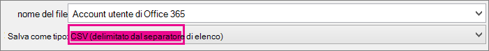
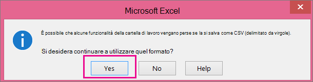

# <a name="add-several-users-at-the-same-time-to-microsoft-365---admin-help"></a><span data-ttu-id="6c5a9-105">Aggiungere più utenti contemporaneamente a Microsoft 365-Guida per gli amministratori</span><span class="sxs-lookup"><span data-stu-id="6c5a9-105">Add several users at the same time to Microsoft 365 - Admin Help</span></span>

<span data-ttu-id="6c5a9-106">Ogni persona del team ha bisogno di un account utente prima di poter accedere ai servizi Microsoft 365, ad esempio la posta elettronica e l'ufficio.</span><span class="sxs-lookup"><span data-stu-id="6c5a9-106">Each person on your team needs a user account before they can sign in and access Microsoft 365 services, such as email and Office.</span></span> <span data-ttu-id="6c5a9-107">Se il team è composto da numerose persone, è possibile aggiungere tutti gli account contemporaneamente da un foglio di calcolo di Excel o da un altro file salvato in formato CSV.</span><span class="sxs-lookup"><span data-stu-id="6c5a9-107">If you have a lot of people, you can add their accounts all at once from an Excel spreadsheet or other file saved in CSV format.</span></span> [<span data-ttu-id="6c5a9-108">Che cos'è il formato CSV?</span><span class="sxs-lookup"><span data-stu-id="6c5a9-108">Not sure what CSV format is?</span></span>](add-several-users-at-the-same-time.md#__toc316652088)
  
> [!NOTE] 
> <span data-ttu-id="6c5a9-109">Se non si usa la nuova interfaccia di amministrazione di Microsoft 365, è possibile attivarla selezionando l'opzione **Prova la nuova interfaccia di amministrazione** che si trova nella parte superiore della home page.</span><span class="sxs-lookup"><span data-stu-id="6c5a9-109">If you're not using the new Microsoft 365 admin center, you can turn it on by selecting the **Try the new admin center** toggle located at the top of the Home page.</span></span>

## <a name="add-multiple-users-in-the-microsoft-365-admin-center"></a><span data-ttu-id="6c5a9-110">Aggiungere più utenti nell'interfaccia di amministrazione di Microsoft 365</span><span class="sxs-lookup"><span data-stu-id="6c5a9-110">Add multiple users in the Microsoft 365 admin center</span></span>

1. <span data-ttu-id="6c5a9-111">Accedere a Microsoft 365 con l'account aziendale o dell'istituto di istruzione.</span><span class="sxs-lookup"><span data-stu-id="6c5a9-111">Sign in to Microsoft 365 with your work or school account.</span></span> 
    
2. <span data-ttu-id="6c5a9-112">Nell'interfaccia di **amministrazione scegliere utenti** \> **attivi**.</span><span class="sxs-lookup"><span data-stu-id="6c5a9-112">In the admin center, choose **Users** \> **Active users**.</span></span>

3. <span data-ttu-id="6c5a9-113">Selezionare **Aggiungi più utenti**.</span><span class="sxs-lookup"><span data-stu-id="6c5a9-113">Select **Add multiple users**.</span></span>

4. <span data-ttu-id="6c5a9-114">Nel riquadro **Importa più utenti** è possibile scegliere di scaricare un file CSV di esempio con o senza dati di esempio inseriti.</span><span class="sxs-lookup"><span data-stu-id="6c5a9-114">On the **Import multiple users** panel, you can optionally download a sample CSV file with or without sample data filled in.</span></span> 
    
    <span data-ttu-id="6c5a9-115">Il foglio di calcolo deve includere le **stesse intestazioni di colonna** del campione 1 (nome utente, nome e così via).</span><span class="sxs-lookup"><span data-stu-id="6c5a9-115">Your spreadsheet needs to include the **exact same column headings** as the sample one (User Name, First Name, and so on).</span></span> <span data-ttu-id="6c5a9-116">Se si utilizza il modello, aprirlo in uno strumento di modifica del testo, ad esempio il blocco note, e prendere in considerazione di lasciare tutti i dati solo nella riga 1 e immettere i dati solo nelle righe 2 e seguenti.</span><span class="sxs-lookup"><span data-stu-id="6c5a9-116">If you use the template, open it in a text editing tool, like Notepad, and consider leaving all the data in row 1 alone, and only entering data in rows 2 and below.</span></span> 
    
    <span data-ttu-id="6c5a9-117">Il foglio di calcolo deve includere anche i valori per il nome utente (ad esempio albertino@contoso.com) e per il nome visualizzato (ad esempio Albertino Mazzanti) di ogni utente.</span><span class="sxs-lookup"><span data-stu-id="6c5a9-117">Your spreadsheet also needs to include values for the user name (like bob@contoso.com) and a display name (like Bob Kelly) for each user.</span></span> 
    
  ```
  User Name,First Name,Last Name,Display Name,Job Title,Department,Office Number,Office Phone,Mobile Phone,Address,City,State or Province,ZIP or Postal Code,Country or Region
  chris@contoso.com,Chris,Green,Chris Green,IT Manager,Information Technology,123451,123-555-1211,123-555-6641,1 Microsoft way,Redmond,Wa,98052,United States
  ben@contoso.com,Ben,Andrews,Ben Andrews,IT Manager,Information Technology,123452,123-555-1212,123-555-6642,1 Microsoft way,Redmond,Wa,98052,United States
  david@contoso.com,David,Longmuir,David Longmuir,IT Manager,Information Technology,123453,123-555-1213,123-555-6643,1 Microsoft way,Redmond,Wa,98052,United States
  cynthia@contoso.com,Cynthia,Carey,Cynthia Carey,IT Manager,Information Technology,123454,123-555-1214,123-555-6644,1 Microsoft way,Redmond,Wa,98052,United States
  melissa@contoso.com,Melissa,MacBeth,Melissa MacBeth,IT Manager,Information Technology,123455,123-555-1215,123-555-6645,1 Microsoft way,Redmond,Wa,98052,United States
  
  ```

5. <span data-ttu-id="6c5a9-118">Immettere un percorso di file nella casella oppure scegliere **Sfoglia** per passare al percorso del file CSV e quindi scegliere **Verifica**.</span><span class="sxs-lookup"><span data-stu-id="6c5a9-118">Enter a file path into the box, or choose **Browse** to browse to the CSV file location, then choose **Verify**.</span></span>
  
    <span data-ttu-id="6c5a9-p104">Se ci sono problemi con il file, i relativi messaggi vengono visualizzati nel riquadro. È anche possibile scaricare un file di log.</span><span class="sxs-lookup"><span data-stu-id="6c5a9-p104">If there are problems with the file, the problem is displayed in the panel. You can also download a log file.</span></span>
    
5. <span data-ttu-id="6c5a9-121">Nella finestra di dialogo **Imposta opzioni utente** è possibile impostare lo stato di accesso e scegliere la licenza del prodotto che verrà assegnata a tutti gli utenti.</span><span class="sxs-lookup"><span data-stu-id="6c5a9-121">On the **Set user options** dialog you can set the sign-in status and choose the product license that will be assigned to all users.</span></span> 
    
6. <span data-ttu-id="6c5a9-122">Nella finestra di dialogo **Visualizza i risultati** è possibile scegliere di inviare i risultati a se stessi o ad altri utenti (le password saranno in testo normale) ed è possibile vedere quanti utenti sono stati creati e se è necessario acquistare altre licenze da assegnare ad alcuni nuovi utenti.</span><span class="sxs-lookup"><span data-stu-id="6c5a9-122">On the **View your result** dialog you can choose to send the results to either yourself or other users (passwords will be in plain text) and you can see how many users were created, and if you need to purchase more licenses to assign to some of the new users.</span></span> 

## <a name="next-steps"></a><span data-ttu-id="6c5a9-123">Passaggi successivi</span><span class="sxs-lookup"><span data-stu-id="6c5a9-123">Next steps</span></span>
<span data-ttu-id="6c5a9-124"><a name="bk_preview"> </a></span><span class="sxs-lookup"><span data-stu-id="6c5a9-124"><a name="bk_preview"> </a></span></span>

- <span data-ttu-id="6c5a9-125">Ora che queste persone hanno account, devono [scaricare e installare o reinstallare Microsoft 365 o Office 2016 su un PC o un Mac](https://support.office.com/article/4414eaaf-0478-48be-9c42-23adc4716658).</span><span class="sxs-lookup"><span data-stu-id="6c5a9-125">Now that these people have accounts, they need to [Download and install or reinstall Microsoft 365 or Office 2016 on a PC or Mac](https://support.office.com/article/4414eaaf-0478-48be-9c42-23adc4716658).</span></span> <span data-ttu-id="6c5a9-126">Ogni persona del team può installare Microsoft 365 su un massimo di 5 PC o Mac.</span><span class="sxs-lookup"><span data-stu-id="6c5a9-126">Each person on your team can install Microsoft 365 on up to 5 PCs or Macs.</span></span> 
    
- <span data-ttu-id="6c5a9-127">Ogni persona può anche [configurare le app di Office e la posta elettronica su un dispositivo mobile su un](https://support.office.com/article/7dabb6cb-0046-40b6-81fe-767e0b1f014f) massimo di 5 tablet e 5 telefoni, ad esempio iPhone, iPad, telefoni e Tablet Android.</span><span class="sxs-lookup"><span data-stu-id="6c5a9-127">Each person can also [Set up Office apps and email on a mobile device](https://support.office.com/article/7dabb6cb-0046-40b6-81fe-767e0b1f014f) on up to 5 tablets and 5 phones, such as iPhones, iPads, and Android phones and tablets.</span></span> <span data-ttu-id="6c5a9-128">In questo modo, potrà modificare i file di Office ovunque vada.</span><span class="sxs-lookup"><span data-stu-id="6c5a9-128">This way they can edit Office files from anywhere.</span></span> 
    
    <span data-ttu-id="6c5a9-129">Per un elenco end-to-end dei passaggi di configurazione, vedere [configurare Microsoft 365 for business](https://support.office.com/article/6a3a29a0-e616-4713-99d1-15eda62d04fa) .</span><span class="sxs-lookup"><span data-stu-id="6c5a9-129">See [Set up Microsoft 365 for business](https://support.office.com/article/6a3a29a0-e616-4713-99d1-15eda62d04fa) for an end-to-end list of the setup steps.</span></span> 
    
## <a name="more-information-about-how-to-add-users-to-microsoft-365"></a><span data-ttu-id="6c5a9-130">Ulteriori informazioni su come aggiungere utenti a Microsoft 365</span><span class="sxs-lookup"><span data-stu-id="6c5a9-130">More information about how to add users to Microsoft 365</span></span>
<span data-ttu-id="6c5a9-131"><a name="bk_preview"> </a></span><span class="sxs-lookup"><span data-stu-id="6c5a9-131"><a name="bk_preview"> </a></span></span>

### <a name="not-sure-what-csv-format-is"></a><span data-ttu-id="6c5a9-132">Che cos'è il formato CSV?</span><span class="sxs-lookup"><span data-stu-id="6c5a9-132">Not sure what CSV format is?</span></span>
<span data-ttu-id="6c5a9-133"><a name="__toc316652088"> </a></span><span class="sxs-lookup"><span data-stu-id="6c5a9-133"><a name="__toc316652088"> </a></span></span>

<span data-ttu-id="6c5a9-p107">Un file CSV è un file con valori delimitati da virgole. È possibile creare o modificare un file di questo tipo con qualsiasi editor di testo o foglio di calcolo, ad esempio Excel.</span><span class="sxs-lookup"><span data-stu-id="6c5a9-p107">A CSV file is a file with comma separated values. You can create or edit a file like this with any text editor or spreadsheet program, such as Excel.</span></span>
  
<span data-ttu-id="6c5a9-136">Come punto di partenza, è possibile scaricare questo [foglio di calcolo](https://www.microsoft.com/download/details.aspx?id=45485).</span><span class="sxs-lookup"><span data-stu-id="6c5a9-136">You can download [this sample spreadsheet](https://www.microsoft.com/download/details.aspx?id=45485) as a starting point.</span></span> <span data-ttu-id="6c5a9-137">Tenere presente che Microsoft 365 richiede intestazioni di colonna nella prima riga, quindi non sostituirle con qualcos'altro.</span><span class="sxs-lookup"><span data-stu-id="6c5a9-137">Remember that Microsoft 365 requires column headings in the first row so don't replace them with something else.</span></span> 
  
<span data-ttu-id="6c5a9-138">Salvare il file con un nuovo nome e specificare il formato CSV.</span><span class="sxs-lookup"><span data-stu-id="6c5a9-138">Save the file with a new name, and specify CSV format.</span></span>
  

  
<span data-ttu-id="6c5a9-p109">Quando si salva il file, è probabile che venga visualizzato un messaggio indicante che alcune caratteristiche della cartella di lavoro andranno perse in formato CSV. Non si tratta di un errore. Fare clic su **Sì** per continuare.</span><span class="sxs-lookup"><span data-stu-id="6c5a9-p109">When you save the file, you'll probably get a prompt that some features in your workbook will be lost if you save the file in CSV format. This is okay. Click **Yes** to continue.</span></span> 
  

  
### <a name="tips-for-formatting-your-spreadsheet"></a><span data-ttu-id="6c5a9-144">Suggerimenti per la formattazione del foglio di calcolo</span><span class="sxs-lookup"><span data-stu-id="6c5a9-144">Tips for formatting your spreadsheet</span></span>
<span data-ttu-id="6c5a9-145"><a name="__toc314595848"> </a></span><span class="sxs-lookup"><span data-stu-id="6c5a9-145"><a name="__toc314595848"> </a></span></span>

- <span data-ttu-id="6c5a9-146">**È necessario mantenere le stesse intestazioni di colonna del foglio di calcolo di esempio?**</span><span class="sxs-lookup"><span data-stu-id="6c5a9-146">**Do I need the same column headings as in the sample spreadsheet?**</span></span> <span data-ttu-id="6c5a9-147">Sì.</span><span class="sxs-lookup"><span data-stu-id="6c5a9-147">Yes.</span></span> <span data-ttu-id="6c5a9-148">Il foglio di calcolo di esempio contiene intestazioni di colonna nella prima riga.</span><span class="sxs-lookup"><span data-stu-id="6c5a9-148">The sample spreadsheet contains column headings in the first row.</span></span> <span data-ttu-id="6c5a9-149">Queste intestazioni sono obbligatorie.</span><span class="sxs-lookup"><span data-stu-id="6c5a9-149">These headings are required.</span></span> <span data-ttu-id="6c5a9-150">Per ogni utente che si desidera aggiungere a Microsoft 365, creare una riga sotto l'intestazione.</span><span class="sxs-lookup"><span data-stu-id="6c5a9-150">For each user you want to add to Microsoft 365, create a row under the heading.</span></span> <span data-ttu-id="6c5a9-151">Se si aggiungono, si modificano o si eliminano le intestazioni di colonna, Microsoft 365 potrebbe non essere in grado di creare gli utenti dalle informazioni contenute nel file.</span><span class="sxs-lookup"><span data-stu-id="6c5a9-151">If you add, change, or delete any of the column headings, Microsoft 365 might not be able to create users from the information in the file.</span></span> 
    
- <span data-ttu-id="6c5a9-p111">**Che cosa succede se non si hanno tutte le informazioni necessarie per ogni utente?** I campi obbligatori sono Nome utente e Nome visualizzato, pertanto non è possibile aggiungere un nuovo utente in assenza di tali informazioni. Se non si dispone di altre informazioni, ad esempio il fax, è possibile usare uno spazio seguito da una virgola per indicare che il campo deve rimanere vuoto.</span><span class="sxs-lookup"><span data-stu-id="6c5a9-p111">**What if I don't have all the information required for each user?** The user name and display name are required, and you cannot add a new user without this information. If you don't have some of the other information, such as the fax, you can use a space plus a comma to indicate that the field should remain blank.</span></span> 
    
- <span data-ttu-id="6c5a9-155">**Come può essere piccolo o grande il foglio di calcolo?**</span><span class="sxs-lookup"><span data-stu-id="6c5a9-155">**How small or large can the spreadsheet be?**</span></span> <span data-ttu-id="6c5a9-156">Il foglio di calcolo deve disporre di almeno due righe.</span><span class="sxs-lookup"><span data-stu-id="6c5a9-156">The spreadsheet must have at least two rows.</span></span> <span data-ttu-id="6c5a9-157">One is for the column headings (the user data column label) and one for the user.</span><span class="sxs-lookup"><span data-stu-id="6c5a9-157">One is for the column headings (the user data column label) and one for the user.</span></span> <span data-ttu-id="6c5a9-158">You cannot have more than 251 rows.</span><span class="sxs-lookup"><span data-stu-id="6c5a9-158">You cannot have more than 251 rows.</span></span> <span data-ttu-id="6c5a9-159">If you need to import more than 250 users, you can create more than one spreadsheet.</span><span class="sxs-lookup"><span data-stu-id="6c5a9-159">If you need to import more than 250 users, you can create more than one spreadsheet.</span></span> 
    
- <span data-ttu-id="6c5a9-160">**Quali lingue è possibile utilizzare?**</span><span class="sxs-lookup"><span data-stu-id="6c5a9-160">**What languages can I use?**</span></span> <span data-ttu-id="6c5a9-161">Quando si crea il foglio di calcolo, è possibile immettere le etichette delle colonne di dati degli utenti in qualsiasi lingua o carattere, ma non è necessario modificare l'ordine delle etichette, come illustrato nell'esempio.</span><span class="sxs-lookup"><span data-stu-id="6c5a9-161">When you create your spreadsheet, you can enter user data column labels in any language or characters, but you must not change the order of the labels, as shown in the sample.</span></span> <span data-ttu-id="6c5a9-162">You can then make entries into the fields, using any language or characters, and save your file in a Unicode or UTF-8 format.</span><span class="sxs-lookup"><span data-stu-id="6c5a9-162">You can then make entries into the fields, using any language or characters, and save your file in a Unicode or UTF-8 format.</span></span> 
    
- <span data-ttu-id="6c5a9-p114">**Che cosa succede se si aggiungono utenti di paesi o aree geografiche diverse?** Creare un foglio di calcolo distinto per ogni area. È necessario eseguire i passaggi della procedura guidata Aggiunta utenti in blocco per ogni foglio di calcolo, specificando una singola area geografica per tutti gli utenti inclusi nel file in uso.</span><span class="sxs-lookup"><span data-stu-id="6c5a9-p114">**What if I'm adding users from different countries or regions?** Create a separate spreadsheet for each area. You'll need to step through the Bulk add users wizard which each spreadsheet, giving a single location of all users included in the file that you're working with.</span></span> 
    
- <span data-ttu-id="6c5a9-p115">**È previsto un limite per il numero di caratteri che è possibile usare?** La tabella seguente indica le etichette delle colonne dei dati utente e il numero massimo di caratteri che è possibile usare per ognuna nel foglio di calcolo di esempio.</span><span class="sxs-lookup"><span data-stu-id="6c5a9-p115">**Is there a limit to the number of characters I can use?** The following table shows the user data column labels and the maximum character length for each in the sample spreadsheet.</span></span> 
    
|<span data-ttu-id="6c5a9-168">**Etichetta colonna dati utente**</span><span class="sxs-lookup"><span data-stu-id="6c5a9-168">**User data column label**</span></span>|<span data-ttu-id="6c5a9-169">**Numero massimo di caratteri**</span><span class="sxs-lookup"><span data-stu-id="6c5a9-169">**Maximum character length**</span></span>|
|:-----|:-----|
|<span data-ttu-id="6c5a9-170">Nome utente (obbligatorio)</span><span class="sxs-lookup"><span data-stu-id="6c5a9-170">User Name (Required)</span></span>  <br/> |<span data-ttu-id="6c5a9-171">79 incluso il simbolo di chiocciola (@), nel formato name@domain. \<extension\> .</span><span class="sxs-lookup"><span data-stu-id="6c5a9-171">79 including the at sign (@), in the format name@domain.\<extension\>.</span></span> <span data-ttu-id="6c5a9-172">L'alias dell'utente non può superare i 50 caratteri e il nome di dominio non può superare i 48 caratteri.</span><span class="sxs-lookup"><span data-stu-id="6c5a9-172">The user's alias cannot exceed 50 characters, and the domain name cannot exceed 48 characters.</span></span>  <br/> |
|<span data-ttu-id="6c5a9-173">Nome</span><span class="sxs-lookup"><span data-stu-id="6c5a9-173">First Name</span></span>  <br/> |<span data-ttu-id="6c5a9-174">64</span><span class="sxs-lookup"><span data-stu-id="6c5a9-174">64</span></span>  <br/> |
|<span data-ttu-id="6c5a9-175">Cognome</span><span class="sxs-lookup"><span data-stu-id="6c5a9-175">Last Name</span></span>  <br/> |<span data-ttu-id="6c5a9-176">64</span><span class="sxs-lookup"><span data-stu-id="6c5a9-176">64</span></span>  <br/> |
|<span data-ttu-id="6c5a9-177">Nome visualizzato (obbligatorio)</span><span class="sxs-lookup"><span data-stu-id="6c5a9-177">Display Name (required)</span></span>  <br/> |<span data-ttu-id="6c5a9-178">256</span><span class="sxs-lookup"><span data-stu-id="6c5a9-178">256</span></span>  <br/> |
|<span data-ttu-id="6c5a9-179">Posizione</span><span class="sxs-lookup"><span data-stu-id="6c5a9-179">Job Title</span></span>  <br/> |<span data-ttu-id="6c5a9-180">64</span><span class="sxs-lookup"><span data-stu-id="6c5a9-180">64</span></span>  <br/> |
|<span data-ttu-id="6c5a9-181">Reparto</span><span class="sxs-lookup"><span data-stu-id="6c5a9-181">Department</span></span>  <br/> |<span data-ttu-id="6c5a9-182">64</span><span class="sxs-lookup"><span data-stu-id="6c5a9-182">64</span></span>  <br/> |
|<span data-ttu-id="6c5a9-183">Numero ufficio</span><span class="sxs-lookup"><span data-stu-id="6c5a9-183">Office Number</span></span>  <br/> |<span data-ttu-id="6c5a9-184">128</span><span class="sxs-lookup"><span data-stu-id="6c5a9-184">128</span></span>  <br/> |
|<span data-ttu-id="6c5a9-185">Telefono ufficio</span><span class="sxs-lookup"><span data-stu-id="6c5a9-185">Office Phone</span></span>  <br/> |<span data-ttu-id="6c5a9-186">64</span><span class="sxs-lookup"><span data-stu-id="6c5a9-186">64</span></span>  <br/> |
|<span data-ttu-id="6c5a9-187">Telefono cellulare</span><span class="sxs-lookup"><span data-stu-id="6c5a9-187">Mobile Phone</span></span>  <br/> |<span data-ttu-id="6c5a9-188">64</span><span class="sxs-lookup"><span data-stu-id="6c5a9-188">64</span></span>  <br/> |
|<span data-ttu-id="6c5a9-189">Fax</span><span class="sxs-lookup"><span data-stu-id="6c5a9-189">Fax</span></span>  <br/> |<span data-ttu-id="6c5a9-190">64</span><span class="sxs-lookup"><span data-stu-id="6c5a9-190">64</span></span>  <br/> |
|<span data-ttu-id="6c5a9-191">Indirizzo</span><span class="sxs-lookup"><span data-stu-id="6c5a9-191">Address</span></span>  <br/> |<span data-ttu-id="6c5a9-192">1023</span><span class="sxs-lookup"><span data-stu-id="6c5a9-192">1023</span></span>  <br/> |
|<span data-ttu-id="6c5a9-193">Città</span><span class="sxs-lookup"><span data-stu-id="6c5a9-193">City</span></span>  <br/> |<span data-ttu-id="6c5a9-194">128</span><span class="sxs-lookup"><span data-stu-id="6c5a9-194">128</span></span>  <br/> |
|<span data-ttu-id="6c5a9-195">Provincia</span><span class="sxs-lookup"><span data-stu-id="6c5a9-195">State or Province</span></span>  <br/> |<span data-ttu-id="6c5a9-196">128</span><span class="sxs-lookup"><span data-stu-id="6c5a9-196">128</span></span>  <br/> |
|<span data-ttu-id="6c5a9-197">CAP</span><span class="sxs-lookup"><span data-stu-id="6c5a9-197">ZIP or Postal Code</span></span>  <br/> |<span data-ttu-id="6c5a9-198">40</span><span class="sxs-lookup"><span data-stu-id="6c5a9-198">40</span></span>  <br/> |
|<span data-ttu-id="6c5a9-199">Paese o area geografica</span><span class="sxs-lookup"><span data-stu-id="6c5a9-199">Country or Region</span></span>  <br/> |<span data-ttu-id="6c5a9-200">128</span><span class="sxs-lookup"><span data-stu-id="6c5a9-200">128</span></span>  <br/> |
   
### <a name="still-having-problems-when-adding-users-to-microsoft-365"></a><span data-ttu-id="6c5a9-201">Si verificano ancora problemi quando si aggiungono utenti a Microsoft 365?</span><span class="sxs-lookup"><span data-stu-id="6c5a9-201">Still having problems when adding users to Microsoft 365?</span></span>

- <span data-ttu-id="6c5a9-p117">**Verificare che il foglio di calcolo sia stato formattato correttamente.** Controllare le intestazioni di colonna per verificare che corrispondano a quelle del file di esempio. Assicurarsi di aver rispettato le regole relative al numero massimo di caratteri e di aver usato una virgola per separare i campi.</span><span class="sxs-lookup"><span data-stu-id="6c5a9-p117">**Double-check that the spreadsheet is formatted correctly.** Check the column headings to make sure they match the headings in the sample file. Make sure you're following the rules for character lengths and that each field is separated by a comma.</span></span> 
    
- <span data-ttu-id="6c5a9-205">**Se non si vedono subito i nuovi utenti in Microsoft 365, attendere qualche minuto.**</span><span class="sxs-lookup"><span data-stu-id="6c5a9-205">**If you don't see the new users in Microsoft 365 right away, wait a few minutes.**</span></span> <span data-ttu-id="6c5a9-206">È possibile che le modifiche apportate in tutti i servizi in Microsoft 365 possano richiedere un po' di tempo.</span><span class="sxs-lookup"><span data-stu-id="6c5a9-206">It can take a little while for changes to go across all the services in Microsoft 365.</span></span> 
    
## <a name="related-articles"></a><span data-ttu-id="6c5a9-207">Articoli correlati</span><span class="sxs-lookup"><span data-stu-id="6c5a9-207">Related articles</span></span>

[<span data-ttu-id="6c5a9-208">Aggiungere gli utenti singolarmente o in blocco a Microsoft 365</span><span class="sxs-lookup"><span data-stu-id="6c5a9-208">Add users individually or in bulk to Microsoft 365</span></span>](https://docs.microsoft.com/office365/admin/add-users/add-users)


