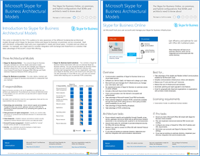
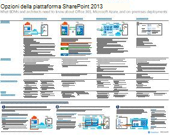
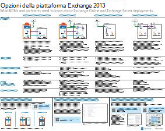
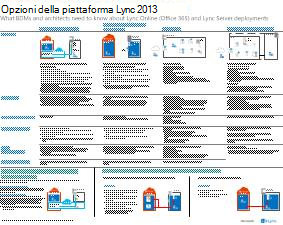

# Modelli architetturali per SharePoint, Exchange, Skype for Business e Lync

Nei poster IT di questo articolo vengono descritti i modelli architetturali e le opzioni di distribuzione per SharePoint, Exchange, Skype for Business e Lync. Forniscono inoltre informazioni di progettazione per la distribuzione di SharePoint in Microsoft Azure.
  
Utilizzando Microsoft 365, è possibile fornire servizi familiari di collaborazione e comunicazione tramite il cloud. Con alcune eccezioni, l'esperienza utente rimane la stessa sia che si manteni una distribuzione locale o si utilizzi Microsoft 365. 

Questa esperienza utente unificata complica la decisione di collocare ogni carico di lavoro. Pone inoltre domande:
  
- Come scegliere una piattaforma per i singoli carichi di lavoro?
    
- Ha senso mantenere i servizi in locale?
    
- In quale scenario è appropriata una distribuzione ibrida?
    
- Come si inserisce Azure nell'immagine?
    
- Quali configurazioni dei carichi di lavoro dei server di Office supporta Azure?
    
> [!TIP]
> La maggior parte dei poster in questo articolo è disponibile in più lingue. Le lingue disponibili includono cinese, inglese, francese, tedesco, italiano, giapponese, coreano, portoghese, russo e spagnolo. Per scaricare un poster in una di queste lingue, sotto l'immagine di anteprima del poster selezionare **Altre lingue.**
  
Facci sapere cosa ne pensi! Inviare un messaggio di posta [elettronica cloudadopt@microsoft.com](mailto:cloudadopt@microsoft.com). 
  
Utilizzare i collegamenti seguenti per ottenere i poster necessari:
  
- **Modelli architetturali:** utilizzare queste risorse per determinare la piattaforma e la configurazione ideali per SharePoint 2016 e Skype for Business 2015.
    
  - [Modelli architetturali di Microsoft SharePoint 2016](architectural-models-for-sharepoint-exchange-skype-for-business-and-lync.md#SP2016_ArchModel)
    
  - [Database di SharePoint Server 2016](architectural-models-for-sharepoint-exchange-skype-for-business-and-lync.md#SP2016_Databases)
    
  - [Modelli architetturali di Microsoft Skype for Business 2015](architectural-models-for-sharepoint-exchange-skype-for-business-and-lync.md#SfB2015_ArchModel)
    
- **Piattaforma:** utilizzare queste risorse per determinare la piattaforma e la configurazione ideali per SharePoint 2013, Exchange 2013 e Lync 2013.
    
  - [Opzioni della piattaforma SharePoint 2013](architectural-models-for-sharepoint-exchange-skype-for-business-and-lync.md#SP2013_Options)
    
  - [Opzioni della piattaforma Exchange 2013](architectural-models-for-sharepoint-exchange-skype-for-business-and-lync.md#Exch2013_options)
    
  - [Opzioni della piattaforma Lync 2013](architectural-models-for-sharepoint-exchange-skype-for-business-and-lync.md#Lync2013_Options)
    
- **SharePoint Server 2013 in Azure:** utilizzare questi poster IT per progettare e configurare i carichi di lavoro di SharePoint Server 2013 nei servizi infrastruttura di Azure.
    
  - [Siti Internet in Azure con SharePoint Server 2013](architectural-models-for-sharepoint-exchange-skype-for-business-and-lync.md#Azure_sharepoint2013)
    
  - [Esempio di progettazione: siti Internet in Azure per SharePoint 2013](architectural-models-for-sharepoint-exchange-skype-for-business-and-lync.md#DesignSampleInternetSites)
    
  - [Ripristino di emergenza di SharePoint in Azure](architectural-models-for-sharepoint-exchange-skype-for-business-and-lync.md#sharepoint_recovery_Azure)
    
## Poster dei modelli architetturali

I poster IT per SharePoint 2016 e Skype for Business 2015 consentono di confrontare i metodi di distribuzione in un formato facile da stampare. Nei poster sono elencate tutte le opzioni di configurazione o della piattaforma. Forniscono le informazioni seguenti per ogni opzione:
  
- **Panoramica:** breve riepilogo della piattaforma, incluso un diagramma concettuale.
    
- **Ideale per:** scenari comuni ideali per la piattaforma.
    
- **Requisiti di licenza:** le licenze necessarie per la distribuzione.
    
- **Attività relative** all'architettura: le decisioni da prendere come architetti.
    
- **Attività o responsabilità dei professionisti IT:** le responsabilità quotidiane che il personale IT deve pianificare.
    

### Modelli architetturali di Microsoft SharePoint Server 2016

|Elemento|Descrizione|
|---|---|
|[          ](https://www.microsoft.com/download/details.aspx?id=52650)   [PDF](https://download.microsoft.com/download/4/F/A/4FA0F94B-EE2F-41DB-A047-D9864FEF41E9/SharePoint2016ArchitecturalModels.pdf) \| [Visio](https://download.microsoft.com/download/4/F/A/4FA0F94B-EE2F-41DB-A047-D9864FEF41E9/SharePoint2016ArchitecturalModels.vsdx) \| [Altre lingue](https://www.microsoft.com/download/details.aspx?id=52650)|In questo poster IT vengono descritte le configurazioni locali di SharePoint Online, Azure e SharePoint che i decision maker aziendali e gli architetti di soluzioni devono conoscere.    - **SharePoint Online (SaaS):** utilizzare SharePoint tramite un modello di sottoscrizione SaaS (Software as a Service).   - **Ambiente ibrido di SharePoint:** spostare i siti e le app di SharePoint nel cloud in base ai propri ritmi.   - **SharePoint in Azure (IaaS):** estendere l'ambiente locale in Azure e distribuire i server SharePoint 2016. Questo modello è consigliato per ambienti di disponibilità elevata o di ripristino di emergenza e ambienti di sviluppo/test.   - **SharePoint locale:** pianificare, distribuire, gestire e personalizzare l'ambiente SharePoint in un datacenter gestito dall'utente.|
   

### Database di SharePoint Server 2016

|Elemento|Descrizione|
|---|---|
|   [PDF](https://download.microsoft.com/download/D/5/D/D5DC1121-8BC5-4953-834F-1B5BB03EB691/DBrefguideSPS2016_tabloid.pdf) \| [Visio](https://download.microsoft.com/download/D/5/D/D5DC1121-8BC5-4953-834F-1B5BB03EB691/DBrefguideSPS2016_tabloid.vsdx) \| [Altre lingue](https://www.microsoft.com/download/details.aspx?id=55041)|Questo poster IT è un riferimento rapido per i database di SharePoint Server 2016. Verranno visualizzati i dettagli per ogni database:    - Dimensioni   - Linee guida sul ridimensionamento   - Modello di I/O   - Requisiti     Nella prima pagina vengono mostrati i database di sistema di SharePoint e le applicazioni di servizio con più database. Nella seconda pagina vengono illustrate tutte le applicazioni di servizio che dispongono di singoli database.     Per ulteriori informazioni, vedere [Tipi di database e descrizioni in SharePoint Server 2016.](https://docs.microsoft.com/SharePoint/technical-reference/database-types-and-descriptions)|
   

### Modelli architetturali di Microsoft Skype for Business 2015

|Elemento|Descrizione|
|---|---|
|   [PDF](https://download.microsoft.com/download/7/7/4/7741262C-A60D-41F7-863B-99BF5964FBFE/Skype%20for%20Business%20Architectural%20Models.pdf) \| [Visio](https://download.microsoft.com/download/7/7/4/7741262C-A60D-41F7-863B-99BF5964FBFE/Skype%20for%20Business%20Architectural%20Models.vsd) \| [Altre lingue](https://www.microsoft.com/download/details.aspx?id=55022)|Questo poster descrive Skype for Business online, locale, ibrido e PBX (Cloud Private Branch Exchange). Viene inoltre descritta l'integrazione con le configurazioni di Exchange e SharePoint che i decision maker aziendali e gli architetti di soluzioni devono conoscere.    Il poster è destinato ai professionisti IT per sensibilizzare i professionisti IT sui modelli architetturali fondamentali attraverso i quali è possibile utilizzare Skype for Business online e Skype for Business in locale.   Iniziare con la configurazione più adatta alle esigenze e ai piani dell'organizzazione. Considerare e utilizzare altre configurazioni in base alle esigenze. Ad esempio, è consigliabile prendere in considerazione l'integrazione con Exchange e SharePoint o una soluzione che sfrutta l'offerta Cloud PBX Microsoft.|
   
## Poster delle opzioni della piattaforma

I poster IT per SharePoint 2013, Exchange 2013 e Lync 2013 consentono di confrontare rapidamente i metodi di distribuzione. Ogni poster elenca tutte le configurazioni o le opzioni della piattaforma. Vengono fornite le informazioni seguenti per ogni opzione:
  
- **Panoramica:** breve riepilogo della piattaforma, incluso un diagramma concettuale.
    
- **Ideale per:** scenari comuni ideali per la piattaforma.
    
- **Requisiti di licenza:** le licenze necessarie per la distribuzione.
    
- **Attività relative** all'architettura: le decisioni da prendere come architetti.
    
- **Attività o responsabilità dei professionisti IT:** le responsabilità quotidiane che il personale IT deve pianificare.
    

## Opzioni della piattaforma SharePoint 2013

|Elemento|Descrizione|
|---|---|
|   [PDF](https://go.microsoft.com/fwlink/p/?LinkId=324594) \| [Visio](https://go.microsoft.com/fwlink/p/?LinkId=324593) \| [Altre lingue](https://www.microsoft.com/download/details.aspx?id=40332)|Per decision maker e architetti aziendali, questo poster mostra le opzioni della piattaforma per SharePoint 2013, SharePoint in Microsoft 365, ambiente ibrido locale con distribuzioni di Microsoft 365, Azure e solo in locale. Include una panoramica di ogni architettura, consigli, requisiti di licenza ed elenchi di attività di architetti e professionisti IT per ogni piattaforma. Nel poster vengono evidenziate diverse soluzioni SharePoint in Azure.|
   

## Opzioni della piattaforma Exchange 2013

|Elemento|Descrizione|
|---|---|
|[          ](https://www.microsoft.com/download/details.aspx?id=42676)   [PDF](https://go.microsoft.com/fwlink/p/?LinkID=398740) \| [Visio](https://go.microsoft.com/fwlink/p/?LinkID=398742) \| [Altre lingue](https://www.microsoft.com/download/details.aspx?id=42676)|Per i decision maker aziendali e gli architetti, in questo poster vengono descritte le opzioni della piattaforma per Exchange 2013. I clienti possono scegliere da Exchange Online con Microsoft 365, Exchange ibrido, Exchange Server locale e Exchange ospitato. Nel poster vengono fornite informazioni dettagliate su ogni opzione architetturale, inclusi gli scenari ideali per ognuna, i requisiti di licenza e le responsabilità dei professionisti IT.|
   

## Opzioni della piattaforma Lync 2013

|Elemento|Descrizione|
|---|---|
|[          ](https://www.microsoft.com/download/details.aspx?id=41677)   [PDF](https://go.microsoft.com/fwlink/p/?LinkID=391837) \| [Visio](https://go.microsoft.com/fwlink/p/?LinkID=391839) \| [Altre lingue](https://www.microsoft.com/download/details.aspx?id=41677)|Per i decision maker e gli architetti aziendali, in questo poster vengono descritte le opzioni della piattaforma per Lync 2013. I clienti possono scegliere da Lync Online con Microsoft 365, Lync ibrido, Lync Server locale e Lync ospitato. Nel poster IT vengono fornite informazioni dettagliate su ogni opzione architetturale, inclusi gli scenari ideali per ognuna, i requisiti di licenza e le responsabilità dei professionisti IT.|
   

## Poster di SharePoint nelle soluzioni di Azure

I poster IT per SharePoint in Azure mostrano soluzioni basate su Azure che utilizzano SharePoint Server 2013.
  

### Siti Internet in Microsoft Azure con SharePoint Server 2013

|Elemento|Descrizione|
|---|---|
|[          ](https://www.microsoft.com/download/details.aspx?id=41992)   [PDF](https://go.microsoft.com/fwlink/p/?LinkId=392552) \| [Visio](https://go.microsoft.com/fwlink/p/?LinkId=392551) \| [Altre lingue](https://www.microsoft.com/download/details.aspx?id=41992)|In questo poster vengono descritte le principali attività di progettazione e l'architettura consigliata per i siti internet in Azure.     Per altre informazioni, vedere gli articoli seguenti:     - [Siti Internet in Azure con SharePoint Server 2013](internet-sites-in-microsoft-azure-using-sharepoint-server-2013.md)   - [Architetture di Azure per SharePoint 2013](microsoft-azure-architectures-for-sharepoint-2013.md)|
   

### Siti Internet in Azure per SharePoint 2013

|Elemento|Descrizione|
|---|---|
|[          ](https://www.microsoft.com/download/details.aspx?id=41991)   [PDF](https://go.microsoft.com/fwlink/p/?LinkId=392549) \| [Visio](https://go.microsoft.com/fwlink/p/?LinkId=392548) \| [Altre lingue](https://www.microsoft.com/download/details.aspx?id=41991)|Utilizzare questo esempio di progettazione come punto di partenza per la propria architettura di un sito con connessione Internet in Azure con SharePoint Server 2013.    Per altre informazioni, vedere gli articoli seguenti:     - [Siti Internet in Azure con SharePoint Server 2013](internet-sites-in-microsoft-azure-using-sharepoint-server-2013.md)   - [Architetture di Azure per SharePoint 2013](microsoft-azure-architectures-for-sharepoint-2013.md)|
   

### Ripristino di emergenza di SharePoint in Microsoft Azure

|Elemento|Descrizione|
|---|---|
|[          ](https://www.microsoft.com/download/details.aspx?id=41993)   [PDF](https://go.microsoft.com/fwlink/p/?LinkId=392555) \| [Visio](https://go.microsoft.com/fwlink/p/?LinkId=392554) \| [Altre lingue](https://www.microsoft.com/download/details.aspx?id=41993)|In questo poster IT vengono illustrati i principi di architettura per un ambiente di ripristino di emergenza in Azure.    Per ulteriori informazioni, vedere gli articoli seguenti:     - [Ripristino di emergenza di SharePoint Server 2013 in Azure](sharepoint-server-2013-disaster-recovery-in-microsoft-azure.md)   - [Architetture di Azure per SharePoint 2013](microsoft-azure-architectures-for-sharepoint-2013.md)|
   
## Vedere anche

- [Microsoft 365 Solution and Architecture Center](../solutions/solution-architecture-center.md)
  
- [Modelli di architettura cloud Microsoft](../solutions/cloud-architecture-models.md)
  
- [Guide dei laboratori di testing di Microsoft 365](m365-enterprise-test-lab-guides.md)
  
- [Soluzioni ibride](hybrid-solutions.md)

