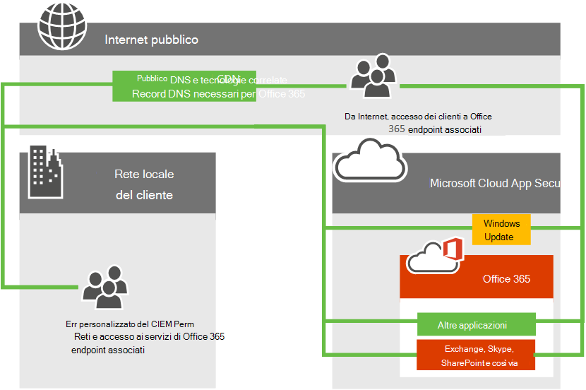
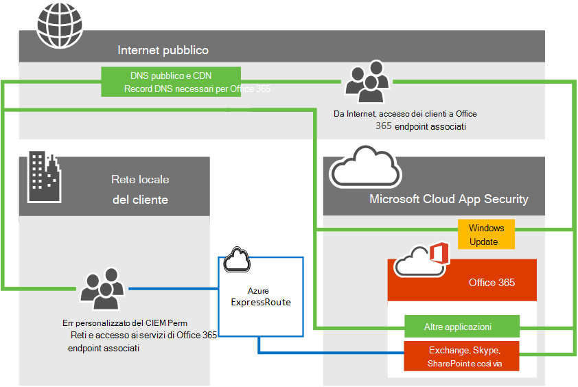

# Azure ExpressRoute per Office 365

*Questo articolo può essere applicato sia a Microsoft 365 Enterprise che a Office 365 Enterprise.*

Informazioni su come Azure ExpressRoute viene usato con Office 365 e su come pianificare il progetto di implementazione della rete che sarà necessario se si distribuisce Azure ExpressRoute per l'uso con Office 365. I servizi di infrastruttura e piattaforma in esecuzione in Azure spesso trarranno vantaggio da considerazioni sull'architettura di rete e sulle prestazioni. È consigliabile ExpressRoute per Azure in questi casi. Software as a Service offerings like Office 365 and Dynamics 365 have been built to be accessed securely and reliably via the Internet. È possibile leggere informazioni sulle prestazioni e la sicurezza di Internet e quando si potrebbe considerare Azure ExpressRoute per Office 365 nell'articolo [Assessing Office 365 network connectivity](assessing-network-connectivity.md).

> [!NOTE]
> L'autorizzazione Microsoft è necessaria per usare ExpressRoute per Office 365. Microsoft esamina ogni richiesta del cliente e autorizza ExpressRoute per l'utilizzo di Office 365 quando il requisito normativo di un cliente impone la connettività diretta. Se si dispone di tali requisiti, fornire l'estratto di testo e il collegamento Web al regolamento che si interpreta per indicare che la connettività diretta è necessaria nel modulo di richiesta [ExpressRoute per Office 365](https://aka.ms/O365ERReview) per avviare una revisione Microsoft. Le sottoscrizioni non autorizzate che tentano di creare filtri di route per Office 365 riceveranno un [messaggio di errore.](https://support.microsoft.com/kb/3181709)

È ora possibile aggiungere una connessione di rete diretta a Office 365 per il traffico di rete di Office 365 selezionato. Azure ExpressRoute offre una connessione diretta, prestazioni prevedibili e viene fornito con un contratto di servizio per i tempi di attività del 99,95% per i componenti di rete Microsoft. Sarà comunque necessaria una connessione Internet per i servizi non supportati su Azure ExpressRoute.

## Pianificazione di Azure ExpressRoute per Office 365

Oltre alla connettività Internet, è possibile scegliere di instradare un sottoinsieme del traffico di rete di Office 365 su una connessione diretta che offre prevedibilità e un contratto di servizio per il tempo di attività del 99,95% per i componenti di rete Microsoft. Azure ExpressRoute fornisce questa connessione di rete dedicata a Office 365 e ad altri servizi cloud Microsoft.

Indipendentemente dal fatto che tu abbia una WAN MPLS esistente, ExpressRoute può essere aggiunto all'architettura di rete in uno dei tre modi seguenti. tramite un provider di co-posizione di scambio cloud supportato, un provider di connessioni point-to-point Ethernet o tramite un provider di connessione MPLS. Vedere quali [provider sono disponibili nella propria area](/azure/expressroute/expressroute-locations)geografica. La connessione ExpressRoute diretta consentirà la connettività alle applicazioni descritte in [Quali servizi di Office 365 sono inclusi?](azure-expressroute.md#BKMK_WhatDoIGet) di seguito. Il traffico di rete per tutte le altre applicazioni e servizi continuerà a attraversare Internet.

Considerare il diagramma di rete di alto livello seguente che mostra un tipico cliente di Office 365 che si connette ai datacenter di Microsoft tramite Internet per accedere a tutte le applicazioni Microsoft, ad esempio Office 365, Windows Update e TechNet. I clienti usano un percorso di rete simile indipendentemente dal fatto che si connettano da una rete locale o da una connessione Internet indipendente.

Esaminare ora il diagramma aggiornato che illustra un cliente di Office 365 che usa sia Internet che ExpressRoute per connettersi a Office 365. Si noti che alcune connessioni, ad esempio i nodi PUBLIC DNS e Content Delivery Network, richiedono comunque la connessione Internet pubblica. Si noti inoltre che gli utenti del cliente che non si trovano nell'edificio connesso ExpressRoute si connettono tramite Internet.

Si desiderano altre informazioni? Informazioni su come gestire il traffico di rete con [Azure ExpressRoute per Office 365](https://support.office.com/article/e1da26c6-2d39-4379-af6f-4da213218408) e su come [configurare Azure ExpressRoute per Office 365.](/azure/expressroute/expressroute-faqs) Abbiamo anche registrato una serie di Azure [ExpressRoute for Office 365 Training](https://channel9.msdn.com/series/aer) in 10 parti su Channel 9 per illustrare i concetti in modo più approfondito.

## Quali servizi di Office 365 sono inclusi?

Nella tabella seguente sono elencati i servizi di Office 365 supportati su ExpressRoute. Leggere [l'articolo Endpoint di Office 365](./urls-and-ip-address-ranges.md) per comprendere quali richieste di rete per queste applicazioni richiedono la connettività Internet.

|**Applicazioni incluse**|
|:-----|
|Exchange Online1   Exchange Online Protection1   Delve1   |
|Skype for Business online1   Microsoft Teams 1   |
|SharePoint Online1   OneDrive for Business1   Project Online1   |
|Portale e condiviso1   Azure Active Directory (Azure AD) 1   Azure AD Connect1   Office1   |

1 Ognuna di queste applicazioni ha requisiti di connettività Internet non supportati su ExpressRoute, vedere l'articolo [endpoint di Office 365](./urls-and-ip-address-ranges.md) per ulteriori informazioni.

I servizi non inclusi in ExpressRoute per Office 365 sono i download di Microsoft 365 Apps for enterprise client, l'accesso al provider di identità locale e il servizio Office 365 (gestito da 21 Vianet) in Cina.

## Implementazione di ExpressRoute per Office 365

L'implementazione di ExpressRoute richiede il coinvolgimento dei proprietari di rete e applicazioni e richiede un'attenta pianificazione per determinare la nuova architettura di [routing](https://support.office.com/article/e1da26c6-2d39-4379-af6f-4da213218408)di rete, i requisiti di larghezza di banda, dove verrà implementata la sicurezza, disponibilità elevata e così via. Per implementare ExpressRoute, è necessario:

1. Comprendere appieno la necessità che ExpressRoute soddisfi nella pianificazione della connettività di Office 365. Comprendere quali applicazioni useranno Internet o ExpressRoute e pianificare completamente le esigenze di capacità, sicurezza e disponibilità elevata della rete nel contesto dell'uso sia di Internet che di ExpressRoute per il traffico di Office 365.

2. Determinare le posizioni di uscita e peering per il traffico Internet e ExpressRoute1.

3. Determinare la capacità necessaria per le connessioni Internet ed ExpressRoute.

4. Disporre di un piano per l'implementazione della sicurezza e di altri controlli perimetrali standard1.

5. Disporre di un account Microsoft Azure valido per sottoscrivere ExpressRoute.

6. Selezionare un modello di connettività e [un provider approvato.](/azure/expressroute/expressroute-locations) Tieni presente che i clienti possono selezionare più modelli o partner di connettività e il partner non deve essere lo stesso del provider di rete esistente.

7. Convalidare la distribuzione prima di indirizzare il traffico a ExpressRoute.

8. Facoltativamente, [implementare QoS e](https://support.office.com/article/ExpressRoute-and-QoS-in-Skype-for-Business-Online-20c654da-30ee-4e4f-a764-8b7d8844431d) valutare l'espansione regionale.

1 Considerazioni importanti sulle prestazioni. Le decisioni qui prese possono influire notevolmente sulla latenza, un fattore critico per applicazioni come Skype for Business.

Per ulteriori riferimenti, usare la guida [di routing](https://support.office.com/article/Routing-with-ExpressRoute-for-Office-365-e1da26c6-2d39-4379-af6f-4da213218408) oltre alla documentazione [expressRoute.](/azure/expressroute/expressroute-introduction)

Per acquistare ExpressRoute per Office 365, è necessario  collaborare con uno o più provider approvati per effettuare il provisioning dei circuiti di numero e dimensioni desiderati con una sottoscrizione ExpressRoute Premium. Non sono disponibili licenze aggiuntive da acquistare da Office 365.

Ecco un collegamento breve per tornare alla pagina: [https://aka.ms/expressrouteoffice365]()

Pronto per iscriversi a [ExpressRoute per Office 365?](https://aka.ms/ert)

## Argomenti correlati

[Valutazione della connettività di rete di Office 365](assessing-network-connectivity.md)

[Gestione di ExpressRoute per la connettività di Office 365](managing-expressroute-for-connectivity.md)

[Routing con ExpressRoute per Office 365](routing-with-expressroute.md)

[Pianificazione della rete con ExpressRoute per Office 365](network-planning-with-expressroute.md)

[Implementazione di ExpressRoute per Office 365](implementing-expressroute.md)

[Uso delle community BGP in ExpressRoute per scenari di Office 365](bgp-communities-in-expressroute.md)

[Qualità multimediale e prestazioni della connettività di rete in Skype for Business Online](https://support.office.com/article/5fe3e01b-34cf-44e0-b897-b0b2a83f0917)

[Ottimizzazione delle prestazioni di Office 365 mediante l'uso della cronologia delle prestazioni e delle previsioni](performance-tuning-using-baselines-and-history.md)

[Piano di risoluzione dei problemi di prestazioni per Office 365](performance-troubleshooting-plan.md)

[URL e intervalli di indirizzi IP per Office 365](urls-and-ip-address-ranges.md)

[Ottimizzazione delle prestazioni e della rete di Office 365](network-planning-and-performance.md)

## Vedere anche

[Panoramica di Microsoft 365 Enterprise](microsoft-365-overview.md)