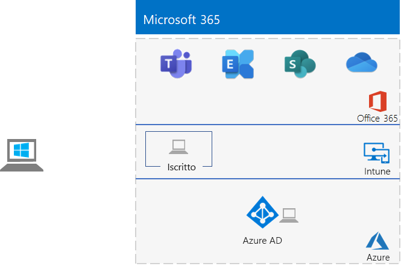

# <a name="identity-and-device-access-prerequisites-for-cloud-only-in-your-microsoft-365-test-environment"></a><span data-ttu-id="776f2-103">Prerequisiti di accesso di identità e dispositivi solo per cloud nell’ambiente di testing di Microsoft 365</span><span class="sxs-lookup"><span data-stu-id="776f2-103">Identity and device access prerequisites for cloud only in your Microsoft 365 test environment</span></span>

<span data-ttu-id="776f2-104">*Questa guida del laboratorio di testing può essere utilizzata solo per Microsoft 365 per gli ambienti di testing dell'organizzazione.*</span><span class="sxs-lookup"><span data-stu-id="776f2-104">*This Test Lab Guide can only be used for Microsoft 365 for enterprise test environments.*</span></span>

<span data-ttu-id="776f2-105">Le [configurazioni di accesso a identità e dispositivi](../security/office-365-security/microsoft-365-policies-configurations.md) sono un insieme di configurazioni e criteri di accesso condizionale per proteggere l'accesso a tutti i servizi integrati con Azure Active Directory (Azure ad).</span><span class="sxs-lookup"><span data-stu-id="776f2-105">[Identity and device access configurations](../security/office-365-security/microsoft-365-policies-configurations.md) are a set of configurations and conditional access policies to protect access to all services that are integrated with Azure Active Directory (Azure AD).</span></span>

<span data-ttu-id="776f2-106">In questo articolo viene descritto come configurare un ambiente di testing di Microsoft 365 che soddisfi i requisiti della [configurazione dei prerequisiti solo per cloud](../security/office-365-security/identity-access-prerequisites.md#prerequisites) per l’accesso di identità e dispositivi.</span><span class="sxs-lookup"><span data-stu-id="776f2-106">This article describes how to configure a Microsoft 365 test environment that meets the requirements of the [cloud only prerequisite configuration](../security/office-365-security/identity-access-prerequisites.md#prerequisites) for identity and device access.</span></span>

<span data-ttu-id="776f2-107">Le fasi principali della configurazione dell'ambiente di testing sono sette:</span><span class="sxs-lookup"><span data-stu-id="776f2-107">There are seven phases to setting up this test environment:</span></span>

1.  <span data-ttu-id="776f2-108">Creare l'ambiente di testing semplificato</span><span class="sxs-lookup"><span data-stu-id="776f2-108">Build out your lightweight test environment</span></span>
2.  <span data-ttu-id="776f2-109">Configurare le posizioni specifiche</span><span class="sxs-lookup"><span data-stu-id="776f2-109">Configure named locations</span></span>
3.  <span data-ttu-id="776f2-110">Configurare il writeback delle password</span><span class="sxs-lookup"><span data-stu-id="776f2-110">Configure password writeback</span></span>
4.  <span data-ttu-id="776f2-111">Configurare la reimpostazione self-service delle password</span><span class="sxs-lookup"><span data-stu-id="776f2-111">Configure self-service password resets</span></span>
5.  <span data-ttu-id="776f2-112">Configurare l’autenticazione a più fattori</span><span class="sxs-lookup"><span data-stu-id="776f2-112">Configure multifactor authentication</span></span>
6.  <span data-ttu-id="776f2-113">Abilitare Azure AD Identity Protection</span><span class="sxs-lookup"><span data-stu-id="776f2-113">Enable Azure AD Identity Protection</span></span>
7.  <span data-ttu-id="776f2-114">Abilitare l'autenticazione moderna per Exchange Online e Skype for Business Online</span><span class="sxs-lookup"><span data-stu-id="776f2-114">Enable modern authentication for Exchange Online and Skype for Business Online</span></span>

## <a name="phase-1-build-out-your-lightweight-microsoft-365-test-environment"></a><span data-ttu-id="776f2-115">Fase 1: creare l'ambiente di testing semplificato di Microsoft 365 </span><span class="sxs-lookup"><span data-stu-id="776f2-115">Phase 1: Build out your lightweight Microsoft 365 test environment</span></span>

<span data-ttu-id="776f2-116">Seguire le istruzioni riportate in [Configurazione di base semplificata](lightweight-base-configuration-microsoft-365-enterprise.md).</span><span class="sxs-lookup"><span data-stu-id="776f2-116">Follow the instructions in [Lightweight base configuration](lightweight-base-configuration-microsoft-365-enterprise.md).</span></span>
<span data-ttu-id="776f2-117">Di seguito è riportata la configurazione risultante.</span><span class="sxs-lookup"><span data-stu-id="776f2-117">Here is the resulting configuration.</span></span>


 

## <a name="phase-2-configure-named-locations"></a><span data-ttu-id="776f2-119">Fase 2: configurare le posizioni specifiche</span><span class="sxs-lookup"><span data-stu-id="776f2-119">Phase 2: Configure named locations</span></span>

<span data-ttu-id="776f2-120">Prima di tutto è necessario determinare gli indirizzi IP pubblici o gli intervalli di indirizzi usati all'interno dell'organizzazione.</span><span class="sxs-lookup"><span data-stu-id="776f2-120">First, determine the public IP addresses or address ranges used by your organization.</span></span>

<span data-ttu-id="776f2-121">Quindi, seguire le istruzioni contenute in [Configurare le posizioni specifiche in Azure Active Directory](https://docs.microsoft.com/azure/active-directory/reports-monitoring/quickstart-configure-named-locations) per aggiungere gli indirizzi o gli intervalli di indirizzi come posizioni specifiche.</span><span class="sxs-lookup"><span data-stu-id="776f2-121">Next, follow the instructions in [Configure named locations in Azure Active Directory](https://docs.microsoft.com/azure/active-directory/reports-monitoring/quickstart-configure-named-locations) to add the addresses or address ranges as named locations.</span></span> 

## <a name="phase-3-configure-password-writeback"></a><span data-ttu-id="776f2-122">Fase 3: configurare il writeback delle password</span><span class="sxs-lookup"><span data-stu-id="776f2-122">Phase 3: Configure password writeback</span></span>

<span data-ttu-id="776f2-123">Seguire le istruzioni contenute in[Fase 2 della guida al lab di test sul writeback delle password](password-writeback-m365-ent-test-environment.md#phase-2-enable-password-writeback-for-the-testlab-ad-ds-domain).</span><span class="sxs-lookup"><span data-stu-id="776f2-123">Follow the instructions in [Phase 2 of the password writeback Test Lab Guide](password-writeback-m365-ent-test-environment.md#phase-2-enable-password-writeback-for-the-testlab-ad-ds-domain).</span></span>

## <a name="phase-4-configure-self-service-password-reset"></a><span data-ttu-id="776f2-124">Fase 4: configurare la reimpostazione delle password self-service</span><span class="sxs-lookup"><span data-stu-id="776f2-124">Phase 4: Configure self-service password reset</span></span>

<span data-ttu-id="776f2-125">Seguire le istruzioni contenute nella [Fase 3 della guida al lab di test per la reimpostazione della password](password-reset-m365-ent-test-environment.md#phase-3-configure-and-test-password-reset).</span><span class="sxs-lookup"><span data-stu-id="776f2-125">Follow the instructions in [Phase 3 of the password reset Test Lab Guide](password-reset-m365-ent-test-environment.md#phase-3-configure-and-test-password-reset).</span></span> 

<span data-ttu-id="776f2-126">Quando si abilita la reimpostazione della password degli account in un determinato gruppo di Azure AD, aggiungere gli account al gruppo **Reimpostazione della password**:</span><span class="sxs-lookup"><span data-stu-id="776f2-126">When enabling password reset for the accounts in a specific Azure AD group, add these accounts to the **Password reset** group:</span></span>

- <span data-ttu-id="776f2-127">Utente 2</span><span class="sxs-lookup"><span data-stu-id="776f2-127">User 2</span></span>
- <span data-ttu-id="776f2-128">Utente 3</span><span class="sxs-lookup"><span data-stu-id="776f2-128">User 3</span></span>
- <span data-ttu-id="776f2-129">Utente 4</span><span class="sxs-lookup"><span data-stu-id="776f2-129">User 4</span></span>
- <span data-ttu-id="776f2-130">Utente 5</span><span class="sxs-lookup"><span data-stu-id="776f2-130">User 5</span></span>

<span data-ttu-id="776f2-131">Testare la reimpostazione della password solo per l'account Utente 2.</span><span class="sxs-lookup"><span data-stu-id="776f2-131">Test password reset only for the User 2 account.</span></span>

## <a name="phase-5-configure-multi-factor-authentication"></a><span data-ttu-id="776f2-132">Fase 5: configurare l’autenticazione a più fattori</span><span class="sxs-lookup"><span data-stu-id="776f2-132">Phase 5: Configure multi-factor authentication</span></span>

<span data-ttu-id="776f2-133">Seguire le istruzioni contenute nella [Fase 2 della guida al lab di test per autenticazione a più fattori](multi-factor-authentication-microsoft-365-test-environment.md#phase-2-enable-and-test-multi-factor-authentication-for-the-user-2-account) per gli account utente seguenti:</span><span class="sxs-lookup"><span data-stu-id="776f2-133">Follow the instructions in [Phase 2 of the multi-factor authentication Test Lab Guide](multi-factor-authentication-microsoft-365-test-environment.md#phase-2-enable-and-test-multi-factor-authentication-for-the-user-2-account) for the following user accounts:</span></span>

- <span data-ttu-id="776f2-134">Utente 2</span><span class="sxs-lookup"><span data-stu-id="776f2-134">User 2</span></span>
- <span data-ttu-id="776f2-135">Utente 3</span><span class="sxs-lookup"><span data-stu-id="776f2-135">User 3</span></span>
- <span data-ttu-id="776f2-136">Utente 4</span><span class="sxs-lookup"><span data-stu-id="776f2-136">User 4</span></span>
- <span data-ttu-id="776f2-137">Utente 5</span><span class="sxs-lookup"><span data-stu-id="776f2-137">User 5</span></span>

<span data-ttu-id="776f2-138">Testare l'autenticazione a più fattori solo per l'account Utente 2.</span><span class="sxs-lookup"><span data-stu-id="776f2-138">Test multi-factor authentication only for the User 2 account.</span></span>

## <a name="phase-6-enable-azure-ad-identity-protection"></a><span data-ttu-id="776f2-139">Fase 6: abilitare Azure AD Identity Protection</span><span class="sxs-lookup"><span data-stu-id="776f2-139">Phase 6: Enable Azure AD Identity Protection</span></span>

<span data-ttu-id="776f2-140">Seguire le istruzioni contenute nella [Fase 2 della guida al lab di test per Azure AD Identity Protection](azure-ad-identity-protection-microsoft-365-test-environment.md#phase-2-use-azure-ad-identity-protection).</span><span class="sxs-lookup"><span data-stu-id="776f2-140">Follow the instructions in [Phase 2 of the Azure AD Identity Protection Test Lab Guide](azure-ad-identity-protection-microsoft-365-test-environment.md#phase-2-use-azure-ad-identity-protection).</span></span> 

## <a name="phase-7-enable-modern-authentication-for-exchange-online-and-skype-for-business-online"></a><span data-ttu-id="776f2-141">Fase 7: abilitare l'autenticazione moderna per Exchange Online e Skype for Business Online</span><span class="sxs-lookup"><span data-stu-id="776f2-141">Phase 7: Enable modern authentication for Exchange Online and Skype for Business Online</span></span>

<span data-ttu-id="776f2-142">Per Exchange Online, fare clic su [queste istruzioni](https://docs.microsoft.com/Exchange/clients-and-mobile-in-exchange-online/enable-or-disable-modern-authentication-in-exchange-online#enable-or-disable-modern-authentication-in-exchange-online-for-client-connections-in-outlook-2013-or-later).</span><span class="sxs-lookup"><span data-stu-id="776f2-142">For Exchange Online, follow [these instructions](https://docs.microsoft.com/Exchange/clients-and-mobile-in-exchange-online/enable-or-disable-modern-authentication-in-exchange-online#enable-or-disable-modern-authentication-in-exchange-online-for-client-connections-in-outlook-2013-or-later).</span></span> 

<span data-ttu-id="776f2-143">Per Skype for Business Online:</span><span class="sxs-lookup"><span data-stu-id="776f2-143">For Skype for Business Online:</span></span>

1. <span data-ttu-id="776f2-144">Connettere a [Skype for Business Online](https://docs.microsoft.com/SkypeForBusiness/set-up-your-computer-for-windows-powershell/set-up-your-computer-for-windows-powershell).</span><span class="sxs-lookup"><span data-stu-id="776f2-144">Connect to [Skype for Business Online](https://docs.microsoft.com/SkypeForBusiness/set-up-your-computer-for-windows-powershell/set-up-your-computer-for-windows-powershell).</span></span>

2. <span data-ttu-id="776f2-145">Eseguire questo comando.</span><span class="sxs-lookup"><span data-stu-id="776f2-145">Run this command.</span></span>

  ```powershell
  Set-CsOAuthConfiguration -ClientAdalAuthOverride Allowed
  ```

3. <span data-ttu-id="776f2-146">Verificare che la modifica sia stata applicata con questo comando.</span><span class="sxs-lookup"><span data-stu-id="776f2-146">Verify that the change was successful with this command.</span></span>

  ```powershell
  Get-CsOAuthConfiguration
  ```

<span data-ttu-id="776f2-147">Il risultato è un ambiente di testing che soddisfa i requisiti di [Configurazione dei prerequisiti solo per cloud](../security/office-365-security/identity-access-prerequisites.md#prerequisites) per l’identità e l’accesso dei dispositivi.</span><span class="sxs-lookup"><span data-stu-id="776f2-147">The result is a test environment that meets the requirements of the [cloud only prerequisite configuration](../security/office-365-security/identity-access-prerequisites.md#prerequisites) for identity and device access.</span></span> 

## <a name="next-step"></a><span data-ttu-id="776f2-148">Passaggio successivo</span><span class="sxs-lookup"><span data-stu-id="776f2-148">Next step</span></span>

<span data-ttu-id="776f2-149">Usare i [criteri comuni di identità e accesso ai dispositivi](identity-access-policies.md) per configurare i criteri basati sui prerequisiti e proteggere identità e dispositivi.</span><span class="sxs-lookup"><span data-stu-id="776f2-149">Use [Common identity and device access policies](identity-access-policies.md) to configure the policies that build on the prerequisites and protect identities and devices.</span></span>

## <a name="see-also"></a><span data-ttu-id="776f2-150">Vedere anche</span><span class="sxs-lookup"><span data-stu-id="776f2-150">See also</span></span>

[<span data-ttu-id="776f2-151">Guide al lab di test per identità aggiuntive</span><span class="sxs-lookup"><span data-stu-id="776f2-151">Additional identity Test Lab Guides</span></span>](m365-enterprise-test-lab-guides.md#identity)

[<span data-ttu-id="776f2-152">Roadmap dell'identità</span><span class="sxs-lookup"><span data-stu-id="776f2-152">Identity roadmap</span></span>](identity-roadmap-microsoft-365.md)

[<span data-ttu-id="776f2-153">Guide ai lab di test di Microsoft 365 per le aziende</span><span class="sxs-lookup"><span data-stu-id="776f2-153">Microsoft 365 for enterprise Test Lab Guides</span></span>](m365-enterprise-test-lab-guides.md)

[<span data-ttu-id="776f2-154">Panoramica di Microsoft 365 per le aziende</span><span class="sxs-lookup"><span data-stu-id="776f2-154">Microsoft 365 for enterprise overview</span></span>](microsoft-365-overview.md)

[<span data-ttu-id="776f2-155">Microsoft 365 per la documentazione relativa all'organizzazione</span><span class="sxs-lookup"><span data-stu-id="776f2-155">Microsoft 365 for enterprise documentation</span></span>](https://docs.microsoft.com/microsoft-365-enterprise/)
