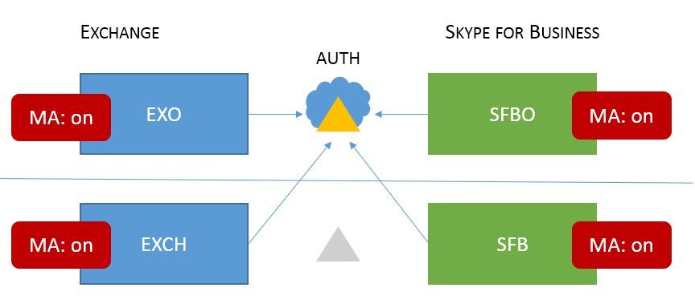

# <a name="how-to-configure-skype-for-business-on-premises-to-use-hybrid-modern-authentication"></a><span data-ttu-id="9a35d-103">Come configurare Skype for Business locale per utilizzare l'autenticazione moderna ibrida</span><span class="sxs-lookup"><span data-stu-id="9a35d-103">How to configure Skype for Business on-premises to use Hybrid Modern Authentication</span></span>

<span data-ttu-id="9a35d-104">*Questo articolo può essere applicato sia a Microsoft 365 Enterprise che a Office 365 Enterprise.*</span><span class="sxs-lookup"><span data-stu-id="9a35d-104">*This article applies to both Microsoft 365 Enterprise and Office 365 Enterprise.*</span></span>

<span data-ttu-id="9a35d-105">Autenticazione moderna, è un metodo di gestione delle identità che offre un'autenticazione e un'autorizzazione degli utenti più sicure, è disponibile per i server Skype for Business locali e exchange server locali e ibridi Skype for Business con dominio diviso.</span><span class="sxs-lookup"><span data-stu-id="9a35d-105">Modern Authentication, is a method of identity management that offers more secure user authentication and authorization, is available for Skype for Business server on-premises and Exchange server on-premises, and split-domain Skype for Business hybrids.</span></span>
  
 <span data-ttu-id="9a35d-106">**Importante** Vuoi saperne di più sull'autenticazione moderna (MA) e sul motivo per cui preferisci usarlo nella tua azienda o nell'organizzazione?</span><span class="sxs-lookup"><span data-stu-id="9a35d-106">**Important** Would you like to know more about Modern Authentication (MA) and why you might prefer to use it in your company or organization?</span></span> <span data-ttu-id="9a35d-107">Consultare [questo documento](hybrid-modern-auth-overview.md) per una panoramica.</span><span class="sxs-lookup"><span data-stu-id="9a35d-107">Check [this document](hybrid-modern-auth-overview.md) for an overview.</span></span> <span data-ttu-id="9a35d-108">Se è necessario sapere quali topologie di Skype for Business sono supportate con MA, questo è documentato qui.</span><span class="sxs-lookup"><span data-stu-id="9a35d-108">If you need to know what Skype for Business topologies are supported with MA, that's documented here!</span></span>
  
 <span data-ttu-id="9a35d-109">**Prima di iniziare,** uso questi termini:</span><span class="sxs-lookup"><span data-stu-id="9a35d-109">**Before we begin**, I use these terms:</span></span>
  
- <span data-ttu-id="9a35d-110">Autenticazione moderna</span><span class="sxs-lookup"><span data-stu-id="9a35d-110">Modern Authentication (MA)</span></span>

- <span data-ttu-id="9a35d-111">Autenticazione moderna ibrida (HMA)</span><span class="sxs-lookup"><span data-stu-id="9a35d-111">Hybrid Modern Authentication (HMA)</span></span>

- <span data-ttu-id="9a35d-112">Exchange locale (EXCH)</span><span class="sxs-lookup"><span data-stu-id="9a35d-112">Exchange on-premises (EXCH)</span></span>

- <span data-ttu-id="9a35d-113">Exchange Online (EXO)</span><span class="sxs-lookup"><span data-stu-id="9a35d-113">Exchange Online (EXO)</span></span>

- <span data-ttu-id="9a35d-114">Skype for Business locale (SFB)</span><span class="sxs-lookup"><span data-stu-id="9a35d-114">Skype for Business on-premises (SFB)</span></span>

- <span data-ttu-id="9a35d-115">Skype for Business online (SFBO)</span><span class="sxs-lookup"><span data-stu-id="9a35d-115">Skype for Business Online (SFBO)</span></span>

<span data-ttu-id="9a35d-116">Inoltre, se un elemento grafico in questo articolo ha un oggetto in grigio o in grigio, significa che **l'elemento** visualizzato in grigio non è incluso nella configurazione specifica di Ma.</span><span class="sxs-lookup"><span data-stu-id="9a35d-116">Also, if a graphic in this article has an object that's grayed-out or dimmed that means the element shown in gray **isn't** included in MA-specific configuration.</span></span>
  
## <a name="read-the-summary"></a><span data-ttu-id="9a35d-117">Leggere il riepilogo</span><span class="sxs-lookup"><span data-stu-id="9a35d-117">Read the summary</span></span>

<span data-ttu-id="9a35d-118">Questo riepilogo suddivide il processo in passaggi che altrimenti potrebbero andare persi durante l'esecuzione ed è consigliabile un elenco di controllo globale per tenere traccia della posizione in cui ci si trova.</span><span class="sxs-lookup"><span data-stu-id="9a35d-118">This summary breaks down the process into steps that might otherwise get lost during the execution, and is good for an overall checklist to keep track of where you are in the process.</span></span>
  
1. <span data-ttu-id="9a35d-119">Prima di tutto, assicurati di soddisfare tutti i prerequisiti.</span><span class="sxs-lookup"><span data-stu-id="9a35d-119">First, make sure you meet all the prerequisites.</span></span>

1. <span data-ttu-id="9a35d-120">Poiché molti **prerequisiti sono** comuni sia per Skype for Business che per Exchange, vedere l'articolo di panoramica [per l'elenco di controllo pre-req.](hybrid-modern-auth-overview.md)</span><span class="sxs-lookup"><span data-stu-id="9a35d-120">Since many **prerequisites** are common for both Skype for Business and Exchange, [see the overview article for your pre-req checklist](hybrid-modern-auth-overview.md).</span></span> <span data-ttu-id="9a35d-121">Eseguire questa  *operazione prima*  di iniziare una delle operazioni descritte in questo articolo.</span><span class="sxs-lookup"><span data-stu-id="9a35d-121">Do this  *before*  you begin any of the steps in this article.</span></span>

1. <span data-ttu-id="9a35d-122">Raccogliere le informazioni specifiche di HMA necessarie in un file o in OneNote.</span><span class="sxs-lookup"><span data-stu-id="9a35d-122">Collect the HMA-specific info you'll need in a file, or OneNote.</span></span>

1. <span data-ttu-id="9a35d-123">Attivare l'autenticazione moderna per EXO (se non è già attivata).</span><span class="sxs-lookup"><span data-stu-id="9a35d-123">Turn ON Modern Authentication for EXO (if it isn't already turned on).</span></span>

1. <span data-ttu-id="9a35d-124">Attivare l'autenticazione moderna per SFBO (se non è già attivata).</span><span class="sxs-lookup"><span data-stu-id="9a35d-124">Turn ON Modern Authentication for SFBO (if it isn't already turned on).</span></span>

1. <span data-ttu-id="9a35d-125">Attivare l'autenticazione moderna ibrida per Exchange locale.</span><span class="sxs-lookup"><span data-stu-id="9a35d-125">Turn ON Hybrid Modern Authentication for Exchange on-premises.</span></span>

1. <span data-ttu-id="9a35d-126">Attivare l'autenticazione moderna ibrida per Skype for Business locale.</span><span class="sxs-lookup"><span data-stu-id="9a35d-126">Turn ON Hybrid Modern Authentication for Skype for Business on-premises.</span></span>

<span data-ttu-id="9a35d-127">Questi passaggi attivano MA per SFB, SFBO, EXCH ed EXO, ovvero tutti i prodotti che possono partecipare a una configurazione HMA di SFB e SFBO (incluse le dipendenze da EXCH/EXO).</span><span class="sxs-lookup"><span data-stu-id="9a35d-127">These steps turn on MA for SFB, SFBO, EXCH, and EXO - that is, all the products that can participate in an HMA configuration of SFB and SFBO (including dependencies on EXCH/EXO).</span></span> <span data-ttu-id="9a35d-128">In altre parole, se gli utenti sono ospitati o hanno cassette postali create in qualsiasi parte dell'ambiente ibrido (EXO + SFBO, EXO + SFB, EXCH + SFBO o EXCH + SFB), il prodotto finito sarà simile al seguente:</span><span class="sxs-lookup"><span data-stu-id="9a35d-128">In other words, if your users are homed in/have mailboxes created in any part of the Hybrid (EXO + SFBO, EXO + SFB, EXCH + SFBO, or EXCH + SFB), your finished product will look like this:</span></span>
  

  
<span data-ttu-id="9a35d-130">Come puoi vedere, ci sono quattro diversi posti in cui attivare MA!</span><span class="sxs-lookup"><span data-stu-id="9a35d-130">As you can see there are four different places to turn on MA!</span></span> <span data-ttu-id="9a35d-131">Per un'esperienza utente ottimale, ti consigliamo di attivare Ma in tutte e quattro queste posizioni.</span><span class="sxs-lookup"><span data-stu-id="9a35d-131">For the best user experience, we recommend you turn on MA in all four of these locations.</span></span> <span data-ttu-id="9a35d-132">Se non è possibile attivare Ma in tutte queste posizioni, modificare i passaggi in modo da attivare MA solo nelle posizioni necessarie per l'ambiente.</span><span class="sxs-lookup"><span data-stu-id="9a35d-132">If you can't turn MA on in all these locations, adjust the steps so that you turn on MA only in the locations that are necessary for your environment.</span></span>
  
<span data-ttu-id="9a35d-133">Vedi [l'argomento Supportability per Skype for Business con MA](/skypeforbusiness/plan-your-deployment/modern-authentication/topologies-supported) per le topologie supportate.</span><span class="sxs-lookup"><span data-stu-id="9a35d-133">See the [Supportability topic for Skype for Business with MA](/skypeforbusiness/plan-your-deployment/modern-authentication/topologies-supported) for supported topologies.</span></span>
  
 <span data-ttu-id="9a35d-134">**Importante** Verificare di aver soddisfatto tutti i prerequisiti prima di iniziare.</span><span class="sxs-lookup"><span data-stu-id="9a35d-134">**Important** Double-check that you've met all the prerequisites before you begin.</span></span> <span data-ttu-id="9a35d-135">Queste informazioni sono disponibili in Panoramica e prerequisiti dell'autenticazione moderna [ibrida.](hybrid-modern-auth-overview.md)</span><span class="sxs-lookup"><span data-stu-id="9a35d-135">You'll find that information in [Hybrid modern authentication overview and prerequisites](hybrid-modern-auth-overview.md).</span></span>
  
## <a name="collect-all-hma-specific-info-youll-need"></a><span data-ttu-id="9a35d-136">Raccogliere tutte le informazioni specifiche di HMA necessarie</span><span class="sxs-lookup"><span data-stu-id="9a35d-136">Collect all HMA-specific info you'll need</span></span>

<span data-ttu-id="9a35d-137">Dopo aver verificato di soddisfare i [](hybrid-modern-auth-overview.md) prerequisiti per l'uso dell'autenticazione moderna (vedi la nota precedente), devi creare un file per contenere le informazioni necessarie per configurare HMA nei passaggi successivi.</span><span class="sxs-lookup"><span data-stu-id="9a35d-137">After you've double-checked that you meet the [prerequisites](hybrid-modern-auth-overview.md) to use Modern Authentication (see the note above), you should create a file to hold the info you'll need for configuring HMA in the steps ahead.</span></span> <span data-ttu-id="9a35d-138">Esempi usati in questo articolo:</span><span class="sxs-lookup"><span data-stu-id="9a35d-138">Examples used in this article:</span></span>
  
- <span data-ttu-id="9a35d-139">**Dominio SIP/SMTP**</span><span class="sxs-lookup"><span data-stu-id="9a35d-139">**SIP/SMTP domain**</span></span>

  - <span data-ttu-id="9a35d-140">Ex.</span><span class="sxs-lookup"><span data-stu-id="9a35d-140">Ex.</span></span> <span data-ttu-id="9a35d-141">contoso.com (federato con Office 365)</span><span class="sxs-lookup"><span data-stu-id="9a35d-141">contoso.com (is federated with Office 365)</span></span>

- <span data-ttu-id="9a35d-142">**Tenant ID**</span><span class="sxs-lookup"><span data-stu-id="9a35d-142">**Tenant ID**</span></span>

  - <span data-ttu-id="9a35d-143">GUID che rappresenta il tenant di Office 365 (all'accesso di contoso.onmicrosoft.com).</span><span class="sxs-lookup"><span data-stu-id="9a35d-143">The GUID that represents your Office 365 tenant (at the login of contoso.onmicrosoft.com).</span></span>

- <span data-ttu-id="9a35d-144">**URL del servizio Web SFB 2015 CU5**</span><span class="sxs-lookup"><span data-stu-id="9a35d-144">**SFB 2015 CU5 Web Service URLs**</span></span>

<span data-ttu-id="9a35d-145">sono necessari URL di servizi Web interni ed esterni per tutti i pool SfB 2015 distribuiti.</span><span class="sxs-lookup"><span data-stu-id="9a35d-145">you'll need internal and external web service URLs for all SfB 2015 pools deployed.</span></span> <span data-ttu-id="9a35d-146">Per ottenere queste informazioni, eseguire le operazioni seguenti da Skype for Business Management Shell:</span><span class="sxs-lookup"><span data-stu-id="9a35d-146">To obtain these, run the following from Skype for Business Management Shell:</span></span>
  
```powershell
Get-CsService -WebServer | Select-Object PoolFqdn, InternalFqdn, ExternalFqdn | FL
```

- <span data-ttu-id="9a35d-147">Ex.</span><span class="sxs-lookup"><span data-stu-id="9a35d-147">Ex.</span></span> <span data-ttu-id="9a35d-148">Interno: https://lyncwebint01.contoso.com</span><span class="sxs-lookup"><span data-stu-id="9a35d-148">Internal: https://lyncwebint01.contoso.com</span></span>

- <span data-ttu-id="9a35d-149">Ex.</span><span class="sxs-lookup"><span data-stu-id="9a35d-149">Ex.</span></span> <span data-ttu-id="9a35d-150">Esterno: https://lyncwebext01.contoso.com</span><span class="sxs-lookup"><span data-stu-id="9a35d-150">External: https://lyncwebext01.contoso.com</span></span>

<span data-ttu-id="9a35d-151">Se si utilizza un server Standard Edition, l'URL interno sarà vuoto.</span><span class="sxs-lookup"><span data-stu-id="9a35d-151">If you're using a Standard Edition server, the internal URL will be blank.</span></span> <span data-ttu-id="9a35d-152">In questo caso, utilizzare il nome di dominio completo del pool per l'URL interno.</span><span class="sxs-lookup"><span data-stu-id="9a35d-152">In this case, use the pool fqdn for the internal URL.</span></span>
  
## <a name="turn-on-modern-authentication-for-exo"></a><span data-ttu-id="9a35d-153">Attivare l'autenticazione moderna per EXO</span><span class="sxs-lookup"><span data-stu-id="9a35d-153">Turn on Modern Authentication for EXO</span></span>

<span data-ttu-id="9a35d-154">Seguire le istruzioni qui: [Exchange Online: Come abilitare il tenant per l'autenticazione moderna.](https://social.technet.microsoft.com/wiki/contents/articles/32711.exchange-online-how-to-enable-your-tenant-for-modern-authentication.aspx)</span><span class="sxs-lookup"><span data-stu-id="9a35d-154">Follow the instructions here: [Exchange Online: How to enable your tenant for modern authentication.](https://social.technet.microsoft.com/wiki/contents/articles/32711.exchange-online-how-to-enable-your-tenant-for-modern-authentication.aspx)</span></span>
  
## <a name="turn-on-modern-authentication-for-sfbo"></a><span data-ttu-id="9a35d-155">Attivare l'autenticazione moderna per SFBO</span><span class="sxs-lookup"><span data-stu-id="9a35d-155">Turn on Modern Authentication for SFBO</span></span>

<span data-ttu-id="9a35d-156">Seguire le istruzioni qui: [Skype for Business online: Abilitare il tenant per l'autenticazione moderna.](https://social.technet.microsoft.com/wiki/contents/articles/34339.skype-for-business-online-enable-your-tenant-for-modern-authentication.aspx)</span><span class="sxs-lookup"><span data-stu-id="9a35d-156">Follow the instructions here: [Skype for Business Online: Enable your tenant for modern authentication](https://social.technet.microsoft.com/wiki/contents/articles/34339.skype-for-business-online-enable-your-tenant-for-modern-authentication.aspx).</span></span>
  
## <a name="turn-on-hybrid-modern-authentication-for-exchange-on-premises"></a><span data-ttu-id="9a35d-157">Attivare l'autenticazione moderna ibrida per Exchange locale</span><span class="sxs-lookup"><span data-stu-id="9a35d-157">Turn on Hybrid Modern Authentication for Exchange on-premises</span></span>

<span data-ttu-id="9a35d-158">Seguire le istruzioni qui: Come configurare Exchange Server locale per [l'utilizzo dell'autenticazione moderna ibrida](configure-exchange-server-for-hybrid-modern-authentication.md).</span><span class="sxs-lookup"><span data-stu-id="9a35d-158">Follow the instructions here: [How to configure Exchange Server on-premises to use Hybrid Modern Authentication](configure-exchange-server-for-hybrid-modern-authentication.md).</span></span>
  
## <a name="turn-on-hybrid-modern-authentication-for-skype-for-business-on-premises"></a><span data-ttu-id="9a35d-159">Attivare l'autenticazione moderna ibrida per Skype for Business locale</span><span class="sxs-lookup"><span data-stu-id="9a35d-159">Turn on Hybrid Modern Authentication for Skype for Business on-premises</span></span>

### <a name="add-on-premises-web-service-urls-as-spns-in-azure-active-directory"></a><span data-ttu-id="9a35d-160">Aggiungere URL del servizio Web locale come SPN in Azure Active Directory</span><span class="sxs-lookup"><span data-stu-id="9a35d-160">Add on-premises web service URLs as SPNs in Azure Active Directory</span></span>

<span data-ttu-id="9a35d-161">Ora dovrai eseguire comandi per aggiungere gli URL (raccolti in precedenza) come entità servizio in SFBO.</span><span class="sxs-lookup"><span data-stu-id="9a35d-161">Now you'll need to run commands to add the URLs (collected earlier) as Service Principals in SFBO.</span></span>
  
 <span data-ttu-id="9a35d-162">**Nota** I nomi delle entità servizio (SPN) identificano i servizi Web e li associano a un'entità di sicurezza ,ad esempio un nome di account o un gruppo, in modo che il servizio possa agire per conto di un utente autorizzato.</span><span class="sxs-lookup"><span data-stu-id="9a35d-162">**Note** Service principal names (SPNs) identify web services and associate them with a security principal (such as an account name or group) so that the service can act on the behalf of an authorized user.</span></span> <span data-ttu-id="9a35d-163">I client che e autenticano un server utilizzano le informazioni contenute nei nomi SPN.</span><span class="sxs-lookup"><span data-stu-id="9a35d-163">Clients authenticating to a server make use of information that's contained in SPNs.</span></span>
  
1. <span data-ttu-id="9a35d-164">Prima di tutto, connettersi ad Azure Active Directory (Azure AD) con [queste istruzioni.](/powershell/azure/active-directory/overview?view=azureadps-1.0)</span><span class="sxs-lookup"><span data-stu-id="9a35d-164">First, connect to Azure Active Directory (Azure AD) with [these instructions](/powershell/azure/active-directory/overview?view=azureadps-1.0).</span></span>

2. <span data-ttu-id="9a35d-165">Eseguire questo comando, in locale, per ottenere un elenco degli URL del servizio Web SFB.</span><span class="sxs-lookup"><span data-stu-id="9a35d-165">Run this command, on-premises, to get a list of SFB web service URLs.</span></span>

   <span data-ttu-id="9a35d-166">Tieni presente che AppPrincipalId inizia con `00000004` .</span><span class="sxs-lookup"><span data-stu-id="9a35d-166">Note that the AppPrincipalId begins with `00000004`.</span></span> <span data-ttu-id="9a35d-167">Corrisponde a Skype for Business online.</span><span class="sxs-lookup"><span data-stu-id="9a35d-167">This corresponds to Skype for Business Online.</span></span>

   <span data-ttu-id="9a35d-168">Prendere nota (e screenshot per un confronto successivo) dell'output di questo comando, che includerà un URL SE e WS, ma costituito principalmente da SPN che iniziano con `00000004-0000-0ff1-ce00-000000000000/` .</span><span class="sxs-lookup"><span data-stu-id="9a35d-168">Take note of (and screenshot for later comparison) the output of this command, which will include an SE and WS URL, but mostly consist of SPNs that begin with `00000004-0000-0ff1-ce00-000000000000/`.</span></span>

```powershell
Get-MsolServicePrincipal -AppPrincipalId 00000004-0000-0ff1-ce00-000000000000 | Select -ExpandProperty ServicePrincipalNames
```

3. <span data-ttu-id="9a35d-169">Se gli **URL** SFB interni o esterni da locale non sono presenti ( ad esempio, e sarà necessario aggiungere tali https://lyncwebint01.contoso.com record specifici a questo https://lyncwebext01.contoso.com) elenco.</span><span class="sxs-lookup"><span data-stu-id="9a35d-169">If the internal **or** external SFB URLs from on-premises are missing (for example, https://lyncwebint01.contoso.com and https://lyncwebext01.contoso.com) we will need to add those specific records to this list.</span></span>

    <span data-ttu-id="9a35d-170">Assicurati di sostituire  *gli URL di esempio* seguenti con gli URL effettivi nei comandi Aggiungi.</span><span class="sxs-lookup"><span data-stu-id="9a35d-170">Be sure to replace  *the example URLs* below with your actual URLs in the Add commands!</span></span>
  
```powershell
$x= Get-MsolServicePrincipal -AppPrincipalId 00000004-0000-0ff1-ce00-000000000000
$x.ServicePrincipalnames.Add("https://lyncwebint01.contoso.com/")
$x.ServicePrincipalnames.Add("https://lyncwebext01.contoso.com/")
Set-MSOLServicePrincipal -AppPrincipalId 00000004-0000-0ff1-ce00-000000000000 -ServicePrincipalNames $x.ServicePrincipalNames
```
  
4. <span data-ttu-id="9a35d-171">Verificare che i nuovi record siano stati aggiunti eseguendo di nuovo il **comando Get-MsolServicePrincipal** del passaggio 2 e esaminando l'output.</span><span class="sxs-lookup"><span data-stu-id="9a35d-171">Verify your new records were added by running the **Get-MsolServicePrincipal** command from step 2 again, and looking through the output.</span></span> <span data-ttu-id="9a35d-172">Confronta l'elenco o lo screenshot di prima con il nuovo elenco di SPN.</span><span class="sxs-lookup"><span data-stu-id="9a35d-172">Compare the list or screenshot from before to the new list of SPNs.</span></span> <span data-ttu-id="9a35d-173">È inoltre possibile creare uno screenshot del nuovo elenco per i record.</span><span class="sxs-lookup"><span data-stu-id="9a35d-173">You might also screenshot the new list for your records.</span></span> <span data-ttu-id="9a35d-174">Se hai avuto esito positivo, vedrai i due nuovi URL nell'elenco.</span><span class="sxs-lookup"><span data-stu-id="9a35d-174">If you were successful, you'll see the two new URLs in the list.</span></span> <span data-ttu-id="9a35d-175">In base all'esempio, l'elenco degli SPN includerà ora gli URL specifici https://lyncwebint01.contoso.com e https://lyncwebext01.contoso.com/ .</span><span class="sxs-lookup"><span data-stu-id="9a35d-175">Going by our example, the list of SPNs will now include the specific URLs https://lyncwebint01.contoso.com and https://lyncwebext01.contoso.com/.</span></span>

### <a name="create-the-evosts-auth-server-object"></a><span data-ttu-id="9a35d-176">Creare l'oggetto server di autenticazione EvoSTS</span><span class="sxs-lookup"><span data-stu-id="9a35d-176">Create the EvoSTS Auth Server Object</span></span>

<span data-ttu-id="9a35d-177">Eseguire il comando seguente in Skype for Business Management Shell.</span><span class="sxs-lookup"><span data-stu-id="9a35d-177">Run the following command in the Skype for Business Management Shell.</span></span>
  
```powershell
New-CsOAuthServer -Identity evoSTS -MetadataURL https://login.windows.net/common/FederationMetadata/2007-06/FederationMetadata.xml -AcceptSecurityIdentifierInformation $true -Type AzureAD
```

### <a name="enable-hybrid-modern-authentication"></a><span data-ttu-id="9a35d-178">Abilitare l'autenticazione moderna ibrida</span><span class="sxs-lookup"><span data-stu-id="9a35d-178">Enable Hybrid Modern Authentication</span></span>

<span data-ttu-id="9a35d-179">Questo è il passaggio che attiva effettivamente MA.</span><span class="sxs-lookup"><span data-stu-id="9a35d-179">This is the step that actually turns on MA.</span></span> <span data-ttu-id="9a35d-180">Tutti i passaggi precedenti possono essere eseguiti in anticipo senza modificare il flusso di autenticazione client.</span><span class="sxs-lookup"><span data-stu-id="9a35d-180">All the previous steps can be run ahead of time without changing the client authentication flow.</span></span> <span data-ttu-id="9a35d-181">Quando si è pronti a modificare il flusso di autenticazione, eseguire questo comando in Skype for Business Management Shell.</span><span class="sxs-lookup"><span data-stu-id="9a35d-181">When you're ready to change the authentication flow, run this command in the Skype for Business Management Shell.</span></span>

```powershell
Set-CsOAuthConfiguration -ClientAuthorizationOAuthServerIdentity evoSTS
```

## <a name="verify"></a><span data-ttu-id="9a35d-182">Verificare</span><span class="sxs-lookup"><span data-stu-id="9a35d-182">Verify</span></span>

<span data-ttu-id="9a35d-183">Dopo aver abilitato HMA, l'accesso successivo di un client userà il nuovo flusso di autenticazione.</span><span class="sxs-lookup"><span data-stu-id="9a35d-183">Once you enable HMA, a client's next login will use the new auth flow.</span></span> <span data-ttu-id="9a35d-184">Tieni presente che l'attivazione di HMA non attiverà una riautenticazione per alcun client.</span><span class="sxs-lookup"><span data-stu-id="9a35d-184">Note that just turning on HMA won't trigger a reauthentication for any client.</span></span> <span data-ttu-id="9a35d-185">I client eserciteranno nuovamente l'autenticazione in base alla durata dei token di autenticazione e/o dei certificati di cui dispongono.</span><span class="sxs-lookup"><span data-stu-id="9a35d-185">The clients reauthenticate based on the lifetime of the auth tokens and/or certs they have.</span></span>
  
<span data-ttu-id="9a35d-186">Per verificare che HMA funzioni dopo aver abilitato, disconnettersi da un client Windows SFB di prova e fare clic su "elimina le credenziali".</span><span class="sxs-lookup"><span data-stu-id="9a35d-186">To test that HMA is working after you've enabled it, sign out of a test SFB Windows client and be sure to click 'delete my credentials'.</span></span> <span data-ttu-id="9a35d-187">Accedi di nuovo.</span><span class="sxs-lookup"><span data-stu-id="9a35d-187">Sign in again.</span></span> <span data-ttu-id="9a35d-188">Il client deve ora usare il flusso di autenticazione moderna e l'account di accesso includerà ora un prompt di **Office 365** per un account aziendale o dell'istituto di istruzione, visualizzato subito prima che il client contatti il server ed eseere l'accesso.</span><span class="sxs-lookup"><span data-stu-id="9a35d-188">The client should now use the Modern Auth flow and your login will now include an **Office 365** prompt for a 'Work or school' account, seen right before the client contacts the server and logs you in.</span></span>
  
<span data-ttu-id="9a35d-189">Dovresti anche controllare "Informazioni di configurazione" per i client Skype for Business per un'"autorità OAuth".</span><span class="sxs-lookup"><span data-stu-id="9a35d-189">You should also check the 'Configuration Information' for Skype for Business Clients for an 'OAuth Authority'.</span></span> <span data-ttu-id="9a35d-190">A tale scopo, tenere premuto CTRL mentre si fa clic con il pulsante destro del mouse sull'icona Skype for Business nella barra delle notifiche di Windows.</span><span class="sxs-lookup"><span data-stu-id="9a35d-190">To do this on your client computer, hold down the CTRL key at the same time you right-click the Skype for Business Icon in the Windows Notification tray.</span></span> <span data-ttu-id="9a35d-191">Fare **clic su Informazioni** di configurazione nel menu visualizzato.</span><span class="sxs-lookup"><span data-stu-id="9a35d-191">Click **Configuration Information** in the menu that appears.</span></span> <span data-ttu-id="9a35d-192">Nella finestra "Informazioni di configurazione di Skype for Business" che verrà visualizzata sul desktop, cercare quanto segue:</span><span class="sxs-lookup"><span data-stu-id="9a35d-192">In the 'Skype for Business Configuration Information' window that will appear on the desktop, look for the following:</span></span>
  

  
<span data-ttu-id="9a35d-194">È inoltre necessario tenere premuto IL TASTO CTRL contemporaneamente a fare clic con il pulsante destro del mouse sull'icona del client di Outlook (anche nella barra delle notifiche di Windows) e scegliere "Stato connessione".</span><span class="sxs-lookup"><span data-stu-id="9a35d-194">You should also hold down the CTRL key at the same time you right-click the icon for the Outlook client (also in the Windows Notifications tray) and click 'Connection Status'.</span></span> <span data-ttu-id="9a35d-195">Cercare l'indirizzo SMTP del client rispetto a un tipo AuthN di 'Bearer', che rappresenta il token del portatore \* utilizzato in OAuth.</span><span class="sxs-lookup"><span data-stu-id="9a35d-195">Look for the client's SMTP address against an AuthN type of 'Bearer\*', which represents the bearer token used in OAuth.</span></span>
  
## <a name="related-articles"></a><span data-ttu-id="9a35d-196">Articoli correlati</span><span class="sxs-lookup"><span data-stu-id="9a35d-196">Related articles</span></span>

<span data-ttu-id="9a35d-197">[Collegamento alla panoramica dell'autenticazione moderna.](hybrid-modern-auth-overview.md)</span><span class="sxs-lookup"><span data-stu-id="9a35d-197">[Link back to the Modern Authentication overview](hybrid-modern-auth-overview.md).</span></span>
  
<span data-ttu-id="9a35d-198">È necessario sapere come usare l'autenticazione moderna (ADAL) per i client Skype for Business?</span><span class="sxs-lookup"><span data-stu-id="9a35d-198">Do you need to know how to use Modern Authentication (ADAL) for your Skype for Business clients?</span></span> <span data-ttu-id="9a35d-199">Di seguito sono riportati i [passaggi.](./hybrid-modern-auth-overview.md)</span><span class="sxs-lookup"><span data-stu-id="9a35d-199">We've got steps [here](./hybrid-modern-auth-overview.md).</span></span>