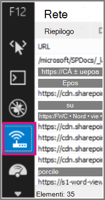

# <a name="content-delivery-networks-cdns"></a><span data-ttu-id="613cc-103">Reti per la distribuzione di contenuti (CDN)</span><span class="sxs-lookup"><span data-stu-id="613cc-103">Content Delivery Networks (CDNs)</span></span>

<span data-ttu-id="613cc-104">*Questo articolo può essere applicato sia a Microsoft 365 Enterprise che a Office 365 Enterprise.*</span><span class="sxs-lookup"><span data-stu-id="613cc-104">*This article applies to both Microsoft 365 Enterprise and Office 365 Enterprise.*</span></span>

<span data-ttu-id="613cc-105">Le reti CDN consentono di mantenere Office 365 veloce e affidabile per gli utenti finali.</span><span class="sxs-lookup"><span data-stu-id="613cc-105">CDNs help keep Office 365 fast and reliable for end users.</span></span> <span data-ttu-id="613cc-106">I servizi cloud come Office 365 usano reti CDN per memorizzare nella cache asset statici più vicini ai browser che li richiedono per velocizzare i download e ridurre la latenza percepita dagli utenti finali.</span><span class="sxs-lookup"><span data-stu-id="613cc-106">Cloud services like Office 365 use CDNs to cache static assets closer to the browsers requesting them to speed up downloads and reduce perceived end user latency.</span></span> <span data-ttu-id="613cc-107">Le informazioni contenute in questo argomento consentono di ottenere informazioni sulle reti per la distribuzione di contenuti (CDN) e su come vengono utilizzate da Office 365.</span><span class="sxs-lookup"><span data-stu-id="613cc-107">The information in this topic will help you learn about Content Delivery Networks (CDNs) and how they are used by Office 365.</span></span>

## <a name="what-exactly-is-a-cdn"></a><span data-ttu-id="613cc-108">Esattamente, che cos'è esattamente una rete per la distribuzione dei contenuti?</span><span class="sxs-lookup"><span data-stu-id="613cc-108">What exactly is a CDN?</span></span>

<span data-ttu-id="613cc-109">Una rete CDN è una rete geograficamente distribuita costituita da server proxy e file server nei datacenter connessi da reti backbone ad alta velocità.</span><span class="sxs-lookup"><span data-stu-id="613cc-109">A CDN is a geographically distributed network consisting of proxy and file servers in datacenters connected by high-speed backbone networks.</span></span> <span data-ttu-id="613cc-110">Le reti CDN vengono utilizzate per ridurre la latenza e i tempi di caricamento per un set specificato di file e oggetti in un sito Web o in un servizio.</span><span class="sxs-lookup"><span data-stu-id="613cc-110">CDNs are used to reduce latency and load times for a specified set of files and objects in a web site or service.</span></span> <span data-ttu-id="613cc-111">Una rete CDN può avere molte migliaia di endpoint per una manutenzione ottimale delle richieste in arrivo da qualsiasi posizione.</span><span class="sxs-lookup"><span data-stu-id="613cc-111">A CDN may have many thousands of endpoints for optimal servicing of incoming requests from any location.</span></span>

<span data-ttu-id="613cc-112">Le reti CDN vengono comunemente utilizzate per fornire download più veloci di contenuto generico per un sito Web o un servizio, ad esempio file javascript, icone e immagini, e possono anche fornire l'accesso privato al contenuto degli utenti, ad esempio file nelle raccolte documenti di SharePoint Online, file multimediali di streaming e codice personalizzato.</span><span class="sxs-lookup"><span data-stu-id="613cc-112">CDNs are commonly used to provide faster downloads of generic content for a web site or service such as javascript files, icons and images, and can also provide private access to user content such as files in SharePoint Online document libraries, streaming media files, and custom code.</span></span>

<span data-ttu-id="613cc-113">Le reti CDN vengono utilizzate dalla maggior parte dei servizi cloud aziendali.</span><span class="sxs-lookup"><span data-stu-id="613cc-113">CDNs are used by most enterprise cloud services.</span></span> <span data-ttu-id="613cc-114">I servizi cloud come Office 365 hanno milioni di clienti che scaricano una combinazione di contenuti proprietari (ad esempio messaggi di posta elettronica) e di contenuti generici (ad esempio icone) contemporaneamente.</span><span class="sxs-lookup"><span data-stu-id="613cc-114">Cloud services like Office 365 have millions of customers downloading a mix of proprietary content (such as emails) and generic content (such as icons) at one time.</span></span> <span data-ttu-id="613cc-115">È più efficiente posizionare le immagini utilizzate da tutti, come le icone, il più vicino possibile al computer dell'utente.</span><span class="sxs-lookup"><span data-stu-id="613cc-115">It's more efficient to put images everyone uses, like icons, as close to the user's computer as possible.</span></span> <span data-ttu-id="613cc-116">Non è pratico per ogni servizio cloud creare datacenter CDN che archiviano questo contenuto generico in ogni area metropolitana o persino in ogni hub Internet principale in tutto il mondo, quindi alcune di queste reti CDN sono condivise.</span><span class="sxs-lookup"><span data-stu-id="613cc-116">It isn't practical for every cloud service to build CDN datacenters that store this generic content in every metropolitan area, or even in every major Internet hub around the world, so some of these CDNs are shared.</span></span>

## <a name="how-do-cdns-make-services-work-faster"></a><span data-ttu-id="613cc-117">In che modo le reti per la distribuzione dei contenuti velocizzano l'esecuzione dei servizi?</span><span class="sxs-lookup"><span data-stu-id="613cc-117">How do CDNs make services work faster?</span></span>

<span data-ttu-id="613cc-118">Il download di oggetti comuni come le immagini e le icone del sito più e più volte può richiedere larghezza di banda di rete che può essere usata meglio per scaricare contenuti personali importanti, come messaggi di posta elettronica o documenti.</span><span class="sxs-lookup"><span data-stu-id="613cc-118">Downloading common objects like site images and icons over and over again can take up network bandwidth that can be better used for downloading important personal content, like email or documents.</span></span> <span data-ttu-id="613cc-119">Poiché Office 365 usa un'architettura che include reti CDN, le icone, gli script e altri contenuti generici possono essere scaricati dai server più vicini ai computer client, velocizzare i download.</span><span class="sxs-lookup"><span data-stu-id="613cc-119">Because Office 365 uses an architecture that includes CDNs, the icons, scripts, and other generic content can be downloaded from servers closer to client computers, making the downloads faster.</span></span> <span data-ttu-id="613cc-120">Ciò significa un accesso più rapido ai contenuti personali, che viene archiviato in modo sicuro nei datacenter di Office 365.</span><span class="sxs-lookup"><span data-stu-id="613cc-120">This means faster access to your personal content, which is securely stored in Office 365 datacenters.</span></span>

<span data-ttu-id="613cc-121">Le reti CDN consentono di migliorare le prestazioni del servizio cloud in diversi modi:</span><span class="sxs-lookup"><span data-stu-id="613cc-121">CDNs help to improve cloud service performance in several ways:</span></span>

- <span data-ttu-id="613cc-122">Le reti CDN spostano parte del carico di download di rete e file dal servizio cloud, liberando le risorse del servizio cloud per la gestione del contenuto degli utenti e di altri servizi riducendo la necessità di gestire le richieste di asset statici.</span><span class="sxs-lookup"><span data-stu-id="613cc-122">CDNs shift part of the network and file download burden away from the cloud service, freeing up cloud service resources for serving user content and other services by reducing the need to serve requests for static assets.</span></span>
- <span data-ttu-id="613cc-123">Le reti CDN sono state create per fornire l'accesso ai file a bassa latenza implementando reti e file server ad alte prestazioni e sfruttando protocolli di rete aggiornati come [HTTP/2](https://en.wikipedia.org/wiki/HTTP/2) con compressione altamente efficiente e multiplexing delle richieste.</span><span class="sxs-lookup"><span data-stu-id="613cc-123">CDNs are purpose built to provide low-latency file access by implementing high performance networks and file servers, and by leveraging updated network protocols such as [HTTP/2](https://en.wikipedia.org/wiki/HTTP/2) with highly efficient compression and request multiplexing.</span></span>
- <span data-ttu-id="613cc-124">Le reti CDN usano molti endpoint distribuiti a livello globale per rendere il contenuto disponibile il più vicino possibile agli utenti.</span><span class="sxs-lookup"><span data-stu-id="613cc-124">CDN networks use many globally distributed endpoints to make content available as close as possible to users.</span></span>

## <a name="the-office-365-cdn"></a><span data-ttu-id="613cc-125">Rete CDN di Office 365</span><span class="sxs-lookup"><span data-stu-id="613cc-125">The Office 365 CDN</span></span>

<span data-ttu-id="613cc-126">La rete CDN (Content Delivery Network) di Office 365 incorporata consente agli amministratori di Office 365 di offrire prestazioni migliori per le pagine di SharePoint Online dell'organizzazione memorizzando nella cache asset statici più vicini ai browser che le richiedono, in modo da velocizzare i download e ridurre la latenza.</span><span class="sxs-lookup"><span data-stu-id="613cc-126">The built-in Office 365 Content Delivery Network (CDN) allows Office 365 administrators to provide better performance for their organization's SharePoint Online pages by caching static assets closer to the browsers requesting them, which helps to speed up downloads and reduce latency.</span></span> <span data-ttu-id="613cc-127">La rete CDN di Office 365 usa il [protocollo HTTP/2](https://en.wikipedia.org/wiki/HTTP/2) per migliorare la compressione e la velocità di download.</span><span class="sxs-lookup"><span data-stu-id="613cc-127">The Office 365 CDN uses the [HTTP/2 protocol](https://en.wikipedia.org/wiki/HTTP/2) for improved compression and download speeds.</span></span>

> [!NOTE]
> <span data-ttu-id="613cc-128">La rete CDN di Office 365 è disponibile solo per i tenant **nel** cloud di produzione (in tutto il mondo).</span><span class="sxs-lookup"><span data-stu-id="613cc-128">The Office 365 CDN is only available to tenants in the **Production** (worldwide) cloud.</span></span> <span data-ttu-id="613cc-129">I tenant nel cloud del governo degli Stati Uniti, della Cina e della Germania non supportano attualmente la rete CDN di Office 365.</span><span class="sxs-lookup"><span data-stu-id="613cc-129">Tenants in the US Government, China and Germany clouds do not currently support the Office 365 CDN.</span></span>

<span data-ttu-id="613cc-130">La rete per la distribuzione di contenuti di Office 365 è costituita da diverse reti per la distribuzione di contenuti che consentono di ospitare le risorse statiche in più località o _origini_ e gestirle da reti globali ad alta velocità.</span><span class="sxs-lookup"><span data-stu-id="613cc-130">The Office 365 CDN is composed of multiple CDNs that allow you to host static assets in multiple locations, or _origins_, and serve them from global high-speed networks.</span></span> <span data-ttu-id="613cc-131">In base al tipo di contenuto che si vuole ospitare nella rete per la distribuzione di contenuti di Office 365, è possibile aggiungere origini **pubbliche**, origini **private** o entrambi.</span><span class="sxs-lookup"><span data-stu-id="613cc-131">Depending on the kind of content you want to host in the Office 365 CDN, you can add **public** origins, **private** origins or both.</span></span>

<span data-ttu-id="613cc-132"></span><span class="sxs-lookup"><span data-stu-id="613cc-132"></span></span>

<span data-ttu-id="613cc-133">Il contenuto nelle origini **pubbliche** della rete per la distribuzione di contenuti di Office 365 è accessibile in forma anonima, di conseguenza chiunque disponga degli URL delle risorse ospitate può accedervi.</span><span class="sxs-lookup"><span data-stu-id="613cc-133">Content in **public** origins within the Office 365 CDN is accessible anonymously, and can be accessed by anyone who has URLs to hosted assets.</span></span> <span data-ttu-id="613cc-134">Dal momento che l'accesso al contenuto in origini pubbliche è anonimo, è consigliabile usarle solo per memorizzare nella cache contenuti generici non riservati, ad esempio file JavaScript, script, icone e immagini.</span><span class="sxs-lookup"><span data-stu-id="613cc-134">Because access to content in public origins is anonymous, you should only use them to cache non-sensitive generic content such as javascript files, scripts, icons and images.</span></span> <span data-ttu-id="613cc-135">Per impostazione predefinita, la rete per la distribuzione di contenuti di Office 365 viene usata per il download di risorse generiche, ad esempio le applicazioni client di Office 365 da un'origine pubblica.</span><span class="sxs-lookup"><span data-stu-id="613cc-135">The Office 365 CDN is used by default for downloading generic resource assets like the Office 365 client applications from a public origin.</span></span>

<span data-ttu-id="613cc-136">**Le** origini private all'interno della rete CDN di Office 365 forniscono l'accesso privato al contenuto degli utenti, ad esempio raccolte documenti, siti e immagini proprietarie di SharePoint Online.</span><span class="sxs-lookup"><span data-stu-id="613cc-136">**Private** origins within the Office 365 CDN provide private access to user content such as SharePoint Online document libraries, sites and proprietary images.</span></span> <span data-ttu-id="613cc-137">L'accesso ai contenuti nelle origini private è protetto con token generati dinamicamente in modo da consentire l'accesso solo agli utenti che dispongono delle autorizzazioni per la raccolta documenti o per la posizione di archiviazione originali.</span><span class="sxs-lookup"><span data-stu-id="613cc-137">Access to content in private origins is secured with dynamically generated tokens so it can only be accessed by users with permissions to the original document library or storage location.</span></span> <span data-ttu-id="613cc-138">Le origini private della rete per la distribuzione di contenuti di Office 365 possono essere usate solo per contenuti di SharePoint Online. L'accesso alle risorse può avvenire solo tramite il reindirizzamento dal tenant di SharePoint Online.</span><span class="sxs-lookup"><span data-stu-id="613cc-138">Private origins in the Office 365 CDN can only be used for SharePoint Online content, and you can only access assets through redirection from your SharePoint Online tenant.</span></span>

<span data-ttu-id="613cc-139">Il servizio della rete per la distribuzione di contenuti di Office 365 è incluso nell'abbonamento a SharePoint Online.</span><span class="sxs-lookup"><span data-stu-id="613cc-139">The Office 365 CDN service is included as part of your SharePoint Online subscription.</span></span>

<span data-ttu-id="613cc-140">Per ulteriori informazioni su come usare la rete CDN di Office 365, vedere [Use the Office 365 content delivery network with SharePoint Online.](use-microsoft-365-cdn-with-spo.md)</span><span class="sxs-lookup"><span data-stu-id="613cc-140">For more information about how to use the Office 365 CDN, see [Use the Office 365 content delivery network with SharePoint Online](use-microsoft-365-cdn-with-spo.md).</span></span>

<span data-ttu-id="613cc-141">Per guardare una serie di brevi video che forniscono informazioni concettuali e HOWTO sull'utilizzo della rete CDN di Office 365, visitare il canale YouTube Modelli e procedure per sviluppatori di [SharePoint.](https://aka.ms/sppnp-videos)</span><span class="sxs-lookup"><span data-stu-id="613cc-141">To watch a series of short videos that provide conceptual and HOWTO information about using the Office 365 CDN, visit the [SharePoint Developer Patterns and Practices YouTube channel](https://aka.ms/sppnp-videos).</span></span>

## <a name="other-microsoft-cdns"></a><span data-ttu-id="613cc-142">Altre reti CDN Microsoft</span><span class="sxs-lookup"><span data-stu-id="613cc-142">Other Microsoft CDNs</span></span>

<span data-ttu-id="613cc-143">Anche se non fa parte della rete CDN di Office 365, è possibile utilizzare queste reti CDN nel tenant di Office 365 per accedere alle raccolte di sviluppo di SharePoint, al codice personalizzato e ad altri scopi che non rientrano nell'ambito della rete CDN di Office 365.</span><span class="sxs-lookup"><span data-stu-id="613cc-143">Although not a part of the Office 365 CDN, you can use these CDNs in your Office 365 tenant for access to SharePoint development libraries, custom code and other purposes that fall outside the scope of the Office 365 CDN.</span></span>

### <a name="azure-cdn"></a><span data-ttu-id="613cc-144">Azure CDN</span><span class="sxs-lookup"><span data-stu-id="613cc-144">Azure CDN</span></span>

>[!NOTE]
><span data-ttu-id="613cc-145">A partire dal terzo trimestre 2020, SharePoint Online inizierà a memorizzare nella cache i video nella rete CDN di Azure per supportare la riproduzione e l'affidabilità video migliorate.</span><span class="sxs-lookup"><span data-stu-id="613cc-145">Beginning in Q3 2020, SharePoint Online will begin caching videos on the Azure CDN to support improved video playback and reliability.</span></span> <span data-ttu-id="613cc-146">I video più popolari verranno trasmessi dall'endpoint della rete CDN più vicino all'utente.</span><span class="sxs-lookup"><span data-stu-id="613cc-146">Popular videos will be streamed from the CDN endpoint closest to the user.</span></span> <span data-ttu-id="613cc-147">Questi dati rimarranno entro il limite di conformità di Microsoft 365.</span><span class="sxs-lookup"><span data-stu-id="613cc-147">This data will remain within the Microsoft 365 compliance boundary.</span></span> <span data-ttu-id="613cc-148">Si tratta di un servizio gratuito per tutti i tenant e non richiede alcuna azione da parte del cliente per la configurazione.</span><span class="sxs-lookup"><span data-stu-id="613cc-148">This is a free service for all tenants and it does not require any customer action to configure.</span></span>

<span data-ttu-id="613cc-149">È possibile usare la **rete CDN** di Azure per distribuire la propria istanza della rete CDN per ospitare web part, raccolte e altre risorse personalizzate, che consente di applicare chiavi di accesso all'archiviazione della rete CDN e esercitare un maggiore controllo sulla configurazione della rete CDN.</span><span class="sxs-lookup"><span data-stu-id="613cc-149">You can use the **Azure CDN** to deploy your own CDN instance for hosting custom web parts, libraries and other resource assets, which allows you to apply access keys to your CDN storage and exert greater control over your CDN configuration.</span></span> <span data-ttu-id="613cc-150">L'uso della rete CDN di Azure non è gratuito e richiede una sottoscrizione di Azure.</span><span class="sxs-lookup"><span data-stu-id="613cc-150">Use of the Azure CDN is not free, and requires an Azure subscription.</span></span>

<span data-ttu-id="613cc-151">Per ulteriori informazioni su come configurare un'istanza della rete CDN di Azure, vedere Guida introduttiva: Integrare un account di archiviazione di [Azure con la rete CDN di Azure.](/azure/cdn/cdn-create-a-storage-account-with-cdn)</span><span class="sxs-lookup"><span data-stu-id="613cc-151">For more information on how to configure an Azure CDN instance, see [Quickstart: Integrate an Azure storage account with Azure CDN](/azure/cdn/cdn-create-a-storage-account-with-cdn).</span></span>

<span data-ttu-id="613cc-152">Per un esempio di come usare la rete CDN di Azure per ospitare web part di SharePoint, vedere [Deploy your SharePoint client-side web part to Azure CDN](/sharepoint/dev/spfx/web-parts/get-started/deploy-web-part-to-cdn).</span><span class="sxs-lookup"><span data-stu-id="613cc-152">For an example of how the Azure CDN can be used to host SharePoint web parts, see [Deploy your SharePoint client-side web part to Azure CDN](/sharepoint/dev/spfx/web-parts/get-started/deploy-web-part-to-cdn).</span></span>

<span data-ttu-id="613cc-153">Per informazioni sul modulo Azure CDN PowerShell, vedere [Manage Azure CDN with PowerShell.](/azure/cdn/cdn-manage-powershell)</span><span class="sxs-lookup"><span data-stu-id="613cc-153">For information about the Azure CDN PowerShell module, see [Manage Azure CDN with PowerShell](/azure/cdn/cdn-manage-powershell).</span></span>

### <a name="microsoft-ajax-cdn"></a><span data-ttu-id="613cc-154">Microsoft Ajax CDN</span><span class="sxs-lookup"><span data-stu-id="613cc-154">Microsoft Ajax CDN</span></span>

<span data-ttu-id="613cc-155">La **rete CDN Ajax** di Microsoft è una rete CDN di sola lettura che offre molte librerie di sviluppo popolari, tra cui jQuery (e tutte le altre librerie), ASP.NET Ajax, Bootstrap, Knockout.js e altri.</span><span class="sxs-lookup"><span data-stu-id="613cc-155">Microsoft's **Ajax CDN** is a read-only CDN that offers many popular development libraries including jQuery (and all of its other libraries), ASP.NET Ajax, Bootstrap, Knockout.js, and others.</span></span>
  
<span data-ttu-id="613cc-p112">Per includere gli script nel progetto, è sufficiente sostituire i riferimenti a queste raccolte disponibili pubblicamente con riferimenti all'indirizzo della rete CDN anziché includerlo nel progetto stesso. Per creare un collegamento a jQuery, ad esempio, utilizzare il codice seguente:</span><span class="sxs-lookup"><span data-stu-id="613cc-p112">To include these scripts in your project, simply replace any references to these publicly available libraries with references to the CDN address instead of including it in your project itself. For example, use the following code to link to jQuery:</span></span>

``` html
<script src=https://ajax.aspnetcdn.com/ajax/jquery-2.1.1.js> </script>
```

<span data-ttu-id="613cc-158">Per ulteriori informazioni su come usare la rete CDN di Microsoft Ajax, vedere [CdN di Microsoft Ajax.](/aspnet/ajax/cdn/overview)</span><span class="sxs-lookup"><span data-stu-id="613cc-158">For more information about how to use the Microsoft Ajax CDN, see [Microsoft Ajax CDN](/aspnet/ajax/cdn/overview).</span></span>

## <a name="how-does-office-365-use-content-from-a-cdn"></a><span data-ttu-id="613cc-159">In che modo Office 365 usa il contenuto di una rete CDN?</span><span class="sxs-lookup"><span data-stu-id="613cc-159">How does Office 365 use content from a CDN?</span></span>

<span data-ttu-id="613cc-160">Indipendentemente dalla rete CDN configurata per il tenant di Office 365, il processo di recupero dei dati di base è lo stesso.</span><span class="sxs-lookup"><span data-stu-id="613cc-160">Regardless of what CDN you configure for your Office 365 tenant, the basic data retrieval process is the same.</span></span>

1. <span data-ttu-id="613cc-161">Il client (un browser o un'applicazione client di Office) richiede i dati da Office 365.</span><span class="sxs-lookup"><span data-stu-id="613cc-161">Your client (a browser or Office client application) requests data from Office 365.</span></span>

2. <span data-ttu-id="613cc-162">Office 365 restituisce i dati direttamente al client oppure, se i dati fanno parte di un set di contenuti ospitati dalla rete CDN, reindirizza il client all'URL della rete CDN.</span><span class="sxs-lookup"><span data-stu-id="613cc-162">Office 365 either returns the data directly to your client or, if the data is part of a set of content hosted by the CDN, redirects your client to the CDN URL.</span></span>

    <span data-ttu-id="613cc-163">a.</span><span class="sxs-lookup"><span data-stu-id="613cc-163">a.</span></span> <span data-ttu-id="613cc-164">Se i dati sono già  memorizzati nella cache in un'origine pubblica, il client scarica i dati direttamente dalla posizione CDN più vicina al client.</span><span class="sxs-lookup"><span data-stu-id="613cc-164">If the data is already cached in a _public_ origin, your client downloads the data directly from the nearest CDN location to your client.</span></span>

    <span data-ttu-id="613cc-165">b.</span><span class="sxs-lookup"><span data-stu-id="613cc-165">b.</span></span> <span data-ttu-id="613cc-166">Se i dati sono già  memorizzati nella cache in un'origine privata, il servizio CDN controlla le autorizzazioni dell'account utente di Office 365 per l'origine.</span><span class="sxs-lookup"><span data-stu-id="613cc-166">If the data is already cached in a _private_ origin, the CDN service checks your Office 365 user account's permissions on the origin.</span></span> <span data-ttu-id="613cc-167">Se si dispone delle autorizzazioni, SharePoint Online genera in modo dinamico un URL personalizzato composto dal percorso dell'asset nella rete CDN e da due token di accesso e restituisce l'URL personalizzato al client.</span><span class="sxs-lookup"><span data-stu-id="613cc-167">If you have permissions, SharePoint Online dynamically generates a custom URL composed of the path to the asset in the CDN and two access tokens, and returns the custom URL to your client.</span></span> <span data-ttu-id="613cc-168">Il client scarica quindi i dati direttamente dalla posizione CDN più vicina al client usando l'URL personalizzato.</span><span class="sxs-lookup"><span data-stu-id="613cc-168">Your client then downloads the data directly from the nearest CDN location to your client using the custom URL.</span></span>

3. <span data-ttu-id="613cc-169">Se i dati non vengono memorizzati nella cache nella rete CDN, il nodo CDN richiede i dati da Office 365 e quindi li memorizza nella cache per un periodo di tempo dopo che il client scarica i dati.</span><span class="sxs-lookup"><span data-stu-id="613cc-169">If the data isn't cached at the CDN, the CDN node requests the data from Office 365 and then caches the data for a period of time after your client downloads the data.</span></span>

<span data-ttu-id="613cc-170">La rete CDN figura il datacenter più vicino al browser dell'utente e, usando il reindirizzamento, scarica i dati richiesti da lì.</span><span class="sxs-lookup"><span data-stu-id="613cc-170">The CDN figures out the closest datacenter to the user's browser and, using redirection, downloads the requested data from there.</span></span> <span data-ttu-id="613cc-171">Il reindirizzamento della rete CDN è rapido e consente agli utenti di risparmiare molto tempo di download.</span><span class="sxs-lookup"><span data-stu-id="613cc-171">CDN redirection is quick, and can save users a lot of download time.</span></span>

## <a name="how-should-i-set-up-my-network-so-that-cdns-work-best-with-office-365"></a><span data-ttu-id="613cc-172">Come configurare la rete in modo che le reti CDN funzionino al meglio con Office 365?</span><span class="sxs-lookup"><span data-stu-id="613cc-172">How should I set up my network so that CDNs work best with Office 365?</span></span>

<span data-ttu-id="613cc-173">Ridurre al minimo la latenza tra i client della rete e gli endpoint della rete CDN è la considerazione fondamentale per garantire prestazioni ottimali.</span><span class="sxs-lookup"><span data-stu-id="613cc-173">Minimizing latency between clients on your network and CDN endpoints is the key consideration for ensuring optimal performance.</span></span> <span data-ttu-id="613cc-174">È possibile utilizzare le procedure consigliate descritte in [Managing Office 365 endpoints](managing-office-365-endpoints.md) per garantire che la configurazione di rete consenta ai browser client di accedere direttamente alla rete CDN anziché instradare il traffico della rete CDN attraverso proxy centrali per evitare di introdurre latenza non necessaria.</span><span class="sxs-lookup"><span data-stu-id="613cc-174">You can use the best practices outlined in [Managing Office 365 endpoints](managing-office-365-endpoints.md) to ensure that your network configuration permits client browsers to access the CDN directly rather than routing CDN traffic through central proxies to avoid introducing unnecessary latency.</span></span>

<span data-ttu-id="613cc-175">È inoltre possibile leggere Principi di connettività di rete di [Office 365](./microsoft-365-network-connectivity-principles.md) per comprendere i concetti alla base dell'ottimizzazione delle prestazioni di rete di Office 365.</span><span class="sxs-lookup"><span data-stu-id="613cc-175">You can also read [Office 365 Network Connectivity Principles](./microsoft-365-network-connectivity-principles.md) to understand the concepts behind optimizing Office 365 network performance.</span></span>

## <a name="is-there-a-list-of-all-the-cdns-that-office-365-uses"></a><span data-ttu-id="613cc-176">Esiste un elenco di tutte le reti CDN utilizzate da Office 365?</span><span class="sxs-lookup"><span data-stu-id="613cc-176">Is there a list of all the CDNs that Office 365 uses?</span></span>

<span data-ttu-id="613cc-177">Le reti CDN in uso da Office 365 sono sempre soggette a modifiche e in molti casi sono presenti più partner CDN configurati nel caso in cui uno non sia disponibile.</span><span class="sxs-lookup"><span data-stu-id="613cc-177">The CDNs in use by Office 365 are always subject to change and in many cases there are multiple CDN partners configured in the event one is unavailable.</span></span> <span data-ttu-id="613cc-178">Le reti CDN principali utilizzate da Office 365 sono:</span><span class="sxs-lookup"><span data-stu-id="613cc-178">The primary CDNs used by Office 365 are:</span></span>

|<span data-ttu-id="613cc-179">Rete CDN</span><span class="sxs-lookup"><span data-stu-id="613cc-179">CDN</span></span>  |<span data-ttu-id="613cc-180">Company</span><span class="sxs-lookup"><span data-stu-id="613cc-180">Company</span></span>  |<span data-ttu-id="613cc-181">Usage</span><span class="sxs-lookup"><span data-stu-id="613cc-181">Usage</span></span>  |<span data-ttu-id="613cc-182">Collegamento</span><span class="sxs-lookup"><span data-stu-id="613cc-182">Link</span></span>  |
|---------|---------|---------|---------|
|<span data-ttu-id="613cc-183">Office 365 CDN</span><span class="sxs-lookup"><span data-stu-id="613cc-183">Office 365 CDN</span></span>     |<span data-ttu-id="613cc-184">Akamai</span><span class="sxs-lookup"><span data-stu-id="613cc-184">Akamai</span></span>         |<span data-ttu-id="613cc-185">Risorse generiche in origini pubbliche, contenuto utente di SharePoint in origini private</span><span class="sxs-lookup"><span data-stu-id="613cc-185">Generic assets in public origins, SharePoint user content in private origins</span></span>         |[<span data-ttu-id="613cc-186">Usare la rete per la distribuzione di contenuti di Office 365 con SharePoint Online</span><span class="sxs-lookup"><span data-stu-id="613cc-186">Use the Office 365 content delivery network with SharePoint Online</span></span>](use-microsoft-365-cdn-with-spo.md)         |
|<span data-ttu-id="613cc-187">Azure CDN</span><span class="sxs-lookup"><span data-stu-id="613cc-187">Azure CDN</span></span>     |<span data-ttu-id="613cc-188">Microsoft</span><span class="sxs-lookup"><span data-stu-id="613cc-188">Microsoft</span></span>         |<span data-ttu-id="613cc-189">Codice personalizzato, soluzioni SharePoint Framework</span><span class="sxs-lookup"><span data-stu-id="613cc-189">Custom code, SharePoint Framework solutions</span></span>         |[<span data-ttu-id="613cc-190">Microsoft Azure CDN</span><span class="sxs-lookup"><span data-stu-id="613cc-190">Microsoft Azure CDN</span></span>](https://azure.microsoft.com/documentation/services/cdn/)         |
|<span data-ttu-id="613cc-191">Rete CDN Di Microsoft Ajax (sola lettura)</span><span class="sxs-lookup"><span data-stu-id="613cc-191">Microsoft Ajax CDN (read only)</span></span>     |<span data-ttu-id="613cc-192">Microsoft</span><span class="sxs-lookup"><span data-stu-id="613cc-192">Microsoft</span></span>         |<span data-ttu-id="613cc-193">Librerie comuni per Ajax, jQuery, ASP.NET, Bootstrap, Knockout.js e così via.</span><span class="sxs-lookup"><span data-stu-id="613cc-193">Common libraries for Ajax, jQuery, ASP.NET, Bootstrap, Knockout.js etc.</span></span>         |[<span data-ttu-id="613cc-194">Microsoft Ajax CDN</span><span class="sxs-lookup"><span data-stu-id="613cc-194">Microsoft Ajax CDN</span></span>](/aspnet/ajax/cdn/overview)         |

## <a name="what-performance-gains-does-a-cdn-provide"></a><span data-ttu-id="613cc-195">Quali vantaggi offre una rete CDN?</span><span class="sxs-lookup"><span data-stu-id="613cc-195">What performance gains does a CDN provide?</span></span>

<span data-ttu-id="613cc-196">Esistono molti fattori coinvolti nella misurazione di differenze specifiche nelle prestazioni tra i dati scaricati direttamente da Office 365 e i dati scaricati da una rete CDN specifica, ad esempio la posizione relativa al tenant e all'endpoint CDN più vicino, il numero di asset in una pagina servita dalla rete CDN e le modifiche temporanee nella latenza di rete e nella larghezza di banda.</span><span class="sxs-lookup"><span data-stu-id="613cc-196">There are many factors involved in measuring specific differences in performance between data downloaded directly from Office 365 and data downloaded from a specific CDN, such as your location relative to your tenant and to the nearest CDN endpoint, the number of assets on a page that are served by the CDN, and transient changes in network latency and bandwidth.</span></span> <span data-ttu-id="613cc-197">Tuttavia, un semplice test A/B può aiutare a mostrare la differenza nel tempo di download per un file specifico.</span><span class="sxs-lookup"><span data-stu-id="613cc-197">However, a simple A/B test can help to show the difference in download time for a specific file.</span></span>

<span data-ttu-id="613cc-198">Le schermate seguenti illustrano la differenza nella velocità di download tra il percorso del file nativo in Office 365 e lo stesso file ospitato nella rete per la distribuzione di contenuti [di Microsoft Ajax.](/aspnet/ajax/cdn/overview)</span><span class="sxs-lookup"><span data-stu-id="613cc-198">The following screen shots illustrate the difference in download speed between the native file location in Office 365 and the same file hosted on the [Microsoft Ajax Content Delivery Network](/aspnet/ajax/cdn/overview).</span></span> <span data-ttu-id="613cc-199">Queste schermate sono disponibili nella **scheda Rete** negli strumenti di sviluppo di Internet Explorer 11.</span><span class="sxs-lookup"><span data-stu-id="613cc-199">These screen shots are from the **Network** tab in the Internet Explorer 11 developer tools.</span></span> <span data-ttu-id="613cc-200">Queste schermate mostrano la latenza della popolare libreria jQuery.</span><span class="sxs-lookup"><span data-stu-id="613cc-200">These screen shots show the latency on the popular library jQuery.</span></span> <span data-ttu-id="613cc-201">Per visualizzare questa schermata, in Internet Explorer, premere **F12** e selezionare la scheda **Rete** indicata con un'icona Wi-Fi.</span><span class="sxs-lookup"><span data-stu-id="613cc-201">To bring up this screen, in Internet Explorer, press **F12** and select the **Network** tab which is symbolized with a Wi-Fi icon.</span></span>
  

  
<span data-ttu-id="613cc-203">Questa cattura di schermata mostra la raccolta caricata nella raccolta pagine master nel sito di SharePoint Online stesso.</span><span class="sxs-lookup"><span data-stu-id="613cc-203">This screen shot shows the library uploaded to the master page gallery on the SharePoint Online site itself.</span></span> <span data-ttu-id="613cc-204">Il tempo necessario per caricare la raccolta è 1,51 secondi.</span><span class="sxs-lookup"><span data-stu-id="613cc-204">The time it took to upload the library is 1.51 seconds.</span></span>
  

  
<span data-ttu-id="613cc-206">La seconda schermata mostra lo stesso file fornito dalla rete CDN di Microsoft.</span><span class="sxs-lookup"><span data-stu-id="613cc-206">The second screen shot shows the same file delivered by Microsoft's CDN.</span></span> <span data-ttu-id="613cc-207">Questa volta la latenza è di circa 496 millisecondi.</span><span class="sxs-lookup"><span data-stu-id="613cc-207">This time the latency is around 496 milliseconds.</span></span> <span data-ttu-id="613cc-208">Questo è un grande miglioramento e mostra che un intero secondo viene rasato fuori il tempo totale per scaricare l'oggetto.</span><span class="sxs-lookup"><span data-stu-id="613cc-208">This is a large improvement and shows that a whole second is shaved off the total time to download the object.</span></span>
  


## <a name="is-my-data-safe"></a><span data-ttu-id="613cc-210">I dati sono protetti?</span><span class="sxs-lookup"><span data-stu-id="613cc-210">Is my data safe?</span></span>

<span data-ttu-id="613cc-211">Microsoft si occupa di proteggere i dati che eserciteranno l'azienda.</span><span class="sxs-lookup"><span data-stu-id="613cc-211">We take great care to protect the data that runs your business.</span></span> <span data-ttu-id="613cc-212">I dati archiviati nella rete CDN di Office 365 vengono crittografati sia in transito che in pausa e l'accesso ai dati nella rete CDN di Office 365 SharePoint è protetto dalle autorizzazioni utente e dall'autorizzazione token di Office 365.</span><span class="sxs-lookup"><span data-stu-id="613cc-212">Data stored in the Office 365 CDN is encrypted both in transit and at rest, and access to data in the Office 365 SharePoint CDN is secured by Office 365 user permissions and token authorization.</span></span> <span data-ttu-id="613cc-213">Le richieste di dati nella rete CDN di Office 365 SharePoint devono essere inviate (reindirizzate) dal tenant di Office 365 oppure non verrà generato un token di autorizzazione.</span><span class="sxs-lookup"><span data-stu-id="613cc-213">Requests for data in the Office 365 SharePoint CDN must be referred (redirected) from your Office 365 tenant or an authorization token will not be generated.</span></span>

<span data-ttu-id="613cc-214">Per garantire che i dati rimangano sicuri, è consigliabile non archiviare mai il contenuto dell'utente o altri dati sensibili in una rete CDN pubblica.</span><span class="sxs-lookup"><span data-stu-id="613cc-214">To ensure that your data remains secure, we recommend that you never store user content or other sensitive data in a public CDN.</span></span> <span data-ttu-id="613cc-215">Poiché l'accesso ai dati in una rete CDN pubblica è anonimo, le reti CDN pubbliche devono essere utilizzate solo per ospitare contenuto generico, ad esempio file script Web, icone, immagini e altri asset non sensibili.</span><span class="sxs-lookup"><span data-stu-id="613cc-215">Because access to data in a public CDN is anonymous, public CDNs should only be used to host generic content such as web script files, icons, images and other non-sensitive assets.</span></span>

> [!NOTE]
> <span data-ttu-id="613cc-216">I provider cdN di terze parti possono avere standard di privacy e conformità diversi dagli impegni delineati dal Centro protezione di Office 365.</span><span class="sxs-lookup"><span data-stu-id="613cc-216">3rd party CDN providers may have privacy and compliance standards that differ from the commitments outlined by the Office 365 Trust Center.</span></span> <span data-ttu-id="613cc-217">I dati memorizzati nella cache tramite il servizio CDN potrebbero non essere conformi alle condizioni DPT (Data Processing Terms) di Microsoft e potrebbero essere esterni ai limiti di conformità del Centro protezione di Office 365.</span><span class="sxs-lookup"><span data-stu-id="613cc-217">Data cached through the CDN service may not conform to the Microsoft Data Processing Terms (DPT), and may be outside of the Office 365 Trust Center compliance boundaries.</span></span>

<span data-ttu-id="613cc-218">Per informazioni approfondite sulla privacy e sulla protezione dei dati per i provider di reti CDN di Office 365, visitare il sito Web seguente:</span><span class="sxs-lookup"><span data-stu-id="613cc-218">For in-depth information about privacy and data protection for Office 365 CDN providers, visit the following:</span></span>  

- <span data-ttu-id="613cc-219">Per ulteriori informazioni sulla privacy e sulla protezione dei dati di Office 365, vedere Centro protezione [Microsoft](https://www.microsoft.com/trustcenter)</span><span class="sxs-lookup"><span data-stu-id="613cc-219">Learn more about Office 365 privacy and data protection at the [Microsoft Trust Center](https://www.microsoft.com/trustcenter)</span></span>
- <span data-ttu-id="613cc-220">Per ulteriori informazioni sulla privacy e sulla protezione dei dati di [Akamai,](https://www.akamai.com/us/en/about/compliance/data-protection-at-akamai.jsp) vedere Il Centro protezione della privacy di Akamai</span><span class="sxs-lookup"><span data-stu-id="613cc-220">Learn more about Akamai’s privacy and data protection at the [Akamai Privacy Trust Center](https://www.akamai.com/us/en/about/compliance/data-protection-at-akamai.jsp)</span></span>
- <span data-ttu-id="613cc-221">Per altre informazioni sulla privacy e sulla protezione dei dati di [Azure,](https://azure.microsoft.com/overview/trusted-cloud/) vedere Centro protezione di Azure</span><span class="sxs-lookup"><span data-stu-id="613cc-221">Learn more about Azure privacy and data protection at the [Azure Trust Center](https://azure.microsoft.com/overview/trusted-cloud/)</span></span>

## <a name="how-can-i-secure-my-network-with-all-these-3rd-party-services"></a><span data-ttu-id="613cc-222">Come è possibile proteggere la rete con tutti questi servizi di terze parti?</span><span class="sxs-lookup"><span data-stu-id="613cc-222">How can I secure my network with all these 3rd party services?</span></span>

<span data-ttu-id="613cc-223">L'utilizzo di un ampio set di servizi partner consente a Office 365 di ridimensionare e soddisfare i requisiti di disponibilità, nonché di migliorare l'esperienza utente quando si usa Office 365.</span><span class="sxs-lookup"><span data-stu-id="613cc-223">Leveraging an extensive set of partner services allows Office 365 to scale and meet availability requirements as well as enhance the user experience when using Office 365.</span></span> <span data-ttu-id="613cc-224">I servizi di terze parti di Office 365 includono entrambi gli elenchi di revoche di certificati; ad esempio crl.microsoft.com o sa.symcb.com e CDN; ad esempio r3.res.outlook.com.</span><span class="sxs-lookup"><span data-stu-id="613cc-224">The 3rd party services Office 365 leverages include both certificate revocation lists; such as crl.microsoft.com or sa.symcb.com, and CDNs; such as r3.res.outlook.com.</span></span> <span data-ttu-id="613cc-225">Ogni FQDN della rete CDN generato da Office 365 è un FQDN personalizzato per Office 365.</span><span class="sxs-lookup"><span data-stu-id="613cc-225">Every CDN FQDN generated by Office 365 is a custom FQDN for Office 365.</span></span> <span data-ttu-id="613cc-226">Se si viene inviati a un nome di dominio completo su richiesta di Office 365, è possibile essere certi che il provider della rete CDN controlla il nome di dominio completo e il contenuto sottostante in tale posizione.</span><span class="sxs-lookup"><span data-stu-id="613cc-226">If you're sent to a FQDN at the request of Office 365 you can be assured that the CDN provider controls the FQDN and the underlying content at that location.</span></span>
  
<span data-ttu-id="613cc-227">Per i clienti che desiderano separare le richieste destinate a un datacenter di Microsoft o Office 365 dalle richieste destinate a una terza parte, abbiamo scritto indicazioni sulla gestione degli endpoint di [Office 365.](https://support.office.com/article/99cab9d4-ef59-4207-9f2b-3728eb46bf9a)</span><span class="sxs-lookup"><span data-stu-id="613cc-227">For customers that want to segregate requests destined for a Microsoft or Office 365 datacenter from requests that are destined for a 3rd party, we've written up guidance on [Managing Office 365 endpoints](https://support.office.com/article/99cab9d4-ef59-4207-9f2b-3728eb46bf9a).</span></span>

## <a name="is-there-a-list-of-all-the-fqdns-that-leverage-cdns"></a><span data-ttu-id="613cc-228">Esiste un elenco di tutti gli FQDN che sfruttano le reti CDN?</span><span class="sxs-lookup"><span data-stu-id="613cc-228">Is there a list of all the FQDNs that leverage CDNs?</span></span>

<span data-ttu-id="613cc-229">L'elenco di FQDN e il modo in cui sfruttano le reti CDN cambiano nel tempo.</span><span class="sxs-lookup"><span data-stu-id="613cc-229">The list of FQDNs and how they leverage CDNs change over time.</span></span> <span data-ttu-id="613cc-230">Fare riferimento alla pagina url e intervalli di indirizzi IP di [Office 365](./urls-and-ip-address-ranges.md) pubblicati per essere aggiornati sugli FQDN più recenti che sfruttano le reti CDN.</span><span class="sxs-lookup"><span data-stu-id="613cc-230">Refer to our published [Office 365 URLs and IP address ranges](./urls-and-ip-address-ranges.md) page to get up to date on the latest FQDNs that leverage CDNs.</span></span>

<span data-ttu-id="613cc-231">È inoltre possibile utilizzare il servizio Web Indirizzo IP e URL di [Office 365](microsoft-365-ip-web-service.md) per richiedere gli URL e gli intervalli di indirizzi IP correnti di Office 365 formattati come CSV o JSON.</span><span class="sxs-lookup"><span data-stu-id="613cc-231">You can also use the [Office 365 IP Address and URL Web service](microsoft-365-ip-web-service.md) to request the current Office 365 URLs and IP address ranges formatted as CSV or JSON.</span></span>

## <a name="can-i-use-my-own-cdn-and-cache-content-on-my-local-network"></a><span data-ttu-id="613cc-232">È possibile usare la rete CDN e memorizzare nella cache il contenuto nella rete locale?</span><span class="sxs-lookup"><span data-stu-id="613cc-232">Can I use my own CDN and cache content on my local network?</span></span>

<span data-ttu-id="613cc-233">Stiamo continuamente cercando nuovi modi per supportare le esigenze dei nostri clienti e stiamo attualmente esplorando l'uso di soluzioni proxy di memorizzazione nella cache e altre soluzioni CDN locali.</span><span class="sxs-lookup"><span data-stu-id="613cc-233">We're continually looking for new ways to support our customers needs and are currently exploring the use of caching proxy solutions and other on-premises CDN solutions.</span></span>

<span data-ttu-id="613cc-234">Anche se non fa parte della rete CDN di Office 365, è anche possibile usare la **rete CDN** di Azure per ospitare web part, raccolte e altre risorse personalizzate, che consente di applicare i tasti di scelta all'archiviazione della rete CDN ed esercitare un maggiore controllo sulla configurazione della rete CDN.</span><span class="sxs-lookup"><span data-stu-id="613cc-234">Although it is not a part of the Office 365 CDN, you can also use the **Azure CDN** for hosting custom web parts, libraries and other resource assets, which allows you to apply access keys to your CDN storage and exert greater control over your CDN configuration.</span></span> <span data-ttu-id="613cc-235">L'uso della rete CDN di Azure non è gratuito e richiede una sottoscrizione di Azure.</span><span class="sxs-lookup"><span data-stu-id="613cc-235">Use of the Azure CDN is not free, and requires an Azure subscription.</span></span> <span data-ttu-id="613cc-236">Per ulteriori informazioni su come configurare un'istanza della rete CDN di Azure, vedere Guida introduttiva: Integrare un account di archiviazione di [Azure con la rete CDN di Azure.](/azure/cdn/cdn-create-a-storage-account-with-cdn)</span><span class="sxs-lookup"><span data-stu-id="613cc-236">For more information on how to configure an Azure CDN instance, see [Quickstart: Integrate an Azure storage account with Azure CDN](/azure/cdn/cdn-create-a-storage-account-with-cdn).</span></span>

## <a name="im-using-azure-expressroute-for-office-365-does-that-change-things"></a><span data-ttu-id="613cc-237">Se si usa Azure ExpressRoute per Office 365, le cose cambiano?</span><span class="sxs-lookup"><span data-stu-id="613cc-237">I'm using Azure ExpressRoute for Office 365, does that change things?</span></span>

<span data-ttu-id="613cc-238">[Azure ExpressRoute per Office 365](azure-expressroute.md) offre una connessione dedicata all'infrastruttura di Office 365 che è segregata da Internet pubblico.</span><span class="sxs-lookup"><span data-stu-id="613cc-238">[Azure ExpressRoute for Office 365](azure-expressroute.md) provides a dedicated connection to Office 365 infrastructure that is segregated from the public internet.</span></span> <span data-ttu-id="613cc-239">Ciò significa che i client dovranno comunque connettersi tramite connessioni non ExpressRoute per connettersi alle reti CDN e ad altre infrastrutture Microsoft non esplicitamente incluse nell'elenco dei servizi supportati da ExpressRoute.</span><span class="sxs-lookup"><span data-stu-id="613cc-239">This means that clients will still need to connect over non-ExpressRoute connections to connect to CDNs and other Microsoft infrastructure that is not explicitly included in the list of services supported by ExpressRoute.</span></span> <span data-ttu-id="613cc-240">Per ulteriori informazioni su come instradare il traffico specifico, ad esempio le richieste destinate alle reti CDN, vedere Gestione del traffico di rete di [Office 365.](routing-with-expressroute.md)</span><span class="sxs-lookup"><span data-stu-id="613cc-240">For more information about how to route specific traffic such as requests destined for CDNs, refer to [Office 365 network traffic management](routing-with-expressroute.md).</span></span>

## <a name="can-i-use-cdns-with-sharepoint-server-on-premises"></a><span data-ttu-id="613cc-241">È possibile utilizzare reti CDN con SharePoint Server locale?</span><span class="sxs-lookup"><span data-stu-id="613cc-241">Can I use CDNs with SharePoint Server on-premises?</span></span>

<span data-ttu-id="613cc-242">L'uso delle reti CDN ha senso solo in un contesto di SharePoint Online e deve essere evitato con SharePoint Server.</span><span class="sxs-lookup"><span data-stu-id="613cc-242">Using CDNs only makes sense in a SharePoint Online context and should be avoided with SharePoint Server.</span></span> <span data-ttu-id="613cc-243">Infatti, tutti i vantaggi relativi alla posizione geografica non permangono se il server è locale o geograficamente vicino.</span><span class="sxs-lookup"><span data-stu-id="613cc-243">This is because all of the advantages around geographic location do not hold true if the server is located on-premises or geographically close anyway.</span></span> <span data-ttu-id="613cc-244">Inoltre, se è presente una connessione di rete ai server in cui è ospitato, il sito può essere utilizzato senza una connessione Internet e pertanto non può recuperare i file CDN.</span><span class="sxs-lookup"><span data-stu-id="613cc-244">Additionally, if there is a network connection to the servers where it's hosted, then the site may be used without an Internet connection and therefore cannot retrieve the CDN files.</span></span> <span data-ttu-id="613cc-245">In caso contrario, è consigliabile utilizzare una rete CDN se è disponibile e stabile per la raccolta e i file necessari per il sito.</span><span class="sxs-lookup"><span data-stu-id="613cc-245">Otherwise, you should use a CDN if there is one available and stable for the library and files you need for your site.</span></span>
  
<span data-ttu-id="613cc-246">Ecco un collegamento breve per tornare alla pagina: [https://aka.ms/o365cdns]()</span><span class="sxs-lookup"><span data-stu-id="613cc-246">Here's a short link you can use to come back: [https://aka.ms/o365cdns]()</span></span>
  
## <a name="see-also"></a><span data-ttu-id="613cc-247">Vedere anche</span><span class="sxs-lookup"><span data-stu-id="613cc-247">See also</span></span>

[<span data-ttu-id="613cc-248">Principi della connettività di rete di Office 365</span><span class="sxs-lookup"><span data-stu-id="613cc-248">Office 365 Network Connectivity Principles</span></span>](./microsoft-365-network-connectivity-principles.md)

[<span data-ttu-id="613cc-249">Valutazione della connettività di rete di Office 365</span><span class="sxs-lookup"><span data-stu-id="613cc-249">Assessing Office 365 network connectivity</span></span>](assessing-network-connectivity.md)

[<span data-ttu-id="613cc-250">Gestione degli endpoint di Office 365</span><span class="sxs-lookup"><span data-stu-id="613cc-250">Managing Office 365 endpoints</span></span>](managing-office-365-endpoints.md)

[<span data-ttu-id="613cc-251">URL e intervalli di indirizzi IP per Office 365</span><span class="sxs-lookup"><span data-stu-id="613cc-251">Office 365 URLs and IP address ranges</span></span>](./urls-and-ip-address-ranges.md)

[<span data-ttu-id="613cc-252">Usare la rete per la distribuzione di contenuti di Office 365 con SharePoint Online</span><span class="sxs-lookup"><span data-stu-id="613cc-252">Use the Office 365 content delivery network with SharePoint Online</span></span>](use-microsoft-365-cdn-with-spo.md)

[<span data-ttu-id="613cc-253">Centro protezione Microsoft</span><span class="sxs-lookup"><span data-stu-id="613cc-253">Microsoft Trust Center</span></span>](https://www.microsoft.com/trustcenter)

[<span data-ttu-id="613cc-254">Ottimizzare le prestazioni di Office 365</span><span class="sxs-lookup"><span data-stu-id="613cc-254">Tune Office 365 performance</span></span>](tune-microsoft-365-performance.md)