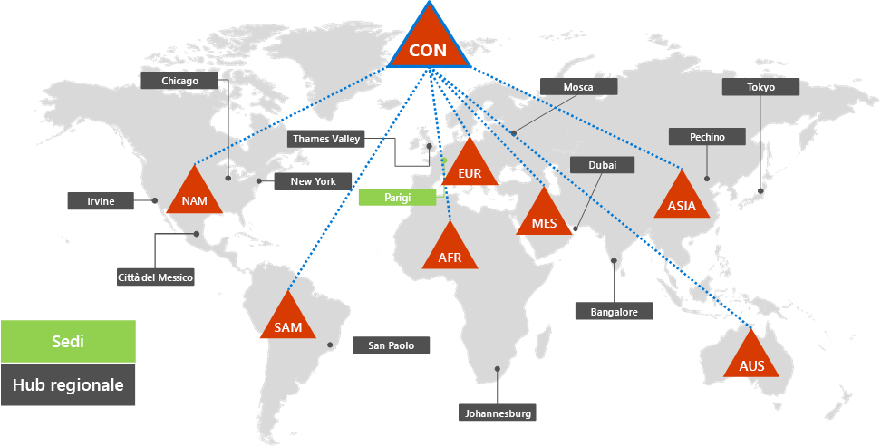
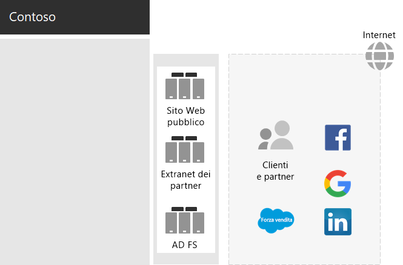
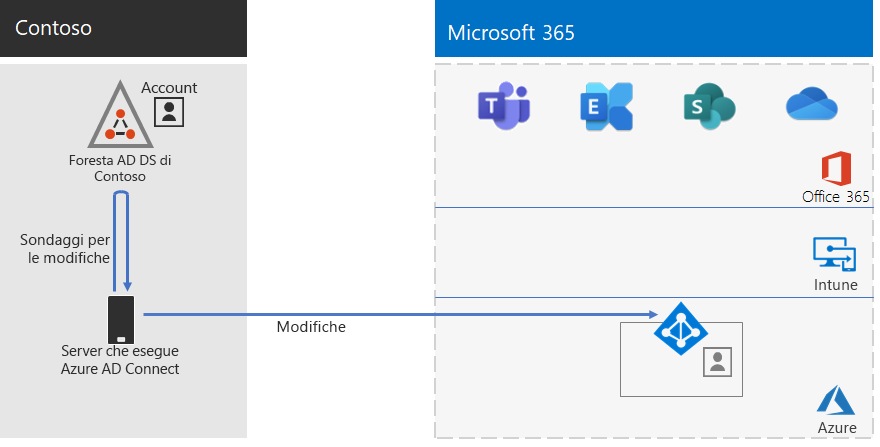
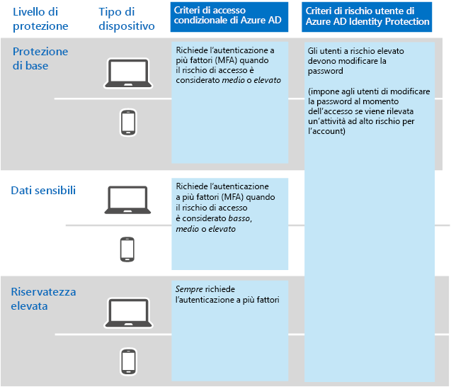

# Identità per Contoso Corporation

**Riepilogo:** Come Contoso sfrutta l’identità come servizio (IDaaS) e fornisce l'autenticazione basata su cloud per i dipendenti e l'autenticazione federata per i partner e clienti.

Microsoft fornisce un'identità come servizio (IDaaS) per le offerte cloud con Azure Active Directory (Azure AD). Per adottare Microsoft 365 Enterprise, la soluzione IDaaS di Contoso deve sfruttare i provider di identità locali e includere l'autenticazione federata con i provider di identità di terze parti esistenti e attendibili.

## Foresta di Servizi di dominio di Active Directory di Contoso

Contoso usa una foresta di Servizi di dominio di Active Directory (AD DS) singola per contoso.com con sette sottodomini, uno per ogni area geografica del mondo. La sede principale, le sedi centrali regionali e le filiali contengono controller di dominio per l'autorizzazione e l'autenticazione locali.

Nella figura 1 viene mostrata la foresta di Contoso con domini regionali per le varie parti del mondo in cui sono presenti sedi centrali regionali.

 
**Figura 1: foresta di Contoso e domini a livello mondiale**

Contoso ha voluto utilizzare gli account e i gruppi della foresta contoso.com per l'autenticazione e l'autorizzazione per i servizi e i carichi di lavoro su Microsoft 365.

## Infrastruttura di autenticazione federata di Contoso

Contoso consente:

- Ai clienti di usare il proprio account Microsoft, Facebook o Google Mail per accedere al proprio sito Web pubblico.
- Ai fornitori e ai partner di usare il proprio account LinkedIn, Salesforce o Google Mail per accedere all’extranet dei partner.

Nella figura 2 viene mostrata la rete perimetrale di Contoso contenente un sito Web pubblico, una rete extranet partner e un set di server Active Directory Federation Service (AD FS). La rete perimetrale è connessa alla rete Internet che contiene clienti, partner e servizi Internet.

**Figura 2: Supporto di Contoso per l'autenticazione federata di clienti e partner**
 
I server AD FS nella DMZ autenticano le credenziali dei clienti per l'accesso al sito Web pubblico e le credenziali dei partner per l'accesso all’extranet dei partner.

Contoso ha deciso di mantenere questa infrastruttura e dedicarla alle autenticazioni di clienti e partner. I tecnici dell’identità di Contoso stanno studiando la conversione di questa infrastruttura alle soluzioni [B2B](https://docs.microsoft.com/azure/active-directory/b2b/hybrid-organizations) e [B2C](https://docs.microsoft.com/azure/active-directory-b2c/solution-articles) di Azure AD.

## Identità ibrida con sincronizzazione dell'hash delle password per l'autenticazione basata su cloud

Contoso ha voluto sfruttare la foresta AD DS locale per l'autenticazione alle risorse cloud Microsoft 365. Ha deciso per la sincronizzazione dell'hash delle password (PHS).

PHS sincronizza la foresta locale di Active Directory con il tenant Azure AD dell'abbonamento a Microsoft 365 Enterprise, copiando gli account utente e gruppo e una versione hash della password dell'account utente. 

Per eseguire la sincronizzazione delle directory in corso, Contoso ha distribuito lo strumento Azure AD Connect in un server nel Data Center di Parigi. La figura 3 mostra il server che esegue Azure AD Connect mentre sonda la foresta AD DS di Contoso per le modifiche e quindi sincronizza le modifiche apportate con il tenant Azure AD.

 
**Figura 3: infrastruttura di sincronizzazione della directory PHS di Contoso**

## Criteri di accesso condizionale per l’identità e l’accesso dei dispositivi

Contoso ha creato un insieme di [criteri di accesso condizionale](identity-access-policies.md) per Azure AD e Intune per tre livelli di protezione:

- **Base** le protezioni si applicano a tutti gli account utente
- **Riservate** le protezioni si applicano a dirigenti senior e staff esecutivo
- Le protezioni di**Riservatezza elevata** si applicano a utenti specifici nei dipartimenti finanziario, legale e di ricerca che hanno accesso a dati altamente riservati

La figura 4 mostra l’insieme di risultati di identità e i criteri di accesso condizionale per dispositivi.

 
**Figura 4: i criteri di accesso condizionale di identità e dispositivi di Contoso**

## Passaggio successivo

[Informazioni su](contoso-win10.md) come Contoso si avvale dell'infrastruttura di System Center Configuration Manager per distribuire e mantenere Windows 10 Enterprise nell'organizzazione.

## Vedere anche

[Identità per Microsoft 365 Enterprise](identity-infrastructure.md)

[Guida alla distribuzione](deploy-microsoft-365-enterprise.md)

[Guide dei laboratori di testing](m365-enterprise-test-lab-guides.md)
