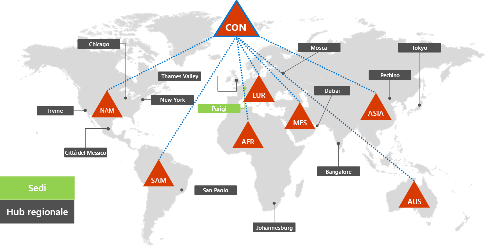
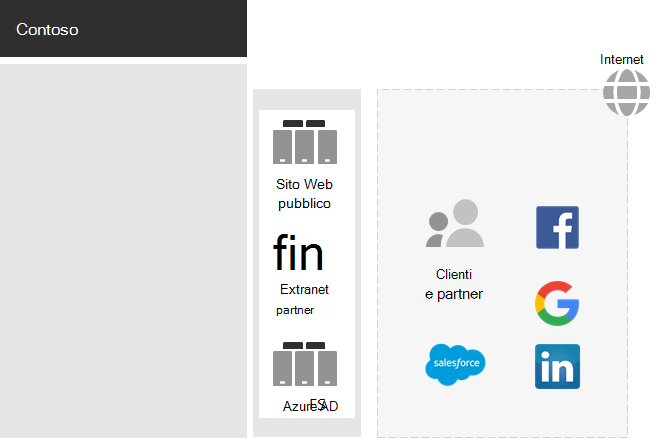
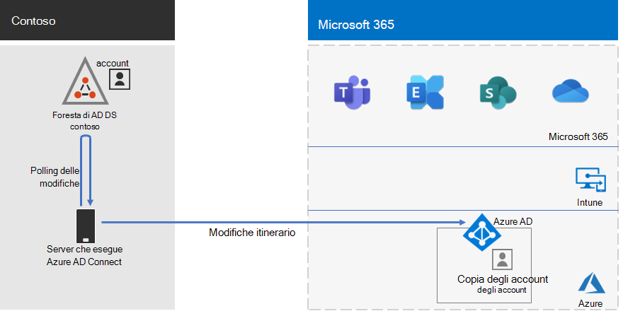
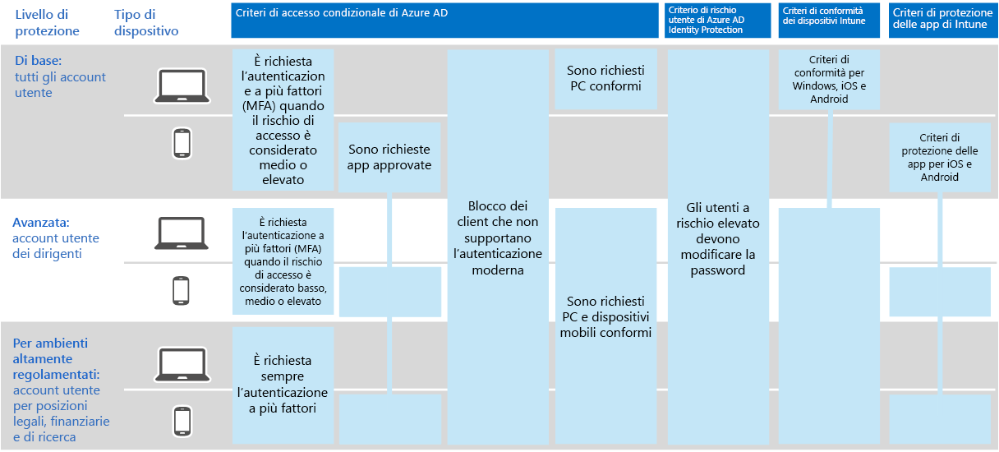

# Identità per Contoso Corporation

Microsoft fornisce l'identità come servizio (IDaaS) tra le offerte cloud tramite Azure Active Directory (Azure AD). Per adottare Microsoft 365 per Enterprise, la soluzione Contoso IDaaS deve utilizzare il provider di identità locale e includere l'autenticazione federata con i provider di identità di terze parti attendibili esistenti.

## La foresta di servizi di dominio contoso Active Directory

Contoso utilizza una singola foresta di servizi di dominio Active Directory per Contoso \. com con sette sottodomini, uno per ogni area del mondo. La sede principale, le sedi centrali regionali e le filiali contengono controller di dominio per l'autorizzazione e l'autenticazione locali.

Ecco la foresta Contoso con domini regionali per le diverse parti del mondo che contengono hub regionali.

 
Contoso ha deciso di utilizzare gli account e i gruppi nella \. foresta com contoso per l'autenticazione e l'autorizzazione per i carichi di lavoro e i servizi di Microsoft 365.

## L'infrastruttura di autenticazione federata contoso

Contoso consente:

- I clienti possono utilizzare gli account Microsoft, Facebook o Google mail per accedere al sito Web pubblico della società.
- Fornitori e partner per l'utilizzo dei propri account LinkedIn, Salesforce o Google mail per accedere all'Extranet dei partner della società.

Ecco la DMZ contoso contenente un sito Web pubblico, un'Extranet di partner e un set di server Active Directory Federation Services (AD FS). La DMZ è connessa a Internet che contiene clienti, partner e servizi Internet.

 
I server AD FS nella DMZ facilitano l'autenticazione delle credenziali del cliente dai rispettivi provider di identità per accedere al sito Web pubblico e le credenziali dei partner per l'accesso all'Extranet dei partner.

Contoso ha deciso di mantenere questa infrastruttura e di dedicarla all'autenticazione dei clienti e dei partner. Gli architetti dell'identità contoso stanno studiando la conversione di questa infrastruttura nelle soluzioni di Azure AD [B2B](https://docs.microsoft.com/azure/active-directory/b2b/hybrid-organizations) e [B2C](https://docs.microsoft.com/azure/active-directory-b2c/solution-articles) .

## Identità ibrida con sincronizzazione dell'hash delle password per l'autenticazione basata su cloud

Contoso desiderava utilizzare la foresta di servizi di dominio Active Directory locale per l'autenticazione nelle risorse cloud di Microsoft 365. Ha deciso di utilizzare la sincronizzazione degli hash delle password (pH).

PH sincronizza la foresta di servizi di dominio Active Directory locale con il tenant di Azure AD della sottoscrizione Microsoft 365 per Enterprise, copiando gli account utente e di gruppo e una versione con hash delle password degli account utente.

Per eseguire la sincronizzazione della directory, Contoso ha distribuito lo strumento Azure AD Connect su un server nel datacenter di Parigi.

Di seguito è indicato il server che esegue Azure AD Connect polling della foresta contoso AD DS per le modifiche e quindi la sincronizzazione delle modifiche con il tenant di Azure AD.

 
## Criteri di accesso condizionale per l’identità e l’accesso dei dispositivi

Contoso ha creato un insieme di [criteri di accesso condizionale](identity-access-policies.md) per Azure AD e Intune per tre livelli di protezione:

- Le protezioni di *base* si applicano a tutti gli account utente.
- Le protezioni *sensibili* sono valide per i dirigenti e gli addetti ai vertici.
- Le protezioni *altamente regolamentate* si applicano agli utenti specifici nei reparti finanziari, legali e di ricerca che hanno accesso a dati fortemente regolamentati.

Di seguito viene indicato l'insieme risultante dei criteri di accesso condizionale per l'identità e il dispositivo contoso.

 
## Passaggio successivo

Informazioni su come Contoso utilizza l'infrastruttura di Microsoft endpoint Configuration Manager per [distribuire e mantenere l'attuale Windows 10 Enterprise](contoso-win10.md) all'interno dell'organizzazione.

## Vedere anche

[Roadmap delle identità per Microsoft 365](identity-roadmap-microsoft-365.md)

[Panoramica di Microsoft 365 per le aziende](microsoft-365-overview.md)

[Guide dei laboratori di testing](m365-enterprise-test-lab-guides.md)
