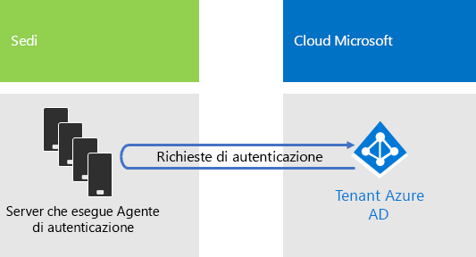

# Identità per Contoso Corporation

**Riepilogo:** Come Contoso sfrutta l’identità come servizio (IDaaS) e fornisce l'autenticazione basata su cloud per i dipendenti e l'autenticazione federata per i partner e clienti.

Microsoft fornisce un'identità come servizio (IDaaS) tra le offerte cloud con Azure Active Directory (AD). Per adottare Microsoft 365 Enterprise, la soluzione IDaaS di Contoso doveva sfruttare i provider di identità locali e includere l’autenticazione federata con i provider di identità di terze parti esistenti e attendibili.

## Foresta di Windows Server AD di Contoso

Contoso utilizza una singola foresta Windows Server Active Directory (AD) per contoso.com con sette sottodomini, uno per ogni area geografica del mondo. Sede centrale, hub regionali e uffici secondari contengono controller di dominio per l'autenticazione e l'autorizzazione locale.

Nella figura 1 viene mostrata la foresta di Contoso con domini regionali per le varie parti del mondo in cui sono presenti sedi centrali regionali.

 
**Figura 1: foresta di Contoso e domini a livello mondiale**

Contoso desidera utilizzare gli account e i gruppi della foresta contoso.com per l'autenticazione e l'autorizzazione per le app basate su cloud e per i carichi di lavoro.

## Infrastruttura di autenticazione federata di Contoso

Contoso consente:

- Ai clienti di usare il proprio account Microsoft, Facebook o Google Mail per accedere al proprio sito Web pubblico.
- Ai fornitori e ai partner di usare il proprio account LinkedIn, Salesforce o Google Mail per accedere all’extranet dei partner.

Nella figura 2 viene mostrata la rete perimetrale di Contoso contenente un sito Web pubblico, una rete extranet partner e un set di server Active Directory Federation Service (AD FS). La rete perimetrale è connessa alla rete Internet che contiene clienti, partner e servizi Internet.

**Figura 2: Supporto di Contoso per l'autenticazione federata di clienti e partner**
 
I server AD FS nella DMZ autenticano le credenziali dei clienti per l'accesso al sito Web pubblico e le credenziali dei partner per l'accesso all’extranet dei partner.

Contoso ha deciso di mantenere questa infrastruttura e dedicarla alle autenticazioni di clienti e partner. I tecnici dell’identità di Contoso stanno studiando la conversione di questa infrastruttura alle soluzioni [B2B](https://docs.microsoft.com/azure/active-directory/b2b/hybrid-organizations) e [B2C](https://docs.microsoft.com/azure/active-directory-b2c/solution-articles) di Azure AD.

## Identità ibrida con autenticazione pass-through per l'autenticazione basata su cloud

Contoso desiderava sfruttare la foresta di Windows Server AD locale per l'autenticazione alle risorse del cloud di Microsoft 365. Ha scelto l’autenticazione pass-through (PTA) con la sincronizzazione hash delle password (PHS).

### Autenticazione PTA

Per l'autenticazione delle credenziali dell'utente, Contoso usa PTA. Quando un utente di Contoso accede a una risorsa basata sul cloud, le credenziali inviate vengono trasmesse da Azure AD a un server che esegue un agente di autenticazione nel datacenter della sede centrale di Contoso. Uno di questi server agente di autenticazione convalida le credenziali utente per conto di Azure AD.

La Figura 3 mostra un set di server nella sede centrale di Contoso che eseguono l'agente di autenticazione e che elaborano le richieste di autenticazione trasmesse da Azure AD. 

 
**Figura 3: infrastruttura di autenticazione pass-through di Contoso**

Contoso ha scelto PTA per soddisfare i requisiti di sicurezza che richiedono tutti i tentativi di autenticazione siano valutati per controllare modifiche immediate agli stati dell'account utente, ai criteri per le password e alle ore di accesso apportate alla foresta di Windows Server AD locale.

### PHS

PHS sincronizza la foresta di Windows Server AD locale con il tenant Azure AD dell’abbonamento a Microsoft 365 Enterprise, copiando gli account utente e gruppo e una versione sottoposta a hashing della password dell'account utente. Contoso ha deciso che PHS fornirà un metodo alternativo per l'autenticazione direttamente con il tenant Azure AD nel caso in cui l’autenticazione PTA non sia disponibile.

Per eseguire la sincronizzazione della directory in corso, Contoso ha distribuito lo strumento Azure AD Connect in un server nel suo datacenter di Parigi. La Figura 4 mostra il server che esegue Azure AD Connect mentre sonda la foresta di Windows Server AD di Contoso alla ricerca di modifiche e quindi sincronizza le stesse modifiche con il tenant Azure AD.

 
**Figura 4: infrastruttura di sincronizzazione della directory PHS di Contoso**

## Criteri di accesso condizionale per l’identità

Contoso ha creato un set di [criteri di accesso condizionale](identity-access-policies.md) di Azure AD per garantire l’applicazione dell’autenticazione a più fattori e delle modifiche delle password quando Azure AD determina che c’è un rischio di accesso per una richiesta di autenticazione.

La figura 5 mostra il set risultante di criteri di accesso condizionale per l’identità.

 
**Figura 5: i criteri di accesso condizionale basato sull'identità di Contoso**

## Passaggio successivo

[Informazioni su](contoso-win10.md) come Contoso si avvale dell'infrastruttura di System Center Configuration Manager per distribuire e mantenere Windows 10 Enterprise nell'organizzazione.

## Vedere anche

[Identità per Microsoft 365 Enterprise](identity-infrastructure.md)

[Guida alla distribuzione](deploy-microsoft-365-enterprise.md)

[Guide dei laboratori di testing](m365-enterprise-test-lab-guides.md)
