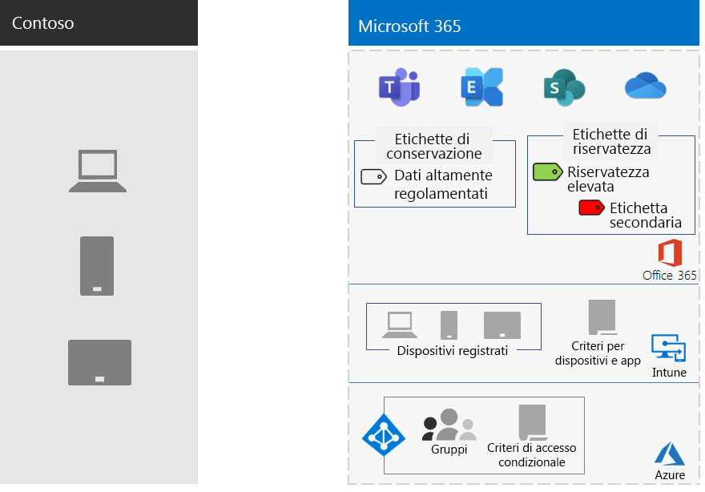

# Protezione delle informazioni per Contoso Corporation

Contoso fa sul serio la sicurezza delle informazioni. La perdita o la distruzione della proprietà intellettuale che descrive i modelli di prodotto e le tecniche di produzione proprietarie li metterebbe in uno svantaggio competitivo.

Prima di spostare le proprie risorse digitali sensibili nel cloud, Contoso ha verificato che i requisiti di protezione e classificazione delle informazioni locali fossero supportati dai servizi basati su cloud di Microsoft 365 per Enterprise.

## Classificazione della sicurezza dei dati contoso

Contoso ha eseguito un'analisi dei dati e ha determinato i livelli di classificazione seguenti.

| Livello 1: base | Livello 2: dati sensibili | Livello 3: dati altamente regolamentati |
|:-------|:-----|:-----|
| I dati vengono crittografati e sono disponibili solo per gli utenti autenticati.    Fornito per tutti i dati archiviati in locale e in archiviazione e carichi di lavoro basati sul cloud. I dati vengono crittografati mentre risiede nel servizio e in transito tra il servizio e i dispositivi client.   Esempi di dati di livello 1 sono le normali comunicazioni aziendali (posta elettronica) e i file dei dipendenti di amministrazione, vendita e supporto. | Livello 1 più autenticazione avanzata e protezione da perdita dei dati.    L'autenticazione avanzata include Azure Multi-Factor Authentication (MFA) con convalida SMS. La prevenzione della perdita di dati garantisce che le informazioni sensibili o critiche non viaggino all'esterno del cloud Microsoft.  Esempi di dati di livello 2 sono le informazioni legali e finanziarie e i dati di ricerca e sviluppo per i nuovi prodotti. | Livello 2 più i livelli più elevati di crittografia, autenticazione e controllo.  I livelli di crittografia più elevati per i dati statici e nel cloud, conformi alle norme internazionali, combinati con MFA con smart card e il controllo granulare, nonché avvisi.   Esempi di dati di livello 3 sono le informazioni personali di clienti e partner, le specifiche ingegneristiche dei prodotti e le tecniche di produzione proprietarie.  |
||||

## Criteri delle informazioni di contoso
Nella tabella seguente sono elencati i criteri delle informazioni di contoso.

| Valore | Access | Conservazione dei dati | Protezione delle informazioni |
|:-------|:-----|:-----|:-----|
| Valore aziendale basso (Livello 1: Base) | Consenti accesso a tutti.  | 6 mesi | Usare la crittografia. |
| Valore aziendale medio (Livello 2: Dati sensibili) | Consentire l'accesso ai dipendenti, ai subappaltatori e ai partner di contoso.    Usare MFA, Transport Layer Security (TLS) e Mobile Application Management (MAM). | 2 anni  | Usare i valori hash per l'integrità dei dati.  |
| Valore aziendale elevato (Livello 3: Dati altamente regolamentati) | Consentire l'accesso ai dirigenti e responsabili di progettazione e produzione.     Rights Management System (RMS) solo con dispositivi di rete gestiti.  | 7 anni  | Usare le firme digitali per il non ripudio.  |
|||||

## Il percorso di Contoso per la protezione delle informazioni con Microsoft 365 per Enterprise

Contoso ha seguito questi passaggi per preparare Microsoft 365 per Enterprise ai propri requisiti di protezione delle informazioni:

1. Identificare le informazioni da proteggere

   Contoso ha eseguito una revisione estensiva delle risorse digitali esistenti presenti nei siti e nelle condivisioni di file di SharePoint locali e ha classificato ogni risorsa.

2. Determinare i criteri di accesso, conservazione e protezione dei dati per i livelli di dati

   In base ai livelli di dati, Contoso ha determinato requisiti dettagliati per i criteri, che sono stati utilizzati per proteggere le risorse digitali esistenti mentre venivano spostate nel cloud.

3. Creare etichette di riservatezza e relative impostazioni per i diversi livelli di informazioni

   Contoso ha creato etichette di riservatezza per i livelli di dati con l'etichetta per dati altamente regolamentati, tra cui crittografia, autorizzazioni e filigrane.

4.  Spostare i dati dai siti di SharePoint locali e dalle condivisioni di file ai nuovi siti di SharePoint

    I file di cui è stata eseguita la migrazione ai nuovi siti di SharePoint hanno ereditato le etichette di conservazione predefinite assegnate al sito.

5.  Come usare le etichette di riservatezza per i nuovi documenti, come interagire con Contoso durante la creazione di nuovi siti di SharePoint e per archiviare sempre risorse digitali in siti di SharePoint

    Modifica delle informazioni sui lavoratori non confacenti-le abitudini di archiviazione spesso sono considerate la parte più difficile della transizione di protezione delle informazioni per il cloud. Contoso IT and Management needed to get Employees to always Label and Store le loro risorse digitali nel cloud, astenersi dall'usare condivisioni di file locali e non usare servizi di archiviazione cloud di terze parti o unità USB.

## Criteri di accesso condizionale per la protezione delle informazioni

Come parte dell'implementazione di Exchange Online e SharePoint, Contoso ha configurato il seguente set di criteri di accesso condizionale e li ha applicati ai gruppi adatti:

- [Criteri di accesso alle applicazioni gestite e non gestite sui dispositivi](../security/office-365-security/identity-access-policies.md)
- [Criteri di accesso di Exchange Online](../security/office-365-security/secure-email-recommended-policies.md)
- [Criteri di accesso di SharePoint](../security/office-365-security/sharepoint-file-access-policies.md)

Ecco il set risultante di criteri contoso per la protezione delle informazioni.

>[!Note]
>Contoso ha inoltre configurato criteri di accesso condizionale aggiuntivi per l'identità e l'accesso. Vedere [Identità per Contoso Corporation](contoso-identity.md#conditional-access-policies-for-identity-and-device-access).
>

Questi criteri assicurano che:

- Le app consentite e le azioni che possono intraprendere con i dati dell'organizzazione sono definite dai criteri di protezione delle app.
- I computer e i dispositivi mobili siano compatibili.
- Exchange Online utilizza la crittografia dei messaggi di Office 365 per Exchange Online.
- SharePoint utilizza restrizioni applicate dall'applicazione.
- SharePoint usi i criteri di controllo di accesso per l'accesso solo dal browser e per bloccare l'accesso ai dispositivi non gestiti.

## Mapping di Microsoft 365 per le caratteristiche Enterprise ai livelli di dati di contoso

Nella tabella seguente vengono mappati i livelli di dati di Contoso alle funzionalità di protezione delle informazioni in Microsoft 365 per Enterprise.

| Livello | Servizi cloud di Microsoft 365 | Windows 10 e App Microsoft 365 per grandi imprese | Sicurezza e conformità |
|:-------|:-----|:-----|:-----|
| Livello 1: base  | Criteri di accesso condizionale di SharePoint ed Exchange Online   Autorizzazioni sui siti di SharePoint | Etichette di riservatezza   BitLocker   Windows Information Protection | Criteri di accesso condizionale dei dispositivi e criteri di Mobile Application Management |
| Livello 2: dati sensibili | Livello 1 plus:     Etichette di riservatezza   Etichette di conservazione di Microsoft 365 nei siti di SharePoint   Prevenzione della perdita dei dati per SharePoint ed Exchange Online   Siti di SharePoint isolati  | Livello 1 plus:     Etichette riservatezza su risorse digitali  | Livello 1 |
| Livello 3: dati altamente regolamentati | Livello 2 plus:    Portare la propria chiave (BYOK) la crittografia e la protezione delle informazioni segrete del Trade   Vault Key di Azure per le applicazioni line-of-business che interagiscono con i servizi Microsoft 365 | Livello 2 | Livello 1 |
|||||

Ecco la risultante configurazione della protezione delle informazioni di contoso.

## Passaggio successivo

[Vedere](contoso-security-summary.md) in che modo Contoso utilizza le funzionalità di sicurezza in Microsoft 365 per Enterprise per la gestione delle identità e degli accessi, la protezione dalle minacce, la protezione delle informazioni e la gestione della sicurezza.

## Vedere anche

[Roadmap per la sicurezza](https://docs.microsoft.com/microsoft-365/security/office-365-security/security-roadmap)

[Panoramica di Microsoft 365 per le aziende](microsoft-365-overview.md)

[Guide dei laboratori di testing](m365-enterprise-test-lab-guides.md)
