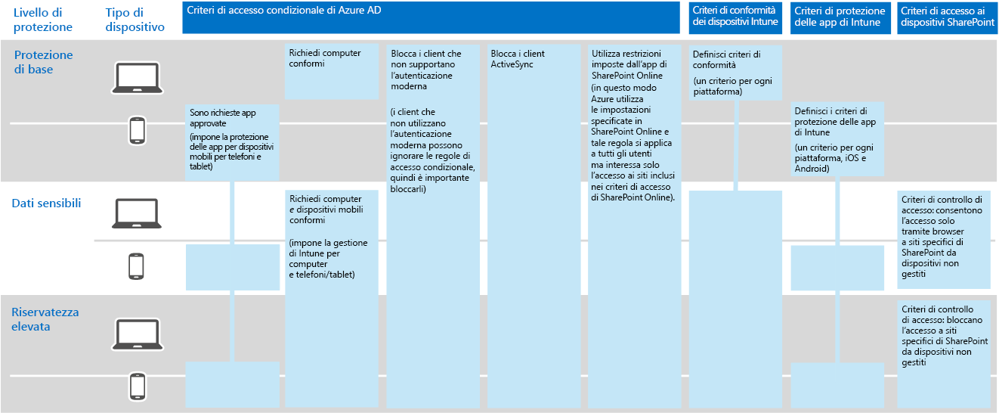

# Protezione delle informazioni per Contoso Corporation

**Riepilogo:** comprendere come Contoso utilizza le funzionalità di protezione delle informazioni in Microsoft 365 Enterprise per proteggere le proprie risorse digitali nel cloud.

La protezione e la sicurezza delle informazioni sono fattori importanti per Contoso. Ad esempio, in caso di perdita o distruzione della proprietà intellettuale che descrive i progetti di prodotti e le tecniche di produzione brevettate, Contoso subirebbe uno svantaggio in termini di competitività.

Prima di spostare le più importanti risorse digitali sensibili sul cloud, Contoso ha fatto in modo che i requisiti di classificazione e protezione delle informazioni locali fossero supportati e implementati nei servizi basati sul cloud di Microsoft 365 Enterprise.

## Classificazione della sicurezza dei dati di Contoso

Contoso ha eseguito un'analisi dei propri dati e ha determinato i seguenti livelli.

||||
|:-------|:-----|:-----|
| **Livello 1: base** | **Livello 2: dati sensibili** | **Livello 3: dati altamente regolamentati** |
| I dati vengono crittografati e sono disponibili solo per gli utenti autenticati     Disponibile per tutti i dati salvati in locale e nelle archiviazioni e nei carichi di lavoro basati sul cloud, ad esempio, Office 365. I dati vengono crittografati mentre si trovano nel servizio e passano dal servizio ai dispositivi client.    Esempi di dati di livello 1 sono le normali comunicazioni aziendali (posta elettronica) e i file dei dipendenti di amministrazione, vendita e supporto. | Livello 1 più autenticazione avanzata e protezione da perdita dei dati:     L'autenticazione avanzata include autenticazione a più fattori con convalida SMS. La prevenzione della perdita dei dati assicura che informazioni importanti o riservate non vengano trasmesse all'esterno della rete locale.    Esempi di dati di livello 2 sono le informazioni legali e finanziarie e i dati di ricerca e sviluppo per i nuovi prodotti. | Livello 2 più i livelli più elevati di crittografia, autenticazione e controllo.      I livelli di crittografia più elevati per i dati statici e nel cloud, conformi alle norme internazionali, combinati con autenticazione a più fattori con smart card e il controllo granulare, nonché avvisi.     Esempi di dati di livello 3 sono i dati identificabili come personali di clienti e partner, le specifiche tecniche dei prodotti e le tecniche di produzione proprietarie.  |
||||

## Criteri delle informazioni di Contoso
Nella tabella seguente sono elencati i criteri delle informazioni per Contoso.

|||||
|:-------|:-----|:-----|:-----|
|  | **Access** | **Conservazione dei dati** | **Protezione delle informazioni** |
| Valore aziendale basso (Livello 1: Base) | Consentire l'accesso a tutti  | 6 mesi | Utilizzo della crittografia |
| Valore aziendale medio (Livello 2: Dati sensibili) | Consentire l'accesso a dipendenti, collaboratori e partner di Contoso     Utilizzare l'autenticazione a più fattori (MFA), Transport Layer Security (TLS) e la gestione di applicazioni mobili (MAM) | 2 anni  | Utilizzo dei valori hash per l'integrità dei dati  |
| Valore aziendale elevato (Livello 3: Dati altamente regolamentati) | Consentire l'accesso ai dirigenti e responsabili di progettazione e produzione     Rights Management System (RMS) solo con dispositivi di rete gestiti  | 7 anni  | Utilizzo delle firme digitali per non ripudio  |
|||||

## Percorso di Contoso per la protezione delle informazioni con Microsoft 365 Enterprise

Contoso ha utilizzato i seguenti passaggi per preparare Microsoft 365 Enterprise ai propri requisiti di protezione delle informazioni:

1. Ha identificato quali informazioni proteggere

   Contoso ha eseguito un'analisi approfondita delle proprie risorse digitali esistenti situate su siti di SharePoint locali e condivisioni di file e ne ha eseguito una classificazione.

2. Ha determinato i criteri di accesso, conservazione e protezione dei dati per i livelli di dati

   In base ai livelli di dati, Contoso ha determinato requisiti dettagliati per i criteri, che sono stati utilizzati per proteggere le risorse digitali esistenti mentre venivano spostate nel cloud.

3. Ha creato etichette di riservatezza e le relative impostazioni per i diversi livelli di informazioni

   Contoso ha creato etichette di riservatezza per i livelli di dati con etichette riservate e altamente regolamentate tra cui crittografia, autorizzazioni e filigrane.

4. Ha creato siti di SharePoint Online protetti per dati sensibili e altamente regolamentati con autorizzazioni che bloccano l'accesso

   Sia i siti sensibili che quelli altamente regolamentati sono stati configurati come [siti isolati](https://docs.microsoft.com/office365/enterprise/isolated-sharepoint-online-team-sites), in cui le autorizzazioni predefinite del sito del team di SharePoint Online sono state personalizzate per i gruppi Azure Active Directory (Azure AD). Siti di SharePoint Online riservati e altamente regolamentati sono stati configurati anche con un'etichetta di conservazione corrispondente. I file archiviati nei siti di SharePoint Online altamente regolamentati sono protetti con l'etichetta di riservatezza elevata. Per ulteriori informazioni vedere lo scenario[Siti Microsoft Teams e SharePoint Online per dati altamente riservati](teams-sharepoint-online-sites-highly-regulated-data.md).

5.  Ha spostato i dati dai siti di SharePoint locali e le condivisioni di file ai nuovi siti di SharePoint Online

    I file migrati ai nuovi siti di SharePoint Online hanno ereditato le etichette di conservazione predefinite assegnate al sito.

6.  Ha istruito i dipendenti su come utilizzare le etichette di riservatezza per i nuovi documenti, su come interagire con l'infrastruttura IT di Contoso durante la creazione di nuovi siti di SharePoint Online e su come archiviare sempre le risorse digitali nei siti di SharePoint Online

    Considerata la parte più difficile della transizione della protezione delle informazioni per il cloud, la gestione e l'infrastruttura IT di Contoso hanno provveduto a cambiare le abitudini di archiviazione delle informazioni dei dipendenti dell'organizzazione inducendoli a etichettare sempre le proprie risorse digitali nel cloud, a non utilizzare mai condivisioni di file locali e a non utilizzare mai servizi di archiviazione di terze parti o dispositivi USB..

## Criteri di accesso condizionale per la protezione delle informazioni

Con la propria identità e l'infrastruttura di gestione dei dispositivi mobili e come parte dell'implementazione di Exchange Online e SharePoint Online, Contoso ha configurato il seguente set di criteri di accesso condizionale e li ha applicati ai gruppi Azure AD appropriati:

- [Criteri di accesso alle applicazioni gestite e non gestite sui dispositivi](identity-access-policies.md)
- [Criteri di accesso di Exchange Online](secure-email-recommended-policies.md)
- [Criteri di accesso di SharePoint Online](sharepoint-file-access-policies.md)

La figura 1 mostra il set di criteri di Contoso per la protezione delle informazioni.

**Figura 1: criteri di accesso condizionale per dispositivi, Exchange Online e SharePoint Online**
 
>[!Note]
>Contoso ha inoltre configurato criteri di accesso condizionale aggiuntivi per l'identità e l'accesso. Vedere [Identità per Contoso Corporation](contoso-identity.md).
>

Questi criteri assicurano che:

- I criteri di protezione delle app definiscono le app consentite e le azioni che possono intraprendere con i dati dell'organizzazione.
- I computer e i dispositivi mobili siano compatibili.
- Exchange Online utilizzi Crittografia messaggi di Office 365 per Exchange Online.
- SharePoint Online utilizzi restrizioni imposte dall'app.
- SharePoint Online utilizzi i criteri di controllo di accesso per l'accesso solo dal browser e per bloccare l'accesso ai dispositivi non gestiti.

## Mapping delle funzionalità di Microsoft 365 Enterprise ai livelli di dati di Contoso

Nella tabella seguente viene mostrato il mapping dei livelli di dati di Contoso alle funzionalità di protezione delle informazioni in Microsoft 365 Enterprise.

|||||
|:-------|:-----|:-----|:-----|
| | **Office 365** | **Windows 10 e Office 365 ProPlus** | **EMS** |
| Livello 1: base  | Criteri di accesso condizionale di SharePoint Online ed Exchange Online   Autorizzazioni sui siti di SharePoint Online | Etichette di riservatezza   BitLocker   Windows Information Protection | Criteri di accesso condizionale dei dispositivi e criteri di gestione di applicazioni mobili |
| Livello 2: dati sensibili | Livello 1 plus:     Etichette di riservatezza   Etichette di Office 365 per i siti di SharePoint Online   Prevenzione della perdita dei dati di Office 365 per SharePoint Online ed Exchange Online   Siti di SharePoint Online isolati  | Livello 1 plus:     Etichette riservatezza su risorse digitali   Office 365 Advanced Data Governance | Livello 1 |
| Livello 3: dati altamente regolamentati | Livello 2 plus:    Crittografia Bring Your Own Key (BYOK) e protezione per informazioni su segreti commerciali   Azure Key Vault per applicazioni line-of-business che interagiscono con i servizi di Office 365 | Livello 2 | Livello 1 |
|||||

## Passaggio successivo

[Vedere](contoso-security-summary.md) in che modo Contoso ha utilizzato le funzionalità di sicurezza in Microsoft 365 Enterprise per la gestione delle identità e degli accessi, la protezione dalle minacce, la protezione delle informazioni e la gestione della sicurezza.

## Vedere anche

[Protezione delle informazioni per Microsoft 365 Enterprise](infoprotect-infrastructure.md)

[Guida alla distribuzione](deploy-microsoft-365-enterprise.md)

[Guide dei laboratori di testing](m365-enterprise-test-lab-guides.md)

