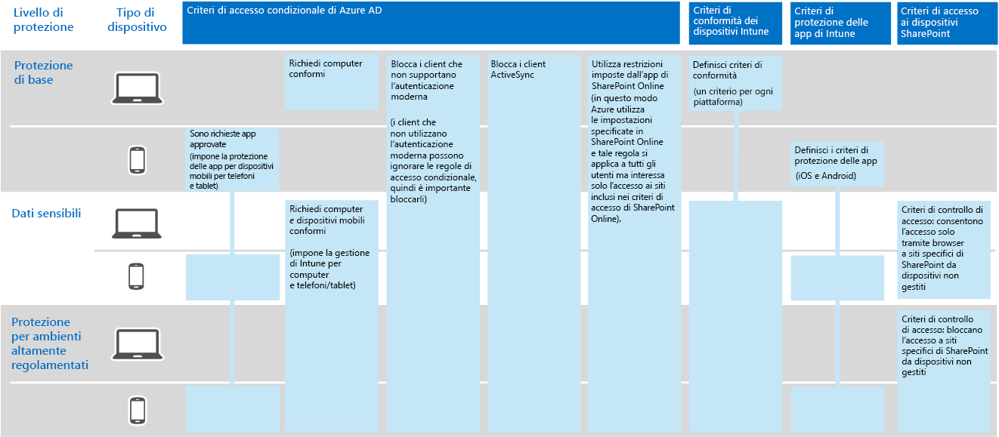

# Protezione delle informazioni per Contoso CorporationInformation protection for the Contoso Corporation

Contoso fa sul serio la sicurezza delle informazioni. La perdita o la distruzione della proprietà intellettuale che descrive i modelli di prodotto e le tecniche di produzione proprietarie li metterebbe in uno svantaggio competitivo.Contoso is serious about their information security. Leakage or destruction of intellectual property that describes their product designs and proprietary manufacturing techniques would place them at a competitive disadvantage.

Prima di spostare le proprie risorse digitali sensibili nel cloud, Contoso ha verificato che i requisiti di protezione e classificazione delle informazioni locali fossero supportati dai servizi basati su cloud di Microsoft 365 per Enterprise.Before moving their sensitive digital assets to the cloud, Contoso made sure that their on-premises information classification and protection requirements were supported by the cloud-based services of Microsoft 365 for enterprise.

## Classificazione della sicurezza dei dati contosoContoso data security classification

Contoso ha eseguito un'analisi dei dati e ha determinato i livelli di classificazione seguenti.Contoso performed an analysis of their data and determined the following classification levels.

| Livello 1: baseLevel 1: Baseline | Livello 2: dati sensibiliLevel 2: Sensitive | Livello 3: dati altamente regolamentatiLevel 3: Highly regulated |
|:-------|:-----|:-----|
| I dati vengono crittografati e sono disponibili solo per gli utenti autenticati.Data is encrypted and available only to authenticated users.    Fornito per tutti i dati archiviati in locale e in archiviazione e carichi di lavoro basati sul cloud. I dati vengono crittografati mentre risiede nel servizio e in transito tra il servizio e i dispositivi client.Provided for all data stored on-premises and in cloud-based storage and workloads. Data is encrypted while it resides in the service and in transit between the service and client devices.   Esempi di dati di livello 1 sono le normali comunicazioni aziendali (posta elettronica) e i file dei dipendenti di amministrazione, vendita e supporto.Examples of Level 1 data are normal business communications (email) and files for administrative, sales, and support workers. | Livello 1 più autenticazione avanzata e protezione da perdita dei dati.Level 1 plus strong authentication and data loss protection.    L'autenticazione avanzata include l'autenticazione di Azure AD multi-factor authentication (AMF) con la convalida SMS.Strong authentication includes Azure AD Multi-Factor Authentication (MFA) with SMS validation. La prevenzione della perdita di dati garantisce che le informazioni sensibili o critiche non viaggino all'esterno del cloud Microsoft.Data loss prevention ensures that sensitive or critical information doesn't travel outside the Microsoft cloud.  Esempi di dati di livello 2 sono le informazioni legali e finanziarie e i dati di ricerca e sviluppo per i nuovi prodotti.Examples of Level 2 data are financial and legal information and research and development data for new products. | Livello 2 più i livelli più elevati di crittografia, autenticazione e controllo.Level 2 plus the highest levels of encryption, authentication, and auditing.  I livelli di crittografia più elevati per i dati statici e nel cloud, conformi alle norme internazionali, combinati con MFA con smart card e il controllo granulare, nonché avvisi.The highest levels of encryption for data at rest and in the cloud, compliant with regional regulations, combined with MFA with smart cards and granular auditing and alerting.   Esempi di dati di livello 3 sono le informazioni personali di clienti e partner, le specifiche ingegneristiche dei prodotti e le tecniche di produzione proprietarie.Examples of Level 3 data are customer and partner personal information, product engineering specifications, and proprietary manufacturing techniques.  |
||||

## Criteri delle informazioni di contosoContoso information policies
Nella tabella seguente sono elencati i criteri delle informazioni di contoso.The following table lists the Contoso information policies.

| ValoreValue | AccessAccess | Conservazione dei datiData retention | Protezione delle informazioniInformation protection |
|:-------|:-----|:-----|:-----|
| Valore aziendale basso (Livello 1: Base)Low business value (Level 1: Baseline) | Consenti accesso a tutti.Allow access to all.  | 6 mesi6 months | Usare la crittografia.Use encryption. |
| Valore aziendale medio (Livello 2: Dati sensibili)Medium business value (Level 2: Sensitive) | Consentire l'accesso ai dipendenti, ai subappaltatori e ai partner di contoso.Allow access to Contoso employees, subcontractors, and partners.    Usare MFA, Transport Layer Security (TLS) e Mobile Application Management (MAM).Use MFA, Transport Layer Security (TLS), and Mobile Application Management (MAM). | 2 anni2 years  | Usare i valori hash per l'integrità dei dati.Use hash values for data integrity.  |
| Valore aziendale elevato (Livello 3: Dati altamente regolamentati)High business value (Level 3: Highly regulated) | Consentire l'accesso ai dirigenti e responsabili di progettazione e produzione.Allow access to executives and leads in engineering and manufacturing.     Rights Management System (RMS) solo con dispositivi di rete gestiti.Rights Management System (RMS) with managed network devices only.  | 7 anni7 years  | Usare le firme digitali per il non ripudio.Use digital signatures for non-repudiation.  |
|||||

## Il percorso di Contoso per la protezione delle informazioni con Microsoft 365 per EnterpriseThe Contoso path to information protection with Microsoft 365 for enterprise

Contoso ha seguito questi passaggi per preparare Microsoft 365 per Enterprise ai propri requisiti di protezione delle informazioni:Contoso followed these steps to prepare Microsoft 365 for enterprise for their information-protection requirements:

1. Identificare le informazioni da proteggereIdentify what information to protect

   Contoso ha eseguito una revisione estensiva delle risorse digitali esistenti presenti nei siti di SharePoint locali e nelle condivisioni di file e ha classificato ogni risorsa.Contoso did an extensive review of their existing digital assets located on on-premises SharePoint sites and file shares and classified each asset.

2. Determinare i criteri di accesso, conservazione e protezione dei dati per i livelli di datiDetermine access, retention, and information protection policies for data levels

   In base ai livelli di dati, Contoso ha determinato requisiti dettagliati per i criteri, che sono stati utilizzati per proteggere le risorse digitali esistenti mentre venivano spostate nel cloud.Based on the data levels, Contoso determined detailed policy requirements, which were used to protect existing digital assets as they were moved to the cloud.

3. Creare etichette di riservatezza e relative impostazioni per i diversi livelli di informazioniCreate sensitivity labels and their settings for the different levels of information

   Contoso ha creato etichette di riservatezza per i livelli di dati con l'etichetta per dati altamente regolamentati, tra cui crittografia, autorizzazioni e filigrane.Contoso created sensitivity labels for their data levels, with their highly regulated label that includes encryption, permissions, and watermarks.

4.  Spostare i dati dai siti di SharePoint locali e dalle condivisioni di file ai nuovi siti di SharePointMove data from on-premises SharePoint sites and file shares to their new SharePoint sites

    I file di cui è stata eseguita la migrazione ai nuovi siti di SharePoint hanno ereditato le etichette di conservazione predefinite assegnate al sito.The files migrated to the new SharePoint sites inherited the default retention labels assigned to the site.

5.  Come usare le etichette di riservatezza per i nuovi documenti, come interagire con Contoso durante la creazione di nuovi siti di SharePoint e per archiviare sempre risorse digitali in siti di SharePointTrain employees how to use sensitivity labels for new documents, how to interact with Contoso IT when creating new SharePoint sites, and to always store digital assets on SharePoint sites

    Modifica delle informazioni sui lavoratori non confacenti-le abitudini di archiviazione spesso sono considerate la parte più difficile della transizione di protezione delle informazioni per il cloud.Changing bad worker information-storage habits is often considered the hardest part of the information protection transition for the cloud. Contoso IT and Management needed to get Employees to always Label and Store le loro risorse digitali nel cloud, astenersi dall'usare condivisioni di file locali e non usare servizi di archiviazione cloud di terze parti o unità USB.Contoso IT and management needed to get employees to always label and store their digital assets in the cloud, refrain from using on-premises file shares, and not use third-party cloud storage services or USB drives.

## Criteri di accesso condizionale per la protezione delle informazioniConditional Access policies for information protection

Come parte dell'implementazione di Exchange Online e SharePoint, Contoso ha configurato il seguente set di criteri di accesso condizionale e li ha applicati ai gruppi adatti:As part of their rollout of Exchange Online and SharePoint, Contoso configured the following set of Conditional Access policies and applied them to the appropriate groups:

- [Criteri di accesso alle applicazioni gestite e non gestite sui dispositiviManaged and unmanaged application access on devices policies](../security/office-365-security/identity-access-policies.md)
- [Criteri di accesso di Exchange OnlineExchange Online access policies](../security/office-365-security/secure-email-recommended-policies.md)
- [Criteri di accesso di SharePointSharePoint access policies](../security/office-365-security/sharepoint-file-access-policies.md)

Ecco il set risultante di criteri contoso per la protezione delle informazioni.Here's resulting set of Contoso policies for information protection.

>[!Note]
>Contoso ha inoltre configurato criteri di accesso condizionale aggiuntivi per l'identità e l'accesso.Contoso also configured additional Conditional Access policies for identity and sign-in. Vedere [Identità per Contoso Corporation](contoso-identity.md#conditional-access-policies-for-identity-and-device-access).See [Identity for the Contoso Corporation](contoso-identity.md#conditional-access-policies-for-identity-and-device-access).
>

Questi criteri assicurano che:These policies ensure that:

- Le app consentite e le azioni che possono intraprendere con i dati dell'organizzazione sono definite dai criteri di protezione delle app.Apps that are allowed and the actions they can take with the organization's data are defined by app protection policies.
- I computer e i dispositivi mobili siano compatibili.PCs and mobile devices must be compliant.
- Exchange Online utilizza la crittografia dei messaggi di Office 365 per Exchange Online.Exchange Online uses Office 365 message encryption (OME) for Exchange Online.
- SharePoint utilizza restrizioni applicate dall'applicazione.SharePoint uses app-enforced restrictions.
- SharePoint usi i criteri di controllo di accesso per l'accesso solo dal browser e per bloccare l'accesso ai dispositivi non gestiti.SharePoint uses access control policies for browser-only access and to block access for unmanaged devices.

## Mapping di Microsoft 365 per le caratteristiche Enterprise ai livelli di dati di contosoMapping Microsoft 365 for enterprise features to Contoso data levels

Nella tabella seguente vengono mappati i livelli di dati di Contoso alle funzionalità di protezione delle informazioni in Microsoft 365 per Enterprise.The following table maps Contoso data levels to information protection features in Microsoft 365 for enterprise.

| LivelloLevel | Servizi cloud di Microsoft 365Microsoft 365 cloud services | Windows 10 e App Microsoft 365 per grandi impreseWindows 10 and Microsoft 365 Apps for enterprise | Sicurezza e conformitàSecurity and compliance |
|:-------|:-----|:-----|:-----|
| Livello 1: baseLevel 1: Baseline  | Criteri di accesso condizionale di SharePoint ed Exchange OnlineSharePoint and Exchange Online Conditional Access policies   Autorizzazioni sui siti di SharePointPermissions on SharePoint sites | Etichette di riservatezzaSensitivity labels   BitLockerBitLocker   Windows Information ProtectionWindows Information Protection | Criteri di accesso condizionale dei dispositivi e criteri di Mobile Application ManagementDevice Conditional Access policies and Mobile Application Management policies |
| Livello 2: dati sensibiliLevel 2: Sensitive | Livello 1 plus:Level 1 plus:     Etichette di riservatezzaSensitivity labels   Etichette di conservazione di Microsoft 365 nei siti di SharePointMicrosoft 365 retention labels on SharePoint sites   Prevenzione della perdita dei dati per SharePoint ed Exchange OnlineData Loss Prevention for SharePoint and Exchange Online   Siti di SharePoint isolatiIsolated SharePoint sites  | Livello 1 plus:Level 1 plus:     Etichette riservatezza su risorse digitaliSensitivity labels on digital assets  | Livello 1Level 1 |
| Livello 3: dati altamente regolamentatiLevel 3: Highly regulated | Livello 2 plus:Level 2 plus:    Portare la propria chiave (BYOK) la crittografia e la protezione delle informazioni segrete del TradeBring your own key (BYOK) encryption and protection for trade secret information   Vault Key di Azure per le applicazioni line-of-business che interagiscono con i servizi Microsoft 365Azure Key Vault for line-of-business applications that interact with Microsoft 365 services | Livello 2Level 2 | Livello 1Level 1 |
|||||

Ecco la risultante configurazione della protezione delle informazioni di contoso.Here's the resulting Contoso information-protection configuration.

## Passaggio successivoNext step

Informazioni su come Contoso utilizza le [funzionalità di sicurezza in Microsoft 365 per Enterprise](contoso-security-summary.md) per la gestione delle identità e degli accessi, la protezione dalle minacce, la protezione delle informazioni e la gestione della sicurezza.Learn how Contoso uses the [security features across Microsoft 365 for enterprise](contoso-security-summary.md) for identity and access management, threat protection, information protection, and security management.

## Vedere ancheSee also

[Roadmap per la sicurezzaSecurity roadmap](https://docs.microsoft.com/microsoft-365/security/office-365-security/security-roadmap)

[Panoramica di Microsoft 365 per le aziendeMicrosoft 365 for enterprise overview](microsoft-365-overview.md)

[Guide dei laboratori di testingTest lab guides](m365-enterprise-test-lab-guides.md)
