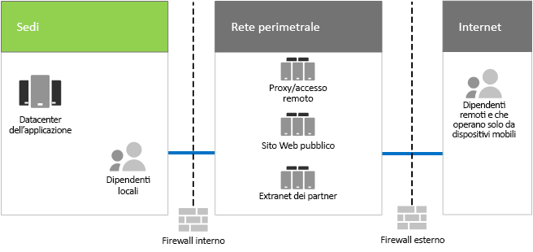

# Infrastruttura IT ed esigenze di business di Contoso

**Riepilogo:** comprendere la struttura di base dell'infrastruttura IT locale di Contoso e in che modo Microsoft 365 Enterprise può soddisfarne le esigenze di business.

Contoso sta cambiando la propria infrastruttura IT da un modello centralizzato locale a un'infrastruttura comprensiva di cloud che gestisce carichi di lavoro di produttività personale e applicazioni basati sul cloud.

## Infrastruttura IT esistente di Contoso

Contoso utilizza un’infrastruttura IT locale principalmente centralizzata, con centri dati delle applicazioni nella sede di Parigi.

La Figura 1 mostra l'ufficio di una sede con centri dati delle applicazioni, una rete perimetrale e Internet.

**Figura 1: Infrastruttura IT esistente di Contoso**
 
I centri dati delle applicazioni locali eseguono l'hosting dei seguenti elementi: 

- Applicazioni line of business personalizzate che utilizzano SQL Server e altri database Linux.
- Un set di server SharePoint legacy.
- Server a livello di organizzazione e di team per l'archiviazione dei file.

Inoltre, ogni sede centrale (hub) regionale che supporta un gruppo di server con un insieme di applicazioni simile. Questi server vengono controllati dai dipartimenti IT regionali.

La possibilità di eseguire ricerche tra le applicazioni e i dati di questi data center separati e ubicati in più aree geografiche continua a rappresentare una sfida.

Nella rete perimetrale degli uffici di Contoso, gruppi di server forniscono quanto segue:

- Accesso remoto basato su VPN all’intranet di Contoso e proxy Web per i dipendenti nella sede di Parigi.
- Hosting del sito Web pubblico di Contoso, da cui i clienti possono ordinare prodotti, parti, materiali o assistenza.
- Hosting dell’extranet Contoso dedicata alla collaborazione e alla comunicazione con i partner.

## Esigenze di business di Contoso

Le esigenze di business di Contoso rientrano in cinque categorie principali.

Produttività:

- Semplificare la collaborazione

  Sostituire il modello di collaborazione basato su posta elettronica e scambio di file con un modello online che consente di apportare modifiche in tempo reale ai documenti, partecipare a riunioni online e tenere traccia delle conversazioni.
- Migliorare la produttività per utenti remoti e mobili

  Dato il numero elevato di utenti che lavorano da casa o sul campo, è preferibile sostituire la soluzione VPN caratterizzata da colli di bottiglia con un accesso ai dati e alle risorse di Contoso nel cloud che sia in grado di garantire prestazioni migliori.
- Favorire la creatività e l'innovazione

  Sfruttare i metodi più recenti di apprendimento visivo e di sviluppo creativo, tra cui la visualizzazione 3D e l'input penna.

Sicurezza:

- Gestione di identità e accesso

  Applicare l'autenticazione a più fattori e altre forme di autenticazione e proteggere le credenziali dell'account di utenti e amministratori.

- Protezione dalle minacce

  Protezione da minacce di sicurezza esterne, tra cui malware basati sulla posta elettronica e sul sistema operativo.

- Protezione delle informazioni

  Bloccare l'accesso e crittografare le risorse digitali di valore elevato, come i dati dei clienti, le specifiche di progettazione e le informazioni sui dipendenti.

- Gestione della sicurezza

  Monitorare la postura di sicurezza ed essere in grado di rilevare le minacce in tempo reale ed intervenire tempestivamente.

Accesso remoto e mobile e partner commerciali:

- Migliorare la sicurezza per lavoratori remoti e mobili

  Introdurre il BYOD e la gestione dei dispositivi di proprietà dell'azienda per garantire l'accesso protetto, il comportamento corretto delle applicazioni e protezione dei dati aziendali.

- Ridurre l'infrastruttura di accesso remoto per i dipendenti

  Ridurre i costi relativi a manutenzione e supporto e migliorare le prestazioni per la soluzione di accesso remoto spostando sul cloud le risorse a cui si accede normalmente.

- Fornire migliore connettività e ridurre le spese per le transazioni Business-to-Business (B2B)

  Sostituire l’extranet per i partner obsoleta e costosa con una soluzione basata su cloud che utilizzi l'autenticazione federata.

Conformità:

- Rispettare i requisiti normativi applicabili

  Essere conformi alle normative applicabili per la conservazione dei dati, la crittografia, la tutela della privacy dei dati e alle normative relative al trattamento dei dati personali, ad esempio il Regolamento generale sulla protezione dei dati (GDPR) per l'Unione Europea.

Gestione:

- Ridurre la spesa IT per la gestione del software dei computer e dei dispositivi client

  Automatizzare l'installazione degli aggiornamenti del sistema operativo Windows e Microsoft Office nell'organizzazione.

## Tabella delle esigenze di business di Contoso rispetto alle funzionalità di Microsoft 365 Enterprise

Il reparto IT di Contoso ha associato le esigenze di business alle funzionalità di Microsoft 365 Enterprise E5 prima dell'implementazione in questa tabella:

||||
|:-------|:-----|:-----|
| **Categoria** | **Esigenza di business** | **Prodotti o funzionalità di Microsoft 365 Enterprise** |
| Produttività |  |  |
|  | Semplificare la collaborazione | Teams, SharePoint Online, Skype for Business Online |
|  | Migliorare la produttività per utenti remoti e mobili | Carichi di lavoro e dati sul cloud di Office 365 |
|  | Favorire la creatività e l'innovazione | Windows Ink, Cortana at Work, PowerPoint |
| Sicurezza |  |  |
|  | Gestione di identità e accesso | Account dedicati per gli amministratore globali con MFA (Multi-factor authentication) e Azure AD Privileged Identity Management   MFA per tutti gli account utente   Accesso condizionale   Windows Hello   Windows Credential Guard |
|  | Protezione dalle minacce | Advanced Threat Analytics   Windows Defender   Protezione avanzata dalle minacce   Office 365 Advanced Threat Protection   Analisi delle minacce e risposta alle minacce in Office 365   |
|  | Protezione delle informazioni | Azure Information Protection   Prevenzione perdita di dati (DLP) di Office 365   Windows Information Protection   Microsoft Cloud App Security   Office 365 Cloud App Security (CAS)   Microsoft Intune |
|  | Gestione della sicurezza | Centro sicurezza di Azure    Windows Defender Security Center |
| Accesso remoto e mobile e partner commerciali |  |  |
|  | Migliorare la sicurezza per lavoratori remoti e mobili | Microsoft Intune |
|  | Ridurre l'infrastruttura di accesso remoto per i dipendenti | Carichi di lavoro e dati sul cloud di Office 365 |
|  | Fornire migliore connettività e ridurre le spese per le transazioni B2B | Autenticazione federata e risorse basate su cloud |
| Conformità |  |  |
|  | Rispettare i requisiti normativi applicabili | Funzionalità per il GDPR in Office 365 |
| Gestione |  |  |
|  | Ridurre la spesa IT per installare gli aggiornamenti del client | Anelli di distribuzione   Aggiornamento sul posto a Windows 10 e Autopilot   Office 365 ProPlus |
||||

## Passaggio successivo

[Informazioni](contoso-networking.md) sulla rete locale dell'azienda Contoso e come è stata ottimizzata per l'accesso e la latenza alle risorse basate su cloud Microsoft 365 nell'organizzazione.

## Vedere anche

[Guida all'implementazione](deploy-microsoft-365-enterprise.md)

[Guide dei laboratori di testing](m365-enterprise-test-lab-guides.md)
