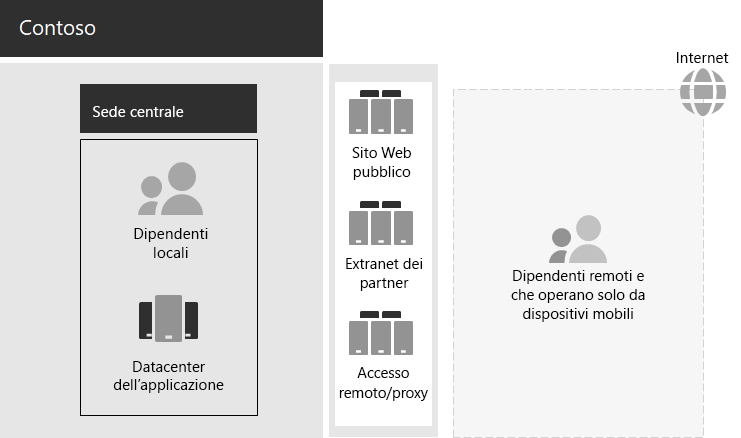

# Infrastruttura IT e esigenze aziendali di Contoso

Contoso sta per passare da un'infrastruttura IT centralizzata locale a una configurazione inclusiva del cloud che incorpora i carichi di lavoro e le applicazioni di produttività personale basati sul cloud.

## Infrastruttura IT di Contoso esistente

Contoso utilizza un’infrastruttura IT locale principalmente centralizzata, con centri dati delle applicazioni nella sede di Parigi.

Ecco l'ufficio della sede centrale con data center delle applicazioni, una rete perimetrale e Internet.

I centri dati delle applicazioni locali eseguono l'hosting dei seguenti elementi: 

- Applicazioni line-of-business personalizzate che usano SQL Server e altri database Linux.
- Un set di server SharePoint legacy.
- Server a livello di organizzazione e di team per l'archiviazione dei file.

Inoltre, ogni ufficio hub regionale supporta un set di server con un set di applicazioni analogo. Questi server sono sotto il controllo dei reparti IT regionali.

La possibilità di eseguire ricerche tra le applicazioni e i dati di questi data center separati e ubicati in più aree geografiche continua a rappresentare una sfida.

Nella rete perimetrale della sede di Contoso, diversi set di server forniscono:

- Hosting per il sito Web pubblico di Contoso, da cui i clienti possono ordinare prodotti, parti, forniture e servizi.
- Hosting dell’extranet Contoso dedicata alla collaborazione e alla comunicazione con i partner.
- Accesso remoto basato su rete privata virtuale (VPN) alla Intranet di Contoso e proxy Web per i dipendenti nella sede di Parigi.

## Esigenze aziendali di Contoso

Le esigenze aziendali di Contoso rientrano in cinque categorie principali:

**Produttività**

- Semplificare la collaborazione

  Sostituire la collaborazione basata su posta elettronica e condivisione file con un modello online che consente modifiche in tempo reale ai documenti, riunioni online più semplici e thread di conversazione acquisiti.
- Migliorare la produttività per lavoratori remoti e mobili

  Con molti dipendenti che lavorano da casa o sul campo, sostituire la soluzione VPN con colli di bottiglia con un accesso efficace ai dati e alle risorse di Contoso nel cloud.
- Favorire la creatività e l'innovazione

  Sfruttare i metodi più recenti di apprendimento visivo e di sviluppo creativo, tra cui la visualizzazione 3D e l'input penna.

**Sicurezza**

- Gestione delle identità e degli accessi

  Applicare l'autenticazione a più fattori e altre forme di autenticazione e proteggere le credenziali degli account utente e amministratore.

- Protezione dalle minacce

  Protezione da minacce di sicurezza esterne, tra cui malware basati sulla posta elettronica e sul sistema operativo.

- Protezione delle informazioni

  Bloccare l'accesso e crittografare le risorse digitali di valore elevato, come i dati dei clienti, le specifiche di progettazione e produzione e le informazioni sui dipendenti.

- Gestione della sicurezza

  Monitorare la sicurezza e rilevare e rispondere alle minacce in tempo reale.

**Accesso remoto e mobile e partner commerciali**

- Migliorare la sicurezza per i lavoratori remoti e mobili

  Implementare la gestione dei dispositivi Bring Your Own Device (BYOD) e di proprietà dell'azienda per garantire l'accesso protetto, il comportamento corretto delle applicazioni e la protezione dei dati aziendali.

- Ridurre l'infrastruttura di accesso remoto per i dipendenti

  Ridurre i costi di manutenzione e supporto e migliorare le prestazioni per la soluzione di accesso remoto spostando le risorse a cui si accede comunemente nel cloud.

- Offrire una connettività migliore e ridurre il sovraccarico per le transazioni business-to-susiness (B2B)

  Sostituire una extranet di partner obsoleta e costosa con una soluzione basata su cloud che utilizza l'autenticazione federata.

**Conformità**

- Rispettare i requisiti normativi applicabili

  Garantire la conformità alle normative del settore e regionali per l'archiviazione dei dati, la crittografia, la privacy dei dati e le normative sui dati personali, come il Regolamento generale sulla protezione dei dati (GDPR) per l'Unione Europea.

**Gestione**

- Ridurre il sovraccarico IT per la gestione del software in esecuzione su PC e dispositivi client

  Automatizzare l'installazione degli aggiornamenti per il sistema operativo Windows e Microsoft 365 Apps for enterprise nell'organizzazione.

## Mapping delle esigenze aziendali di Contoso a Microsoft 365 per le aziende

Il reparto IT di Contoso ha determinato la seguente mappatura delle esigenze aziendali con le funzionalità di Microsoft 365 E5 prima della distribuzione:

| Categoria | Esigenze aziendali | Prodotti o funzionalità di Microsoft 365 per le aziende |
|:-------|:-----|:-----|
| Produttività |  |  |
|  | Semplificare la collaborazione | Microsoft Teams, SharePoint, OneDrive |
|  | Migliorare la produttività per lavoratori remoti e mobili | Carichi di lavoro e dati basati sul cloud di Microsoft 365 |
|  | Favorire la creatività e l'innovazione | Windows Ink, Cortana at Work, PowerPoint |
| Sicurezza |  |  |
|  | Gestione di identità e accesso | Account amministratore globale dedicati con Azure AD Multi-Factor Authentication (MFA) e Azure AD Privileged Identity Management (PIM)   MFA per tutti gli account utente   Accesso condizionale   Windows Hello   Windows Credential Guard |
|  | Protezione dalle minacce | Advanced Threat Analytics   Windows Defender   Defender per Office 365   Microsoft Defender per Office 365   Analisi e risposta alle minacce di Microsoft 365   |
|  | Protezione delle informazioni | Azure Information Protection   Prevenzione della perdita dei dati (DLP)   Windows Information Protection (WIP)   Microsoft Cloud App Security   Microsoft Intune |
|  | Gestione della sicurezza | Azure Defender    Windows Defender Security Center |
| Accesso remoto e mobile e partner commerciali |  |  |
|  | Migliorare la sicurezza per lavoratori remoti e mobili | Microsoft Intune |
|  | Ridurre l'infrastruttura di accesso remoto per i dipendenti | Carichi di lavoro e dati basati sul cloud di Microsoft 365 |
|  | Migliorare la connettività e ridurre il sovraccarico per le transazioni B2B | Autenticazione federata e risorse basate su cloud |
| Conformità |  |  |
|  | Rispettare i requisiti normativi applicabili | Funzionalità GDPR in Microsoft 365 |
| Gestione |  |  |
|  | Ridurre il sovraccarico IT per l'installazione degli aggiornamenti client | Aggiornamenti di Windows 10 Enterprise   Aggiornamenti di App Microsoft 365 per grandi imprese |
||||

## Passaggio successivo

Informazioni sulla rete [locale](contoso-networking.md) di Contoso Corporation e su come è stata ottimizzata per l'accesso e la latenza alle risorse basate sul cloud di Microsoft 365.

## Vedere anche

[Panoramica di Microsoft 365 per le aziende](microsoft-365-overview.md)

[Guide dei laboratori di testing](m365-enterprise-test-lab-guides.md)
