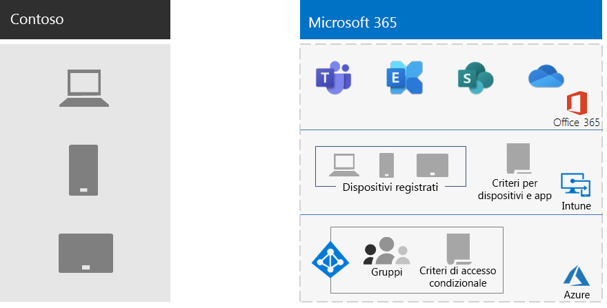

# Gestione dispositivi mobili in Contoso

Microsoft 365 per Enterprise include Intune e un set di servizi di Azure che supportano la gestione e la sicurezza di dispositivi mobili e applicazioni.

Contoso dispone di molti dipendenti abilitati per dispositivi mobili. Alcuni dispongono di uffici nelle posizioni di Contoso e alcuni di essi non hanno uffici. Contoso aveva bisogno di un modo per abilitare la produttività dei dipendenti, ma mantenere i dispositivi, i dati di Contoso archiviati in tali dispositivi e il comportamento dell'applicazione sicuro.

## Piano

Contoso ha identificato i seguenti casi di utilizzo di Intune di gestione dei dispositivi mobili per Microsoft 365 per Enterprise:

- Proteggere la posta elettronica e i dati di Exchange online in modo che sia possibile accedervi in modo sicuro dai dispositivi mobili.
- Implementare un programma Bring-Your-Own-Device (BYOD) per i dipendenti di contoso.
- Emettere i telefoni di proprietà dell'organizzazione e le tavolette condivise con utilizzo limitato ai dipendenti di contoso.

Contoso non utilizza Intune per:

- Consentire ai dipendenti di accedere in modo sicuro a Microsoft 365 da un chiosco pubblico non gestito.
- Proteggere la posta elettronica e i dati locali in modo che sia possibile accedervi in modo sicuro dai dispositivi mobili, perché non sono presenti server di Microsoft Exchange locali.

## Distribuzione

Ecco come Contoso ha configurato l’infrastruttura di gestione dei dispositivi mobili:

- Impostare Intune come autorità di gestione dei dispositivi mobili (MDM) e utilizzare Intune su Azure per amministrare il contenuto e gestire i dispositivi
- Creato gruppi di Azure Active Directory (Azure AD) per i dispositivi per la registrazione e le impostazioni di Intune e i criteri di accesso condizionale basati su dispositivo

  Per ulteriori informazioni, vedere [criteri di accesso condizionale contoso](contoso-identity.md#conditional-access-policies-for-identity-and-device-access).

- Ha abilitato la piattaforma per dispositivi Apple per supportare i dipendenti con iPads, iMac e iPhone e iPhone di proprietà aziendale
- Ha creato criteri di termini e condizioni specifichi per Contoso, visualizzati durante l’installazione del Portale aziendale per i dispositivi mobili di Contoso
- Per i dispositivi non registrati, è stata implementata una serie di criteri di gestione delle applicazioni mobili (MAM) per richiedere l'autenticazione per l'accesso ai servizi di Microsoft 365
- Ha creato criteri di Intune che garantiscono:
  - App consentite.
  - Crittografia del dispositivo per evitare accessi non autorizzati.
  - PIN o password A sei cifre.
  - Un periodo di inattività-timeout.
  - Protezione antivirus e antimalware e aggiornamenti delle firme con Windows Defender nei dispositivi Windows 10.
  - Aggiornamenti automatici nei dispositivi Windows 10 che includono gli aggiornamenti della sicurezza più recenti.
  - Push dei certificati nei dispositivi gestiti.
  - Una chiara separazione dei dati personali e aziendali. Gli utenti o amministratori possono cancellare in modo selettivo i dati aziendali dal dispositivo, senza modificare i dati personali, ad esempio immagini, account di posta elettronica personale e file personali.

Contoso ha registrato i PC distribuiti e gli smartphone e Tablet di proprietà dell'azienda aggiungendoli ai gruppi di dispositivi di Intune corretti. Hanno inoltre stabilito un programma di BYOD per i dipendenti che iscrivono i propri dispositivi personali. I dispositivi registrati ricevono criteri di Intune, che determinano i dispositivi gestiti e protetti e le relative applicazioni. I dispositivi non registrati dispongono di criteri di gestione delle applicazioni mobili (MAM) che specificano le applicazioni consentite.

Di seguito è indicato l'architettura di distribuzione di gestione dei dispositivi mobili contoso.

## Passaggio successivo

[Scopri](contoso-info-protect.md) come Contoso utilizza le funzionalità di protezione delle informazioni di Microsoft 365 per l'organizzazione per classificare, identificare e proteggere le risorse digitali cruciali all'interno della propria azienda.

## Vedere anche

[Gestione dei dispositivi per Microsoft 365](device-management-roadmap-microsoft-365.md)

[Panoramica di Microsoft 365 per le aziende](microsoft-365-overview.md)

[Guide dei laboratori di testing](m365-enterprise-test-lab-guides.md)

