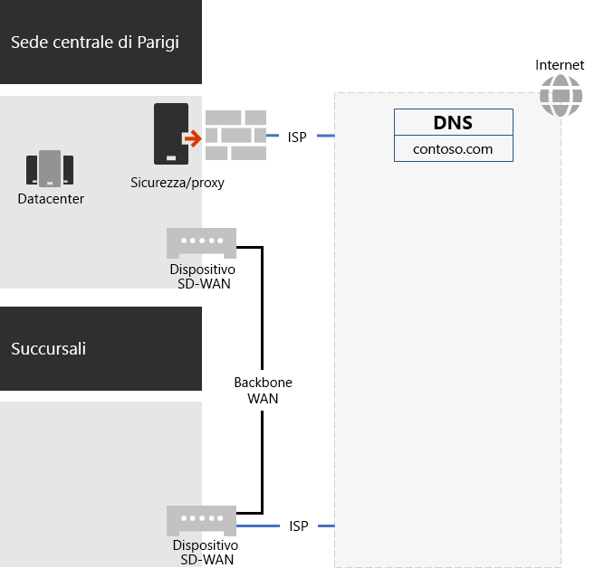
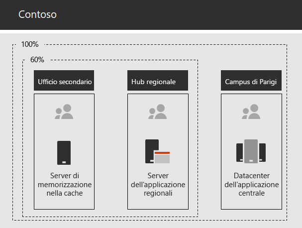

# Servizi di rete per Contoso Corporation

Per adottare un'infrastruttura cloud globale, i tecnici di rete di Contoso hanno realizzato un cambiamento fondamentale nel modo in cui il traffico di rete si sposta verso i servizi cloud. Invece di un modello hub e spoke interno, incentrato sulla connettività di rete e sul traffico per il livello successivo della gerarchia di uffici di Contoso, si sono adoperati per mappare le posizioni degli utenti al punto di uscita Internet locale e le connessioni locali alla posizione di rete Microsoft 365 più vicina su Internet.

## Infrastruttura di rete di Contoso

Gli elementi della rete di Contoso che collega gli uffici in tutto il mondo sono i seguenti:

- Rete WAN MPLS (Multiprotocol Label Switching)

  Una rete WAN MPLS collega la sede di Parigi alle filiali e le filiali agli uffici secondari in una configurazione spoke e hub. Si tratta di un collegamento che consente agli utenti di accedere ai server locali che costituiscono le applicazioni line-of-business dell'ufficio di Parigi. Lo stesso collegamento, inoltre, instrada il traffico Internet generico all'ufficio di Parigi dove i dispositivi per la sicurezza della rete eseguono lo scrubbing delle richieste. All'interno di ciascun ufficio, i router inviano il traffico agli host cablati o ai punti di accesso wireless sulle subnet, che utilizzano lo spazio di indirizzi IP privato.

- Accesso locale diretto a Internet per il traffico di Microsoft 365

  Ciascun ufficio è dotato di un dispositivo SD-WAN (Software-Defined WAN) con uno o più circuiti di rete ISP Internet, con una connettività Internet specifica tramite un server proxy. Questo in genere viene implementato come collegamento WAN a un ISP locale che fornisce anche gli indirizzi IP pubblici e un server DNS locale.

- Presenza Internet

  Contoso possiede il nome di dominio pubblico contoso.com. Il sito Web pubblico di Contoso per ordinare prodotti è un set di server in un datacenter connesso a Internet nel campus di Parigi. Contoso utilizza un intervallo di indirizzi IP pubblico /24 su Internet.

La figura 1 mostra l’infrastruttura di rete di Contoso e le relative connessioni a Internet.

 
**Figura 1: la rete di Contoso**

## Uso di SD-WAN per la connettività di rete ottimale a Microsoft

Contoso ha seguito i [principi della connettività di rete di Microsoft 365](microsoft-365-network-connectivity-principles.md) per:

1. Identificare e differenziare il traffico di rete di Microsoft 365
2. Uscire dalle connessione di rete a livello locale
3. Evitare fenomeni di "hairpinning" di rete
4. Bypassare i dispositivi di protezione di rete duplicati

Esistono tre categorie di traffico di rete per Microsoft 365: Optimize, Allow e Default. Il traffico della prima e della seconda categoria è un traffico di rete attendibile che viene crittografato e protetto a livello di endpoint ed è destinato alla rete Microsoft 365.

Contoso ha deciso di:

- Utilizzare il punto di uscita Internet diretto per il traffico delle categorie Optimize e Allow e di inoltrare tutto il traffico della categoria Default alla connessione Internet centrale di Parigi.

- Distribuire dispositivi SD-WAN in ognuno degli uffici per seguire facilmente questi principi e ottenere prestazioni di rete ottimali per i servizi basati su cloud di Microsoft 365.

  I dispositivi SD-WAN sono dotati di una porta LAN per la rete di uffici locale e di più porte WAN. Una porta WAN si connette alla rete MPLS e le altre ai circuiti ISP locali. Il dispositivo SD-WAN instrada il traffico di rete delle categorie Optimize e Allow ai collegamenti ISP.

## Infrastruttura delle app line-of-business di Contoso

Contoso ha progettato l'infrastruttura Internet di applicazioni line-of-business e server per i seguenti motivi:

- Gli uffici secondari si avvalgono dei server di memorizzazione nella cache locale per archiviare documenti con accesso frequente e siti Web interni.
- Gli hub regionali si avvalgono di server applicazioni regionali per gli uffici regionali e quelli secondari. Tali server effettuano la sincronizzazione con i server della sede di Parigi.
- Il campus di Parigi dispone di data center che contengono i server applicazioni centralizzati che servono l'intera organizzazione.

La Figura 2 mostra la percentuale di traffico di rete quando si accede ai server nell'Intranet di Contoso.

 
**Figura 2: infrastruttura di Contoso per applicazioni interne**

Per gli utenti negli uffici secondari o negli hub regionali, il 60% delle risorse necessarie ai dipendenti può essere fornito da server degli uffici secondari e degli hub regionali. Il restante 40% delle richieste di risorse deve passare attraverso un collegamento WAN al campus di Parigi.

## Analisi della rete di Contoso e preparazione della rete per Microsoft 365 per Enterprise

L'adozione corretta di Microsoft 365 per i servizi Enterprise da parte degli utenti di Contoso dipendono dalla connettività a Internet altamente disponibile e performante, o direttamente ai servizi cloud Microsoft. Contoso ha eseguito queste operazioni per pianificare e implementare la connettività ottimizzata a Microsoft 365 per i servizi cloud aziendali:

1. Creazione di un diagramma reticolare WAN aziendale per semplificare la pianificazione

   Contoso ha avviato la pianificazione della rete creando un diagramma che mostra le posizioni, la connettività di rete esistente, i dispositivi perimetrali di rete presenti e le classi di servizio gestite nella rete. Questo diagramma è stato utilizzato per ogni passaggio successivo nella pianificazione e nell'implementazione della connettività di rete.

2. Ha creato un piano per Microsoft 365 per la connettività di rete aziendale

   Contoso ha usato i [principi di connettività di rete di Microsoft 365](microsoft-365-network-connectivity-principles.md) e ha fornito le architetture di rete di riferimento per determinare la topologia SD-WAN come topologia preferita per la connettività di Microsoft 365.

3. Analisi dell'utilizzo della connessione Internet e della larghezza di banda WAN MPLS in ogni ufficio e maggiore larghezza di banda in base alle esigenze

   È stato analizzato l'uso corrente di ogni ufficio e sono stati incrementati i circuiti in modo da rendere operativo il traffico basato sul cloud previsto di Microsoft 365 con una media del 20% della capacità inutilizzata.

4. Ottimizzazione delle prestazioni per i servizi di rete Microsoft

   Contoso ha definito il set di endpoint di Office 365, Intune e Azure e ha configurato firewall, dispositivi di sicurezza e altri sistemi nel percorso Internet per ottenere prestazioni ottimali. Gli endpoint per il traffico di Office 365 delle categorie Optimize e Allow è stato configurato nei dispositivi SD-WAN per il routing sul circuito ISP.

5. Configurazione del DNS interno

   Il DNS deve essere funzionale e ricercato localmente per il traffico di Microsoft 365.

6. Convalida della connettività degli endpoint di rete e delle porte

   Contoso ha eseguito strumenti di test della connettività di rete forniti da Microsoft per convalidare la connettività per Microsoft 365 per i servizi cloud aziendali.

7. Ottimizzazione dei computer dei dipendenti per la connettività di rete

   I singoli computer sono stati controllati per verificare che sino installati gli aggiornamenti più recenti del sistema operativo e che il monitoraggio della sicurezza degli endpoint sia attivo in tutti i client.

## Passaggio successivo

[Informazioni su](contoso-identity.md) come Contoso si avvale di Active Directory Domain Services (AD DS) locale nel cloud per i dipendenti dell'autenticazione federata per clienti e partner commerciali.

## Vedere anche

[Roadmap di rete per Microsoft 365](networking-roadmap-microsoft-365.md)

[Panoramica di Microsoft 365 per le aziende](microsoft-365-overview.md)

[Guide dei laboratori di testing](m365-enterprise-test-lab-guides.md)
