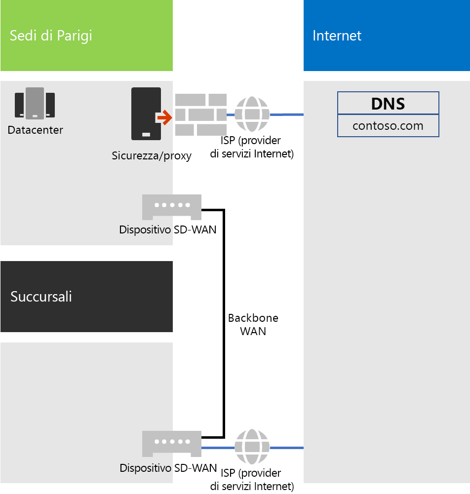
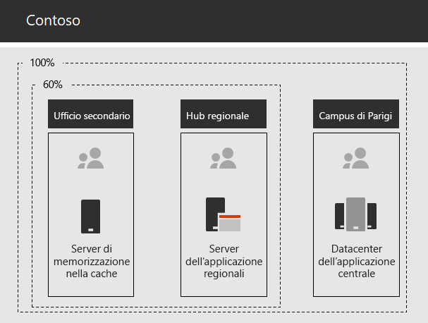

# Servizi di rete per Contoso CorporationNetworking for the Contoso Corporation

**Riepilogo:** comprendere l'infrastruttura di rete di Contoso e come utilizza la tecnologia SD-WAN per prestazioni ottimali della connettività di rete per i servizi basati su cloud di Microsoft 365 Enterprise.**Summary:** Understand the Contoso networking infrastructure and how it uses its SD-WAN technology for optimal performance network connectivity to Microsoft 365 Enterprise cloud based services.

Per adottare un'infrastruttura cloud globale, i tecnici di rete di Contoso hanno realizzato un cambiamento fondamentale nel modo in cui il traffico di rete si sposta verso i servizi basati su cloud. Invece di un modello hub e spoke, incentrato sulla connettività di rete nella sede centrale, hanno lavorato sul mapping delle posizioni degli utenti al traffico in uscita dell'Internet locale e delle connessioni locali alle posizioni della rete Microsoft in Internet.To adopt a cloud-inclusive infrastructure, Contoso's network engineers realized the fundamental shift in the way that network traffic to cloud-based services travels. Instead of a hub and spoke model that focusses network connectivity on the head office, they worked to map user locations to local Internet egress and local connections to Microsoft network locations on the Internet.

## Infrastruttura di rete di ContosoContoso's networking infrastructure

Gli elementi della rete di Contoso che collega gli uffici in tutto il mondo sono i seguenti:The elements of Contoso's network that links their offices across the globe are the following:

- Rete WAN MPLSMPLS WAN network

  Una rete WAN MPLS collega la sede di Parigi alle filiali e le filiali agli uffici secondari in una configurazione spoke e hub. Si tratta di un collegamento che consente agli utenti di accedere ai server locali che costituiscono le applicazioni line-of-business dell'ufficio di Parigi. Lo stesso collegamento, inoltre, instrada il traffico Internet generico all'ufficio di Parigi dove i dispositivi per la sicurezza della rete eseguono lo scrubbing delle richieste. All'interno di ciascun ufficio, i router inviano il traffico agli host o ai punti di accesso wireless sulle subnet, che utilizzano lo spazio di indirizzi IP privato.An MPLS WAN network connects the Paris headquarters to regional offices and regional offices to satellite offices in a spoke and hub configuration. This is for users to access on-premises servers that make up line of business applications in the Paris office. It also routes any generic Internet traffic to the Paris office where network security devices scrub the requests. Within each office, routers deliver traffic to hosts or wireless access points on subnets, which use the private IP address space.

- Accesso locale diretto a Internet per il traffico Office 365Local direct Internet access for Office 365 traffic

  Ciascun ufficio è dotato di un dispositivo SD-WAN con uno o più circuiti di rete ISP Internet, con una connettività Internet specifica tramite un server proxy. Questo in genere viene implementato come collegamento WAN a un ISP locale che fornisce anche gli indirizzi IP pubblici e gli indirizzi IP del server DNS locale per il server proxy.Each office has an SD-WAN device with one of more local Internet ISP network circuits, with its own Internet connectivity through a proxy server. This is typically implemented as a WAN link to a local ISP that also provides public IP addresses and local DNS server IP addresses for the proxy server.

- Presenza InternetInternet presence

  Contoso possiede il nome di dominio pubblico contoso.com. Il sito Web pubblico di Contoso per ordinare prodotti è un set di server in un datacenter connesso a Internet nel campus di Parigi. Contoso utilizza un intervallo di indirizzi IP pubblico /24 su Internet.Contoso owns the contoso.com public domain name. The Contoso public web site for ordering products is a set of servers in an Internet-connected datacenter in the Paris campus. Contoso uses a /24 public IP address range on the Internet.

La figura 1 mostra l’infrastruttura di rete di Contoso e le relative connessioni a Internet.Figure 1 shows Contoso's networking infrastructure and its connections to the Internet.

 
**Figura 1: la rete di Contoso****Figure 1: Contoso's network**

## Uso di SD-WAN per la connettività di rete ottimale a MicrosoftUse of SD-WAN for optimal network connectivity to Microsoft

Contoso ha seguito i [principi della connettività di rete di Office 365](https://docs.microsoft.com/office365/enterprise/office-365-network-connectivity-principles):Contoso followed [Office 365 network connectivity principles](https://docs.microsoft.com/office365/enterprise/office-365-network-connectivity-principles):

1. Identificare e differenziare il traffico di rete di Office 365Identify and differentiate Office 365 network traffic
2. Uscire dalle connessione di rete a livello localeEgress network connections locally
3. Evitare fenomeni di "hairpinning" di reteAvoid network hairpins
4. Bypassare i dispositivi di protezione di rete duplicatiBypass duplicate network security devices

Esistono tre categorie di traffico di rete per Office 365: Optimize, Allow e Default. Il traffico della prima e della seconda categoria è un traffico di rete attendibile che viene crittografato e protetto negli endpoint ed è destinato ai data center Microsoft.There are three categories of network traffic for Office 365: Optimize, Allow, and Default. Optimize and Allow traffic is trusted network traffic that is encrypted and secured at the endpoints and is destined for Microsoft datacenters.

Contoso ha deciso di utilizzare il traffico in uscita diretto di Internet per il traffico delle categorie Optimize e Allow e di inoltrare tutto il traffico della categoria Default alla connessione Internet centrale di Parigi.Contoso decided to use direct Internet egress for Optimize and Allow category traffic and to forward all Default category traffic to the Paris-based central Internet connection.

Ha deciso di distribuire dei dispositivi SD-WAN in ognuno degli uffici come modo semplice per seguire questi principi e ottenere prestazioni di rete ottimali per i servizi basati su cloud di Microsoft 365.They decided to deploy SD-WAN devices at each of their office locations as a simple way to follow these principles and achieve optimal network performance for Microsoft 365 cloud-based services.

I dispositivi SD-WAN sono dotati di porte LAN per la rete di uffici locale e di più porte WAN. Una porta WAN si connette alla rete MPLS e le altre ai circuiti ISP locali. Il dispositivo SD-WAN instrada il traffico di rete delle categorie Optimize e Allow ai collegamenti ISP.The SD-WAN devices have a LAN port for the local office network and multiple WAN ports. One WAN port connects to their MPLS network and other WAN ports connect to local ISP circuits. The SD-WAN device routes Optimize and Allow category network traffic to the ISP links.

## Infrastruttura delle app line-of-business di ContosoContoso's line of business app infrastructure

Contoso ha ideato l'infrastruttura di applicazioni line-of-business e dei server per i seguenti motivi:Contoso has architected its line of business application and server infrastructure for the following:

- Gli uffici secondari si avvalgono dei server di memorizzazione nella cache locale per archiviare documenti con accesso frequente e siti Web interni.Satellite offices use local caching servers to store frequently accessed documents and internal web sites.
- Gli hub regionali si avvalgono di server applicazioni regionali per gli uffici regionali e quelli secondari. Tali server effettuano la sincronizzazione con i server della sede di Parigi.Regional hubs use regional application servers for the regional and satellite offices. These servers synchronize with servers in the Paris headquarters.
- Il campus di Parigi dispone di data center che contengono i server applicazioni centralizzati che servono l'intera organizzazione.The Paris campus has the datacenters that contain the centralized application servers that serve the entire organization.

La Figura 2 mostra la percentuale di traffico di rete quando si accede ai server nell'Intranet di Contoso.Figure 2 shows the percentage of network traffic when accessing servers across Contoso’s intranet.

 
**Figura 2: infrastruttura di Contoso per applicazioni interne****Figure 2: Contoso's infrastructure for internal applications**

Per gli utenti negli uffici secondari o negli hub regionali, il 60% delle risorse necessarie ai dipendenti può essere fornito da server degli uffici secondari e degli hub regionali. Il restante 40% delle richieste di risorse deve passare attraverso un collegamento WAN al campus di Parigi.For users in satellite or regional hub offices, 60% of the resources needed by employees can be served by satellite and regional hub office servers. The additional 40% of resource requests must go over the WAN link to the Paris campus.

## Analisi della rete di Contoso e preparazione della rete per Microsoft 365 EnterpriseContoso's network analysis and preparation of their network for Microsoft 365 Enterprise

La riuscita dell'adozione dei servizi di Microsoft 365 Enterprise da parte degli utenti di Contoso dipende dalla disponibilità e dalle prestazioni della connettività a Internet o direttamente ai servizi cloud Microsoft. Per pianificare e implementare la connettività ottimizzata ai servizi cloud Microsoft 365 Enterprise, Contoso ha intrapreso i seguenti passaggi:Successful adoption of Microsoft 365 Enterprise services by Contoso’s users depend on highly available and performant connectivity to the Internet, or directly to Microsoft cloud services. Contoso took these steps to plan for and implement optimized connectivity to Microsoft 365 Enterprise cloud services:

1. Creazione di un diagramma reticolare WAN aziendale per semplificare la pianificazioneCreated a company WAN network diagram to aid with planning

   Contoso ha avviato la pianificazione della rete creando un diagramma che mostra le posizioni, la connettività di rete esistente, i dispositivi perimetrali di rete presenti e le classi di servizio gestite nella rete. Questo diagramma è stato utilizzato per ogni passaggio successivo nella pianificazione e nell'implementazione della connettività di rete.Contoso started their network planning by creating a diagram showing their locations, the existing network connectivity, their existing network perimeter devices and classes of service that are managed on the network. They used this diagram for each subsequent step in the planning and implementation of networking connectivity.

2. Creazione di un piano per la connettività di rete di Microsoft 365 EnterpriseCreated a plan for Microsoft 365 Enterprise network connectivity

   Contoso ha usato i [principi di connettività di rete di Office 365](https://docs.microsoft.com/office365/enterprise/office-365-network-connectivity-principles) e ha fornito le architetture di rete di riferimento per determinare la topologia SD-WAN come topologia preferita per la connettività di Office 365.Contoso used the [Office 365 network connectivity principles](https://docs.microsoft.com/office365/enterprise/office-365-network-connectivity-principles) and provided reference network architectures to determine SD-WAN as their preferred topology for Office 365 connectivity.

3. Analisi dell'utilizzo della connessione Internet e della larghezza di banda WAN MPLS in ogni ufficio e maggiore larghezza di banda in base alle esigenzeAnalyzed Internet connection utilization and MPLS WAN bandwidth at each office and increased bandwidth as needed

   È stato analizzato l'uso corrente di ogni ufficio e sono stati incrementati i circuiti in modo da rendere operativo il traffico basato sul cloud previsto di Microsoft 365 con una media del 20% della capacità inutilizzata.Each office was analyzed for the current usage and circuits were increased so that predicted Microsoft 365 cloud-based traffic would be operating with an average of 20% of unused capacity.

4. Ottimizzazione delle prestazioni per i servizi di rete MicrosoftOptimized performance to Microsoft network services

   Contoso ha definito il gruppo di endpoint di Office 365, Intune e Azure e ha configurato firewall, dispositivi di sicurezza e altri sistemi nel percorso Internet per ottenere prestazioni ottimali. Gli endpoint per il traffico di Office 365 delle categorie Optimize e Allow è stato configurato nei dispositivi SD-WAN in grado di fornire l'accesso diretto a Internet.Contoso determined the set of Office 365, Intune, and Azure endpoints and configured firewalls, security devices, and other systems in the Internet path for optimal performance. Endpoints for Office 365 Optimize and Allow category traffic was configured into the SD-WAN devices that provided direct Internet access.

5. Configurazione del DNS internoConfigured internal DNS

   Il DNS deve essere funzionale e ricercato localmente per il traffico di Office 365.DNS is required to be functional and to be looked up locally for Office 365 traffic.

6. Convalida della connettività degli endpoint di rete e delle porteValidated network endpoint and port connectivity

   Contoso ha eseguito strumenti di test della connettività di rete forniti da Microsoft per convalidare la connettività per i servizi cloud di Microsoft 365 Enterprise.Contoso ran network connectivity test tools provided by Microsoft to validate connectivity for Microsoft 365 Enterprise cloud services.

7. Ottimizzazione dei computer dei dipendenti per la connettività di reteOptimized employee computers for network connectivity

   I singoli computer sono stati controllati per verificare che sino installati gli aggiornamenti più recenti del sistema operativo e che il monitoraggio della sicurezza degli endpoint sia attivo in tutti i client.Individual computers were checked to ensure that the latest operating system updates were installed and that endpoint security monitoring is active on all clients.

## Passaggio successivoNext step

[Informazioni su](contoso-identity.md) come Contoso si avvale il provider di identità locale nel cloud per i dipendenti e dell'autenticazione federata per clienti e partner commerciali.[Learn](contoso-identity.md) how Contoso is leveraging its on-premises identity provider in the cloud for employees and federating authentication for customers and business partners.

## Vedere ancheSee also

[Servizi di rete per Microsoft 365 EnterpriseNetworking for Microsoft 365 Enterprise](networking-infrastructure.md)

[Guida alla distribuzioneDeployment guide](deploy-microsoft-365-enterprise.md)

[Guide dei laboratori di testingTest lab guides](m365-enterprise-test-lab-guides.md)
