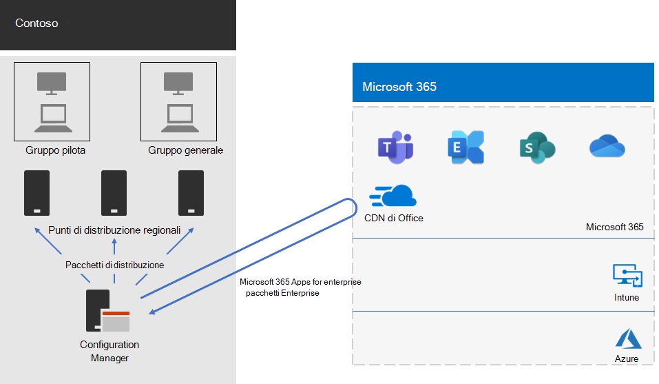

# Distribuzione di Office 365 ProPlus per Contoso

Contoso ha aggiornato i propri PC a Windows 10 Enterprise e Office 365 ProPlus per offrire una collaborazione più efficiente, una maggiore sicurezza e un'esperienza desktop più moderna. Dopo aver valutato le esigenze aziendali e dell'infrastruttura, Contoso ha identificato i seguenti requisiti chiave per la distribuzione:

- Tutti i computer devono eseguire Office 365 ProPlus
- La distribuzione deve sfruttare l'infrastruttura e gli strumenti di gestione esistenti ove possibile
- La distribuzione deve supportare più lingue e architetture esistenti nei dispositivi degli utenti finali
- I PC devono essere sempre aggiornati e protetti con costi di amministrazione dell'IT minimi e un impatto minimo sugli utenti finali

## Strumenti di distribuzione

In base ai propri requisiti, Contoso ha scelto di distribuire Windows 10 Enterprise e Office 365 ProPlus con Configuration Manager (Current Branch). Configuration Manager si adatta ad ambienti di grandi dimensioni e fornisce un controllo completo sull'installazione, gli aggiornamenti e le impostazioni. Inoltre, dispone di funzionalità integrate per semplificare e rendere più efficiente la distribuzione e la gestione di Office, tra cui:

- Peer cache, che può aiutare con una capacità di rete limitata quando si effettua la distribuzione su dispositivi in posizioni remote
- Il dashboard di gestione client di Office, che semplifica la distribuzione di Office e il monitoraggio degli aggiornamenti e consente agli amministratori di accedere alle funzionalità di gestione e distribuzione più recenti
- Distribuzione Language Pack intelligente, che comprende la distribuzione automatica della stessa lingua del sistema operativo
- Metodo di rimozione delle versioni esistenti di Office da un client durante la distribuzione facile e completamente supportato

Oltre a Configuration Manager, Contoso ha usato [Readiness Toolkit](https://docs.microsoft.com/deployoffice/use-the-readiness-toolkit-to-assess-application-compatibility-for-office-365-pro), uno strumento gratuito di Microsoft, per valutare i problemi relativi alla compatibilità con i propri componenti aggiuntivi e macro di Office.

## Gestione della distribuzione e degli aggiornamenti

Office 365 ProPlus dispone di un nuovo modello di rilascio: Office come servizio. Il modello di servizio consente di rimanere aggiornati più facilmente con le nuove funzionalità disponibili, ma spesso richiede ai reparti IT un diverso approccio nel modo in cui i nuovi rilasci vengono distribuiti e testati. Per ridurre eventuali problemi di compatibilità e garantire che i computer siano aggiornati, Contoso ha distribuito Windows e Office in due fasi: 

- Per la prima fase, ha distribuito Office 365 ProPlus a un piccolo gruppo di dispositivi rappresentativi nell'organizzazione. Questo gruppo pilota è stato usato per testare app, componenti aggiuntivi e hardware con Office 365 ProPlus.
- Quattro mesi dopo, in seguito alla correzione di tutti i problemi critici con app, componenti aggiuntivi e hardware nel gruppo pilota, Contoso ha distribuito Office 365 ProPlus al resto dei dispositivi nell'organizzazione (il gruppo di grandi dimensioni). 

Anziché gestire gli aggiornamenti a Office con Configuration Manager, Contoso ha abilitato gli aggiornamenti automatici dal cloud. Gli aggiornamenti basati sul cloud hanno ridotto le attività amministrative facendo in modo che i dispositivi siano sempre aggiornati. 

Contoso ha seguito lo stesso approccio di due fasi per gli aggiornamenti delle funzionalità usate per la distribuzione di Office: i dispositivi nel gruppo pilota hanno ricevuto aggiornamenti delle funzionalità quattro mesi prima dei dispositivi nel resto dell'organizzazione (il gruppo di grandi dimensioni). Per farlo per Office, Contoso ha usato due [canali di aggiornamento](https://docs.microsoft.com/DeployOffice/overview-of-update-channels-for-office-365-proplus) consigliati: 

- Canale semestrale (mirato) per gli aggiornamenti del gruppo pilota 
- Canale semestrale per gli aggiornamenti del gruppo di grandi dimensioni 

Poiché il Canale semestrale (mirato) rilascia una versione di Office 365 ProPlus quattro mesi prima del Canale semestrale, Contoso ha il tempo di verificare gli aggiornamenti senza avere la necessità di gestirli. 

## Processo di distribuzione

Per completare la distribuzione di Office, Contoso ha implementato la procedura seguente, che include le procedure consigliate da Microsoft:

1. Prima della distribuzione, ha usato Readiness Toolkit per testare le app e i componenti aggiuntivi di Office e valutarne la compatibilità con Office 365 ProPlus.
2. In Configuration Manager, Contoso ha abilitato la peer cache nei propri dispositivi client, che ha aiutato con una capacità di rete limitata durante la distribuzione ai dispositivi client in posizioni remote. 
3. Ha definito due gruppi di distribuzione come raccolte di dispositivi in Configuration Manager: un gruppo pilota e un gruppo di grandi dimensioni. Il gruppo pilota, che include un piccolo gruppo di dispositivi rappresentativi nell'organizzazione, è stato usato per eseguire ulteriori test di app, componenti aggiuntivi e hardware con Windows 10 Enterprise e Office 365 ProPlus. 
4. Ha creato pacchetti di distribuzione per Office con il dashboard di gestione client di Office e l'installazione guidata di Office 365, entrambi inclusi nella Console di Configuration Manager. Ha integrato due pacchetti di Office 365 ProPlus, uno per il gruppo pilota nel Canale semestrale (mirato) e uno per il gruppo di grandi dimensioni nel Canale semestrale. 
5. Come parte di ogni pacchetto di Office, ha incluso i Language Pack per inglese, francese e tedesco. Se un dispositivo richiedesse una lingua non inclusa nel pacchetto di Office, verrebbe automaticamente scaricata dalla rete CDN (Content Delivery Network) di Office.
6. Ha usato la funzionalità integrata nel pacchetto di Office per rimuovere automaticamente tutte le versioni di MSI esistenti di Office prima di installare Office 365 ProPlus.
7. In Configuration Manager, ha distribuito i pacchetti di Windows e Office ai punti di distribuzione nella propria rete, quindi ha eseguito le sequenze di attività di distribuzione di Configuration Manager per distribuire il pacchetto pilota di Office 365 ProPlus nel gruppo pilota.
8. Una volta risolti i problemi di compatibilità con il gruppo pilota, Contoso ha eseguito le sequenze di attività per distribuire il pacchetto completo di Office 365 ProPlus nel gruppo di grandi dimensioni.

Poiché Contoso ha scelto di aggiornare automaticamente i dispositivi dal cloud, non è stato necessario gestire il processo in Configuration Manager. I dispositivi vengono aggiornati automaticamente direttamente dal cloud basato sul canale di aggiornamento che è stato definito durante la distribuzione iniziale. 

Ecco l'architettura di distribuzione degli aggiornamenti continui e di installazione di Office 365 ProPlus di Contoso.

 
## Passaggio successivo

[Informazioni su](contoso-mdm.md) come Contoso usa Microsoft Intune in Microsoft 365 Enterprise per gestire i dispositivi e le app in esecuzione su di essi nell'organizzazione.

## Vedere anche

[Office 365 ProPlus per Microsoft 365 Enterprise](office365proplus-infrastructure.md)

[Guida alla distribuzione](deploy-microsoft-365-enterprise.md)

[Guide dei laboratori di testing](m365-enterprise-test-lab-guides.md)
