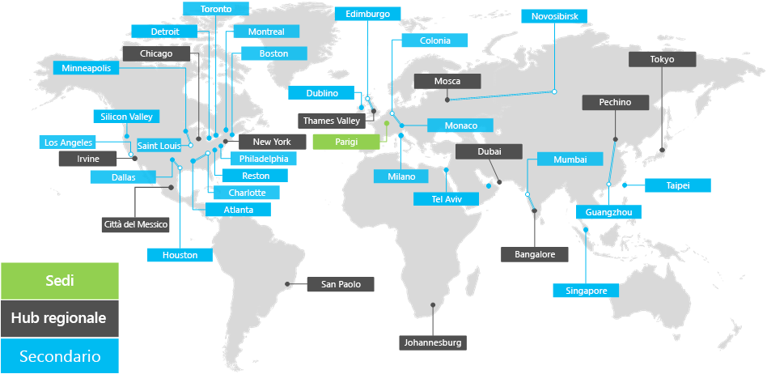

# Panoramica di Contoso CorporationOverview of Contoso Corporation

Contoso Corporation è un'azienda multinazionale con sede a Parigi. L'azienda è un'organizzazione di produzione, vendita e supporto con più di 100.000 prodotti.The Contoso Corporation is a multinational business with its headquarters in Paris. The company is a manufacturing, sales, and support organization with more than 100,000 products.

## Contoso nel mondoContoso around the world

Nella figura 1 viene illustrata la sede centrale di Parigi e gli uffici hub e satellite regionali in vari continenti.Figure 1 shows the headquarters office in Paris and regional hub and satellite offices on various continents.

**Figura 1: uffici di Contoso in tutto il mondo****Figure 1: Contoso offices around the world**
 
Contoso ha tre livelli di uffici:Contoso has three tiers of offices:

- Sede centraleHeadquarters

  La sede centrale di Contoso è un campus aziendale alla periferia di Parigi con dozzine di edifici per strutture amministrative, ingegneristiche e produttive. Tutti i datacenter di Contoso e la sua presenza su Internet sono ospitati nella sede di Parigi.Contoso headquarters is a corporate campus on the outskirts of Paris with dozens of buildings for administrative, engineering, and manufacturing facilities. All the Contoso datacenters and its internet presence are housed in the Paris headquarters.

  La sede ha 25.000 dipendenti.The headquarters has 25,000 workers.

- Hub regionaliRegional hubs

  Gli uffici hub servono una regione specifica del mondo con il servizio di vendita e il personale di supporto del 60%. Ogni hub regionale è connesso alla sede centrale di Parigi tramite un collegamento WAN con larghezza di banda elevata.Hub offices serve a specific region of the world with 60-percent sales and support staff. Each regional hub is connected to the Paris headquarters through a high-bandwidth WAN link.

  I mozzi regionali hanno una media di 2.000 lavoratori.The regional hubs have an average of 2,000 workers.

- FilialiSatellite offices

  Gli uffici satellite contengono 80% di vendite e personale di supporto. Offrono una presenza sul posto per i clienti di Contoso nelle principali città o sottoaree. Ogni ufficio satellite è connesso a un hub regionale tramite un collegamento WAN con larghezza di banda elevata.Satellite offices contain 80-percent sales and support staff. They provide an on-site presence for Contoso customers in key cities or subregions. Each satellite office is connected to a regional hub through a high-bandwidth WAN link.

  Gli uffici satellite hanno una media di 250 lavoratori.The satellite offices have an average of 250 workers.

Circa il 25% della forza lavoro Contoso è solo per dispositivi mobili.About 25 percent of the Contoso workforce is mobile-only. Gli hub regionali e gli uffici satellite hanno una percentuale maggiore di questi lavoratori.The regional hubs and satellite offices have a higher percentage of these workers. Fornire un supporto migliore ai dipendenti che operano solo da dispositivi mobili è un obiettivo aziendale importante per Contoso.Providing better support for mobile-only workers is an important business goal for Contoso.

## Considerazioni sulla progettazione per Microsoft 365 per EnterpriseDesign considerations for Microsoft 365 for enterprise

Gli architetti IT di Contoso hanno identificato i fattori di requisiti di progettazione seguenti per la distribuzione di Microsoft 365 per Enterprise:The Contoso IT architects identified the following design-requirement factors for deploying Microsoft 365 for enterprise:

- Più aree geografiche con requisiti di conformità alle normative localiMultiple geographic locations with local regulations and compliance requirements
- Centro dati Intranet centrale nei server di Office e applicazioni regionali che ospitano applicazioni line-of-business interneA central intranet datacenter in the headquarters office and regional application servers that host internal line-of-business applications
- Un'infrastruttura di Microsoft Endpoint Configuration Manager esistenteAn existing Microsoft Endpoint Configuration Manager infrastructure
- Una combinazione di dispositivi di elaborazione client che eseguono Windows, Mac e LinuxA mix of client computing devices that run Windows, Mac, and Linux
- Una combinazione di dispositivi mobili personali e di proprietà dell’azienda, tra cui smartphone e tablet iOS (iPhone e iPad) e AndroidA mix of personal and company-owned mobile devices, including iOS (iPhone and iPad) and Android smart phones and tablets
- Molti dipendenti remoti e che operano da dispositivi mobiliMany remote and mobile workers
- Molti partner commercialiMany business partners
- Una grande quantità di clienti e altre informazioni personali riservate da gestire e proteggereA large amount of customer and other confidential personal information to manage and secure
- Una grande quantità di proprietà intellettuale di alto valore, sotto forma di specifiche di progettazione per i prodotti e di segreti commercialiA large amount of high-value intellectual property in the form of design specifications for products and manufacturing trade secrets

## Passaggio successivoNext step

[Informazioni sull'infrastruttura](contoso-infra-needs.md) it locale di Contoso Corporation e sul modo in cui le esigenze aziendali dell'azienda sono indirizzate a Microsoft 365 per Enterprise.[Learn](contoso-infra-needs.md) about the Contoso Corporation on-premises IT infrastructure and how the company's business needs are addressed with Microsoft 365 for enterprise.

## Vedere ancheSee also

[Panoramica di Microsoft 365 per le aziendeMicrosoft 365 for enterprise overview](microsoft-365-overview.md)

[Guide dei laboratori di testingTest lab guides](m365-enterprise-test-lab-guides.md)
