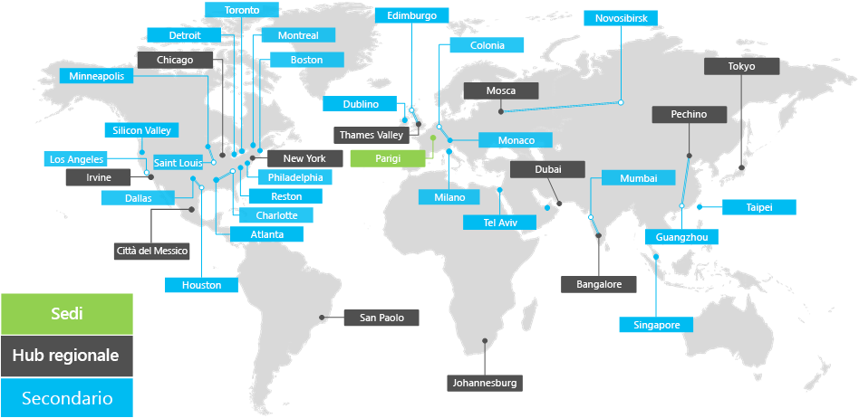

# Panoramica di Contoso CorporationOverview of the Contoso Corporation

**Riepilogo:** Informazioni sulla società Contoso Corporation e sulla struttura a livelli dei suoi uffici nel mondo.**Summary:** Understand the Contoso Corporation as a business and the tiered structure of its worldwide offices.

Contoso Corporation è un’organizzazione multinazionale con sede a Parigi, in Francia. È un’azienda conglomerata di produzione, vendita e supporto con oltre 100.000 prodotti.The Contoso Corporation is a multi-national business with headquarters in Paris, France. It is a conglomerate manufacturing, sales, and support organization with over 100,000 products.

## Contoso nel mondoContoso around the world

Nella figura 1 viene mostrata la sede di Parigi e gli uffici secondari e gli hub regionali nei vari continenti.Figure 1 shows the headquarters office in Paris and regional hub and satellite offices in various continents.

**Figura 1: Uffici di Contoso in tutto il mondo****Figure 1: Contoso's offices around the world**
 
Gli uffici di Contoso di tutto il mondo seguono una struttura a tre livelli.Contoso's offices around the world follow a three-tier design.

- Sede centraleHeadquarters

  La sede di Contoso Corporation è un grande campus aziendale alla periferia di Parigi con decine di edifici per le strutture di amministrazione, ingegneria e produzione. Tutti i datacenter di Contoso e la presenza Internet sono ospitati nella sede di Parigi.The Contoso Corporation headquarters is a large corporate campus on the outskirts of Paris with dozens of buildings for administrative, engineering, and manufacturing facilities. All of Contoso's datacenters and its Internet presence are housed in the Paris headquarters.

  La sede ha 25.000 dipendenti.The headquarters has 25,000 workers.

- Hub regionaliRegional hubs

  Gli hub regionali servono una specifica area geografica del mondo con il 60% delle vendite e staff di supporto. Ogni hub regionale è connesso alla sede centrale di Parigi con un collegamento WAN con larghezza di banda elevata.Regional hub offices serve a specific region of the world with 60% sales and support staff. Each regional hub is connected to the Paris headquarters with a high-bandwidth WAN link.

  Ogni hub regionale ha una media di 2.000 dipendenti.Each regional hub has an average of 2,000 workers.

- FilialiSatellite offices

  Gli uffici secondari ospitano l’80% del personale addetto alle vendite e al supporto tecnico e forniscono una presenza sul posto per i clienti di Contoso nelle città principali o nelle aree geografiche secondarie. Ogni ufficio secondario è collegato a un hub regionale con un collegamento WAN ad elevata larghezza di banda.Satellite offices contain 80% sales and support staff and provide an on-site presence for Contoso customers in key cities or sub-regions. Each satellite office is connected to a regional hub with a high-bandwidth WAN link.

  Ogni filiale ha una media di 250 dipendenti.Each satellite office has an average of 250 workers.

Il 25% dei dipendenti di Contoso è esclusivamente mobile, con una percentuale maggiore di dipendenti solo mobile negli hub regionali e negli uffici secondari. Fornire un supporto migliore ai dipendenti che operano solo da dispositivi mobili è un obiettivo aziendale importante per Contoso.25% of Contoso's workforce is mobile-only, with a higher percentage of mobile-only workers in the regional hubs and satellite offices. Providing better support for mobile-only workers is an important business goal for Contoso.

## Considerazioni sulla progettazione di Microsoft 365 EnterpriseDesign considerations for Microsoft 365 Enterprise

Gli architetti IT di Contoso hanno identificato i requisiti e le considerazioni di progettazione seguenti per la distribuzione di Microsoft 365 Enterprise:Contoso's IT architects identified the following design considerations when deploying Microsoft 365 Enterprise: 

- Più aree geografiche con requisiti di conformità alle normative localiMultiple geographic locations with local regulations and compliance requirements
- Un datacenter intranet centrale nella sede centrale e server di applicazioni locali che ospitano applicazioni line of business interneA central intranet datacenter in the headquarters office and regional application servers that host internal line of business applications
- Un’infrastruttura System Center Configuration Manager esistenteAn existing System Center Configuration Manager infrastructure
- Una combinazione di dispositivi informatici client, tra cui Windows, Mac e LinuxA mix of client computing devices, including Windows, Mac, and Linux
- Una combinazione di dispositivi mobili personali e di proprietà dell’azienda, tra cui smartphone e tablet iOS (iPhone e iPad) e AndroidA mix of personal and company-owned mobile devices, including iOS (iPhone and iPad) and Android smart phones and tablets
- Molti dipendenti remoti e che operano da dispositivi mobiliMany remote and mobile workers
- Molti partner commercialiMany business partners
- Una grande quantità di informazioni personali e dei clientiA large amount of customer and personally identifiable data
- Una grande quantità di proprietà intellettuale di alto valore, sotto forma di specifiche di progettazione per i prodotti e di segreti commercialiA large amount of high-value intellectual property in the form of design specifications for products and manufacturing trade secrets

## Passaggio successivoNext step

[Informazioni](contoso-infra-needs.md) sull'infrastruttura IT locale di Contoso Corporation e su come sono state gestite le sue esigenze aziendali con Microsoft 365 Enterprise.[Learn](contoso-infra-needs.md) about the Contoso Corporation’s on-premises IT infrastructure and how their business needs can be addressed with Microsoft 365 Enterprise.

## Vedere ancheSee also

[Guida all'implementazioneDeployment guide](deploy-microsoft-365-enterprise.md)

[Guide dei laboratori di testingTest lab guides](m365-enterprise-test-lab-guides.md)

