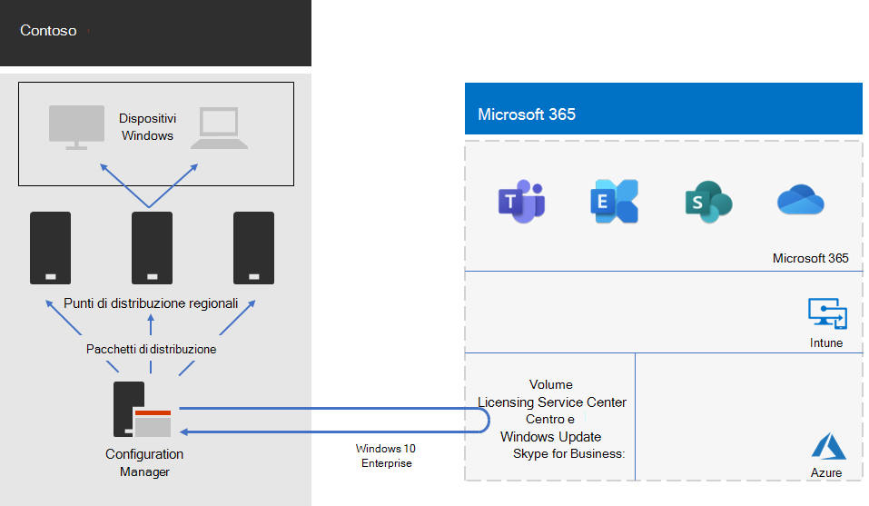

# Distribuzione di Windows 10 Enterprise per ContosoWindows 10 Enterprise deployment for Contoso

Prima dell'ampia implementazione di Microsoft 365 per Enterprise, contoso disponeva di PC e dispositivi compatibili con Windows che eseguivano una combinazione di Windows 7 (10%), Windows 8,1 (65%) e Windows 10 (25%). Contoso voleva aggiornare i propri PC per Windows 10 Enterprise approfittare della sicurezza avanzata e abbassare il sovraccarico dalle distribuzioni automatizzate di aggiornamenti.Prior to the wide rollout of Microsoft 365 for enterprise, Contoso had Windows-compatible PCs and devices running a mixture of Windows 7 (10%), Windows 8.1 (65%), and Windows 10 (25%). Contoso wanted to upgrade their PCs for Windows 10 Enterprise take advantage of advanced security and lowered IT overhead from automated deployments of updates. 

Dopo aver valutato la propria infrastruttura e le proprie esigenze aziendali, Contoso ha identificato i seguenti requisiti chiave per la distribuzione:After assessing their infrastructure and business needs, Contoso identified these key requirements for the deployment:

- Esecuzione di Windows 10 Enterprise sul maggior numero possibile di computer e dispositiviAs many PCs and devices as possible should run Windows 10 Enterprise
- Sfruttamento dell'infrastruttura di Configuration Manager esistente per l'implementazione degli aggiornamenti sul postoRollout of the in-place upgrades leverages existing Configuration Manager infrastructure
- Controllo sulle versioni di Windows 10 Enterprise da distribuire e sugli aggiornamenti che vengono eseguiti tramite gli anelliControl over which versions of Windows 10 Enterprise to deploy and updates are done through rings
- PC e dispositivi devono rimanere sempre aggiornati con costi di amministrazione dell'IT minimi e un impatto minimo sugli utenti finaliPCs and devices should stay up to date with minimal IT administrative costs and with minimal impact to end-users

Con il termine "aggiornato" si intende la versione di Windows 10 Enterprise più adatta alle esigenze aziendali di Contoso, che può essere diverso dall'avere tutti i computer compatibili con Windows che utilizzano la versione più aggiornata di Windows 10 Enterprise.Up to date is defined as the supported version of Windows 10 Enterprise that meets Contoso’s business needs, which can be different from having all Windows-compatible PCs running the latest version of Windows 10 Enterprise.

## Strumenti di distribuzioneDeployment tools

Prima e durante gli aggiornamenti sul posto di Windows 10 Enterprise, Contoso utilizzava le soluzioni di seguenti di Windows Analytics:Prior to and during in-place upgrades of Windows 10 Enterprise, Contoso used the following solutions of Windows Analytics:

- Preparazione aggiornamentiUpgrade Readiness  

  Raccoglie dati di sistema, applicazione e driver per l'analisi e quindi identifica i problemi di compatibilità che possono bloccare un aggiornamento e suggerisce le correzioni ai problemi noti a Microsoft.Collects system, application, and driver data for analysis, and then identifies compatibility issues that can block an upgrade and suggested fixes the issues are known to Microsoft.

- Conformità aggiornamentiUpdate Compliance  

  Mostra lo stato dei dispositivi rispetto agli aggiornamenti di Windows, in modo che sia possibile verificare che dispongano degli aggiornamenti più recenti.Shows you the state of your devices with respect to the Windows updates so that you can ensure that they are on the most current updates as appropriate.

- Integrità del dispositivoDevice Health  

  Identifica i dispositivi che si arrestano spesso in modo anomalo e quindi potrebbe essere necessario ricreare o sostituire e i driver di dispositivo che causano arresti anomali, con suggerimenti sulle versioni alternative di tali driver che potrebbero ridurre il numero di errori.Identifies devices that crash frequently, and therefore might need to be rebuilt or replaced and device drivers that are causing device crashes, with suggestions of alternative versions of those drivers that might reduce the number of crashes. Notifica la presenza di configurazioni errate di Windows Information Protection con invio di messaggi agli utenti finali.Provides notification of Windows Information Protection misconfigurations that send prompts to end users.
 
Contoso dispone di un'infrastruttura di Configuration Manager (Current Branch) esistente. Configuration Manager si adatta ad ambienti di grandi dimensioni e fornisce un controllo completo sull'installazione, gli aggiornamenti e le impostazioni. Inoltre, dispone di funzionalità integrate per semplificare e rendere più efficiente la distribuzione e la gestione di Windows 10 Enterprise.Contoso has an existing Configuration Manager (Current Branch) infrastructure. Configuration Manager scales for large environments and provides extensive control over installation, updates, and settings. It also has built-in features to make it easier and more efficient to deploy and manage Windows 10 Enterprise.

## Processo di pianificazionePlanning process

Contoso ha utilizzato la preparazione per l'aggiornamento in Windows Analytics per determinare il set di app installate e la compatibilità con Windows 10 Enterprise.Contoso used the Upgrade Readiness in Windows Analytics to determine the set of installed apps and their compatibility with Windows 10 Enterprise.

## Processo di distribuzioneDeployment process

Per completare la distribuzione degli aggiornamenti sul posto di Windows 10 Enterprise, Contoso ha implementato la procedura seguente, che include le procedure consigliate da Microsoft:To complete the in-place upgrade deployment of Windows 10 Enterprise, Contoso implemented the following process, which includes best practice recommendations from Microsoft:

1. Abilitazione della cache peer per Configuration Manager.Enabled peer cache for Configuration Manager.
2. Creazione di pacchetti di Windows personalizzati basati sulle immagini del Volume Licensing Service Center.Created customized Windows packages based on images from the Volume Licensing Service Center.
3. Gestione configurazione utilizzata per distribuire i pacchetti di Windows ai punti di distribuzione nella propria rete e distribuisce le compilazioni ai tre gruppi di gestione temporanea di convalida e distribuzione.Used Configuration Manager to deploy the Windows packages to distribution points across their network and deployed builds to the three validation and deployment staging groups.
4. Esecuzione della valutazione della riuscita per i computer e i dispositivi negli anelli di gestione temporanea della convalida e della distribuzione mediante soluzioni Integrità del dispositivo e Conformità aggiornamenti di Windows Analytics.Performed assessment of success for PCs and devices in the three validation and deployment staging rings using the Device Health and Update Compliance solutions of Windows Analytics.
5. In base alle informazioni di Windows Analytics, Contoso ha determinato la versione di Windows 10 Enterprise da distribuire al gruppo di distribuzione di grandi dimensioni.Based on the Windows Analytics information, Contoso determined the version of Windows 10 Enterprise to deploy to the broad deployment group.
6. Esecuzione delle sequenze di attività di distribuzione di Configuration Manager per distribuire il pacchetto di Windows selezionato in un gruppo di distribuzione di grandi dimensioni.Ran the Configuration Manager deployment task sequences to deploy the selected Windows package to the broad deployment group.
7. Computer e dispositivi monitorati nel gruppo di distribuzione di grandi dimensioni utilizzando le soluzioni di conformità per l'integrità e l'aggiornamento dei dispositivi per risolvere i problemi.Monitored PCs and devices in the broad deployment group using the Device Health and Update Compliance solutions to address issues.

Ecco l'architettura di distribuzione degli aggiornamenti sul posto e degli aggiornamenti continui di Contoso.Here is Contoso’s in-place upgrade and ongoing updates deployment architecture.

Questa infrastruttura è costituita da:This infrastructure consists of:

- Configuration Manager, che:Configuration Manager, which:
  - Ottiene le immagini per i pacchetti di Windows 10 Enterprise da Microsoft Volume Licensing Center in Microsoft Network.Obtains images for Windows 10 Enterprise packages from the Microsoft Volume Licensing Center in the Microsoft Network.
  - Si tratta del punto di amministrazione centrale per i pacchetti di distribuzione.Is the central administration point for deployment packages.
- Punti di distribuzione regionali che in genere si trovano negli hub regionali di Contoso.Regional distribution points that are typically located in Contoso’s regional hub offices.
- PC e dispositivi Windows in vari percorsi che ricevono e installano i pacchetti di distribuzione per l'aggiornamento sul posto o per gli aggiornamenti in corso basati sull'appartenenza a un gruppo.Windows PCs and devices in various locations that receive and install the deployment packages for the in-place upgrade or ongoing updates based on group membership.

## Passaggio successivoNext step

Informazioni su come Contoso sta facendo leva sull'infrastruttura di gestione configurazione per [distribuire e mantenere le app Microsoft 365 per Enterprise](contoso-o365pp.md) nell'intera organizzazione.Learn how Contoso is leveraging its Configuration Manager infrastructure to [deploy and keep current Microsoft 365 Apps for enterprise](contoso-o365pp.md) across its organization. 

## Vedere ancheSee also

[Windows 10 EnterpriseWindows 10 Enterprise](https://docs.microsoft.com/windows/deployment/)

[Panoramica di Microsoft 365 per le aziendeMicrosoft 365 for enterprise overview](microsoft-365-overview.md)

[Guide dei laboratori di testingTest lab guides](m365-enterprise-test-lab-guides.md)
