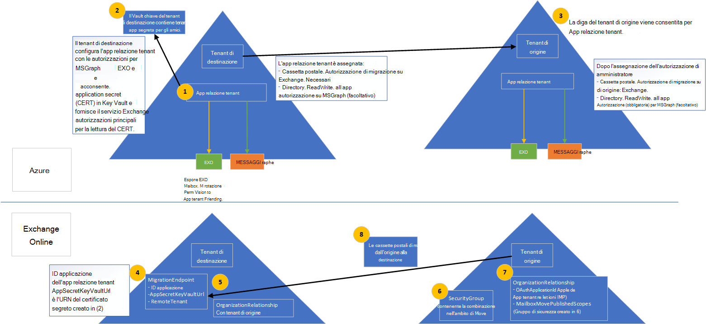

# <a name="cross-tenant-mailbox-migration-preview"></a>Migrazione delle cassette postali tra tenant (anteprima)

In precedenza, quando un tenant di Exchange Online doveva spostare le cassette postali in un altro tenant nello stesso servizio Exchange Online, doveva eseguire l'offboard completo in locale e quindi eseguire l'onboardboard in un nuovo tenant. Con la nuova funzionalità di migrazione delle cassette postali tra tenant, gli amministratori tenant nei tenant di origine e di destinazione possono spostare le cassette postali tra i tenant con dipendenze minime dell'infrastruttura nei sistemi locali. In questo modo viene rimossa la necessità di eseguire l'offboard e l'onboard delle cassette postali.

In genere, durante le fusioni o le cessioni, è necessaria la possibilità di spostare utenti e contenuti in un nuovo tenant. Quando l'amministratore tenant di destinazione esegue lo spostamento, viene chiamato spostamento pull, in modo analogo alle migrazioni di onboarding in locale e cloud.

Gli spostamenti delle cassette postali di Exchange tra tenant sono completamente self-service dagli amministratori tenant, utilizzando interfacce note che possono essere scriptate nei flussi di lavoro più grandi necessari per la transizione degli utenti alla nuova organizzazione. Gli amministratori possono utilizzare il cmdlet, disponibile tramite il ruolo di gestione Sposta cassette `New-MigrationBatch` postali, per eseguire spostamenti tra tenant. Il processo di spostamento include i controlli di autorizzazione del tenant durante la sincronizzazione e la finalizzazione delle cassette postali. 
 
Gli utenti che effettuano la migrazione devono essere presenti nel sistema Exchange Online del tenant di destinazione come MailUsers, contrassegnati con attributi specifici per abilitare gli spostamenti tra tenant. Il sistema non riuscirà gli spostamenti per gli utenti che non sono correttamente impostati nel tenant di destinazione.  

Al termine degli spostamenti, la cassetta postale del sistema di origine viene convertita in MailUser e targetAddress (indicato come ExternalEmailAddress in Exchange) viene contrassegnato con l'indirizzo di routing al tenant di destinazione. Questo processo lascia l'legacy MailUser nel tenant di origine e consente un periodo di coesistenza e routing della posta. Quando i processi aziendali lo consentono, il tenant di origine può rimuovere l'oggetto MailUser di origine o convertirlo in un contatto di posta elettronica. 

Le migrazioni di cassette postali di Exchange tra tenant sono supportate solo per i tenant in ambienti ibridi o cloud o per qualsiasi combinazione dei due.

In questo articolo viene descritto il processo per gli spostamenti di cassette postali tra tenant e vengono fornite indicazioni su come preparare i tenant di origine e di destinazione per lo spostamento del contenuto.  

## <a name="preparing-source-and-target-tenants"></a>Preparazione dei tenant di origine e di destinazione

La funzionalità di migrazione delle cassette postali di Exchange tra tenant richiede l'autorizzazione e l'ambito per le migrazioni tra tenant. Usando l'applicazione Azure Enterprise e le soluzioni di archiviazione dell'insieme di credenziali delle chiavi, gli amministratori tenant sono ora in grado di gestire sia l'autorizzazione che l'ambito delle migrazioni di cassette postali di Exchange Online da un tenant a un altro. Gli spostamenti di cassette postali tra tenant supportano un modello di invito e consenso per stabilire un'applicazione Azure Active Directory (Azure AD) utilizzata per l'autenticazione tra una coppia di tenant. Sono inoltre necessari componenti aggiuntivi, ad esempio una relazione organizzativa e un endpoint di migrazione.

In questa sezione non sono inclusi i passaggi specifici necessari per preparare gli oggetti utente MailUser nella directory di destinazione, né il comando di esempio per inviare un batch di migrazione. Per queste [informazioni, vedere Preparare gli oggetti utente](#prepare-target-user-objects-for-migration) di destinazione per la migrazione.

## <a name="prerequisites"></a>Prerequisiti

La funzionalità di spostamento delle cassette postali tra tenant richiede [Azure Key Vault](/azure/key-vault/basic-concepts) per stabilire un'applicazione Azure specifica della coppia di tenant per archiviare e accedere in modo sicuro al certificato/segreto utilizzato per autenticare e autorizzare la migrazione delle cassette postali da un tenant all'altro, rimuovendo eventuali requisiti per condividere certificati/segreti tra tenant. 

Prima di iniziare, assicurarsi di disporre delle autorizzazioni necessarie per eseguire gli script di distribuzione per configurare Azure Key Vault, Move Mailbox application, EXO Migration Endpoint e exO Organization Relationship. In genere, l'amministratore globale dispone dell'autorizzazione per eseguire tutti i passaggi di configurazione.

Inoltre, i gruppi di sicurezza abilitati alla posta elettronica nel tenant di origine sono necessari prima di eseguire l'installazione. Questi gruppi vengono utilizzati per l'ambito dell'elenco delle cassette postali che possono essere spostate dal tenant di origine (o talvolta denominato risorsa) al tenant di destinazione. In questo modo l'amministratore del tenant di origine può limitare o limitare l'ambito del set specifico di cassette postali che devono essere spostate, impedendo la migrazione di utenti non intenzionali. I gruppi annidati non sono supportati.

Sarà inoltre necessario comunicare con la società partner attendibile (con cui verranno trasferite le cassette postali) per ottenere l'ID tenant di Microsoft 365. Questo ID tenant viene utilizzato nel campo Relazione `DomainName` organizzativa.

Per ottenere l'ID tenant di una sottoscrizione, accedere all'interfaccia di amministrazione di Microsoft 365 e passare a [https://aad.portal.azure.com/#blade/Microsoft_AAD_IAM/ActiveDirectoryMenuBlade/Properties](https://aad.portal.azure.com/#blade/Microsoft_AAD_IAM/ActiveDirectoryMenuBlade/Properties) . Fare clic sull'icona di copia per la proprietà ID tenant per copiarla negli Appunti.

Ecco come funziona il processo.

:::image type="content" source="../media/tenant-to-tenant-mailbox-move/prepare-tenants-flow.png" alt-text="Preparazione del tenant per la migrazione delle cassette postali.":::

[Vedi una versione più grande di questa immagine.](https://github.com/MicrosoftDocs/microsoft-365-docs/raw/public/microsoft-365/media/tenant-to-tenant-mailbox-move/prepare-tenants-flow.png)

<!--
[](https://github.com/MicrosoftDocs/microsoft-365-docs/raw/public/microsoft-365/media/tenant-to-tenant-mailbox-move/prepare-tenants-flow.png)
--> 

### <a name="prepare-tenants"></a>Preparare i tenant

A livello generale, durante l'esecuzione degli script di installazione vengono eseguite le azioni di configurazione seguenti.

Preparare il tenant di destinazione:

1. Se non viene fornito un gruppo di risorse di Azure esistente, ne viene creato uno nuovo (SCRIPT).
2. Se non viene fornito un insieme di credenziali delle chiavi esistente, ne viene creato uno nuovo (SCRIPT).
3. Viene creato un nuovo criterio di accesso per l'applicazione di migrazione delle cassette postali di Exchange Online (SCRIPT) di Office 365.
4. Viene creato un nuovo certificato (o uno esistente, se specificato) per contenere il segreto per l'applicazione di migrazione (SCRIPT).
5. Viene creata una nuova applicazione Azure AD (SCRIPT).
6. Il certificato/segreto viene caricato nell'applicazione di migrazione (SCRIPT).
7. Le autorizzazioni di migrazione delle cassette postali vengono assegnate all'applicazione (SCRIPT).
8. Lo script di distribuzione viene sospeso finché l'amministratore di destinazione non acconsente alla propria applicazione (SCRIPT).
9. L'amministratore tenant di destinazione acconsente alle autorizzazioni concesse all'applicazione (MANUAL).
10. Viene creata una relazione organizzativa con il tenant di destinazione (SCRIPT).
11. Viene creato un endpoint di migrazione per il pull delle cassette postali nel tenant di destinazione (SCRIPT).

Preparare il tenant di origine:

1. L'amministratore del tenant di origine accetta il consenso all'invito all'applicazione di migrazione delle cassette postali dal tenant di destinazione (MANUAL).
2. L'amministratore del tenant di origine crea un gruppo di sicurezza abilitato alla posta elettronica nel tenant per contenere l'elenco delle cassette postali che possono essere spostate dall'applicazione di migrazione (MANUAL).
3. Viene creata una relazione organizzativa con il tenant di destinazione che specifica che l'applicazione di migrazione delle cassette postali deve essere utilizzata per la verifica OAuth per accettare la richiesta di spostamento (SCRIPT).

#### <a name="step-by-step-instructions-for-the-target-tenant-admin"></a>Istruzioni dettagliate per l'amministratore tenant di destinazione

1. Scaricare lo script SetupCrossTenantRelationshipForTargetTenant.ps1 per la configurazione del tenant di destinazione dal [repository GitHub.](https://github.com/microsoft/cross-tenant/releases/tag/Preview) 
2. Salvare lo script (SetupCrossTenantRelationshipForTargetTenant.ps1) nel computer da cui verrà eseguito lo script.
3. Creare una connessione PowerShell remota al tenant di destinazione di Exchange Online. Anche in questo caso, assicurarsi di disporre delle autorizzazioni necessarie per eseguire gli script di distribuzione per configurare l'archiviazione e il certificato dell'insieme di credenziali delle chiavi di Azure, l'applicazione Sposta cassetta postale, l'endpoint di migrazione EXO e la relazione dell'organizzazione EXO.
4. Modificare la directory della cartella dei file nel percorso dello script o verificare che lo script sia attualmente salvato nel percorso attualmente nella sessione remota di PowerShell.
5. Eseguire lo script con i parametri e i valori seguenti.

    | Parametro | Valore | Obbligatorio o facoltativo
    |---------------------------------------------|-----------------|--------------|
    | -TargetTenantDomain                         | Dominio tenant di destinazione, ad esempio fabrikam \. onmicrosoft.com. | Obbligatorio |
    | -ResourceTenantDomain                       | Dominio tenant di origine, ad esempio contoso \. onmicrosoft.com. | Obbligatorio |
    | -ResourceTenantAdminEmail                   | Indirizzo di posta elettronica dell'amministratore tenant di origine. Questo è l'amministratore tenant di origine che acconsentirà all'utilizzo dell'applicazione di migrazione delle cassette postali inviata dall'amministratore di destinazione. Questo è l'amministratore che riceverà l'invito tramite posta elettronica per l'applicazione. | Obbligatorio |
    | -ResourceTenantId                           | ID organizzazione tenant di origine (GUID). | Obbligatorio |
    | -SubscriptionId                             | Sottoscrizione di Azure da usare per la creazione di risorse. | Obbligatorio |
    | -ResourceGroup                              | Nome del gruppo di risorse di Azure che contiene o conterrà l'insieme di credenziali delle chiavi. | Obbligatorio |
    | -KeyVaultName                               | Istanza di Azure Key Vault che archivierà il certificato/segreto dell'applicazione di migrazione delle cassette postali. | Obbligatorio |
    | -CertificateName                            | Nome del certificato durante la generazione o la ricerca del certificato nell'insieme di credenziali delle chiavi. | Obbligatorio |
    | -CertificateSubject                         | Nome del soggetto del certificato dell'insieme di credenziali delle chiavi di Azure, ad esempio CN=contoso_fabrikam. | Obbligatorio |
    | -ExistingApplicationId                      | Applicazione di migrazione della posta da utilizzare se ne è già stata creata una. | Facoltativo |
    | -AzureAppPermissions                        | Le autorizzazioni necessarie per l'applicazione di migrazione delle cassette postali, ad esempio Exchange o MSGraph (Exchange per lo spostamento delle cassette postali, MSGraph per l'utilizzo di questa applicazione per inviare un invito di collegamento di consenso al tenant di risorse). | Obbligatorio |
    | -UseAppAndCertGeneratedForSendingInvitation | Parametro per l'utilizzo dell'applicazione creata per la migrazione da utilizzare per l'invio dell'invito al collegamento di consenso all'amministratore del tenant di origine. Se non presente, verranno richieste le credenziali dell'amministratore di destinazione per connettersi a Azure Invitation Manager e inviare l'invito come amministratore di destinazione. | Facoltativo |
    | -KeyVaultAuditStorageAccountName            | Account di archiviazione in cui verranno archiviati i log di controllo di Key Vault. | Facoltativo |
    | -KeyVaultAuditStorageResourceGroup          | Gruppo di risorse che contiene l'account di archiviazione per l'archiviazione dei log di controllo dell'insieme di credenziali delle chiavi. | Facoltativo |
    ||||

    >[!Note]
    > Assicurarsi di aver installato il modulo Azure AD PowerShell prima di eseguire gli script. Fare riferimento a  installazione

6. Lo script verrà sospeso e verrà richiesto di accettare o acconsentire all'applicazione di migrazione delle cassette postali di Exchange creata durante questo processo. Ecco un esempio.

    ```powershell
    PS C:\PowerShell\> .\SetupCrossTenantRelationshipForTargetTenant.ps1 -ResourceTenantDomain contoso.onmicrosoft.com -ResourceTenantAdminEmail admin@contoso.onmicrosoft.com -TargetTenantDomain fabrikam.onmicrosoft.com -ResourceTenantId ksagjid39-ede2-4d2c-98ae-874709325b00 -SubscriptionId e4ssd05d-a327-49ss-849a-sd0932439023 -ResourceGroup "Cross-TenantMoves" -KeyVaultName "Cross-TenantMovesVault" -CertificateName "Contoso-Fabrikam-cert" -CertificateSubject "CN=Contoso_Fabrikam" -AzureAppPermissions Exchange, MSGraph -UseAppAndCertGeneratedForSendingInvitation -KeyVaultAuditStorageAccountName "t2tstorageaccount" -KeyVaultAuditStorageResourceGroup "Demo"

    cmdlet Get-Credential at command pipeline position 1
    Supply values for the following parameters:
    Credential
    Setting up key vault in the fabrikam.onmicrosoft.com tenant

    Name                                     Account                                 SubscriptionName                        Environment                             TenantId
        ----                                     -------                                 ----------------                        -----------                             --------
    Pay-As-You-Go (ewe23423-a3327-34232-343... Admin@fabrikam... Pay-As-You-Go                           AzureCloud                              dsad938432-dd8e-s9034-bf9a-83984293n43
    Auditing setup successfully for Cross-TenantMovesVault
    Exchange application given access to KeyVault Cross-TenantMovesVault
    Application fabrikam_Friends_contoso_2520 created successfully in fabrikam.onmicrosoft.com tenant with following permissions. MSGraph - Directory.ReadWrite.All. Exchange - Mailbox.Migration
    Admin consent URI for fabrikam.onmicrosoft.com tenant admin is -
    https://login.microsoftonline.com/fabrikam.onmicrosoft.com/adminconsent?client_id=6fea6ere-0dwe-404d-ad35-c71a15cers5c&redirect_uri=https://office.com
    Admin consent URI for contoso.onmicrosoft.com tenant admin is -
    https://login.microsoftonline.com/contoso.onmicrosoft.com/adminconsent?client_id=6fea6ssd-0753-404d-wer5-c71a154d675c&redirect_uri=https://office.com
    Application details to be registered in organization relationship: ApplicationId: [ 6fes8en4-sjo3-406d-ad35-sldkfjiew993 ]. KeyVault secret Id: [ https://cross-tenantmovesvault.vault.azure.net:443/certificates/Contoso-Fabrikam-cert/ksdfj843nt8476h84c288c5a3fb8ec5fdb08 ]. These values are available in variables $AppId and $CertificateId respectively
    Please consent to the application for fabrikam.onmicrosoft.com before sending invitation to admin@contoso.onmicrosoft.com:
    ```  

7. Nella sessione remota di PowerShell verrà visualizzato un URL. Copiare il collegamento fornito per il consenso del tenant e incollarlo in un Web browser.

8. Accedi con le credenziali di amministratore globale. Quando viene visualizzata la schermata seguente, selezionare **Accetta**.

    :::image type="content" source="../media/tenant-to-tenant-mailbox-move/permissions-requested-dialog.png" alt-text="Finestra di dialogo Accetta autorizzazioni":::

9. Tornare alla sessione remota di PowerShell e premere INVIO per procedere.

10. Lo script configurerà gli oggetti di installazione rimanenti. Ecco un esempio.

    ```powershell
    Successfully sent invitation to admin@contoso.onmicrosoft.com
    Setting up exchange components on target tenant: fabrikam.onmicrosoft.com
    MigrationEndpoint created in fabrikam.onmicrosoft.com for target contoso.onmicrosoft.com
    Exchange setup complete. Migration endpoint details are available in $MigrationEndpoint variable
    ```

La configurazione dell'amministratore di destinazione è stata completata.

#### <a name="step-by-step-instructions-for-the-source-tenant-admin"></a>Istruzioni dettagliate per l'amministratore tenant di origine

1.  Accedi alla cassetta postale come -ResourceTenantAdminEmail specificato dall'amministratore di destinazione durante la configurazione. Trova l'invito tramite posta elettronica dal tenant di destinazione e quindi seleziona il **pulsante Introduzione.**

    :::image type="content" source="../media/tenant-to-tenant-mailbox-move/invited-by-target-tenant.png" alt-text="Finestra di dialogo Sei stato invitato":::

2. Selezionare **Accetta** per accettare l'invito.

    :::image type="content" source="../media/tenant-to-tenant-mailbox-move/permissions-requested-accept.png" alt-text="Finestra di dialogo per accettare le autorizzazioni":::

   > [!NOTE]
   > Se non si ottiene questo messaggio di posta elettronica o non è possibile trovarlo, all'amministratore tenant di destinazione è stato fornito un URL diretto che può essere assegnato all'utente per accettare l'invito. L'URL deve essere nella trascrizione della sessione remota di PowerShell dell'amministratore tenant di destinazione.

3. Nell'interfaccia di amministrazione di Microsoft 365 o in una sessione remota di PowerShell, creare uno o più gruppi di sicurezza abilitati alla posta elettronica per controllare l'elenco delle cassette postali consentite dal tenant di destinazione per il pull (spostamento) dal tenant di origine al tenant di destinazione. Non è necessario popolare questo gruppo in anticipo, ma è necessario fornire almeno un gruppo per eseguire la procedura di installazione (script). I gruppi nest non sono supportati. 

4. Scaricare lo script SetupCrossTenantRelationshipForResourceTenant.ps1 per la configurazione del tenant di origine dal repository GitHub qui: [https://github.com/microsoft/cross-tenant/releases/tag/Preview](https://github.com/microsoft/cross-tenant/releases/tag/Preview) . 

5. Creare una connessione remota di PowerShell al tenant di origine con le autorizzazioni di amministratore di Exchange. Le autorizzazioni di amministratore globale non sono necessarie per configurare il tenant di origine, ma solo il tenant di destinazione a causa del processo di creazione dell'applicazione Azure.

6. Modificare la directory nel percorso dello script o verificare che lo script sia attualmente salvato nel percorso attualmente nella sessione remota di PowerShell.

7. Eseguire lo script con i parametri e i valori obbligatori seguenti.

    | Parametro | Valore |
    |-----|------|
    | -SourceMailboxMovePublishedScopes | Gruppo di sicurezza abilitato alla posta creato dal tenant di origine per le identità/cassette postali nell'ambito della migrazione. |
    | -ResourceTenantDomain | Nome di dominio tenant di origine, ad esempio contoso \. onmicrosoft.com. |
    | -ApplicationId | ID applicazione Azure (GUID) dell'applicazione usata per la migrazione. ID applicazione disponibile tramite il portale di Azure (Azure AD, Applicazioni aziendali, nome dell'app, ID applicazione) o incluso nel messaggio di posta elettronica di invito.  |
    | -TargetTenantDomain | Nome di dominio tenant di destinazione, ad esempio fabrikam \. onmicrosoft.com. |
    | -TargetTenantId | ID tenant del tenant di destinazione. Ad esempio, l'ID tenant di Azure AD di contoso \. onmicrosoft.com tenant. |
    |||

    Ecco un esempio.
    ```powershell
    SetupCrossTenantRelationshipForResourceTenant.ps1 -SourceMailboxMovePublishedScopes "MigScope","MyGroup" -ResourceTenantDomain contoso.onmicrosoft.com -TargetTenantDomain fabrikam.onmicrosoft.com -ApplicationId sdf5e87sa-0753-dd88-ad35-c71a15cs8e44c -TargetTenantId 4sdkfo933-3904-sd93-bf9a-sdi39402834
    Exchange setup complete.

    ```

La configurazione dell'amministratore di origine è stata completata.

### <a name="verify-setup"></a>Verificare l'installazione

Verificare che le relazioni dell'organizzazione nei tenant di origine e di destinazione e nell'endpoint di migrazione nella destinazione siano state create correttamente.

#### <a name="target-tenant"></a>Tenant di destinazione

**Relazione organizzativa**

Verificare che l'oggetto relazione organizzativa sia stato creato e configurato con questo comando.

```powershell
Get-OrganizationRelationship <source tenant organization name> | fl name, DomainNames, MailboxMoveEnabled, MailboxMoveCapability
```
Ecco un esempio:

```powershell
PS C:\PowerShell\> Get-OrganizationRelationship fabrikam_contoso_1178 | fl name, DomainNames, MailboxMoveEnabled, MailboxMoveCapability

Name                  : fabrikam_contoso_1123
DomainNames           : {sd0933me9f-9304-s903-s093-s093mfi903m4}
MailboxMoveEnabled    : True
MailboxMoveCapability : Inbound

```

**Endpoint di migrazione**

Verificare che l'oggetto endpoint di migrazione sia stato creato e configurato con questo comando.

```powershell
Get-MigrationEndpoint "<fabrikam_contoso_1123> | fl Identity, RemoteTenant, ApplicationId, AppSecretKeyVaultUrl
```

Ecco un esempio.

```powershell
PS C:\PowerShell\> Get-MigrationEndpoint fabrikam_contoso_1123 | fl Identity, RemoteTenant, ApplicationId, AppSecretKeyVaultUrl


Identity             : fabrikam_contoso_1123
RemoteTenant         : contoso.onmicrosoft.com
ApplicationId        : s93mf93-das9-dq24-dq234-dada9033904m
AppSecretKeyVaultUrl : https://cross-tenantmyvaultformoves.vault.azure.net:443/certificates/Contoso-Fabrikam-cert/ae79348mx94384c288c5a3dfsioepw308

```

#### <a name="source-tenant"></a>Tenant di origine

**Relazione organizzativa**

Verificare che l'oggetto relazione organizzativa sia stato creato e configurato con questo comando.

```powershell
Get-OrganizationRelationship | fl name, MailboxMoveEnabled, MailboxMoveCapability, MailboxMovePublishedScopes, OAuthApplicationId
```

Ecco un esempio.

```powershell
PS C:\PowerShell\> Get-OrganizationRelationship | fl name, MailboxMoveEnabled, MailboxMoveCapability, MailboxMovePublishedScopes, OAuthApplicationId


Name                       : fabrikam_contoso_001
MailboxMoveEnabled         : True
MailboxMoveCapability      : RemoteOutbound
MailboxMovePublishedScopes : {MigScope}
OAuthApplicationId         : sd9890342-3243-3242-fe3w2-fsdade93m0
```

#### <a name="verify-setup-script"></a>Verificare lo script di installazione

Se si ricevono errori durante la configurazione dei tenant di origine o di destinazione, è possibile eseguire lo script VerifySetup.ps1 disponibile in [GitHub](https://github.com/microsoft/cross-tenant/releases/tag/Preview) ed esaminare l'output.

Ecco un esempio di esecuzione di VerifySetup.ps1 nel tenant di destinazione:

```powershell
VerifySetup.ps1 -PartnerTenantId <SourceTenantId> -ApplicationId <AADApplicationId> -ApplicationKeyVaultUrl <appKeyVaultUrl> -PartnerTenantDomain <PartnerTenantDomain> -Verbose
```

Ecco un esempio di VerifySetup.ps1 nel tenant di origine:

```powershell
VerifySetup.ps1 -PartnerTenantId <TargetTenantId> -ApplicationId <AADApplicationId>
```

### <a name="move-mailboxes-back-to-the-original-source"></a>Spostare di nuovo le cassette postali nell'origine originale

Se è necessario uno spostamento di una cassetta postale nel tenant di origine originale, sarà necessario eseguire lo stesso set di passaggi e script sia nei tenant di origine che nei nuovi tenant di destinazione. L'oggetto Organization Relationship esistente verrà aggiornato o accodato, non ricreato.

## <a name="prepare-target-user-objects-for-migration"></a>Preparare gli oggetti utente di destinazione per la migrazione

Gli utenti che effettuano la migrazione devono essere presenti nel tenant di destinazione e nel sistema Exchange Online (come MailUsers) contrassegnati con attributi specifici per abilitare gli spostamenti tra tenant. Il sistema non riuscirà gli spostamenti per gli utenti che non sono correttamente impostati nel tenant di destinazione. Nella sezione seguente vengono dettagliati i requisiti dell'oggetto MailUser per il tenant di destinazione.

### <a name="prerequisites"></a>Prerequisiti
  
È necessario verificare che nell'organizzazione di destinazione siano impostati gli oggetti e gli attributi seguenti.  

1. Per qualsiasi cassetta postale che si sposta da un'organizzazione di origine, è necessario effettuare il provisioning di un oggetto MailUser nell'organizzazione di destinazione: 

   - L'oggetto MailUser di destinazione deve disporre di questi attributi dalla cassetta postale di origine o assegnato con il nuovo oggetto User:
      - ExchangeGUID (flusso diretto dall'origine alla destinazione): il GUID della cassetta postale deve corrispondere. Il processo di spostamento non procede se non è presente nell'oggetto di destinazione. 
      - ArchiveGUID (flusso diretto dall'origine alla destinazione): il GUID di archiviazione deve corrispondere. Il processo di spostamento non procede se non è presente nell'oggetto di destinazione. Questa operazione è necessaria solo se la cassetta postale di origine è abilitata per l'archiviazione. 
      - LegacyExchangeDN (flusso come proxyAddress, "x500: ") - Il LegacyExchangeDN deve essere presente nella destinazione <LegacyExchangeDN> MailUser come x500: proxyAddress. I processi di spostamento non procedono se non è presente nell'oggetto di destinazione. 
      - UserPrincipalName : UPN verrà allineato all'identità NEW o alla società di destinazione dell'utente (ad esempio, user@northwindtraders.onmicrosoft.com). 
      - Primary SMTPAddress : l'indirizzo SMTP primario verrà allineato alla nuova società dell'utente (ad esempio, user@northwind.com). 
      - TargetAddress/ExternalEmailAddress - MailUser farà riferimento alla cassetta postale corrente dell'utente ospitata nel tenant di origine (ad esempio, user@contoso.onmicrosoft.com). Quando si assegna questo valore, verificare di disporre o anche assegnare PrimarySMTPAddress oppure questo valore imposta PrimarySMTPAddress che causerà errori di spostamento. 
      - Non è possibile aggiungere indirizzi proxy smtp legacy dalla cassetta postale di origine a MailUser di destinazione. Ad esempio, non è possibile gestire contoso.com'utente per l'utente singolo negli fabrikam.onmicrosoft.com tenant). I domini sono associati a un solo tenant di Azure AD o Exchange Online.
 
     Esempio **di oggetto** MailUser di destinazione:
 
     | Attributo             | Valore                                                                                                                    |
     |-----------------------|--------------------------------------------------------------------------------------------------------------------------|
     | Alias                 | LaraN                                                                                                                    |
     | RecipientType         | MailUser                                                                                                                 |
     | RecipientTypeDetails  | MailUser                                                                                                                 |
     | UserPrincipalName     | LaraN@northwintraders.onmicrosoft.com                                                                                    |
     | PrimarySmtpAddress    | Lara.Newton@northwind.com                                                                                                |
     | ExternalEmailAddress  | SMTP:LaraN@contoso.onmicrosoft.com                                                                                       |
     | ExchangeGuid          | 1ec059c7-8396-4d0b-af4e-d6bd4c12a8d8                                                                                     |
     | LegacyExchangeDN      | /o=First Organization/ou=Exchange Administrative Group                                                                   |
     |                       | (FYDIBOHF23SPDLT)/cn=Recipients/cn=74e5385fce4b46d1900687694985035Lara                                                  |
     | EmailAddresses        | x500:/o=First Organization/ou=Exchange Administrative Group (FYDIBOHF23SPDLT)/cn=Recipients/cn=d11ec1a2cacd4f81858c8190  |
     |                       | 7273f1f9-Lara                                                                                                            |
     |                       | smtp:LaraN@northwindtraders.onmicrosoft.com                                                                              |
     |                       | SMTP:Lara.Newton@northwind.com                                                                                           |
     |||

     Esempio **di oggetto** Mailbox di origine:

     | Attributo             | Valore                                                                    |
     |-----------------------|--------------------------------------------------------------------------|
     | Alias                 | LaraN                                                                    |
     | RecipientType         | UserMailbox                                                              |
     | RecipientTypeDetails  | UserMailbox                                                              |
     | UserPrincipalName     | LaraN@contoso.onmicrosoft.com                                            |
     | PrimarySmtpAddress    | Lara.Newton@contoso.com                                                  |
     | ExchangeGuid          | 1ec059c7-8396-4d0b-af4e-d6bd4c12a8d8                                     |
     | LegacyExchangeDN      | /o=First Organization/ou=Exchange Administrative Group                   |
     |                       | (FYDIBOHF23SPDLT)/cn=Recipients/cn=d11ec1a2cacd4f81858c81907273f1f9Lara  |
     | EmailAddresses        | smtp:LaraN@contoso.onmicrosoft.com 
     |                       | SMTP:Lara.Newton@contoso.com          |
     |||

   - Ulteriori attributi potrebbero essere già inclusi nel write back ibrido di Exchange. In caso contrario, devono essere inclusi. 
   - msExchBlockedSendersHash - Scrive i dati dei mittenti attendibili e bloccati online dai client in Active Directory locale.
   - msExchSafeRecipientsHash - Scrive i dati dei mittenti attendibili e bloccati online dai client in Active Directory locale.
   - msExchSafeSendersHash: scrive i dati dei mittenti sicuri e bloccati online dai client in Active Directory locale.

2. Se la cassetta postale di origine è in LitigationHold e la dimensione degli elementi ripristinabili della cassetta postale di origine è maggiore del valore predefinito del database (30 GB), gli spostamenti non verranno eserciti poiché la quota di destinazione è inferiore alla dimensione della cassetta postale di origine. È possibile aggiornare l'oggetto MailUser di destinazione per la transizione dei flag della cassetta postale ELC dall'ambiente di origine alla destinazione, che attiva il sistema di destinazione per espandere la quota di MailUser a 100 GB, consentendo così lo spostamento alla destinazione. Queste istruzioni funzionano solo per l'identità ibrida che esegue Azure AD Connect, in quanto i comandi per l'indicatore dei flag ELC non sono esposti agli amministratori tenant.

    >[!Note]
    > ESEMPIO: NESSUNA GARANZIA<br/>Questo script presuppone una connessione sia alla cassetta postale di origine (per ottenere i valori di origine) che alla destinazione di Active Directory locale (per timbrare l'oggetto ADUser). Se nell'origine è abilitata la controversia legale o il ripristino di un singolo elemento, imposta questo valore nell'account di destinazione.  In questo modo le dimensioni del dumpster dell'account di destinazione verranno aumentate a 100 GB.

    ```powershell
    $ELCValue = 0 
    if ($source.LitigationHoldEnabled) {$ELCValue = $ELCValue + 8} if ($source.SingleItemRecoveryEnabled) {$ELCValue = $ELCValue + 16} if ($ELCValue -gt 0) {Set-ADUser -Server $domainController -Identity $destination.SamAccountName -Replace @{msExchELCMailboxFlags=$ELCValue}} 
    ```

3. I tenant di destinazione non ibridi possono modificare la quota nella cartella Elementi ripristinabili per MailUsers prima della migrazione eseguendo il comando seguente per abilitare il blocco per controversia legale sull'oggetto MailUser e aumentare la quota a 100 GB: `Set-MailUser -EnableLitigationHoldForMigration $TRUE` . Si noti che non funzionerà per i tenant in ambiente ibrido.

4. Gli utenti nell'organizzazione di destinazione devono disporre di una licenza con le sottoscrizioni di Exchange Online appropriate applicabili per l'organizzazione. È possibile applicare una licenza prima dello spostamento di una cassetta postale, ma solo dopo che l'oggetto MailUser di destinazione è configurato correttamente con ExchangeGUID e indirizzi proxy. L'applicazione di una licenza prima dell'applicazione di ExchangeGUID comporta il provisioning di una nuova cassetta postale nell'organizzazione di destinazione. 

    > [!Note]
    > Quando si applica una licenza a un oggetto Mailbox o MailUser, tutti i proxyAddress di tipo SMTP vengono scrubbed per garantire che solo i domini verificati siano inclusi nella matrice EmailAddresses di Exchange. 

5. È necessario verificare che l'oggetto MailUser di destinazione non abbia un ExchangeGuid precedente che non corrisponda a Source ExchangeGuid. Ciò può verificarsi se l'utente meu di destinazione è stato concesso in precedenza in licenza per Exchange Online ed è stato effettuato il provisioning di una cassetta postale. Se l'oggetto MailUser di destinazione è stato concesso in licenza in precedenza o aveva un ExchangeGuid che non corrisponde a Source ExchangeGuid, è necessario eseguire una pulizia del cloud MEU. Per queste unità meU cloud, è possibile eseguire `Set-User <identity> -PermanentlyClearPreviousMailboxInfo` .  

    > [!Caution]
    > Questo processo è irreversibile. Se l'oggetto dispone di una cassetta postale softDeleted, non può essere ripristinato dopo questo punto. Una volta deselezionata, tuttavia, è possibile sincronizzare il ExchangeGuid corretto con l'oggetto di destinazione e MRS connetterà la cassetta postale di origine alla cassetta postale di destinazione appena creata. Riferimento al blog EHLO sul nuovo parametro.  

    Trovare gli oggetti che in precedenza erano cassette postali utilizzando questo comando.

    ```powershell
    Get-User <identity> | select Name, *recipient* | ft -AutoSize
    ```

    Ecco un esempio. 

    ```powershell
    PS demo> get-user John@northwindtraders.com |select name, *recipient*| ft -AutoSize  

    Name        PreviousRecipientTypeDetails     RecipientType RecipientTypeDetails  
    ----       ---------------------------- ------------- --------------------  
    John       UserMailbox                  MailUser      MailUser  
    ```  

    Cancella la cassetta postale eliminata in modo recidiva utilizzando questo comando.

    ```powershell
    Set-User <identity> -PermanentlyClearPreviousMailboxInfo
    ```

    Ecco un esempio.

    ```powershell
    PS demo> Set-User John@northwindtraders.com -PermanentlyClearPreviousMailboxInfo Confirm 
    Are you sure you want to perform this action? 
    Delete all existing information about user “John@northwindtraders.com"?. This operation will clear existing values from Previous home MDB and Previous Mailbox GUID of the user. After deletion, reconnecting to the previous mailbox that existed in the cloud will not be possible and any content it had will be unrecoverable PERMANENTLY.  
    Do you want to continue? 
    [Y] Yes  [A] Yes to All  [N] No  [L] No to All  [?] Help (default is "Y"): Y  
    ```

## <a name="perform-mailbox-migrations"></a>Eseguire le migrazioni delle cassette postali

Le migrazioni di cassette postali di Exchange tra tenant vengono inviate come batch di migrazione avviati dal tenant di destinazione. Questo è simile al modo in cui i batch di migrazione di on-boarding funzionano durante la migrazione da Exchange locale a Microsoft 365. 

### <a name="create-migration-batches"></a>Creare batch di migrazione

Ecco un cmdlet batch di migrazione di esempio per avviare gli spostamenti.

```powershell
New-MigrationBatch -Name T2Tbatch-testforignitedemo -SourceEndpoint target_source_7977 -CSVData ([System.IO.File]::ReadAllBytes('users.csv')) -Autostart -TargetDeliveryDomain targetformoves.onmicrosoft.com -AutoComplete

Identity                   Status  Type               TotalCount
--------                   ------  ----               ----------
T2Tbatch-testforignitedemo Syncing ExchangeRemoteMove 1

```

> [!Note]
> L'indirizzo di posta elettronica nel file CSV deve essere quello specificato nel tenant di destinazione, non nel tenant di origine.

L'invio in batch di migrazione è supportato anche dalla nuova interfaccia di amministrazione di Exchange quando si seleziona l'opzione cross-tenant.

#### <a name="update-on-premises-mailusers"></a>Aggiornare MailUsers locali

Una volta che la cassetta postale si sposta dall'origine alla destinazione, è necessario assicurarsi che gli utenti di posta locale, sia di origine che di destinazione, siano aggiornati con il nuovo targetAddress. Negli esempi, targetDeliveryDomain utilizzato nello spostamento è **contoso.onmicrosoft.com**. Aggiornare gli utenti di posta con questo targetAddress.

## <a name="frequently-asked-questions"></a>Domande frequenti

**È necessario aggiornare RemoteMailboxes nell'origine locale dopo lo spostamento?**

Sì, è consigliabile aggiornare targetAddress (RemoteRoutingAddress/ExternalEmailAddress) degli utenti locali di origine quando la cassetta postale del tenant di origine si sposta nel tenant di destinazione.  Anche se il routing della posta può seguire le segnalazioni tra più utenti di posta con targetAddresses diversi, le ricerche sulla disponibilità per gli utenti di posta devono essere mirate alla posizione dell'utente della cassetta postale. Le ricerche sulla disponibilità non inseguono più reindirizzamenti. 

**Il contenuto della cartella chat di Teams esegue la migrazione tra tenant?**  

No, il contenuto della cartella chat di Teams non esegue la migrazione tra tenant.  

**Come è possibile visualizzare solo gli spostamenti tra tenant, non gli spostamenti di onboarding e off-boarding?**

Utilizzare il `-flags` parametro . Ecco un esempio.

```powershell
Get-MoveRequest -Flags "CrossTenant"  
```

**È possibile fornire script di esempio per la copia degli attributi utilizzati nei test?**

> [!Note]
> ESEMPIO: NESSUNA GARANZIA<br/>Questo script presuppone una connessione sia alla cassetta postale di origine (per ottenere i valori di origine) che alla destinazione di Servizi di dominio Active Directory locale (per timbrare l'oggetto ADUser). Se nell'origine è abilitata la controversia legale o il ripristino di un singolo elemento, imposta questo valore nell'account di destinazione.  In questo modo le dimensioni del dumpster dell'account di destinazione verranno aumentate a 100 GB.

```powershell
#Dumps out the test mailboxes from SourceTenant 
#Note, the filter applied on GetMailbox is for an attribute set on CA1 = “ProjectKermit” 
#These are the ‘target’ users to be moved to the Northwind org tenant #################################################################  
$outFile = "$home\desktop\UserListToImport.csv" 
$outArray = @() 
#output the test objects 
$Mailboxes = get-mailbox -filter "CustomAttribute1 -like ‘ProjectKermit'" -resultsize unlimited  
#created these mailboxes in adv using separate scripts but you get the idea on how to define the user list to move 
Foreach ($i in $Mailboxes)  
{ 
    $user = get-Recipient $i.alias 
    $myobj = New-Object System.Object 
    $myObj | Add-Member -type NoteProperty -name primarysmtpaddress -value $i.PrimarySMTPAddress 
    $myObj | Add-Member -type NoteProperty -name alias -value $i.alias 
    $myObj | Add-Member -type NoteProperty -name FirstName -value $User.FirstName 
    $myObj | Add-Member -type NoteProperty -name LastName -value $User.LastName 
    $myObj | Add-Member -type NoteProperty -name DisplayName -value $User.DisplayName 
    $myObj | Add-Member -type NoteProperty -name Name -value $i.Name 
    $myObj | Add-Member -type NoteProperty -name SamAccountName -value $i.SamAccountName 
    $myObj | Add-Member -type NoteProperty -name legacyExchangeDN -value $i.legacyExchangeDN    $myObj | Add-Member -type NoteProperty -name ExchangeGuid -value $i.ExchangeGuid 
    $outArray += $myObj 
} 
$outArray | Export-CSV $outfile -notypeinformation  
################################################################# 
#Copy the file $outfile to the desktop of the target on-premises 
#then run the below to create MEU in Target 
#################################################################  
$ImportUserList = import-csv "$home\desktop\UserListToImport.csv" 
$pwstr = "Something 98053 Random!!"; 
$pw = new-object "System.Security.SecureString"; 
for ($i=0; $i -lt $pwstr.Length; $i++) {$pw.AppendChar($pwstr[$i])} foreach ($user in $ImportUserList) { 
     $tmpUser = $null 
    $UPNSuffix = "@northwindtraders.com"    $UPN = $user.Alias+$upnsuffix 
    $tmpUser = New-MailUser -organization -UserPrincipalName $upn -ExternalEmailAddress $user.primarysmtpaddress -FirstName $user.FirstName ` 
                 -LastName $user.LastName -SamAccountName $user.SamAccountName -ResetPasswordOnNextLogon $false ` 
                 -Alias $user.alias -PrimarySmtpAddress $UPN -Name $User.Name -DisplayName $user.DisplayName ` 
                 -OrganizationalUnit "OU=ContosoUsers,OU=MLB,DC=ContosoLab,DC=net" -Password $pw       $x500 = "x500:" + $user.legacyExchangeDN 
    $tmpUser | Set-MailUser -ExchangeGuid $user.ExchangeGuid -EmailAddresses @{Add=$x500} -CustomAttribute1 "ProjectKermit" 
}  
################################################################# 
# On AADSync machine, run AADSync 
#################################################################  
Start-ADSyncSyncCycle 
 
#AADSync and FWDSync will create the target MEUs in the Target tenant 
```
**Come si accede a Outlook il giorno 1 dopo lo spostamento della cassetta postale di utilizzo?**

Poiché un solo tenant può essere proprietario di un dominio, l'ex SMTPAddress primario non verrà associato all'utente nel tenant di destinazione al termine dello spostamento della cassetta postale. solo i domini associati al nuovo tenant. Outlook utilizza il nuovo UPN degli utenti per eseguire l'autenticazione nel servizio e il profilo outlook prevede di trovare l'SMTPAddress primario legacy in modo che corrisponda alla cassetta postale nel sistema di destinazione. Poiché l'indirizzo legacy non è nel sistema di destinazione, il profilo di Outlook non si connetterà per trovare la cassetta postale appena spostata. 

Per questa distribuzione iniziale, gli utenti dovranno ricreare il proprio profilo con il nuovo UPN, l'indirizzo SMTP primario e risincronizzazione del contenuto OST. 

> [!Note]
> Pianificare di conseguenza quando gli utenti vengono evasi in batch per il completamento. È necessario contabilizzarsi per l'utilizzo e la capacità della rete quando vengono creati i profili client di Outlook e i successivi file OST e rubrica offline vengono scaricati nei client. 
 
**Di quali ruoli RBAC di Exchange è necessario essere membri per configurare o completare uno spostamento tra tenant?**
 
Esiste una matrice di ruoli basata sull'assunzione di compiti delegati durante l'esecuzione di uno spostamento delle cassette postali. Attualmente sono necessari due ruoli:  

- Il primo ruolo è per un'attività di installazione unica che stabilisce l'autorizzazione per lo spostamento del contenuto all'interno o all'esterno del limite tenant/organizzazione. Poiché lo spostamento dei dati dal controllo dell'organizzazione è un problema critico per tutte le società, è stato scelto il ruolo più alto assegnato di Amministratore organizzazione (OrgAdmin). Questo ruolo deve modificare o configurare una nuova OrganizationRelationship che definisce -MailboxMoveCapability con l'organizzazione remota. Solo OrgAdmin può modificare l'impostazione MailboxMoveCapability, mentre altri attributi in OrganizationRelationhip possono essere gestiti dall'amministratore della condivisione federata. 
 
- Il ruolo dell'esecuzione dei comandi di spostamento effettivi può essere delegato a una funzione di livello inferiore. Al ruolo di Spostare cassette postali viene assegnata la possibilità di spostare le cassette postali all'interno o all'uscita dall'organizzazione utilizzando il `-RemoteTenant` parametro .  

**Come viene selezionato l'indirizzo SMTP selezionato per targetAddress (TargetDeliveryDomain) nella cassetta postale convertita (conversione di MailUser)?**
 
Gli spostamenti delle cassette postali di Exchange tramite MRS creano targetAddress sulla cassetta postale di origine quando si esegue la conversione in un oggetto MailUser corrispondente a un indirizzo di posta elettronica (proxyAddress) nell'oggetto di destinazione. Il processo accetta il valore -TargetDeliveryDomain passato al comando di spostamento, quindi verifica la presenza di un proxy corrispondente per il dominio sul lato di destinazione. Quando viene trovata una corrispondenza, viene utilizzato il proxyAddress corrispondente per impostare ExternalEmailAddress (targetAddress) sull'oggetto cassetta postale convertita (ora MailUser).
 
**Come si esegue la transizione delle autorizzazioni delle cassette postali?**

Le autorizzazioni per le cassette postali includono Invia per conto di e Accesso alle cassette postali: 

- Send On Behalf Of (AD:publicDelegates) archivia il DN dei destinatari con accesso alla cassetta postale di un utente come delegato. Questo valore viene archiviato in Active Directory e attualmente non viene spostato come parte della transizione della cassetta postale. Se la cassetta postale di origine ha publicDelegates impostato, sarà necessario impostare publicDelegates sulla cassetta postale di destinazione una volta completata la conversione da MEU a Cassetta postale nell'ambiente di destinazione eseguendo `Set-Mailbox <principle> -GrantSendOnBehalfTo <delegate>` . 
 
- Cassette postali Le autorizzazioni archiviate nella cassetta postale verranno spostate con la cassetta postale quando sia l'entità che il delegato vengono spostati nel sistema di destinazione. Ad esempio, all'utente TestUser_7 viene concesso FullAccess alla cassetta postale TestUser_8 nel tenant SourceCompany.onmicrosoft.com. Al termine dello spostamento delle cassette postali TargetCompany.onmicrosoft.com, le stesse autorizzazioni vengono impostate nella directory di destinazione. Di seguito sono riportati esempi di utilizzo di *Get-MailboxPermission* TestUser_7 nei tenant di origine e di destinazione. I cmdlet di Exchange sono preceduti dal prefisso source e target di conseguenza. 
 
Ecco un esempio dell'output dell'autorizzazione della cassetta postale prima di uno spostamento. 

```powershell
PS C:\PowerShell\> Get-SourceMailboxPermission testuser_7 |ft -AutoSize User, AccessRights, IsInherited, Deny
User                                             AccessRights                                                            IsInherited Deny
----                                             ------------                                                            ----------- ----
NT AUTHORITY\SELF                                {FullAccess, ReadPermission}                                            False       False
TestUser_8@SourceCompany.onmicrosoft.com         {FullAccess}                                                            False       False....
```
Ecco un esempio dell'output dell'autorizzazione della cassetta postale dopo lo spostamento. 

```powershell
PS C:\PowerShell\> Get-TargetMailboxPermission testuser_7 | ft -AutoSize User, AccessRights, IsInherited, Deny
User                                             AccessRights                                                            IsInherited Deny
----                                             ------------                                                            ----------- ----
NT AUTHORITY\SELF                                {FullAccess, ReadPermission}                                            False       FalseTestUser_8@TargetCompany.onmicrosoft.com         {FullAccess}                                                            False       False
```
 
> [!Note]
> Le autorizzazioni per la cassetta postale e il calendario tra tenant NON sono supportate. È necessario organizzare le entità e i delegati in batch di spostamento consolidati in modo che le cassette postali connesse siano trasferite contemporaneamente dal tenant di origine. 

**Quale proxy X500 deve essere aggiunto agli indirizzi proxy MailUser di destinazione per abilitare la migrazione?**  

La migrazione delle cassette postali tra tenant richiede che il valore LegacyExchangeDN dell'oggetto cassetta postale di origine sia contrassegnato come indirizzo di posta elettronica x500 nell'oggetto MailUser di destinazione.  

Esempio:  
```powershell
LegacyExchangeDN value on source mailbox is:  
/o=First Organization/ou=Exchange Administrative Group(FYDIBOHF23SPDLT)/cn=Recipients/cn=d11ec1a2cacd4f81858c81907273f1f9Lara  

so the x500 email address to be added to target MailUser object would be:  
x500:/o=First Organization/ou=Exchange Administrative Group (FYDIBOHF23SPDLT)/cn=Recipients/cn=d11ec1a2cacd4f81858c81907273f1f9-Lara  
```

> [!Note]  
> Oltre a questo proxy X500, sarà necessario copiare tutti i proxy X500 dalla cassetta postale nell'origine alla cassetta postale nella destinazione.  

**Dove avviare la risoluzione dei problemi se gli spostamenti non funzionano?**  

Iniziare eseguendo lo script VerifySetup.ps1 disponibile [in GitHub](https://github.com/microsoft/cross-tenant/releases/tag/Preview) ed esaminare l'output.

Ecco un esempio di esecuzione di VerifySetup.ps1 nel tenant di destinazione:

```powershell
VerifySetup.ps1 -PartnerTenantId <SourceTenantId> -ApplicationId <AADApplicationId> -ApplicationKeyVaultUrl <appKeyVaultUrl> -PartnerTenantDomain <PartnerTenantDomain> -Verbose
```

Ecco un eExample dell'esecuzione VerifySetup.ps1 nel tenant di origine:

```powershell
VerifySetup.ps1 -PartnerTenantId <TargetTenantId> -ApplicationId <AADApplicationId>
```

**Il tenant di origine e di destinazione può utilizzare lo stesso nome di dominio?**  

No. I nomi di dominio tenant di origine e di destinazione devono essere univoci. Ad esempio, un dominio di origine di contoso.com e il dominio di destinazione di fourthcoffee.com.

**Le cassette postali condivise verranno spostate e funzionano ancora?**

Sì, tuttavia, le autorizzazioni dello Store vengono conservate solo come descritto in questi articoli:

- [Microsoft Docs | Gestire le autorizzazioni per i destinatari in Exchange Online](/exchange/recipients-in-exchange-online/manage-permissions-for-recipients)

- [Supporto tecnico Microsoft | Come concedere le autorizzazioni per le cassette postali di Exchange e Outlook in Office 365 dedicato](https://support.microsoft.com/topic/how-to-grant-exchange-and-outlook-mailbox-permissions-in-office-365-dedicated-bac01b2c-08ff-2eac-e1c8-6dd01cf77287)

**È necessario Azure Key Vault e quando vengono effettuate le transazioni?**  

Sì, è necessaria una sottoscrizione di Azure per usare l'insieme di credenziali delle chiavi per archiviare il certificato per autorizzare la migrazione. A differenza delle migrazioni di onboarding che utilizzano il nome utente & password per l'autenticazione nell'origine, le migrazioni di cassette postali tra tenant utilizzano OAuth e questo certificato come segreto/credenziale. L'accesso all'insieme di credenziali delle chiavi deve essere mantenuto in tutte le migrazioni di cassette postali, in quanto è possibile accedervi una volta all'inizio e alla fine della migrazione, nonché una volta ogni 24 ore durante i tempi di sincronizzazione incrementale. È possibile esaminare i dettagli di costing AKV [qui]( https://azure.microsoft.com/en-us/pricing/details/key-vault/).  

**Sono presenti suggerimenti per i batch?**  

Non superare le 2000 cassette postali per batch. È consigliabile inviare batch due settimane prima della data di scadenza, in quanto non vi è alcun impatto sugli utenti finali durante la sincronizzazione. Se sono necessarie indicazioni per le quantità di cassette postali oltre 50.000, è possibile contattare la lista di distribuzione di Engineering Feedback all'crosstenantmigrationpreview@service.microsoft.com.

**Cosa succede se si utilizza la crittografia del servizio con customer key?**

La cassetta postale verrà decrittografata prima dello spostamento. Verificare che customer key sia configurato nel tenant di destinazione, se è ancora necessario. Vedi [qui](../compliance/customer-key-overview.md) per altre informazioni.  

**Qual è il tempo stimato per la migrazione?**

Per facilitare la pianificazione della [](/exchange/mailbox-migration/office-365-migration-best-practices#estimated-migration-times) migrazione, nella tabella riportata di seguito sono riportate le linee guida su quando prevedere il completamento delle migrazioni di cassette postali in blocco o singole migrazioni. Queste stime si basano su un'analisi dei dati delle migrazioni precedenti dei clienti. Poiché ogni ambiente è univoco, la velocità di migrazione esatta può variare.  

Ricorda che questa funzionalità è attualmente in anteprima e il contratto di servizio e i livelli di servizio applicabili non si applicano ad alcun problema di prestazioni o disponibilità durante lo stato di anteprima di questa funzionalità.

## <a name="known-issues"></a>Problemi noti  

-  **Problema: gli archivi espansi automaticamente non possono essere migrati.** La funzionalità di migrazione tra tenant supporta le migrazioni della cassetta postale principale e della cassetta postale di archiviazione per un utente specifico. Se l'utente nell'origine dispone tuttavia di un archivio espanso automaticamente, ovvero più di una cassetta postale di archiviazione, la funzionalità non è in grado di eseguire la migrazione degli archivi aggiuntivi e dovrebbe avere esito negativo.

- **Problema: Cloud MailUsers con proxyAddress smtp non di proprietà blocca lo spostamento MRS in background.** Quando si creano oggetti MailUser del tenant di destinazione, è necessario verificare che tutti gli indirizzi proxy SMTP appartengano all'organizzazione tenant di destinazione. Se nell'utente di posta di destinazione esiste un proxyAddress SMTP che non appartiene al tenant locale, la conversione di MailUser in Mailbox non è consentita. Ciò è dovuto alla garanzia che gli oggetti cassetta postale possono inviare posta solo da domini per i quali il tenant è autorevole (domini rivendicati dal tenant): 

   - Quando si sincronizzano gli utenti da locale con Azure AD Connect, si effettua il provisioning degli oggetti MailUser locali con ExternalEmailAddress che punta al tenant di origine in cui è presente la cassetta postale (laran@contoso.onmicrosoft.com) e si contrassegna PrimarySMTPAddress come dominio che risiede nel tenant di destinazione (Lara.Newton@northwind.com). Questi valori vengono sincronizzati con il tenant e viene eseguito il provisioning di un utente di posta appropriato e pronto per la migrazione. Di seguito è riportato un oggetto di esempio.
     ```powershell
     target/AADSynced user] PS C> Get-MailUser laran | select ExternalEmailAddress, EmailAddresses   
     ExternalEmailAddress               EmailAddresses 
     --------------------               -------------- 
     SMTP:laran@contoso.onmicrosoft.com {SMTP:lara.newton@northwind.com} 
     ```

   > [!Note]
   > *L contoso.onmicrosoft.com* non *è* presente nella matrice EmailAddresses/proxyAddresses.

- **Problema: gli oggetti MailUser con indirizzi SMTP primari "esterni" vengono modificati/ reimpostati su domini "interni" della società**

   Gli oggetti MailUser sono puntatori a cassette postali non locali. Nel caso delle migrazioni di cassette postali tra tenant, vengono utilizzati oggetti MailUser per rappresentare la cassetta postale di origine (dal punto di vista dell'organizzazione di destinazione) o la cassetta postale di destinazione (dal punto di vista dell'organizzazione di origine). MailUsers avrà un ExternalEmailAddress (targetAddress) che punta all'indirizzo smtp della cassetta postale effettiva (ProxyTest@fabrikam.onmicrosoft.com) e all'indirizzo PRIMARYSMTP che rappresenta l'indirizzo SMTP visualizzato dell'utente della cassetta postale nella directory. Alcune organizzazioni scelgono di visualizzare l'indirizzo SMTP primario come indirizzo SMTP esterno, non come indirizzo di proprietà/verificato dal tenant locale (ad esempio fabrikam.com anziché come contoso.com).  Tuttavia, una volta applicato un oggetto piano di servizio di Exchange all'oggetto MailUser tramite operazioni di licenza, l'indirizzo SMTP primario viene modificato in modo da essere visualizzato come dominio verificato dall'organizzazione locale (contoso.com). Esistono due possibili motivi:
   
   - Quando un piano di servizio di Exchange viene applicato a un oggetto MailUser, il processo di Azure AD inizia ad applicare lo scrubbing proxy per garantire che l'organizzazione locale non sia in grado di inviare posta, spoofing o posta da un altro tenant. Qualsiasi indirizzo SMTP in un oggetto destinatario con questi piani di servizio verrà rimosso se l'indirizzo non viene verificato dall'organizzazione locale. Come nel caso dell'esempio, il dominio Fabikam.com non viene verificato dal tenant di contoso.onmicrosoft.com, quindi lo scrubbing rimuove tale fabrikam.com dominio. Se si desidera mantenere questi domini esterni in MailUser, prima della migrazione o dopo la migrazione, è necessario modificare i processi di migrazione per rimuovere le licenze al termine dello spostamento o prima dello spostamento per assicurarsi che agli utenti sia applicata la personalizzazione esterna prevista. È necessario verificare che l'oggetto cassetta postale sia correttamente concesso in licenza per non influire sul servizio di posta.<br/><br/>Di seguito è riportato uno script di esempio per rimuovere i piani di servizio in un oggetto MailUser Contoso.onmicrosoft.com tenant.

    ```powershell
    $LO = New-MsolLicenseOptions -AccountSkuId "contoso:ENTERPRISEPREMIUM" DisabledPlans 
    "LOCKBOX_ENTERPRISE","EXCHANGE_S_ENTERPRISE","INFORMATION_BARRIERS","MIP_S_CLP2","
    MIP_S_CLP1","MYANALYTICS_P2","EXCHANGE_ANALYTICS","EQUIVIO_ANALYTICS","THREAT_INTE
    LLIGENCE","PAM_ENTERPRISE","PREMIUM_ENCRYPTION" 
    Set-MsolUserLicense -UserPrincipalName proxytest@contoso.com LicenseOptions $lo 
    ```

       I risultati nel set di ServicePlan assegnati sono mostrati qui.

    ```powershell
    (Get-MsolUser -UserPrincipalName proxytest@contoso.com).licenses |select 
    -ExpandProperty servicestatus |sort ProvisioningStatus -Descending   
    ServicePlan           ProvisioningStatus 
    -----------           ------------------ 
    ATP_ENTERPRISE        PendingProvisioning 
    MICROSOFT_SEARCH      PendingProvisioning 
    INTUNE_O365           PendingActivation 
    PAM_ENTERPRISE        Disabled 
    EXCHANGE_ANALYTICS    Disabled 
    EQUIVIO_ANALYTICS     Disabled 
    THREAT_INTELLIGENCE   Disabled 
    LOCKBOX_ENTERPRISE    Disabled 
    PREMIUM_ENCRYPTION    Disabled 
    EXCHANGE_S_ENTERPRISE Disabled 
    INFORMATION_BARRIERS  Disabled 
    MYANALYTICS_P2        Disabled 
    MIP_S_CLP1            Disabled 
    MIP_S_CLP2            Disabled 
    ADALLOM_S_O365        PendingInput 
    RMS_S_ENTERPRISE      Success 
    YAMMER_ENTERPRISE     Success 
    PROJECTWORKMANAGEMENT Success 
    BI_AZURE_P2           Success 
    WHITEBOARD_PLAN3      Success 
    SHAREPOINTENTERPRISE  Success 
    SHAREPOINTWAC         Success 
    KAIZALA_STANDALONE    Success 
    OFFICESUBSCRIPTION    Success 
    MCOSTANDARD           Success 
    Deskless              Success 
    STREAM_O365_E5        Success 
    FLOW_O365_P3          Success 
    POWERAPPS_O365_P3     Success 
    TEAMS1                Success 
    MCOEV                 Success 
    MCOMEETADV            Success 
    BPOS_S_TODO_3         Success 
    FORMS_PLAN_E5         Success 
    SWAY                  Success 

    ```
 
       PrimarySMTPAddress dell'utente non viene più rimosso. Il fabrikam.com non è di proprietà del tenant contoso.onmicrosoft.com e verrà mantenuto come indirizzo SMTP primario visualizzato nella directory.

       Ecco un esempio.

    ```powershell
    get-recipient proxytest | ft -a userprin*, primary*, external*   
    PrimarySmtpAddress        ExternalDirectoryObjectId               ExternalEmailAddress 
    ------------------        -------------------------               -------------------- 
    proxytest@fabrikam.com    e2513482-1d5b-4066-936a-cbc7f8f6f817    SMTP:proxytest@fabrikam.com 
    ```

   - Quando msExchRemoteRecipientType è impostato su 8 (DeprovisionMailbox), per gli utenti mailuser locali migrati nel tenant di destinazione, la logica di scrubbing del proxy in Azure rimuoverà i domini non proprietari e reimposta il primarySMTP su un dominio di proprietà. Deselezionando msExchRemoteRecipientType nell'oggetto MailUser locale, la logica di scrubt proxy non si applica più. <br/><br>Di seguito è riportato il set completo di possibili piani di servizio che includono Exchange Online.

   | Nome                                              |
   |---------------------------------------------------|
   | Archiviazione avanzata di eDiscovery (500 GB)               |
   | Customer Lockbox                                  |
   | Prevenzione della perdita di dati                              |
   | Exchange Enterprise CAL Services (EOP, DLP)       |
   | Exchange Essentials                               |
   | Exchange Foundation                               |
   | Exchange Online (P1)                              |
   | Exchange Online (Piano 1)                          |
   | Exchange Online (Piano 2)                          |
   | Archiviazione Exchange Online per Exchange Online     |
   | Archiviazione Exchange Online per Exchange Server     |
   | Componente aggiuntivo utente inattivo di Exchange Online              |
   | Chiosco Exchange Online                             |
   | Exchange Online Multi-Geo                         |
   | Exchange Online Piano 1                            |
   | Exchange Online POP                               |
   | Exchange Online Protection                        |
   | Ostacoli alle informazioni                              |
   | Information Protection per Office 365 - Premium   |
   | Information Protection per Office 365 - Standard  |
   | Dati analitici di MyAnalytics                           |
   | Controllo avanzato di Microsoft 365                   |
   | Microsoft Bookings                                |
   | Microsoft Business Center                         |
   | Microsoft MyAnalytics (completo)                      |
   | Office 365 Advanced eDiscovery                    |
   | Microsoft Defender per Office 365 (Piano 1)    |
   | Microsoft Defender per Office 365 (Piano 2)    |
   | Gestione degli accessi con privilegi di Office 365           |
   | Crittografia Premium in Office 365                  |
