# Infrastruttura di base di Microsoft 365 per le aziende per organizzazioni non aziendaliMicrosoft 365 for enterprise foundation infrastructure for non-enterprises

Anche le organizzazioni non aziendali possono distribuire Microsoft 365 per le aziende e sfruttare in termini di business il valore di un'infrastruttura integrata e protetta che abilita il lavoro in team e libera la creatività.Non-enterprise organizations can also deploy Microsoft 365 for enterprise and realize the business value of an integrated and secure infrastructure that enables teamwork and unlocks creativity. Un'organizzazione non aziendale è in genere costituita da:A non-enterprise typically has:

- Numero ridotto di infrastrutture IT locali, ad esempio server di posta elettronica e file server e un dominio di Active Directory Domain Services (AD DS) o persino nessuna infrastruttura.A small amount of on-premises IT infrastructure, such as email and file servers and an Active Directory Domain Services (AD DS) domain, or none at all.
- Personale IT ridotto, in buona parte generico e non specializzato in una tecnologia o un carico di lavoro specifico, come la rete o la posta elettronica.A small IT staff, most of whom are IT generalists, rather than specialists in a specific technology or workload such as networking or email.

L'offerta Microsoft per le organizzazioni non aziendali di piccole dimensioni è [Microsoft 365 Business](https://www.microsoft.com/microsoft-365/business).For smaller, non-enterprise organizations, Microsoft offers [Microsoft 365 Business](https://www.microsoft.com/microsoft-365/business). Tuttavia, in alcuni casi può essere necessario implementare Microsoft 365 per le aziende, come descritto di seguito:However, there are reasons why you might need Microsoft 365 for enterprise, such as:

- Per l'organizzazione sono o saranno necessarie più di 300 licenze di Microsoft 365, che rappresentano il numero massimo di licenze gestibili per Microsoft 365 Business.Your organization needs more or will need more than 300 Microsoft 365 licenses, which is the maximum for Microsoft 365 Business.
- L'organizzazione necessita di funzionalità di produttività, voce, sicurezza e analisi avanzate non disponibili con Microsoft 365 Business.Your organization needs the advanced productivity, voice, security, and analytics capabilities that are not available with Microsoft 365 Business.

Questo articolo analizza una distribuzione semplificata dell'infrastruttura di base di Microsoft 365 per le aziende adatta per le organizzazioni non aziendali.This article steps you through a simplified deployment of the foundation infrastructure of Microsoft 365 for enterprise suitable for your non-enterprise.

## Configurare l'abbonamentoFirst, set up your subscription

È necessario configurare i domini DNS (Domain Name System) per l'abbonamento.You must set up the Domain Name System (DNS) domains for your subscription. Se si ha un abbonamento a Office 365, questa operazione è già stata completata.If you already have an Office 365 subscription, this should have been done. In caso contrario, seguire le istruzioni in [Aggiungere un dominio a Office 365](https://docs.microsoft.com/office365/admin/setup/add-domain?view=o365-worldwide).If not, follow the instructions in [Add a domain to Office 365](https://docs.microsoft.com/office365/admin/setup/add-domain?view=o365-worldwide).

In seguito, è necessario configurare la sicurezza aggiuntiva per Microsoft 365.Next, you need to configure additional security for Microsoft 365. Seguire le istruzioni in [Configurare il tenant di Office 365 per una maggiore sicurezza](https://docs.microsoft.com/office365/securitycompliance/tenant-wide-setup-for-increased-security).Follow the instructions in [Configure increased security](https://docs.microsoft.com/office365/securitycompliance/tenant-wide-setup-for-increased-security).

## Fase 1: Funzionalità di retePhase 1: Networking

Le organizzazioni non aziendali dispongono in genere di connessioni a Internet locali in ogni ufficio e non usano server proxy, firewall o dispositivi di controllo dei pacchetti.Non-enterprise organizations typically have local Internet connections in each office and do not use proxy servers, firewalls, or packet inspection devices. Il provider di servizi Internet (ISP) che serve ogni ufficio dispone di un server DNS locale a livello di area geografica, di conseguenza il traffico viene reindirizzato al percorso di rete di Microsoft 365 più vicino agli uffici e agli utenti locali.The Internet service provider (ISP) serving each office has a regionally local DNS server so that traffic is directed to the Microsoft 365 network location that is closest to your offices and their on-premises users. Per altre informazioni, vedere [Configurare le connessioni Internet locali per ogni sede](networking-dns-resolution-same-location.md).For more information, see [Configure local Internet connections for each office](networking-dns-resolution-same-location.md).

È quindi necessario solo verificare con l'ISP che la connessione in ogni ufficio:Therefore, you only need to verify with your ISP that the connection at each of your office locations:

- Usi un server DNS locale a livello di area geografica.Uses a regionally local DNS server.
- Sia adeguata per le esigenze attuali e future, quando gli utenti inizieranno a usare altri servizi cloud di Microsoft 365.Is adequate for current and future needs as your users begin using more Microsoft 365 cloud services.

Se si usano server proxy, firewall o dispositivi di controllo dei pacchetti, vedere [Configurare il bypass del traffico](networking-configure-proxies-firewalls.md) per informazioni su come ottimizzare le prestazioni dei servizi Microsoft 365.If you do use proxy servers, firewalls, or packet inspection devices, see [Configure traffic bypass](networking-configure-proxies-firewalls.md) for information on how to optimize performance to Microsoft 365 services.

### Configurazione attualeYour configuration so far

Ecco una grafica riepilogativa in cui è evidenziato l'elemento della fase 1.Here is a visual summary with the Phase 1 element highlighted. La dicitura **Organizzazione** può corrispondere a più uffici, ognuno dei quali dispone di una connessione Internet locale con un ISP che usa un server DNS locale a livello di area geografica.**Your organization** can be multiple offices, each of which has a local Internet connection with an ISP that uses a regionally local DNS server. Grazie all'ISP, gli utenti di ogni ufficio possono raggiungere il percorso di rete Microsoft 365 più vicino e le risorse dell'abbonamento a Microsoft 365.Through the ISP, users in each office can reach the nearest Microsoft 365 network location and the resources of your Microsoft 365 subscription.

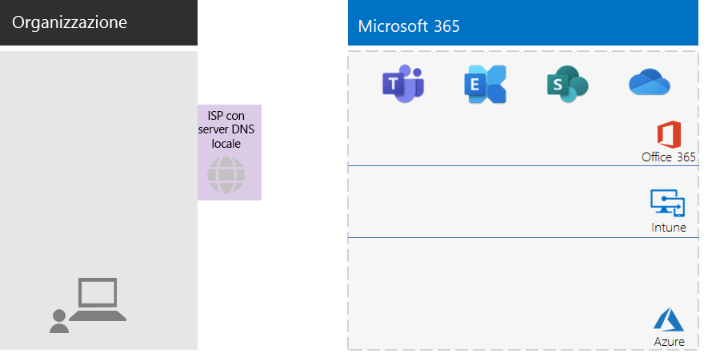

## Fase 2: identitàPhase 2: Identity

Ogni dipendente dell'organizzazione deve essere in grado di eseguire l'accesso. Per tale operazione è richiesto un account utente nel tenant di Azure Active Directory (Azure AD) dell'abbonamento a Microsoft 365 per le aziende.Each employee of your organization must be able to sign in, which requires a user account in the Azure Active Directory (Azure AD) tenant of your Microsoft 365 for enterprise subscription. Si usano quindi i gruppi per contenere gli account utente e altri gruppi per comunicare o accedere alle risorse autorizzate, ad esempio un sito di SharePoint Online o un team.Groups are then used to contain user accounts and other groups to communicate or gain access to permissioned resources, such as a SharePoint Online site or a team. 

### Account amministratoreAdministrator accounts

Per proteggere gli account utente di amministratore globale, richiedere password complesse e l'autenticazione a più fattori (MFA).Protect your global administrator user accounts by requiring strong passwords and multi-factor authentication (MFA). Per altre informazioni, vedere [Proteggere gli account amministratore globale](identity-create-protect-global-admins.md#protect-global-administrator-accounts).See [Protect global administrator accounts](identity-create-protect-global-admins.md#protect-global-administrator-accounts) for more information.

Se l'organizzazione richiede una sicurezza elevata e si dispone di Microsoft 365 E5, usare Azure AD Privileged Identity Management per abilitare l'accesso come amministratore just-in-time.If your organization requires high security and you have Microsoft 365 E5, use Azure AD Privileged Identity Management to enable just-in-time administrator access. Per altre informazioni, vedere [Configurare gli amministratori globali su richiesta](identity-create-protect-global-admins.md#identity-pim).See [Set up on-demand global administrators](identity-create-protect-global-admins.md#identity-pim) for more information.

### Consigli per i gruppiRecommendations for groups

Se si dispone di un dominio di AD DS locale, continuare a usare i gruppi di Microsoft 365 per le aziende come gruppi in Azure AD.If you have an on-premises AD DS domain, continue to use those groups in Microsoft 365 for enterprise as groups in Azure AD.

Se non si dispone di un dominio di AD DS locale, creare gruppi di sicurezza in Azure AD con questi livelli di sicurezza.If you don't have an on-premises AD DS domain, create security groups in Azure AD using these levels of security.

| Livello di protezioneSecurity level | DescrizioneDescription | EsempiExamples |
|:-------|:-----|:-----|
| Di baseBaseline | Si tratta di uno standard minimo predefinito per la protezione dei dati, delle identità e dei dispositivi che accedono ai dati.This is a minimum and default  standard for protecting data and the identities and devices that access your data.    È adatto, in genere, alla maggior parte dei dati dell'organizzazione gestiti dalla maggior parte degli utenti.This is typically most of your organization's data managed by most of your users. | Gruppi per gli operatori sul campo, che operano ad esempio nel settore vendite, marketing, assistenza clienti, amministrazione e produzione.Groups for first line workers, such as sales, marketing, support, administration, and manufacturing. |
| Dati sensibiliSensitive | Si tratta di un livello di protezione aggiuntivo per un sottoinsieme di dati che richiedono un livello di protezione ulteriore rispetto a quello di base.This is additional protection for a subset of your data that must be protected beyond the baseline level. Questi gruppi includono utenti che usano e creano dati riservati specifici di reparti e progetti e che non devono essere disponibili per tutti gli utenti.These groups contain users that use and create sensitive data that is specific to departments and projects that are not meant to be available to everyone. | Team di prodotto o marketing che sviluppano prodotti futuriProduct or marketing teams that are developing future products |
| Riservatezza elevataHighly regulated | Si tratta del livello di protezione più elevato per una quantità generalmente ridotta di dati classificati come altamente riservati, considerati come proprietà intellettuale o segreti commerciali, oppure per dati soggetti al rispetto di normative di sicurezza.This is the highest level of protection for a typically small amount of data that is highly classified, considered intellectual property or trade secrets, or data that must adhere to security regulations. |  Team di ricerca, legale, finanziario o team che archiviano o usano i dati di clienti o partner.Research, legal, and financial teams, or teams storing or using customer or partner data. |
||||

### Identità ibridaHybrid identity

Se si ha un dominio di Active Directory locale, è necessario sincronizzare il set di account utente, gruppi e contatti del dominio con il tenant di Azure AD dell'abbonamento a Microsoft 365 per le aziende.If you have an on-premises AD DS domain, you need to synchronize the set of user accounts, groups, and contacts of your domain with the Azure AD tenant of your Microsoft 365 for enterprise subscription. Per un’organizzazione non aziendale, configurare Azure AD Connect in un server con sincronizzazione dell'hash delle password (PHS).For your non-enterprise, you configure Azure AD Connect on a server with password hash synchronization (PHS). Per altre informazioni, vedere [Sincronizzare le identità](identity-add-user-accounts.md#synchronize-identities-for-hybrid-identity).See [Synchronize identities](identity-add-user-accounts.md#synchronize-identities-for-hybrid-identity) for more information.

### Accessi utente più sicuri con i criteri di Accesso condizionaleMore secure user access with Conditional Access policies

Azure AD valuta le condizioni degli accessi utente e può usare i criteri di Accesso condizionale per concedere o negare l'accesso, nonché imporre ulteriori azioni da eseguire per completare l'accesso.Azure AD evaluates the conditions of user sign-ins and can use Conditional Access policies to grant or deny access and impose further actions that must be taken to complete the sign-in. Ad esempio, se Azure AD stabilisce che l'accesso avviene in condizioni di rischio medio o elevato, può richiedere all'utente di eseguire l'autenticazione a più fattori per completare l'accesso.For example, if Azure AD determines that the sign-in is happening under medium or high-risk conditions, it can require the user to perform MFA to complete the sign-in.

I criteri di Accesso condizionale vengono applicati agli account utente o ai gruppi.You apply Conditional Access policies to user accounts or groups. Per facilitare l'assegnazione dei criteri di Accesso condizionale, creare i gruppi di sicurezza di Azure AD seguenti nell'organizzazione:To facilitate an easier assignment of Conditional Access policies, create these Azure AD security groups in your organization:

- BASELINEBASELINE

  Include i gruppi o gli account utente per gli utenti con accesso ai dati di base.Contains the groups or user accounts for users with access to baseline data.

- SENSITIVESENSITIVE

  Include i gruppi o gli account utente per gli utenti con accesso ai dati riservati.Contains the groups or user accounts for users with access to sensitive data.

- HIGHLY-REGULATEDHIGHLY-REGULATED

  Include i gruppi o gli account utente per gli utenti con accesso ai dati con riservatezza elevata.Contains the groups or user accounts for users with access to highly regulated data.

- COND-ACCESS-EXCLUDECOND-ACCESS-EXCLUDE

  Gruppo vuoto da usare per escludere temporaneamente un utente dai criteri di Accesso condizionale.An empty group that you can use to temporarily exclude a user from Conditional Access policies.

Ecco un elenco dei criteri di Accesso condizionale di Azure AD da abilitare o creare.Here is the list of Azure AD Conditional Access policies to enable or create.

| Criterio di Accesso condizionale di Azure ADAzure AD Conditional Access policy | Gruppi a cui si applicaGroups to which it applies |
|:------|:-----|
| Criterio di base: Richiedere l'autenticazione a più fattori per gli amministratoriBaseline policy: Require MFA for admins | Questo criterio si applica ai ruoli amministratore, pertanto non è necessario specificare i gruppi.This policy applies to admin roles, so no groups need to be specified. Questo criterio deve solo essere abilitato.This policy just needs to be enabled. Tutti i criteri successivi devono essere creati e abilitati.All subsequent policies need to be created and enabled. |
| Bloccare i client che non supportano l'autenticazione modernaBlock clients that don't support modern authentication | Selezionare "Tutti gli utenti" nelle impostazioni di criteri.Select "All users" in the policy settings. |
| Richiedere l'autenticazione a più fattori quando il rischio di accesso è considerato medio o elevato (richiede Microsoft 365 E5)Require MFA when sign-in risk is medium or high (requires Microsoft 365 E5) | BASELINEBASELINE |
| Richiedere l'autenticazione a più fattori quando il rischio di accesso è considerato basso, medio o elevato (richiede Microsoft 365 E5)Require MFA when sign-in risk is low, medium, or high (requires Microsoft 365 E5) | SENSITIVESENSITIVE |
| Richiedere sempre l'autenticazione a più fattoriAlways require MFA | HIGHLY-REGULATEDHIGHLY-REGULATED |
| Richiedere app approvate in dispositivi iOS e AndroidRequire approved apps on iOS and Android devices | BASELINE, SENSITIVE, HIGHLY-REGULATEDBASELINE, SENSITIVE, HIGHLY-REGULATED |
| Richiedere computer conformiRequire compliant PCs | BASELINEBASELINE |
| Richiedere computer e dispositivi iOS e Android conformiRequire compliant PCs and iOS and Android devices | SENSITIVE, HIGHLY-REGULATEDSENSITIVE, HIGHLY-REGULATED |
|||

Ecco il criterio di rischio utente di Azure AD Identity Protection (richiede Microsoft 365 E5) da creare e abilitare.Here is the Azure AD Identity Protection (requires Microsoft 365 E5) user risk policy to create and enable.

| Criterio di rischio utente di Azure AD Identity ProtectionAzure AD Identity Protection user risk policy | Gruppi a cui si applica il criterioGroups to which it applies |
|:------|:-----|
| Gli utenti a rischio elevato devono modificare le passwordHigh risk users must change passwords | Selezionare "Tutti gli utenti" nelle impostazioni di criteri.Select "All users" in the policy settings. |
|||

Per le istruzioni, vedere [Criteri comuni di identità e accesso dei dispositivi](identity-access-policies.md).See [Common identity and device access policies](identity-access-policies.md) for the instructions.

### Gruppi per facilitare la gestioneGroups for easier management

Ecco alcune funzionalità che consentono di facilitare la gestione di gruppi e licenze.Here are some features that can make group and licensing management easier for you.

| FunzionalitàFeature | UsoUse |
|:------|:-----|
| Gestione gruppi self-serviceSelf-service group management | Consentire la gestione dei gruppi di Azure AD ai proprietari del gruppo anziché al personale IT.Allow management of Azure AD groups by group owners instead of IT staff. Per altre informazioni, vedere [Gestione gruppi self-service](identity-use-group-management.md#allow-users-to-create-and-manage-their-own-groups).See [Self-service group management](identity-use-group-management.md#allow-users-to-create-and-manage-their-own-groups) for more information. |
| Appartenenza a gruppi dinamiciDynamic group membership | Configurare l'aggiunta o la rimozione automatica degli account utente dai gruppi di Azure AD in base agli attributi dell'account utente, ad esempio il reparto o il paese.Configure automatic addition or removal of user accounts from Azure AD groups based on user account attributes, such as Department or Country. Per altre informazioni, vedere [Appartenenza a gruppi dinamici](identity-use-group-management.md#set-up-dynamic-group-membership).See [Dynamic group membership](identity-use-group-management.md#set-up-dynamic-group-membership) for more information. |
| Licenze basate sui gruppiGroup-based licensing | Usare l'appartenenza ai gruppi per assegnare o rimuovere automaticamente le licenze per gli account utente.Use group membership to automatically assign or unassign licenses to user accounts. Per altre informazioni, vedere [Licenze basate sui gruppi](identity-use-group-management.md#set-up-automatic-licensing).See [Group-based licensing](identity-use-group-management.md#set-up-automatic-licensing) for more information. |
|  |  |

Se si usano licenze basate sui gruppi, creare un gruppo denominato LICENSED che includerà i nomi degli account utente a cui è assegnata una licenza di Microsoft 365 per le aziende.If you are using group-based licensing, create a group named LICENSED to contain user account names that are assigned a Microsoft 365 for enterprise license.

### Monitorare gli accessi utenteMonitor user access

Se si dispone di Microsoft 365 E5, è possibile usare Azure AD Identity Protection per monitorare e analizzare gli accessi utente e verificare se le credenziali sono state compromesse.If you have Microsoft 365 E5, you can use Azure AD Identity Protection to monitor and analyze user sign-ins for credential compromise. Per altre informazioni, vedere [Proteggere dalla compromissione delle credenziali](identity-secure-user-sign-ins.md#protect-against-credential-compromise).See [Protect against credential compromise](identity-secure-user-sign-ins.md#protect-against-credential-compromise) for more information.

### Configurazione attualeYour configuration so far

Ecco una grafica riepilogativa della fase Identità per l'identità ibrida in cui sono evidenziati gli elementi esistenti e quelli nuovi.Here is a visual summary of the Identity phase for hybrid identity, with existing and new elements highlighted.

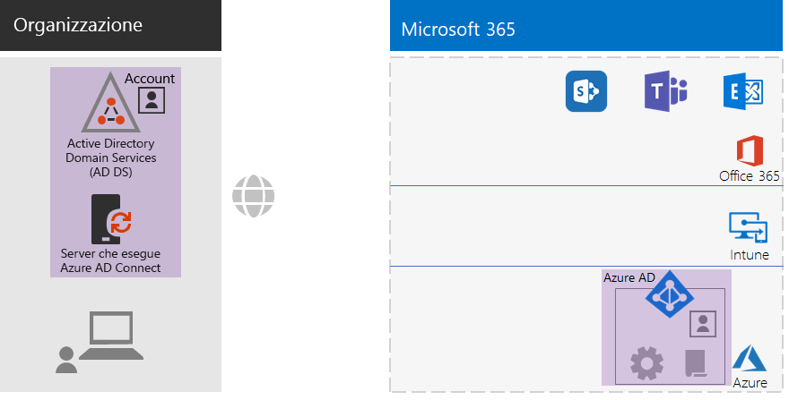
 
Gli elementi nuovi ed evidenziati della fase identità ibrida includono:The new and highlighted hybrid identity elements include:
 
|||
|:------:|:-----|
| 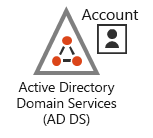 | Un dominio di AD DS locale con account utente e gruppi.An on-premises AD DS domain with user accounts and groups. |
| 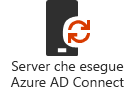 | Un server basato su Windows che esegue Azure AD Connect.A Windows-based server running Azure AD Connect. |
|  | Il set sincronizzato di account utente e gruppi di AD DS in Azure AD.The synchronized set of AD DS user accounts and groups in Azure AD. |
|  | Impostazioni di Azure AD per l'autenticazione, per proteggere gli account globali e semplificare la gestione dei gruppi e delle licenze.Azure AD settings for authentication, securing global accounts, and making it easier to manage groups and licenses. |
|  | Criteri di Accesso condizionale di Azure AD.Azure AD Conditional Access policies. |
|||

Ecco una grafica riepilogativa della fase Identità per l'identità solo cloud, in cui sono evidenziati i nuovi elementi.Here is a visual summary of the Identity phase for cloud-only identity, with the new elements highlighted.

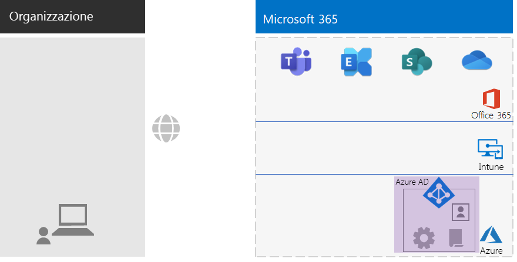
 
Gli elementi nuovi ed evidenziati dell'identità solo cloud includono:The new and highlighted cloud-only identity elements include:
 
|||
|:------:|:-----|
|  | Account utente e gruppi in Azure AD.The user accounts and groups in Azure AD. |
|  | Impostazioni di Azure AD per l'autenticazione, per proteggere gli account globali e semplificare la gestione dei gruppi e delle licenze.Azure AD settings for authentication, securing global accounts, and making it easier to manage groups and licenses. |
|  | Criteri di Accesso condizionale di Azure AD.Azure AD Conditional Access policies. |
|||

## Fase 3: Windows 10 EnterprisePhase 3: Windows 10 Enterprise

Per assicurarsi che i dispositivi Windows 10 Enterprise siano integrati nell'infrastruttura di identità e sicurezza di Microsoft 365 per le aziende, è possibile scegliere tra le opzioni seguenti:To ensure that your Windows 10 Enterprise devices are integrated into the identity and security infrastructure of Microsoft 365 for enterprise, here are your options:

- Ibrido (è disponibile un dominio di AD DS locale)Hybrid (you have an on-premises AD DS domain)

  Aggiungere al tenant di Azure AD ogni dispositivo Windows 10 Enterprise esistente già presente nel dominio di AD DS.For each existing Windows 10 Enterprise device already joined to your AD DS domain, join them to the Azure AD tenant. Per altre informazioni, vedere [Come configurare dispositivi aggiunti all'identità ibrida di Azure Active Directory](https://go.microsoft.com/fwlink/p/?linkid=872870).See [How to configure hybrid Azure Active Directory joined devices](https://go.microsoft.com/fwlink/p/?linkid=872870) for the instructions.

  Aggiungere ogni nuovo dispositivo Windows 10 Enterprise al dominio di AD DS e al tenant di Azure AD.For each new Windows 10 Enterprise device, join them to your AD DS domain, and then join them to the Azure AD tenant.

  Registrare ogni dispositivo Windows 10 Enterprise per la gestione dei dispositivi mobili.For each Windows 10 Enterprise device, enroll them for mobile device management. Vedere [Registrare un dispositivo di Windows 10 usando i Criteri di gruppo](https://go.microsoft.com/fwlink/p/?linkid=872871) per le istruzioni.See [Enroll a Windows 10 device with Intune by using a Group Policy](https://go.microsoft.com/fwlink/p/?linkid=872871) for the instructions.

- Solo cloud (un dominio di AD DS locale non è disponibile)Cloud-only (you do not have an on-premises AD DS domain)

  Aggiungere ogni dispositivo Windows 10 Enterprise al tenant di Azure AD dell'abbonamento.Join each Windows 10 Enterprise device to the Azure AD tenant of your subscription.

  Per altre informazioni, vedere [Aggiungere il dispositivo aziendale alla rete dell'organizzazione](https://docs.microsoft.com/azure/active-directory/user-help/user-help-join-device-on-network).See [Join your work device to your organization's network](https://docs.microsoft.com/azure/active-directory/user-help/user-help-join-device-on-network) for more information.

Dopo essere stato installato e aggiunto ogni dispositivo Windows 10 Enterprise installa automaticamente gli aggiornamenti per il servizio cloud Windows Update per le aziende.Once installed and joined, each Windows 10 Enterprise device automatically installs updates from the Windows Update for Business cloud service. In un'organizzazione non aziendale non è in genere necessario configurare un'infrastruttura per distribuire e installare gli aggiornamenti Windows 10.There is typically no need in a non-enterprise organization to set up an infrastructure to distribute and install Windows 10 updates.

### Configurazione attualeYour configuration so far

Ecco una grafica riepilogativa della fase Windows 10 Enterprise in cui sono evidenziati i nuovi elementi.Here is a visual summary of the Windows 10 Enterprise phase with the new elements highlighted.

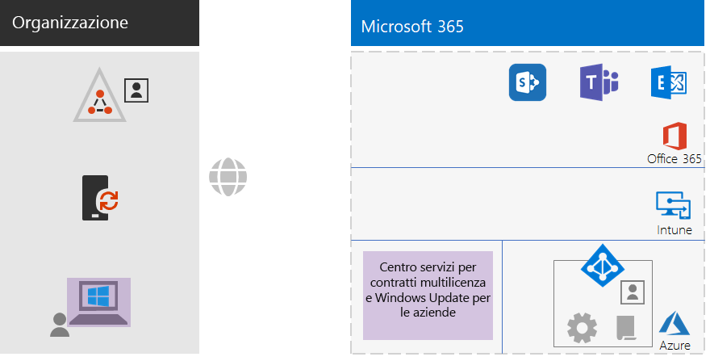
 
Gli elementi nuovi ed evidenziati della fase Windows 10 Enterprise includono:The new and highlighted Windows 10 Enterprise elements include:

|||
|:------:|:-----|
|  | Windows 10 Enterprise installato nei dispositivi di Windows, con un portatile locale come esempio.Windows 10 Enterprise installed on Windows devices, with an on-premises laptop as an example. |
| 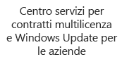 | Il Volume Licensing Service Center, che fornisce le immagini per le nuove installazioni di Windows 10 Enterprise, e il servizio Windows Update per le aziende, che fornisce gli aggiornamenti più recenti.The Volume Licensing Service Center, which provides images for new installations of Windows 10 Enterprise, and the Windows Update for Business service, which provides the latest updates. |
|||

## Fase 4: Office 365 ProPlusPhase 4: Office 365 ProPlus

Microsoft 365 per le aziende include Office 365 ProPlus, la versione in abbonamento di Microsoft Office.Microsoft 365 for enterprise includes Office 365 ProPlus, the subscription version of Microsoft Office. Come Office 2016 o Office 2019, Office 365 ProPlus viene installato direttamente nei dispositivi client.Like Office 2016 or Office 2019, Office 365 ProPlus is installed directly on your client devices. Office 365 ProPlus riceve però regolarmente gli aggiornamenti delle nuove funzionalità.However, Office 365 ProPlus receives updates that include new features on a regular basis. Per altre informazioni, vedere [Informazioni su Office 365 ProPlus nell'azienda](https://docs.microsoft.com/deployoffice/about-office-365-proplus-in-the-enterprise).See [About Office 365 ProPlus in the enterprise](https://docs.microsoft.com/deployoffice/about-office-365-proplus-in-the-enterprise) for more information.

Per un'organizzazione non aziendale, installare manualmente Office 365 ProPlus nei dispositivi, che possono essere dispositivi Windows, iOS e Android.For your non-enterprise organization, you manually install Office 365 ProPlus on devices, which can include Windows, iOS, and Android devices. Questa operazione può essere eseguita dall'amministratore durante la preparazione di un nuovo dispositivo per l'uso oppure dall'utente durante il processo di onboarding.This can be done as part of preparing a new device for use, or by the user as part of their onboarding process.

In entrambi i casi, l'amministratore o l'utente accede al portale di Office 365 disponibile all'indirizzo https://portal.office.com.In either case, the administrator or the user signs in to the Office 365 portal at https://portal.office.com. Nella scheda **Microsoft Office Home** fare clic su **Installa Office** ed eseguire il processo di installazione.On the **Microsoft Office Home** tab, click **Install Office** and step through the installation process.

Gli aggiornamenti delle funzionalità di Office 365 ProPlus vengono scaricati ogni mese da ogni computer in cui è installato.Feature updates to Office 365 ProPlus are downloaded monthly by each computer on which it is installed. In un'organizzazione non aziendale non è in genere necessario configurare un'infrastruttura per distribuire gli aggiornamenti di Office 365 ProPlus.There is typically no need in a non-enterprise organization to set up an infrastructure to distribute Office 365 ProPlus updates. 

### Configurazione attualeYour configuration so far

Ecco una grafica riepilogativa della fase Office 365 ProPlus in cui sono evidenziati i nuovi elementi.Here is a visual summary of the Office 365 ProPlus phase with the new elements highlighted.

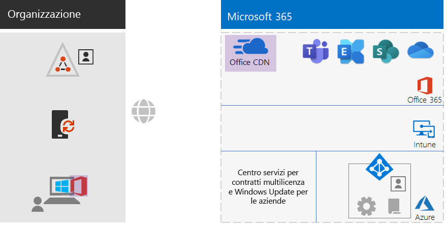
 
Gli elementi nuovi ed evidenziati della fase Office 365 ProPlus includono:The new and highlighted Office 365 ProPlus elements include:
 
|||
|:------:|:-----|
|  | Office 365 ProPlus installato nei dispositivi, con un portatile locale come esempio.Office 365 ProPlus installed on devices, with an on-premises laptop as an example. |
|  | Rete per la distribuzione di contenuti di Office (CDN) di Office per Office 365 ProPlus, a cui i dispositivi accedono per scaricare gli aggiornamenti di Office 365 ProPlus.The Office Content Delivery Network (CDN) for Office 365 ProPlus, which devices access for Office 365 ProPlus updates. |
|||

## Fase 5: gestione dei dispositivi mobiliPhase 5: Mobile device management

Microsoft 365 per le aziende include Microsoft Intune per la gestione dei dispositivi mobili.Microsoft 365 for enterprise includes Microsoft Intune for mobile device management. Con Intune è possibile gestire dispositivi Windows, iOS, Android e macOS per proteggere l'accesso alle risorse dell'organizzazione, inclusi i dati.With Intune, you can manage Windows, iOS, Android, and macOS devices to protect access to your organization's resources, including your data. Intune usa gli account utente, del gruppo e del computer di Azure AD.Intune uses the user, group, and computer accounts of Azure AD.

Intune offre due tipi di gestione dei dispositivi mobili:Intune provides two types of mobile device management:

- La gestione dei dispositivi mobili (MDM) avviene quando i dispositivi vengono registrati in Intune.Mobile device management (MDM) is when devices get enrolled in Intune. Dopo la registrazione diventano dispositivi gestiti e possono ricevere i criteri, le regole e le impostazioni usate dall'organizzazione.Once enrolled, they are managed devices and can receive the policies, rules, and settings used by your organization. Questi tipi di dispositivi appartengono in genere all'organizzazione e vengono concessi ai dipendenti.These types of devices are typically owned by your organization and issued to your employees.

- È possibile che gli utenti con dispositivi personali non vogliano registrare i propri dispositivi o consentirne la gestione in Intune con criteri e impostazioni dell'amministratore.Users with their own personal devices may not want to enroll their devices or be managed by Intune with your policies and settings. È comunque necessario proteggere le risorse e i dati dell'organizzazione.However, you still need to protect your organization's resources and data. Per questo scenario è possibile proteggere le app con la gestione di applicazioni mobili (MAM).For this scenario, you can protect your apps with mobile application management (MAM).  

I criteri di Intune consentono di attivare la conformità dei dispositivi e la protezione delle app.Intune policies can enforce device compliance and app protection. Ecco l'elenco dei criteri di Intune da creare.Here is the list of Intune policies to create.

| Criteri di IntuneIntune policies | Gruppi a cui si applica il criterioGroups to which it applies |
|:------|:-----|
| Criteri di conformità dei dispositivi per WindowsDevice compliance policy for Windows | BASELINE, SENSITIVE, HIGHLY-REGULATEDBASELINE, SENSITIVE, HIGHLY-REGULATED |
| Criteri di conformità dei dispositivi per iOSDevice compliance policy for iOS | SENSITIVE, HIGHLY-REGULATEDSENSITIVE, HIGHLY-REGULATED |
| Conformità dei dispositivi per MacOSDevice compliance for macOS | SENSITIVE, HIGHLY-REGULATEDSENSITIVE, HIGHLY-REGULATED |
| Criteri di conformità dei dispositivi per Android e Android EnterpriseDevice compliance policy for Android and Android Enterprise | SENSITIVE, HIGHLY-REGULATEDSENSITIVE, HIGHLY-REGULATED |
| Criteri di protezione delle app per iOSApp protection policy for iOS | BASELINE, SENSITIVE, HIGHLY-REGULATEDBASELINE, SENSITIVE, HIGHLY-REGULATED |
| Criteri di protezione delle app per MacOSApp protection policy for macOS | BASELINE, SENSITIVE, HIGHLY-REGULATEDBASELINE, SENSITIVE, HIGHLY-REGULATED |
| Criteri di protezione delle app per Android e Android EnterpriseApp protection policy for Android and Android Enterprise | BASELINE, SENSITIVE, HIGHLY-REGULATEDBASELINE, SENSITIVE, HIGHLY-REGULATED |
|||
    
Per le istruzioni, vedere [Criteri comuni di identità e accesso dei dispositivi](identity-access-policies.md).See [Common identity and device access policies](identity-access-policies.md) for the instructions.

### Configurazione attualeYour configuration so far

Ecco una grafica riepilogativa della fase Gestione dei dispositivi mobili in cui sono evidenziati i nuovi elementi.Here is a visual summary of the Mobile Device Management phase with the new elements highlighted.

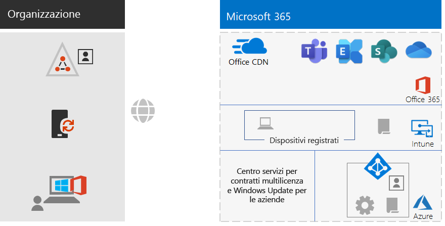
 
Gli elementi nuovi ed evidenziati della fase Gestione dei dispositivi mobili includono:The new and highlighted mobile device management elements include:

|||
|:------:|:-----|
|  | Dispositivi registrati in Intune, con un portatile locale che esegue Windows 10 Enterprise come esempio.Devices that are enrolled in Intune, showing an on-premises laptop running Windows 10 Enterprise as an example. |
|  | Criteri di Intune per la conformità dei dispositivi e la protezione delle app.Intune policies for device compliance and app protection. |
|||

## Fase 6: protezione delle informazioniPhase 6: Information protection

Microsoft 365 per le aziende include numerose funzionalità di protezione delle informazioni che consentono di trattare in modo diverso le classificazioni dei dati applicando diversi livelli di governance, sicurezza e protezione.Microsoft 365 for enterprise has a host of information protection features that allow you to treat classifications of data differently by applying different levels of governance, security, and protection. 

Ad esempio, la normale corrispondenza tra la maggior parte dei dipendenti e i documenti a cui lavorano richiedono un determinato livello di base di protezione.For example, normal correspondence between most employees and the documents on which they work need a certain baseline level of protection. I record finanziari, i dati dei clienti e la proprietà intellettuale richiedono un livello di protezione superiore.Financial records, customer data, and your intellectual property need a higher level of protection.

Il primo passo per una strategia di protezione delle informazioni consiste nel determinare i livelli di protezione.The first step to an information protection strategy is to determine the levels of protection. Molte organizzazioni usano questi livelli, che vengono già usati per i criteri di Accesso condizionale:Many organizations use these levels, which are already being used for Conditional Access policies:

- Protezione di baseBaseline

  Gli esempi includono le normali comunicazioni aziendali (posta elettronica) e i file dei dipendenti dei reparti di amministrazione, vendita e supporto.Examples include normal business communications (email) and files for administrative, sales, and support workers.

- Dati sensibiliSensitive

  Gli esempi includono le informazioni finanziarie e legali, nonché i dati di ricerca e sviluppo relativi a nuovi prodotti o servizi.Examples include financial and legal information and research and development data for new products or services.

- Dati altamente regolamentatiHighly regulated

  Gli esempi includono i dati personali dei clienti e partner e la proprietà intellettuale dell'organizzazione.Examples include customer and partner personally identifiable information and your organization's strategic plans or intellectual property.

In base a questi livelli di sicurezza dei dati, il passaggio successivo consiste nell'identificare e implementare:Based on these levels of data security, the next step is to identify and implement:

- Tipi di informazioni sensibili personalizzatiCustom sensitive information types

  Microsoft 365 offre un'ampia scelta di tipi di informazioni riservate, ad esempio il codice fiscale o il numero della carta di credito.Microsoft 365 supplies a wide selection of sensitive information types, such as health service and credit card numbers. Se non si riesce a trovare quello necessario nell'elenco, è possibile crearne uno personalizzato.If you do not find one that you need in the supplied list, you can create your own.

- Etichette di conservazioneRetention labels

  Per garantire la conformità ai criteri dell'organizzazione e alle normative locali, può essere necessario specificare il periodo di conservazione di tipi di documenti specifici o documenti con contenuti specifici.To comply with organization policies and regional regulations, you might have to specify how long specific types of documents or documents with specific contents should be retained. È possibile implementare questa funzionalità per la posta elettronica e il documento usando le etichette di conservazione.You can implement this for email and documents using retention labels. Le etichette di conservazione possono essere usate anche in combinazione con i criteri di prevenzione della perdita dei dati che possono limitare la condivisione di file o e-mail all'esterno dell'organizzazione.Retention labels can also be used in conjunction with Data Loss Prevention (DLP) policies that can restrict the sharing of files or email outside your organization.

- Etichette di riservatezzaSensitivity labels

  È possibile assegnare a documenti o messaggi di posta elettronica un'etichetta di riservatezza denominata per applicare i livelli aggiuntivi di sicurezza.You can label email or documents with a named sensitivity label so that additional levels of security can be applied. Alcuni esempi sono le filigrane, la crittografia e le autorizzazioni che consentono di specificare gli utenti autorizzati ad accedere alla posta elettronica e ai documenti e le operazioni consentite.Examples are watermarks, encryption, and permissions, which specify who is allowed to access the email or document and what they are allowed to do.

Per altre informazioni, vedere [Tipi di classificazione Microsoft 365](infoprotect-configure-classification.md#microsoft-365-classification-types).See [Microsoft 365 classification types](infoprotect-configure-classification.md#microsoft-365-classification-types) for more information.

Se si usano le etichette di riservatezza con le autorizzazioni, può essere necessario creare gruppi di sicurezza di Office 365 aggiuntivi per definire gli utenti autorizzati a eseguire determinate operazioni su posta elettronica e documenti a cui è stata applicata l'etichetta di riservatezza.If you use sensitivity labels with permissions, you might have to create additional Office 365 security groups to define who is allowed to do what with email and documents that have the sensitivity label applied. 

Ad esempio, è necessario creare un'etichetta di riservatezza RESEARCH per proteggere la posta elettronica e i documenti del team di ricerca.For example, you need to create a RESEARCH sensitivity label to protect the email and documents of your research team. È possibile stabilire se:You determine that:

- I ricercatori devono essere in grado di modificare i documenti contrassegnati dall'etichetta della sensibilità della ricerca.Researchers must have the ability to change documents marked with the RESEARCH sensitivity label.
- I dipendenti non ricercatori devono solo avere la possibilità di visualizzare documenti contrassegnati dall'etichetta della sensibilità della ricerca.Non-research employees only need to have the ability to view documents marked with the RESEARCH sensitivity label. 

Questo significa che è necessario creare e gestire due gruppi di Office 365 aggiuntivi:This means you need to create and manage two additional Office 365 groups:

- RESEARCH-ALLRESEARCH-ALL
- RESEARCH-VIEWRESEARCH-VIEW

Questi gruppi e le relative autorizzazioni vengono incluse nella configurazione dell'etichetta di riservatezza RESEARCH.These groups and their permissions become part of the RESEARCH sensitivity label's configuration.

Per le etichette di riservatezza configurate con le autorizzazioni basate su gruppi, è necessario gestire l'appartenenza a questi gruppi.For sensitivity labels configured with group-based permissions, you must manage the membership of these groups.

### Configurazione attualeYour configuration so far

Ecco una grafica riepilogativa della fase Protezione delle informazioni in cui sono evidenziati i nuovi elementi.Here is a visual summary of the Information Protection phase with the new elements highlighted.

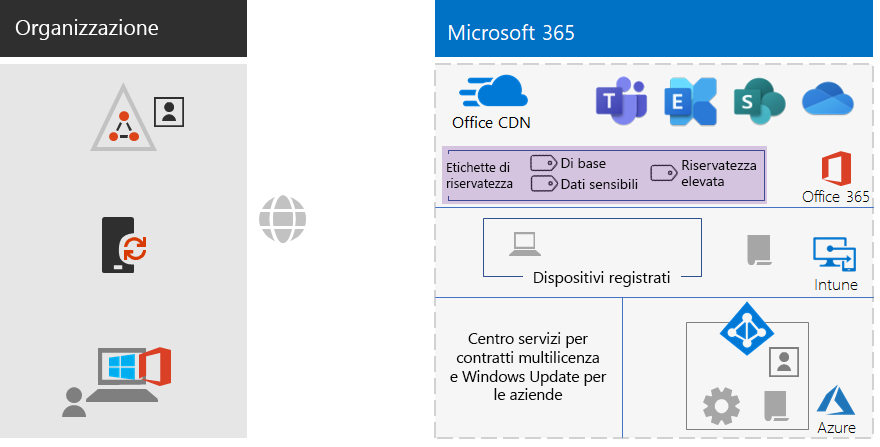
 
Gli elementi nuovi ed evidenziati della fase Protezione delle informazioni includono:The new and highlighted information protection elements include:
 
|||
|:------:|:-----|
|  | Etichette di riservatezza per i tre livelli di sicurezza che gli utenti possono applicare ai documenti e ai messaggi di posta elettronica.Sensitivity labels for the three levels of security that users can apply to documents and email. |
|||

La grafica non include le etichette di conservazione e i tipi di informazioni personalizzati.Custom information types and retention labels are not shown.

## OnboardingOnboarding

Con l'infrastruttura aziendale di Microsoft 365 per le aziende, è possibile aggiungere facilmente i dipendenti.With your Microsoft 365 for enterprise infrastructure in place, you can easily onboard your employees.

### Un nuovo dispositivo Windows 10 EnterpriseA new Windows 10 Enterprise device

Prima di assegnare a un dipendente un nuovo dispositivo Windows 10 Enterprise:Before giving an employee a new Windows 10 Enterprise device:

- Per identità ibridaFor hybrid identity

  Aggiungere il dispositivo al dominio AD DS, aggiungere il dispositivo al tenant di Azure AD e quindi registrare il dispositivo in Intune.Join the device to your AD DS domain, join the device to your Azure AD tenant, and then enroll the device in Intune.

- Per identità solo cloudFor cloud-only identity

  Aggiungere il dispositivo al tenant di Azure AD.Join the device to your Azure AD tenant.

### Dipendente esistente con un account utente di AD DSExisting employee with an AD DS user account

Durante l'onboarding iniziale per l'organizzazione quando si usa l'identità ibrida, aggiungere l'account utente di AD DS ai gruppi di Azure AD:As part of the initial onboarding for your organization when using hybrid identity, add the AD DS user account to these Azure AD groups:

- LICENSEDLICENSED
- I gruppi di sicurezza di AD DS o Azure AD appropriati che fanno parte dei gruppi BASELINE, SENSITIVE e HIGHLY-REGULATED di Azure ADThe appropriate AD DS or Azure AD security groups that are members of the BASELINE, SENSITIVE, and HIGHLY-REGULATED Azure AD groups
- Gruppi di etichette di riservatezza (se necessari)Sensitivity label groups (as needed)

Il dipendente esistente dovrebbe già essere aggiunto ai gruppi di AD DS a livello di gruppo di lavoro, reparto e area geografica.The existing employee should already be added to the appropriate workgroup, departmental, and regional AD DS groups.

È possibile aggiungere un account utente a più gruppi di Azure AD nell'interfaccia di amministrazione di Microsoft 365.You can add a user account to multiple Azure AD groups in the Microsoft 365 admin center. Nelle proprietà dell'account utente fare clic su **Gestisci gruppi > Aggiungere le membership**.From the properties of the user account, click **Manage groups > Add memberships**.

Se si vuole usare PowerShell, vedere questa [cartella di lavoro](https://github.com/MicrosoftDocs/microsoft-365-docs/raw/public/microsoft-365/media/deploy-foundation-infrastructure-non-enterprises/Group-License-Mgmt-PowerShell.xlsx)di Excel scaricabile, che genera i comandi di PowerShell basati su un account utente specificato e i nomi dei gruppi selezionati.If you want to use PowerShell, see this [downloadable Excel workbook](https://github.com/MicrosoftDocs/microsoft-365-docs/raw/public/microsoft-365/media/deploy-foundation-infrastructure-non-enterprises/Group-License-Mgmt-PowerShell.xlsx), which generates the PowerShell commands based on a specified user account and selected group names.

### Nuovo dipendente con account utente solo cloudNew employee with a cloud-only user account

Durante l'onboarding iniziale per l'organizzazione quando si usa l'identità solo cloud, aggiungere il nuovo account utente a questi gruppi:As part of the initial onboarding for your organization when using cloud-only identity, add the new user account to these groups:

- LICENSEDLICENSED
- I gruppi di sicurezza di Azure AD appropriati che fanno parte dei gruppi BASELINE, SENSITIVE e HIGHLY-REGULATED di Azure ADThe appropriate Azure AD security groups that are members of the BASELINE, SENSITIVE, and HIGHLY-REGULATED Azure AD groups
- Gruppi a livello di gruppo di lavoro, reparto e area geograficaWorkgroup, departmental, and regional groups
- Gruppi di etichette di riservatezza (se necessari)Sensitivity label groups (as needed)

### Accesso iniziale a Microsoft 365Initial sign-in to Microsoft 365

Per i dipendenti che accedono per la prima volta a Microsoft 365, istruirli a:For the first time employees sign in to Microsoft 365, instruct them to:

1. Accedere ai dispositivi con le credenziali del proprio account utente.Sign into their devices with their user account credentials.
2. In un browser accedere al portale di Office 365 all'indirizzo https://portal.office.com.Using a browser, sign in to the Office 365 portal at https://portal.office.com.
3. Nella scheda **Office 365 Home** fare clic su **Installa Office** per installare Office 365 ProPlus nel dispositivo.From the **Office 365 Home** tab, click **Install Office** to install Office 365 ProPlus on their device.

## Risultati finaliEnd results

Ecco i risultati della configurazione dell'infrastruttura di base di Microsoft 365 per le aziende per l'organizzazione non aziendale.Here are the results of configuring the Microsoft 365 for enterprise foundation infrastructure for your non-enterprise organization.

### Risultati per l'infrastrutturaInfrastructure results

Dopo la creazione e la configurazione dell'infrastruttura di Microsoft 365 per le aziende, si dovrebbe avere:After the build-out and configuration of your Microsoft 365 for enterprise infrastructure, you should have:

- Una connessione Internet locale per ogni ufficio con una larghezza di banda sufficiente, fornita da un ISP che usa un server DNS locale a livello di area geografica.A local Internet connection for each of your offices with sufficient bandwidth supplied by an ISP that uses a regionally local DNS server.
- Per l'identità ibrida, Azure AD Connect in esecuzione in un server che sincronizza il dominio di AD DS locale con il tenant di Azure AD.For hybrid identity, Azure AD Connect running on a server that synchronizes your on-premises AD DS domain with your Azure AD tenant.
- Questi gruppi:These groups:
  - LICENSEDLICENSED
  - COND-ACCESS-EXCLUDECOND-ACCESS-EXCLUDE
  - I gruppi di sicurezza di AD DS o Azure AD appropriati che fanno parte anche dei gruppi BASELINE, SENSITIVE e HIGHLY-REGULATED di Azure AD.The appropriate AD DS or Azure AD security groups that are also members of the BASELINE, SENSITIVE, and HIGHLY-REGULATED Azure AD groups 
  - Gruppi a livello di gruppo di lavoro, reparto e area geograficaWorkgroup, departmental, and regional groups
  - Gruppi di etichette di riservatezza di Office 365 (se necessari)Sensitivity label Office 365 groups (as needed)
- I criteri di Accesso condizionale per l'accesso ad Azure AD che usano i gruppi BASELINE, SENSITIVE, HIGHLY-REGULATED e COND-ACCESS-EXCLUDE di Azure AD.Azure AD sign-in Conditional Access policies that use the BASELINE, SENSITIVE, and HIGHLY-REGULATED, and COND-ACCESS-EXCLUDE Azure AD groups.
- Criteri di conformità dei dispositivi e delle applicazioni Intune.Intune application and device compliance policies.
- Tipi di informazioni riservate personalizzati (se necessari).Custom sensitive information types (as needed).
- Etichette di conservazione (se necessarie).Retention labels (as needed).
- Etichette di riservatezza (se necessarie).Sensitivity labels (as needed).

Ecco una grafica riepilogativa dell'infrastruttura se l'organizzazione usa l'identità ibrida, che include il dominio di AD DS, un server Azure AD Connect, nonché utenti e gruppi AD DS sincronizzati.Here is a visual summary of the infrastructure if your organization uses hybrid identity, which includes your AD DS domain, an Azure AD Connect server, and synchronized AD DS users and groups.

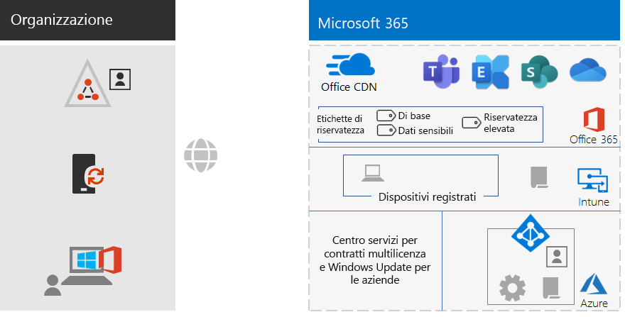
 
Ecco una grafica riepilogativa dell'infrastruttura se l'organizzazione usa l'identità solo cloud.Here is a visual summary of the infrastructure if your organization uses cloud-only identity.
 

### Risultati per i dipendentiEmployee results

Dopo l'onboarding ogni dipendente dovrebbe avere:After their onboarding, each employee should have:

- Un percorso di rete locale con prestazioni elevate per accedere dal dispositivo ai servizi cloud di Microsoft 365 nella propria area geografica.A performant, on-premises network path from their device to the Microsoft 365 cloud services in their region.
- Un account utente con queste appartenenze a gruppi:A user account with these group memberships:
   - LICENSEDLICENSED
   - I gruppi di sicurezza di AD DS o Azure AD appropriati che fanno parte anche dei gruppi BASELINE, SENSITIVE e HIGHLY-REGULATED di Azure AD per i criteri di Accesso condizionaleThe appropriate AD DS or Azure AD security groups, which are also members of the BASELINE, SENSITIVE, and HIGHLY-REGULATED Azure AD groups for Conditional Access policies 
   - Gruppi appropriati a livello di gruppo di lavoro, reparto e area geograficaThe appropriate workgroup, departmental, and regional groups
   - Gruppi di etichette di riservatezza di Office 365 (se necessari)Sensitivity label Office 365  groups (as needed)
- Un dispositivo Windows 10 Enterprise che:A Windows 10 Enterprise device that:
   - Appartiene al tenant di Azure AD (solo cloud) oppure sia al tenant di Azure AD che al dominio di AD DS (ibrido).Is joined to the Azure AD tenant (cloud-only) or to both the Azure AD tenant and your AD DS domain (hybrid).
   - Si aggiorna automaticamente con i miglioramenti e le opzioni di sicurezza più recenti dei prodotti Windows 10.Automatically updates itself with the latest Windows 10 Enterprise product improvements and security enhancements.
   - Include Office 365 ProPlus, che si aggiorna automaticamente con i miglioramenti e le opzioni di sicurezza più recenti dei prodotti Office.Has Office 365 ProPlus installed, which automatically updates itself with the latest Office product improvements and security enhancements.
   - Viene registrato in Intune ed è soggetto ai criteri di conformità dei dispositivi e di protezione delle app di Intune.Is enrolled in Intune and subject to Intune device compliance policies and app protection policies.

## Passaggio successivoNext step

Distribuire i [carichi di lavoro e gli scenari](deploy-workloads.md) per sfruttare le funzionalità e la configurazione dell'infrastruttura di base di Microsoft 365 per le aziende.Deploy your [workloads and scenarios](deploy-workloads.md) to take advantage of the features and configuration of your Microsoft 365 for enterprise foundation infrastructure.
