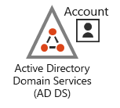
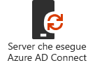
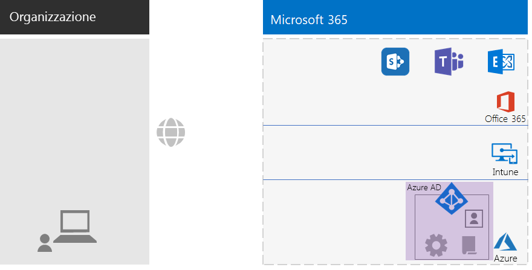
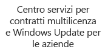
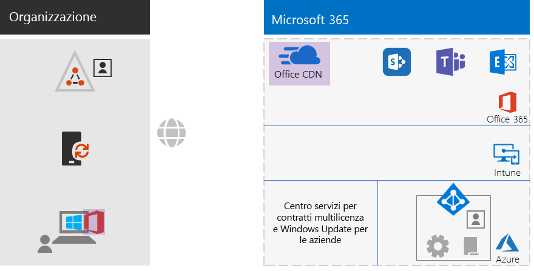
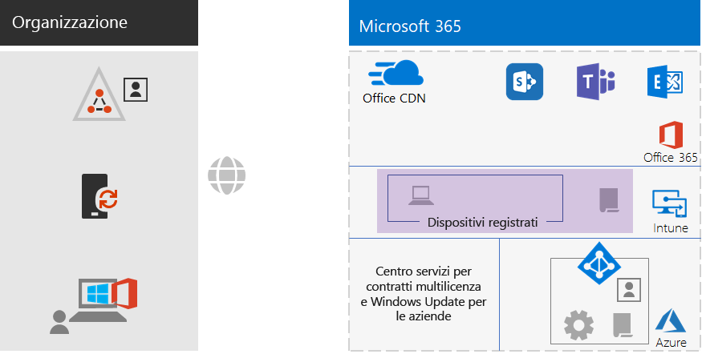
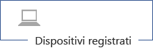
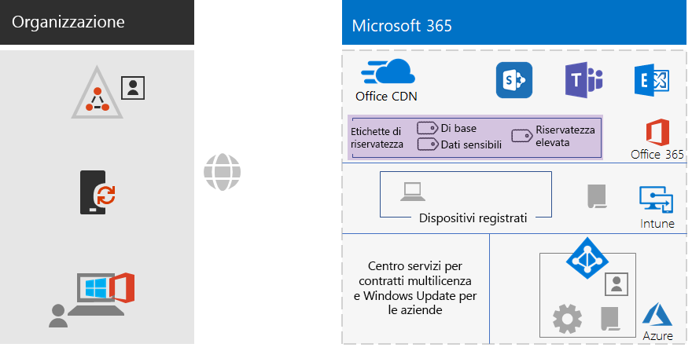
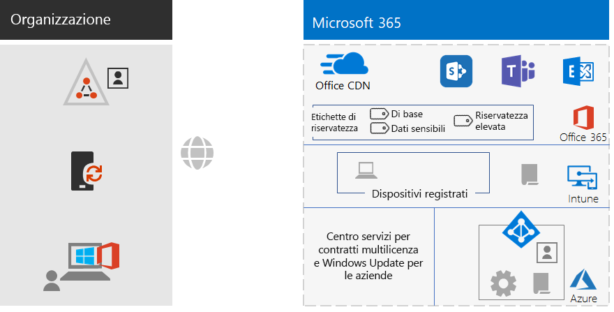

# Infrastruttura di base di Microsoft 365 per le aziende per organizzazioni non aziendali

Anche le organizzazioni non aziendali possono distribuire Microsoft 365 per le aziende e sfruttare in termini di business il valore di un'infrastruttura integrata e protetta che abilita il lavoro in team e libera la creatività. Un'organizzazione non aziendale è in genere costituita da:

- Numero ridotto di infrastrutture IT locali, ad esempio server di posta elettronica e file server e un dominio di Active Directory Domain Services (AD DS) o persino nessuna infrastruttura.
- Personale IT ridotto, in buona parte generico e non specializzato in una tecnologia o un carico di lavoro specifico, come la rete o la posta elettronica.

L'offerta Microsoft per le organizzazioni non aziendali di piccole dimensioni è [Microsoft 365 Business](https://www.microsoft.com/microsoft-365/business). Tuttavia, in alcuni casi può essere necessario implementare Microsoft 365 per le aziende, come descritto di seguito:

- Per l'organizzazione sono o saranno necessarie più di 300 licenze di Microsoft 365, che rappresentano il numero massimo di licenze gestibili per Microsoft 365 Business.
- L'organizzazione necessita di funzionalità di produttività, voce, sicurezza e analisi avanzate non disponibili con Microsoft 365 Business.

Questo articolo analizza una distribuzione semplificata dell'infrastruttura di base di Microsoft 365 per le aziende adatta per le organizzazioni non aziendali.

## Configurare l'abbonamento

È necessario configurare i domini DNS (Domain Name System) per l'abbonamento. Se si ha un abbonamento a Office 365, questa operazione è già stata completata. In caso contrario, seguire le istruzioni in [Aggiungere un dominio a Office 365](https://docs.microsoft.com/office365/admin/setup/add-domain?view=o365-worldwide).

In seguito, è necessario configurare la sicurezza aggiuntiva per Microsoft 365. Seguire le istruzioni in [Configurare il tenant di Office 365 per una maggiore sicurezza](https://docs.microsoft.com/office365/securitycompliance/tenant-wide-setup-for-increased-security).

## Fase 1: Funzionalità di rete

Le organizzazioni non aziendali dispongono in genere di connessioni a Internet locali in ogni ufficio e non usano server proxy, firewall o dispositivi di controllo dei pacchetti. Il provider di servizi Internet (ISP) che serve ogni ufficio dispone di un server DNS locale a livello di area geografica, di conseguenza il traffico viene reindirizzato al percorso di rete di Microsoft 365 più vicino agli uffici e agli utenti locali. Per altre informazioni, vedere [Configurare le connessioni Internet locali per ogni sede](networking-dns-resolution-same-location.md).

È quindi necessario solo verificare con l'ISP che la connessione in ogni ufficio:

- Usi un server DNS locale a livello di area geografica.
- Sia adeguata per le esigenze attuali e future, quando gli utenti inizieranno a usare altri servizi cloud di Microsoft 365.

Se si usano server proxy, firewall o dispositivi di controllo dei pacchetti, vedere [Configurare il bypass del traffico](networking-configure-proxies-firewalls.md) per informazioni su come ottimizzare le prestazioni dei servizi Microsoft 365.

### Configurazione attuale

Ecco una grafica riepilogativa in cui è evidenziato l'elemento della fase 1. La dicitura **Organizzazione** può corrispondere a più uffici, ognuno dei quali dispone di una connessione Internet locale con un ISP che usa un server DNS locale a livello di area geografica. Grazie all'ISP, gli utenti di ogni ufficio possono raggiungere il percorso di rete Microsoft 365 più vicino e le risorse dell'abbonamento a Microsoft 365.

## Fase 2: identità

Ogni dipendente dell'organizzazione deve essere in grado di eseguire l'accesso. Per tale operazione è richiesto un account utente nel tenant di Azure Active Directory (Azure AD) dell'abbonamento a Microsoft 365 per le aziende. Si usano quindi i gruppi per contenere gli account utente e altri gruppi per comunicare o accedere alle risorse autorizzate, ad esempio un sito di SharePoint Online o un team. 

### Account amministratore

Per proteggere gli account utente di amministratore globale, richiedere password complesse e l'autenticazione a più fattori (MFA). Per altre informazioni, vedere [Proteggere gli account amministratore globale](identity-create-protect-global-admins.md#protect-global-administrator-accounts).

Se l'organizzazione richiede una sicurezza elevata e si dispone di Microsoft 365 E5, usare Azure AD Privileged Identity Management per abilitare l'accesso come amministratore just-in-time. Per altre informazioni, vedere [Configurare gli amministratori globali su richiesta](identity-create-protect-global-admins.md#identity-pim).

### Consigli per i gruppi

Se si dispone di un dominio di AD DS locale, continuare a usare i gruppi di Microsoft 365 per le aziende come gruppi in Azure AD.

Se non si dispone di un dominio di AD DS locale, creare gruppi di sicurezza in Azure AD con questi livelli di sicurezza.

| Livello di protezione | Descrizione | Esempi |
|:-------|:-----|:-----|
| Di base | Si tratta di uno standard minimo predefinito per la protezione dei dati, delle identità e dei dispositivi che accedono ai dati.    È adatto, in genere, alla maggior parte dei dati dell'organizzazione gestiti dalla maggior parte degli utenti. | Gruppi per gli operatori sul campo, che operano ad esempio nel settore vendite, marketing, assistenza clienti, amministrazione e produzione. |
| Dati sensibili | Si tratta di un livello di protezione aggiuntivo per un sottoinsieme di dati che richiedono un livello di protezione ulteriore rispetto a quello di base. Questi gruppi includono utenti che usano e creano dati riservati specifici di reparti e progetti e che non devono essere disponibili per tutti gli utenti. | Team di prodotto o marketing che sviluppano prodotti futuri |
| Riservatezza elevata | Si tratta del livello di protezione più elevato per una quantità generalmente ridotta di dati classificati come altamente riservati, considerati come proprietà intellettuale o segreti commerciali, oppure per dati soggetti al rispetto di normative di sicurezza. |  Team di ricerca, legale, finanziario o team che archiviano o usano i dati di clienti o partner. |
||||

### Identità ibrida

Se si ha un dominio di Active Directory locale, è necessario sincronizzare il set di account utente, gruppi e contatti del dominio con il tenant di Azure AD dell'abbonamento a Microsoft 365 per le aziende. Per un’organizzazione non aziendale, configurare Azure AD Connect in un server con sincronizzazione dell'hash delle password (PHS). Per altre informazioni, vedere [Sincronizzare le identità](identity-add-user-accounts.md#synchronize-identities-for-hybrid-identity).

### Accessi utente più sicuri con i criteri di Accesso condizionale

Azure AD valuta le condizioni degli accessi utente e può usare i criteri di Accesso condizionale per concedere o negare l'accesso, nonché imporre ulteriori azioni da eseguire per completare l'accesso. Ad esempio, se Azure AD stabilisce che l'accesso avviene in condizioni di rischio medio o elevato, può richiedere all'utente di eseguire l'autenticazione a più fattori per completare l'accesso.

I criteri di Accesso condizionale vengono applicati agli account utente o ai gruppi. Per facilitare l'assegnazione dei criteri di Accesso condizionale, creare i gruppi di sicurezza di Azure AD seguenti nell'organizzazione:

- BASELINE

  Include i gruppi o gli account utente per gli utenti con accesso ai dati di base.

- SENSITIVE

  Include i gruppi o gli account utente per gli utenti con accesso ai dati riservati.

- HIGHLY-REGULATED

  Include i gruppi o gli account utente per gli utenti con accesso ai dati con riservatezza elevata.

- COND-ACCESS-EXCLUDE

  Gruppo vuoto da usare per escludere temporaneamente un utente dai criteri di Accesso condizionale.

Ecco un elenco dei criteri di Accesso condizionale di Azure AD da abilitare o creare.

| Criterio di Accesso condizionale di Azure AD | Gruppi a cui si applica |
|:------|:-----|
| Criterio di base: Richiedere l'autenticazione a più fattori per gli amministratori | Questo criterio si applica ai ruoli amministratore, pertanto non è necessario specificare i gruppi. Questo criterio deve solo essere abilitato. Tutti i criteri successivi devono essere creati e abilitati. |
| Bloccare i client che non supportano l'autenticazione moderna | Selezionare "Tutti gli utenti" nelle impostazioni di criteri. |
| Richiedere l'autenticazione a più fattori quando il rischio di accesso è considerato medio o elevato (richiede Microsoft 365 E5) | BASELINE |
| Richiedere l'autenticazione a più fattori quando il rischio di accesso è considerato basso, medio o elevato (richiede Microsoft 365 E5) | SENSITIVE |
| Richiedere sempre l'autenticazione a più fattori | HIGHLY-REGULATED |
| Richiedere app approvate in dispositivi iOS e Android | BASELINE, SENSITIVE, HIGHLY-REGULATED |
| Richiedere computer conformi | BASELINE |
| Richiedere computer e dispositivi iOS e Android conformi | SENSITIVE, HIGHLY-REGULATED |
|||

Ecco il criterio di rischio utente di Azure AD Identity Protection (richiede Microsoft 365 E5) da creare e abilitare.

| Criterio di rischio utente di Azure AD Identity Protection | Gruppi a cui si applica il criterio |
|:------|:-----|
| Gli utenti a rischio elevato devono modificare le password | Selezionare "Tutti gli utenti" nelle impostazioni di criteri. |
|||

Per le istruzioni, vedere [Criteri comuni di identità e accesso dei dispositivi](identity-access-policies.md).

### Gruppi per facilitare la gestione

Ecco alcune funzionalità che consentono di facilitare la gestione di gruppi e licenze.

| Funzionalità | Uso |
|:------|:-----|
| Gestione gruppi self-service | Consentire la gestione dei gruppi di Azure AD ai proprietari del gruppo anziché al personale IT. Per altre informazioni, vedere [Gestione gruppi self-service](identity-use-group-management.md#allow-users-to-create-and-manage-their-own-groups). |
| Appartenenza a gruppi dinamici | Configurare l'aggiunta o la rimozione automatica degli account utente dai gruppi di Azure AD in base agli attributi dell'account utente, ad esempio il reparto o il paese. Per altre informazioni, vedere [Appartenenza a gruppi dinamici](identity-use-group-management.md#set-up-dynamic-group-membership). |
| Licenze basate sui gruppi | Usare l'appartenenza ai gruppi per assegnare o rimuovere automaticamente le licenze per gli account utente. Per altre informazioni, vedere [Licenze basate sui gruppi](identity-use-group-management.md#set-up-automatic-licensing). |
|  |  |

Se si usano licenze basate sui gruppi, creare un gruppo denominato LICENSED che includerà i nomi degli account utente a cui è assegnata una licenza di Microsoft 365 per le aziende.

### Monitorare gli accessi utente

Se si dispone di Microsoft 365 E5, è possibile usare Azure AD Identity Protection per monitorare e analizzare gli accessi utente e verificare se le credenziali sono state compromesse. Per altre informazioni, vedere [Proteggere dalla compromissione delle credenziali](identity-secure-user-sign-ins.md#protect-against-credential-compromise).

### Configurazione attuale

Ecco una grafica riepilogativa della fase Identità per l'identità ibrida in cui sono evidenziati gli elementi esistenti e quelli nuovi.

 
Gli elementi nuovi ed evidenziati della fase identità ibrida includono:
 
|||
|:------:|:-----|
|  | Un dominio di AD DS locale con account utente e gruppi. |
|  | Un server basato su Windows che esegue Azure AD Connect. |
|  | Il set sincronizzato di account utente e gruppi di AD DS in Azure AD. |
|  | Impostazioni di Azure AD per l'autenticazione, per proteggere gli account globali e semplificare la gestione dei gruppi e delle licenze. |
|  | Criteri di Accesso condizionale di Azure AD. |
|||

Ecco una grafica riepilogativa della fase Identità per l'identità solo cloud, in cui sono evidenziati i nuovi elementi.

 
Gli elementi nuovi ed evidenziati dell'identità solo cloud includono:
 
|||
|:------:|:-----|
|  | Account utente e gruppi in Azure AD. |
|  | Impostazioni di Azure AD per l'autenticazione, per proteggere gli account globali e semplificare la gestione dei gruppi e delle licenze. |
|  | Criteri di Accesso condizionale di Azure AD. |
|||

## Fase 3: Windows 10 Enterprise

Per assicurarsi che i dispositivi Windows 10 Enterprise siano integrati nell'infrastruttura di identità e sicurezza di Microsoft 365 per le aziende, è possibile scegliere tra le opzioni seguenti:

- Ibrido (è disponibile un dominio di AD DS locale)

  Aggiungere al tenant di Azure AD ogni dispositivo Windows 10 Enterprise esistente già presente nel dominio di AD DS. Per altre informazioni, vedere [Come configurare dispositivi aggiunti all'identità ibrida di Azure Active Directory](https://go.microsoft.com/fwlink/p/?linkid=872870).

  Aggiungere ogni nuovo dispositivo Windows 10 Enterprise al dominio di AD DS e al tenant di Azure AD.

  Registrare ogni dispositivo Windows 10 Enterprise per la gestione dei dispositivi mobili. Vedere [Registrare un dispositivo di Windows 10 usando i Criteri di gruppo](https://go.microsoft.com/fwlink/p/?linkid=872871) per le istruzioni.

- Solo cloud (un dominio di AD DS locale non è disponibile)

  Aggiungere ogni dispositivo Windows 10 Enterprise al tenant di Azure AD dell'abbonamento.

  Per altre informazioni, vedere [Aggiungere il dispositivo aziendale alla rete dell'organizzazione](https://docs.microsoft.com/azure/active-directory/user-help/user-help-join-device-on-network).

Dopo essere stato installato e aggiunto ogni dispositivo Windows 10 Enterprise installa automaticamente gli aggiornamenti per il servizio cloud Windows Update per le aziende. In un'organizzazione non aziendale non è in genere necessario configurare un'infrastruttura per distribuire e installare gli aggiornamenti Windows 10.

### Configurazione attuale

Ecco una grafica riepilogativa della fase Windows 10 Enterprise in cui sono evidenziati i nuovi elementi.

 
Gli elementi nuovi ed evidenziati della fase Windows 10 Enterprise includono:

|||
|:------:|:-----|
|  | Windows 10 Enterprise installato nei dispositivi di Windows, con un portatile locale come esempio. |
|  | Il Volume Licensing Service Center, che fornisce le immagini per le nuove installazioni di Windows 10 Enterprise, e il servizio Windows Update per le aziende, che fornisce gli aggiornamenti più recenti. |
|||

## Fase 4: Office 365 ProPlus

Microsoft 365 per le aziende include Office 365 ProPlus, la versione in abbonamento di Microsoft Office. Come Office 2016 o Office 2019, Office 365 ProPlus viene installato direttamente nei dispositivi client. Office 365 ProPlus riceve però regolarmente gli aggiornamenti delle nuove funzionalità. Per altre informazioni, vedere [Informazioni su Office 365 ProPlus nell'azienda](https://docs.microsoft.com/deployoffice/about-office-365-proplus-in-the-enterprise).

Per un'organizzazione non aziendale, installare manualmente Office 365 ProPlus nei dispositivi, che possono essere dispositivi Windows, iOS e Android. Questa operazione può essere eseguita dall'amministratore durante la preparazione di un nuovo dispositivo per l'uso oppure dall'utente durante il processo di onboarding.

In entrambi i casi, l'amministratore o l'utente accede al portale di Office 365 disponibile all'indirizzo https://portal.office.com. Nella scheda **Microsoft Office Home** fare clic su **Installa Office** ed eseguire il processo di installazione.

Gli aggiornamenti delle funzionalità di Office 365 ProPlus vengono scaricati ogni mese da ogni computer in cui è installato. In un'organizzazione non aziendale non è in genere necessario configurare un'infrastruttura per distribuire gli aggiornamenti di Office 365 ProPlus. 

### Configurazione attuale

Ecco una grafica riepilogativa della fase Office 365 ProPlus in cui sono evidenziati i nuovi elementi.

 
Gli elementi nuovi ed evidenziati della fase Office 365 ProPlus includono:
 
|||
|:------:|:-----|
|  | Office 365 ProPlus installato nei dispositivi, con un portatile locale come esempio. |
|  | Rete per la distribuzione di contenuti di Office (CDN) di Office per Office 365 ProPlus, a cui i dispositivi accedono per scaricare gli aggiornamenti di Office 365 ProPlus. |
|||

## Fase 5: gestione dei dispositivi mobili

Microsoft 365 per le aziende include Microsoft Intune per la gestione dei dispositivi mobili. Con Intune è possibile gestire dispositivi Windows, iOS, Android e macOS per proteggere l'accesso alle risorse dell'organizzazione, inclusi i dati. Intune usa gli account utente, del gruppo e del computer di Azure AD.

Intune offre due tipi di gestione dei dispositivi mobili:

- La gestione dei dispositivi mobili (MDM) avviene quando i dispositivi vengono registrati in Intune. Dopo la registrazione diventano dispositivi gestiti e possono ricevere i criteri, le regole e le impostazioni usate dall'organizzazione. Questi tipi di dispositivi appartengono in genere all'organizzazione e vengono concessi ai dipendenti.

- È possibile che gli utenti con dispositivi personali non vogliano registrare i propri dispositivi o consentirne la gestione in Intune con criteri e impostazioni dell'amministratore. È comunque necessario proteggere le risorse e i dati dell'organizzazione. Per questo scenario è possibile proteggere le app con la gestione di applicazioni mobili (MAM).  

I criteri di Intune consentono di attivare la conformità dei dispositivi e la protezione delle app. Ecco l'elenco dei criteri di Intune da creare.

| Criteri di Intune | Gruppi a cui si applica il criterio |
|:------|:-----|
| Criteri di conformità dei dispositivi per Windows | BASELINE, SENSITIVE, HIGHLY-REGULATED |
| Criteri di conformità dei dispositivi per iOS | SENSITIVE, HIGHLY-REGULATED |
| Conformità dei dispositivi per MacOS | SENSITIVE, HIGHLY-REGULATED |
| Criteri di conformità dei dispositivi per Android e Android Enterprise | SENSITIVE, HIGHLY-REGULATED |
| Criteri di protezione delle app per iOS | BASELINE, SENSITIVE, HIGHLY-REGULATED |
| Criteri di protezione delle app per MacOS | BASELINE, SENSITIVE, HIGHLY-REGULATED |
| Criteri di protezione delle app per Android e Android Enterprise | BASELINE, SENSITIVE, HIGHLY-REGULATED |
|||
    
Per le istruzioni, vedere [Criteri comuni di identità e accesso dei dispositivi](identity-access-policies.md).

### Configurazione attuale

Ecco una grafica riepilogativa della fase Gestione dei dispositivi mobili in cui sono evidenziati i nuovi elementi.

 
Gli elementi nuovi ed evidenziati della fase Gestione dei dispositivi mobili includono:

|||
|:------:|:-----|
|  | Dispositivi registrati in Intune, con un portatile locale che esegue Windows 10 Enterprise come esempio. |
|  | Criteri di Intune per la conformità dei dispositivi e la protezione delle app. |
|||

## Fase 6: protezione delle informazioni

Microsoft 365 per le aziende include numerose funzionalità di protezione delle informazioni che consentono di trattare in modo diverso le classificazioni dei dati applicando diversi livelli di governance, sicurezza e protezione. 

Ad esempio, la normale corrispondenza tra la maggior parte dei dipendenti e i documenti a cui lavorano richiedono un determinato livello di base di protezione. I record finanziari, i dati dei clienti e la proprietà intellettuale richiedono un livello di protezione superiore.

Il primo passo per una strategia di protezione delle informazioni consiste nel determinare i livelli di protezione. Molte organizzazioni usano questi livelli, che vengono già usati per i criteri di Accesso condizionale:

- Protezione di base

  Gli esempi includono le normali comunicazioni aziendali (posta elettronica) e i file dei dipendenti dei reparti di amministrazione, vendita e supporto.

- Dati sensibili

  Gli esempi includono le informazioni finanziarie e legali, nonché i dati di ricerca e sviluppo relativi a nuovi prodotti o servizi.

- Dati altamente regolamentati

  Gli esempi includono i dati personali dei clienti e partner e la proprietà intellettuale dell'organizzazione.

In base a questi livelli di sicurezza dei dati, il passaggio successivo consiste nell'identificare e implementare:

- Tipi di informazioni sensibili personalizzati

  Microsoft 365 offre un'ampia scelta di tipi di informazioni riservate, ad esempio il codice fiscale o il numero della carta di credito. Se non si riesce a trovare quello necessario nell'elenco, è possibile crearne uno personalizzato.

- Etichette di conservazione

  Per garantire la conformità ai criteri dell'organizzazione e alle normative locali, può essere necessario specificare il periodo di conservazione di tipi di documenti specifici o documenti con contenuti specifici. È possibile implementare questa funzionalità per la posta elettronica e il documento usando le etichette di conservazione. Le etichette di conservazione possono essere usate anche in combinazione con i criteri di prevenzione della perdita dei dati che possono limitare la condivisione di file o e-mail all'esterno dell'organizzazione.

- Etichette di riservatezza

  È possibile assegnare a documenti o messaggi di posta elettronica un'etichetta di riservatezza denominata per applicare i livelli aggiuntivi di sicurezza. Alcuni esempi sono le filigrane, la crittografia e le autorizzazioni che consentono di specificare gli utenti autorizzati ad accedere alla posta elettronica e ai documenti e le operazioni consentite.

Per altre informazioni, vedere [Tipi di classificazione Microsoft 365](infoprotect-configure-classification.md#microsoft-365-classification-types).

Se si usano le etichette di riservatezza con le autorizzazioni, può essere necessario creare gruppi di sicurezza di Office 365 aggiuntivi per definire gli utenti autorizzati a eseguire determinate operazioni su posta elettronica e documenti a cui è stata applicata l'etichetta di riservatezza. 

Ad esempio, è necessario creare un'etichetta di riservatezza RESEARCH per proteggere la posta elettronica e i documenti del team di ricerca. È possibile stabilire se:

- I ricercatori devono essere in grado di modificare i documenti contrassegnati dall'etichetta della sensibilità della ricerca.
- I dipendenti non ricercatori devono solo avere la possibilità di visualizzare documenti contrassegnati dall'etichetta della sensibilità della ricerca. 

Questo significa che è necessario creare e gestire due gruppi di Office 365 aggiuntivi:

- RESEARCH-ALL
- RESEARCH-VIEW

Questi gruppi e le relative autorizzazioni vengono incluse nella configurazione dell'etichetta di riservatezza RESEARCH.

Per le etichette di riservatezza configurate con le autorizzazioni basate su gruppi, è necessario gestire l'appartenenza a questi gruppi.

### Configurazione attuale

Ecco una grafica riepilogativa della fase Protezione delle informazioni in cui sono evidenziati i nuovi elementi.

 
Gli elementi nuovi ed evidenziati della fase Protezione delle informazioni includono:
 
|||
|:------:|:-----|
|  | Etichette di riservatezza per i tre livelli di sicurezza che gli utenti possono applicare ai documenti e ai messaggi di posta elettronica. |
|||

La grafica non include le etichette di conservazione e i tipi di informazioni personalizzati.

## Onboarding

Con l'infrastruttura aziendale di Microsoft 365 per le aziende, è possibile aggiungere facilmente i dipendenti.

### Un nuovo dispositivo Windows 10 Enterprise

Prima di assegnare a un dipendente un nuovo dispositivo Windows 10 Enterprise:

- Per identità ibrida

  Aggiungere il dispositivo al dominio AD DS, aggiungere il dispositivo al tenant di Azure AD e quindi registrare il dispositivo in Intune.

- Per identità solo cloud

  Aggiungere il dispositivo al tenant di Azure AD.

### Dipendente esistente con un account utente di AD DS

Durante l'onboarding iniziale per l'organizzazione quando si usa l'identità ibrida, aggiungere l'account utente di AD DS ai gruppi di Azure AD:

- LICENSED
- I gruppi di sicurezza di AD DS o Azure AD appropriati che fanno parte dei gruppi BASELINE, SENSITIVE e HIGHLY-REGULATED di Azure AD
- Gruppi di etichette di riservatezza (se necessari)

Il dipendente esistente dovrebbe già essere aggiunto ai gruppi di AD DS a livello di gruppo di lavoro, reparto e area geografica.

È possibile aggiungere un account utente a più gruppi di Azure AD nell'interfaccia di amministrazione di Microsoft 365. Nelle proprietà dell'account utente fare clic su **Gestisci gruppi > Aggiungere le membership**.

Se si vuole usare PowerShell, vedere questa [cartella di lavoro](https://github.com/MicrosoftDocs/microsoft-365-docs/raw/public/microsoft-365/enterprise/media/deploy-foundation-infrastructure-non-enterprises/Group-License-Mgmt-PowerShell.xlsx)di Excel scaricabile, che genera i comandi di PowerShell basati su un account utente specificato e i nomi dei gruppi selezionati.

### Nuovo dipendente con account utente solo cloud

Durante l'onboarding iniziale per l'organizzazione quando si usa l'identità solo cloud, aggiungere il nuovo account utente a questi gruppi:

- LICENSED
- I gruppi di sicurezza di Azure AD appropriati che fanno parte dei gruppi BASELINE, SENSITIVE e HIGHLY-REGULATED di Azure AD
- Gruppi a livello di gruppo di lavoro, reparto e area geografica
- Gruppi di etichette di riservatezza (se necessari)

### Accesso iniziale a Microsoft 365

Per i dipendenti che accedono per la prima volta a Microsoft 365, istruirli a:

1. Accedere ai dispositivi con le credenziali del proprio account utente.
2. In un browser accedere al portale di Office 365 all'indirizzo https://portal.office.com.
3. Nella scheda **Office 365 Home** fare clic su **Installa Office** per installare Office 365 ProPlus nel dispositivo.

## Risultati finali

Ecco i risultati della configurazione dell'infrastruttura di base di Microsoft 365 per le aziende per l'organizzazione non aziendale.

### Risultati per l'infrastruttura

Dopo la creazione e la configurazione dell'infrastruttura di Microsoft 365 per le aziende, si dovrebbe avere:

- Una connessione Internet locale per ogni ufficio con una larghezza di banda sufficiente, fornita da un ISP che usa un server DNS locale a livello di area geografica.
- Per l'identità ibrida, Azure AD Connect in esecuzione in un server che sincronizza il dominio di AD DS locale con il tenant di Azure AD.
- Questi gruppi:
  - LICENSED
  - COND-ACCESS-EXCLUDE
  - I gruppi di sicurezza di AD DS o Azure AD appropriati che fanno parte anche dei gruppi BASELINE, SENSITIVE e HIGHLY-REGULATED di Azure AD. 
  - Gruppi a livello di gruppo di lavoro, reparto e area geografica
  - Gruppi di etichette di riservatezza di Office 365 (se necessari)
- I criteri di Accesso condizionale per l'accesso ad Azure AD che usano i gruppi BASELINE, SENSITIVE, HIGHLY-REGULATED e COND-ACCESS-EXCLUDE di Azure AD.
- Criteri di conformità dei dispositivi e delle applicazioni Intune.
- Tipi di informazioni riservate personalizzati (se necessari).
- Etichette di conservazione (se necessarie).
- Etichette di riservatezza (se necessarie).

Ecco una grafica riepilogativa dell'infrastruttura se l'organizzazione usa l'identità ibrida, che include il dominio di AD DS, un server Azure AD Connect, nonché utenti e gruppi AD DS sincronizzati.

 
Ecco una grafica riepilogativa dell'infrastruttura se l'organizzazione usa l'identità solo cloud.
 

### Risultati per i dipendenti

Dopo l'onboarding ogni dipendente dovrebbe avere:

- Un percorso di rete locale con prestazioni elevate per accedere dal dispositivo ai servizi cloud di Microsoft 365 nella propria area geografica.
- Un account utente con queste appartenenze a gruppi:
   - LICENSED
   - I gruppi di sicurezza di AD DS o Azure AD appropriati che fanno parte anche dei gruppi BASELINE, SENSITIVE e HIGHLY-REGULATED di Azure AD per i criteri di Accesso condizionale 
   - Gruppi appropriati a livello di gruppo di lavoro, reparto e area geografica
   - Gruppi di etichette di riservatezza di Office 365 (se necessari)
- Un dispositivo Windows 10 Enterprise che:
   - Appartiene al tenant di Azure AD (solo cloud) oppure sia al tenant di Azure AD che al dominio di AD DS (ibrido).
   - Si aggiorna automaticamente con i miglioramenti e le opzioni di sicurezza più recenti dei prodotti Windows 10.
   - Include Office 365 ProPlus, che si aggiorna automaticamente con i miglioramenti e le opzioni di sicurezza più recenti dei prodotti Office.
   - Viene registrato in Intune ed è soggetto ai criteri di conformità dei dispositivi e di protezione delle app di Intune.

## Passaggio successivo

Distribuire i [carichi di lavoro e gli scenari](deploy-workloads.md) per sfruttare le funzionalità e la configurazione dell'infrastruttura di base di Microsoft 365 per le aziende.
