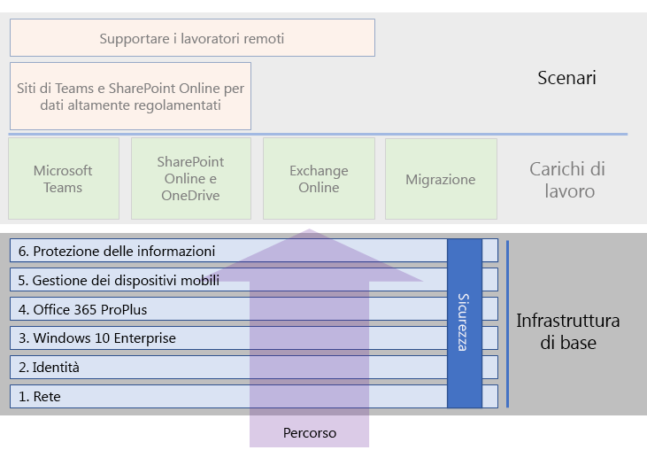
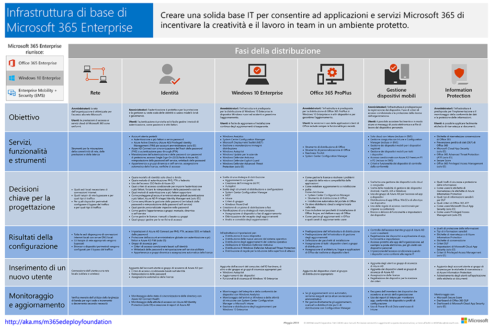

# Infrastruttura di base di Microsoft 365 per le aziendeMicrosoft 365 Enterprise foundation infrastructure

Se si esegue la distribuzione end-to-end di Microsoft 365 per le aziende autonomamente, è necessario innanzitutto creare una base fissa sulla quale le applicazioni e i servizi possano sbloccare creatività e collaborazione in un ambiente protetto.If you're doing the end-to-end deployment of Microsoft 365 Enterprise yourself, you should first build a firm foundation upon which applications and services can unlock creativity and teamwork in a secure environment. Questa base è chiamata anche *distribuzione di base*.This foundation is sometimes referred to as a *core deployment*.

Per un percorso definito end-to-end per la distribuzione, è possibile utilizzare queste fasi per pianificare e distribuire l'infrastruttura di base di Microsoft 365 per le aziende:For a defined end-to-end path for deployment, you can use these phases to plan for and deploy the foundation infrastructure of Microsoft 365 Enterprise:

| | FasePhase | RisultatiResults |
|:-------|:-----|:-----|
||[Fase 1: Funzionalità di retePhase 1: Networking](networking-infrastructure.md)| La rete è ottimizzata per l'accesso ai servizi basati sul cloud di Microsoft 365.Your network is optimized for access to Microsoft 365's cloud-based services. |
||[Fase 2: identitàPhase 2: Identity](identity-infrastructure.md)| Gli account di amministratore sono protetti, gli utenti e gruppi sono sincronizzati e l'autenticazione degli utenti è sicura.Your admin accounts are protected, your users and groups are synchronized, and your user authentication is strong. |
||[Fase 3: Windows 10 EnterprisePhase 3: Windows 10 Enterprise](windows10-infrastructure.md)| I computer esistenti basati su Windows possono eseguire l'aggiornamento a Windows 10 Enterprise e vengono installati nuovi dispositivi con Windows 10 Enterprise.Your existing Windows-based computers can upgrade to Windows 10 Enterprise and new devices are installed with Windows 10 Enterprise. |
||[Fase 4: Office 365 ProPlusPhase 4: Office 365 ProPlus](office365proplus-infrastructure.md)| Gli utenti di Microsoft Office esistenti possono eseguire l'aggiornamento a Office 365 ProPlus.Your existing users of Microsoft Office can upgrade to Office 365 ProPlus. |
||[Fase 5: gestione dei dispositivi mobiliPhase 5: Mobile device management](mobility-infrastructure.md)| I dispositivi possono essere registrati e gestiti.Your devices can be enrolled and managed. |
||[Fase 6: protezione delle informazioniPhase 6: Information protection](infoprotect-infrastructure.md)| Le funzionalità di sicurezza di Office 365 sono abilitate e sono pronti etichette e criteri per proteggere i documenti e i messaggi di posta elettronica.Office 365 security features are enabled and your labels and policies are ready to protect documents and email. |

Le fasi iniziano con le più fondamentali (rete e identità) e quindi creano livelli di impostazioni dell'infrastruttura e gruppi per:The phases start with the most foundational (networking and identity), and then create layers of infrastructure settings and groups to:

- Installare la versione più sicura e aggiornata di Windows nei dispositivi e mantenerla attuale.Install the most current and secure version of Windows on your devices and keep it current.
- Installare la versione più aggiornata di Microsoft Office nei dispositivi e mantenerla attuale.Install the most current version of Microsoft Office on your devices and keep it current.
- Gestione dei dispositivi dell'organizzazione e accesso alle app.Manage your organization's devices and their access to apps.
- Proteggere le informazioni in tali dispositivi e nel cloud.Protect the information on those devices and in the cloud.

Tuttavia, c’è flessibilità nel configurare e nell’implementare fasi o passaggi nelle fasi per soddisfare le necessità di risorse IT e business.However, you have the flexibility of configuring and rolling out the phases or steps within phases to fit your IT resources and business needs.

- **Organizzazioni di dimensioni inferiori o nuove**, se necessario, possono seguire le fasi per creare l’infrastruttura in modo metodico.**If you are a smaller or newer organization**, follow the phases as needed to methodically build out your infrastructure. Per una distribuzione semplificata per le organizzazioni non, fare clic [qui](deploy-foundation-infrastructure-non-enterprises.md).For a simplified deployment for non-enterprises, click [here](deploy-foundation-infrastructure-non-enterprises.md).

-  **Se si ha un'organizzazione aziendale**, visualizzare le fasi come livelli dell'infrastruttura IT invece di un percorso definito, e determinare la strategia migliore per ottenere una finale conformità ai requisiti per ogni livello all'interno dell'organizzazione.**If you are an enterprise organization**, view the phases as layers of IT infrastructure, rather than a defined path, and determine how to best work toward eventual adherence to the requirements for each layer across your organization.

Al termine di ogni fase, è necessario esaminare i *criteri di uscita*, comprese le condizioni necessarie che è necessario soddisfare e le condizioni facoltative da prendere in considerazione.At the end of each phase, you should examine its *exit criteria*, which include required conditions that you must meet and optional conditions to consider. I criteri di uscita per ogni fase assicurano che la risultante configurazione end-to-end e l’infrastruttura cloud e locale soddisfino i requisiti per una distribuzione di Microsoft 365 per le aziende.Exit criteria for each phase ensures that your on-premises and cloud infrastructure and resulting end-to-end configuration meet the requirements for a Microsoft 365 Enterprise deployment.

Per visualizzare la struttura del contenuto, vedere questo breve video.To see how the content is structured, watch this short video.

> [!VIDEO https://www.microsoft.com/videoplayer/embed/RE23VRG]

Ecco l'infrastruttura di base della Guida alla distribuzione generale di Microsoft 365 per le aziende:Here's the foundation infrastructure in the overall Microsoft 365 Enterprise deployment guide:

## In breveAt-a-glance

Il [poster Infrastruttura di base di Microsoft 365 per le aziende](media/deploy-foundation-infrastructure/Microsoft365EnterpriseFoundInfra.pdf) rappresenta una posizione centrale da visualizzare, per ogni fase:The [Microsoft 365 Enterprise foundation infrastructure poster](media/deploy-foundation-infrastructure/Microsoft365EnterpriseFoundInfra.pdf) is a central location for you to view, for each phase:

- Obiettivi generali della fase per amministratori e utentiThe overall goals of the phase for administrators and users
- Servizi, funzionalità e strumentiThe services, features, and tools
- Decisioni chiave per la progettazioneThe key design decisions for planning
- Risultati della configurazioneThe configuration results
- Processo di onboarding di un nuovo utenteThe process for onboarding a new user
- Monitoraggio e aggiornamentoHow to monitor and update

Per scaricare una copia del poster, fare clic [qui](https://github.com/MicrosoftDocs/microsoft-365-docs/raw/public/microsoft-365/enterprise/media/deploy-foundation-infrastructure/Microsoft365EnterpriseFoundInfra.pdf).To download a copy of the poster, click [here](https://github.com/MicrosoftDocs/microsoft-365-docs/raw/public/microsoft-365/enterprise/media/deploy-foundation-infrastructure/Microsoft365EnterpriseFoundInfra.pdf).

## Configurazione dell'infrastruttura vs. implementazione dell’utenteInfrastructure configuration vs. user rollout

L'infrastruttura di base è un set di configurazione di software e servizi configurati che, se combinati insieme per un utente, consentono di sfruttare l'intera gamma di funzionalità e protezioni offerte da Microsoft 365 per le aziende.The foundation infrastructure is a set of configured software and services that, when combined together for a user, allow them to take advantage of the entire spectrum of capabilities and protections that Microsoft 365 Enterprise offers. La destinazione finale del percorso di distribuzione end-to-end consiste nell'applicare questa infrastruttura a tutti gli utenti e i dispositivi basati su Windows.The ultimate destination of your end-to-end deployment journey is to have this infrastructure apply to all of your users and their Windows-based devices. 

Tuttavia, è importante tenere presente che l'infrastruttura di base di Microsoft 365 per le aziende è indipendente dalla distribuzione di software e servizi agli utenti.However, it is important to note that the Microsoft 365 Enterprise foundation infrastructure is independent of the rollout of software and services to your users. ***È possibile configurare i livelli dell'infrastruttura di base senza la necessità di implementare i livelli per tutti gli utenti.******You can configure the layers of the foundation infrastructure without having to roll out those layers to all of your users.***

È possibile configurare, testare e provare a usare gli elementi dell'infrastruttura di base prima dell'implementazione di questi elementi per i numerosi utenti negli uffici, regioni o reparti dell'organizzazione.It is possible to configure, test, and pilot elements of the foundation infrastructure well ahead of the rollout of those elements to the multitude of your users in the offices, regions, or divisions of your organization.

Ad esempio, creare le impostazioni per:For example, you create the settings for:

| FasePhase | RisultatiResults |
|:-------|:-----|
| IdentitàIdentity | Sincronizzazione di account e gruppi per i criteri di accesso condizionale basato sull'identità.Account synchronization and groups for identity-based conditional access policies. |
| Windows 10 EnterpriseWindows 10 Enterprise | Gruppi per aggiornare automaticamente i computer che eseguono Windows 7 o Windows 8.1 a Windows 10 Enterprise.Groups to automatically upgrade computers running Windows 7 or Windows 8.1 to Windows 10 Enterprise in place. |
| Office 365 ProPlusOffice 365 ProPlus | Gruppi per distribuire automaticamente Office 365 ProPlus agli utenti con Office 2010, Office 2013 o Office 2016.Groups to automatically deploy Office 365 ProPlus for users with Office 2010, Office 2013, or Office 2016. |
| Gestione dei dispositivi mobiliMobile device management | Gruppi per la registrazione di dispositivi e per i criteri di accesso condizionale basati sul dispositivo.Groups for device enrollment and device-based conditional access policies. |
| Protezione delle informazioniInformation protection | Gruppi per le etichette di riservatezza di Office 365.Groups for Office 365 sensitivity labels. |

Quando si è pronti a distribuire elementi di questa infrastruttura per gli utenti:When you are ready to rollout elements of this infrastructure to users, you:

| FasePhase | Azione di distribuzioneRollout action |
|:-------|:-----|
| IdentitàIdentity | Aggiungere account utenti ai gruppi per i criteri di accesso condizionale basato sull'identità.Add user accounts to the groups for identity-based conditional access policies. |
| Windows 10 EnterpriseWindows 10 Enterprise | Aggiungere account ai gruppi di distribuzione automaticamente di Windows 10 Enterprise utilizzata per gli utenti con Windows 7 o Windows 8.1.Add accounts to the groups to automatically deploy Windows 10 Enterprise in place for users with Windows 7 or Windows 8.1. |
| Office 365 ProPlusOffice 365 ProPlus | Aggiungere account utenti ai gruppi per distribuire automaticamente Office 365 ProPlus agli utenti con Office 2010, Office 2013 o Office 2016.Add user accounts to the groups to automatically deploy Office 365 ProPlus for users with Office 2010, Office 2013, or Office 2016. |
| Gestione dei dispositivi mobiliMobile device management | Aggiungere account ai gruppi per la registrazione di dispositivi e per i criteri di accesso condizionale basati sul dispositivo.Add accounts to the groups for device enrollment and device-based conditional access policies. |
| Protezione delle informazioniInformation protection | Aggiungere account utente ai gruppi per le etichette di riservatezza.Add user accounts to the groups for sensitivity labels. |

Dopo che le fasi o gli elementi dell'infrastruttura di base sono completati, testati e sperimentati, è possibile distribuire a tutti gli utenti il software installato, ad esempio Windows 10 Enterprise e Office 365 ProPlus, e i servizi e le protezioni basati su cloud, ad esempio la registrazione di dispositivi e i criteri di accesso condizionale, nel modo più idoneo rispetto alle risorse IT e agli obiettivi aziendali.Once phases or elements of the foundation infrastructure are completed, tested, and piloted, you can roll out installed software, such as Windows 10 Enterprise and Office 365 ProPlus, and cloud-based services and protections, such as device enrollment and conditional access policies, to your users in the manner that best fits your business goals and IT resources.

## Strategie di distribuzione e di gestione progettiDeployment and project management strategies

Per farsi un'idea di come affrontare la gestione dei progetti delle diverse fasi dell'infrastruttura di base per utenti pilota e per il resto dell'organizzazione, vedere [strategie di distribuzione](deployment-strategies-microsoft-365-enterprise.md).To give you some ideas on how to approach the project management of the different phases of the foundation infrastructure for pilot users and the rest of your organization, see [deployment strategies](deployment-strategies-microsoft-365-enterprise.md).

## Distribuzione per gli scenari non aziendaliDeployment for non-enterprises

Se l'organizzazione è di piccole dimensioni e Microsoft 365 Business non è idoneo, vedere l'articolo sulla [distribuzione per organizzazioni non aziendali](deploy-foundation-infrastructure-non-enterprises.md) per un metodo di distribuzione semplificato.If your organization is smaller and Microsoft 365 Business is not suitable for you, see [deployment for non-enterprises](deploy-foundation-infrastructure-non-enterprises.md) for a simplified deployment method.

## Passaggio successivoNext step

| Dove sonoWhere I am | Dove devo andareWhere I need to go |
|:-------|:-----|
| Ho l'infrastruttura esistente di Office 365, Enterprise Mobility + Security (EMS) o Windows 10 EnterpriseI have existing infrastructure for Office 365, Enterprise Mobility + Security (EMS), or Windows 10 Enterprise | Iniziare con [Distribuire un'infrastruttura esistente](deploy-with-existing-infrastructure.md), che illustra i criteri di uscita per ogni fase.Start with [Deploy with existing infrastructure](deploy-with-existing-infrastructure.md), which steps you through the exit criteria for each phase. |
| Inizio da zero come aziendaI'm starting from scratch as an enterprise | Iniziare il percorso di distribuzione end-to-end con [Fase 1: Funzionalità di rete](networking-infrastructure.md).Begin your end-to-end deployment journey with [Phase 1: Networking](networking-infrastructure.md). |
| Inizio da zero in scenari non appartenenti alle organizzazioniI'm starting from scratch as a non-enterprise | Iniziare il percorso di distribuzione end-to-end con [Distribuzione per gli scenari non appartenenti alle organizzazioni](deploy-foundation-infrastructure-non-enterprises.md).Begin your end-to-end deployment journey with [Deployment for non-enterprises](deploy-foundation-infrastructure-non-enterprises.md). |
