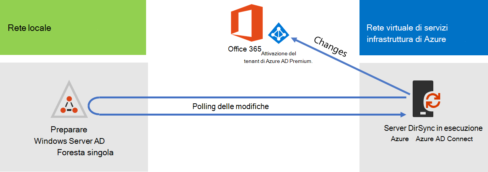
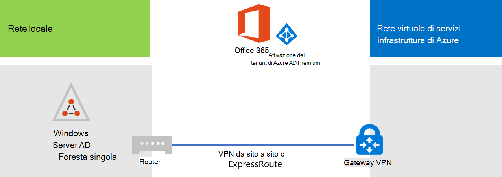
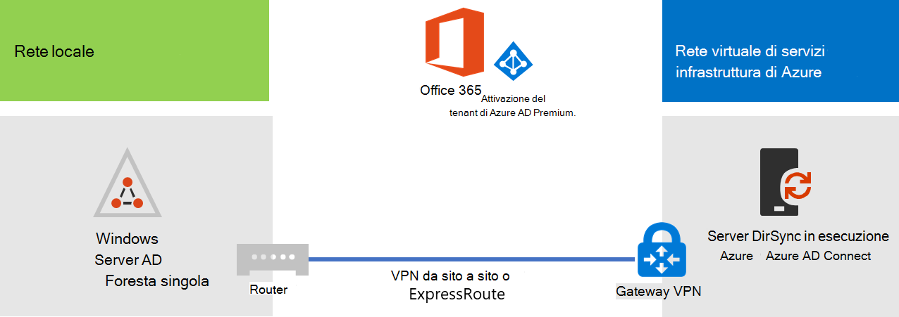

# Distribuire Microsoft 365 sincronizzazione della directory in Microsoft Azure

Azure Active Directory (Azure AD) Connessione (in precedenza noto come strumento di sincronizzazione della directory, strumento di sincronizzazione della directory o strumento DirSync.exe) è un'applicazione che viene installata in un server aggiunto al dominio per sincronizzare gli utenti di Servizi di dominio Active Directory locali con il tenant di Azure AD della sottoscrizione di Microsoft 365. Microsoft 365 usa Azure AD per il servizio directory. La sottoscrizione Microsoft 365 include un tenant di Azure AD. Questo tenant può essere usato anche per la gestione delle identità dell'organizzazione con altri carichi di lavoro cloud, tra cui altre applicazioni SaaS e app in Azure.

È possibile installare Azure AD Connect in un server locale, ma è anche possibile installarlo in una macchina virtuale di Azure per questi motivi:
  
- È possibile effettuare il provisioning e configurare i server basati su cloud più rapidamente, in modo da rendere disponibili i servizi in minor tempo.
- Azure offre una migliore disponibilità del sito con un numero minore di operazioni.
- È possibile ridurre il numero di server locali dell'organizzazione.

Questa soluzione richiede che venga stabilita una connessione tra la rete locale e la rete virtuale di Azure. Per altre informazioni, vedere [Connettere una rete locale a una rete virtuale di Microsoft Azure](connect-an-on-premises-network-to-a-microsoft-azure-virtual-network.md). 
  
> [!NOTE]
> In questo articolo viene descritta la sincronizzazione di un singolo dominio in una foresta singola. Azure AD Connessione sincronizza tutti i domini di Servizi di dominio Active Directory nella foresta di Active Directory con Microsoft 365. Se si dispone di più foreste di Active Directory da sincronizzare con Microsoft 365, vedere [Multi-forest Directory Sync with Single Sign-On Scenario](/azure/active-directory/hybrid/whatis-hybrid-identity). 
  
## Panoramica della distribuzione della sincronizzazione Microsoft 365 directory in Azure

Il diagramma seguente mostra azure AD Connessione in esecuzione in una macchina virtuale in Azure (il server di sincronizzazione della directory) che sincronizza una foresta di Servizi di dominio Active Directory locale con una sottoscrizione Microsoft 365 locale.
  

  
Nel diagramma, sono riportate due reti connesse tramite una VPN da sito a sito o una connessione ExpressRoute. Una è la rete locale in cui si trovano i controller di dominio di AD DS, mentre l'altra è una rete virtuale di Azure con un server di sincronizzazione della directory, una macchina virtuale che esegue [Azure AD Connect](https://www.microsoft.com/download/details.aspx?id=47594). I flussi di traffico principali provenienti dal server di sincronizzazione della directory sono due:
  
-  Azure AD Connect esegue la query a un controller di dominio nella rete locale per apportare modifiche ad account e password.
-  Azure AD Connessione invia le modifiche ad account e password all'istanza di Azure AD della sottoscrizione Microsoft 365 sottoscrizione. Poiché il server di sincronizzazione della directory si trova in una parte estesa della rete locale, queste modifiche vengono inviate tramite il server proxy della rete locale.
    
> [!NOTE]
> Questa soluzione descrive la sincronizzazione di un singolo dominio di Active Directory, in una foresta Active Directory singola. Azure AD Connessione sincronizza tutti i domini di Active Directory nella foresta di Active Directory con Microsoft 365. Se si dispone di più foreste di Active Directory da sincronizzare con Microsoft 365, vedere [Multi-forest Directory Sync with Single Sign-On Scenario](/azure/active-directory/hybrid/whatis-hybrid-identity). 
  
La distribuzione di questa soluzione comprende due passaggi principali:
  
1. Creare una rete virtuale Azure e stabilire una connessione VPN da sito a sito verso la rete locale. Per ulteriori informazioni, vedere [Connettere una rete locale a una rete virtuale di Microsoft Azure](connect-an-on-premises-network-to-a-microsoft-azure-virtual-network.md).
    
2. Installare [Azure AD Connessione](https://www.microsoft.com/download/details.aspx?id=47594) in una macchina virtuale appartenente a un dominio in Azure e quindi sincronizzare Servizi di dominio Active Directory locale con Microsoft 365. Questa operazione implica:
    
    La creazione di una macchina virtuale di Azure per l'esecuzione di Azure AD Connect.
    
    L'installazione e la configurazione di [Azure AD Connect](https://www.microsoft.com/download/details.aspx?id=47594).
    
    La configurazione di Azure AD Connessione richiede le credenziali (nome utente e password) di un account amministratore di Azure AD e di un account amministratore aziendale di Servizi di dominio Active Directory. Azure AD Connessione viene eseguito immediatamente e continuamente per sincronizzare la foresta di Servizi di dominio Active Directory locale con Microsoft 365.
    
Prima di distribuire questa soluzione nell'ambiente di produzione, è possibile seguire le istruzioni contenute in Configurazione di [base](simulated-ent-base-configuration-microsoft-365-enterprise.md) aziendale simulata per configurare questa configurazione come prova di concetto, per dimostrazioni o per sperimentazioni.
  
> [!IMPORTANT]
> Al termine della configurazione di Azure AD Connect, le credenziali dell'account amministratore dell'organizzazione di AD DS non vengono memorizzate. 
  
> [!NOTE]
> Questa soluzione descrive la sincronizzazione di una singola foresta di Servizi di dominio Active Directory con Microsoft 365. La topologia discussa in questo articolo rappresenta soltanto un modo per implementare la soluzione. La topologia dell'organizzazione potrebbe essere diversa in base ai requisiti di rete e alle considerazioni sulla sicurezza specifici. 
  
## Pianificare l'hosting di un server di sincronizzazione della directory per Microsoft 365 in Azure

### Prerequisiti

Prima di iniziare, rivedere i prerequisiti relativi alla soluzione:
  
- Rivedere i contenuti sulla pianificazione correlati in [Pianificare la rete virtuale di Azure](connect-an-on-premises-network-to-a-microsoft-azure-virtual-network.md#plan-your-azure-virtual-network).
    
- Assicurarsi che siano soddisfatti tutti i [Prerequisiti](connect-an-on-premises-network-to-a-microsoft-azure-virtual-network.md#prerequisites) relativi alla configurazione della rete virtuale di Azure.
    
- Avere una sottoscrizione Microsoft 365 che include la funzionalità di integrazione di Active Directory. Per informazioni sulle Microsoft 365, passare alla pagina Microsoft 365 [sottoscrizione.](https://products.office.com/compare-all-microsoft-office-products?tab=2)
    
- Effettuare il provisioning di una macchina virtuale di Azure che esegue Azure AD Connessione sincronizzare la foresta di Servizi di dominio Active Directory locale con Microsoft 365.
    
    È necessario disporre delle credenziali (nomi e password) dell'account amministratore dell'organizzazione AD DS e dell'account amministratore di Azure AD.
    
### Presupposti per la progettazione dell’architettura della soluzione

Di seguito sono riportate le scelte di progettazione effettuate per questa soluzione:
  
- In questa soluzione viene utilizzata una singola rete virtuale Azure con una connessione VPN da sito a sito. La rete virtuale Azure ospita una singola subnet che contiene il server di sincronizzazione della directory, sul quale è in esecuzione Azure AD Connect. 
    
- Nella rete locale sono disponibili un controller di dominio e alcuni server DNS.
    
- Azure AD Connect esegue la sincronizzazione dell'hash delle password al posto del Single Sign-On. Non è necessario distribuire un'infrastruttura AD FS (Active Directory Federation Services). Per ulteriori informazioni sulla sincronizzazione della password e su Single Sign-On, vedere [Scelta del giusto metodo di autenticazione per la soluzione ibrida di gestione delle identità di Azure Active Directory](/azure/active-directory/hybrid/choose-ad-authn).
    
Quando si distribuisce la soluzione nel proprio ambiente, sono disponibili ulteriori opzioni di progettazione che è possibile considerare. Tale opzioni includono:
  
- Se in una rete virtuale Azure esistente sono disponibili server DNS, determinare se si desidera che il server di sincronizzazione della directory li utilizzi per la risoluzione dei nomi al posto dei server DNS presenti nella rete locale.
    
- Se in una rete virtuale Azure esistente sono disponibili controller di dominio, determinare se la configurazione di siti e servizi di Active Directory rappresenta una migliore opzione. Anziché utilizzare i controller di dominio nella rete locale, il server di sincronizzazione della directory può eseguire query con i controller di dominio nella rete virtuale Azure per cercare le modifiche apportate ad account e password.
    
## Guida di orientamento alla distribuzione

La distribuzione di Azure AD Connect in una macchina virtuale in Azure è costituita da tre fasi:
  
- Fase 1: Creare e configurare la rete virtuale di Azure
    
- Fase 2: Creare e configurare la macchina virtuale di Azure
    
- Fase 3: Installare e configurare Azure AD Connect
    
Dopo la distribuzione, è inoltre necessario assegnare posizioni e licenze per i nuovi account utente in Microsoft 365.

### Fase 1: Creare e configurare la rete virtuale di Azure

Per creare e configurare la rete virtuale di Azure, completare la [Fase 1: Preparare la rete locale](connect-an-on-premises-network-to-a-microsoft-azure-virtual-network.md#phase-1-prepare-your-on-premises-network) e la [Fase 2: Creare la rete virtuale cross-premise in Azure](connect-an-on-premises-network-to-a-microsoft-azure-virtual-network.md#phase-2-create-the-cross-premises-virtual-network-in-azure) nella guida di orientamento alla distribuzione di [Connect an on-premises network to a Microsoft Azure Virtual Network](connect-an-on-premises-network-to-a-microsoft-azure-virtual-network.md).
  
Questa è la configurazione risultante.
  

  
Nella figura viene illustrata una rete locale connessa a una rete virtuale di Azure tramite una connessione VPN da sito a sito o ExpressRoute.
  
### Fase 2: Creare e configurare la macchina virtuale Azure

Creare la macchina virtuale in Azure seguendo le istruzioni disponibili nell’articolo [Creare una macchina virtuale Windows con il portale di Azure](https://go.microsoft.com/fwlink/p/?LinkId=393098). Utilizzare le seguenti impostazioni:
  
- Nel riquadro **Impostazioni di base**, selezionare la stessa sottoscrizione, lo stesso percorso e lo stesso gruppo di risorse della rete virtuale. Registrare nome utente e password in un percorso sicuro. Saranno necessari più avanti per connettersi alla macchina virtuale.
    
- Nel riquadro **Scegli una dimensione**, scegliere la dimensione **A2 Standard**.
    
- Nel riquadro **Impostazioni**, nella sezione **Archiviazione**, selezionare il tipo di disco **Standard**. Nella sezione **Rete**, selezionare il nome della rete virtuale e della subnet per ospitare il server di sincronizzazione della directory (non GatewaySubnet). Lasciare i valori predefiniti per tutte le altre impostazioni.
    
Verificare che il server di sincronizzazione della directory stia utilizzando correttamente il DNS controllando il DNS interno e accertandosi che sia stato aggiunto un record Address (A) per la macchina virtuale con l'indirizzo IP.  
  
Seguire le istruzioni in [Connettersi e accedere alla macchina virtuale](/azure/virtual-machines/windows/connect-logon) per connettersi al server di sincronizzazione della directory con Connessione Desktop remoto. Dopo l'accesso, aggiungere la macchina virtuale al dominio di AD DS locale.
  
Affinché Azure AD Connect riesca ad accedere alle risorse di Internet, è necessario configurare il server di sincronizzazione della directory per utilizzare il server proxy della rete locale. È necessario contattare l'amministratore di rete per visualizzare eventuali ulteriori procedure di configurazione da eseguire.
  
Questa è la configurazione risultante.
  

  
Nella figura viene illustrata la macchina virtuale del server di sincronizzazione della directory nella rete virtuale Azure cross-premise.
  
### Fase 3: Installare e configurare Azure AD Connect

Completare la procedura seguente:
  
1. Eseguire la connessione al server di sincronizzazione della directory utilizzando Connessione Desktop remoto con un account di dominio AD DS dotato dei privilegi di amministratore locale. Vedere [Connettersi e accedere alla macchina virtuale](/azure/virtual-machines/windows/connect-logon).
    
2. Dal server di sincronizzazione della directory, aprire l'articolo Configurare la sincronizzazione della [directory](set-up-directory-synchronization.md) per Microsoft 365 e seguire le istruzioni per la sincronizzazione della directory con la sincronizzazione dell'hash delle password.
    
> [!CAUTION]
> Il programma di installazione crea l'account **AAD_xxxxxxxxxxxx** nell'unità organizzativa Utenti locali. Non spostare o eliminare l'account, altrimenti la sincronizzazione avrà esito negativo.
  
Questa è la configurazione risultante.
  

  
Nella figura viene illustrato il server di sincronizzazione della directory con Azure AD Connect nella rete virtuale Azure cross-premise.
  
### Assegnare posizioni e licenze agli utenti in Microsoft 365

Azure AD Connessione aggiunge account alla sottoscrizione di Microsoft 365 da Servizi di dominio Active Directory locale, ma per consentire agli utenti di accedere a Microsoft 365 e usare i relativi servizi, gli account devono essere configurati con una posizione e licenze. Seguire questi passaggi per aggiungere il percorso e attivare le licenze per gli account utente appropriati:
  
1. Accedere all'interfaccia [Microsoft 365 e](https://admin.microsoft.com)quindi fare clic su **Amministratore.**
    
2. Nel riquadro di spostamento sinistro fare clic su **Utenti > Utenti attivi**.
    
3. Nell’elenco degli account utente, selezionare la casella di controllo accanto all'utente che si desidera attivare.
    
4. Nella pagina dell'utente fare clic su **Modifica** per **Licenze di prodotto**.
    
5. Nella pagina **Licenze di prodotto** selezionare un percorso per l'utente per **Percorso**, quindi abilitare le licenze appropriate per l'utente.
    
6. Al termine dell'operazione, fare clic su **Salva** e fare clic due volte su **Chiudi**.
    
7. Tornare al passaggio 3 per altri utenti.
    
## Vedere anche

[Centro soluzioni e architetture di Microsoft 365](../solutions/index.yml)
  
[Connettere una rete locale a una rete virtuale di Microsoft Azure](connect-an-on-premises-network-to-a-microsoft-azure-virtual-network.md)

[Scaricare Azure AD Connect](https://www.microsoft.com/download/details.aspx?id=47594)
  
[Configurare la sincronizzazione della directory per Microsoft 365](set-up-directory-synchronization.md)
