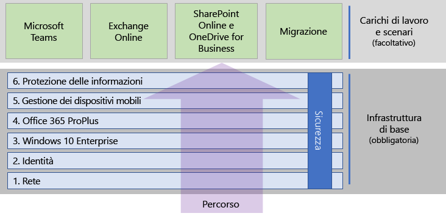

# Distribuire Microsoft 365 Enterprise

Microsoft 365 Enterprise è una combinazione di app e servizi di produttività basati sul cloud e locali con Windows 10 Enterprise:  

- Dispone di sicurezza intelligente.
- È integrato per semplicità.
- Sblocca la creatività.
- È progettato per la collaborazione.

È possibile realizzare questi vantaggi implementando i carichi di lavoro di infrastruttura e produttività in modo integrato, che include servizi e funzionalità di sicurezza all'avanguardia.

Esistono tre modi principali per la distribuzione di Microsoft 365 Enterprise:

- Eseguire questa operazione con i tecnici Microsoft usando [FastTrack per Microsoft 365](#fasttrack-for-microsoft-365).
- Eseguire questa operazione con il supporto di Microsoft Consulting Services o un [partner Microsoft](https://partner.microsoft.com/).
- Procedere autonomamente con la[Guida alla distribuzione di Microsoft 365 Enterprise](#microsoft-365-enterprise-deployment-guide).

## FastTrack per Microsoft 365

FastTrack è un vantaggio continuativo e ripetibile, *disponibile gratuitamente e come parte dell'abbonamento*, fornito dai tecnici Microsoft per consentire di passare al cloud secondo le proprie tempistiche. FastTrack consente anche di accedere a partner qualificati per altri servizi. Con oltre 40.000 clienti abilitati ad oggi, FastTrack aiuta a massimizzare il ROI, ad accelerare la distribuzione e ad aumentare l'adozione all'interno dell'organizzazione. Vedere [FastTrack per Microsoft 365](https://fasttrack.microsoft.com/microsoft365).

Se si desidera sfruttare FastTrack per la distribuzione di Microsoft 365 Enterprise, è possibile usare l'[assistente distribuzione di Microsoft 365](https://aka.ms/microsoft365setupguide) di FastTrack per indicazioni su come distribuire e configurare l'infrastruttura di base. È necessario essere connessi come amministratore globale in un tenant di Office 365 o Microsoft 365 per accedere alla pagina.

Iniziare il percorso di distribuzione end-to-end con FastTrack [qui](https://fasttrack.microsoft.com/microsoft365).

## Guida alla distribuzione di Microsoft 365 Enterprise.

La guida alla distribuzione di Microsoft 365 Enterprise fornisce istruzioni per la configurazione corretta e richiesta dei prodotti Microsoft 365 Enterprise e le loro funzionalità.

Per distribuire autonomamente Microsoft 365 Enterprise, è possibile:

- Distribuire l'[infrastruttura di base](deploy-foundation-infrastructure.md) per la sicurezza integrata e l'integrazione per una gestione semplificata che rende più semplice garantire che il software client sia aggiornato con i più recenti miglioramenti della produttività e della sicurezza. 
 
  L'infrastruttura di base è organizzato come una serie di fasi numerate costruite l’una sull’altra e mirate ad un ambiente che supporta gli scenari e i carichi di lavoro di Microsoft 365 Enterprise. 

  **Organizzazioni di dimensioni inferiori o nuove** possono seguire le fasi per creare l’infrastruttura in modo metodico.

  Tuttavia, è possibile distribuire le fasi o porzioni di fasi di questa infrastruttura nell'ordine preferito, [una dopo l'altra o in parallelo](deployment-strategies-microsoft-365-enterprise.md), per integrarle con l'infrastruttura corrente, adattarle alle risorse e ai piani IT, e soddisfare le esigenze aziendali. Per una distribuzione semplificata per le organizzazioni non, fare clic [qui](deploy-foundation-infrastructure-non-enterprises.md).

  **Se si ha un'organizzazione aziendale**, visualizzare le fasi come livelli dell'infrastruttura IT invece di un percorso definito, e determinare la strategia migliore per ottenere una finale conformità ai requisiti per ogni livello all'interno dell'organizzazione.

- Distribuire i [carichi di lavoro e gli scenari](deploy-workloads.md) chiave della produttività nella parte superiore dell'infrastruttura. Si sbloccano così creatività e collaborazione all'interno dell'organizzazione.

Ecco la relazione tra l'infrastruttura di base e i carichi di lavoro e gli scenari.

I carichi di lavoro e gli scenari operano al di sopra dell'infrastruttura di base. Tuttavia non occorre disporre di tutte le fasi dell'infrastruttura di base completate per iniziare a usare i carichi di lavoro per la produttività e la collaborazione.

Iniziare in maniera autonoma il percorso di distribuzione end-to-end [qui](deploy-foundation-infrastructure.md).

## Eseguire un test drive

"*Ciò che dobbiamo imparare a fare, lo impariamo facendolo.*" - Aristotele

Se non si conosce Microsoft 365 Enterprise o uno specifico prodotto o una caratteristica, uno dei modi migliori per comprendere consiste nel crearla autonomamente e osservarne il funzionamento.

Abbiamo semplificato questo processo con le guide ai lab di test (TLG), che guidano l'utente nella configurazione dell'infrastruttura o di una funzionalità in un ambiente di test semplificato ma rappresentativo, tramite abbonamenti di prova o a pagamento.

Con le TLG è possibile imparare autonomamente, dimostrare, personalizzare o creare una prova di concetto di una configurazione complessa, di un carico di lavoro o di uno scenario end-to-end.

Per ulteriori informazioni, vedere [Guide al lab di test di Microsoft 365 Enterprise](m365-enterprise-test-lab-guides.md).

## Transizione dell'intera organizzazione

Per avere un quadro più completo su come spostare l'intera organizzazione ai prodotti e servizi di Microsoft 365 Enterprise, vedere il poster [Transizione dell'organizzazione a Microsoft 365](media/deploy-microsoft-365-enterprise/transition-org-to-m365.pdf).

Questo poster con due pagine rappresenta un modo rapido per inventariare l'infrastruttura esistente e accedere alle indicazioni per passare al prodotto o al servizio corrispondente in Microsoft 365 Enterprise. Include i prodotti Windows e Office e altri elementi di infrastruttura e sicurezza, come la gestione dei dispositivi, l'identità e le informazioni e la protezione dalle minacce.

Si può anche [scaricare il poster sulla transizione](https://github.com/MicrosoftDocs/microsoft-365-docs/raw/public/microsoft-365/enterprise/media/deploy-microsoft-365-enterprise/transition-org-to-m365.pdf) e stamparlo in formato lettera, legale o tabloid (27,9 x 43,2 cm).

## Come hanno fatto altri utenti?

Usare queste risorse per comprendere come altri utenti hanno distribuito e stanno usando Microsoft 365 Enterprise.

### Utilizzo di Microsoft 365 Enterprise da parte dei clienti

Usare il sito Storie dei clienti per scoprire in che modo i clienti Microsoft usano Microsoft 365 Enterprise.

1. Passare a [https://customers.microsoft.com/](https://customers.microsoft.com/) e fare clic su **Cerca**.
2. Nel riquadro sinistro selezionare la lingua in **Lingua**.
3. Selezionare il settore dell'organizzazione in **Settore**.
4. Selezionare **Microsoft 365** in **Prodotto**.
5. Fare clic su una scheda per accedere al case study del cliente.

### Utilizzo di Microsoft 365 Enterprise da parte di Microsoft

La definizione di una cultura digitale rappresenta la maggiore priorità per ogni leader che si impegna a favorire un’area di lavoro moderna. Microsoft 365 è stato sviluppato per supportare questo tipo di cambiamento culturale, aiutando i leader che provano a liberare la creatività e aumentare la collaborazione di tutti i dipendenti. Stabilire l’infrastruttura Microsoft di base ha innescato esattamente questo tipo di cambiamento di cultura digitale. L'implementazione di Microsoft 365 Enterprise ha consentito di distribuire la tecnologia di collaborazione, come Microsoft Teams ed Exchange Online, e di condividere dati sensibili online attraverso i siti Intranet di SharePoint.

Nel contempo, le funzionalità di sicurezza e l'integrazione dei prodotti sono utili per semplificare le esigenze di gestione e ridurre al minimo il costo totale di proprietà nel ciclo di vita IT. 

Informazioni come Core Services Engineering and Operations (in precedenza Microsoft IT) [hanno pianificato e distribuito una fondazione](https://www.microsoft.com/it-IT/itshowcase/deploying-and-managing-microsoft-365) che supporta le applicazioni e i servizi che liberano la creatività e favoriscono il lavoro in un ambiente sicuro.

> [!Note]
> Questa pagina web è disponibile solo in inglese.

### Informazioni sulle modalità di distribuzione di Microsoft 365 Enterprise da parte di Contoso Corporation

Contoso Corporation è un conglomerato industriale fittizio ma rappresentativo a livello internazionale con sede a Parigi, Francia. Vedere come [Contoso ha distribuito Microsoft 365 Enterprise](contoso-case-study.md) e ha affrontato importanti decisioni di progettazione e dettagli di implementazione riguardanti rete, identità, Windows 10 Enterprise, Office 365 ProPlus, gestione dei dispositivi mobili, protezione delle informazioni e sicurezza. 

## Rimanere aggiornati sul contenuto sulla distribuzione

Per le modifiche più recenti al contenuto, vedere [questo articolo](microsoft-365-deploment-guide-changes.md).

## Passaggio successivo

Per farlo con l'assistenza diretta di Microsoft utilizzare [FastTrack](https://fasttrack.microsoft.com/microsoft365).

Per farlo con un consulente, contattare Microsoft Consulting Services o un [partner Microsoft](https://partner.microsoft.com/).

Per iniziare a eseguirlo autonomamente, vedere [infrastruttura di base](deploy-foundation-infrastructure.md).
