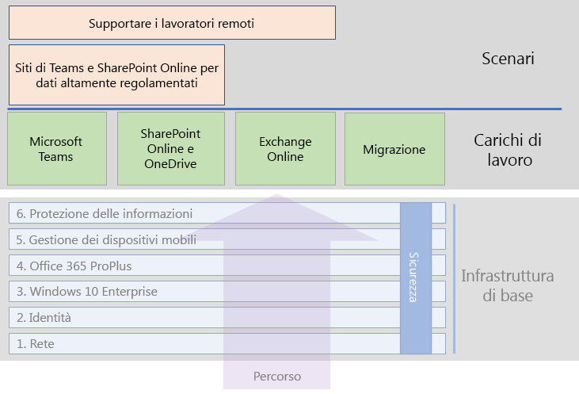

# Carichi di lavoro di Microsoft 365 for enterpriseMicrosoft 365 for enterprise workloads

Per ottenere i vantaggi in termini di creatività e collaborazione di Microsoft 365 per le aziende, distribuire questi carichi di lavoro sull'infrastruttura di base:To get the creativity and teamwork benefits of Microsoft 365 for enterprise, deploy these workloads over your foundation infrastructure:

- [Microsoft TeamsMicrosoft Teams](teams-workload.md)
- [Exchange OnlineExchange Online](exchangeonline-workload.md)
- [SharePoint e OneDriveSharePoint and OneDrive](sharepoint-online-onedrive-workload.md)

Vedere l'articolo sulla [migrazione](migration-microsoft-365-enterprise-workload.md) per una roadmap generale su come eseguire la migrazione di tutta l'organizzazione a Microsoft 365 per le aziende che includa i prodotti client di Microsoft Office, i prodotti locali di Office Server e i dispositivi basati su Microsoft Windows.See the [migration](migration-microsoft-365-enterprise-workload.md) article for a general roadmap to migrate your entire organization to Microsoft 365 for enterprise, which includes Microsoft Office client products, on-premises Office Server products, and Microsoft Windows-based devices.

Ecco i carichi di lavoro nella guida di distribuzione generale di Microsoft 365 for enterprise:Here are the workloads in the overall Microsoft 365 for enterprise deployment guide:

## Prerequisiti dell'infrastruttura di baseFoundation infrastructure prerequisites

*Idealmente*, è necessario distribuire i carichi di lavoro dopo aver configurato tutte le fasi [dell'infrastruttura di base](deploy-foundation-infrastructure.md).*Ideally*, you should deploy workloads after you have configured all of the phases of the [foundation infrastructure](deploy-foundation-infrastructure.md). Per garantire che tutti i livelli sottostanti dell’infrastruttura di base siano in posizione per fornire integrazione, sicurezza e la migliore esperienza per gli utenti e i loro dispositivi.This ensures that all of the underlying foundation layers are in place to provide integration, security, and the best experience for your users and their devices.

| FasePhase | RisultatoResult |
|:-------|:-----|
| ReteNetwork | La rete viene aggiornata per ottimizzare le prestazioni dei servizi cloud Microsoft 365.Your network is updated for optimum performance to Microsoft 365 cloud services. |
| IdentitàIdentity | L’identità è sincronizzata e messa al sicuro con l’autenticazione avanzata per gli account degli utenti e la protezione per gli account degli amministratori.Identity is synchronized and secured with strong authentication for user accounts and protection for admin accounts. |
| Windows 10 EnterpriseWindows 10 Enterprise | I computer che eseguono Windows 7 o Windows 8.1 possono eseguire l'aggiornamento a Windows 10 Enterprise e vengono installati nuovi dispositivi con Windows 10 Enterprise.Your computers running Windows 7 or Windows 8.1 can upgrade to Windows 10 Enterprise and new devices are installed with Windows 10 Enterprise. |
| Microsoft 365 Apps for enterpriseMicrosoft 365 Apps for enterprise | Gli utenti di Microsoft Office esistenti possono eseguire l'aggiornamento a Microsoft 365 Apps for enterprise.Your existing users of Microsoft Office can upgrade to Microsoft 365 Apps for enterprise. |
| Gestione dei dispositivi mobiliMobile device management | I dispositivi possono essere registrati e gestiti.Your devices can be enrolled and managed. |
| Protezione delle informazioniInformation protection | Le funzionalità di protezione delle informazioni di Microsoft 365 sono configurate e la riservatezza o le etichette di Azure Information Protection sono pronte per proteggere i documenti e la posta elettronica.Microsoft 365 information protection features are configured and your sensitivity or Azure Information Protection labels are ready to protect documents and email. |

Tenere presente che questa soluzione è ideale e può richiedere del tempo per essere pianificata, configurata, testata e verificata, in particolare in organizzazioni di grandi dimensioni con l'infrastruttura esistente e più sedi.Remember that this is ideal and can take some time to plan for, configure, test, and pilot, especially in large organizations with existing infrastructure and multiple locations. Non è necessario completare queste fasi in tutte le sedi per sfruttare più velocemente il valore aziendale di Microsoft 365 per le aziende.Completing all of these phases in all locations is not necessary for you to more quickly get business value from Microsoft 365 for enterprise. 

Ecco alcuni dei carichi di lavoro abituali per effettuare immediatamente la distribuzione:Here are some common workloads to deploy right away: 

- Dopo che la fase **Identità** dell'infrastruttura di base è stata implementata per gli utenti, molte organizzazioni distribuiscono:After the **Identity** phase of the foundation infrastructure is rolled out to users, many organizations deploy:
  - [Microsoft 365 Apps for enterprise](office365proplus-infrastructure.md) abbinato a [OneDrive](https://docs.microsoft.com/onedrive/plan-onedrive-enterprise).[Microsoft 365 Apps for enterprise](office365proplus-infrastructure.md) combined with [OneDrive](https://docs.microsoft.com/onedrive/plan-onedrive-enterprise). Microsoft 365 Apps for enterprise offre la sicurezza dell'autenticazione moderna e l'esperienza utente dell'ultima versione del client Microsoft Office.Microsoft 365 Apps for enterprise provides the security of modern authentication and the user experience of the latest Microsoft Office client. La migrazione dei file personali dell'utente a OneDrive consente di ridurre l'infrastruttura e non è più necessario supportare home directory e le unità.The migration of user's personal files to OneDrive reduces infrastructure and the need to support home folders and drives.
  - [Exchange Online](exchangeonline-workload.md) in modo che gli utenti possano iniziare a usare la posta elettronica basata sul cloud.[Exchange Online](exchangeonline-workload.md) so that users can begin using cloud-based email.
- Se non è immediatamente necessario archiviare asset digitali altamente riservati nel cloud, distribuire [Microsoft Teams](teams-workload.md) e [SharePoint](sharepoint-online-onedrive-workload.md) per gli utenti prima della fase **Protezione delle informazioni**.If you don't have an immediate need for storing highly regulated digital assets in the cloud, deploy [Microsoft Teams](teams-workload.md) and [SharePoint](sharepoint-online-onedrive-workload.md) for your users prior to the **Information protection** phase.

È necessario decidere come è meglio ordinare e distribuire la configurazione delle fasi dei prerequisiti dell’infrastruttura di base per soddisfare le esigenze aziendali.You must decide on how to best order and deploy the configuration of prerequisite phases of foundation infrastructure to meet your business needs.

### Procedura consigliataBest practice

È fortemente consigliabile distribuire e implementare la fase **Identità** dell'infrastruttura di base prima di caricare gli utenti su carichi di lavoro o scenari.We highly recommend that you deploy and roll out the **Identity** phase of the foundation infrastructure prior to onboarding your users to any workloads or scenarios.

La fase **Identità** garantisce che l’identità basata sul cloud, solo cloud o sincronizzata con Active Directory Domain Services (AD DS) locali, contenga gli account di utente e computer e i gruppi per la gestione di accesso e autenticazione.The **Identity** phase ensures that your cloud-based identity, whether cloud-only or synchronized with your on-premises Active Directory Domain Services (AD DS), contains the user and computer accounts and groups to manage authentication and access. L’autenticazione avanzata per tutti gli utenti, insieme alla protezione avanzata degli account di amministratore, è obbligatoria prima di immettere gli asset digitali dell'organizzazione nel cloud Microsoft 365.Strong authentication for all your users along with strong protection of admin accounts is required before placing your organization's digital assets in the Microsoft 365 cloud.

Sebbene fondamentale e molto importante per le prestazioni complessive, l'implementazione della fase **Rete** può essere in corso durante il caricamento degli utenti sui carichi di lavoro, con la consapevolezza che il carico di lavoro e le prestazioni del servizio di Microsoft 365 miglioreranno nel tempo.Although foundational and very important to overall performance, the rollout of the **Networking** phase can be in progress while onboarding your users to workloads, with the understanding that Microsoft 365 workload and service performance will improve over time. Ciò vale soprattutto per le organizzazioni aziendali con più sedi e una combinazione di dispositivi periferici e connessioni Internet.This is especially true for enterprise organizations with multiple locations and a mixture of edge devices and Internet connections.
