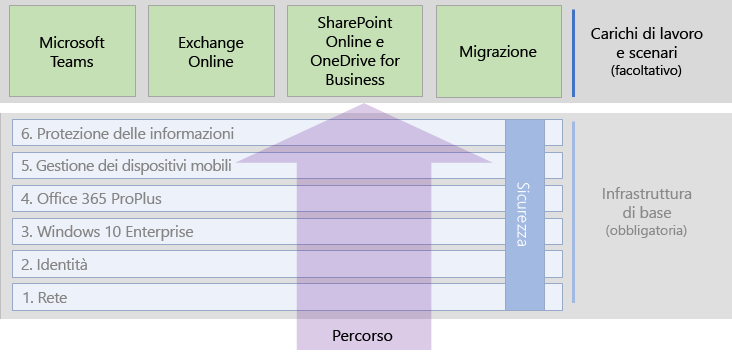

# Carichi di lavoro e scenari di Microsoft 365 EnterpriseMicrosoft 365 Enterprise workloads and scenarios

Per sfruttare i vantaggi di creatività e collaborazione di Microsoft 365 Enterprise, distribuire i carichi di lavoro e gli scenari nella parte superiore dell'infrastruttura di base:To realize the creativity and teamwork benefits of Microsoft 365 Enterprise, deploy these workloads and scenarios to operate on the top of your foundation infrastructure:

- [Microsoft TeamsMicrosoft Teams](teams-workload.md)
- [Exchange OnlineExchange Online](exchangeonline-workload.md)
- [SharePoint OnlineSharePoint Online](sharepoint-online-onedrive-workload.md)
- [Migrazione a Microsoft 365 EnterpriseMigration to Microsoft 365 Enterprise](migration-microsoft-365-enterprise-workload.md)
- [Siti Microsoft Teams e SharePoint Online per dati altamente riservatiMicrosoft Teams and SharePoint Online sites for highly regulated data](teams-sharepoint-online-sites-highly-regulated-data.md)

La figura seguente mostra i carichi di lavoro del contenuto di distribuzione generale di Microsoft 365 Enterprise.The following figure shows the workloads in the overall Microsoft 365 Enterprise deployment content.

Distribuire i carichi di lavoro dopo aver esaminato le fasi dell'[infrastruttura di base](deploy-foundation-infrastructure.md)You should deploy workloads after you have gone through the phases of the [foundation infrastructure](deploy-foundation-infrastructure.md).
