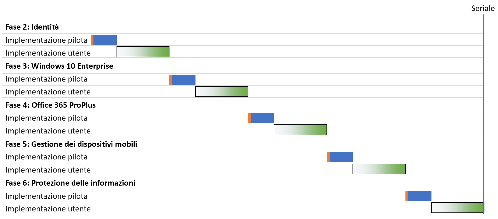
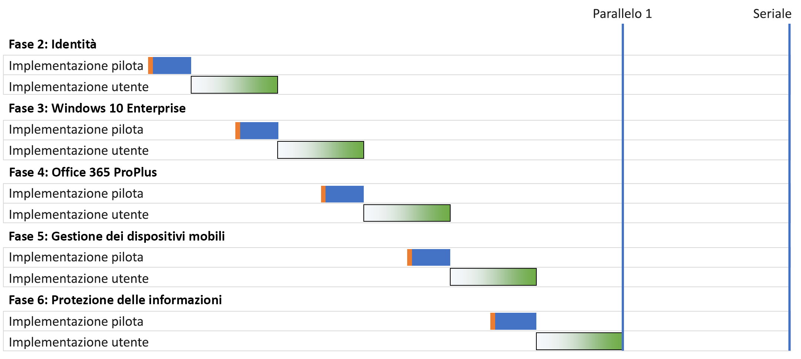
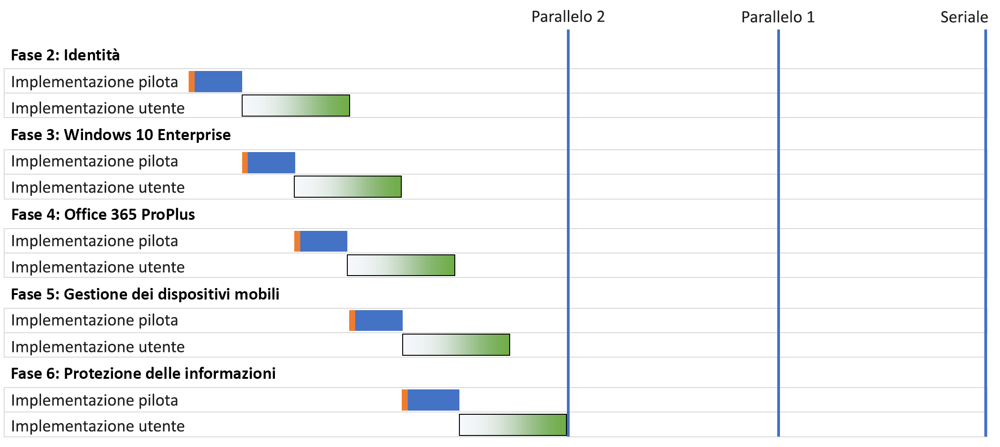
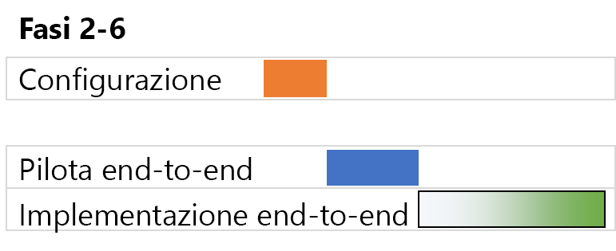

# Strategie di distribuzione dell'infrastruttura di base di Microsoft 365 per le aziende

Per distribuire le fasi dell'[infrastruttura di base](deploy-foundation-infrastructure.md) di Microsoft 365 per le aziende e implementarne le capacità, il software e i servizi agli utenti, è possibile scegliere tra numerose opzioni. Per iniziare a gestire i progetti di questa attività, che può essere lunga e complessa a seconda delle dimensioni dell'organizzazione e dell'infrastruttura esistente, prendere in considerazione le strategie di distribuzione seguenti:

- Distribuzione seriale
- Distribuzione in parallelo con implementazione utente senza sovrapposizione
- Distribuzione in parallelo con implementazione utente con sovrapposizione
- Infrastruttura predisposta in precedenza e implementazione della configurazione end-to-end

Usare queste strategie come suggerimenti su come gestire l'intero progetto e comprendere più rapidamente i vantaggi aziendali offerti da Microsoft 365 per le aziende.

>[!Note]
>Questo articolo contiene ipotesi e semplificazioni per descrivere in modo coerente le strategie di distribuzione. Queste strategie sono generalizzate, di conseguenza non implicano tempistiche specifiche, né possono essere considerate valide per qualsiasi situazione e organizzazione.
>

## Elementi della gestione dei progetti IT per organizzazioni aziendali standard

L'infrastruttura IT include i servizi back-end e l'implementazione di funzionalità nuove o migliorate oppure di software installato per gli utenti finali. I reparti IT distribuiscono in genere gli elementi di un'infrastruttura IT in modo sistematico. Un approccio per la corretta distribuzione di un elemento dell'infrastruttura IT prevede:

- Un'implementazione pilota 

  Include la configurazione e l'implementazione dell'infrastruttura iniziale per un set pilota di utenti, l'esecuzione di test e le successive modifiche alla configurazione dell'infrastruttura.

- Un'implementazione utente

  Include l'implementazione nel resto dell'organizzazione in base ad aree geografiche, reparti, gruppi o altri tipi di propagazione sistematica della configurazione o del software.

Il set di utenti nell'implementazione pilota non è uguale a quello dell'implementazione utente.

Per illustrare queste definizioni, in questo articolo si usano le immagini seguenti: 

 

L'ombreggiatura nell'immagine relativa all'implementazione utente indica la percentuale di implementazione (da 0% a 100%) nell'organizzazione usando un approccio strutturato o metodico, ad esempio per gruppi, reparti o aree geografiche.

## Strategie di distribuzione

Prendere in considerazione le strategie di distribuzione seguenti:

- Distribuzione seriale
- Distribuzione in parallelo con implementazione utente senza sovrapposizione
- Distribuzione in parallelo con implementazione utente con sovrapposizione
- Infrastruttura predisposta in precedenza e implementazione della configurazione end-to-end

### Distribuzione seriale

Con una distribuzione seriale si implementa completamente una fase, ovvero si consente alla fase di completare la distribuzione per tutti gli utenti, prima di passare a quella successiva. Ecco alcuni dei motivi per cui è consigliabile eseguire la distribuzione in questo modo:

- Riduzione dei rischi
- Vincoli relativi alla gestione delle risorse
- Cicli di finanziamento del reparto IT
- Dipendenze delle tecnologie IT
- Gestione delle modifiche aziendali e riluttanza degli utenti finali

Questo diagramma di Gantt mostra una distribuzione in serie semplificata delle fasi 2-6 dell'infrastruttura di base per Microsoft 365 per le aziende.

 
 
Per semplificare la discussione e l'esempio, si presuppone che ogni fase e ogni segmento di distribuzione all'interno di ogni fase richieda lo stesso tempo.

>[!Note]
>Fase 1: la connessione dell'infrastruttura di base di Microsoft 365 per le aziende è una fase di competenza esclusiva del reparto IT. Gli utenti possono usufruire dei vantaggi di una connettività ottimizzata alle risorse cloud di Microsoft, ma non sono obbligati a farlo.
>

Ecco un'esperienza utente pilota semplificata di esempio:

- A dicembre si deve usare lo smartphone personale per la MFA. (Identity)
- A marzo si installa Windows 10 Enterprise nel desktop Windows 8.1. (Windows 10 Enterprise)
- A giugno si installa Microsoft 365 Apps for enterprise, che sostituisce Office 2013. (Microsoft 365 Apps for enterprise)
- A settembre si applicano i criteri di registrazione dei dispositivi e delle app. (Gestione dei dispositivi mobili)
- A dicembre si installa il client Azure Information Protection e si impara ad applicare etichette ai documenti. (Information Protection)

Ne risulta una cadenza di 90 giorni tra due implementazioni pilota.

Ecco un'esperienza utente finale semplificata di esempio:

- A gennaio si deve usare lo smartphone personale per la MFA. (Identity)
- Ad aprile si installa Windows 10 Enterprise nel desktop Windows 8.1. (Windows 10 Enterprise)
- A luglio si installa Microsoft 365 Apps for enterprise, che sostituisce Office 2013. (Microsoft 365 Apps for enterprise)
- A ottobre si applicano i criteri di registrazione dei dispositivi e delle app. (Gestione dei dispositivi mobili)
- A gennaio dell'anno successivo si installa il client Azure Information Protection e si impara ad applicare etichette ai documenti. (Information Protection)

Ne risulta una cadenza di 90 giorni tra due implementazioni utente.

Lo svantaggio di questa strategia di distribuzione è che la distribuzione completa dell'infrastruttura di base di Microsoft 365 per le aziende può richiedere molto tempo.

### Distribuzione in parallelo con implementazione utente senza sovrapposizione (in parallelo 1)

Per questa strategia di distribuzione si avvia l'implementazione pilota della fase successiva durante l'ultima parte dell'implementazione utente della fase corrente. Ecco la distribuzione delle fasi 2-6 quando l'implementazione pilota viene avviata quando l'implementazione utente della fase precedente sta per terminare.

 
 
Il risultato finale è che l'implementazione utente per la fase corrente viene completata in tutta l'organizzazione prima dell'avvio di quella successiva. Gli utenti che non sono inclusi nelle implementazioni pilota non devono gestire le implementazioni di più fasi contemporaneamente, ma le implementazioni pilota vengano eseguite in parallelo con quelle utente.

Ecco un'esperienza utente pilota semplificata di esempio:

- A dicembre si deve usare lo smartphone personale per la MFA. (Identity)
- A febbraio si installa Windows 10 Enterprise nel desktop Windows 8.1. (Windows 10 Enterprise)
- A giugno si installa Microsoft 365 Apps for enterprise, che sostituisce Office 2013. (Microsoft 365 Apps for enterprise)
- A giugno si applicano i criteri di registrazione dei dispositivi e delle app. (Gestione dei dispositivi mobili)
- Ad agosto si installa il client Azure Information Protection e si impara ad applicare etichette ai documenti. (Information Protection)

Ne risulta una cadenza di 60 giorni tra due implementazioni pilota.

Ecco un'esperienza utente finale semplificata di esempio:

- A gennaio si deve usare lo smartphone personale per la MFA. (Identity)
- A marzo si installa Windows 10 Enterprise nel desktop Windows 8.1. (Windows 10 Enterprise)
- A maggio si installa Microsoft 365 Apps for enterprise, che sostituisce Office 2013. (Microsoft 365 Apps for enterprise)
- A luglio si applicano i criteri di registrazione dei dispositivi e delle app. (Gestione dei dispositivi mobili)
- A settembre si installa il client Azure Information Protection e si impara ad applicare etichette ai documenti. (Information Protection)

Ne risulta una cadenza di 60 giorni tra due implementazioni utente.

Il vantaggio di questa strategia di distribuzione dell’infrastruttura di base di Microsoft 365 per le aziende è che può essere completata in meno tempo, senza che il reparto IT e gli utenti debbano gestire più implementazioni contemporaneamente.

### Distribuzione in parallelo con implementazione utente con sovrapposizione (in parallelo 2)

Per questa strategia di distribuzione si avviano:

- L'implementazione pilota della fase successiva durante l'ultima parte dell'implementazione utente della fase corrente.
- L'implementazione utente della fase successiva durante l'implementazione utente della fase corrente in modo che nessun utente debba gestire le implementazioni di più fasi contemporaneamente. Questo scenario presuppone che l'utente implementi ogni fase dell'infrastruttura di base allo stesso modo, usando aree geografiche, reparti o altri gruppi.

Ecco un confronto semplificato tra le diverse strategie di distribuzione.

 

Il risultato finale è il seguente:

- Le implementazioni pilota passano da una fase all'altra senza pause.
- L'implementazione utente per una fase inizia prima del completamento dell'implementazione utente della fase precedente, ma nessun singolo utente implementa più di una fase alla volta.

Ecco un'esperienza utente pilota semplificata di esempio:

- A dicembre si deve usare lo smartphone personale per la MFA. (Identity)
- A gennaio si installa Windows 10 Enterprise nel desktop Windows 8.1. (Windows 10 Enterprise)
- A febbraio si installa Microsoft 365 Apps for enterprise, che sostituisce Office 2013. (Microsoft 365 Apps for enterprise)
- A marzo si applicano i criteri di registrazione dei dispositivi e delle app. (Gestione dei dispositivi mobili)
- Ad aprile si installa il client Azure Information Protection e si impara ad applicare etichette ai documenti. (Information Protection)

Ne risulta una cadenza di 30 giorni tra due implementazioni pilota.

Ecco un'esperienza utente finale semplificata di esempio:

- A gennaio si deve usare lo smartphone personale per la MFA. (Identity)
- A febbraio si installa Windows 10 Enterprise nel desktop Windows 8.1. (Windows 10 Enterprise)
- A marzo si installa Microsoft 365 Apps for enterprise, che sostituisce Office 2013. (Microsoft 365 Apps for enterprise)
- Ad aprile si applicano i criteri di registrazione dei dispositivi e delle app. (Gestione dei dispositivi mobili)
- A maggio si installa il client Azure Information Protection e si impara ad applicare etichette ai documenti. (Information Protection)

Ne risulta una cadenza di 30 giorni tra due implementazioni utente.

Il vantaggio di questa strategia di distribuzione dell’infrastruttura di base di Microsoft 365 per le aziende è che può essere completata in ancora meno tempo, senza che gli utenti finali debbano gestire più implementazioni contemporaneamente. Tuttavia, gli utenti non fanno una pausa tra le fasi successive.

### Infrastruttura predisposta in precedenza e implementazione della configurazione end-to-end

Per le organizzazioni di dimensioni inferiori che possono comprimere le fasi 2-6 in un unico segmento di distribuzione, la distribuzione risultante è simile alla seguente:
 
 

Il reparto IT configura l'infrastruttura per le fasi 2-6, quindi esegue l'implementazione per gli utenti pilota per verificare la funzionalità end-to-end. Ad esempio, gli utenti pilota ottengono contemporaneamente tutte le funzionalità seguenti:

- MFA e altre funzionalità per la gestione delle identità (Identity)
- Windows 10 Enterprise in dispositivi Windows (Windows 10 Enterprise)
- Microsoft 365 Apps for enterprise per le applicazioni Office (Microsoft 365 Apps for enterprise)
- Criteri di dispositivi e app (Gestione dispositivi mobili)
- Installazione del client Azure Information Protection e training su come applicare etichette ai documenti (Information Protection)

Al termine dell'implementazione pilota, viene avviata l'implementazione utente in cui ogni utente ottiene contemporaneamente tutte le funzionalità.

## Passaggio successivo

Avviare la distribuzione di Microsoft 365 per le aziende con l'[infrastruttura di base](deploy-foundation-infrastructure.md).
