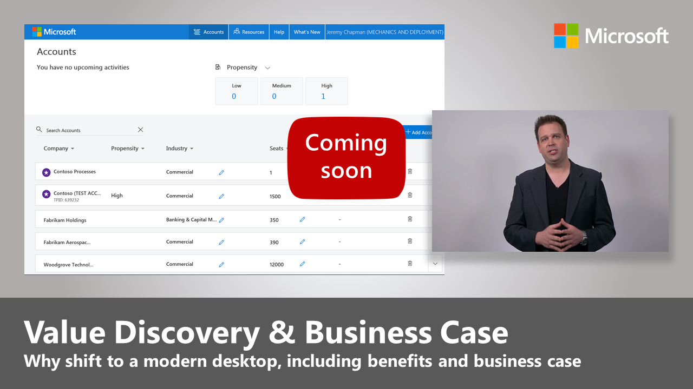

# Centro di distribuzione desktop

Seguire la procedura descritta di seguito per pianificare ed eseguire una distribuzione di Windows 10 e Office 365 ProPlus su vasta scala. Ogni passaggio fa parte del processo generale di pianificazione e distribuzione e i passaggi vanno in genere eseguiti in parallelo in una distribuzione in fasi. Scaricare la versione gratuita di [Distribuzione del desktop e Management Lab Kit](https://aka.ms/howtoshiftlabs) per un'esercitazione pratica con gli strumenti evidenziati nel processo di distribuzione. Per la distribuzione desktop è anche possibile [richiedere assistenza](https://aka.ms/mddhelp) a partner Microsoft e servizi FastTrack.

 

<table>
<tr class="even">
<td></td>
<td>
<strong><a href="https://aka.ms/mdd0">Guida introduttiva: indicazioni su utenti, processi e tecnologia</a></strong>

Informazioni sui vantaggi correlato al passaggio a Windows 10 e Office 365 ProPlus e sulle principali modifiche, considerazioni rispetto alle distribuzioni precedenti e procedure consigliate per una transizione a Windows 10 e Office 365 ProPlus priva di problemi.
</td>
<td></td>
</tr>
<tbody>
<tr class="odd">
<td></td>
<td>
<strong><a href="https://aka.ms/mdd1">Passaggio 1: conformità di dispositivi e app</a></strong>

Iniziare il progetto di distribuzione desktop con un inventario dei dispositivi e delle app, con l'assegnazione delle priorità, con l'esecuzione di test sui dispositivi e sulle app cui è stata assegnata la priorità, quindi con la correzione di quanto necessario per prepararsi alla distribuzione.
</td>
<td></td>
</tr>
<tr class="even">
<td></td>
<td>
<strong><a href="https://aka.ms/mdd2">Passaggio 2: conformità della directory e della rete</a></strong>

I servizi connessi tramite cloud in Office 365 ProPlus e le nuove opzioni di distribuzione come Windows Autopilot richiedono Azure Active Directory. Anche la rete e la connettività sono aree importanti da pianificare quando si trasferiscono immagini, app, driver e file correlati nei PC. Ottenere informazioni su come i nuovi strumenti e opzioni di distribuzione riducono e ottimizzano il traffico di rete.
</td>
<td></td>
</tr>
<tr class="odd">
<td></td>
<td>
<strong><a href="https://aka.ms/mdd3">Passaggio 3: distribuzione di Office e app line-of-business</a></strong>

Verificare che le app siano compresse e pronte per l'installazione automatica. In questo passaggio vengono fornite informazioni sulle nuove opzioni offerte dai pacchetti a portata di clic di Office 365 ProPlus per configurare, distribuire e mantenere aggiornate le app di Office.
</td>
<td></td>
</tr>
<tr class="even">
<td></td>
<td>
<strong><a href="https://aka.ms/mdd4">Passaggio 4: file e impostazioni utente</a></strong>

Durante l'aggiornamento o la sostituzione dei PC, è possibile risparmiare tempo automatizzando il backup e il ripristino dello stato utente. Le nuove opzioni per la sincronizzazione dei file sul cloud consentono di applicare la sincronizzazione per utente delle cartelle desktop, documenti e immagini in OneDrive per l'accesso semplificato ai file da nuove installazioni di Windows.
</td>
<td></td>
</tr>
<tr class="odd">
<td></td>
<td>
<strong><a href="https://aka.ms/mdd5">Passaggio 5: considerazioni sulla sicurezza e conformità</a></strong>

Windows 10 e Office 365 ProPlus forniscono nuovi modi per proteggere dati, dispositivi e utenti e per rilevare rapidamente e rispondere alle minacce. In questo passaggio vengono inoltre fornite informazioni su come gestire i problemi comuni relativi alla crittografia del disco, alle app antimalware e ai criteri quando si passa a Windows 10.
</td>
<td></td>
</tr>
<tr class="even">
<td></td>
<td>
<strong><a href="https://aka.ms/mdd6">Passaggio 6: distribuzione del sistema operativo e aggiornamenti delle caratteristiche</a></strong>

La distribuzione basata sulla sequenza di attività è usata per automatizzare su vasta scala, la distribuzione in fasi per installazioni bare metal, aggiornamento del PC e sostituzione del PC. Le sequenze di attività di aggiornamento consentono inoltre di restare al passo con gli aggiornamenti semestrali principali. E Windows Autopilot è una novità che modernizza il processo di acquisizione di un nuovo PC.
</td>
<td></td>
</tr>
<tr class="odd">
<td></td>
<td>
<strong><a href="https://aka.ms/mdd7">Passaggio 7: manutenzione di Windows e Office</a></strong>

Windows 10 e Office 365 ProPlus aggiungono continuamente nuove funzionalità per continuare a offrire esperienze utente e protezione con le ultime novità. In questo passaggio vengono fornite informazioni su come restare al passo con gli aggiornamenti mensili e semestrali, su come funziona il nuovo modello di manutenzione e sugli strumenti e opzioni già disponibili.
</td>
<td></td>
</tr>
<tr class="even">
<td></td>
<td>
<strong><a href="https://aka.ms/mdd8">Passaggio 8: formazione e comunicazione utente</a></strong>

Verificare che gli utenti siano informati sulle nuove esperienze e sulle nuove modalità di lavoro quando si passa a Windows 10 e Office 365 ProPlus. Ottenere informazioni su come sfruttare l’assistenza per l’adozione da parte degli utenti con Microsoft FastTrack, sui materiali di formazione e sui modelli di comunicazione, oltre che sui nuovi modi per monitorare l'utilizzo e l’accettazione da parte degli utenti.
</td>
<td></td>
</tr>
<tr class="odd">
<td></td>
<td>
<strong><a href="https://transform.microsoft.com" target="_blank">Coinvolgere i dirigenti: Value Discovery e caso aziendale</a></strong>

Se si è effettuata la ricerca sulla distribuzione, la valutazione della conformità delle app e dei dispositivi, creato il piano di distribuzione e iniziato la distribuzione pilota, ma non si hanno il supporto o le risorse necessarie da parte del team di gestione per soddisfare le sequenze temporali della distribuzione, il programma BVP (Business Value Program) Microsoft può risultare molto utile. In questo passaggio vengono fornite informazioni su come creare un caso aziendale per il passaggio a Windows 10 e Office 365 ProPlus e coinvolgere tutti.
</td>
<td><a href="https://transform.microsoft.com" target="_blank"></td>
</tr>
</tbody>
</table>
