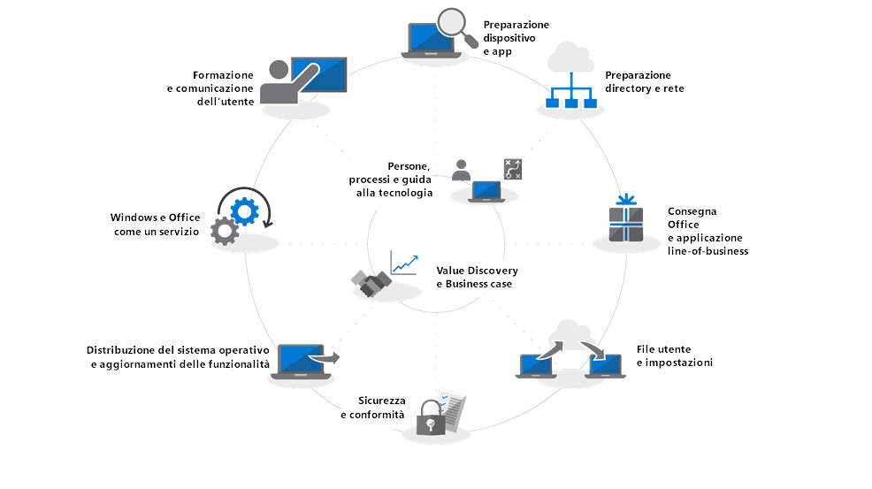

# Centro di distribuzione desktop modernoModern Desktop Deployment Center

Seguire la procedura sotto riportata per pianificare ed eseguire una distribuzione di Windows 10 e Office 365 ProPlus su vasta scala. Ogni passaggio è parte del processo generale di pianificazione e distribuzione e i passaggi vanno in genere eseguiti in parallelo in una distribuzione in fasi. Scaricare la versione gratuita di [Distribuzione del desktop moderno e Management Lab Kit](https://aka.ms/howtoshiftlabs) per un'esercitazione pratica con gli strumenti evidenziati nel processo di distribuzione.Follow the steps below to plan and carry out your large-scale deployment of Windows 10 and Office 365 ProPlus. Each step below is part of the overall planning and deployment process with steps typically running in parallel to each other in a phased deployment. Download the free [Modern Desktop Deployment and Management Lab Kit](https://aka.ms/howtoshiftlabs) for hands-on training with the tools highlighted in the deployment process.

 

<table>
<tr class="even">
<td></td>
<td>
<strong><a href="https://aka.ms/mdd0">Guida introduttiva: indicazioni su utenti, processi e tecnologia</a></strong><strong><a href="https://aka.ms/mdd0">Getting Started: People, Process and Technology Guidance</a></strong>

Informazioni sui vantaggi di un desktop moderno, le modifiche principali e considerazioni sulla distribuzione precedente e procedure consigliate per garantire una transizione a Windows 10 e Office 365 ProPlus priva di problemi.Discover the benefits of a modern desktop, major changes and considerations versus previous deployments and best practices to ensure a smooth transition to Windows 10 and Office 365 ProPlus.
</td>
<td></td>
</tr>
<tbody>
<tr class="odd">
<td></td>
<td>
<strong><a href="https://aka.ms/mdd1">Passaggio 1: conformità di dispositivi e app</a></strong><strong><a href="https://aka.ms/mdd1">Step 1: Device and App Readiness</a></strong>

Iniziare il progetto di distribuzione desktop con un inventario dei dispositivi e delle app, con l’assegnazione delle priorità, con l’esecuzione di test sui dispositivi e sulle app cui è stata assegnata la priorità, quindi con la correzione di quanto necessario per prepararsi alla distribuzione.Begin your desktop deployment project with an inventory of your devices and apps, prioritize what you to move forward, test prioritized apps and devices, then remediate what’s needed to get ready for deployment.
</td>
<td></td>
</tr>
<tr class="even">
<td></td>
<td>
<strong><a href="https://aka.ms/mdd2">Passaggio 2: conformità della directory e della rete</a></strong><strong><a href="https://aka.ms/mdd2">Step 2: Directory and Network Readiness</a></strong>

I servizi connessi tramite cloud in Office 365 ProPlus e le nuove opzioni di distribuzione come Windows Autopilot richiedono Azure Active Directory. Anche la rete e la connettività sono aree importanti da pianificare quando si trasferiscono immagini, app, driver e file correlati nei PC. Ottenere informazioni su come i nuovi strumenti e opzioni di distribuzione riducono e ottimizzano il traffico di rete.Cloud connected services in Office 365 ProPlus and new deployment options like Windows Autopilot require Azure Active Directory. Your network and connectivity are also important areas to plan when moving Windows images, apps, drivers and related files to your PCs. Learn how new tools and deployment options reduce and streamline network traffic.
</td>
<td></td>
</tr>
<tr class="odd">
<td></td>
<td>
<strong><a href="https://aka.ms/mdd3">Passaggio 3: distribuzione di Office e app line-of-business</a></strong><strong><a href="https://aka.ms/mdd3">Step 3: Office and LOB App Delivery</a></strong>

Verificare che le app siano compresse e pronte per l'installazione automatica. Ottenere maggiori informazioni sulle nuove opzioni offerte dai pacchetti a portata di clic di Office 365 ProPlus per configurare, distribuire e mantenere aggiornate le app di Office.Ensure your apps are packaged and ready for automated installation. Learn how Click-to-Run packaging with Office 365 ProPlus gives you new options to configure, deliver and keep your Office apps up-to-date.
</td>
<td></td>
</tr>
<tr class="even">
<td></td>
<td>
<strong><a href="https://aka.ms/mdd4">Passaggio 4: file e impostazioni utente</a></strong><strong><a href="https://aka.ms/mdd4">Step 4: User Files and Settings</a></strong>

Durante l'aggiornamento o la sostituzione dei PC, è possibile risparmiare tempo automatizzando il backup e il ripristino dello stato utente. Le nuove opzioni per la sincronizzazione dei file sul cloud consentono di applicare la sincronizzazione per utente delle cartelle desktop, documenti e immagini in OneDrive per l'accesso semplificato ai file da nuove installazioni di Windows.When refreshing or replacing PCs, save time by automating user state backup and restore. New options for cloud file sync allow you to enforce per user sync of Desktop, Documents and Pictures folders to OneDrive for seamless file access from new Windows installs.
</td>
<td></td>
</tr>
<tr class="odd">
<td></td>
<td>
<strong><a href="https://aka.ms/mdd5">Passaggio 5: considerazioni sulla sicurezza e conformità</a></strong><strong><a href="https://aka.ms/mdd5">Step 5: Security and Compliance Considerations</a></strong>

Windows 10 e Office 365 ProPlus forniscono nuovi modi per proteggere dati, dispositivi e utenti e per rilevare rapidamente e rispondere alle minacce. Ottenere inoltre informazioni su come gestire i problemi comuni relativi alla crittografia del disco, alle app antimalware e ai criteri quando si passa a Windows 10.Windows 10 and Office 365 ProPlus provide new ways to protect your data, devices and users and quickly detect and respond to threats. Also, learn how to deal with common problems associated with disk encryption, anti-malware apps and policies when moving to Windows 10.
</td>
<td></td>
</tr>
<tr class="even">
<td></td>
<td>
<strong><a href="https://aka.ms/mdd6">Passaggio 6: distribuzione del sistema operativo e aggiornamenti delle caratteristiche</a></strong><strong><a href="https://aka.ms/mdd6">Step 6: OS Deployment and Feature Updates</a></strong>

La distribuzione basata sulla sequenza di attività è usata per automatizzare su vasta scala, la distribuzione in fasi per installazioni bare metal, aggiornamento del PC e sostituzione del PC. Le sequenze di attività di aggiornamento consentono inoltre di restare al passo con gli aggiornamenti semestrali principali. E Windows Autopilot è una novità che modernizza il processo di acquisizione di un nuovo PC.Task sequence-based deployment is used to automate large scale, phased deployment for bare metal installs, PC refresh and PC replacement. Upgrade task sequences will also help you stay current with major semi-annual updates. And Windows Autopilot is a recent addition that modernizes the new PC acquisition process.
</td>
<td></td>
</tr>
<tr class="odd">
<td></td>
<td>
<strong><a href="https://aka.ms/mdd7">Passaggio 7: preparazione per Windows e Office come servizio</a></strong><strong><a href="https://aka.ms/mdd7">Step 7: Preparing for Windows and Office as a Service</a></strong>

Windows 10 e Office 365 ProPlus aggiungono continuamente nuove funzionalità per continuare a offrire esperienze utente e protezione con le ultime novità. Ottenere informazioni su come restare al passo con gli aggiornamenti mensili e semestrali, su come funziona il nuovo modello di manutenzione e sugli strumenti e opzioni disponibili.Both Windows 10 and Office 365 ProPlus continually add new capabilities to keep bringing user experiences and security forward with the latest innovations. Learn how to stay current with semi-annual and monthly updates, how the new servicing model works and the tools and options you have.
</td>
<td></td>
</tr>
<tr class="even">
<td></td>
<td>
<strong><a href="https://aka.ms/mdd8">Passaggio 8: formazione e comunicazione utente</a></strong><strong><a href="https://aka.ms/mdd8">Step 8: User Communication and Training</a></strong>

Verificare che gli utenti siano informati sulle nuove esperienze e sulle nuove modalità di lavoro quando si passa a Windows 10 e Office 365 ProPlus. Ottenere informazioni su come sfruttare l’assistenza per l’adozione da parte degli utenti con Microsoft FastTrack, sui materiali di formazione e sui modelli di comunicazione, oltre che sui nuovi modi per monitorare l'utilizzo e l’accettazione da parte degli utenti.Make sure your users are informed about new experiences and new ways of working as you shift your PCs to Windows 10 and Office 365 ProPlus. Learn how to take advantage of user adoption assistance with Microsoft FastTrack, training materials and communication templates, as well as new ways to monitor user acceptance and usage.
</td>
<td></td>
</tr>
<tr class="odd">
<td></td>
<td>
<strong><a href="https://transform.microsoft.com" target="_blank">Coinvolgere i dirigenti: Value Discovery e caso aziendale</a></strong><strong><a href="https://transform.microsoft.com" target="_blank">Get your Leadership on Board: Value Discovery and Business Case</a></strong>

Se si è effettuata la ricerca sulla distribuzione, la valutazione della conformità delle app e dei dispositivi, creato il piano di distribuzione e iniziato la distribuzione pilota, ma non si hanno il supporto o le risorse necessarie da parte del team di gestione per soddisfare le sequenze temporali della distribuzione, i programmi di valore aziendale di Microsoft possono essere di aiuto. Ottenere informazioni su come creare un caso aziendale per un desktop moderno e coinvolgere tutti.If you’ve done your deployment research, assessed app and device readiness, built your deployment plan and started piloting your deployment, but don’t have the support or resources needed from your management team to meet your deployment timelines, the Business Value Programs at Microsoft can help. Learn how to build a business case for a modern desktop and help get everyone on board.
</td>
<td></td>
</tr>
</tbody>
</table>
