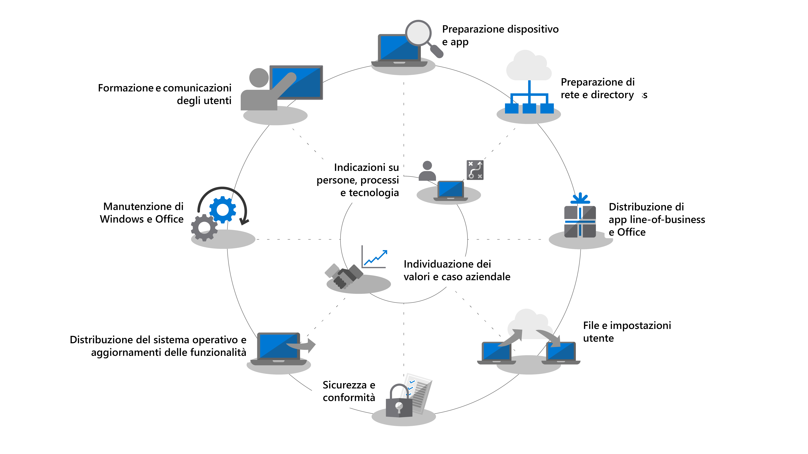

# Centro di distribuzione desktopDesktop Deployment Center

<strong>Aggiornamento da Windows 7 a Windows 10</strong><strong>Upgrading from Windows 7 to Windows 10</strong>

Il supporto esteso di Windows 7 è terminato il 14 gennaio 2020.Windows 7 extended support ended on January 14, 2020. L'aggiornamento sul posto da Windows 7 a Windows 10 rappresenta il metodo di distribuzione più rapido.In-place upgrade from Windows 7 to Windows 10 is the fastest method to deploy. È possibile <a href="https://docs.microsoft.com/microsoft-365/enterprise/windows-7-to-windows-10-upgrade-manual">aggiornare un singolo PC</a> o <a href="https://docs.microsoft.com/microsoft-365/enterprise/windows-7-to-windows-10-upgrade-automated">aggiornare migliaia di PC con Microsoft Endpoint Configuration Manager</a>.You can <a href="https://docs.microsoft.com/microsoft-365/enterprise/windows-7-to-windows-10-upgrade-manual">upgrade a single PC</a> or <a href="https://docs.microsoft.com/microsoft-365/enterprise/windows-7-to-windows-10-upgrade-automated">upgrade thousands of PCs using Microsoft Endpoint Configuration Manager</a>. Non è necessario concentrarsi sulla consegna dell'app, sulla migrazione dei file, sulla creazione dell'immagine personalizzata o sull'abilitazione di servizi basati sul cloud con aggiornamenti sul posto.You don’t need to focus on app delivery, file migration, custom imaging, or enabling cloud-based services with in-place upgrades. È possibile usare gli strumenti già a disposizione per aggiornare PC esistenti e concentrarsi sui passaggi di distribuzione seguenti per gli aggiornamenti:You can use tools you already have to upgrade existing PCs and focus on the following deployment steps for upgrades: 

|               |               |               |               |               |               |
| ------------- | ------------- | ------------- | ------------- | ------------- | ------------- |
|  | **[Aggiornare ConfigMgr a Current Branch](https://docs.microsoft.com/microsoft-365/enterprise/step-2-directory-and-network-readiness)****[Upgrade ConfigMgr to Current Branch](https://docs.microsoft.com/microsoft-365/enterprise/step-2-directory-and-network-readiness)** 
Parte del passaggio di conformità della directory e della rete per le organizzazioni che usano Configuration ManagerPart of Directory and Network Readiness for organizations using Configuration Manager
 |  | **[Convalidare la conformità di dispositivi e app](/microsoft-365/enterprise/step-1-device-and-app-readiness)****[Validate device and app readiness](/microsoft-365/enterprise/step-1-device-and-app-readiness)** 
Parte del passaggio di conformità di dispositivi e app; è possibile richiedere assistenza tramite Desktop App AssurePart of Device and App Readiness; help is available via Desktop App Assure
 |  | **[Aggiornare PC con Windows 7 a Windows 10](/microsoft-365/enterprise/windows-7-to-windows-10-upgrade-automated)****[Upgrade Windows 7 PCs to Windows 10](/microsoft-365/enterprise/windows-7-to-windows-10-upgrade-automated)** 
Parte del passaggio di conformità di dispositivi e app; è possibile richiedere assistenza tramite Desktop App AssurePart of Device and App Readiness; help is available via Desktop App Assure
 |

Seguire la procedura descritta di seguito per pianificare ed eseguire una distribuzione di Windows 10 e Microsoft 365 Apps for enterprise su vasta scala.Follow the steps below to plan and carry out your large-scale deployment of Windows 10 and Microsoft 365 Apps for enterprise. Ogni passaggio fa parte del processo generale di pianificazione e distribuzione e i passaggi vanno in genere eseguiti in parallelo in una distribuzione in fasi.Each step below is part of the overall planning and deployment process with steps typically running in parallel to each other in a phased deployment. Scaricare la versione gratuita di [Distribuzione del desktop e Management Lab Kit](https://aka.ms/howtoshiftlabs) per un'esercitazione pratica con gli strumenti evidenziati nel processo di distribuzione.Download the free [Desktop Deployment and Management Lab Kit](https://aka.ms/howtoshiftlabs) for hands-on training with the tools highlighted in the deployment process. Per la distribuzione desktop è anche possibile [richiedere assistenza](https://aka.ms/mddhelp) a partner Microsoft e servizi FastTrack.You can also [find help](https://aka.ms/mddhelp) for your desktop deployment from Microsoft partners and FastTrack services.

 

<table>
<tr class="even">
<td></td>
<td>
<strong><a href="https://aka.ms/mdd0">Guida introduttiva: indicazioni su utenti, processi e tecnologia</a></strong><strong><a href="https://aka.ms/mdd0">Getting Started: People, Process and Technology Guidance</a></strong>

Informazioni sui vantaggi correlati al passaggio a Windows 10 e Microsoft 365 Apps for enterprise e sulle principali modifiche, considerazioni rispetto alle distribuzioni precedenti e procedure consigliate per una transizione a Windows 10 e Microsoft 365 Apps for enterprise priva di problemi.Discover the benefits of moving to Windows 10 and Microsoft 365 Apps for enterprise, major changes and considerations versus previous deployments, and best practices to ensure a smooth transition to Windows 10 and Microsoft 365 Apps for enterprise.
</td>
<td></td>
</tr>
<tbody>
<tr class="odd">
<td></td>
<td>
<strong><a href="https://aka.ms/mdd1">Passaggio 1: conformità di dispositivi e app</a></strong><strong><a href="https://aka.ms/mdd1">Step 1: Device and App Readiness</a></strong>

Iniziare il progetto di distribuzione desktop con un inventario dei dispositivi e delle app, con l'assegnazione delle priorità, con l'esecuzione di test sui dispositivi e sulle app cui è stata assegnata la priorità, quindi con la correzione di quanto necessario per prepararsi alla distribuzione.Begin your desktop deployment project with an inventory of your devices and apps, prioritize what you need to move forward, test prioritized apps and devices, then remediate what’s needed to get ready for deployment.
</td>
<td></td>
</tr>
<tr class="even">
<td></td>
<td>
<strong><a href="https://aka.ms/mdd2">Passaggio 2: conformità della directory e della rete</a></strong><strong><a href="https://aka.ms/mdd2">Step 2: Directory and Network Readiness</a></strong>

I servizi connessi tramite cloud in Microsoft 365 Apps for enterprise e le nuove opzioni di distribuzione come Windows Autopilot richiedono Azure Active Directory. Anche la rete e la connettività sono aree importanti da pianificare quando si trasferiscono immagini, app, driver e file correlati nei PC. Ottenere informazioni su come i nuovi strumenti e opzioni di distribuzione riducono e ottimizzano il traffico di rete.Cloud connected services in Microsoft 365 Apps for enterprise and new deployment options like Windows Autopilot require Azure Active Directory. Your network and connectivity are also important areas to plan when moving Windows images, apps, drivers and related files to your PCs. Learn how new tools and deployment options reduce and streamline network traffic.
</td>
<td></td>
</tr>
<tr class="odd">
<td></td>
<td>
<strong><a href="https://aka.ms/mdd3">Passaggio 3: distribuzione di Office e app line-of-business</a></strong><strong><a href="https://aka.ms/mdd3">Step 3: Office and LOB App Delivery</a></strong>

Verificare che le app siano compresse e pronte per l'installazione automatica.Ensure your apps are packaged and ready for automated installation. Informazioni sulle nuove opzioni offerte dai pacchetti a portata di clic di Microsoft 365 Apps for enterprise per configurare, distribuire e mantenere aggiornate le app di Office.Learn how Click-to-Run packaging with Microsoft 365 Apps for enterprise gives you new options to configure, deliver, and keep your Office apps up-to-date.
</td>
<td></td>
</tr>
<tr class="even">
<td></td>
<td>
<strong><a href="https://aka.ms/mdd4">Passaggio 4: file e impostazioni utente</a></strong><strong><a href="https://aka.ms/mdd4">Step 4: User Files and Settings</a></strong>

Durante l'aggiornamento o la sostituzione dei PC, è possibile risparmiare tempo automatizzando il backup e il ripristino dello stato utente.When refreshing or replacing PCs, save time by automating user state backup and restore. Le nuove opzioni per la sincronizzazione dei file sul cloud consentono di applicare la sincronizzazione per utente delle cartelle desktop, documenti e immagini in OneDrive per l'accesso semplificato ai file da nuove installazioni di Windows.New options for cloud file sync allow you to enforce per user sync of Desktop, Documents, and Pictures folders to OneDrive for seamless file access from new Windows installs.
</td>
<td></td>
</tr>
<tr class="odd">
<td></td>
<td>
<strong><a href="https://aka.ms/mdd5">Passaggio 5: considerazioni sulla sicurezza e conformità</a></strong><strong><a href="https://aka.ms/mdd5">Step 5: Security and Compliance Considerations</a></strong>

Windows 10 e Microsoft 365 Apps for enterprise forniscono nuovi modi per proteggere dati, dispositivi e utenti e per rilevare rapidamente e rispondere alle minacce.Windows 10 and Microsoft 365 Apps for enterprise provide new ways to protect your data, devices and users, and quickly detect and respond to threats. In questo passaggio vengono inoltre fornite informazioni su come gestire i problemi comuni relativi alla crittografia del disco, alle app antimalware e ai criteri quando si passa a Windows 10.Also, learn how to deal with common problems associated with disk encryption, anti-malware apps, and policies when moving to Windows 10.
</td>
<td></td>
</tr>
<tr class="even">
<td></td>
<td>
<strong><a href="https://aka.ms/mdd6">Passaggio 6: distribuzione del sistema operativo e aggiornamenti delle caratteristiche</a></strong><strong><a href="https://aka.ms/mdd6">Step 6: OS Deployment and Feature Updates</a></strong>

La distribuzione basata sulla sequenza di attività è usata per automatizzare su vasta scala, la distribuzione in fasi per installazioni bare metal, aggiornamento del PC e sostituzione del PC.Task sequence-based deployment is used to automate large scale, phased deployment for bare metal installs, PC refresh, and PC replacement. Le sequenze di attività di aggiornamento consentono inoltre di restare al passo con gli aggiornamenti semestrali principali.Upgrade task sequences will also help you stay current with major semi-annual updates. E Windows Autopilot è una novità che modernizza il processo di acquisizione di un nuovo PC.Windows Autopilot is a recent addition that modernizes imaging new and existing devices.
</td>
<td></td>
</tr>
<tr class="odd">
<td></td>
<td>
<strong><a href="https://aka.ms/mdd7">Passaggio 7: manutenzione di Windows e Office</a></strong><strong><a href="https://aka.ms/mdd7">Step 7: Windows and Office Servicing</a></strong>

Windows 10 e Microsoft 365 Apps for enterprise aggiungono continuamente nuove funzionalità per continuare a offrire esperienze utente e protezione con le ultime novità.Both Windows 10 and Microsoft 365 Apps for enterprise continually add new capabilities to keep bringing user experiences and security forward with the latest innovations. In questo passaggio vengono fornite informazioni su come restare al passo con gli aggiornamenti mensili e semestrali, su come funziona il nuovo modello di manutenzione e sugli strumenti e opzioni già disponibili.Learn how to stay current with semi-annual and monthly updates, how the new servicing model works, and the tools and options you have.
</td>
<td></td>
</tr>
<tr class="even">
<td></td>
<td>
<strong><a href="https://aka.ms/mdd8">Passaggio 8: formazione e comunicazione utente</a></strong><strong><a href="https://aka.ms/mdd8">Step 8: User Communication and Training</a></strong>

Verificare che gli utenti siano informati sulle nuove esperienze e sulle nuove modalità di lavoro quando si passa a Windows 10 e Microsoft 365 Apps for enterprise. Ottenere informazioni su come sfruttare l'assistenza per l'adozione da parte degli utenti con Microsoft FastTrack, sui materiali di formazione e sui modelli di comunicazione, oltre che sui nuovi modi per monitorare l'utilizzo e l’accettazione da parte degli utenti.Make sure your users are informed about new experiences and new ways of working as you shift your PCs to Windows 10 and Microsoft 365 Apps for enterprise. Learn how to take advantage of user adoption assistance with Microsoft FastTrack, training materials and communication templates, as well as new ways to monitor user acceptance and usage.
</td>
<td></td>
</tr>
</tbody>
</table>
