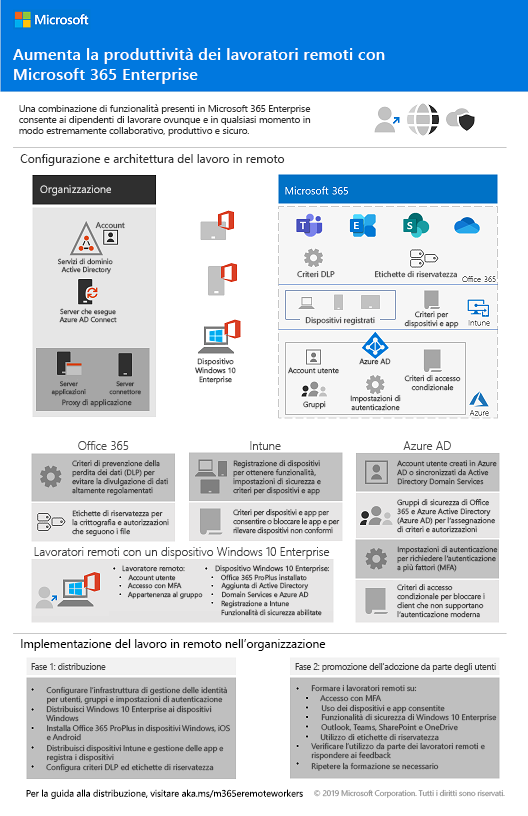
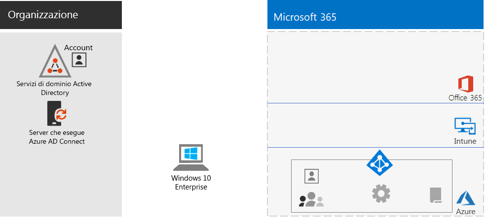
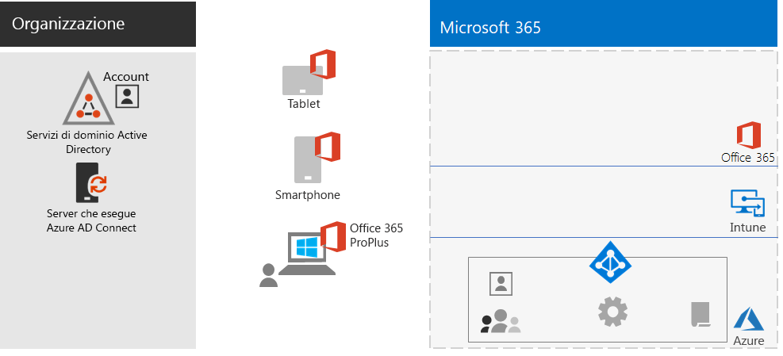
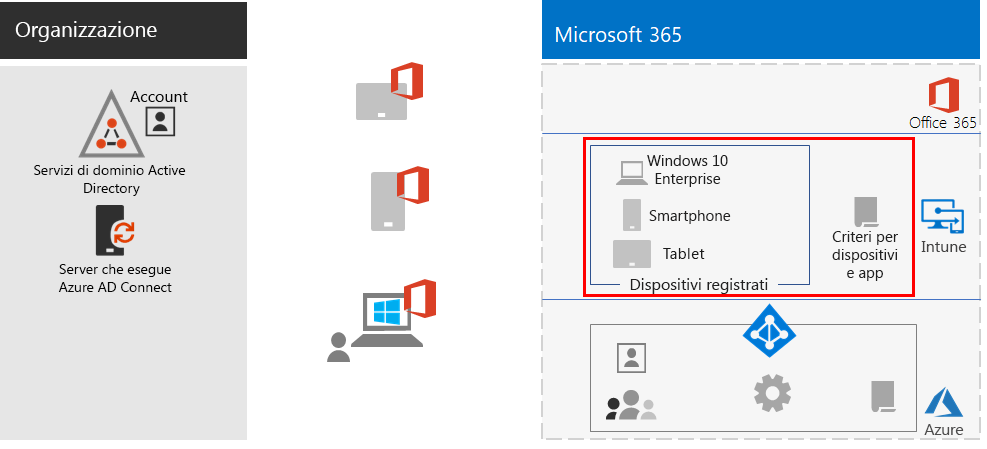
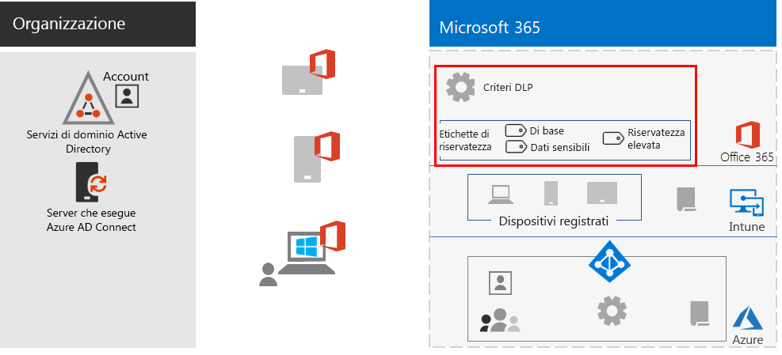
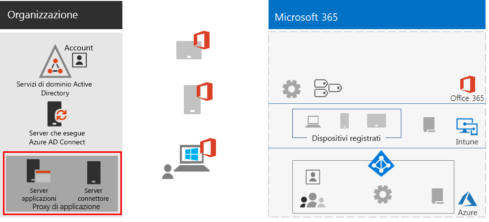
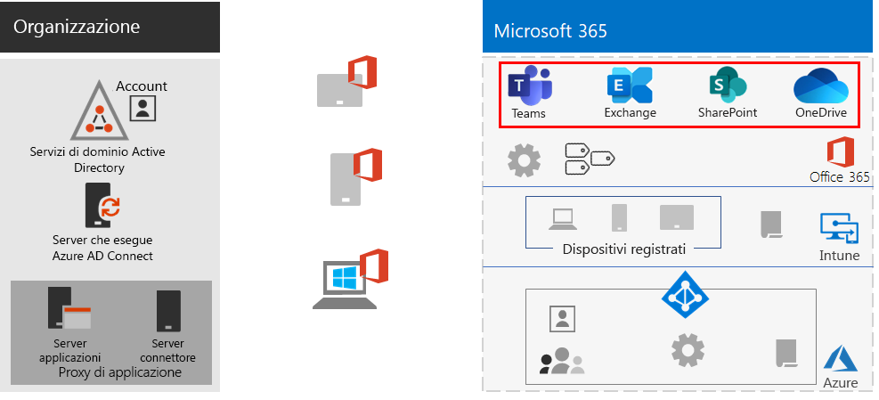
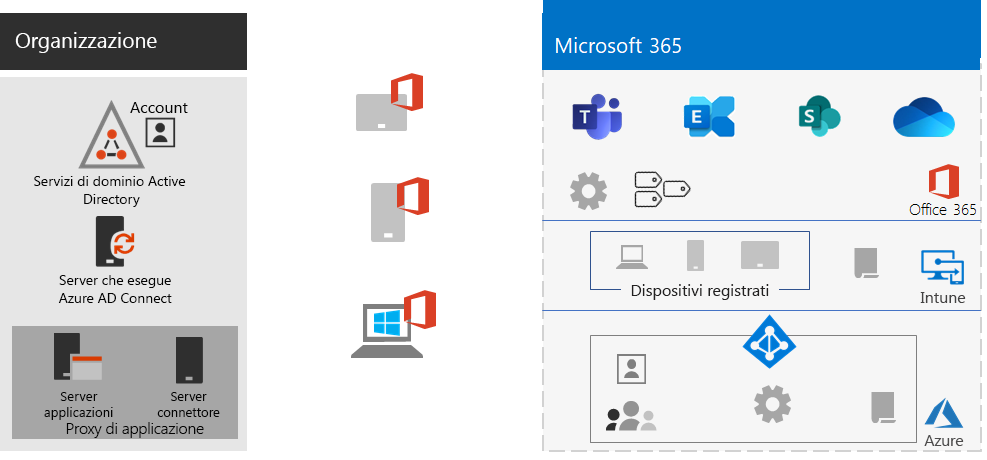
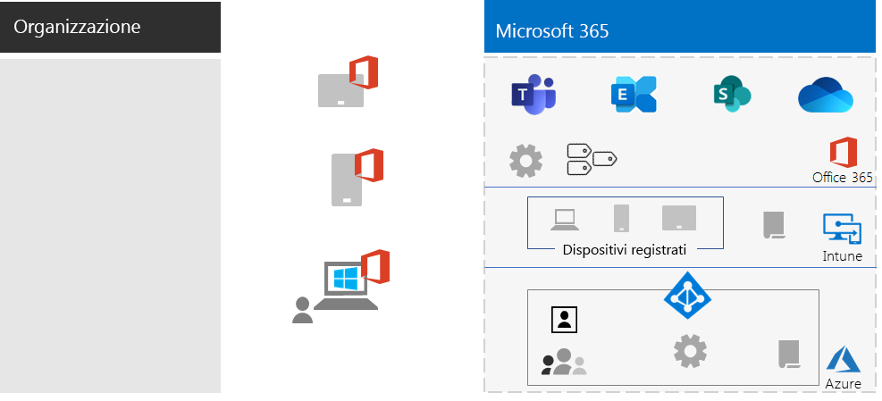

# Supportare i lavoratori remotiEmpower remote workers

*Questo scenario si applica alle versioni E3 ed E5 di Microsoft 365 Enterprise**This scenario applies to both the E3 and E5 versions of Microsoft 365 Enterprise*

Per molte organizzazioni, consentire al personale di lavorare facilmente e in sicurezza fuori dall'ufficio è importante, per risparmiare spazio fisico, assumere e trattenere dipendenti che non sono disposti al trasferimento e ridurre il pendolarismo, lasciando così ai dipendenti più tempo per essere produttivi e ridurre lo stress.Allowing employees to work away from the office seamlessly and securely is important for many organizations to save on office space, hire and retain employees who are unwilling to relocate, and reduce employee commuting, leaving them with more time to be productive and for stress-reducing activities outside of work.

Il telelavoro può abbracciare uno spettro che include:Remote working, also known as teleworking, can span a spectrum that includes:

- Dipendenti che sono lontani dall'ufficio solo occasionalmente, per convegni o riunioni con i clienti.Employees that are occasionally away from the office for conferences or client meetings.
- Alcuni dipendenti che lavorano in remoto a tempo pieno.Some employees that work remotely full-time.
- Un'organizzazione completamente remota in cui non ci sono uffici e tutti i dipendenti sono telelavoratori.A fully remote organization in which tHere's no office and all employees are remote.

Per supportare il telelavoro, Microsoft 365 Enterprise offre una serie di funzionalità che consentono ai dipendenti di collaborare in modo estremamente semplice da remoto, ad esempio:To support remote workers, a combination of features in Microsoft 365 Enterprise enables your remote workers in a highly collaborative way, such as:

- Riunioni online e sessioni di chat.Online meetings and chat sessions.
- Aree di lavoro condivise per l'archiviazione di file basata sul cloud, con accessibilità globale e collaborazione in tempo reale.Shared workspaces for cloud-based file storage with global accessibility and real-time collaboration.
- Attività e flussi di lavoro condivisi per dividere il lavoro e portare a termine le attività.Shared tasks and workflows to divide up the work and get things done.

Per la massima sicurezza, Microsoft 365 Enterprise include:For strong security, Microsoft 365 Enterprise includes:

- Applicazione di requisiti di autenticazione, con rilevamento e risposta agli accessi ad alto rischio e blocco di app selezionate e dispositivi non conformi.Enforced authentication requirements, detecting and responding to high-risk sign-ins, and blocking selected apps and non-compliant devices.
- Connessioni crittografate e risorse digitali nel cloud.Encrypted connections and digital assets in the cloud.
- Autorizzazioni per definire le operazioni che possono essere eseguite da ciascun utente sui file.Permissions to define who can do what with files.
- Prevenzione della perdita dei dati (DLP) per evitare la divulgazione di dati altamente regolamentati.Data loss prevention (DLP) to prevent leakage of highly regulated data.

Per soddisfare questi criteri per i lavoratori remoti, usare le funzionalità di Microsoft 365 Enterprise seguenti:To meet these criteria for remote workers, use the following Microsoft 365 Enterprise features:

- Identità utente e protezione degli accessiUser identity and sign-in security
  - Account utente di Azure Active Directory (Azure AD) con autenticazione a più fattori (MFA)Azure Active Directory (Azure AD) user accounts with multi-factor authentication (MFA)
  - Criteri di accesso condizionale per richiedere l'autenticazione MFA per gli accessi a rischioConditional Access policies to require MFA for risky sign-ins
- Piattaforme di collaborazioneCollaboration platforms
  - Microsoft Teams, SharePoint e OneDrive, con cui i lavoratori remoti possono programmare e partecipare a riunioni video online e lavorare contemporaneamente agli stessi documenti.Microsoft Teams, SharePoint, and OneDrive, with which remote workers can schedule and attend online video-based meetings and work on the same documents at the same time
- Protezione dell'accesso alle risorseSecure access to resources
  - Gruppi e autorizzazioni per Teams, siti di SharePoint e OneDrive, in modo che possano accedere solo gli utenti autenticati e consentitiGroups and permissions for Teams, SharePoint sites, and OneDrive so that only authenticated and permitted users have access
- Protezione dalla perdita di fileProtection for leaked files
  - Criteri DLP di Office 365Office 365 DLP policies
  - Etichette di riservatezza per la crittografia e autorizzazioni che seguono i fileSensitivity labels for encryption and permissions that travel with files
- Sicurezza e gestione dei dispositivi con Microsoft IntuneDevice management and security with Microsoft Intune
  - Registrazione per i dispositivi gestitiEnrollment for managed devices
  - Impostazioni delle app per i dispositivi personaliApp settings for personal devices
  - Criteri per dispositivi e appDevice and app policies
- App di produttività per i dispositiviProductivity apps for devices
  - App di Office 365 ProPlus per esperienze di collaborazione con Teams, SharePoint e OneDriveOffice 365 ProPlus apps for collaborative experiences with Teams, SharePoint, and OneDrive 
- Windows 10 EnterpriseWindows 10 Enterprise
  - Funzionalità di sicurezza complete per la protezione dai cyberattacchi e la prevenzione della perdita di datiComprehensive security features to protect against cyberattacks and prevent data leakage
- Accesso alle app localiAccess to on-premises apps
  - Le organizzazioni con identità ibride possono usare Azure AD Application Proxy anziché connessioni di rete privata virtuale (VPN)Organizations that have hybrid identity can use Azure AD Application Proxy instead of virtual private network (VPN) connections

Le fasi seguenti illustrano come distribuire le funzionalità di Microsoft 365 Enterprise per l'accesso remoto e incoraggiarne l'adozione da parte dei lavoratori remoti.The following phases step you through deploying the feature of Microsoft 365 Enterprise for remote access and driving adoption for remote workers. Se sono già stati distribuiti elementi di queste fasi, assicurarsi che soddisfino i requisiti indicati prima di passare all'elemento successivo.If you have already deployed elements of these phases, ensure that they meet the stated requirements before moving on to the next element.

 Per un riepilogo di 1 pagina di questo scenario vedere il [poster Supportare i lavoratori remoti](media/empower-people-to-work-remotely/empower-remote-workers-scenario.pdf).For a 1-page summary of this scenario, see the [Empower remote workers poster](media/empower-people-to-work-remotely/empower-remote-workers-scenario.pdf).

È anche possibile scaricare il poster in formato [PDF](https://github.com/MicrosoftDocs/microsoft-365-docs/raw/public/microsoft-365/enterprise/media/empower-people-to-work-remotely/empower-remote-workers-scenario.pdf) o [PowerPoint](https://github.com/MicrosoftDocs/microsoft-365-docs/raw/public/microsoft-365/enterprise/media/empower-people-to-work-remotely/Empower-Remote-Workers-Poster.pptx) e stamparlo in formato lettera, legale o tabloid (27,9 x 43,2 cm).You can also download this poster in [PDF](https://github.com/MicrosoftDocs/microsoft-365-docs/raw/public/microsoft-365/enterprise/media/empower-people-to-work-remotely/empower-remote-workers-scenario.pdf) or [PowerPoint](https://github.com/MicrosoftDocs/microsoft-365-docs/raw/public/microsoft-365/enterprise/media/empower-people-to-work-remotely/Empower-Remote-Workers-Poster.pptx) formats and print it on letter, legal, or tabloid (11 x 17)-sized paper.

## Fase 1: distribuire le caratteristiche e le funzionalità di Microsoft 365 per i lavoratori remotiPhase 1: Deploy Microsoft 365 features and capabilities for remote workers

Visti il numero e l'ampiezza delle caratteristiche e delle funzionalità richieste per questo scenario, verranno illustrati gli elementi necessari delle sezioni relative all'infrastruttura di base e ai carichi di lavoro della [Guida alla distribuzione di Microsoft 365 Enterprise](deploy-microsoft-365-enterprise.md).Because of the breadth and number of features and capabilities required for this scenario, we’ll step you through the required elements of the foundation infrastructure and workloads sections of the [Microsoft 365 Enterprise Deployment Guide](deploy-microsoft-365-enterprise.md).

### Passaggio 1: requisiti dell'infrastruttura di base per i lavoratori remotiStep 1: Foundation infrastructure requirements for remote workers

In questo passaggio si esamineranno le fasi relative all'[infrastruttura di base](deploy-foundation-infrastructure.md) e verranno elencati gli elementi necessari per abilitare i lavoratori remoti.In this step, we’ll visit the phases of the [foundation infrastructure](deploy-foundation-infrastructure.md) and list the required elements to enable remote workers.

Per la [Fase 2: identità](identity-infrastructure.md), distribuire quanto segue per l'identità utente e la protezione degli accessi:For [Phase 2: Identity](identity-infrastructure.md), deploy the following for user identity and sign-in security:

- Per l'identità ibrida, account utente e gruppi sincronizzati da Active Directory Domain Services (AD DS) locale.For hybrid identity, user accounts and groups synchronized from on-premises Active Directory Domain Services (AD DS).
- Per l'assegnazione delle autorizzazioni, gruppi di Azure AD o sincronizzati con i membri appropriati.For assigning permissions, synchronized or Azure AD groups with the appropriate members.
- Impostazioni di autenticazione, ad esempio l'obbligo di MFA.Authentication settings, such as requiring MFA.
- Criteri di accesso condizionale per richiedere l'autenticazione MFA per gli accessi a rischio e bloccare i client che non supportano l'autenticazione moderna.Conditional Access policies to require MFA for risky sign-ins and block clients that don’t support modern authentication.

Ecco la configurazione risultante con gli elementi relativi all'identità evidenziati.Here's the resulting configuration with the identity elements highlighted.

 
Per la [Fase 3: Windows 10 Enterprise](windows10-infrastructure.md):For [Phase 3: Windows 10 Enterprise](windows10-infrastructure.md), deploy:

- Distribuire l'infrastruttura per l'implementazione di nuovi dispositivi con Windows 10 Enterprise e per l'aggiornamento dei dispositivi Windows 7 o Windows 8.1 a Windows 10 EnterpriseThe infrastructure to deploy new devices with Windows 10 Enterprise and to upgrade of your Windows 7 or Windows 8.1 devices to Windows 10 Enterprise
- Abilitare funzionalità di sicurezza complete per la protezione delle identità, delle informazioni e contro le minacceEnabling comprehensive security features for identity, threat, and information protection

Ecco la configurazione risultante con i dispositivi Windows 10 Enterprise.Here's the resulting configuration with Windows 10 Enterprise devices.

 
Per la [Fase 4: Office 365 ProPlus](office365proplus-infrastructure.md), distribuire l'infrastruttura per installare Office 365 ProPlus o aggiornare a Office 365 ProPlus la famiglia di prodotti Office attualmente installata, ad esempio Office 2010 o Office 2013, nei dispositivi dell'organizzazione.For [Phase 4: Office 365 ProPlus](office365proplus-infrastructure.md), deploy the infrastructure to install Office 365 ProPlus or upgrade your currently installed Office suite, such as Office 2010 or Office 2013, to Office 365 ProPlus on your organization devices. Questo consentirà di offrire agli utenti la miglior esperienza possibile di sicurezza e collaborazione.This will give your users the best security and collaborative experiences.

Ecco la configurazione risultante con Office 365 ProPlus installato nei dispositivi.Here's the resulting configuration with Office 365 ProPlus installed on devices.

 
Per la [Fase 5: gestione dei dispositivi mobili](mobility-infrastructure.md), distribuire la gestione dei dispositivi e delle app di Intune per:For [Phase 5: Mobile device management](mobility-infrastructure.md), deploy Intune device and app management for:

- Registrazione dei dispositivi Windows 10 Enterprise, iOS, macOS, Android e Android Enterprise in modo che ricevano impostazioni di sicurezza e funzionalità definite dall'organizzazione.Enrollment of your Windows 10 Enterprise, iOS, macOS, Android, and Android Enterprise devices so they receive features and security settings defined by your organization.
- Impostazioni delle app per una maggiore sicurezza e per consentire o bloccare app, anche nei dispositivi personali di proprietà dei dipendenti.App settings for extra security and to allow or block apps, even on employee-owned personal devices.
- Criteri di conformità con accesso condizionale per impedire la connessione di dispositivi non conformi.Compliance policies with Conditional Access to prevent non-compliant devices from connecting.

Ecco la configurazione risultante con i criteri e i dispositivi registrati in Intune evidenziati.Here's the resulting configuration with Intune enrolled devices and policies highlighted.

 
Per la [Fase 6: protezione delle informazioni](infoprotect-infrastructure.md), progettare e configurare la protezione per le risorse digitali con:For [Phase 6: Information protection](infoprotect-infrastructure.md), design and configure protection for your digital assets with:

- Criteri DLP di Office 365.Office 365 DLP policies.
- Etichette di riservatezza di Office 365 per la crittografia e autorizzazioni che seguono i file.Office 365 sensitivity labels for encryption and permissions that travel with files.

Ecco la configurazione risultante con i criteri DLP e le etichette di riservatezza evidenziati.Here's the resulting configuration with DLP policies and sensitivity labels highlighted.

 
Per l'accesso alle app locali si può usare [Azure AD Application Proxy](https://docs.microsoft.com/azure/active-directory/manage-apps/application-proxy), che richiede un ambiente ibrido di gestione delle identità.For access to on-premises apps, you can use [Azure AD Application Proxy](https://docs.microsoft.com/azure/active-directory/manage-apps/application-proxy), which requires a hybrid identity environment.

Ecco la configurazione risultante con i componenti del proxy di applicazione evidenziati.Here's the resulting configuration with the application proxy components highlighted.

 
### Passaggio 2: carichi di lavoro per lavoratori remotiStep 2: Workloads for remote workers

Per [Exchange Online](exchangeonline-workload.md), distribuire cassette postali di Exchange Online a ogni utente.For [Exchange Online](exchangeonline-workload.md), deploy Exchange Online mailboxes to each of your users.

Per [Teams](teams-workload.md), distribuire Teams agli utenti e ai gruppi aziendali.For [Teams](teams-workload.md), deploy Teams to your users and groups.

Per [SharePoint e OneDrive](sharepoint-online-onedrive-workload.md), distribuire siti del team o di comunicazione di SharePoint e cartelle di OneDrive.For [SharePoint and OneDrive](sharepoint-online-onedrive-workload.md), deploy SharePoint team or communication sites and OneDrive folders.

Ecco la configurazione risultante con i carichi di lavoro evidenziati.Here's the resulting configuration with the workloads highlighted.

 
### Risultati della distribuzioneDeployment results

A seguito della distribuzione dell'infrastruttura di base e dei carichi di lavoro e dell'implementazione di Windows 10 Enterprise e Office 365 ProPlus, i lavoratori remoti:After deploying the foundation infrastructure and workloads and rolling out Windows 10 Enterprise and Office 365 ProPlus, remote workers:

- Sono soggetti a protezione dell'identità e autenticazione avanzata.Are subject to strong authentication and identity protection.
- Hanno la versione più recente e sicura di Windows nei propri dispositivi Windows.Have the latest and most secure version of Windows on their Windows devices.
- Hanno la versione più recente e più produttiva della famiglia di prodotti Office nei propri dispositivi.Have the latest and most productive version of the Office suite on their devices.
- Sono soggetti a criteri di gestione delle app e di conformità dei dispositivi.Are subject to app management and device compliance policies.
- Sono soggetti a criteri DLP e restrizioni.Are subject to DLP policies and restrictions.
- Possono assegnare etichette di riservatezza per la crittografia e autorizzazioni che seguono i file e i messaggi di posta elettronica.Can assign sensitivity labels for encryption and permissions that travel with files and email.
- Possono accedere alle app locali senza una connessione VPN.Can access on-premises apps without a VPN connection.
- Possono svolgere il proprio lavoro e collaborare in tempo reale con i colleghi usando chat, riunioni e file in Teams e file in SharePoint e OneDrive.Can perform their own work and participate in real-time collaboration with co-workers with chats, meetings, and files in Teams and files in SharePoint and OneDrive.

Quando sono offline (non connessi a Internet), i lavoratori remoti possono modificare le copie locali dei file.When offline (not connected to the Internet), your remote workers can change local copies of files. Quando si riconnettono a Internet, OneDrive sincronizza le copie locali con i file archiviati nell'abbonamento a Microsoft 365.When they reconnect to the Internet, OneDrive synchronizes local copies with the files stored in your Microsoft 365 subscription. 

Ecco la configurazione risultante per i lavoratori remoti dell'organizzazione se si usa l'identità ibrida.Here's the resulting configuration for remote workers of your organization if you use hybrid identity.

 
 
Ecco la configurazione risultante per i lavoratori remoti dell'organizzazione se si usa l'identità solo cloud.Here's the resulting configuration for remote workers your organization if you use cloud-only identity.

## Fase 2: incoraggiare l'adozione da parte dei lavoratori remotiPhase 2: Drive user adoption for remote workers

Una volta predisposti l'infrastruttura di base e i carichi di lavoro, è il momento di incoraggiare l'utilizzo continuativo di queste funzionalità da parte dei lavoratori remoti, in modo che possano essere produttivi ovunque e in qualsiasi momento.Now that the foundation infrastructure and workloads are in place, it’s time to drive the ongoing usage of these capabilities to your remote workers so they can be productive anywhere and at any time.

### Passaggio 1: formare gli utentiStep 1: Train your users

Formare i lavoratori remoti su:Train your remote workers on:

- Procedure di accesso appropriate, tra cui registrazione MFA e richiesta di verifica dell'accesso quando viene rilevato un rischio.Proper sign-in procedures, including MFA registration, and how sign ins can be challenged when risk is detected.
- Uso dei dispositivi e modo in cui è possibile usare i criteri per bloccare l'accesso per dispositivi non conformi.The use of devices and how policies can be used to block access for non-compliant devices.
- Uso delle app consentite e modo in cui è possibile usare i criteri app di Intune per bloccare le app.The use of allowed apps and how Intune app polices can be used to block apps.
- Funzionalità di sicurezza di Windows 10 Enterprise.Windows 10 Enterprise security features.
- Come usare Outlook per la posta elettronica e la gestione dei calendari.How to use Outlook for email and calendaring.
- Come usare [Teams](https://docs.microsoft.com/microsoftteams/training-microsoft-teams-landing-page) per chat, videoconferenze, condivisione di documenti e conversazioni in thread.How to use [Teams](https://docs.microsoft.com/microsoftteams/training-microsoft-teams-landing-page) for chat, video-based conferencing, document sharing, and threaded conversations.
- Come usare i siti del team o di comunicazione di SharePoint e le cartelle di OneDrive per esplorare i file nella raccolta di un utente e quelli che appartengono a un gruppo.How to use SharePoint team or communication sites and OneDrive folders to browse files in a user's library and those belonging to a group.
- Come usare e applicare etichette di riservatezza per i file che contengono dati sensibili o altamente regolamentati, sia per le versioni locali che per quelle online dei file.How to use and apply sensitivity labels for files containing sensitive or highly regulated data, for both local and online versions of files.

Questa formazione dovrebbe includere esercizi pratici in modo che gli utenti possano sperimentare queste funzionalità e i loro risultati.This training should include hands-on exercises so that your students can experience these capabilities and their results.

### Passaggio 2: effettuare revisioni periodiche dell'utilizzo e rispondere al feedback dei lavoratoriStep 2: Conduct periodic reviews of usage and address worker feedback

Nelle settimane successive alla formazione:In the weeks after training:

- Rispondere rapidamente al feedback dei lavoratori remoti e ottimizzare i criteri e le configurazioni.Quickly address remote worker feedback and fine tune polices and configurations.
- Analizzare l'utilizzo di Teams, siti di SharePoint e cartelle di OneDrive e confrontarlo con le aspettative di utilizzo.Analyze usage for teams, SharePoint sites, and OneDrive folders and compare it with usage expectations.
- Verificare che i file sensibili o altamente regolamentati siano stati etichettati correttamente con l'etichetta di riservatezza appropriata.Verify that sensitive or highly regulated files have been properly labeled with the appropriate sensitivity label.

Ripetere la formazione degli utenti se necessario.Retrain your users as needed.

### Risultati dell'adozione da parte degli utentiUser adoption results

I lavoratori remoti possono usare i propri dispositivi Windows 10 Enterprise o altri dispositivi e Office 365 ProPlus per accedere a servizi e risorse cloud di Microsoft 365 Enterprise condivisi in un ambiente sicuro, incontrandosi, lavorando e collaborando in tempo reale.Your remote workers can use their Windows 10 Enterprise or other devices and Office 365 ProPlus to access and work on shared Microsoft 365 Enterprise cloud services and resources in a secure environment, and they’re meeting, creating, and collaborating in real time.

## Vedere ancheSee also

[Carichi di lavoro e scenariWorkloads and scenarios](deploy-workloads.md)

[Raccolta di produttività di Microsoft 365](https://aka.ms/productivitylibrary)https://aka.ms/productivitylibrary)[Microsoft 365 Productivity Library](https://aka.ms/productivitylibrary) (https://aka.ms/productivitylibrary)

[Guida alla distribuzioneDeployment guide](deploy-microsoft-365-enterprise.md)
