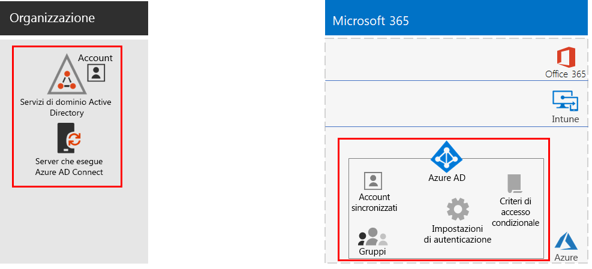
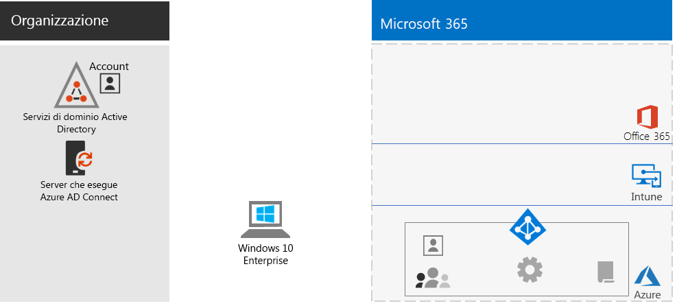
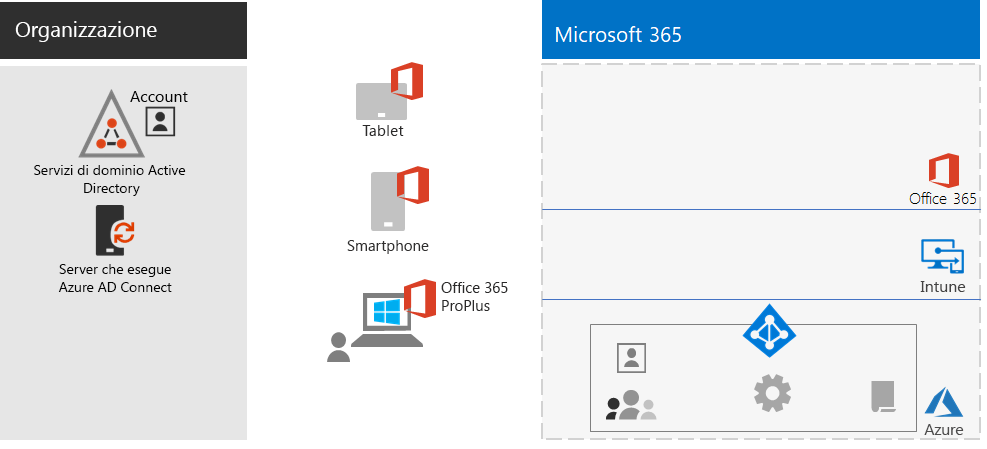
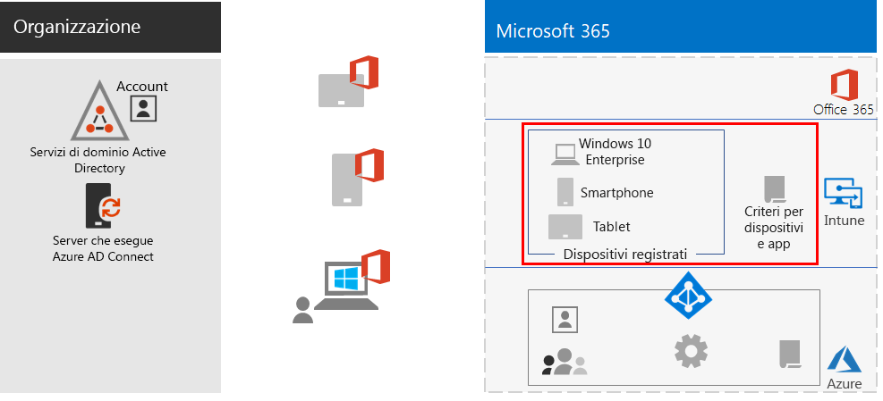
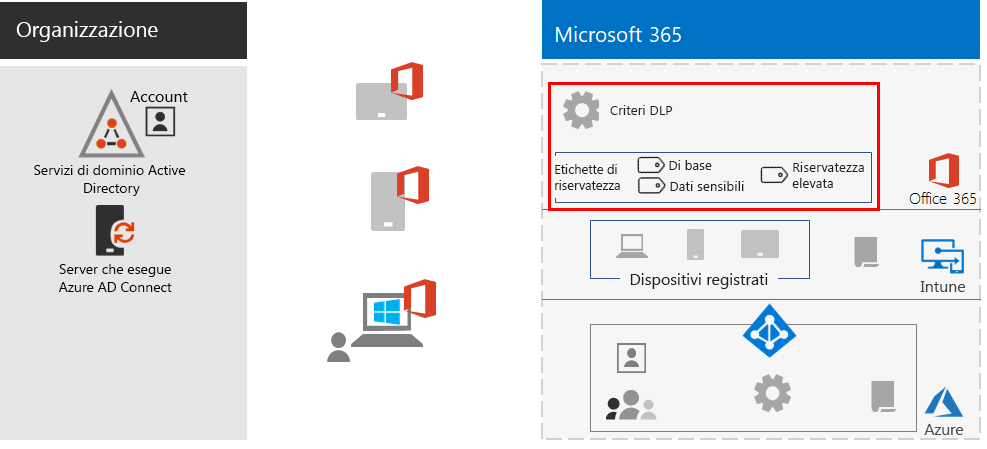
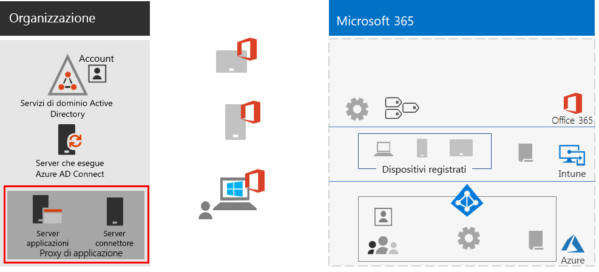
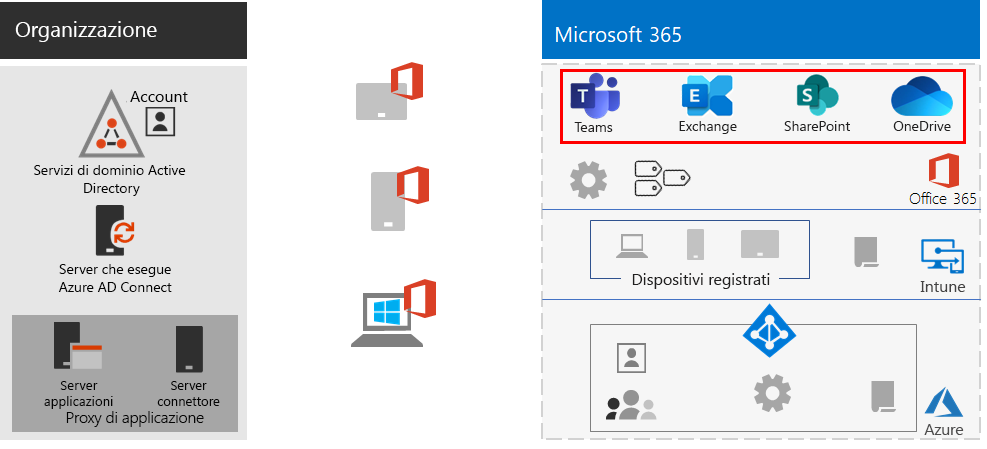
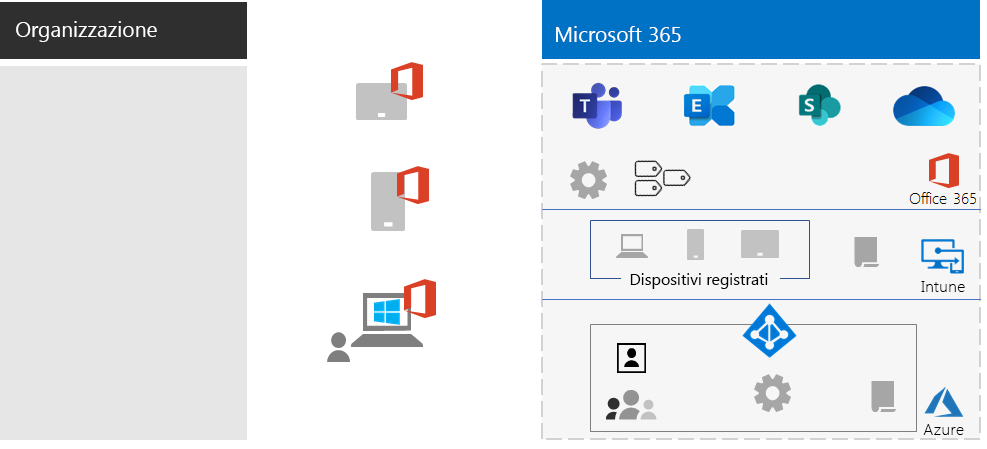

# Supportare i lavoratori remoti

*Questo scenario si applica alle versioni E3 ed E5 di Microsoft 365 Enterprise*

Per molte organizzazioni, consentire al personale di lavorare facilmente e in sicurezza fuori dall'ufficio è importante, per risparmiare spazio fisico, assumere e trattenere dipendenti che non sono disposti al trasferimento e ridurre il pendolarismo, lasciando così ai dipendenti più tempo per essere produttivi e ridurre lo stress.

Il telelavoro può abbracciare uno spettro che include:

- Dipendenti che sono lontani dall'ufficio solo occasionalmente, per convegni o riunioni con i clienti.
- Alcuni dipendenti che lavorano in remoto a tempo pieno.
- Un'organizzazione completamente remota in cui non ci sono uffici e tutti i dipendenti sono telelavoratori.

Per supportare il telelavoro, Microsoft 365 Enterprise offre una serie di funzionalità che consentono ai dipendenti di collaborare in modo estremamente semplice da remoto, ad esempio:

- Riunioni online e sessioni di chat.
- Aree di lavoro condivise per l'archiviazione di file basata sul cloud, con accessibilità globale e collaborazione in tempo reale.
- Attività e flussi di lavoro condivisi per dividere il lavoro e portare a termine le attività.

Per la massima sicurezza, Microsoft 365 Enterprise include:

- Applicazione di requisiti di autenticazione, con rilevamento e risposta agli accessi ad alto rischio e blocco di app selezionate e dispositivi non conformi.
- Connessioni crittografate e risorse digitali nel cloud.
- Autorizzazioni per definire le operazioni che possono essere eseguite da ciascun utente sui file.
- Prevenzione della perdita dei dati (DLP) per evitare la divulgazione di dati altamente regolamentati.

Per soddisfare questi criteri per i lavoratori remoti, usare le funzionalità di Microsoft 365 Enterprise seguenti:

- Identità utente e protezione degli accessi
  - Account utente di Azure Active Directory (Azure AD) con autenticazione a più fattori (MFA)
  - Criteri di accesso condizionale per richiedere l'autenticazione MFA per gli accessi a rischio
- Piattaforme di collaborazione
  - Microsoft Teams, SharePoint e OneDrive, con cui i lavoratori remoti possono programmare e partecipare a riunioni video online e lavorare contemporaneamente agli stessi documenti.
- Protezione dell'accesso alle risorse
  - Gruppi e autorizzazioni per Teams, siti di SharePoint e OneDrive, in modo che possano accedere solo gli utenti autenticati e consentiti
- Protezione dalla perdita di file
  - Criteri DLP di Office 365
  - Etichette di riservatezza per la crittografia e autorizzazioni che seguono i file
- Sicurezza e gestione dei dispositivi con Microsoft Intune
  - Registrazione per i dispositivi gestiti
  - Impostazioni delle app per i dispositivi personali
  - Criteri per dispositivi e app
- App di produttività per i dispositivi
  - App di Office 365 ProPlus per esperienze di collaborazione con Teams, SharePoint e OneDrive 
- Windows 10 Enterprise
  - Funzionalità di sicurezza complete per la protezione dai cyberattacchi e la prevenzione della perdita di dati
- Accesso alle app locali
  - Le organizzazioni con identità ibride possono usare Azure AD Application Proxy anziché connessioni di rete privata virtuale (VPN)

Le fasi seguenti illustrano come distribuire le funzionalità di Microsoft 365 Enterprise per l'accesso remoto e incoraggiarne l'adozione da parte dei lavoratori remoti. Se sono già stati distribuiti elementi di queste fasi, assicurarsi che soddisfino i requisiti indicati prima di passare all'elemento successivo.

 Per un riepilogo di 1 pagina di questo scenario vedere il [poster Supportare i lavoratori remoti](../media/empower-people-to-work-remotely/empower-remote-workers-scenario.pdf).

È anche possibile scaricare il poster in formato [PDF](https://github.com/MicrosoftDocs/microsoft-365-docs/raw/public/microsoft-365/media/empower-people-to-work-remotely/empower-remote-workers-scenario.pdf) o [PowerPoint](https://github.com/MicrosoftDocs/microsoft-365-docs/raw/public/microsoft-365/media/empower-people-to-work-remotely/Empower-Remote-Workers-Poster.pptx) e stamparlo in formato lettera, legale o tabloid (27,9 x 43,2 cm).

## Fase 1: distribuire le caratteristiche e le funzionalità di Microsoft 365 per i lavoratori remoti

Visti il numero e l'ampiezza delle caratteristiche e delle funzionalità richieste per questo scenario, verranno illustrati gli elementi necessari delle sezioni relative all'infrastruttura di base e ai carichi di lavoro della [Guida alla distribuzione di Microsoft 365 Enterprise](deploy-microsoft-365-enterprise.md).

### Passaggio 1: requisiti dell'infrastruttura di base per i lavoratori remoti

In questo passaggio si esamineranno le fasi relative all'[infrastruttura di base](deploy-foundation-infrastructure.md) e verranno elencati gli elementi necessari per abilitare i lavoratori remoti.

Per la [Fase 2: identità](identity-infrastructure.md), distribuire quanto segue per l'identità utente e la protezione degli accessi:

- Per l'identità ibrida, account utente e gruppi sincronizzati da Active Directory Domain Services (AD DS) locale.
- Per l'assegnazione delle autorizzazioni, gruppi di Azure AD o sincronizzati con i membri appropriati.
- Impostazioni di autenticazione, ad esempio l'obbligo di MFA.
- Criteri di accesso condizionale per richiedere l'autenticazione MFA per gli accessi a rischio e bloccare i client che non supportano l'autenticazione moderna.

Ecco la configurazione risultante con gli elementi relativi all'identità evidenziati.

 
Per la [fase 3: Windows 10 Enterprise](windows10-infrastructure.md):

- Distribuire l'infrastruttura per l'implementazione di nuovi dispositivi con Windows 10 Enterprise e per l'aggiornamento dei dispositivi Windows 7 o Windows 8.1 a Windows 10 Enterprise
- Abilitare funzionalità di sicurezza complete per la protezione delle identità, delle informazioni e contro le minacce

Ecco la configurazione risultante con i dispositivi Windows 10 Enterprise.

 
Per la [Fase 4: Office 365 ProPlus](office365proplus-infrastructure.md), distribuire l'infrastruttura per installare Office 365 ProPlus o aggiornare a Office 365 ProPlus la famiglia di prodotti Office attualmente installata, ad esempio Office 2010 o Office 2013, nei dispositivi dell'organizzazione. Questo consentirà di offrire agli utenti la miglior esperienza possibile di sicurezza e collaborazione.

Ecco la configurazione risultante con Office 365 ProPlus installato nei dispositivi.

 
Per la [Fase 5: gestione dei dispositivi mobili](mobility-infrastructure.md), distribuire la gestione dei dispositivi e delle app di Intune per:

- Registrazione dei dispositivi Windows 10 Enterprise, iOS, macOS, Android e Android Enterprise in modo che ricevano impostazioni di sicurezza e funzionalità definite dall'organizzazione.
- Impostazioni delle app per una maggiore sicurezza e per consentire o bloccare app, anche nei dispositivi personali di proprietà dei dipendenti.
- Criteri di conformità con accesso condizionale per impedire la connessione di dispositivi non conformi.

Ecco la configurazione risultante con i criteri e i dispositivi registrati in Intune evidenziati.

 
Per la [Fase 6: protezione delle informazioni](infoprotect-infrastructure.md), progettare e configurare la protezione per le risorse digitali con:

- Criteri DLP di Office 365.
- Etichette di riservatezza di Office 365 per la crittografia e autorizzazioni che seguono i file.

Ecco la configurazione risultante con i criteri DLP e le etichette di riservatezza evidenziati.

 
Per l'accesso alle app locali si può usare [Azure AD Application Proxy](https://docs.microsoft.com/azure/active-directory/manage-apps/application-proxy), che richiede un ambiente ibrido di gestione delle identità.

Ecco la configurazione risultante con i componenti del proxy di applicazione evidenziati.

 
### Passaggio 2: carichi di lavoro per lavoratori remoti

Per [Exchange Online](exchangeonline-workload.md), distribuire cassette postali di Exchange Online a ogni utente.

Per [Teams](teams-workload.md), distribuire Teams agli utenti e ai gruppi aziendali.

Per [SharePoint e OneDrive](sharepoint-online-onedrive-workload.md), distribuire siti del team o di comunicazione di SharePoint e cartelle di OneDrive.

Ecco la configurazione risultante con i carichi di lavoro evidenziati.

 
### Risultati della distribuzione

A seguito della distribuzione dell'infrastruttura di base e dei carichi di lavoro e dell'implementazione di Windows 10 Enterprise e Office 365 ProPlus, i lavoratori remoti:

- Sono soggetti a protezione dell'identità e autenticazione avanzata.
- Hanno la versione più recente e sicura di Windows nei propri dispositivi Windows.
- Hanno la versione più recente e più produttiva della famiglia di prodotti Office nei propri dispositivi.
- Sono soggetti a criteri di gestione delle app e di conformità dei dispositivi.
- Sono soggetti a criteri DLP e restrizioni.
- Possono assegnare etichette di riservatezza per la crittografia e autorizzazioni che seguono i file e i messaggi di posta elettronica.
- Possono accedere alle app locali senza una connessione VPN.
- Possono svolgere il proprio lavoro e collaborare in tempo reale con i colleghi usando chat, riunioni e file in Teams e file in SharePoint e OneDrive.

Quando sono offline (non connessi a Internet), i lavoratori remoti possono modificare le copie locali dei file. Quando si riconnettono a Internet, OneDrive sincronizza le copie locali con i file archiviati nell'abbonamento a Microsoft 365. 

Ecco la configurazione risultante per i lavoratori remoti dell'organizzazione se si usa l'identità ibrida.

 
 
Ecco la configurazione risultante per i lavoratori remoti dell'organizzazione se si usa l'identità solo cloud.

## Fase 2: incoraggiare l'adozione da parte dei lavoratori remoti

Una volta predisposti l'infrastruttura di base e i carichi di lavoro, è il momento di incoraggiare l'utilizzo continuativo di queste funzionalità da parte dei lavoratori remoti, in modo che possano essere produttivi ovunque e in qualsiasi momento.

### Passaggio 1: formare gli utenti

Formare i lavoratori remoti su:

- Procedure di accesso appropriate, tra cui registrazione MFA e richiesta di verifica dell'accesso quando viene rilevato un rischio.
- Uso dei dispositivi e modo in cui è possibile usare i criteri per bloccare l'accesso per dispositivi non conformi.
- Uso delle app consentite e modo in cui è possibile usare i criteri app di Intune per bloccare le app.
- Funzionalità di sicurezza di Windows 10 Enterprise.
- Come usare Outlook per la posta elettronica e la gestione dei calendari.
- Come usare [Teams](https://docs.microsoft.com/microsoftteams/training-microsoft-teams-landing-page) per chat, videoconferenze, condivisione di documenti e conversazioni in thread.
- Come usare i siti del team o di comunicazione di SharePoint e le cartelle di OneDrive per esplorare i file nella raccolta di un utente e quelli che appartengono a un gruppo.
- Come usare e applicare etichette di riservatezza per i file che contengono dati sensibili o altamente regolamentati, sia per le versioni locali che per quelle online dei file.

Questa formazione dovrebbe includere esercizi pratici in modo che gli utenti possano sperimentare queste funzionalità e i loro risultati.

### Passaggio 2: effettuare revisioni periodiche dell'utilizzo e rispondere al feedback dei lavoratori

Nelle settimane successive alla formazione:

- Rispondere rapidamente al feedback dei lavoratori remoti e ottimizzare i criteri e le configurazioni.
- Analizzare l'utilizzo di Teams, siti di SharePoint e cartelle di OneDrive e confrontarlo con le aspettative di utilizzo.
- Verificare che i file sensibili o altamente regolamentati siano stati etichettati correttamente con l'etichetta di riservatezza appropriata.

Ripetere la formazione degli utenti se necessario.

### Risultati dell'adozione da parte degli utenti

I lavoratori remoti possono usare i propri dispositivi Windows 10 Enterprise o altri dispositivi e Office 365 ProPlus per accedere a servizi e risorse cloud di Microsoft 365 Enterprise condivisi in un ambiente sicuro, incontrandosi, lavorando e collaborando in tempo reale.

## Funzionalità di Microsoft aggiuntive per supportare i lavoratori remoti

È possibile usare le [connessioni VPN da punto a sito di Azure](https://docs.microsoft.com/azure/vpn-gateway/point-to-site-about) per connettere i lavoratori remoti ai server in esecuzione in una rete virtuale di Azure.

È possibile usare [Desktop virtuale Windows](https://docs.microsoft.com/azure/virtual-desktop/overview) per la virtualizzazione del desktop e delle app ospitata da Azure.

## Vedere anche

[Carichi di lavoro e scenari](deploy-workloads.md)

[Raccolta di produttività di Microsoft 365](https://aka.ms/productivitylibrary)https://aka.ms/productivitylibrary)

[Guida alla distribuzione](deploy-microsoft-365-enterprise.md)
