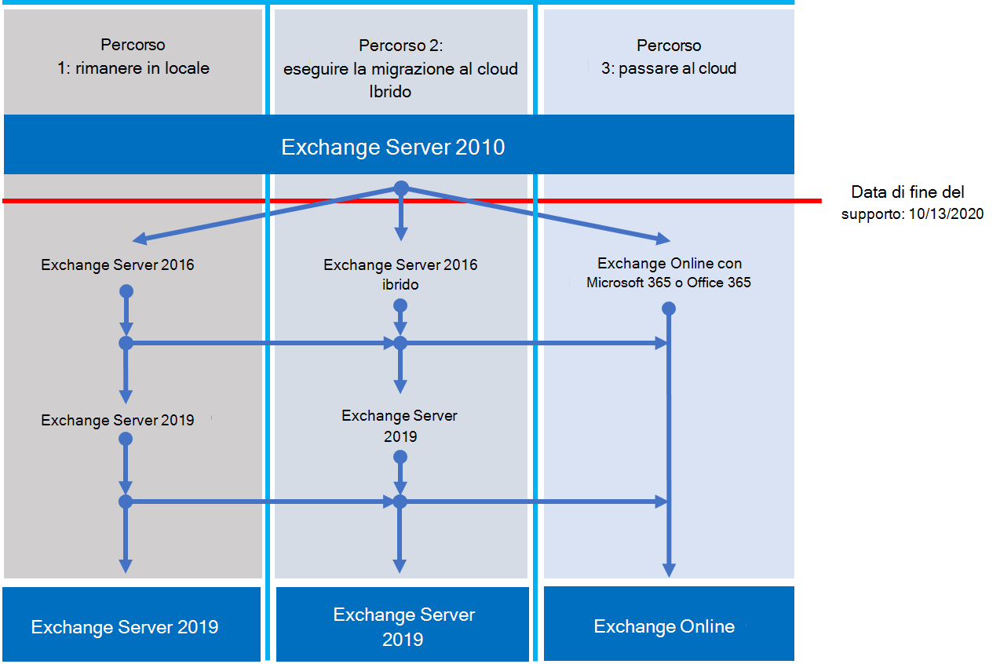

# Tabella di marcia della fine del supporto di Exchange 2010

*Questo articolo si applica sia a Microsoft 365 Enterprise che a Office 365 Enterprise*.

Exchange Server 2010 ha raggiunto la fine del supporto il **13 ottobre 2020.** Se non è ancora iniziata la migrazione da Exchange 2010 a Microsoft 365, Office 365 o Exchange 2016, è il momento di iniziare la pianificazione.

## Cosa significa *fine del supporto?*

La maggior parte dei prodotti Microsoft ha un ciclo di vita di supporto durante il quale ottengono nuove funzionalità, correzioni di bug, correzioni per la sicurezza e così via. Questo ciclo di vita in genere dura 10 anni dalla versione iniziale del prodotto. La fine di questo ciclo di vita è nota come fine del supporto del prodotto. Poiché Exchange 2010 ha raggiunto la fine del supporto il 13 ottobre 2020, Microsoft non fornisce più:

- Supporto tecnico per i problemi che possono verificarsi.
- Correzioni di bug per problemi che possono influire sulla stabilità e sull'usabilità del server.
- Correzioni per la sicurezza per vulnerabilità che possono rendere il server vulnerabile alle violazioni della sicurezza.
- Aggiornamenti del fuso orario.

L'installazione di Exchange 2010 continuerà a essere eseguita dopo questa data. Tuttavia, a causa delle modifiche elencate in precedenza, è consigliabile eseguire la migrazione da Exchange 2010 il prima possibile.

Per ulteriori informazioni sul termine del supporto, vedere Resources [to help you upgrade from Office 2010 servers and clients](upgrade-from-office-2010-servers-and-products.md).

## Quali sono le opzioni disponibili?

È il momento ideale per esplorare le opzioni e preparare un piano di migrazione. È possibile:

- Eseguire la migrazione completa a Microsoft 365. Eseguire la migrazione delle cassette postali con migrazione completa, ibrida minima o completa. Rimuovere quindi i server Exchange locali e Active Directory.
- Eseguire la migrazione dei server Exchange 2010 a Exchange 2016 nei server locali.

> [!IMPORTANT]
> Se l'organizzazione sceglie di eseguire la migrazione delle cassette postali a Microsoft 365 ma prevede di mantenere attivo DirSync o Azure AD Connect per continuare a gestire gli account utente da Active Directory locale, è necessario mantenere almeno un server Microsoft Exchange locale. Se si rimuovono tutti i server Exchange, non sarà possibile apportare modifiche ai destinatari di Exchange in Exchange Online perché l'origine dell'autorità rimane in Active Directory locale. In questa pagina è necessario apportare modifiche. In questo scenario sono disponibili le opzioni seguenti:
>
>- *Consigliato:* Se è stata eseguita la migrazione delle cassette postali a Microsoft 365 e i server sono stati aggiornati entro il 13 ottobre 2020, utilizzare Exchange 2010 per connettersi a Microsoft 365 ed eseguire la migrazione delle cassette postali. Successivamente, eseguire la migrazione di Exchange 2010 a Exchange 2016 e rimuovere eventuali server Exchange 2010 rimanenti.
>- Se la migrazione delle cassette postali e l'aggiornamento dei server locali non sono stati completati entro il 13 ottobre 2020, aggiornare prima i server Exchange 2010 locali a Exchange 2016. Utilizzare quindi Exchange 2016 per connettersi a Microsoft 365 ed eseguire la migrazione delle cassette postali.

> [!NOTE]
> È un po' più complicato, ma è anche possibile eseguire la migrazione delle cassette postali a Microsoft 365 durante la migrazione dei server Exchange 2010 locali a Exchange 2016.

Ecco i tre percorsi che puoi intraprendere per evitare la fine del supporto per Exchange Server 2010.

Nelle sezioni seguenti vengono esaminate in modo più dettagliato ogni opzione.

## Eseguire la migrazione a Microsoft 365

La migrazione della posta elettronica a Microsoft 365 è l'opzione più semplice e ottimale per ritirare la distribuzione di Exchange 2010. Con una migrazione a Microsoft 365, è possibile eseguire un singolo passaggio dalla tecnologia precedente alle funzionalità correnti, tra cui:

- Funzionalità di conformità come criteri di conservazione, In-Place e conservazione per controversia legale, eDiscovery sul posto e altro ancora.
- Microsoft Teams.
- Power BI.
- Posta in arrivo con stato attivo.
- MyAnalytics.

Anche Microsoft 365 ottiene prima di tutto nuove funzionalità ed esperienze, in modo che l'organizzazione possa iniziare subito a usarle. Inoltre, non è necessario preoccuparsi di:

- Acquisto e gestione dell'hardware.
- Pagare per il caldo e il raffreddamento dei server.
- Aggiornamento delle correzioni per la sicurezza, il prodotto e il fuso orario.
- Gestione dell'archiviazione e del software per supportare i requisiti di conformità.
- Aggiornamento a una nuova versione di Exchange. Si utilizza sempre la versione più recente di Exchange in Microsoft 365.

### Come eseguire la migrazione a Microsoft 365?

A seconda dell'organizzazione, sono disponibili alcune opzioni per accedere a Microsoft 365. Prima di tutto, è necessario considerare alcuni aspetti, ad esempio:
- Numero di postazioni o cassette postali da spostare.
- La durata della migrazione.
- Se è necessaria un'integrazione semplice tra l'installazione locale e Microsoft 365 durante la migrazione.
 
Questa tabella mostra le opzioni di migrazione e i fattori più importanti che determinano il metodo da utilizzare.

|Opzione di migrazione|Dimensioni dell'organizzazione|Durata|
|---|---|---|
|Migrazione completa|Meno di 150 postazioni|Una settimana o meno|
|Migrazione ibrida minima|Meno di 150 postazioni|Poche settimane o meno|
|Migrazione ibrida completa|Più di 150 postazioni|Poche settimane o più|

Nelle sezioni seguenti viene fornita una panoramica di questi metodi. Per ulteriori informazioni, vedere [Decidere un percorso di migrazione.](https://support.office.com/article/Decide-on-a-migration-path-0d4f2396-9cef-43b8-9bd6-306d01df1e27)

### Migrazione completa

In una migrazione completa, si esegue la migrazione di tutte le cassette postali, i gruppi di distribuzione, i contatti e così via a Office 365 in una data e un'ora impostate. Al termine, arrestare i server Exchange locali e iniziare a usare Esclusivamente Microsoft 365.

La migrazione completa è ideale per le organizzazioni di piccole dimensioni che non hanno molte cassette postali, vogliono accedere rapidamente a Microsoft 365 e non vogliono gestire la complessità degli altri metodi. Ma dovrebbe essere completato entro una settimana o meno. E richiede agli utenti di riconfigurare i propri profili di Outlook. La migrazione completa può eseguire la migrazione di un massimo di 2.000 cassette postali, ma è consigliabile utilizzarla per un massimo di 150. Se si tenta di eseguire la migrazione di più, potrebbe scadere il tempo necessario per trasferire tutte le cassette postali prima della scadenza e il personale del supporto IT potrebbe essere sovraccarico di richieste per aiutare gli utenti a riconfigurare Outlook.

Ecco alcuni aspetti da considerare sulla migrazione completa:

- Microsoft 365 dovrà connettersi ai server Exchange 2010 utilizzando Outlook via Internet sulla porta TCP 443.
- Tutte le cassette postali locali verranno spostate in Microsoft 365.
- È necessario un account amministratore locale con accesso in lettura alle cassette postali degli utenti.
- I domini accettati di Exchange 2010 che si desidera utilizzare in Microsoft 365 devono essere aggiunti come domini verificati nel servizio.
- Tra l'avvio della migrazione e la fase di completamento, Microsoft 365 sincronizza periodicamente le cassette postali di Microsoft 365 e locali. In questo modo è possibile completare la migrazione senza preoccuparsi che la posta elettronica venga lasciata nelle cassette postali locali.
- Gli utenti riceveranno nuove password temporanee per il proprio account Di Microsoft 365. Dovranno modificarli al primo accesso alle proprie cassette postali.
- You'll need a Microsoft 365 license that includes Exchange Online for each user mailbox you migrate.
- Gli utenti dovranno configurare un nuovo profilo di Outlook in ognuno dei dispositivi e scaricare di nuovo la posta elettronica. La quantità di posta elettronica che Verrà scaricata da Outlook può variare. Per ulteriori informazioni, vedere [Lavorare offline in Outlook.](https://support.microsoft.com/office/f3a1251c-6dd5-4208-aef9-7c8c9522d633)

Per ulteriori informazioni sulla migrazione completa, vedere:

- [Informazioni necessarie su una migrazione completa della posta elettronica](https://docs.microsoft.com/Exchange/mailbox-migration/what-to-know-about-a-cutover-migration)
- [Eseguire una migrazione completa della posta elettronica a Office 365](https://docs.microsoft.com/Exchange/mailbox-migration/cutover-migration-to-office-365)

### Migrazione ibrida minima

In una migrazione ibrida minima, o rapida, si spostano alcune centinaia di cassette postali in Microsoft 365 entro poche settimane. Questo metodo non supporta funzionalità avanzate di migrazione ibrida come le informazioni di calendario sulla disponibilità condivise.

La migrazione ibrida minima è ideale per le organizzazioni che devono richiedere più tempo per eseguire la migrazione delle proprie cassette postali a Microsoft 365, ma pianificano comunque di completare la migrazione entro alcune settimane. È possibile ottenere alcuni dei vantaggi della migrazione ibrida completa più *avanzata* senza gran parte della complessità. È possibile controllare il numero e le cassette postali di cui eseguire la migrazione in un determinato momento. Le cassette postali di Microsoft 365 verranno create con i nomi utente e le password degli account locali. Inoltre, a differenza delle migrazioni completate, gli utenti non devono ricreare i propri profili outlook.

Ecco alcuni aspetti da considerare sulla migrazione ibrida minima:

- È necessario eseguire una sincronizzazione della directory una sola volta tra i server Active Directory locali e Microsoft 365.
- Gli utenti potranno accedere alla propria cassetta postale di Microsoft 365 con lo stesso nome utente e la stessa password di prima della cassetta postale.
- You'll need a Microsoft 365 license that includes Exchange Online for each user mailbox that you migrate.
- Gli utenti non dovranno configurare un nuovo profilo outlook nella maggior parte dei dispositivi, anche se alcuni telefoni Android meno recenti potrebbero avere bisogno di un nuovo profilo. Gli utenti non dovranno ricaricare la posta elettronica.

Per ulteriori informazioni, vedere [Use Minimal Hybrid to quickly migrate Exchange mailboxes to Office 365.](https://docs.microsoft.com/Exchange/mailbox-migration/use-minimal-hybrid-to-quickly-migrate)

### Ibrido completo

In una migrazione ibrida completa sono presenti molte centinaia, fino a decine di migliaia, di cassette postali e alcune o tutte vengono spostate in Microsoft 365. Poiché queste migrazioni sono in genere a più lungo termine, le migrazioni ibride rendono possibile:

- Mostrare agli utenti locali le informazioni di calendario sulla disponibilità per gli utenti in Microsoft 365 e viceversa.
- Vedere un elenco indirizzi globale unificato che contiene i destinatari sia in locale che in Microsoft 365.
- Visualizzare le proprietà complete dei destinatari di Outlook per tutti gli utenti, indipendentemente dal fatto che siano in locale o in Microsoft 365.
- Proteggere le comunicazioni di posta elettronica tra i server Exchange locali e Office 365 tramite TLS e certificati.
- Considera i messaggi inviati tra i server Exchange locali e Microsoft 365 come interni, consentendo loro di:
  - Essere valutati ed elaborati correttamente dagli agenti di trasporto e di conformità per i messaggi interni.
  - Ignorare i filtri di protezione da posta indesiderata.

Le migrazioni ibride complete sono le migliori per le organizzazioni che prevedono di rimanere in una configurazione ibrida per molti mesi o più. Si ottengono le funzionalità elencate in precedenza in questa sezione, oltre alla sincronizzazione della directory, a funzionalità di conformità integrate migliori e alla possibilità di spostare le cassette postali da e verso Microsoft 365 tramite spostamenti online delle cassette postali. Microsoft 365 diventa un'estensione dell'organizzazione locale.

Aspetti da considerare sulla migrazione ibrida completa:

- Non sono adatti a tutte le organizzazioni. A causa della complessità delle migrazioni ibride complete, le organizzazioni con meno di poche centinaia di cassette postali in genere non vedono vantaggi che giustificano l'impegno e i costi. In questi casi, è consigliabile prendere in considerazione la migrazione completa o minima ibrida.
- È necessario configurare la sincronizzazione della directory con Azure Active Directory (Azure AD) Connect tra i server Active Directory locali e Microsoft 365.
- Gli utenti potranno accedere alla propria cassetta postale di Microsoft 365 con lo stesso nome utente e la stessa password utilizzati per accedere alla rete locale. Questa funzionalità richiede Azure AD Connect con la sincronizzazione delle password e/o Active Directory Federation Services.
- È necessaria una licenza di Microsoft 365 che includa Exchange Online per ogni cassetta postale utente di cui si esegue la migrazione.
- Gli utenti non devono configurare un nuovo profilo di Outlook nella maggior parte dei dispositivi, anche se alcuni telefoni Android meno recenti potrebbero avere bisogno di un nuovo profilo. Gli utenti non dovranno ricaricare la posta elettronica.

> [!IMPORTANT]
> Se l'organizzazione sceglie di eseguire la migrazione delle cassette postali a Microsoft 365 ma prevede di mantenere attivo DirSync o Azure AD Connect per continuare a gestire gli account utente da Active Directory locale, è necessario mantenere almeno un server Exchange locale. Se tutti i server Exchange vengono rimossi, non sarà possibile apportare modifiche ai destinatari di Exchange in Exchange Online. Ciò è dovuto al fatto che l'origine dell'autorità rimane in Active Directory locale e le modifiche devono essere apportate qui.

Se una migrazione ibrida completa è la soluzione più giusta, vedere le risorse utili seguenti:

- [Assistente per la distribuzione di Exchange](https://aka.ms/exdeploy)
- [Distribuzioni ibride di Exchange Server](https://docs.microsoft.com/exchange/exchange-hybrid)
- [Configurazione ibrida guidata](https://docs.microsoft.com/exchange/hybrid-configuration-wizard)
- [Domande frequenti sulla configurazione ibrida guidata](https://docs.microsoft.com/exchange/hybrid-configuration-wizard-faqs)
- [Prerequisiti per la distribuzione ibrida](https://docs.microsoft.com/exchange/hybrid-deployment-prerequisites)

## Eseguire l'aggiornamento a una versione più Exchange Server locale

Siamo fermamente dell'esperienza utente e del valore aggiunto eseguendo la migrazione completa a Microsoft 365. Tuttavia, alcune organizzazioni devono mantenere alcuni server Exchange in locale. Ciò potrebbe essere dovuto a requisiti normativi, per garantire che i dati non siano archiviati in un datacenter estraneo, perché si dispone di impostazioni o requisiti univoci che non possono essere soddisfatti nel cloud o perché è necessario che Exchange gesti le cassette postali cloud perché si utilizza ancora Active Directory in locale. In ogni caso, se Si mantiene Exchange locale, è necessario assicurarsi che l'ambiente Exchange 2010 sia aggiornato almeno a Exchange 2013 o Exchange 2016.

Per un'esperienza ottimale, si consiglia di aggiornare l'ambiente locale rimanente a Exchange 2016. Non è necessario installare Exchange Server 2013 se si vuole passare direttamente da Exchange Server 2010 a Exchange Server 2016.

Exchange 2016 include tutte le funzionalità delle versioni precedenti di Exchange. Corrisponde maggiormente all'esperienza disponibile con Microsoft 365, anche se alcune funzionalità sono disponibili solo in Microsoft 365. Scopri solo alcune delle cose che ti sono state mancanti:

|Versione di Exchange|Funzionalità|
|---|---|
|**Exchange 2013**|L'architettura semplificata riduce il numero di ruoli del server a tre (Cassette postali, Accesso client, Trasporto Edge)|
||Criteri di prevenzione della perdita di dati (DLP) che consentono di evitare perdite di informazioni riservate|
||Miglioramento dell'esperienza di Outlook Web App|
|**Exchange 2016**|*Funzionalità di Exchange 2013 e ...*|
||Ruoli del server ulteriormente semplificati solo per Cassette postali e Trasporto Edge|
||Prevenzione della perdita dei dati migliorata insieme all'integrazione con SharePoint|
||Resilienza del database migliorata|
||Collaborazione online sui documenti|

|Considerazione|Altre informazioni|
|---|---|
|Date di fine del supporto|Come Exchange 2010, ogni versione di Exchange ha una propria data di fine del supporto:  Exchange 2013 - Aprile 2023 Exchange 2016 - Ottobre 2025  Prima della data di fine del supporto, prima sarà necessario eseguire un'altra migrazione. Aprile 2023 è molto più vicino di quanto pensi.|
|Percorso di migrazione a Exchange 2013 o 2016|Il percorso di migrazione da Exchange 2010 a una versione più recente è lo stesso se si sceglie Exchange 2013 o Exchange 2016:  Installare Exchange 2013 o 2016 nell'organizzazione Exchange 2010 esistente. Spostare i servizi e altre infrastrutture in Exchange 2013 o 2016. Spostare cassette postali e cartelle pubbliche in Exchange 2013 o 2016 Rimuovere i server Exchange 2010 rimanenti.|
|Coesistenza della versione|Quando si esegue la migrazione a Exchange 2013 o Exchange 2016, è possibile installare entrambe le versioni in un'organizzazione exchange 2010 esistente. In questo modo è possibile installare uno o più server Exchange 2013 o Exchange 2016 ed eseguire la migrazione.|
|Hardware dei server|I requisiti hardware del server sono stati modificati rispetto a Exchange 2010. Verificare che l'hardware sia compatibile. Per altre informazioni sui requisiti hardware per ogni versione, vedere:  [Requisiti di sistema di Exchange 2016](https://docs.microsoft.com/Exchange/plan-and-deploy/system-requirements?view=exchserver-2016) [Requisiti di sistema di Exchange 2013](https://docs.microsoft.com/Exchange/exchange-2013-system-requirements-exchange-2013-help)  Con i miglioramenti significativi delle prestazioni di Exchange e l'aumento della potenza di elaborazione e della capacità di archiviazione nei server più recenti, è probabile che siano necessari meno server per supportare lo stesso numero di cassette postali.|
|Versione del sistema operativo|Le versioni minime supportate del sistema operativo per ogni versione sono:  Exchange 2016 - Windows Server 2012 Exchange 2013 - Windows Server 2008 R2 SP1  Ulteriori informazioni sul supporto del sistema operativo sono disponibili in [Exchange Supportability Matrix.](https://docs.microsoft.com/exchange/plan-and-deploy/supportability-matrix)|
|Livello di funzionalità della foresta di Active Directory|I livelli minimi di funzionalità della foresta di Active Directory supportati per ogni versione sono:  Exchange 2016 - Windows Server 2008 R2 SP1 Exchange 2013 - Windows Server 2003  Per ulteriori informazioni sul supporto del livello di funzionalità della foresta, vedere [Exchange Supportability Matrix.](https://docs.microsoft.com/exchange/plan-and-deploy/supportability-matrix)|
|Versioni client di Office|Le versioni client di Office supportate minime per ogni versione sono:  Exchange 2016 - Office 2010 (con gli aggiornamenti più recenti) Exchange 2013 - Office 2007 SP3  Per ulteriori informazioni sul supporto client di Office, vedere [Exchange Supportability Matrix.](https://docs.microsoft.com/exchange/plan-and-deploy/supportability-matrix)||| 

Utilizzare le risorse seguenti per facilitare la migrazione:

- [Assistente per la distribuzione di Exchange](https://aka.ms/exdeploy)
- Modifiche allo schema di Active Directory per Exchange [2016](https://docs.microsoft.com/exchange/plan-and-deploy/active-directory/ad-schema-changes?view=exchserver-2016), [2013](https://docs.microsoft.com/Exchange/exchange-2013-active-directory-schema-changes-exchange-2013-help)
- Requisiti di sistema per Exchange [2016](https://docs.microsoft.com/exchange/plan-and-deploy/system-requirements?view=exchserver-2016), [2013](https://docs.microsoft.com/Exchange/exchange-2013-system-requirements-exchange-2013-help)
- Prerequisiti per Exchange [2016](https://docs.microsoft.com/exchange/plan-and-deploy/prerequisites?view=exchserver-2016), [2013](https://docs.microsoft.com/Exchange/exchange-2013-prerequisites-exchange-2013-help)

## Riepilogo delle opzioni per i client e i server di Office 2010 e Windows 7

Per un riepilogo visivo delle opzioni di aggiornamento, migrazione e passaggio al cloud per i client e i server di Office 2010 e Windows 7, vedere il [poster relativo alla fine del supporto](../downloads/Office2010Windows7EndOfSupport.pdf).

Questo poster di una pagina illustra i diversi percorsi che è possibile adottare per rispondere ai prodotti client e server di Office 2010 e windows 7 che raggiunge la fine del supporto, con i percorsi preferiti e il supporto delle opzioni in Microsoft 365 Enterprise evidenziato.

Puoi anche [scaricare questo](https://github.com/MicrosoftDocs/microsoft-365-docs/raw/public/microsoft-365/downloads/Office2010Windows7EndOfSupport.pdf) poster e stamparlo in formato lettera, legale o tabloid (11 x 17).

## Cosa succede se serve aiuto?

Se si esegue la migrazione a Microsoft 365, potrebbe essere idoneo a usare il servizio Microsoft FastTrack. FastTrack fornisce procedure consigliate, strumenti e risorse per rendere la migrazione a Microsoft 365 il più semplice possibile. Soprattutto, un tecnico del supporto ti guida dalla pianificazione e dalla progettazione alla migrazione dell'ultima cassetta postale. Per ulteriori informazioni su FastTrack, vedere [Microsoft FastTrack.](https://fasttrack.microsoft.com/)

Se si verificano problemi durante la migrazione a Microsoft 365 e non si utilizza FastTrack o si esegue la migrazione a una versione più recente di Exchange Server, ecco alcune risorse che è possibile usare:

- [Community tecnica](https://social.technet.microsoft.com/Forums/office/home?category=exchangeserver)
- [Assistenza clienti](https://support.microsoft.com/gp/support-options-for-business)

## Articoli correlati

[Risorse utili per aggiornare i server e i client di Office 2010](upgrade-from-office-2010-servers-and-products.md)
