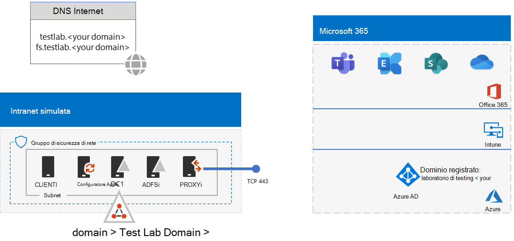
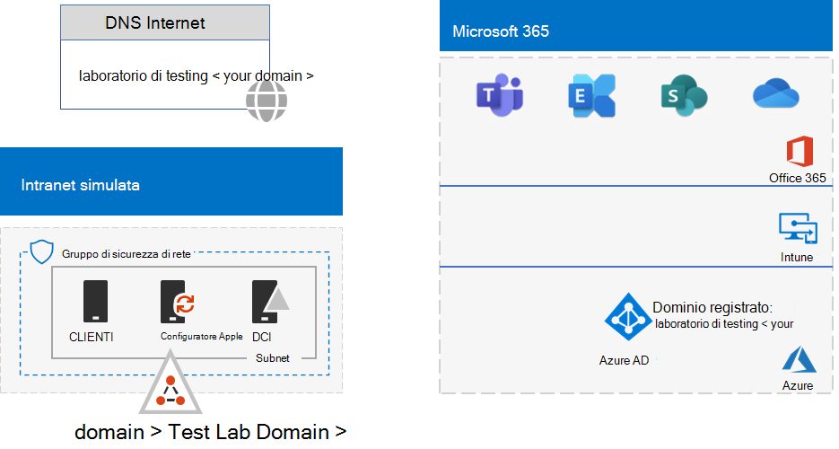
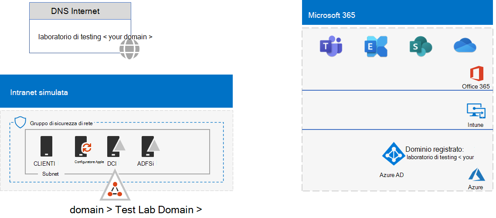

# <a name="federated-identity-for-your-microsoft-365-test-environment"></a><span data-ttu-id="67365-103">Identità federata per l'ambiente di testing di Microsoft 365</span><span class="sxs-lookup"><span data-stu-id="67365-103">Federated identity for your Microsoft 365 test environment</span></span>

<span data-ttu-id="67365-104">*Questa guida al laboratorio di testing può essere usata sia per gli ambienti Microsoft 365 aziendali che per Office 365 Enterprise test.*</span><span class="sxs-lookup"><span data-stu-id="67365-104">*This Test Lab Guide can be used for both Microsoft 365 for enterprise and Office 365 Enterprise test environments.*</span></span>

<span data-ttu-id="67365-p101">Microsoft 365 supporta l'identità federativa. Questo indica che invece di eseguire la convalida delle credenziali autonomamente, Microsoft 365 fa riferimento all'utente connesso a un server di autenticazione federata che Microsoft 365 considera attendibile. Se le credenziali dell'utente sono corrette, il server di autenticazione federata emette un token di sicurezza che il client invia quindi a Microsoft 365 come prova di autenticazione. L'identità federativa consente l'offload e la scalabilità in verticale di autenticazione per una sottoscrizione a Microsoft 365 e scenari di sicurezza e autenticazione avanzata.</span><span class="sxs-lookup"><span data-stu-id="67365-p101">Microsoft 365 supports federated identity. This means that instead of performing the validation of credentials itself, Microsoft 365 refers the connecting user to a federated authentication server that Microsoft 365 trusts. If the user's credentials are correct, the federated authentication server issues a security token that the client then sends to Microsoft 365 as proof of authentication. Federated identity allows for the offloading and scaling up of authentication for a Microsoft 365 subscription and advanced authentication and security scenarios.</span></span>
  
<span data-ttu-id="67365-109">In questo articolo viene descritto come configurare l'autenticazione federata per l'Microsoft 365 di test, con conseguente risultato:</span><span class="sxs-lookup"><span data-stu-id="67365-109">This article describes how to configure federated authentication for your Microsoft 365 test environment, resulting in the following:</span></span>


  
<span data-ttu-id="67365-111">Questa configurazione è costituita da:</span><span class="sxs-lookup"><span data-stu-id="67365-111">This configuration consists of:</span></span>
  
- <span data-ttu-id="67365-112">Una Microsoft 365 E5 di valutazione o di produzione.</span><span class="sxs-lookup"><span data-stu-id="67365-112">A Microsoft 365 E5 trial or production subscription.</span></span>
    
- <span data-ttu-id="67365-113">Intranet dell'organizzazione semplificata connessa a Internet, costituita da cinque macchine virtuali in una subnet di una rete virtuale di Azure (DC1, APP1, CLIENT1, ADFS1 e PROXY1).</span><span class="sxs-lookup"><span data-stu-id="67365-113">A simplified organization intranet connected to the internet, consisting of five virtual machines on a subnet of an Azure virtual network (DC1, APP1, CLIENT1, ADFS1, and PROXY1).</span></span> <span data-ttu-id="67365-114">Azure AD Connessione viene eseguito su APP1 per sincronizzare l'elenco di account nel dominio di Servizi di dominio Active Directory con Microsoft 365.</span><span class="sxs-lookup"><span data-stu-id="67365-114">Azure AD Connect runs on APP1 to synchronize the list of accounts in the Active Directory Domain Services domain to Microsoft 365.</span></span> <span data-ttu-id="67365-115">PROXY1 riceve le richieste di autenticazione in arrivo.</span><span class="sxs-lookup"><span data-stu-id="67365-115">PROXY1 receives the incoming authentication requests.</span></span> <span data-ttu-id="67365-116">ADFS1 convalida le credenziali con DC1 e rilascia token di sicurezza.</span><span class="sxs-lookup"><span data-stu-id="67365-116">ADFS1 validates credentials with DC1 and issues security tokens.</span></span>
    
<span data-ttu-id="67365-117">La configurazione di questo ambiente di testing prevede cinque fasi:</span><span class="sxs-lookup"><span data-stu-id="67365-117">Setting up this test environment involves five phases:</span></span>
- [<span data-ttu-id="67365-118">Fase 1: configurare la sincronizzazione hash delle password per l'ambiente di testing di Microsoft 365</span><span class="sxs-lookup"><span data-stu-id="67365-118">Phase 1: Configure password hash synchronization for your Microsoft 365 test environment</span></span>](#phase-1-configure-password-hash-synchronization-for-your-microsoft-365-test-environment)
- [<span data-ttu-id="67365-119">Fase 2: creare il server AD FS</span><span class="sxs-lookup"><span data-stu-id="67365-119">Phase 2: Create the AD FS server</span></span>](#phase-2-create-the-ad-fs-server)
- [<span data-ttu-id="67365-120">Fase 3: Creare il server proxy Web</span><span class="sxs-lookup"><span data-stu-id="67365-120">Phase 3: Create the web proxy server</span></span>](#phase-3-create-the-web-proxy-server)
- [<span data-ttu-id="67365-121">Fase 4: Creare un certificato autofirmato e configurare ADFS1 e PROXY1</span><span class="sxs-lookup"><span data-stu-id="67365-121">Phase 4: Create a self-signed certificate and configure ADFS1 and PROXY1</span></span>](#phase-4-create-a-self-signed-certificate-and-configure-adfs1-and-proxy1)
- [<span data-ttu-id="67365-122">Fase 5: Configurare Microsoft 365 per l'identità federativa</span><span class="sxs-lookup"><span data-stu-id="67365-122">Phase 5: Configure Microsoft 365 for federated identity</span></span>](#phase-5-configure-microsoft-365-for-federated-identity)
    
> [!NOTE]
> <span data-ttu-id="67365-123">Non è possibile configurare questo ambiente di testing con una sottoscrizione di valutazione di Azure.</span><span class="sxs-lookup"><span data-stu-id="67365-123">You can't configure this test environment with an Azure Trial subscription.</span></span>
  
## <a name="phase-1-configure-password-hash-synchronization-for-your-microsoft-365-test-environment"></a><span data-ttu-id="67365-124">Fase 1: configurare la sincronizzazione hash delle password per l'ambiente di testing di Microsoft 365</span><span class="sxs-lookup"><span data-stu-id="67365-124">Phase 1: Configure password hash synchronization for your Microsoft 365 test environment</span></span>

<span data-ttu-id="67365-125">Seguire le istruzioni in [Sincronizzazione hash password per Microsoft 365](password-hash-sync-m365-ent-test-environment.md).</span><span class="sxs-lookup"><span data-stu-id="67365-125">Follow the instructions in [password hash synchronization for Microsoft 365](password-hash-sync-m365-ent-test-environment.md).</span></span> <span data-ttu-id="67365-126">La configurazione risultante è simile alla seguente:</span><span class="sxs-lookup"><span data-stu-id="67365-126">Your resulting configuration looks like this:</span></span>
  

  
<span data-ttu-id="67365-128">Questa configurazione è costituita da:</span><span class="sxs-lookup"><span data-stu-id="67365-128">This configuration consists of:</span></span>
  
- <span data-ttu-id="67365-129">Una Microsoft 365 E5 di valutazione o a pagamento.</span><span class="sxs-lookup"><span data-stu-id="67365-129">A Microsoft 365 E5 trial or paid subscriptions.</span></span>
- <span data-ttu-id="67365-130">Intranet dell'organizzazione semplificata connessa a Internet, costituita da macchine virtuali DC1, APP1 e CLIENT1 in una subnet di una rete virtuale di Azure.</span><span class="sxs-lookup"><span data-stu-id="67365-130">A simplified organization intranet connected to the internet, consisting of the DC1, APP1, and CLIENT1 virtual machines on a subnet of an Azure virtual network.</span></span> <span data-ttu-id="67365-131">Azure AD Connessione viene eseguito su APP1 per sincronizzare periodicamente il dominio TESTLAB Di Servizi di dominio Active Directory con il tenant di Azure AD delle sottoscrizioni Microsoft 365 testlab.</span><span class="sxs-lookup"><span data-stu-id="67365-131">Azure AD Connect runs on APP1 to synchronize the TESTLAB Active Directory Domain Services (AD DS) domain to the Azure AD tenant of your Microsoft 365 subscriptions periodically.</span></span>

## <a name="phase-2-create-the-ad-fs-server"></a><span data-ttu-id="67365-132">Fase 2: creare il server AD FS</span><span class="sxs-lookup"><span data-stu-id="67365-132">Phase 2: Create the AD FS server</span></span>

<span data-ttu-id="67365-133">Un server AD FS fornisce l'autenticazione federata tra Microsoft 365 e gli account nel dominio corp.contoso.com ospitato su DC1.</span><span class="sxs-lookup"><span data-stu-id="67365-133">An AD FS server provides federated authentication between Microsoft 365 and the accounts in the corp.contoso.com domain hosted on DC1.</span></span>
  
<span data-ttu-id="67365-134">Per creare una macchina virtuale Azure per ADFS1, inserire il nome della sottoscrizione, il gruppo di risorse e la posizione di Azure per la configurazione di base, quindi eseguire questi comandi al prompt dei comandi di Azure PowerShell nel computer locale.</span><span class="sxs-lookup"><span data-stu-id="67365-134">To create an Azure virtual machine for ADFS1, fill in the name of your subscription and the resource group and Azure location for your Base Configuration, and then run these commands at the Azure PowerShell command prompt on your local computer.</span></span>
  
```powershell
$subscrName="<your Azure subscription name>"
$rgName="<the resource group name of your Base Configuration>"
$vnetName="TlgBaseConfig-01-VNET"
# NOTE: If you built your simulated intranet with Azure PowerShell, comment the previous line with a "#" and remove the "#" from the next line.
#$vnetName="TestLab"
Connect-AzAccount
Select-AzSubscription -SubscriptionName $subscrName
$staticIP="10.0.0.100"
$locName=(Get-AzResourceGroup -Name $rgName).Location
$vnet=Get-AzVirtualNetwork -Name $vnetName -ResourceGroupName $rgName
$pip = New-AzPublicIpAddress -Name ADFS1-PIP -ResourceGroupName $rgName -Location $locName -AllocationMethod Dynamic
$nic = New-AzNetworkInterface -Name ADFS1-NIC -ResourceGroupName $rgName -Location $locName -SubnetId $vnet.Subnets[0].Id -PublicIpAddressId $pip.Id -PrivateIpAddress $staticIP
$vm=New-AzVMConfig -VMName ADFS1 -VMSize Standard_D2_v2
$cred=Get-Credential -Message "Type the name and password of the local administrator account for ADFS1."
$vm=Set-AzVMOperatingSystem -VM $vm -Windows -ComputerName ADFS1 -Credential $cred -ProvisionVMAgent -EnableAutoUpdate
$vm=Set-AzVMSourceImage -VM $vm -PublisherName MicrosoftWindowsServer -Offer WindowsServer -Skus 2016-Datacenter -Version "latest"
$vm=Add-AzVMNetworkInterface -VM $vm -Id $nic.Id
$vm=Set-AzVMOSDisk -VM $vm -Name "ADFS-OS" -DiskSizeInGB 128 -CreateOption FromImage -StorageAccountType "Standard_LRS"
New-AzVM -ResourceGroupName $rgName -Location $locName -VM $vm
```

<span data-ttu-id="67365-135">Successivamente, utilizzare il [portale di Azure](https://portal.azure.com) per connettersi alla macchina virtuale ADFS1 usando il nome e la password dell'account Administrator locale di ADFS1, quindi aprire un prompt dei comandi di Windows PowerShell.</span><span class="sxs-lookup"><span data-stu-id="67365-135">Next, use the [Azure portal](https://portal.azure.com) to connect to the ADFS1 virtual machine using the ADFS1 local administrator account name and password, and then open a Windows PowerShell command prompt.</span></span>
  
<span data-ttu-id="67365-136">Per controllare la risoluzione del nome e la comunicazione della rete tra ADFS1 e DC1, eseguire il comando **ping dc1.corp.contoso.com** e verificare che siano presenti quattro risposte.</span><span class="sxs-lookup"><span data-stu-id="67365-136">To check name resolution and network communication between ADFS1 and DC1, run the **ping dc1.corp.contoso.com** command and check that there are four replies.</span></span>
  
<span data-ttu-id="67365-137">Unire quindi la macchina virtuale ADFS1 al dominio CORP immettendo questi comandi nel prompt dei comandi di Windows PowerShell in ADFS1.</span><span class="sxs-lookup"><span data-stu-id="67365-137">Next, join the ADFS1 virtual machine to the CORP domain with these commands at the Windows PowerShell prompt on ADFS1.</span></span>
  
```powershell
$cred=Get-Credential -UserName "CORP\User1" -Message "Type the User1 account password."
Add-Computer -DomainName corp.contoso.com -Credential $cred
Restart-Computer
```

<span data-ttu-id="67365-138">La configurazione risultante è simile alla seguente:</span><span class="sxs-lookup"><span data-stu-id="67365-138">Your resulting configuration looks like this:</span></span>
  

  
## <a name="phase-3-create-the-web-proxy-server"></a><span data-ttu-id="67365-140">Fase 3: Creare il server proxy Web</span><span class="sxs-lookup"><span data-stu-id="67365-140">Phase 3: Create the web proxy server</span></span>

<span data-ttu-id="67365-141">PROXY1 consente l'inoltro dei messaggi di autenticazione tra gli utenti e ADFS1.</span><span class="sxs-lookup"><span data-stu-id="67365-141">PROXY1 provides proxying of authentication messages between users trying to authenticate and ADFS1.</span></span>
  
<span data-ttu-id="67365-142">Per creare una macchina virtuale Azure per PROXY1, inserire il nome del gruppo di risorse e la posizione di Azure, quindi eseguire questi comandi al prompt dei comandi di Azure PowerShell nel computer locale.</span><span class="sxs-lookup"><span data-stu-id="67365-142">To create an Azure virtual machine for PROXY1, fill in the name of your resource group and Azure location, and then run these commands at the Azure PowerShell command prompt on your local computer.</span></span>
  
```powershell
$rgName="<the resource group name of your Base Configuration>"
$vnetName="TlgBaseConfig-01-VNET"
# NOTE: If you built your simulated intranet with Azure PowerShell, comment the previous line with a "#" and remove the "#" from the next line.
#$vnetName="TestLab"
$staticIP="10.0.0.101"
$locName=(Get-AzResourceGroup -Name $rgName).Location
$vnet=Get-AzVirtualNetwork -Name $vnetName -ResourceGroupName $rgName
$pip = New-AzPublicIpAddress -Name PROXY1-PIP -ResourceGroupName $rgName -Location $locName -AllocationMethod Static
$nic = New-AzNetworkInterface -Name PROXY1-NIC -ResourceGroupName $rgName -Location $locName -SubnetId $vnet.Subnets[0].Id -PublicIpAddressId $pip.Id -PrivateIpAddress $staticIP
$vm=New-AzVMConfig -VMName PROXY1 -VMSize Standard_D2_v2
$cred=Get-Credential -Message "Type the name and password of the local administrator account for PROXY1."
$vm=Set-AzVMOperatingSystem -VM $vm -Windows -ComputerName PROXY1 -Credential $cred -ProvisionVMAgent -EnableAutoUpdate
$vm=Set-AzVMSourceImage -VM $vm -PublisherName MicrosoftWindowsServer -Offer WindowsServer -Skus 2016-Datacenter -Version "latest"
$vm=Add-AzVMNetworkInterface -VM $vm -Id $nic.Id
$vm=Set-AzVMOSDisk -VM $vm -Name "PROXY1-OS" -DiskSizeInGB 128 -CreateOption FromImage -StorageAccountType "Standard_LRS"
New-AzVM -ResourceGroupName $rgName -Location $locName -VM $vm
```

> [!NOTE]
> <span data-ttu-id="67365-143">A PROXY1 viene assegnato un indirizzo IP pubblico statico perché verrà creato un record DNS pubblico che punta a esso e non deve essere modificato quando si riavvia la macchina virtuale PROXY1.</span><span class="sxs-lookup"><span data-stu-id="67365-143">PROXY1 is assigned a static public IP address because you will create a public DNS record that points to it and it must not change when you restart the PROXY1 virtual machine.</span></span>
  
<span data-ttu-id="67365-144">Successivamente, aggiungere una regola al gruppo di sicurezza di rete per la subnet CorpNet per consentire il traffico in ingresso non richiesto da Internet all'indirizzo IP privato di PROXY1 e alla porta TCP 443.</span><span class="sxs-lookup"><span data-stu-id="67365-144">Next, add a rule to the network security group for the CorpNet subnet to allow unsolicited inbound traffic from the internet to PROXY1's private IP address and TCP port 443.</span></span> <span data-ttu-id="67365-145">Eseguire questi comandi al prompt dei comandi di Azure PowerShell nel computer locale.</span><span class="sxs-lookup"><span data-stu-id="67365-145">Run these commands at the Azure PowerShell command prompt on your local computer.</span></span>
  
```powershell
$rgName="<the resource group name of your Base Configuration>"
Get-AzNetworkSecurityGroup -Name CorpNet -ResourceGroupName $rgName | Add-AzNetworkSecurityRuleConfig -Name "HTTPS-to-PROXY1" -Description "Allow TCP 443 to PROXY1" -Access "Allow" -Protocol "Tcp" -Direction "Inbound" -Priority 101 -SourceAddressPrefix "Internet" -SourcePortRange "*" -DestinationAddressPrefix "10.0.0.101" -DestinationPortRange "443" | Set-AzNetworkSecurityGroup
```

<span data-ttu-id="67365-146">Successivamente, utilizzare il [portale di Azure](https://portal.azure.com) per connettersi alla macchina virtuale PROXY1 usando il nome e la password dell'account Administrator locale di PROXY1, quindi aprire un prompt dei comandi di Windows PowerShell in PROXY1.</span><span class="sxs-lookup"><span data-stu-id="67365-146">Next, use the [Azure portal](https://portal.azure.com) to connect to the PROXY1 virtual machine using the PROXY1 local administrator account name and password, and then open a Windows PowerShell command prompt on PROXY1.</span></span>
  
<span data-ttu-id="67365-147">Per controllare la risoluzione del nome e la comunicazione della rete tra PROXY1 e DC1, eseguire il comando **ping dc1.corp.contoso.com** e verificare che siano presenti quattro risposte.</span><span class="sxs-lookup"><span data-stu-id="67365-147">To check name resolution and network communication between PROXY1 and DC1, run the **ping dc1.corp.contoso.com** command and check that there are four replies.</span></span>
  
<span data-ttu-id="67365-148">Unire quindi la macchina virtuale PROXY1 al dominio CORP immettendo questi comandi nel prompt dei comandi di Windows PowerShell in PROXY1.</span><span class="sxs-lookup"><span data-stu-id="67365-148">Next, join the PROXY1 virtual machine to the CORP domain with these commands at the Windows PowerShell prompt on PROXY1.</span></span>
  
```powershell
$cred=Get-Credential -UserName "CORP\User1" -Message "Type the User1 account password."
Add-Computer -DomainName corp.contoso.com -Credential $cred
Restart-Computer
```

<span data-ttu-id="67365-149">Visualizza l'indirizzo IP pubblico di PROXY1 con questi comandi Azure PowerShell sul computer locale.</span><span class="sxs-lookup"><span data-stu-id="67365-149">Display the public IP address of PROXY1 with these Azure PowerShell commands on your local computer.</span></span>
  
```powershell
Write-Host (Get-AzPublicIpaddress -Name "PROXY1-PIP" -ResourceGroup $rgName).IPAddress
```

<span data-ttu-id="67365-p106">Successivamente, collaborare con il proprio provider DNS pubblico e creare un nuovo record DNS A pubblico per **fs.testlab.**\<*your DNS domain name*> che consenta di risolvere l’indirizzo IP visualizzato dal comando **Write-Host**. Il **fs.testlab.**\<*your DNS domain name*> verrà di seguito indicato come *nome di dominio completo del servizio federativo*.</span><span class="sxs-lookup"><span data-stu-id="67365-p106">Next, work with your public DNS provider and create a new public DNS A record for **fs.testlab.**\<*your DNS domain name*> that resolves to the IP address displayed by the **Write-Host** command. The **fs.testlab.**\<*your DNS domain name*> is hereafter referred to as the  *federation service FQDN*.</span></span>
  
<span data-ttu-id="67365-154">Successivamente, utilizzare il [portale di Azure](https://portal.azure.com) per connettersi alla macchina virtuale DC1 usando le credenziali di CORP\\User1, quindi eseguire i comandi seguenti a un prompt dei comandi di Windows PowerShell a livello di amministratore:</span><span class="sxs-lookup"><span data-stu-id="67365-154">Next, use the [Azure portal](https://portal.azure.com) to connect to the DC1 virtual machine using the CORP\\User1 credentials, and then run the following commands at an administrator-level Windows PowerShell command prompt:</span></span>
  
```powershell
Add-DnsServerPrimaryZone -Name corp.contoso.com -ZoneFile corp.contoso.com.dns
Add-DnsServerResourceRecordA -Name "fs" -ZoneName corp.contoso.com -AllowUpdateAny -IPv4Address "10.0.0.100" -TimeToLive 01:00:00
```
<span data-ttu-id="67365-155">Questi comandi creano un record DNS A interno in modo che le macchine virtuali nella rete virtuale di Azure possano risolvere l'FQDN del servizio federativo interno nell'indirizzo IP privato di ADFS1.</span><span class="sxs-lookup"><span data-stu-id="67365-155">These commands create an internal DNS A record so that virtual machines on the Azure virtual network can resolve the internal federation service FQDN to ADFS1's private IP address.</span></span>
  
<span data-ttu-id="67365-156">La configurazione risultante è simile alla seguente:</span><span class="sxs-lookup"><span data-stu-id="67365-156">Your resulting configuration looks like this:</span></span>
  

  
## <a name="phase-4-create-a-self-signed-certificate-and-configure-adfs1-and-proxy1"></a><span data-ttu-id="67365-158">Fase 4: Creare un certificato autofirmato e configurare ADFS1 e PROXY1</span><span class="sxs-lookup"><span data-stu-id="67365-158">Phase 4: Create a self-signed certificate and configure ADFS1 and PROXY1</span></span>

<span data-ttu-id="67365-159">In questa fase, viene creato un certificato digitale autofirmato per il nome di dominio completo del servizio federativo e vengono configurati ADFS1 e PROXY1 come farm AD FS.</span><span class="sxs-lookup"><span data-stu-id="67365-159">In this phase, you create a self-signed digital certificate for your federation service FQDN and configure ADFS1 and PROXY1 as an AD FS farm.</span></span>
  
<span data-ttu-id="67365-160">Per prima cosa, utilizzare il [portale di Azure](https://portal.azure.com) per connettersi alla macchina virtuale DC1 usando le credenziali di CORP\\CORPUser1, quindi aprire un prompt dei comandi di Windows PowerShell a livello di amministratore. </span><span class="sxs-lookup"><span data-stu-id="67365-160">First, use the [Azure portal](https://portal.azure.com) to connect to the DC1 virtual machine using the CORP\\User1 credentials, and then open an administrator-level Windows PowerShell command prompt.</span></span>
  
<span data-ttu-id="67365-161">Successivamente, creare un account del servizio AD FS con questo comando al prompt dei Windows PowerShell su DC1:</span><span class="sxs-lookup"><span data-stu-id="67365-161">Next, create an AD FS service account with this command at the Windows PowerShell command prompt on DC1:</span></span>
  
```powershell
New-ADUser -SamAccountName ADFS-Service -AccountPassword (read-host "Set user password" -assecurestring) -name "ADFS-Service" -enabled $true -PasswordNeverExpires $true -ChangePasswordAtLogon $false
```
<span data-ttu-id="67365-162">Tenere presente che questo comando chiede di specificare la password dell'account.</span><span class="sxs-lookup"><span data-stu-id="67365-162">Note that this command prompts you to supply the account password.</span></span> <span data-ttu-id="67365-163">Scegliere una password complessa e annotarla in una posizione sicura.</span><span class="sxs-lookup"><span data-stu-id="67365-163">Choose a strong password and record it in a secured location.</span></span> <span data-ttu-id="67365-164">Sarà necessario per questa fase e per la fase 5.</span><span class="sxs-lookup"><span data-stu-id="67365-164">You will need it for this phase and for Phase 5.</span></span>
  
<span data-ttu-id="67365-p108">Utilizzare il [portale di Azure](https://portal.azure.com) per connettersi alla macchina virtuale ADFS1 utilizzando le credenziali di CORP\\CORPUser1. Aprire un prompt dei comandi di Windows PowerShell a livello di amministratore su ADFS1, immettere il nome di dominio completo del servizio federativo e quindi eseguire questi comandi per creare un certificato autofirmato:</span><span class="sxs-lookup"><span data-stu-id="67365-p108">Use the [Azure portal](https://portal.azure.com) to connect to the ADFS1 virtual machine using the CORP\\User1 credentials. Open an administrator-level Windows PowerShell command prompt on ADFS1, fill in your federation service FQDN, and then run these commands to create a self-signed certificate:</span></span>
  
```powershell
$fedServiceFQDN="<federation service FQDN>"
New-SelfSignedCertificate -DnsName $fedServiceFQDN -CertStoreLocation "cert:\LocalMachine\My"
New-Item -path c:\Certs -type directory
New-SmbShare -name Certs -path c:\Certs -changeaccess CORP\User1
```

<span data-ttu-id="67365-167">Successivamente, seguire questi passaggi per salvare il nuovo certificato autofirmato come file.</span><span class="sxs-lookup"><span data-stu-id="67365-167">Next, use these steps to save the new self-signed certificate as a file.</span></span>
  
1. <span data-ttu-id="67365-168">Selezionare **Start,** immettere **mmc.exe** e quindi premere **INVIO.**</span><span class="sxs-lookup"><span data-stu-id="67365-168">Select **Start**, enter **mmc.exe**, and then press **Enter**.</span></span>
    
2. <span data-ttu-id="67365-169">Selezionare **File**  >  **Add/Remove Ancoraggio-in**.</span><span class="sxs-lookup"><span data-stu-id="67365-169">Select **File** > **Add/Remove Snap-in**.</span></span>
    
3. <span data-ttu-id="67365-170">In **Add or Remove Ancoraggio-ins** fare doppio clic su **Certificates** nell'elenco degli snap-in disponibili, selezionare **Computer account** e quindi **Next**.</span><span class="sxs-lookup"><span data-stu-id="67365-170">In **Add or Remove Snap-ins**, double-click **Certificates** in the list of available snap-ins, select **Computer account**, and then select **Next**.</span></span>
    
4. <span data-ttu-id="67365-171">In **Seleziona computer** selezionare **Fine** e quindi fare clic su **OK.**</span><span class="sxs-lookup"><span data-stu-id="67365-171">In **Select Computer**, select **Finish**, and then select **OK**.</span></span>
    
5. <span data-ttu-id="67365-172">Nel riquadro dell'albero, aprire **Certificati (computer locali) > Personale > Certificati**.</span><span class="sxs-lookup"><span data-stu-id="67365-172">In the tree pane, open **Certificates (Local Computer) > Personal > Certificates**.</span></span>
    
6. <span data-ttu-id="67365-173">Selezionare e tenere premuto (o fare clic con il pulsante destro del mouse) sul certificato con il nome di dominio completo del servizio federativo, selezionare **Tutte le** attività e quindi **selezionare Esporta**.</span><span class="sxs-lookup"><span data-stu-id="67365-173">Select and hold (or right-click) the certificate with your federation service FQDN, select **All tasks**, and then select **Export**.</span></span>
    
7. <span data-ttu-id="67365-174">Nella pagina **iniziale** selezionare **Avanti**.</span><span class="sxs-lookup"><span data-stu-id="67365-174">On the **Welcome** page, select **Next**.</span></span>
    
8. <span data-ttu-id="67365-175">Nella pagina **Esporta chiave privata** selezionare **Sì** e quindi **Avanti.**</span><span class="sxs-lookup"><span data-stu-id="67365-175">On the **Export Private Key** page, select **Yes**, and then select **Next**.</span></span>
    
9. <span data-ttu-id="67365-176">Nella pagina **Formato file di esportazione** selezionare Esporta tutte le proprietà **estese** e quindi fare clic su **Avanti.**</span><span class="sxs-lookup"><span data-stu-id="67365-176">On the **Export File Format** page, select **Export all extended properties**, and then select **Next**.</span></span>
    
10. <span data-ttu-id="67365-177">Nella pagina **Sicurezza** selezionare **Password** e immettere una password in **Password** e **Conferma password.**</span><span class="sxs-lookup"><span data-stu-id="67365-177">On the **Security** page, select **Password** and enter a password in **Password** and **Confirm password.**</span></span>
    
11. <span data-ttu-id="67365-178">Nella pagina **File da esportare** selezionare **Sfoglia**.</span><span class="sxs-lookup"><span data-stu-id="67365-178">On the **File to Export** page, select **Browse**.</span></span>
    
12. <span data-ttu-id="67365-179">Passare alla **cartella C: \\ Certs,** immettere **SSL** in **Nome file** e quindi selezionare **Salva.**</span><span class="sxs-lookup"><span data-stu-id="67365-179">Browse to the **C:\\Certs** folder, enter **SSL** in **File name**, and then select **Save.**</span></span>
    
13. <span data-ttu-id="67365-180">Nella pagina **File da esportare** selezionare **Avanti.**</span><span class="sxs-lookup"><span data-stu-id="67365-180">On the **File to Export** page, select **Next**.</span></span>
    
14. <span data-ttu-id="67365-181">Nella pagina **Completamento esportazione guidata certificati** selezionare **Fine.**</span><span class="sxs-lookup"><span data-stu-id="67365-181">On the **Completing the Certificate Export Wizard** page, select **Finish**.</span></span> <span data-ttu-id="67365-182">Quando richiesto, selezionare **OK**.</span><span class="sxs-lookup"><span data-stu-id="67365-182">When prompted, select **OK**.</span></span>
    
<span data-ttu-id="67365-183">Successivamente, installare il servizio AD FS con questo comando al prompt dei comandi di Windows PowerShell in ADFS1:</span><span class="sxs-lookup"><span data-stu-id="67365-183">Next, install the AD FS service with this command at the Windows PowerShell command prompt on ADFS1:</span></span>
  
```powershell
Install-WindowsFeature ADFS-Federation -IncludeManagementTools
```

<span data-ttu-id="67365-184">Attendere che venga stabilita la connessione.</span><span class="sxs-lookup"><span data-stu-id="67365-184">Wait for the installation to complete.</span></span>
  
<span data-ttu-id="67365-185">Successivamente, configurare il servizio AD FS seguendo questi passaggi:</span><span class="sxs-lookup"><span data-stu-id="67365-185">Next, configure the AD FS service with these steps:</span></span>
  
1. <span data-ttu-id="67365-186">Selezionare **Start** e quindi selezionare l'icona **Server Manager.**</span><span class="sxs-lookup"><span data-stu-id="67365-186">Select **Start**, and then select the **Server Manager** icon.</span></span>
    
2. <span data-ttu-id="67365-187">Nel riquadro dell'albero di Server Manager selezionare **ADFS.**</span><span class="sxs-lookup"><span data-stu-id="67365-187">In the tree pane of Server Manager, select **AD FS**.</span></span>
    
3. <span data-ttu-id="67365-188">Nella barra degli strumenti nella parte superiore selezionare il simbolo di attenzione arancione e quindi **selezionare Configura il servizio federativo nel server.**</span><span class="sxs-lookup"><span data-stu-id="67365-188">In the tool bar at the top, select the orange caution symbol, and then select **Configure the federation service on this server**.</span></span>
    
4. <span data-ttu-id="67365-189">Nella pagina **iniziale** della Configurazione guidata Active Directory Federation Services selezionare **Avanti.**</span><span class="sxs-lookup"><span data-stu-id="67365-189">On the **Welcome** page of the Active Directory Federation Services Configuration Wizard, select **Next**.</span></span>
    
5. <span data-ttu-id="67365-190">Nella pagina **Connessione a Servizi di** dominio Active Directory selezionare **Avanti.**</span><span class="sxs-lookup"><span data-stu-id="67365-190">On the **Connect to AD DS** page, select **Next**.</span></span>
    
6. <span data-ttu-id="67365-191">Nella pagina **Impostazione proprietà del servizio**:</span><span class="sxs-lookup"><span data-stu-id="67365-191">On the **Specify Service Properties** page:</span></span>
    
  - <span data-ttu-id="67365-192">Per **Certificato SSL,** selezionare la freccia in giù e quindi selezionare il certificato con il nome di dominio completo del servizio federativo.</span><span class="sxs-lookup"><span data-stu-id="67365-192">For **SSL Certificate**, select the down arrow, and then select the certificate with the name of your federation service FQDN.</span></span>
    
  - <span data-ttu-id="67365-193">In **Nome visualizzato servizio federativo** immettere il nome dell'organizzazione fittizia.</span><span class="sxs-lookup"><span data-stu-id="67365-193">In **Federation Service Display Name**, enter the name of your fictional organization.</span></span>
    
  - <span data-ttu-id="67365-194">Selezionare **Avanti**.</span><span class="sxs-lookup"><span data-stu-id="67365-194">Select **Next**.</span></span>
    
7. <span data-ttu-id="67365-195">Nella pagina **Specifica account di servizio** selezionare Seleziona **per** **Nome account**.</span><span class="sxs-lookup"><span data-stu-id="67365-195">On the **Specify Service Account** page, select **Select** for **Account name**.</span></span>
    
8. <span data-ttu-id="67365-196">In **Seleziona account utente o servizio** immettere **ADFS-Service,** selezionare Controlla **nomi** e quindi fare clic su **OK.**</span><span class="sxs-lookup"><span data-stu-id="67365-196">In **Select User or Service Account**, enter **ADFS-Service**, select **Check Names**, and then select **OK**.</span></span>
    
9. <span data-ttu-id="67365-197">In **Password account** immettere la password per l'account ADFS-Service e quindi selezionare **Avanti**.</span><span class="sxs-lookup"><span data-stu-id="67365-197">In **Account Password**, enter the password for the ADFS-Service account, and then select **Next**.</span></span>
    
10. <span data-ttu-id="67365-198">Nella pagina **Specifica database di** configurazione selezionare **Avanti.**</span><span class="sxs-lookup"><span data-stu-id="67365-198">On the **Specify Configuration Database** page, select **Next**.</span></span>
    
11. <span data-ttu-id="67365-199">Nella pagina **Opzioni revisione** selezionare **Avanti.**</span><span class="sxs-lookup"><span data-stu-id="67365-199">On the **Review Options** page, select **Next**.</span></span>
    
12. <span data-ttu-id="67365-200">Nella pagina **Controlli prerequisiti** selezionare **Configura**.</span><span class="sxs-lookup"><span data-stu-id="67365-200">On the **Pre-requisite Checks** page, select **Configure**.</span></span>

13. <span data-ttu-id="67365-201">Nella pagina **Risultati** selezionare **Chiudi**.</span><span class="sxs-lookup"><span data-stu-id="67365-201">On the **Results** page, select **Close**.</span></span>
    
14. <span data-ttu-id="67365-202">Seleziona **Start,** seleziona l'icona di alimentazione, **riavvia** e **quindi** continua.</span><span class="sxs-lookup"><span data-stu-id="67365-202">Select **Start**, select the power icon, select **Restart**, and then select **Continue**.</span></span>
    
<span data-ttu-id="67365-203">Dal [portale Azure](https://portal.azure.com), connettersi a PROXY1 con le credenziali dell'account CORP\\User1.</span><span class="sxs-lookup"><span data-stu-id="67365-203">From the [Azure portal](https://portal.azure.com), connect to PROXY1 with the CORP\\User1 account credentials.</span></span>
  
<span data-ttu-id="67365-204">Successivamente, seguire questi passaggi per installare il certificato autofirmato sia in **PROXY1 che in APP1**.</span><span class="sxs-lookup"><span data-stu-id="67365-204">Next, use these steps to install the self-signed certificate on **both PROXY1 and APP1**.</span></span>
  
1. <span data-ttu-id="67365-205">Selezionare **Start,** immettere **mmc.exe** e quindi premere **INVIO.**</span><span class="sxs-lookup"><span data-stu-id="67365-205">Select **Start**, enter **mmc.exe**, and then press **Enter**.</span></span>
    
2. <span data-ttu-id="67365-206">Selezionare **File > Aggiungi/Rimuovi Ancoraggio-in**.</span><span class="sxs-lookup"><span data-stu-id="67365-206">Select **File > Add/Remove Snap-in**.</span></span>
    
3. <span data-ttu-id="67365-207">In **Add or Remove Ancoraggio-ins** fare doppio clic su **Certificates** nell'elenco degli snap-in disponibili, selezionare **Computer account** e quindi **Next**.</span><span class="sxs-lookup"><span data-stu-id="67365-207">In **Add or Remove Snap-ins**, double-click **Certificates** in the list of available snap-ins, select **Computer account**, and then select **Next**.</span></span>
    
4. <span data-ttu-id="67365-208">In **Seleziona computer** selezionare **Fine** e quindi fare clic su **OK.**</span><span class="sxs-lookup"><span data-stu-id="67365-208">In **Select Computer**, select **Finish**, and then select **OK**.</span></span>
    
5. <span data-ttu-id="67365-209">Nel riquadro dell'albero aprire **Certificati (computer locale)**  >  **Certificati**  >  **personali**.</span><span class="sxs-lookup"><span data-stu-id="67365-209">In the tree pane, open **Certificates (Local Computer)** > **Personal** > **Certificates**.</span></span>
    
6. <span data-ttu-id="67365-210">Selezionare e tenere premuto (o fare clic con il pulsante destro del mouse) **Personale,** selezionare **Tutte le** attività e quindi selezionare **Importa.**</span><span class="sxs-lookup"><span data-stu-id="67365-210">Select and hold (or right-click) **Personal**, select **All tasks**, and then select **Import**.</span></span>
    
7. <span data-ttu-id="67365-211">Nella pagina **iniziale** selezionare **Avanti**.</span><span class="sxs-lookup"><span data-stu-id="67365-211">On the **Welcome** page, select **Next**.</span></span>
    
8. <span data-ttu-id="67365-212">Nella pagina **File da importare** immettere **\\ \\ adfs1 \\ certs \\ ssl.pfx** e quindi selezionare **Avanti.**</span><span class="sxs-lookup"><span data-stu-id="67365-212">On the **File to Import** page, enter **\\\\adfs1\\certs\\ssl.pfx**, and then select **Next**.</span></span>
    
9. <span data-ttu-id="67365-213">Nella pagina **Protezione chiave privata** immettere la password del certificato in **Password** e quindi selezionare **Avanti.**</span><span class="sxs-lookup"><span data-stu-id="67365-213">On the **Private key protection** page, enter the certificate password in **Password**, and then select **Next.**</span></span>
    
10. <span data-ttu-id="67365-214">Nella pagina **Archivio certificati** selezionare **Avanti.**</span><span class="sxs-lookup"><span data-stu-id="67365-214">On the **Certificate store** page, select **Next.**</span></span>
    
11. <span data-ttu-id="67365-215">Nella pagina **Completamento** selezionare **Fine.**</span><span class="sxs-lookup"><span data-stu-id="67365-215">On the **Completing** page, select **Finish**.</span></span>
    
12. <span data-ttu-id="67365-216">Nella pagina **Archivio certificati** selezionare **Avanti.**</span><span class="sxs-lookup"><span data-stu-id="67365-216">On the **Certificate Store** page, select **Next**.</span></span>
    
13. <span data-ttu-id="67365-217">Quando richiesto, selezionare **OK**.</span><span class="sxs-lookup"><span data-stu-id="67365-217">When prompted, select **OK**.</span></span>
    
14. <span data-ttu-id="67365-218">Nel riquadro dell'albero selezionare **Certificati**.</span><span class="sxs-lookup"><span data-stu-id="67365-218">In the tree pane, select **Certificates**.</span></span>
    
15. <span data-ttu-id="67365-219">Selezionare e tenere premuto (o fare clic con il pulsante destro del mouse) sul certificato, quindi selezionare **Copia**.</span><span class="sxs-lookup"><span data-stu-id="67365-219">Select and hold (or right-click) the certificate, and then select **Copy**.</span></span>
    
16. <span data-ttu-id="67365-220">Nel riquadro dell'albero aprire **Certificati autorità di certificazione radice**  >  **attendibili**.</span><span class="sxs-lookup"><span data-stu-id="67365-220">In the tree pane, open **Trusted Root Certification Authorities** > **Certificates**.</span></span>
    
17. <span data-ttu-id="67365-221">Spostare il puntatore del mouse sotto l'elenco dei certificati installati, selezionare e tenere premuto (o fare clic con il pulsante destro del mouse) e quindi selezionare **Incolla**.</span><span class="sxs-lookup"><span data-stu-id="67365-221">Move your mouse pointer below the list of installed certificates, select and hold (or right-click), and then select **Paste**.</span></span>
    
<span data-ttu-id="67365-222">Aprire un prompt dei comandi PowerShell a livello di amministratore ed eseguire il comando seguente:</span><span class="sxs-lookup"><span data-stu-id="67365-222">Open an administrator-level PowerShell command prompt and run the following command:</span></span>
  
```powershell
Install-WindowsFeature Web-Application-Proxy -IncludeManagementTools
```

<span data-ttu-id="67365-223">Attendere che venga stabilita la connessione.</span><span class="sxs-lookup"><span data-stu-id="67365-223">Wait for the installation to complete.</span></span>
  
<span data-ttu-id="67365-224">Seguire questi passaggi per configurare il servizio proxy dell'applicazione Web in modo da utilizzare ADFS1 come server federativo:</span><span class="sxs-lookup"><span data-stu-id="67365-224">Use these steps to configure the web application proxy service to use ADFS1 as its federation server:</span></span>
  
1. <span data-ttu-id="67365-225">Selezionare **Start** e quindi **Server Manager.**</span><span class="sxs-lookup"><span data-stu-id="67365-225">Select **Start**, and then select **Server Manager**.</span></span>
    
2. <span data-ttu-id="67365-226">Nel riquadro dell'albero selezionare **Accesso remoto**.</span><span class="sxs-lookup"><span data-stu-id="67365-226">In the tree pane, select **Remote Access**.</span></span>
    
3. <span data-ttu-id="67365-227">Nella barra degli strumenti nella parte superiore selezionare il simbolo di avviso arancione e quindi scegliere Apri **la Creazione guidata proxy applicazione Web.**</span><span class="sxs-lookup"><span data-stu-id="67365-227">In the tool bar at the top, select the orange caution symbol, and then select **Open the Web Application Proxy Wizard**.</span></span>
    
4. <span data-ttu-id="67365-228">Nella pagina **iniziale** della Configurazione guidata proxy applicazione Web selezionare **Avanti.**</span><span class="sxs-lookup"><span data-stu-id="67365-228">On the **Welcome** page of the Web Application Proxy Configuration Wizard, select **Next**.</span></span>
    
5. <span data-ttu-id="67365-229">Nella pagina **Server federativo**:</span><span class="sxs-lookup"><span data-stu-id="67365-229">On the **Federation Server** page:</span></span>
    
  - <span data-ttu-id="67365-230">Nella casella **Nome servizio federativo** immettere l'FQDN del servizio federativo.</span><span class="sxs-lookup"><span data-stu-id="67365-230">In the **Federation service name** box, enter your federation service FQDN.</span></span>
    
  - <span data-ttu-id="67365-231">Nella casella **Nome utente** immettere **CORP \\ User1**.</span><span class="sxs-lookup"><span data-stu-id="67365-231">In the **User name** box, enter **CORP\\User1**.</span></span>
    
  - <span data-ttu-id="67365-232">Nella casella **Password** immettere la password per l'account User1.</span><span class="sxs-lookup"><span data-stu-id="67365-232">In the **Password** box, enter the password for the User1 account.</span></span>
    
  - <span data-ttu-id="67365-233">Selezionare **Avanti**.</span><span class="sxs-lookup"><span data-stu-id="67365-233">Select **Next**.</span></span>
    
6. <span data-ttu-id="67365-234">Nella pagina **Certificato proxy AD FS** selezionare la freccia in giù, selezionare il certificato con il nome di dominio completo del servizio federativo e quindi selezionare **Avanti**.</span><span class="sxs-lookup"><span data-stu-id="67365-234">On the **AD FS Proxy Certificate** page, select the down arrow, select the certificate with your federation service FQDN, and then select **Next**.</span></span>
    
7. <span data-ttu-id="67365-235">Nella pagina **Conferma** selezionare **Configura**.</span><span class="sxs-lookup"><span data-stu-id="67365-235">On the **Confirmation** page, select **Configure**.</span></span>
    
8. <span data-ttu-id="67365-236">Nella pagina **Risultati** selezionare **Chiudi**.</span><span class="sxs-lookup"><span data-stu-id="67365-236">On the **Results** page, select **Close**.</span></span>
    
## <a name="phase-5-configure-microsoft-365-for-federated-identity"></a><span data-ttu-id="67365-237">Fase 5: Configurare Microsoft 365 per l'identità federativa</span><span class="sxs-lookup"><span data-stu-id="67365-237">Phase 5: Configure Microsoft 365 for federated identity</span></span>

<span data-ttu-id="67365-238">Utilizzare il [portale di Azure](https://portal.azure.com) per connettersi alla macchina virtuale APP1 utilizzando le credenziali dell'account di CORP\\CORPUser1.</span><span class="sxs-lookup"><span data-stu-id="67365-238">Use the [Azure portal](https://portal.azure.com) to connect to the APP1 virtual machine with the CORP\\User1 account credentials.</span></span>
  
<span data-ttu-id="67365-239">Attenersi a questa procedura per configurare Azure AD Connect e l'abbonamento a Microsoft 365 per l'autenticazione federata:</span><span class="sxs-lookup"><span data-stu-id="67365-239">Use these steps to configure Azure AD Connect and your Microsoft 365 subscription for federated authentication:</span></span>
  
1. <span data-ttu-id="67365-240">Dal desktop, fare doppio clic su **Azure AD Connect**.</span><span class="sxs-lookup"><span data-stu-id="67365-240">From the desktop, double-click **Azure AD Connect**.</span></span>
    
2. <span data-ttu-id="67365-241">Nella pagina **Iniziale ad Azure AD Connessione,** selezionare **Configura**.</span><span class="sxs-lookup"><span data-stu-id="67365-241">On the **Welcome to Azure AD Connect** page, select **Configure**.</span></span>
    
3. <span data-ttu-id="67365-242">Nella pagina **Attività aggiuntive** selezionare Cambia **accesso** utente e quindi fare clic su **Avanti.**</span><span class="sxs-lookup"><span data-stu-id="67365-242">On the **Additional tasks** page, select **Change user sign-in**, and then select **Next**.</span></span>
    
4. <span data-ttu-id="67365-243">Nella pagina **Connessione ad Azure AD,** immettere il nome e la password dell'account amministratore globale e quindi selezionare **Avanti.**</span><span class="sxs-lookup"><span data-stu-id="67365-243">On the **Connect to Azure AD** page, enter your global administrator account name and password, and then select **Next**.</span></span>
    
5. <span data-ttu-id="67365-244">Nella pagina **Accesso utente** selezionare Federazione con **AD FS** e quindi selezionare **Avanti**.</span><span class="sxs-lookup"><span data-stu-id="67365-244">On the **User sign-in** page, select **Federation with AD FS**, and then select **Next**.</span></span>
    
6. <span data-ttu-id="67365-245">Nella pagina **Farm AD FS** selezionare Usa una farm AD FS **esistente,** immettere **ADFS1** nella casella **Nome server** e quindi selezionare **Avanti**.</span><span class="sxs-lookup"><span data-stu-id="67365-245">On the **AD FS farm** page, select **Use an existing AD FS farm**, enter **ADFS1** in the **Server Name** box, and then select **Next**.</span></span>
    
7. <span data-ttu-id="67365-246">Quando vengono richieste le credenziali del server, immettere le credenziali dell'account CORP \\ User1 e quindi selezionare **OK**.</span><span class="sxs-lookup"><span data-stu-id="67365-246">When prompted for server credentials, enter the credentials of the CORP\\User1 account, and then select **OK**.</span></span>
    
8. <span data-ttu-id="67365-247">Nella pagina **Credenziali amministratore** dominio immettere **CORP \\ User1** nella casella **Nome** utente, immettere la password dell'account nella casella **Password** e quindi selezionare **Avanti**.</span><span class="sxs-lookup"><span data-stu-id="67365-247">On the **Domain Administrator** credentials page, enter **CORP\\User1** in the **Username** box, enter the account password in the **Password** box, and then select **Next**.</span></span>
    
9. <span data-ttu-id="67365-248">Nella pagina Account del servizio **AD FS** immettere **CORP \\ ADFS-Service** nella casella **Nome** utente dominio, immettere la password dell'account nella casella **Password** utente di dominio e quindi selezionare **Avanti**.</span><span class="sxs-lookup"><span data-stu-id="67365-248">On the **AD FS service account** page, enter **CORP\\ADFS-Service** in the **Domain Username** box, enter the account password in the **Domain User Password** box, and then select **Next**.</span></span>
    
10. <span data-ttu-id="67365-249">Nella pagina **Dominio Azure AD,** in **Dominio,** selezionare il nome del dominio creato in precedenza e aggiunto alla sottoscrizione nella fase 1, quindi selezionare **Avanti.**</span><span class="sxs-lookup"><span data-stu-id="67365-249">On the **Azure AD Domain** page, in **Domain**, select the name of the domain that you previously created and added to your subscription in Phase 1, and then select **Next**.</span></span>
    
11. <span data-ttu-id="67365-250">Nella pagina **Pronto per la configurazione** selezionare **Configura**.</span><span class="sxs-lookup"><span data-stu-id="67365-250">On the **Ready to configure** page, select **Configure**.</span></span>
    
12. <span data-ttu-id="67365-251">Nella pagina **Installazione completata** selezionare **Verifica**.</span><span class="sxs-lookup"><span data-stu-id="67365-251">On the **Installation complete** page, select **Verify**.</span></span>
    
    <span data-ttu-id="67365-252">Dovrebbero essere visualizzati messaggi che indicano che la configurazione Intranet e Internet è stata verificata.</span><span class="sxs-lookup"><span data-stu-id="67365-252">You should see messages indicating that both the intranet and internet configuration was verified.</span></span>
    
13. <span data-ttu-id="67365-253">Nella pagina **Installazione completata** selezionare **Esci.**</span><span class="sxs-lookup"><span data-stu-id="67365-253">On the **Installation complete** page, select **Exit**.</span></span>
    
<span data-ttu-id="67365-254">Per verificare il funzionamento dell'autenticazione federata, eseguire le operazioni seguenti:</span><span class="sxs-lookup"><span data-stu-id="67365-254">To demonstrate that federated authentication is working:</span></span>
  
1. <span data-ttu-id="67365-255">Aprire una nuova istanza privata del browser nel computer locale e andare a [https://admin.microsoft.com](https://admin.microsoft.com).</span><span class="sxs-lookup"><span data-stu-id="67365-255">Open a new private instance of your browser on your local computer and go to [https://admin.microsoft.com](https://admin.microsoft.com).</span></span>
    
2. <span data-ttu-id="67365-256">Per le credenziali di accesso, immettere **user1@** \<*the domain created in Phase 1*> .</span><span class="sxs-lookup"><span data-stu-id="67365-256">For the sign-in credentials, enter **user1@**\<*the domain created in Phase 1*>.</span></span>
    
    <span data-ttu-id="67365-257">Ad esempio, se il dominio di test **è testlab.contoso.com**, immettere "user1@testlab.contoso.com".</span><span class="sxs-lookup"><span data-stu-id="67365-257">For example, if your test domain is **testlab.contoso.com**, you would enter "user1@testlab.contoso.com".</span></span> <span data-ttu-id="67365-258">Premi il **tasto Tab** o consenti Microsoft 365 reindirizzarti automaticamente.</span><span class="sxs-lookup"><span data-stu-id="67365-258">Press the **Tab** key or allow Microsoft 365 to automatically redirect you.</span></span>
    
    <span data-ttu-id="67365-259">Viene visualizzata una pagina **La connessione non è privata**.</span><span class="sxs-lookup"><span data-stu-id="67365-259">You should now see a **Your connection is not private** page.</span></span> <span data-ttu-id="67365-260">Questo problema viene visualizzato perché è stato installato un certificato autofirmato in ADFS1 che il computer desktop non è in grado di convalidare.</span><span class="sxs-lookup"><span data-stu-id="67365-260">You are seeing this because you installed a self-signed certificate on ADFS1 that your desktop computer can't validate.</span></span> <span data-ttu-id="67365-261">In una distribuzione di produzione di autenticazione federata, utilizzare un certificato rilasciato da un'autorità di certificazione attendibile per fare in modo che gli utenti non visualizzino questa pagina.</span><span class="sxs-lookup"><span data-stu-id="67365-261">In a production deployment of federated authentication, you would use a certificate from a trusted certification authority and your users would not see this page.</span></span>
    
3. <span data-ttu-id="67365-262">Nella pagina **La connessione non è privata** selezionare **Avanzate** e quindi selezionare **Passa a \<*your federation service FQDN*>**.</span><span class="sxs-lookup"><span data-stu-id="67365-262">On the **Your connection is not private** page, select **Advanced**, and then select **Proceed to \<*your federation service FQDN*>**.</span></span> 
    
4. <span data-ttu-id="67365-263">Nella pagina con il nome dell'organizzazione fittizia accedere con le seguenti credenziali:</span><span class="sxs-lookup"><span data-stu-id="67365-263">On the page with the name of your fictional organization, sign in with the following:</span></span>
    
  - <span data-ttu-id="67365-264">**CORP\\User1** per il nome</span><span class="sxs-lookup"><span data-stu-id="67365-264">**CORP\\User1** for the name</span></span>
    
  - <span data-ttu-id="67365-265">La password per l'account User1</span><span class="sxs-lookup"><span data-stu-id="67365-265">The password for the User1 account</span></span>
    
    <span data-ttu-id="67365-266">Verrà visualizzata la **Home Page Microsoft Office**.</span><span class="sxs-lookup"><span data-stu-id="67365-266">You should see the **Microsoft Office Home** page.</span></span>
    
<span data-ttu-id="67365-p112">Questa procedura dimostra che l'abbonamento di valutazione è federato con il dominio corp.contoso.com di Active Directory Domain Services ospitato su DC1. Ecco i concetti di base del processo di autenticazione:</span><span class="sxs-lookup"><span data-stu-id="67365-p112">This procedure demonstrates that your trial subscription is federated with the AD DS corp.contoso.com domain hosted on DC1. Here are the basics of the authentication process:</span></span>
  
1. <span data-ttu-id="67365-269">Quando si utilizza il dominio federato creato nella fase 1 all'interno del nome dell'account di accesso, Microsoft 365 reindirizza il browser al nome di dominio completo del servizio federativo e PROXY1.</span><span class="sxs-lookup"><span data-stu-id="67365-269">When you use the federated domain that you created in Phase 1 within the sign-in account name, Microsoft 365 redirects your browser to your federation service FQDN and PROXY1.</span></span>
    
2. <span data-ttu-id="67365-270">PROXY1 invia al computer locale la pagina di accesso della società fittizia.</span><span class="sxs-lookup"><span data-stu-id="67365-270">PROXY1 sends your local computer the fictional company sign-in page.</span></span>
    
3. <span data-ttu-id="67365-271">Quando si invia CORP\\CORPUser1 e la password a PROXY1, quest'ultimo li reinvia ad ADFS1.</span><span class="sxs-lookup"><span data-stu-id="67365-271">When you send CORP\\User1 and the password to PROXY1, it forwards them to ADFS1.</span></span>
    
4. <span data-ttu-id="67365-272">ADFS1 convalida CORP\\CORPUser1 e la password con DC1 e invia al computer locale un token di sicurezza.</span><span class="sxs-lookup"><span data-stu-id="67365-272">ADFS1 validates CORP\\User1 and the password with DC1 and sends your local computer a security token.</span></span>
    
5. <span data-ttu-id="67365-273">Il computer locale invia il token di sicurezza a Microsoft 365.</span><span class="sxs-lookup"><span data-stu-id="67365-273">Your local computer sends the security token to Microsoft 365.</span></span>
    
6. <span data-ttu-id="67365-274">Microsoft 365 verifica che il token di sicurezza è stato creato da ADFS1 e consente l'accesso.</span><span class="sxs-lookup"><span data-stu-id="67365-274">Microsoft 365 validates that the security token was created by ADFS1 and allows access.</span></span>
    
<span data-ttu-id="67365-p113">L'abbonamento di valutazione è ora configurato con l'autenticazione federata. È possibile usare questo ambiente di sviluppo/test per scenari di autenticazione avanzata.</span><span class="sxs-lookup"><span data-stu-id="67365-p113">Your trial subscription is now configured with federated authentication. You can use this dev/test environment for advanced authentication scenarios.</span></span>
  
## <a name="next-step"></a><span data-ttu-id="67365-277">Passaggio successivo</span><span class="sxs-lookup"><span data-stu-id="67365-277">Next step</span></span>

<span data-ttu-id="67365-278">Quando si è pronti per distribuire l'autenticazione federata a disponibilità elevata pronta per la produzione per Microsoft 365 in Azure, vedere [Deploy high availability federated authentication for Microsoft 365 in Azure](deploy-high-availability-federated-authentication-for-microsoft-365-in-azure.md).</span><span class="sxs-lookup"><span data-stu-id="67365-278">When you are ready to deploy production-ready, high availability federated authentication for Microsoft 365 in Azure, see [Deploy high availability federated authentication for Microsoft 365 in Azure](deploy-high-availability-federated-authentication-for-microsoft-365-in-azure.md).</span></span>
  
