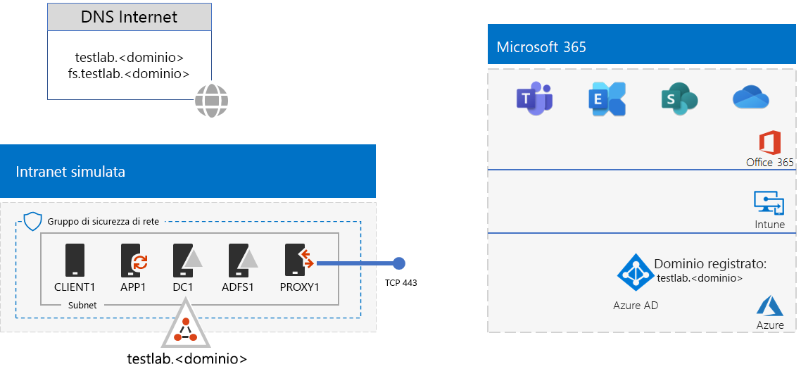
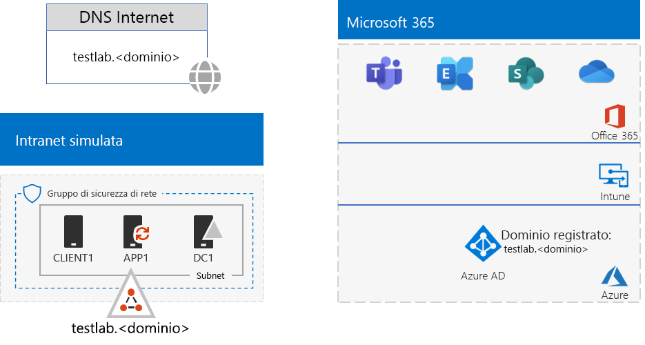
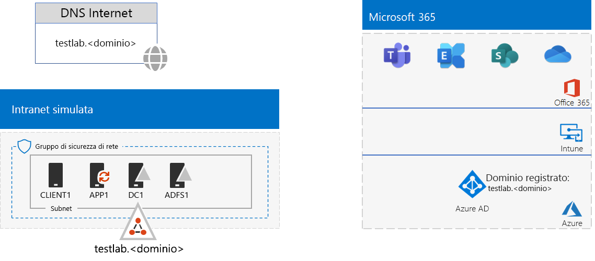

# <a name="federated-identity-for-your-microsoft-365-test-environment"></a><span data-ttu-id="f45c8-103">Identità federata per l'ambiente di testing di Microsoft 365</span><span class="sxs-lookup"><span data-stu-id="f45c8-103">Federated identity for your Microsoft 365 test environment</span></span>

<span data-ttu-id="f45c8-104">*Questa guida al lab di test può essere usata sia per ambienti di testing di Microsoft 365 Enterprise che di Office 365 Enterprise.*</span><span class="sxs-lookup"><span data-stu-id="f45c8-104">*This Test Lab Guide can be used for both Microsoft 365 Enterprise and Office 365 Enterprise test environments.*</span></span>

<span data-ttu-id="f45c8-p101">Office 365 supporta l'identità federativa. Questo indica che invece di eseguire la convalida delle credenziali autonomamente, Office 365 fa riferimento all'utente connesso a un server di autenticazione federata che Office 365 considera attendibile. Se le credenziali dell'utente sono corrette, il server di autenticazione federata emette un token di sicurezza che il client invia quindi a Office 365 come prova di autenticazione. L'identità federativa consente l'offload e la scalabilità in verticale di autenticazione per una sottoscrizione a Office 365 e scenari di sicurezza e autenticazione avanzata.</span><span class="sxs-lookup"><span data-stu-id="f45c8-p101">Office 365 supports federated identity. This means that instead of performing the validation of credentials itself, Office 365 refers the connecting user to a federated authentication server that Office 365 trusts. If the user's credentials are correct, the federated authentication server issues a security token that the client then sends to Office 365 as proof of authentication. Federated identity allows for the offloading and scaling up of authentication for an Office 365 subscription and advanced authentication and security scenarios.</span></span>
  
<span data-ttu-id="f45c8-109">In questo articolo viene descritto come configurare l'autenticazione federata per l'ambiente di testing di Microsoft 365 o Office 365, determinando la configurazione seguente:</span><span class="sxs-lookup"><span data-stu-id="f45c8-109">This article describes how you can configure federated authentication for your Microsoft 365 or Office 365 test environment, resulting in the following:</span></span>


  
<span data-ttu-id="f45c8-111">Questa configurazione è costituita da:</span><span class="sxs-lookup"><span data-stu-id="f45c8-111">This configuration consists of:</span></span> 
  
- <span data-ttu-id="f45c8-112">Un abbonamento di valutazione o produzione a Microsoft 365 E5 o a Office 365 E5.</span><span class="sxs-lookup"><span data-stu-id="f45c8-112">A Microsoft 365 E5 or Office 365 E5 trial or production subscription.</span></span>
    
- <span data-ttu-id="f45c8-p102">Una rete Intranet dell'organizzazione semplificata connessa a Internet e costituita da cinque macchine virtuali in una sottorete di una rete virtuale Azure (DC1, APP1, CLIENT1, ADFS1 e PROXY1). Azure AD Connect viene eseguito su APP1 per sincronizzare l'elenco di account nel dominio di Active Directory Domain Services con Office 365. PROXY1 riceve le richieste di autenticazione in arrivo. ADFS1 convalida le credenziali con DC1 e rilascia token di sicurezza.</span><span class="sxs-lookup"><span data-stu-id="f45c8-p102">A simplified organization intranet connected to the Internet, consisting of five virtual machines on a subnet of an Azure virtual network (DC1, APP1, CLIENT1, ADFS1, and PROXY1). Azure AD Connect runs on APP1 to synchronize the list of accounts in the Active Directory Domain Services domain to Office 365. PROXY1 receives the incoming authentication requests. ADFS1 validates credentials with DC1 and issues security tokens.</span></span>
    
<span data-ttu-id="f45c8-117">La configurazione dell'ambiente di testing prevede cinque fasi:</span><span class="sxs-lookup"><span data-stu-id="f45c8-117">There are five phases to setting up this dev/test environment:</span></span>
  
1. <span data-ttu-id="f45c8-118">Creare l'ambiente di testing aziendale simulato con la sincronizzazione dell'hash delle password.</span><span class="sxs-lookup"><span data-stu-id="f45c8-118">Create the simulated enterprise test environment with password hash synchronization.</span></span>
    
2. <span data-ttu-id="f45c8-119">Creare il server ADFS (ADFS1).</span><span class="sxs-lookup"><span data-stu-id="f45c8-119">Create the AD FS server (ADFS1).</span></span>
    
3. <span data-ttu-id="f45c8-120">Creare il server proxy Web (PROXY1).</span><span class="sxs-lookup"><span data-stu-id="f45c8-120">Create the web proxy server (PROXY1).</span></span>
    
4. <span data-ttu-id="f45c8-121">Creare un certificato autofirmato e configurare ADFS1 e PROXY1.</span><span class="sxs-lookup"><span data-stu-id="f45c8-121">Create a self-signed certificate and configure ADFS1 and PROXY1.</span></span>
    
5. <span data-ttu-id="f45c8-122">Configurare Office 365 per l'identità federativa.</span><span class="sxs-lookup"><span data-stu-id="f45c8-122">Configure Office 365 for federated identity.</span></span>
    
> [!NOTE]
> <span data-ttu-id="f45c8-123">Non è possibile configurare l'ambiente di testing con un abbonamento di valutazione di Azure.</span><span class="sxs-lookup"><span data-stu-id="f45c8-123">You cannot configure this test environment with an Azure Trial subscription.</span></span> 
  
## <a name="phase-1-configure-password-hash-synchronization-for-your-microsoft-365-test-environment"></a><span data-ttu-id="f45c8-124">Fase 1: configurare la sincronizzazione hash delle password per l'ambiente di testing di Microsoft 365</span><span class="sxs-lookup"><span data-stu-id="f45c8-124">Phase 1: Configure password hash synchronization for your Microsoft 365 test environment</span></span>

<span data-ttu-id="f45c8-p103">Seguire le istruzioni riportate in [sincronizzazione hash delle password per Microsoft 365](password-hash-sync-m365-ent-test-environment.md). Di seguito è riportata la configurazione risultante.</span><span class="sxs-lookup"><span data-stu-id="f45c8-p103">Follow the instructions in [password hash synchronization for Microsoft 365](password-hash-sync-m365-ent-test-environment.md). Here is your resulting configuration.</span></span>
  

  
<span data-ttu-id="f45c8-128">Questa configurazione è costituita da:</span><span class="sxs-lookup"><span data-stu-id="f45c8-128">This configuration consists of:</span></span> 
  
- <span data-ttu-id="f45c8-129">Un abbonamento di valutazione o a pagamento a Microsoft 365 E5 o a Office 365 E5.</span><span class="sxs-lookup"><span data-stu-id="f45c8-129">A Microsoft 365 E5 or Office 365 E5 trial or paid subscriptions.</span></span>
- <span data-ttu-id="f45c8-130">Una intranet dell’organizzazione semplificata connessa a Internet e costituita dalle macchine virtuali DC1 APP1 e CLIENT1 in una sottorete di una rete virtuale Azure.</span><span class="sxs-lookup"><span data-stu-id="f45c8-130">A simplified organization intranet connected to the Internet, consisting of the DC1, APP1, and CLIENT1 virtual machines on a subnet of an Azure virtual network.</span></span> <span data-ttu-id="f45c8-131">Azure AD Connect viene eseguito su APP1 per sincronizzare periodicamente il dominio TESTLAB di Active Directory Domain Services con il tenant di Azure AD degli abbonamenti a Microsoft 365 o a Office 365.</span><span class="sxs-lookup"><span data-stu-id="f45c8-131">Azure AD Connect runs on APP1 to synchronize the TESTLAB AD DS domain to the Azure AD tenant of your Microsoft 365 or Office 365 subscriptions periodically.</span></span>

## <a name="phase-2-create-the-ad-fs-server"></a><span data-ttu-id="f45c8-132">Fase 2: creare il server AD FS</span><span class="sxs-lookup"><span data-stu-id="f45c8-132">Phase 2: Create the AD FS server</span></span>

<span data-ttu-id="f45c8-133">Un server AD FS fornisce l'autenticazione federata tra Office 365 e gli account nel dominio corp.contoso.com ospitato su DC1.</span><span class="sxs-lookup"><span data-stu-id="f45c8-133">An AD FS server provides federated authentication between Office 365 and the accounts in the corp.contoso.com domain hosted on DC1.</span></span>
  
<span data-ttu-id="f45c8-134">Per creare una macchina virtuale Azure per ADFS1, inserire il nome della sottoscrizione, il gruppo di risorse e la posizione di Azure per la configurazione di base, quindi eseguire questi comandi al prompt dei comandi di Azure PowerShell nel computer locale.</span><span class="sxs-lookup"><span data-stu-id="f45c8-134">To create an Azure virtual machine for ADFS1, fill in the name of your subscription and the resource group and Azure location for your Base Configuration, and then run these commands at the Azure PowerShell command prompt on your local computer.</span></span>
  
```powershell
$subscrName="<your Azure subscription name>"
$rgName="<the resource group name of your Base Configuration>"
$vnetName="TlgBaseConfig-01-VNET"
# NOTE: If you built your simulated intranet with Azure PowerShell, comment the previous line with a "#" and remove the "#" from the next line.
#$vnetName="TestLab"
Connect-AzAccount
Select-AzSubscription -SubscriptionName $subscrName
$staticIP="10.0.0.100"
$locName=(Get-AzResourceGroup -Name $rgName).Location
$vnet=Get-AzVirtualNetwork -Name $vnetName -ResourceGroupName $rgName
$pip = New-AzPublicIpAddress -Name ADFS1-PIP -ResourceGroupName $rgName -Location $locName -AllocationMethod Dynamic
$nic = New-AzNetworkInterface -Name ADFS1-NIC -ResourceGroupName $rgName -Location $locName -SubnetId $vnet.Subnets[0].Id -PublicIpAddressId $pip.Id -PrivateIpAddress $staticIP
$vm=New-AzVMConfig -VMName ADFS1 -VMSize Standard_D2_v2
$cred=Get-Credential -Message "Type the name and password of the local administrator account for ADFS1."
$vm=Set-AzVMOperatingSystem -VM $vm -Windows -ComputerName ADFS1 -Credential $cred -ProvisionVMAgent -EnableAutoUpdate
$vm=Set-AzVMSourceImage -VM $vm -PublisherName MicrosoftWindowsServer -Offer WindowsServer -Skus 2016-Datacenter -Version "latest"
$vm=Add-AzVMNetworkInterface -VM $vm -Id $nic.Id
$vm=Set-AzVMOSDisk -VM $vm -Name "ADFS-OS" -DiskSizeInGB 128 -CreateOption FromImage -StorageAccountType "Standard_LRS"
New-AzVM -ResourceGroupName $rgName -Location $locName -VM $vm
```

<span data-ttu-id="f45c8-135">Successivamente, utilizzare il [portale di Azure](https://portal.azure.com) per connettersi alla macchina virtuale ADFS1 usando il nome e la password dell'account Administrator locale di ADFS1, quindi aprire un prompt dei comandi di Windows PowerShell.</span><span class="sxs-lookup"><span data-stu-id="f45c8-135">Next, use the [Azure portal](https://portal.azure.com) to connect to the ADFS1 virtual machine using the ADFS1 local administrator account name and password, and then open a Windows PowerShell command prompt.</span></span>
  
<span data-ttu-id="f45c8-136">Per controllare la risoluzione del nome e la comunicazione della rete tra ADFS1 e DC1, eseguire il comando **ping dc1.corp.contoso.com** e verificare che siano presenti quattro risposte.</span><span class="sxs-lookup"><span data-stu-id="f45c8-136">To check name resolution and network communication between ADFS1 and DC1, run the **ping dc1.corp.contoso.com** command and check that there are four replies.</span></span>
  
<span data-ttu-id="f45c8-137">Unire quindi la macchina virtuale ADFS1 al dominio CORP immettendo questi comandi nel prompt dei comandi di Windows PowerShell in ADFS1.</span><span class="sxs-lookup"><span data-stu-id="f45c8-137">Next, join the ADFS1 virtual machine to the CORP domain with these commands at the Windows PowerShell prompt on ADFS1.</span></span>
  
```powershell
$cred=Get-Credential -UserName "CORP\User1" -Message "Type the User1 account password."
Add-Computer -DomainName corp.contoso.com -Credential $cred
Restart-Computer
```

<span data-ttu-id="f45c8-138">Questa è la configurazione risultante.</span><span class="sxs-lookup"><span data-stu-id="f45c8-138">Here is your resulting configuration.</span></span>
  

  
## <a name="phase-3-create-the-web-proxy-server"></a><span data-ttu-id="f45c8-140">Fase 3: Creare il server proxy Web</span><span class="sxs-lookup"><span data-stu-id="f45c8-140">Phase 3: Create the web proxy server</span></span>

<span data-ttu-id="f45c8-141">PROXY1 consente l'inoltro dei messaggi di autenticazione tra gli utenti e ADFS1.</span><span class="sxs-lookup"><span data-stu-id="f45c8-141">PROXY1 provides proxying of authentication messages between users trying to authenticate and ADFS1.</span></span>
  
<span data-ttu-id="f45c8-142">Per creare una macchina virtuale Azure per PROXY1, inserire il nome del gruppo di risorse e la posizione di Azure, quindi eseguire questi comandi al prompt dei comandi di Azure PowerShell nel computer locale.</span><span class="sxs-lookup"><span data-stu-id="f45c8-142">To create an Azure virtual machine for PROXY1, fill in the name of your resource group and Azure location, and then run these commands at the Azure PowerShell command prompt on your local computer.</span></span>
  
```powershell
$rgName="<the resource group name of your Base Configuration>"
$vnetName="TlgBaseConfig-01-VNET"
# NOTE: If you built your simulated intranet with Azure PowerShell, comment the previous line with a "#" and remove the "#" from the next line.
#$vnetName="TestLab"
$staticIP="10.0.0.101"
$locName=(Get-AzResourceGroup -Name $rgName).Location
$vnet=Get-AzVirtualNetwork -Name $vnetName -ResourceGroupName $rgName
$pip = New-AzPublicIpAddress -Name PROXY1-PIP -ResourceGroupName $rgName -Location $locName -AllocationMethod Static
$nic = New-AzNetworkInterface -Name PROXY1-NIC -ResourceGroupName $rgName -Location $locName -SubnetId $vnet.Subnets[0].Id -PublicIpAddressId $pip.Id -PrivateIpAddress $staticIP
$vm=New-AzVMConfig -VMName PROXY1 -VMSize Standard_D2_v2
$cred=Get-Credential -Message "Type the name and password of the local administrator account for PROXY1."
$vm=Set-AzVMOperatingSystem -VM $vm -Windows -ComputerName PROXY1 -Credential $cred -ProvisionVMAgent -EnableAutoUpdate
$vm=Set-AzVMSourceImage -VM $vm -PublisherName MicrosoftWindowsServer -Offer WindowsServer -Skus 2016-Datacenter -Version "latest"
$vm=Add-AzVMNetworkInterface -VM $vm -Id $nic.Id
$vm=Set-AzVMOSDisk -VM $vm -Name "PROXY1-OS" -DiskSizeInGB 128 -CreateOption FromImage -StorageAccountType "Standard_LRS"
New-AzVM -ResourceGroupName $rgName -Location $locName -VM $vm
```

> [!NOTE]
> <span data-ttu-id="f45c8-143">A PROXY1 viene assegnato un indirizzo IP pubblico statico perché verrà creato un record DNS pubblico che punta a esso e non deve essere modificato quando si riavvia la macchina virtuale PROXY1.</span><span class="sxs-lookup"><span data-stu-id="f45c8-143">PROXY1 is assigned a static public IP address because you will create a public DNS record that points to it and it must not change when you restart the PROXY1 virtual machine.</span></span> 
  
<span data-ttu-id="f45c8-p105">Aggiungere quindi una regola al gruppo di sicurezza di rete per la sottorete CorpNet per consentire il traffico in ingresso non sollecitato da Internet all'indirizzo IP privato di PROXY1 e la porta TCP 443. Eseguire questi comandi al prompt dei comandi di Azure PowerShell nel computer locale.</span><span class="sxs-lookup"><span data-stu-id="f45c8-p105">Next, add a rule to the network security group for the CorpNet subnet to allow unsolicited inbound traffic from the Internet to PROXY1's private IP address and TCP port 443. Run these commands at the Azure PowerShell command prompt on your local computer.</span></span>
  
```powershell
$rgName="<the resource group name of your Base Configuration>"
Get-AzNetworkSecurityGroup -Name CorpNet -ResourceGroupName $rgName | Add-AzNetworkSecurityRuleConfig -Name "HTTPS-to-PROXY1" -Description "Allow TCP 443 to PROXY1" -Access "Allow" -Protocol "Tcp" -Direction "Inbound" -Priority 101 -SourceAddressPrefix "Internet" -SourcePortRange "*" -DestinationAddressPrefix "10.0.0.101" -DestinationPortRange "443" | Set-AzNetworkSecurityGroup
```

<span data-ttu-id="f45c8-146">Successivamente, utilizzare il [portale di Azure](https://portal.azure.com) per connettersi alla macchina virtuale PROXY1 usando il nome e la password dell'account Administrator locale di PROXY1, quindi aprire un prompt dei comandi di Windows PowerShell in PROXY1.</span><span class="sxs-lookup"><span data-stu-id="f45c8-146">Next, use the [Azure portal](https://portal.azure.com) to connect to the PROXY1 virtual machine using the PROXY1 local administrator account name and password, and then open a Windows PowerShell command prompt on PROXY1.</span></span>
  
<span data-ttu-id="f45c8-147">Per controllare la risoluzione del nome e la comunicazione della rete tra PROXY1 e DC1, eseguire il comando **ping dc1.corp.contoso.com** e verificare che siano presenti quattro risposte.</span><span class="sxs-lookup"><span data-stu-id="f45c8-147">To check name resolution and network communication between PROXY1 and DC1, run the **ping dc1.corp.contoso.com** command and check that there are four replies.</span></span>
  
<span data-ttu-id="f45c8-148">Unire quindi la macchina virtuale PROXY1 al dominio CORP immettendo questi comandi nel prompt dei comandi di Windows PowerShell in PROXY1.</span><span class="sxs-lookup"><span data-stu-id="f45c8-148">Next, join the PROXY1 virtual machine to the CORP domain with these commands at the Windows PowerShell prompt on PROXY1.</span></span>
  
```powershell
$cred=Get-Credential -UserName "CORP\User1" -Message "Type the User1 account password."
Add-Computer -DomainName corp.contoso.com -Credential $cred
Restart-Computer
```

<span data-ttu-id="f45c8-149">Visualizzare l'indirizzo IP pubblico di PROXY1 con questi comandi PowerShell di Azure nel computer locale:</span><span class="sxs-lookup"><span data-stu-id="f45c8-149">Display the public IP address of PROXY1 with these Azure PowerShell commands on your local computer:</span></span>
  
```powershell
Write-Host (Get-AzPublicIpaddress -Name "PROXY1-PIP" -ResourceGroup $rgName).IPAddress
```

<span data-ttu-id="f45c8-p106">Successivamente, interagire con il provider DNS pubblico e creare un nuovo record A DNS pubblico per **fs.testlab.**\<nome di dominio DNS> che restituisce l'indirizzo IP visualizzato dal comando **Write-Host**. Il **fs.testlab.**\<nome di dominio DNS> verrà di seguito indicato come *nome di dominio completo del servizio federativo*.</span><span class="sxs-lookup"><span data-stu-id="f45c8-p106">Next, work with your public DNS provider and create a new public DNS A record for **fs.testlab.**\<your DNS domain name> that resolves to the IP address displayed by the **Write-Host** command. The **fs.testlab.**\<your DNS domain name> is hereafter referred to as the  *federation service FQDN*.</span></span>
  
<span data-ttu-id="f45c8-152">Successivamente, utilizzare il [portale di Azure](https://portal.azure.com) per connettersi alla macchina virtuale DC1 usando le credenziali di CORP\\User1, quindi eseguire i comandi seguenti a un prompt dei comandi di Windows PowerShell a livello di amministratore:</span><span class="sxs-lookup"><span data-stu-id="f45c8-152">Next, use the [Azure portal](https://portal.azure.com) to connect to the DC1 virtual machine using the CORP\\User1 credentials, and then run the following commands at an administrator-level Windows PowerShell command prompt:</span></span>
  
```powershell
Add-DnsServerPrimaryZone -Name corp.contoso.com -ZoneFile corp.contoso.com.dns
Add-DnsServerResourceRecordA -Name "fs" -ZoneName corp.contoso.com -AllowUpdateAny -IPv4Address "10.0.0.100" -TimeToLive 01:00:00
```
<span data-ttu-id="f45c8-153">Tali comandi consentono di creare un record DNS A interno in modo che le macchine virtuali nella rete virtuale di Azure possano risolvere il nome di dominio completo interno della federazione nell'indirizzo IP privato di ADFS1.</span><span class="sxs-lookup"><span data-stu-id="f45c8-153">These commands create an internal DNS A record so that virtual machines on the Azure virtual network can resolve the internal federation FQDN to ADFS1's private IP address.</span></span>
  
<span data-ttu-id="f45c8-154">Questa è la configurazione risultante.</span><span class="sxs-lookup"><span data-stu-id="f45c8-154">Here is your resulting configuration.</span></span>
  

  
## <a name="phase-4-create-a-self-signed-certificate-and-configure-adfs1-and-proxy1"></a><span data-ttu-id="f45c8-156">Fase 4: Creare un certificato autofirmato e configurare ADFS1 e PROXY1</span><span class="sxs-lookup"><span data-stu-id="f45c8-156">Phase 4: Create a self-signed certificate and configure ADFS1 and PROXY1</span></span>

<span data-ttu-id="f45c8-157">In questa fase, viene creato un certificato digitale autofirmato per il nome di dominio completo del servizio federativo e vengono configurati ADFS1 e PROXY1 come farm AD FS.</span><span class="sxs-lookup"><span data-stu-id="f45c8-157">In this phase, you create a self-signed digital certificate for your federation service FQDN and configure ADFS1 and PROXY1 as an AD FS farm.</span></span>
  
<span data-ttu-id="f45c8-158">Per prima cosa, utilizzare il [portale di Azure](https://portal.azure.com) per connettersi alla macchina virtuale DC1 usando le credenziali di CORP\\CORPUser1, quindi aprire un prompt dei comandi di Windows PowerShell a livello di amministratore. </span><span class="sxs-lookup"><span data-stu-id="f45c8-158">First, use the [Azure portal](https://portal.azure.com) to connect to the DC1 virtual machine using the CORP\\User1 credentials, and then open an administrator-level Windows PowerShell command prompt.</span></span>
  
<span data-ttu-id="f45c8-159">Successivamente, creare un account del servizio AD FS con questo comando al prompt dei comandi di Windows PowerShell in DC1:</span><span class="sxs-lookup"><span data-stu-id="f45c8-159">Next, create AD FS service account with this command at the Windows PowerShell command prompt on DC1:</span></span>
  
```powershell
New-ADUser -SamAccountName ADFS-Service -AccountPassword (read-host "Set user password" -assecurestring) -name "ADFS-Service" -enabled $true -PasswordNeverExpires $true -ChangePasswordAtLogon $false
```
<span data-ttu-id="f45c8-p107">Tenere presente che questo comando chiede di specificare la password dell'account. Scegliere una password complessa e annotarla in una posizione sicura. Sarà necessaria per questa e la fase successiva.</span><span class="sxs-lookup"><span data-stu-id="f45c8-p107">Note that this command prompts you to supply the account password. Choose a strong password and record it in a secured location. You will need it for this phase and Phase 5.</span></span>
  
<span data-ttu-id="f45c8-p108">Utilizzare il [portale di Azure](https://portal.azure.com) per connettersi alla macchina virtuale ADFS1 utilizzando le credenziali di CORP\\CORPUser1. Aprire un prompt dei comandi di Windows PowerShell a livello di amministratore su ADFS1, immettere il nome di dominio completo del servizio federativo e quindi eseguire questi comandi per creare un certificato autofirmato:</span><span class="sxs-lookup"><span data-stu-id="f45c8-p108">Use the [Azure portal](https://portal.azure.com) to connect to the ADFS1 virtual machine using the CORP\\User1 credentials. Open an administrator-level Windows PowerShell command prompt on ADFS1, fill in your federation service FQDN, and then run these commands to create a self-signed certificate:</span></span>
  
```powershell
$fedServiceFQDN="<federation service FQDN>"
New-SelfSignedCertificate -DnsName $fedServiceFQDN -CertStoreLocation "cert:\LocalMachine\My"
New-Item -path c:\Certs -type directory
New-SmbShare -name Certs -path c:\Certs -changeaccess CORP\User1
```

<span data-ttu-id="f45c8-165">Successivamente, seguire questi passaggi per salvare il nuovo certificato autofirmato come file.</span><span class="sxs-lookup"><span data-stu-id="f45c8-165">Next, use these steps to save the new self-signed certificate as a file.</span></span>
  
1. <span data-ttu-id="f45c8-166">Fare clic sul pulsante **Start**, digitare **mmc.exe**, quindi premere **INVIO**.</span><span class="sxs-lookup"><span data-stu-id="f45c8-166">Click **Start**, type **mmc.exe**, and then press **Enter**.</span></span>
    
2. <span data-ttu-id="f45c8-167">Fare clic su **File > Aggiungi/Rimuovi snap-in**.</span><span class="sxs-lookup"><span data-stu-id="f45c8-167">Click **File > Add/Remove Snap-in**.</span></span>
    
3. <span data-ttu-id="f45c8-168">In **Aggiungi o rimuovi snap-in**, fare doppio clic su **Certificati** nell'elenco di snap-in disponibili, fare clic su **Account del computer**, quindi fare clic su **Avanti**.</span><span class="sxs-lookup"><span data-stu-id="f45c8-168">In **Add or Remove Snap-ins**, double-click **Certificates** in the list of available snap-ins, click **Computer account**, and then click **Next**.</span></span>
    
4. <span data-ttu-id="f45c8-169">In **Seleziona computer**, fare clic su **Fine** e quindi su **OK**.</span><span class="sxs-lookup"><span data-stu-id="f45c8-169">In **Select Computer**, click **Finish**, and then click **OK**.</span></span>
    
5. <span data-ttu-id="f45c8-170">Nel riquadro dell'albero, aprire **Certificati (computer locali) > Personale > Certificati**.</span><span class="sxs-lookup"><span data-stu-id="f45c8-170">In the tree pane, open **Certificates (Local Computer) > Personal > Certificates**.</span></span>
    
6. <span data-ttu-id="f45c8-171">Fare clic con il pulsante destro del mouse sul certificato con il nome di dominio completo del servizio federativo, fare clic su **Tutte le attività**, quindi su **Esporta**.</span><span class="sxs-lookup"><span data-stu-id="f45c8-171">Right-click the certificate with your federation service FQDN, click **All tasks**, and then click **Export**.</span></span>
    
7. <span data-ttu-id="f45c8-172">Nella pagina **iniziale**, scegliere **Avanti**.</span><span class="sxs-lookup"><span data-stu-id="f45c8-172">On the **Welcome** page, click **Next**.</span></span>
    
8. <span data-ttu-id="f45c8-173">Nella pagina **Esportazione della chiave privata con il certificato** fare clic su **Sì**, quindi su **Avanti**.</span><span class="sxs-lookup"><span data-stu-id="f45c8-173">On the **Export Private Key** page, click **Yes**, and then click **Next**.</span></span>
    
9. <span data-ttu-id="f45c8-174">Nella pagina **Formato file di esportazione** fare clic su **Esporta tutte le proprietà estese**, quindi su **Avanti**.</span><span class="sxs-lookup"><span data-stu-id="f45c8-174">On the **Export File Format** page, click **Export all extended properties**, and then click **Next**.</span></span>
    
10. <span data-ttu-id="f45c8-175">Nella pagina **Sicurezza** fare clic su **Password** e digitare una password in **Password** e **Conferma password.**</span><span class="sxs-lookup"><span data-stu-id="f45c8-175">On the **Security** page, click **Password** and type a password in **Password** and **Confirm password.**</span></span>
    
11. <span data-ttu-id="f45c8-176">Nella pagina **File da esportare** fare clic su **Sfoglia**.</span><span class="sxs-lookup"><span data-stu-id="f45c8-176">On the **File to Export** page, click **Browse**.</span></span>
    
12. <span data-ttu-id="f45c8-177">Passare alla cartella **C:\\Certs**, digitare **SSL** in **Nome file** e quindi fare clic su **Salva**.</span><span class="sxs-lookup"><span data-stu-id="f45c8-177">Browse to the **C:\\Certs** folder, type **SSL** in **File name**, and then click **Save.**</span></span>
    
13. <span data-ttu-id="f45c8-178">Nella pagina **File da esportare** fare clic su **Avanti**.</span><span class="sxs-lookup"><span data-stu-id="f45c8-178">On the **File to Export** page, click **Next**.</span></span>
    
14. <span data-ttu-id="f45c8-p109">Nella pagina **Completamento dell'Esportazione guidata certificati** fare clic su **Fine**. Quando richiesto, fare clic su **OK**.</span><span class="sxs-lookup"><span data-stu-id="f45c8-p109">On the **Completing the Certificate Export Wizard** page, click **Finish**. When prompted, click **OK**.</span></span>
    
<span data-ttu-id="f45c8-181">Successivamente, installare il servizio AD FS con questo comando al prompt dei comandi di Windows PowerShell in ADFS1:</span><span class="sxs-lookup"><span data-stu-id="f45c8-181">Next, install the AD FS service with this command at the Windows PowerShell command prompt on ADFS1:</span></span>
  
```powershell
Install-WindowsFeature ADFS-Federation -IncludeManagementTools
```

<span data-ttu-id="f45c8-182">Attendere che venga stabilita la connessione.</span><span class="sxs-lookup"><span data-stu-id="f45c8-182">Wait for the installation to complete.</span></span>
  
<span data-ttu-id="f45c8-183">Successivamente, configurare il servizio AD FS seguendo questi passaggi:</span><span class="sxs-lookup"><span data-stu-id="f45c8-183">Next, configure the AD FS service with these steps:</span></span>
  
1. <span data-ttu-id="f45c8-184">Fare clic sul pulsante **Start** e quindi fare clic sull'icona **Server Manager**.</span><span class="sxs-lookup"><span data-stu-id="f45c8-184">Click **Start**, and then click the **Server Manager** icon.</span></span>
    
2. <span data-ttu-id="f45c8-185">Nel riquadro dell'albero di Server Manager, fare clic su **AD FS**.</span><span class="sxs-lookup"><span data-stu-id="f45c8-185">In the tree pane of Server Manager, click **AD FS**.</span></span>
    
3. <span data-ttu-id="f45c8-186">Nella barra degli strumenti nella parte superiore, fare clic sul simbolo di attenzione arancione e quindi fare clic su **Configurare il servizio federativo nel server**.</span><span class="sxs-lookup"><span data-stu-id="f45c8-186">In the tool bar at the top, click the orange caution symbol, and then click **Configure the federation service on this server**.</span></span>
    
4. <span data-ttu-id="f45c8-187">Nella pagina di **benvenuto** in Configurazione guidata Active Directory Federation Services, fare clic su **Avanti**.</span><span class="sxs-lookup"><span data-stu-id="f45c8-187">On the **Welcome** page of the Active Directory Federation Services Configuration Wizard, click **Next**.</span></span>
    
5. <span data-ttu-id="f45c8-188">Nella pagina **Connessione a Servizi di dominio Active Directory** fare clic su **Avanti**.</span><span class="sxs-lookup"><span data-stu-id="f45c8-188">On the **Connect to AD DS** page, click **Next**.</span></span>
    
6. <span data-ttu-id="f45c8-189">Nella pagina **Impostazione proprietà del servizio**:</span><span class="sxs-lookup"><span data-stu-id="f45c8-189">On the **Specify Service Properties** page:</span></span>
    
  - <span data-ttu-id="f45c8-190">Per **Certificato SSL** fare clic sulla freccia in giù, quindi selezionare il certificato con il nome di dominio completo del servizio federativo.</span><span class="sxs-lookup"><span data-stu-id="f45c8-190">For **SSL Certificate**, click the down arrow, and then click the certificate with the name of your federation service FQDN.</span></span>
    
  - <span data-ttu-id="f45c8-191">In **Nome visualizzato del servizio federativo**, digitare il nome dell'organizzazione fittizia.</span><span class="sxs-lookup"><span data-stu-id="f45c8-191">In **Federation Service Display Name**, type the name of your fictional organization.</span></span>
    
  - <span data-ttu-id="f45c8-192">Fare clic su **Avanti**.</span><span class="sxs-lookup"><span data-stu-id="f45c8-192">Click **Next**.</span></span>
    
7. <span data-ttu-id="f45c8-193">Nella pagina **Impostazione account del servizio** fare clic su **Seleziona** per **Nome account**.</span><span class="sxs-lookup"><span data-stu-id="f45c8-193">On the **Specify Service Account** page, click **Select** for **Account name**.</span></span>
    
8. <span data-ttu-id="f45c8-194">In **Seleziona utente o account del servizio** digitare **Servizio ADFS**, fare clic su **Controlla nomi**, quindi su **OK**.</span><span class="sxs-lookup"><span data-stu-id="f45c8-194">In **Select User or Service Account**, type **ADFS-Service**, click **Check Names**, and then click **OK**.</span></span>
    
9. <span data-ttu-id="f45c8-195">In **Password account** digitare la password per l'account del servizio ADFS, quindi fare clic su **Avanti**.</span><span class="sxs-lookup"><span data-stu-id="f45c8-195">In **Account Password**, type the password for the ADFS-Service account, and then click **Next**.</span></span>
    
10. <span data-ttu-id="f45c8-196">Nella pagina **Impostazione database di configurazione** fare clic su **Avanti**.</span><span class="sxs-lookup"><span data-stu-id="f45c8-196">On the **Specify Configuration Database** page, click **Next**.</span></span>
    
11. <span data-ttu-id="f45c8-197">Nella pagina **Verifica opzioni** fare clic su **Avanti**.</span><span class="sxs-lookup"><span data-stu-id="f45c8-197">On the **Review Options** page, click **Next**.</span></span>
    
12. <span data-ttu-id="f45c8-198">Nella pagina **Controlli dei prerequisiti** fare clic su **Configura**.</span><span class="sxs-lookup"><span data-stu-id="f45c8-198">On the **Pre-requisite Checks** page, click **Configure**.</span></span>
    
13. <span data-ttu-id="f45c8-199">Nella pagina **Risultati** fare clic su **Chiudi**.</span><span class="sxs-lookup"><span data-stu-id="f45c8-199">On the **Results** page, click **Close**.</span></span>
    
14. <span data-ttu-id="f45c8-200">Fare clic sul pulsante **Start**, selezionare l'icona di alimentazione, fare clic su **Riavvia** e quindi su **Continua**.</span><span class="sxs-lookup"><span data-stu-id="f45c8-200">Click **Start**, click the power icon, click **Restart**, and then click **Continue**.</span></span>
    
<span data-ttu-id="f45c8-201">Dal [portale Azure](https://portal.azure.com), connettersi a PROXY1 con le credenziali dell'account CORP\\User1.</span><span class="sxs-lookup"><span data-stu-id="f45c8-201">From the [Azure portal](https://portal.azure.com), connect to PROXY1 with the CORP\\User1 account credentials.</span></span>
  
<span data-ttu-id="f45c8-202">Successivamente, seguire questi passaggi per installare il certificato autofirmato e configurare PROXY1.</span><span class="sxs-lookup"><span data-stu-id="f45c8-202">Next, use these steps to install the self-signed certificate and configure PROXY1.</span></span>
  
1. <span data-ttu-id="f45c8-203">Fare clic sul pulsante **Start**, digitare **mmc.exe**, quindi premere **INVIO**.</span><span class="sxs-lookup"><span data-stu-id="f45c8-203">Click **Start**, type **mmc.exe**, and then press **Enter**.</span></span>
    
2. <span data-ttu-id="f45c8-204">Fare clic su **File > Aggiungi/Rimuovi snap-in**.</span><span class="sxs-lookup"><span data-stu-id="f45c8-204">Click **File > Add/Remove Snap-in**.</span></span>
    
3. <span data-ttu-id="f45c8-205">In **Aggiungi o rimuovi snap-in**, fare doppio clic su **Certificati** nell'elenco di snap-in disponibili, fare clic su **Account del computer**, quindi fare clic su **Avanti**.</span><span class="sxs-lookup"><span data-stu-id="f45c8-205">In **Add or Remove Snap-ins**, double-click **Certificates** in the list of available snap-ins, click **Computer account**, and then click **Next**.</span></span>
    
4. <span data-ttu-id="f45c8-206">In **Seleziona computer**, fare clic su **Fine** e quindi su **OK**.</span><span class="sxs-lookup"><span data-stu-id="f45c8-206">In **Select Computer**, click **Finish**, and then click **OK**.</span></span>
    
5. <span data-ttu-id="f45c8-207">Nel riquadro dell'albero, aprire **Certificati (computer locali) > Personale > Certificati**.</span><span class="sxs-lookup"><span data-stu-id="f45c8-207">In the tree pane, open **Certificates (Local Computer) > Personal > Certificates**.</span></span>
    
6. <span data-ttu-id="f45c8-208">Fare clic con il pulsante destro del mouse su **Personale**, selezionare **Tutte le attività** e fare clic su **Importa**.</span><span class="sxs-lookup"><span data-stu-id="f45c8-208">Right-click **Personal**, click **All tasks**, and then click **Import**.</span></span>
    
7. <span data-ttu-id="f45c8-209">Nella pagina **iniziale**, scegliere **Avanti**.</span><span class="sxs-lookup"><span data-stu-id="f45c8-209">On the **Welcome** page, click **Next**.</span></span>
    
8. <span data-ttu-id="f45c8-210">Nella pagina **File da importare** digitare **\\\\adfs1\\certs\\ssl.pfx**, quindi fare clic su **Avanti**.</span><span class="sxs-lookup"><span data-stu-id="f45c8-210">On the **File to Import** page, type **\\\\adfs1\\certs\\ssl.pfx**, and then click **Next**.</span></span>
    
9. <span data-ttu-id="f45c8-211">Nella pagina **Protezione della chiave privata** digitare la password del certificato in **Password**, quindi fare clic su **Avanti.**</span><span class="sxs-lookup"><span data-stu-id="f45c8-211">On the **Private key protection** page, type the certificate password in **Password**, and then click **Next.**</span></span>
    
10. <span data-ttu-id="f45c8-212">Nella pagina **Archivio certificati** fare clic su **Avanti**.</span><span class="sxs-lookup"><span data-stu-id="f45c8-212">On the **Certificate store** page, click **Next.**</span></span>
    
11. <span data-ttu-id="f45c8-213">Nella pagina **Completamento in corso** fare clic su **Fine**.</span><span class="sxs-lookup"><span data-stu-id="f45c8-213">On the **Completing** page, click **Finish**.</span></span>
    
12. <span data-ttu-id="f45c8-214">Nella pagina **Archivio certificati** fare clic su **Avanti**.</span><span class="sxs-lookup"><span data-stu-id="f45c8-214">On the **Certificate Store** page, click **Next**.</span></span>
    
13. <span data-ttu-id="f45c8-215">Quando viene richiesto, fare clic su **OK**.</span><span class="sxs-lookup"><span data-stu-id="f45c8-215">When prompted, click **OK**.</span></span>
    
14. <span data-ttu-id="f45c8-216">Fare clic su **Certificati** nel riquadro dell'albero.</span><span class="sxs-lookup"><span data-stu-id="f45c8-216">Click **Certificates** in the tree pane.</span></span>
    
15. <span data-ttu-id="f45c8-217">Fare clic con il pulsante destro del mouse sul certificato, quindi su **Copia**.</span><span class="sxs-lookup"><span data-stu-id="f45c8-217">Right-click the certificate, and then click **Copy**.</span></span>
    
16. <span data-ttu-id="f45c8-218">Nel riquadro dell'albero, aprire **Autorità di certificazione radice attendibili > Certificati**.</span><span class="sxs-lookup"><span data-stu-id="f45c8-218">In the tree pane, open **Trusted Root Certification Authorities > Certificates**.</span></span>
    
17. <span data-ttu-id="f45c8-219">Spostare il puntatore del mouse sotto l'elenco di certificati installati rapida, fare clic con il pulsante destro e quindi selezionare **Incolla**.</span><span class="sxs-lookup"><span data-stu-id="f45c8-219">Move your mouse pointer below the list of installed certificates, right-click, and then click **Paste**.</span></span>
    
<span data-ttu-id="f45c8-220">Aprire un prompt dei comandi PowerShell a livello di amministratore ed eseguire il comando seguente:</span><span class="sxs-lookup"><span data-stu-id="f45c8-220">Open an administrator-level PowerShell command prompt and run the following command:</span></span>
  
```powershell
Install-WindowsFeature Web-Application-Proxy -IncludeManagementTools
```

<span data-ttu-id="f45c8-221">Attendere che venga stabilita la connessione.</span><span class="sxs-lookup"><span data-stu-id="f45c8-221">Wait for the installation to complete.</span></span>
  
<span data-ttu-id="f45c8-222">Seguire questi passaggi per configurare il servizio proxy dell'applicazione Web in modo da utilizzare ADFS1 come server federativo:</span><span class="sxs-lookup"><span data-stu-id="f45c8-222">Use these steps to configure the web application proxy service to use ADFS1 as its federation server:</span></span>
  
1. <span data-ttu-id="f45c8-223">Fare clic sul pulsante **Start** e quindi scegliere **Server Manager**.</span><span class="sxs-lookup"><span data-stu-id="f45c8-223">Click **Start**, and then click **Server Manager**.</span></span>
    
2. <span data-ttu-id="f45c8-224">Nel riquadro dell'albero fare clic su **Accesso remoto**.</span><span class="sxs-lookup"><span data-stu-id="f45c8-224">In the tree pane, click **Remote Access**.</span></span>
    
3. <span data-ttu-id="f45c8-225">Nella barra degli strumenti nella parte superiore, fare clic sul simbolo di attenzione arancione e quindi fare clic su **Apre la procedura guidata per il proxy dell'applicazione Web**.</span><span class="sxs-lookup"><span data-stu-id="f45c8-225">In the tool bar at the top, click the orange caution symbol, and then click **Open the Web Application Proxy Wizard**.</span></span>
    
4. <span data-ttu-id="f45c8-226">Nella pagina di **benvenuto** nella Configurazione guidata proxy applicazione Web, fare clic su **Avanti**.</span><span class="sxs-lookup"><span data-stu-id="f45c8-226">On the **Welcome** page of the Web Application Proxy Configuration Wizard, click **Next**.</span></span>
    
5. <span data-ttu-id="f45c8-227">Nella pagina **Server federativo**:</span><span class="sxs-lookup"><span data-stu-id="f45c8-227">On the **Federation Server** page:</span></span>
    
  - <span data-ttu-id="f45c8-228">Digitare il nome di dominio completo del servizio federativo in **Nome servizio federativo**.</span><span class="sxs-lookup"><span data-stu-id="f45c8-228">Type your federation service FQDN in **Federation service name**.</span></span>
    
  - <span data-ttu-id="f45c8-229">Digitare **CORP\\User1** in **Nome utente**.</span><span class="sxs-lookup"><span data-stu-id="f45c8-229">Type **CORP\\User1** in **User name**.</span></span>
    
  - <span data-ttu-id="f45c8-230">Digitare la password per l'account User1 nel campo **Password**.</span><span class="sxs-lookup"><span data-stu-id="f45c8-230">Type the password for the User1 account in **Password**.</span></span>
    
  - <span data-ttu-id="f45c8-231">Fare clic su **Avanti**.</span><span class="sxs-lookup"><span data-stu-id="f45c8-231">Click **Next**.</span></span>
    
6. <span data-ttu-id="f45c8-232">Nella pagina **Certificato proxy AD FS** fare clic sulla freccia in giù, selezionare il certificato con il nome di dominio completo del servizio federativo e fare clic su **Avanti**.</span><span class="sxs-lookup"><span data-stu-id="f45c8-232">On the **AD FS Proxy Certificate** page, click the down arrow, click the certificate with your federation service FQDN, and then click **Next**.</span></span>
    
7. <span data-ttu-id="f45c8-233">Nella pagina **Conferma** fare clic su **Configura**.</span><span class="sxs-lookup"><span data-stu-id="f45c8-233">On the **Confirmation** page, click **Configure**.</span></span>
    
8. <span data-ttu-id="f45c8-234">Nella pagina **Risultati** fare clic su **Chiudi**.</span><span class="sxs-lookup"><span data-stu-id="f45c8-234">On the **Results** page, click **Close**.</span></span>

    
## <a name="phase-5-configure-office-365-for-federated-identity"></a><span data-ttu-id="f45c8-235">Fase 5: configurare Office 365 per l'identità federativa</span><span class="sxs-lookup"><span data-stu-id="f45c8-235">Phase 5: Configure Office 365 for federated identity</span></span>

<span data-ttu-id="f45c8-236">Utilizzare il [portale di Azure](https://portal.azure.com) per connettersi alla macchina virtuale APP1 utilizzando le credenziali dell'account di CORP\\CORPUser1.</span><span class="sxs-lookup"><span data-stu-id="f45c8-236">Use the [Azure portal](https://portal.azure.com) to connect to the APP1 virtual machine with the CORP\\User1 account credentials.</span></span>
  
<span data-ttu-id="f45c8-237">Attenersi a questa procedura per configurare Azure AD Connect e l'abbonamento a Office 365 per l'autenticazione federata:</span><span class="sxs-lookup"><span data-stu-id="f45c8-237">Use these steps to configure Azure AD Connect and your Office 365 subscription for federated authentication:</span></span>
  
1. <span data-ttu-id="f45c8-238">Dal desktop, fare doppio clic su **Azure AD Connect**.</span><span class="sxs-lookup"><span data-stu-id="f45c8-238">From the desktop, double-click **Azure AD Connect**.</span></span>
    
2. <span data-ttu-id="f45c8-239">Nella pagina **Azure AD Connect** fare clic su **Configura**.</span><span class="sxs-lookup"><span data-stu-id="f45c8-239">On the **Welcome to Azure AD Connect** page, click **Configure**.</span></span>
    
3. <span data-ttu-id="f45c8-240">Nella pagina **Attività addizionali** fare clic su **Cambia l'accesso utente**, quindi su **Avanti**.</span><span class="sxs-lookup"><span data-stu-id="f45c8-240">On the **Additional tasks** page, click **Change user sign-in**, and then click **Next**.</span></span>
    
4. <span data-ttu-id="f45c8-241">Nella pagina **Connessione ad Azure AD**, digitare il nome e la password dell'account amministratore globale di Office 365 e fare clic su **Avanti**.</span><span class="sxs-lookup"><span data-stu-id="f45c8-241">On the **Connect to Azure AD** page, type your Office 365 global administrator account name and password, and then click **Next**.</span></span>
    
5. <span data-ttu-id="f45c8-242">Nella pagina **Accesso utente**, fare clic su **Federazione tramite ADFS**, quindi fare clic su **Avanti**.</span><span class="sxs-lookup"><span data-stu-id="f45c8-242">On the **User sign-in** page, click **Federation with AD FS**, and then click **Next**.</span></span>
    
6. <span data-ttu-id="f45c8-243">Nella pagina **Farm AD FS** fare clic su **Usa una farm AD FS esistente**, digitare **ADFS1** in **Nome del server** e quindi fare clic su **Avanti**.</span><span class="sxs-lookup"><span data-stu-id="f45c8-243">On the **AD FS farm** page, click **Use an existing AD FS farm**, type **ADFS1** in **Server Name**, and then click **Next**.</span></span>
    
7. <span data-ttu-id="f45c8-244">Quando vengono richieste le credenziali del server, immettere quelle dell'account di CORP\\CORPUser1, quindi fare clic su **OK**.</span><span class="sxs-lookup"><span data-stu-id="f45c8-244">When prompted for server credentials, enter the credentials of the CORP\\User1 account, and then click **OK**.</span></span>
    
8. <span data-ttu-id="f45c8-245">Nella pagina delle credenziali dell'**amministratore di dominio** digitare **CORP\\User1** in **Nome utente** e la password dell'account in **Password**, quindi fare clic su **Avanti**.</span><span class="sxs-lookup"><span data-stu-id="f45c8-245">On the **Domain Administrator** credentials page, type **CORP\\User1** in **Username** and the account password in **Password**, and then click **Next**.</span></span>
    
9. <span data-ttu-id="f45c8-246">Nella pagina **Account del servizio ADFS** digitare **CORP\\ADFS-Service** in **Nome utente di dominio** e la password dell'account in **Password utente di dominio**, quindi fare clic su **Avanti**.</span><span class="sxs-lookup"><span data-stu-id="f45c8-246">On the **AD FS service account** page, type **CORP\\ADFS-Service** in **Domain Username** and the account password in **Domain User Password**, and then click **Next**.</span></span>
    
10. <span data-ttu-id="f45c8-247">Nella pagina **Dominio di Azure AD**, in **Dominio** selezionare il nome del dominio precedentemente creato e aggiunto all'abbonamento di Office 365 nella fase 1, quindi fare clic su **Avanti**.</span><span class="sxs-lookup"><span data-stu-id="f45c8-247">On the **Azure AD Domain** page, in **Domain**, select the name of the domain you previously created and added to your Office 365 subscription in Phase 1, and then click **Next**.</span></span>
    
11. <span data-ttu-id="f45c8-248">Nella pagina **Pronto per la configurazione** fare clic su **Configura**.</span><span class="sxs-lookup"><span data-stu-id="f45c8-248">On the **Ready to configure** page, click **Configure**.</span></span>
    
12. <span data-ttu-id="f45c8-249">Nella pagina **Installazione completata** fare clic su **Verifica**.</span><span class="sxs-lookup"><span data-stu-id="f45c8-249">On the **Installation complete** page, click **Verify**.</span></span>
    
    <span data-ttu-id="f45c8-250">Verranno visualizzati messaggi che confermano la corretta configurazione Internet e Intranet.</span><span class="sxs-lookup"><span data-stu-id="f45c8-250">You should see messages indicating that both the intranet and Internet configuration was verified.</span></span>
    
13. <span data-ttu-id="f45c8-251">Nella pagina **Installazione completata**, fare clic su **Chiudi**.</span><span class="sxs-lookup"><span data-stu-id="f45c8-251">On the **Installation complete** page, click **Exit**.</span></span>
    
<span data-ttu-id="f45c8-252">Per verificare il funzionamento dell'autenticazione federata, eseguire le operazioni seguenti:</span><span class="sxs-lookup"><span data-stu-id="f45c8-252">To demonstrate that federated authentication is working:</span></span>
  
1. <span data-ttu-id="f45c8-253">Aprire una nuova istanza privata del browser nel computer locale e andare a [https://admin.microsoft.com](https://admin.microsoft.com).</span><span class="sxs-lookup"><span data-stu-id="f45c8-253">Open a new private instance of your browser on your local computer and go to [https://admin.microsoft.com](https://admin.microsoft.com).</span></span>
    
2. <span data-ttu-id="f45c8-254">Per le credenziali di accesso, digitare **user1@**\<dominio creato nella fase 1>. </span><span class="sxs-lookup"><span data-stu-id="f45c8-254">For the sign-in credentials, type **user1@**\<the domain created in Phase 1>.</span></span> 
    
    <span data-ttu-id="f45c8-p110">Ad esempio, se il dominio di test è **testlab.contoso.com**, digitare "user1@testlab.contoso.com". Premere TAB o consentire a Office 365 di essere reindirizzati automaticamente.</span><span class="sxs-lookup"><span data-stu-id="f45c8-p110">For example, if your test domain is **testlab.contoso.com**, you would type "user1@testlab.contoso.com". Press TAB or allow Office 365 to automatically redirect you.</span></span>
    
    <span data-ttu-id="f45c8-p111">Viene visualizzata una pagina **La connessione non è privata**. Accade questo perché è stato installato un certificato autofirmato su ADFS1 che non può essere convalidato dal computer desktop. In una distribuzione di produzione di autenticazione federata, utilizzare un certificato rilasciato da un'autorità di certificazione attendibile per fare in modo che gli utenti non visualizzino questa pagina.</span><span class="sxs-lookup"><span data-stu-id="f45c8-p111">You should now see a **Your connection is not private** page. You are seeing this because you installed a self-signed certificate on ADFS1 that your desktop computer cannot validate. In a production deployment of federated authentication, you would use a certificate from a trusted certification authority and your users would not see this page.</span></span>
    
3. <span data-ttu-id="f45c8-260">Nella pagina **La connessione non è privata** fare clic su **Avanzate**, quindi su **Continua a \<nome di dominio completo del servizio federativo>**. </span><span class="sxs-lookup"><span data-stu-id="f45c8-260">On the **Your connection is not private** page, click **Advanced**, and then click **Proceed to \<your federation service FQDN>**.</span></span> 
    
4. <span data-ttu-id="f45c8-261">Nella pagina con il nome dell'organizzazione fittizia accedere con le seguenti credenziali:</span><span class="sxs-lookup"><span data-stu-id="f45c8-261">On the page with the name of your fictional organization, sign in with the following:</span></span>
    
  - <span data-ttu-id="f45c8-262">**CORP\\User1** per il nome</span><span class="sxs-lookup"><span data-stu-id="f45c8-262">**CORP\\User1** for the name</span></span>
    
  - <span data-ttu-id="f45c8-263">La password per l'account User1</span><span class="sxs-lookup"><span data-stu-id="f45c8-263">The password for the User1 account</span></span>
    
    <span data-ttu-id="f45c8-264">Verrà visualizzata la **Home Page Microsoft Office**.</span><span class="sxs-lookup"><span data-stu-id="f45c8-264">You should see the **Microsoft Office Home** page.</span></span>
    
<span data-ttu-id="f45c8-p112">Questa procedura dimostra che l'abbonamento di valutazione a Office 365 è federato con il dominio corp.contoso.com di Active Directory Domain Services ospitato su DC1. Ecco i concetti di base del processo di autenticazione:</span><span class="sxs-lookup"><span data-stu-id="f45c8-p112">This procedure demonstrates that your Office 365 trial subscription is federated with the AD DS corp.contoso.com domain hosted on DC1. Here are the basics of the authentication process:</span></span>
  
1. <span data-ttu-id="f45c8-267">Quando si utilizza il dominio federato creato nella fase 1 all'interno del nome dell'account di accesso, Office 365 reindirizza il browser al nome di dominio completo del servizio federativo e PROXY1.</span><span class="sxs-lookup"><span data-stu-id="f45c8-267">When you use the federated domain that you created in Phase 1 within the sign-in account name, Office 365 redirects your browser to your federation service FQDN and PROXY1.</span></span>
    
2. <span data-ttu-id="f45c8-268">PROXY1 invia al computer locale la pagina di accesso della società fittizia.</span><span class="sxs-lookup"><span data-stu-id="f45c8-268">PROXY1 sends your local computer the fictional company sign-in page.</span></span>
    
3. <span data-ttu-id="f45c8-269">Quando si invia CORP\\CORPUser1 e la password a PROXY1, quest'ultimo li reinvia ad ADFS1.</span><span class="sxs-lookup"><span data-stu-id="f45c8-269">When you send CORP\\User1 and the password to PROXY1, it forwards them to ADFS1.</span></span>
    
4. <span data-ttu-id="f45c8-270">ADFS1 convalida CORP\\CORPUser1 e la password con DC1 e invia al computer locale un token di sicurezza.</span><span class="sxs-lookup"><span data-stu-id="f45c8-270">ADFS1 validates CORP\\User1 and the password with DC1 and sends your local computer a security token.</span></span>
    
5. <span data-ttu-id="f45c8-271">Il computer locale invia il token di sicurezza a Office 365.</span><span class="sxs-lookup"><span data-stu-id="f45c8-271">Your local computer sends the security token to Office 365.</span></span>
    
6. <span data-ttu-id="f45c8-272">Office 365 verifica che il token di sicurezza è stato creato da ADFS1 e consente l'accesso.</span><span class="sxs-lookup"><span data-stu-id="f45c8-272">Office 365 validates that the security token was created by ADFS1 and allows access.</span></span>
    
<span data-ttu-id="f45c8-p113">La sottoscrizione di valutazione di Office 365 è ora configurata con l'autenticazione federata. È possibile utilizzare questo ambiente di sviluppo/test per scenari di autenticazione avanzata.</span><span class="sxs-lookup"><span data-stu-id="f45c8-p113">Your Office 365 trial subscription is now configured with federated authentication. You can use this dev/test environment for advanced authentication scenarios.</span></span>
  
## <a name="next-step"></a><span data-ttu-id="f45c8-275">Passaggio successivo</span><span class="sxs-lookup"><span data-stu-id="f45c8-275">Next step</span></span>

<span data-ttu-id="f45c8-276">Quando si intende distribuire l'autenticazione federata a disponibilità elevata pronta per la produzione per Microsoft 365 o per Office 365 in Azure, vedere [Distribuire l'autenticazione federata a disponibilità elevata per Office 365 in Azure](https://docs.microsoft.com/office365/enterprise/deploy-high-availability-federated-authentication-for-office-365-in-azure).</span><span class="sxs-lookup"><span data-stu-id="f45c8-276">When you are ready to deploy production-ready, high availability federated authentication for Microsoft 365 or Office 365 in Azure, see [Deploy high availability federated authentication for Office 365 in Azure](https://docs.microsoft.com/office365/enterprise/deploy-high-availability-federated-authentication-for-office-365-in-azure).</span></span>
  
