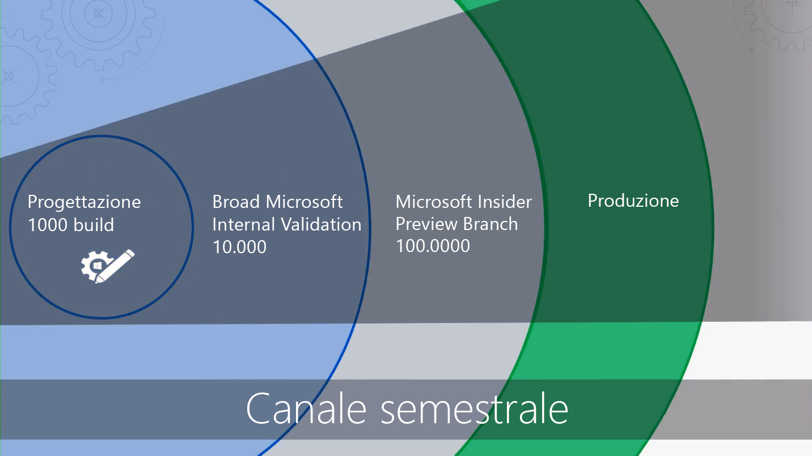

# Guida introduttiva - Distribuzione desktop

<table>
<thead>
<td></td>
<td>
<strong>Guida introduttiva: indicazioni su utenti, processi e tecnologia</strong>

Informazioni sui vantaggi offerti da Windows 10 e Office 365 ProPlus e sulle principali modifiche, considerazioni rispetto alle distribuzioni precedenti e procedure consigliate per una transizione a Windows 10 e Office 365 ProPlus priva di problemi.
</td>
<td></td>
</thead>
</table>

>[!NOTE]
>Questa serie illustra i modi migliori per usare gli strumenti esistenti e presenta le nuove tecnologie, i servizi e i metodi abilitati dal cloud.  Per vedere il processo di distribuzione desktop completo, visitare il [Centro distribuzione desktop](https://aka.ms/HowToShift).
>

Il Centro di distribuzione desktop contiene tutte le informazioni necessarie per pianificare ed effettuare il passaggio a Windows 10 e Office 365 ProPlus. Questo consentirà di usufruire di uno spazio di lavoro sicuro, basato sulle più recenti esperienze di produttività, lavoro in team e collaborazione.

Per chi non implementa nuovi ambienti desktop già da qualche tempo, la buona notizia è che il processo di distribuzione è fortemente migliorato. Gli ostacoli del passato, ad esempio la compatibilità delle applicazioni, sono stati ormai superati. Oggi è possibile affidarsi con serenità ai nuovi strumenti e alle nuove informazioni dettagliate fornite dal cloud per procedere in modo più rapido ed efficiente che mai.

Nella presente introduzione verrà descritto cosa è cambiato nel diagramma circolare del Desktop Deployment. Questo diagramma guiderà l'utente attraverso i passaggi consigliati per il passaggio a Windows 10 e Office 365 ProPlus, illustrando man mano come utilizzare al meglio gli strumenti e i processi esistenti, mediante l'adozione di tecnologie di gestione e approcci moderni.

## Scopo dell'aggiornamento

L'uso combinato di Windows 10 e Microsoft Intelligence Cloud consente di offrire agli utenti un'area di lavoro più efficiente e sicura, semplificando anche l'infrastruttura di supporto.

Uno degli imperativi chiave nell'ambito di una procedura di gestione moderna è mantenere i dispositivi sempre aggiornati. Questa serie illustra le nuove funzionalità disponibili per agevolare il passaggio a Windows 10 e Office 365 ProPlus e rimanere aggiornati grazie ai rilasci semestrali di entrambi.

[Windows 10 per IT Pro](https://www.microsoft.com/en-us/itpro/windows-10)

  [Informazioni su Office 365 ProPlus nell'azienda](https://docs.microsoft.com/it-IT/deployoffice/about-office-365-proplus-in-the-enterprise)

## Che cosa è cambiato

Iniziamo ad osservare cosa è cambiato ed è stato migliorato dall'ultima distribuzione desktop. Se non è stato cambiato l'ambiente desktop da qualche tempo, probabilmente si utilizza Windows 7 e Office 2010 o Office 2013. In tal caso, si noterà che alcune cose sono cambiate dall'ultimo aggiornamento principale (di seguito vengono riportati alcuni dei cambiamenti principali):

**Identità e accesso**. Windows 10 e Office 365 ProPlus, dotati di connettività a servizi cloud di gestione, produttività e sicurezza, hanno come nucleo centrale un nuovo servizio di gestione delle identità e degli accessi: Azure Active Directory (Azure AD), che consente Single Sign-On e connettività sicura tra i servizi cloud. Questo vuol dire che sarà necessario disporre di Azure AD per usufruire dei servizi di Microsoft 365 come Office 365, Intune o Windows Autopilot.

[Microsoft 365](https://www.microsoft.com/en-us/microsoft-365/default.aspx)

**Protezione dell'ambiente di preavvio:** il firmware UEFI a 64 bit sostituisce il BIOS. Questo non solo accelera i tempi di avvio, ma risulta anche necessario per abilitare molte delle moderne funzionalità di sicurezza di Windows 10. Windows 10 verrà eseguito su BIOS, tuttavia UEFI è fortemente consigliato. Se ancora non è stato effettuato il passaggio da BIOS a UEFI a 64-bit, questo è il momento giusto. Esistono strumenti che facilitano il passaggio sia durante che dopo l'aggiornamento a Windows 10.

**Gestione di dispositivi basata sul cloud**. Grazie a servizi come Microsoft Intune è possibile gestire i dispositivi Windows 10 proprio come gli altri dispositivi mobili, tutti da un'unica posizione. Ciò che rende unico Microsoft Intune è la possibilità di gestire contemporaneamente i dispositivi Windows 10 con System Center Configuration Manager. Si può usare System Center Configuration Manager per facilitare il passaggio a Windows 10 e quindi aggiungere Microsoft Intune. System Center Configuration Manager diventerà così una rete perimetrale intelligente all'interno dell'organizzazione, connesso al cloud intelligente Microsoft. In questo modo, sarà possibile gestire i dispositivi degli utenti in modo sicuro ovunque si trovino, che siano connessi all'infrastruttura aziendale o all'interno del cloud pubblico.

  [Gestione contemporanea di dispositivi Windows 10](https://docs.microsoft.com/it-IT/sccm/core/clients/manage/co-management-overview)

**Servizio di distribuzione basato sul cloud:** nei nuovi PC disponibili per l'acquisto è stato introdotto un nuovo servizio cloud per la distribuzione di dispositivi Microsoft 365. Si tratta del servizio di distribuzione Windows Autopilot. AutoPilot è integrato nei sistemi dei provider di hardware e i nuovi PC vengono registrati automaticamente in AutoPilot con la vendita all'utente finale. Alla prima accensione del PC, questo viene rapidamente configurato con la configurazione dell'organizzazione e può essere personalizzato in base a specifiche esigenze dell'utente.

[Windows Autopilot](https://www.microsoft.com/en-us/windowsforbusiness/windows-autopilot)

**Distribuzioni A portata di clic:** quando si esegue il provisioning delle app desktop di Office, Office 365 ProPlus rappresenta la scelta più appropriata. Consentirà di accedere alle più recenti innovazioni di Office man mano che vengono sviluppate, quindi non sarà necessario aspettare anni prima di ottenere nuove funzionalità. Inoltre, si userà una nuova installazione denominata A portata di clic.

L'installazione A portata di clic è molto diversa dai pacchetti basati su MSI del passato. È più veloce, più leggera e supporta gli aggiornamenti in background, per consentire agli utenti di essere operativi in pochi minuti e sempre aggiornati. Si tratta comunque di una copia locale di Office ed è possibile continuare a usare gli strumenti di distribuzione esistenti, come System Center Configuration Manager, per eseguire il provisioning e configurare le app.

  [Guida alla distribuzione per Office 365 ProPlus](https://docs.microsoft.com/it-IT/DeployOffice/deployment-guide-for-office-365-proplus)

**Aggiornamenti semestrali:** una volta effettuato il passaggio a Windows 10 e Office 365 ProPlus, ogni sei mesi verranno offerti aggiornamenti con nuove funzionalità. Poiché Microsoft è in grado di fornire informazioni dettagliate dal cloud per agevolare le operazioni, è possibile distribuire questi aggiornamenti a centinaia o migliaia di dispositivi in modo rapido e sicuro. Analogamente a un aggiornamento sul posto, un aggiornamento delle funzionalità conserva app, dati e configurazioni della versione precedente.

## Diagramma circolare del processo di distribuzione

Prima di iniziare, sarà necessario creare un piano di alto livello e coinvolgere gli sponsor necessari. Il diagramma circolare del processo di distribuzione delinea i passaggi critici che consentono di identificare i membri del team e le risorse principali da gestire nelle aree di implementazione seguenti.

**[Passaggio 1: preparazione di dispositivi e app](https://aka.ms/mdd1)** Per l'esito corretto della distribuzione, è necessario prima di tutto sapere cosa si ha a disposizione, ovvero fare un inventario di dispositivi e app e verificarne la compatibilità. A questo scopo è possibile usare gli strumenti disponibili nel servizio basato sul cloud Windows Analytics. Windows Analytics consente di sfruttare dati di compatibilità e di diagnostica raccolti da centinaia di milioni di PC, per valutare le app e i driver in esecuzione nel dispositivo in modo da poter stabilire lo stato di preparazione del desktop. È anche possibile esportare un elenco di "PC pronti per la distribuzione" da Windows Analytics a System Center Configuration Manager, se usato, per creare raccolte di PC specifici basate sui dati non appena disponibili.

  [Introduzione alla preparazione aggiornamenti](https://docs.microsoft.com/it-IT/windows/deployment/upgrade/upgrade-readiness-get-started)

**[Passaggio 2: preparazione di directory e rete](https://aka.ms/mdd2)** Se non è stato implementato Azure Active Directory per la gestione di identità e accessi, è il momento di farlo. Sarà inoltre necessario preparare la rete allo spostamento di immagini di sistema, pacchetti di applicazioni, file utente e aggiornamenti. Si tratta di una grande quantità di dati aggiuntivi e la rete deve avere la capacità di gestire questo carico extra senza alcun impatto sulla normale operatività dell'organizzazione. A tale scopo è disponibile una vasta gamma di funzionalità di ottimizzazione della rete, tra cui limitazione della larghezza di banda, opzioni peer-to-peer, scavenging dinamico della larghezza di banda e aggiornamento differenziale.

[BranchCache versus Peer cache](https://blogs.technet.microsoft.com/swisspfe/2018/01/25/branch-cache-vs-peer-cache/)

**[Passaggio 3: distribuzione di Office e app line-of-business](https://aka.ms/mdd3)** Pur continuando a supportare le installazioni basate su MSI, Windows ora supporta anche meccanismi di installazione più recenti, ottimizzati per la distribuzione automatizzata e gli aggiornamenti continui. I client Office 365 ProPlus e Windows 2019 usano la tecnologia di installazione A portata di clic. Tuttavia, si può decidere di rendere disponibile un'ampia gamma di app UWP e spesso si distribuiranno app di terze parti e app line-of-business sviluppate internamente che usano i nuovi pacchetti MSIX. Questo passaggio assicura che le app siano pronte per la distribuzione automatizzata e garantisce l'esito positivo indipendentemente dall'uso di A portata di clic, MSIX o MSI e anche se si tratta di app UWP distribuite da un'istanza di Microsoft Store per le aziende.

[Introduzione a MSIX](https://blogs.msdn.microsoft.com/sgern/2018/06/15/msix-intro/)

**[Passaggio 4: migrazione di impostazioni e file dell'utente](https://aka.ms/mdd4)**. Si tratta di un passaggio fondamentale in qualsiasi ciclo di sostituzione o aggiornamento del PC: è necessario garantire che i file, i dati e le impostazioni degli utenti vengano trasferiti correttamente e che vengano preservati durante la migrazione. Questo passaggio illustra le opzioni disponibili per le migrazioni manuali o automatizzate, comprese le opzioni già note e quelle nuove.

Analogamente a quanto accadeva negli aggiornamenti precedenti, l'Utilità di migrazione stato utente continua a essere uno strumento prezioso per automatizzare questo processo e rimane parte integrante delle migrazioni orchestrate mediante System Center Configuration Manager o Microsoft Deployment Toolkit. Tuttavia, spostare tutti questi dati durante la migrazione può rappresentare un collo di bottiglia e causare ritardi nella sostituzione dei PC, a causa della fisica coinvolta nel doppio trasferimento talvolta di centinaia di gigabyte per PC, prima dal desktop esistente, quindi al nuovo desktop. Una nuova opzione abilitata da OneDrive è la funzione di spostamento cartelle note, che sincronizza documenti, immagini e file desktop dell'utente su larga scala, nel cloud, prima della distribuzione.

  [Reindirizzare e spostare le cartelle note di Windows su OneDrive](https://docs.microsoft.com/it-IT/onedrive/redirect-known-folders)

**[Passaggio 5: sicurezza e conformità](https://aka.ms/mdd5)**. La sicurezza e la conformità sono caratteristiche molto vantaggiose del passaggio a Windows 10 e Office 365 ProPlus. È importante familiarizzare con le nuove funzionalità integrate e confrontarle con quelle già note. Ad esempio, le nuove funzionalità di Windows 10 che utilizzano la sicurezza basata sulla virtualizzazione possono prevenire il furto delle credenziali, proteggere dagli exploit basati su browser e dall'esecuzione di codice dannoso isolando i processi principali e le informazioni riservate dal sistema operativo. Inoltre, i servizi cloud come Advanced Threat Protection offrono una piattaforma unificata per la protezione della sicurezza, il rilevamento post-violazione, l'analisi e la risposta. Advanced Threat Protection può anche proteggere l'utente da allegati e-mail dannosi, collegamenti ipertestuali non sicuri e altro ancora.

[Protezione Microsoft](https://www.microsoft.com/en-us/security/default.aspx)

**[Passaggio 6: distribuzione del sistema operativo e aggiornamenti delle funzionalità](https://aka.ms/mdd6)**. Una volta preparato tutto, il passo successivo è quello di implementare le immagini del sistema operativo. È possibile eseguire le attività più complesse utilizzando sequenze di attività e infrastruttura System Center Configuration Manage. L'approccio consigliato consiste nell'implementazione in fasi, il per prima cosa individuando un "gruppo di utenti iniziali" dell'organizzazione su cui operare l'implementazione mediante un insieme rappresentativo di hardware e app. Quindi è possibile utilizzare i dati di tali dispositivi e utenti per individuare gradualmente un numero sempre maggiore di PC.

  [Introduzione all'implementazione del sistema operativo in System Center Configuration Manager](https://docs.microsoft.com/it-IT/sccm/osd/understand/introduction-to-operating-system-deployment)

**[Passaggio 7: Office e Windows as a Service](https://aka.ms/mdd7)**. Si tratta di un importante cambiamento nelle modalità di manutenzione dei desktop degli utenti. Con il passaggio a Windows 10 e Office 365 ProPlus è possibile passare alla gestione di Windows e Office as a Service, ovvero come servizio. Anziché implementare radicali cambiamenti tecnologici a intervalli di alcuni anni, si introdurranno continuamente nuove funzionalità, esperienze e sistemi di protezione. Gli aggiornamenti semestrali forniscono nuove funzionalità ogni anno in autunno e in primavera, mentre gli aggiornamenti qualitativi mensili conterranno correzioni di bug, per la sicurezza e per l'affidabilità. Anche se si può scegliere di distribuire il client di Office 2019, è decisamente consigliabile passare a Office 365 ProPlus, che segue un piano di servizio simile a Windows, quindi anche gli utenti ricevono regolarmente aggiornamenti per le app di Office.

  [Panoramica di Windows as a Service](https://docs.microsoft.com/it-IT/windows/deployment/update/waas-overview)
[Panoramica di Office as a Service](https://docs.microsoft.com/it-IT/DeployOffice/overview-of-update-channels-for-office-365-proplus)

**[Passaggio 8: comunicazioni e formazione degli utenti](https://aka.ms/mdd8)** Quest'ultimo passaggio è fondamentale per favorire l'utilizzo di nuove funzionalità volte a migliorare il lavoro in team, le comunicazioni, la sicurezza e altro ancora. Prima di estendere la distribuzione agli utenti al di fuori del cerchio degli early adopter, è consigliabile implementare una strategia di comunicazione e formazione degli utenti. Questo aiuterà a introdurre i cambiamenti desiderati nel modo in cui gli utenti si servono delle nuove funzionalità in Office, Windows o altre app e servizi line-of-business. Può risultare utile il servizio di formazione online gratuita tramite Microsoft FastTrack. Inoltre, sono stati pubblicati piani di comunicazione e sequenze temporali di esempio gratuiti, insieme a modelli di posta elettronica, social e Intranet per facilitare l'implementazione di Windows 10. Le organizzazioni di Microsoft 365 o Office 365 possono essere idonee anche per il supporto diretto.

## Passaggio successivo

Sono state illustrate le novità e i cambiamenti in Windows 10 e Office 365 ProPlus ed è stato esaminato il diagramma circolare del processo di distribuzione consigliato. A questo punto è possibile usare le linee guida end-to-end e gli strumenti disponibili per iniziare il passaggio a Windows 10 e Office 365 ProPlus.

## [Passaggio 1: conformità di dispositivi e app](https://aka.ms/mdd1)

