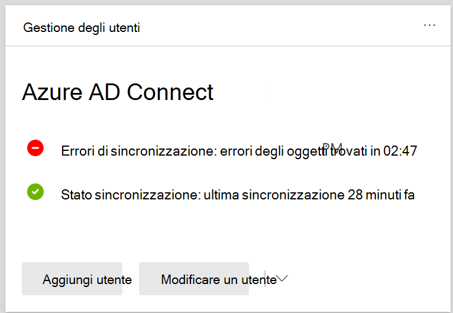

# Visualizzare gli errori di sincronizzazione della directory in Microsoft 365

È possibile visualizzare gli errori di sincronizzazione della directory nell'interfaccia di amministrazione di Microsoft 365. Vengono visualizzati solo gli errori dell'oggetto User. Per visualizzare gli errori con PowerShell, vedere [Identify objects with DirSyncProvisioningErrors](/azure/active-directory/hybrid/how-to-connect-syncservice-duplicate-attribute-resiliency).

## Visualizzare gli errori di sincronizzazione della directory nell'interfaccia di amministrazione di Microsoft 365

Per visualizzare eventuali errori nell'interfaccia di amministrazione di Microsoft 365:
  
1. Accedere all'interfaccia di amministrazione di [Microsoft 365](https://admin.microsoft.com) con un account amministratore globale. 
    
2. Nella **home** page verrà visualizzata la **scheda Gestione** utenti. 
    
    
  
3. Nella scheda scegliere Errori **di** sincronizzazione in **Azure AD Connect** per visualizzare gli errori nella pagina Errori di **sincronizzazione della** directory.   
    
    

4. Scegliere uno degli errori per visualizzare il riquadro dei dettagli con informazioni sull'errore e suggerimenti su come risolverlo.

   
  
Dopo la visualizzazione, vedere risoluzione dei problemi di sincronizzazione della directory per [Microsoft 365](fix-problems-with-directory-synchronization.md) per correggere eventuali problemi identificati.