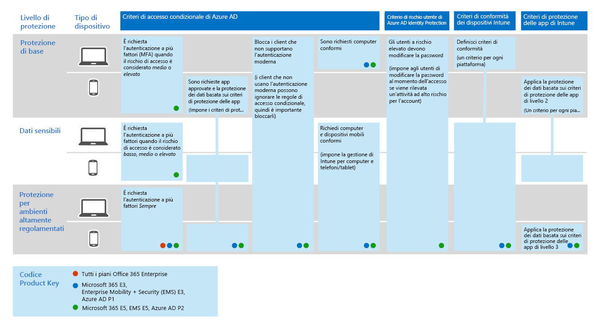

# Criteri comuni di identità e accesso dei dispositiviCommon identity and device access policies
In questo articolo vengono descritti i criteri comuni consigliati per garantire l'accesso ai servizi cloud, incluse le applicazioni locali pubblicate con il proxy di applicazione Azure AD.This article describes the common recommended policies for securing access to cloud services, including on-premises applications published with Azure AD Application Proxy. 

In questa guida viene descritto come distribuire i criteri consigliati in un ambiente di cui è stato eseguito un nuovo provisioning.This guidance discusses how to deploy the recommended policies in a newly-provisioned environment. La configurazione di questi criteri in un ambiente lab separato consente di comprendere e valutare i criteri consigliati prima di eseguire l'implementazione della distribuzione negli ambienti di preproduzione e di fabbricazione.Setting up these policies in a separate lab environment allows you to understand and evaluate the recommended policies before staging the rollout to your preproduction and production environments. Il nuovo ambiente di cui è stato effettuato il provisioning può essere solo cloud o ibrido.Your newly provisioned environment may be cloud-only or hybrid.  

## Set di criteriPolicy set 

Nel diagramma seguente viene illustrato il set di criteri consigliato.The following diagram illustrates the recommended set of policies. Indica il livello di protezione a cui si applica ogni criterio e se i criteri si applicano ai PC o ai telefoni e ai tablet oppure a entrambe le categorie di dispositivi.It shows which tier of protections each policy applies to and whether the policies apply to PCs or phones and tablets, or both categories of devices. Indica anche dove sono configurati questi criteri.It also indicates where these policies are configured.

 
 [vedere una versione più grande di questa immagine](https://github.com/MicrosoftDocs/microsoft-365-docs/raw/public/microsoft-365/media/Identity_device_access_policies_byplan.png)
[See a larger version of this image](https://github.com/MicrosoftDocs/microsoft-365-docs/raw/public/microsoft-365/media/Identity_device_access_policies_byplan.png)

Nella parte restante di questo articolo viene descritto come configurare questi criteri.The rest of this article describes how to configure these policies. 

L'utilizzo dell'autenticazione a più fattori è consigliato prima di registrare i dispositivi in Intune per garantire che il dispositivo sia in possesso dell'utente desiderato.Using multi-factor authentication is recommended before enrolling devices into Intune for assurance that the device is in the possession of the intended user. È inoltre necessario registrare i dispositivi in Intune prima di applicare i criteri di conformità del dispositivo.You must also enroll devices into Intune before enforcing device compliance policies.

Per ottenere il tempo necessario per eseguire queste attività, è consigliabile implementare i criteri di base nell'ordine indicato in questa tabella.To give you time to accomplish these tasks, we recommend implementing the baseline policies in the order listed in this table. Tuttavia, i criteri dell'AMF per la protezione sensibile e altamente regolamentata possono essere implementati in qualsiasi momento.However, the MFA policies for sensitive and highly regulated protection can be implemented at any time.

|Livello di protezioneProtection level|CriteriPolicies|Ulteriori informazioniMore information|
|:---------------|:-------|:----------------|
|**Protezione di base****Baseline**|[Richiedere l'AMF quando il rischio di accesso è *medio* o *elevato*Require MFA when sign-in risk is *medium* or *high*](#require-mfa-based-on-sign-in-risk)| |
|        |[Bloccare i client che non supportano l'autenticazione modernaBlock clients that don't support modern authentication](#block-clients-that-dont-support-modern-authentication)|I client che non utilizzano l'autenticazione moderna possono ignorare le regole di accesso condizionale, quindi è importante bloccarleClients that do not use modern authentication can bypass conditional access rules, so it's important to block these|
|        |[Gli utenti a rischio elevato devono modificare la passwordHigh risk users must change password](#high-risk-users-must-change-password)|Impone agli utenti di modificare la propria password al momento dell'accesso se viene rilevata un'attività ad alto rischio per il proprio accountForces users to change their password when signing in if high-risk activity is detected for their account|
|        |[Applicare i criteri di protezione dei dati dell'APPApply APP data protection policies](#apply-app-data-protection-policies)|Un criterio per ogni piattaforma (iOS, Android, Windows).One policy per platform (iOS, Android, Windows). I criteri di protezione delle app di Intune (APP) sono insiemi predefiniti di protezione, dal livello 1 al livello 3.Intune App Protection Policies (APP) are predefined sets of protection, from Level 1 to Level 3.|
|        |[Richiedere applicazioni approvate e protezione delle APPRequire approved apps and APP protection](#require-approved-apps-and-app-protection)|Applicazione della protezione delle app per dispositivi mobili per telefoni e TabletEnforces mobile app protection for phones and tablets|
|        |[Definire i criteri di conformità del dispositivoDefine device compliance policies](#define-device-compliance-policies)|Un criterio per ogni piattaformaOne policy for each platform|
|        |[Richiedere computer conformiRequire compliant PCs](#require-compliant-pcs-but-not-compliant-phones-and-tablets)|Impone la gestione di Intune dei PCEnforces Intune management of PCs|
|**Sensibili****Sensitive**|[Richiedere l'AMF quando il rischio di accesso è *basso*, *medio* o *alto*Require MFA when sign-in risk is *low*, *medium* or *high*](#require-mfa-based-on-sign-in-risk)| |
|         |[Richiedere PC conformi *e* dispositivi mobiliRequire compliant PCs *and* mobile devices](#require-compliant-pcs-and-mobile-devices)|Impone la gestione di Intune per PC e telefono/tabletEnforces Intune management for PCs and phone/tablets|
|**Riservatezza elevata****Highly regulated**|[Richiede *sempre* l'autenticazione Master*Always* require MFA](#require-mfa-based-on-sign-in-risk)|
| | |

## Assegnazione di criteri agli utentiAssigning policies to users
Prima di configurare i criteri, identificare i gruppi di Azure AD che si sta utilizzando per ogni livello di protezione.Before configuring policies, identify the Azure AD groups you are using for each tier of protection. In genere, la protezione di base si applica a tutti gli altri nell'organizzazione.Typically, baseline protection applies to everybody in the organization. Un utente incluso sia per la linea di base che per la protezione riservata avrà tutti i criteri di base applicati oltre ai criteri sensibili.A user who is included for both baseline and sensitive protection will have all the baseline policies applied plus the sensitive policies. La protezione è cumulativa e viene applicato il criterio più restrittivo.Protection is cumulative and the most restrictive policy is enforced. 

Una procedura consigliata consiste nel creare un gruppo di Azure AD per l'esclusione dell'accesso condizionale.A recommended practice is to create an Azure AD group for conditional access exclusion. Aggiungere questo gruppo a tutte le regole di accesso condizionale in "Escludi".Add this group to all of your conditional access rules under "Exclude". In questo modo si ottiene un metodo per fornire l'accesso a un utente durante la risoluzione dei problemi di accesso.This gives you a method to provide access to a user while you troubleshoot access issues. Questa procedura è consigliata solo come soluzione temporanea.This is recommended as a temporary solution only. Monitorare questo gruppo per le modifiche e verificare che il gruppo di esclusione venga utilizzato solo come previsto.Monitor this group for changes and be sure the exclusion group is being used only as intended. 

Nel diagramma seguente viene fornito un esempio di assegnazione degli utenti ed esclusioni.The following diagram provides an example of user assignment and exclusions.

Nella figura "il team del progetto Top Secret X" viene assegnato un criterio di accesso condizionale che richiede *sempre*l'autenticazione master.In the illustration the "Top secret project X team" is assigned a conditional access policy that requires MFA *always*. Essere giudiziosi quando si applicano livelli di protezione superiori agli utenti.Be judicious when applying higher levels of protection to users. I membri del team di progetto saranno tenuti a fornire due forme di autenticazione ogni volta che accedono, anche se non visualizzano contenuto fortemente regolamentato.Members of this project team will be required to provide two forms of authentication every time they log on, even if they are not viewing highly-regulated content.  

Tutti i gruppi di Azure AD creati come parte di questi suggerimenti devono essere creati come gruppi di Microsoft 365.All Azure AD groups created as part of these recommendations must be created as Microsoft 365 groups. Questa impostazione è particolarmente importante per la distribuzione di Azure Information Protection (AIP) quando si proteggono i documenti in SharePoint Online.This is specifically important for the deployment of Azure Information Protection (AIP) when securing documents in SharePoint Online.

## Richiedere l'autenticazione a più fattori basata sul rischio di accessoRequire MFA based on sign-in risk
Prima di richiedere l'utilizzo dell'AMF, utilizzare prima un criterio di registrazione di Identity Protection AMF per registrare gli utenti per l'AMF.Before requiring MFA, first use an Identity Protection MFA registration policy to register users for MFA. Dopo la registrazione degli utenti, è possibile imporre l'autenticazione dell'utente per l'accesso.After users are registered you can enforce MFA for sign-in. Il [lavoro prerequisito](identity-access-prerequisites.md) include la registrazione di tutti gli utenti con AMF.The [prerequisite work](identity-access-prerequisites.md) includes registering all users with MFA.

Per creare nuovi criteri di accesso condizionale:To create a new conditional access policy: 

1. Andare nel [portale di Azure](https://portal.azure.com) e accedere con le proprie credenziali.Go to the [Azure portal](https://portal.azure.com), and sign in with your credentials. Dopo aver eseguito l'accesso, è possibile visualizzare il dashboard di Azure.After you've successfully signed in, you see the Azure dashboard.

2. Scegliere **Azure Active Directory** dal menu a sinistra.Choose **Azure Active Directory** from the left menu.

3. Nella sezione **Sicurezza** scegliere **Accesso condizionale**.Under the **Security** section, choose **Conditional access**.

4. Scegliere **Nuovo criterio**.Choose **New policy**.

 Nelle tabelle seguenti vengono descritte le impostazioni dei criteri di accesso condizionale da implementare per questo criterio.The following tables describes the conditional access policy settings to implement for this policy.

**Assegnazioni****Assignments**

|TipoType|ProprietàProperties|ValoriValues|NoteNotes|
|:---|:---------|:-----|:----|
|Utenti e gruppiUsers and groups|IncludiInclude|Seleziona utenti e gruppi - Selezionare il gruppo di sicurezza specifico in cui sono contenuti gli utenti di destinazioneSelect users and groups – Select specific security group containing targeted users|Iniziare con il gruppo di sicurezza che include utenti pilotaStart with security group including pilot users|
||ExcludeExclude|Exception security group; service accounts (app identities) (Gruppo di sicurezza eccezione account del servizio (identità applicazione)Exception security group; service accounts (app identities)|Appartenenza modificata su base temporanea necessariaMembership modified on an as-needed temporary basis|
|App cloudCloud apps|IncludiInclude|Selezionare le app a cui si desidera applicare la regola.Select the apps you want this rule to apply to. Ad esempio, selezionare Exchange OnlineFor example, select Exchange Online||
|CondizioniConditions|ConfigurataConfigured|SìYes|Configurare in base all'ambiente e alle necessità specificiConfigure specific to your environment and needs|
|Rischio di accessoSign-in risk|Livello di rischioRisk level||Vedere le istruzioni riportate nella tabella seguenteSee the guidance in the following table|

**Rischio di accesso****Sign-in risk**

Applicare le impostazioni in base al livello di protezione che si desidera assegnare.Apply the settings based on the protection level you are targeting.

|ProprietàProperty|Livello di protezioneLevel of protection|ValoriValues|NoteNotes|
|:---|:---------|:-----|:----|
|Livello di rischioRisk level|Protezione di baseBaseline|Alto, medioHigh, medium|Controllare entrambiCheck both|
| |Dati sensibiliSensitive|Alto, medio e bassoHigh, medium, low|Controllare tutti e treCheck all three|
| |Riservatezza elevataHighly regulated| |Lasciare deselezionata tutte le opzioni per applicare sempre il MasterLeave all options unchecked to always enforce MFA|

**Controlli di accesso****Access controls**

|TipoType|ProprietàProperties|ValoriValues|NoteNotes|
|:---|:---------|:-----|:----|
|ConcessioneGrant|Concedi accessoGrant access|TrueTrue|Opzione selezionataSelected|
||Richiedi MFARequire MFA|TrueTrue|CheckCheck|
||Richiede che il dispositivo venga contrassegnato come conformeRequire device to be marked as compliant|FalsoFalse||
||Richiedere un dispositivo ibrido di Azure AD-joinRequire hybrid Azure AD-joined device|FalsoFalse||
||Richiedi app client approvataRequire approved client app|FalseFalse||
||Richiedi tutti i controlli selezionatiRequire all the selected controls|TrueTrue|Opzione selezionataSelected|

> [!NOTE]
> Assicurarsi di abilitare questo criterio, scegliendo **attivato.**Be sure to enable this policy, by choosing **On**. È inoltre consigliabile utilizzare lo strumento [What If](https://docs.microsoft.com/azure/active-directory/active-directory-conditional-access-whatif) per testare il criterio.Also consider using the [What if](https://docs.microsoft.com/azure/active-directory/active-directory-conditional-access-whatif) tool to test the policy.

## Bloccare i client che non supportano l'autenticazione modernaBlock clients that don't support modern authentication
1. Andare nel [portale di Azure](https://portal.azure.com) e accedere con le proprie credenziali.Go to the [Azure portal](https://portal.azure.com), and sign in with your credentials. Dopo aver eseguito l'accesso, è possibile visualizzare il dashboard di Azure.After you've successfully signed in, you see the Azure dashboard.

2. Scegliere **Azure Active Directory** dal menu a sinistra.Choose **Azure Active Directory** from the left menu.

3. Nella sezione **Sicurezza** scegliere **Accesso condizionale**.Under the **Security** section, choose **Conditional access**.

4. Scegliere **Nuovo criterio**.Choose **New policy**.

Nelle tabelle seguenti vengono descritte le impostazioni dei criteri di accesso condizionale da implementare per questo criterio.The following tables describes the conditional access policy settings to implement for this policy.

**Assegnazioni****Assignments**

|TipoType|ProprietàProperties|ValoriValues|NoteNotes|
|:---|:---------|:-----|:----|
|Utenti e gruppiUsers and groups|IncludiInclude|Seleziona utenti e gruppi - Selezionare il gruppo di sicurezza specifico in cui sono contenuti gli utenti di destinazioneSelect users and groups – Select specific security group containing targeted users|Iniziare con il gruppo di sicurezza che include utenti pilotaStart with security group including pilot users|
||ExcludeExclude|Exception security group; service accounts (app identities) (Gruppo di sicurezza eccezione account del servizio (identità applicazione)Exception security group; service accounts (app identities)|Appartenenza modificata su base temporanea a seconda delle necessitàMembership modified on an as needed temporary basis|
|App cloudCloud apps|IncludiInclude|Selezionare le app a cui si desidera applicare la regola.Select the apps you want this rule to apply to. Ad esempio, selezionare Exchange OnlineFor example, select Exchange Online||
|CondizioniConditions|ConfigurataConfigured|SìYes|Configurare le app clientConfigure Client apps|
|App clientClient apps|ConfigurataConfigured|SìYes|App per dispositivi mobili e client desktop, altri client (seleziona entrambi)Mobile apps and desktop clients, Other clients (select both)|

**Controlli di accesso****Access controls**

|TipoType|ProprietàProperties|ValoriValues|NoteNotes|
|:---|:---------|:-----|:----|
|ConcessioneGrant|Blocca accessoBlock access|TrueTrue|Opzione selezionataSelected|
||Richiedi MFARequire MFA|FalsoFalse||
||Richiede che il dispositivo venga contrassegnato come conformeRequire device to be marked as compliant|FalsoFalse||
||Richiedere un dispositivo ibrido di Azure AD-joinRequire hybrid Azure AD-joined device|FalsoFalse||
||Richiedi app client approvataRequire approved client app|FalseFalse||
||Richiedi tutti i controlli selezionatiRequire all the selected controls|TrueTrue|Opzione selezionataSelected|

> [!NOTE]
> Assicurarsi di abilitare questo criterio, scegliendo **attivato.**Be sure to enable this policy, by choosing **On**. È inoltre consigliabile utilizzare lo strumento [What If](https://docs.microsoft.com/azure/active-directory/active-directory-conditional-access-whatif) per testare il criterio.Also consider using the [What if](https://docs.microsoft.com/azure/active-directory/active-directory-conditional-access-whatif) tool to test the policy.

## Gli utenti a rischio elevato devono modificare la passwordHigh risk users must change password
Per assicurarsi che tutti gli account compromessi degli utenti a rischio elevato siano costretti a modificare la password durante l'accesso, è necessario applicare i criteri seguenti.To ensure that all high-risk users' compromised accounts are forced to perform a password change when signing-in, you must apply the following policy.

Accedere al [portale di Microsoft Azure (https://portal.azure.com)](https://portal.azure.com/) con le credenziali di amministratore e selezionare **Azure AD Identity Protection > Criteri di rischio utente**.Log in to the [Microsoft Azure portal (https://portal.azure.com)](https://portal.azure.com/) with your administrator credentials, and then navigate to **Azure AD Identity Protection > User Risk Policy**.

**Assegnazioni****Assignments**

|TipoType|ProprietàProperties|ValoriValues|NoteNotes|
|:---|:---------|:-----|:----|
|UsersUsers|IncludiInclude|Tutti gli utentiAll users|Opzione selezionataSelected|
||ExcludeExclude|NessunoNone||
|CondizioniConditions|Rischio utenteUser risk|AltaHigh|Opzione selezionataSelected|

**Controlli****Controls**

| TipoType | ProprietàProperties | ValoriValues                  | NoteNotes |
|:-----|:-----------|:------------------------|:------|
|      | AccessoAccess     | Consenti l'accessoAllow access            | TrueTrue  |
|      | AccessoAccess     | Richiedi modifica passwordRequire password change | TrueTrue  |

**Revisione:** non applicabile**Review:** not applicable

> [!NOTE]
> Assicurarsi di abilitare questo criterio, scegliendo **attivato.**Be sure to enable this policy, by choosing **On**. È inoltre consigliabile utilizzare lo strumento [What If](https://docs.microsoft.com/azure/active-directory/active-directory-conditional-access-whatif) per testare il criterioAlso consider using the [What if](https://docs.microsoft.com/azure/active-directory/active-directory-conditional-access-whatif) tool to test the policy

## Applicare i criteri di protezione dei dati dell'APPApply APP data protection policies
I criteri di protezione delle app definiscono le app consentite e le azioni che possono intraprendere con i dati dell'organizzazione.App Protection Policies (APP) define which apps are allowed and the actions they can take with your organization's data. Le scelte disponibili in APP consentono alle organizzazioni di adattare la protezione alle proprie esigenze specifiche.The choices available in APP enable organizations to tailor the protection to their specific needs. Per alcuni, potrebbe non essere evidente quali impostazioni dei criteri sono necessarie per implementare uno scenario completo.For some, it may not be obvious which policy settings are required to implement a complete scenario. Per aiutare le organizzazioni a dare priorità alla protezione avanzata dei client per dispositivi mobili, Microsoft ha introdotto la tassonomia per la propria APP Data Protection Framework per iOS e Android per la gestione delle app per dispositivi mobili.To help organizations prioritize mobile client endpoint hardening, Microsoft has introduced taxonomy for its APP data protection framework for iOS and Android mobile app management. 

L'APP Data Protection Framework è suddivisa in tre livelli di configurazione distinti, con ogni livello che si basa sul livello precedente:The APP data protection framework is organized into three distinct configuration levels, with each level building off the previous level: 

- **Enterprise Basic Data Protection** (Level 1) assicura che le app siano protette con un PIN e crittografate ed eseguano operazioni di cancellazione selettive.**Enterprise basic data protection** (Level 1) ensures that apps are protected with a PIN and encrypted and performs selective wipe operations. Per i dispositivi Android, questo livello convalida l'attestazione del dispositivo Android.For Android devices, this level validates Android device attestation. Si tratta di una configurazione entry level che fornisce un controllo di protezione dei dati simile nei criteri cassetta postale di Exchange Online e lo introduce e la popolazione dell'utente su APP.This is an entry level configuration that provides similar data protection control in Exchange Online mailbox policies and introduces IT and the user population to APP. 
- **Enterprise Enhanced Data Protection** (Level 2) introduce i meccanismi di prevenzione della perdita dei dati delle app e i requisiti minimi del sistema operativo.**Enterprise enhanced data protection** (Level 2) introduces APP data leakage prevention mechanisms and minimum OS requirements. Questa è la configurazione applicabile alla maggior parte degli utenti di dispositivi mobili che accedono ai dati del lavoro o della scuola.This is the configuration that is applicable to most mobile users accessing work or school data. 
- **Enterprise High Data Protection** (Level 3) introduce meccanismi avanzati per la protezione dei dati, la configurazione del pin avanzata e la difesa delle minacce per dispositivi mobili.**Enterprise high data protection** (Level 3) introduces advanced data protection mechanisms, enhanced PIN configuration, and APP Mobile Threat Defense. Questa configurazione è utile per gli utenti che accedono a dati ad alto rischio.This configuration is desirable for users that are accessing high risk data. 

Per visualizzare i suggerimenti specifici per ogni livello di configurazione e le app minime che devono essere protette, esaminare [Framework di protezione dei dati utilizzando i criteri di protezione delle app](https://docs.microsoft.com/mem/intune/apps/app-protection-framework).To see the specific recommendations for each configuration level and the minimum apps that must be protected, review [Data protection framework using app protection policies](https://docs.microsoft.com/mem/intune/apps/app-protection-framework). 

Utilizzando i principi descritti nelle configurazioni di [identità e accesso ai dispositivi](microsoft-365-policies-configurations.md), i livelli di linea di base e di protezione sensibili mappano in stretta collaborazione con le impostazioni di protezione dei dati avanzate di livello 2.Using the principles outlined in [Identity and device access configurations](microsoft-365-policies-configurations.md), the Baseline and Sensitive protection tiers map closely with the Level 2 enterprise enhanced data protection settings. Il livello di protezione altamente regolamentato è strettamente associato alle impostazioni di protezione dei dati aziendali di livello 3.The Highly regulated protection tier maps closely to the Level 3 enterprise high data protection settings.

|Livello di protezioneProtection level |Criteri di protezione delle appApp Protection Policy  |Ulteriori informazioniMore information  |
|---------|---------|---------|
|Protezione di baseBaseline     | [Protezione avanzata dei dati di livello 2Level 2 enhanced data protection](https://docs.microsoft.com/mem/intune/apps/app-protection-framework#level-2-enterprise-enhanced-data-protection)        | Le impostazioni dei criteri applicate nel livello 2 includono tutte le impostazioni dei criteri consigliate per il livello 1 e aggiungono o aggiornano solo le impostazioni dei criteri seguenti per implementare più controlli e una configurazione più sofisticata rispetto al livello 1.The policy settings enforced in level 2 include all the policy settings recommended for level 1 and only adds to or updates the below policy settings to implement more controls and a more sophisticated configuration than level 1.         |
|Dati sensibiliSensitive     | [Protezione avanzata dei dati di livello 2Level 2 enhanced data protection](https://docs.microsoft.com/mem/intune/apps/app-protection-framework#level-2-enterprise-enhanced-data-protection)        | Le impostazioni dei criteri applicate nel livello 2 includono tutte le impostazioni dei criteri consigliate per il livello 1 e aggiungono o aggiornano solo le impostazioni dei criteri seguenti per implementare più controlli e una configurazione più sofisticata rispetto al livello 1.The policy settings enforced in level 2 include all the policy settings recommended for level 1 and only adds to or updates the below policy settings to implement more controls and a more sophisticated configuration than level 1.        |
|Altamente regolamentatoHighly Regulated     | [Livello 3 Enterprise High Data ProtectionLevel 3 enterprise high data protection](https://docs.microsoft.com/mem/intune/apps/app-protection-framework#level-3-enterprise-high-data-protection)        | Le impostazioni dei criteri applicate nel livello 3 includono tutte le impostazioni dei criteri consigliate per il livello 1 e 2 e aggiungono o aggiornano solo le impostazioni dei criteri seguenti per implementare più controlli e una configurazione più sofisticata rispetto al livello 2.The policy settings enforced in level 3 include all the policy settings recommended for level 1 and 2 and only adds to or updates the below policy settings to implement more controls and a more sophisticated configuration than level 2.        |

Per creare un nuovo criterio di protezione delle app per ogni piattaforma (iOS e Android) all'interno di Microsoft Endpoint Manager utilizzando le impostazioni del Framework di protezione dei dati, gli amministratori possono:To create a new app protection policy for each platform (iOS and Android) within Microsoft Endpoint Manager using the data protection framework settings, administrators can:
1. Creare manualmente i criteri attenendosi alla procedura illustrata in [come creare e distribuire i criteri di protezione delle app con Microsoft Intune](https://docs.microsoft.com/mem/intune/apps/app-protection-policies).Manually create the policies by following the steps in [How to create and deploy app protection policies with Microsoft Intune](https://docs.microsoft.com/mem/intune/apps/app-protection-policies). 
2. Importare i [modelli JSON del Framework di configurazione di criteri di protezione delle app](https://github.com/microsoft/Intune-Config-Frameworks/tree/master/AppProtectionPolicies) di esempio Intune con [gli script di PowerShell di Intune](https://github.com/microsoftgraph/powershell-intune-samples).Import the sample [Intune App Protection Policy Configuration Framework JSON templates](https://github.com/microsoft/Intune-Config-Frameworks/tree/master/AppProtectionPolicies) with [Intune's PowerShell scripts](https://github.com/microsoftgraph/powershell-intune-samples).

## Richiedere applicazioni approvate e protezione delle APPRequire approved apps and APP protection
Per applicare i criteri di protezione delle APP applicati in Intune, è necessario creare una regola di accesso condizionale per richiedere le app client approvate e le condizioni impostate nei criteri di protezione delle APP.To enforce the APP protection policies you applied in Intune, you must create a conditional access rule to require approved client apps and the conditions set in the APP protection policies. 

L'applicazione dei criteri di protezione delle APP richiede un insieme di criteri descritti in in [Richiedi criteri di protezione delle app per l'accesso alle app cloud con accesso condizionale](https://docs.microsoft.com/azure/active-directory/conditional-access/app-protection-based-conditional-access).Enforcing APP protection policies requires a set of policies described in in [Require app protection policy for cloud app access with Conditional Access](https://docs.microsoft.com/azure/active-directory/conditional-access/app-protection-based-conditional-access). Questi criteri sono inclusi in questo set consigliato di criteri di configurazione di identità e accesso.These policies are each included in this recommended set of identity and access configuration policies.

Per creare la regola di accesso condizionale che richiede applicazioni approvate e protezione delle APP, seguire "passaggio 1: configurare un criterio di accesso condizionale di Azure AD per Microsoft 365" nello [scenario 1: le app microsoft 365 richiedono app approvate con i criteri di protezione delle app](https://docs.microsoft.com/azure/active-directory/conditional-access/app-protection-based-conditional-access#scenario-1-office-365-apps-require-approved-apps-with-app-protection-policies), che consentono a Outlook per iOS e Android, ma blocca i client Exchange ActiveSync in grado di connettersi a ExchangeTo create the conditional access rule that requires approved apps and APP protection, follow "Step 1: Configure an Azure AD Conditional Access policy for Microsoft 365" in [Scenario 1: Microsoft 365 apps require approved apps with app protection policies](https://docs.microsoft.com/azure/active-directory/conditional-access/app-protection-based-conditional-access#scenario-1-office-365-apps-require-approved-apps-with-app-protection-policies), which allows Outlook for iOS and Android, but blocks OAuth capable Exchange ActiveSync clients from connecting to Exchange Online.

   > [!NOTE]
   > Questo criterio garantisce agli utenti mobili la possibilità di accedere a tutti gli endpoint di Office utilizzando le app applicabili.This policy ensures mobile users can access all Office endpoints using the applicable apps.

Se si sta abilitando l'accesso mobile a Exchange Online, implementare [i client Block ActiveSync](secure-email-recommended-policies.md#block-activesync-clients), impedendo ai client Exchange ActiveSync di sfruttare l'autenticazione di base di connettersi a Exchange Online.If you are enabling mobile access to Exchange Online, implement [Block ActiveSync clients](secure-email-recommended-policies.md#block-activesync-clients), which prevents Exchange ActiveSync clients leveraging basic authentication from connecting to Exchange Online. Questo criterio non è illustrato nella figura all'inizio di questo articolo.This policy is not pictured in the illustration at the top of this article. Viene descritto e illustrato nei [criteri consigliati per la protezione della posta elettronica](secure-email-recommended-policies.md).It is described and pictured in [Policy recommendations for securing email](secure-email-recommended-policies.md).

 Questi criteri sfruttano i controlli di concessione [richiedono l'applicazione client approvata](https://docs.microsoft.com/azure/active-directory/conditional-access/concept-conditional-access-grant#require-approved-client-app) e [richiedono criteri di protezione delle app](https://docs.microsoft.com/azure/active-directory/conditional-access/concept-conditional-access-grant#require-app-protection-policy).These policies leverage the grant controls [Require approved client app](https://docs.microsoft.com/azure/active-directory/conditional-access/concept-conditional-access-grant#require-approved-client-app) and [Require app protection policy](https://docs.microsoft.com/azure/active-directory/conditional-access/concept-conditional-access-grant#require-app-protection-policy).

Infine, il blocco dell'autenticazione legacy per altre app client su dispositivi iOS e Android garantisce che questi client non possano ignorare le regole di accesso condizionale.Finally, blocking legacy authentication for other client apps on iOS and Android devices ensures that these clients cannot bypass conditional access rules. Se si seguono le indicazioni riportate in questo articolo, sono già stati configurati i [client di blocco che non supportano l'autenticazione moderna](#block-clients-that-dont-support-modern-authentication).If you're following the guidance in this article, you've already configured [Block clients that don't support modern authentication](#block-clients-that-dont-support-modern-authentication).

<!---
With Conditional Access, organizations can restrict access to approved (modern authentication capable) iOS and Android client apps with Intune app protection policies applied to them. Several conditional access policies are required, with each policy targeting all potential users. Details on creating these policies can be found in [Require app protection policy for cloud app access with Conditional Access](https://docs.microsoft.com/azure/active-directory/conditional-access/app-protection-based-conditional-access).

1. Follow "Step 1: Configure an Azure AD Conditional Access policy for Microsoft 365" in [Scenario 1: Microsoft 365 apps require approved apps with app protection policies](https://docs.microsoft.com/azure/active-directory/conditional-access/app-protection-based-conditional-access#scenario-1-office-365-apps-require-approved-apps-with-app-protection-policies), which allows Outlook for iOS and Android, but blocks OAuth capable Exchange ActiveSync clients from connecting to Exchange Online.

   > [!NOTE]
   > This policy ensures mobile users can access all Office endpoints using the applicable apps.

2. If enabling mobile access to Exchange Online, implement [Block ActiveSync clients](secure-email-recommended-policies.md#block-activesync-clients), which prevents Exchange ActiveSync clients leveraging basic authentication from connecting to Exchange Online.

   The above policies leverage the grant controls [Require approved client app](https://docs.microsoft.com/azure/active-directory/conditional-access/concept-conditional-access-grant#require-approved-client-app) and [Require app protection policy](https://docs.microsoft.com/azure/active-directory/conditional-access/concept-conditional-access-grant#require-app-protection-policy).

3. Disable legacy authentication for other client apps on iOS and Android devices. For more information, see [Block clients that don't support modern authentication](#block-clients-that-dont-support-modern-authentication).
-->

## Definire i criteri di conformità del dispositivoDefine device-compliance policies

I criteri di conformità del dispositivo definiscono i requisiti ai quali i dispositivi devono attenersi per essere contrassegnati come conformi.Device-compliance policies define the requirements that devices must adhere to in order to be marked as compliant. Creare criteri di conformità del dispositivo Intune all'interno dell'interfaccia di amministrazione di Microsoft Endpoint Manager.Create Intune device compliance policies from within the Microsoft Endpoint Manager admin center.

Creare un criterio per ogni piattaforma:Create a policy for each platform:
- Amministratore del dispositivo AndroidAndroid device administrator
- Android EnterpriseAndroid Enterprise
- iOS/iPadosiOS/iPadOS
- macOSmacOS
- Windows Phone 8.1Windows Phone 8.1
- Windows 8,1 e versioni successiveWindows 8.1 and later
- Windows 10 e versioni successiveWindows 10 and later

Per creare criteri di conformità dei dispositivi, accedere all'interfaccia di [amministrazione di Microsoft Endpoint Manager](https://go.microsoft.com/fwlink/?linkid=2109431) con le proprie credenziali di amministrazione e quindi passare ai criteri criteri di conformità per i **dispositivi**  >  **Compliance policies**  >  **Policies**.To create device compliance policies, log in to the [Microsoft Endpoint Manager Admin Center](https://go.microsoft.com/fwlink/?linkid=2109431) with your administer credentials, and then navigate to **Devices** > **Compliance policies** > **Policies**. Selezionare **Crea criterio**.Select **Create Policy**.

Per distribuire i criteri di conformità dei dispositivi, è necessario assegnarli ai gruppi di utenti.For device compliance policies to be deployed, they must be assigned to user groups. Si assegna un criterio dopo aver creato e salvato.You assign a policy after you create and save it. Nell'interfaccia di amministrazione, selezionare il criterio e quindi selezionare **assegnazioni**.In the admin center, select the policy and then select **Assignments**. Dopo aver selezionato i gruppi che si desidera ricevere, fare clic su **Salva** per salvare l'assegnazione del gruppo e distribuire il criterio.After selecting the groups that you want to receive the policy, select **Save** to save that group assignment and deploy the policy.

Per istruzioni dettagliate sulla creazione di criteri di conformità in Intune, vedere [creare un criterio di conformità in Microsoft Intune](https://docs.microsoft.com/mem/intune/protect/create-compliance-policy) nella documentazione di Intune.For step-by-step guidance on creating compliance policies in Intune, see [Create a compliance policy in Microsoft Intune](https://docs.microsoft.com/mem/intune/protect/create-compliance-policy) in the Intune documentation.

Le impostazioni seguenti sono consigliate per Windows 10.The following settings are recommended for Windows 10.

**Integrità del dispositivo: regole di valutazione del servizio di attestazione integrità di Windows****Device health: Windows Health Attestation Service evaluation rules**

|ProprietàProperties|ValoriValues|NoteNotes|
|:---------|:-----|:----|
|Richiedere BitLockerRequire BitLocker|RichiedonoRequire||
|Richiedi l'abilitazione dell'avvio sicuro sul dispositivoRequire Secure Boot to be enabled on the device|RichiedonoRequire||
|Richiedi integrità del codiceRequire code integrity|RichiedonoRequire||

**Proprietà del dispositivo****Device properties**

|TipoType|ProprietàProperties|ValoriValues|NoteNotes|
|:---|:---------|:-----|:----|
|Versione del sistema operativoOperating system version|TuttoAll|Non configurataNot configured||

**Protezione del sistema****System security**

|TipoType|ProprietàProperties|ValoriValues|NoteNotes|
|:---|:---------|:-----|:----|
|PasswordPassword|Richiedere una password per sbloccare i dispositivi mobiliRequire a password to unlock mobile devices|RichiedonoRequire||
||Password sempliciSimple passwords|BloccaBlock||
||Tipo di passwordPassword type|Impostazione predefinita del dispositivoDevice default||
||Lunghezza minima passwordMinimum password length|6 6||
||Numero massimo di minuti di inattività prima che sia necessaria la passwordMaximum minutes of inactivity before password is required|15 15|Questa impostazione è supportata per le versioni Android 4,0 e successive o per KNOX 4,0 o versione precedente.This setting is supported for Android versions 4.0 and above or KNOX 4.0 and above. Per i dispositivi iOS, è supportato per iOS 8,0 e superioriFor iOS devices, it's supported for iOS 8.0 and above|
||Scadenza password (giorni)Password expiration (days)|4141||
||Numero di password precedenti per impedire il riutilizzoNumber of previous passwords to prevent reuse|5 5||
||Richiedi password quando il dispositivo ritorna dallo stato di inattività (mobile e olografico)Require password when device returns from idle state (Mobile and Holographic)|RichiedonoRequire|Disponibile per Windows 10 e versioni successiveAvailable for Windows 10 and later|
|CrittografiaEncryption|Crittografia dell'archiviazione dei dati nel dispositivoEncryption of data storage on device|RichiedonoRequire||
|Sicurezza del dispositivoDevice Security|FirewallFirewall|RichiedonoRequire||
||AntivirusAntivirus|RichiedonoRequire||
||AntispywareAntispyware|RichiedonoRequire|Questa impostazione richiede una soluzione anti-spyware registrata con Centro sicurezza WindowsThis setting requires an Anti-Spyware solution registered with Windows Security Center|
|DifensoreDefender|Antimalware di Microsoft DefenderMicrosoft Defender Antimalware|RichiedonoRequire||
||Versione minima di Microsoft Defender antimalwareMicrosoft Defender Antimalware minimum version||Supportato solo per il desktop di Windows 10.Only supported for Windows 10 desktop. Microsoft consiglia le versioni non superiori a cinque rispetto alla versione più recenteMicrosoft recommends versions no more than five behind from the most recent version|
||Firma antimalware di Microsoft Defender aggiornatoMicrosoft Defender Antimalware signature up to date|RichiedonoRequire||
||Protezione in tempo realeReal-time protection|RichiedonoRequire|Supportato solo per il desktop di Windows 10Only supported for Windows 10 desktop|

**Microsoft Defender ATP****Microsoft Defender ATP**

|TipoType|ProprietàProperties|ValoriValues|NoteNotes|
|:---|:---------|:-----|:----|
|Regole di protezione avanzata dalle minacce di Microsoft DefenderMicrosoft Defender Advanced Threat Protection rules|Richiedere che il dispositivo sia a o sotto il Punteggio di rischio del computerRequire the device to be at or under the machine-risk score|MediaMedium||

## Richiedere PC conformi (ma non conformi a telefoni e Tablet)Require compliant PCs (but not compliant phones and tablets)
Prima di aggiungere un criterio per richiedere PC conformi, assicurarsi di registrare i dispositivi per la gestione in Intune.Before adding a policy to require compliant PCs, be sure to enroll devices for management into Intune. L'utilizzo dell'autenticazione a più fattori è consigliato prima di registrare i dispositivi in Intune per garantire che il dispositivo sia in possesso dell'utente desiderato.Using multi-factor authentication is recommended before enrolling devices into Intune for assurance that the device is in the possession of the intended user. 

Per richiedere PC conformi:To require compliant PCs:

1. Andare nel [portale di Azure](https://portal.azure.com) e accedere con le proprie credenziali.Go to the [Azure portal](https://portal.azure.com), and sign in with your credentials. Dopo aver eseguito l'accesso, è possibile visualizzare il dashboard di Azure.After you've successfully signed in, you see the Azure dashboard.

2. Scegliere **Azure Active Directory** dal menu a sinistra.Choose **Azure Active Directory** from the left menu.

3. Nella sezione **Sicurezza** scegliere **Accesso condizionale**.Under the **Security** section, choose **Conditional access**.

4. Scegliere **Nuovo criterio**.Choose **New policy**.

5. Immettere un nome per i criteri, quindi in **Utenti e gruppi** scegliere gli utenti e i gruppi ai quali applicare i criteri.Enter a policy name, then choose the **Users and groups** you want to apply the policy for.

6. Scegliere **App cloud**.Choose **Cloud apps**.

7. Scegliere **Seleziona app**, selezionare le app desiderate nell'elenco delle **app Cloud** .Choose **Select apps**, select the desired apps from the **Cloud apps** list. Ad esempio, selezionare Exchange Online.For example, select Exchange Online. Scegliere **Seleziona** e **Chiudi**.Choose **Select** and **Done**.

8. Per richiedere PC conformi, ma non conformi a telefoni e tablet, scegliere **condizioni** e **piattaforme dispositivo**.To require compliant PCs, but not compliant phones and tablets, choose **Conditions** and **Device platforms**. Scegliere **Seleziona piattaforme dispositivo** e selezionare **Windows** e **MacOS**.Choose **Select device platforms** and select **Windows** and **macOS**.

9. Scegliere **Concedi** nella sezione **Controlli di accesso**.Choose **Grant** from the **Access controls** section.

10. Scegliere **Concedi accesso**, selezionare **Richiedi dispositivo da contrassegnare come conforme**.Choose **Grant access**, select **Require device to be marked as compliant**. Per più controlli, selezionare **Richiedi tutti i controlli selezionati**, quindi scegliere **Seleziona**.For multiple controls, select **Require all the selected controls**, then choose **Select**. 

11. 	Selezionare *\*Crea*\*.Choose **Create**.

Se l'obiettivo è quello di richiedere PC conformi *e* dispositivi mobili, non selezionare piattaforme.If your objective is to require compliant PCs *and* mobile devices, do not select platforms. Questo impone la conformità per tutti i dispositivi.This enforces compliance for all devices. 

## Richiedere PC conformi *e* dispositivi mobiliRequire compliant PCs *and* mobile devices

Per richiedere la conformità per tutti i dispositivi:To require compliance for all devices:

1. Andare nel [portale di Azure](https://portal.azure.com) e accedere con le proprie credenziali.Go to the [Azure portal](https://portal.azure.com), and sign in with your credentials. Dopo aver eseguito l'accesso, è possibile visualizzare il dashboard di Azure.After you've successfully signed in, you see the Azure dashboard.

2. Scegliere **Azure Active Directory** dal menu a sinistra.Choose **Azure Active Directory** from the left menu.

3. Nella sezione **Sicurezza** scegliere **Accesso condizionale**.Under the **Security** section, choose **Conditional access**.

4. Scegliere **Nuovo criterio**.Choose **New policy**.

5. Immettere un nome per i criteri, quindi in **Utenti e gruppi** scegliere gli utenti e i gruppi ai quali applicare i criteri.Enter a policy name, then choose the **Users and groups** you want to apply the policy for.

6. Scegliere **App cloud**.Choose **Cloud apps**.

7. Scegliere **Seleziona app**, selezionare le app desiderate nell'elenco delle **app Cloud** .Choose **Select apps**, select the desired apps from the **Cloud apps** list. Ad esempio, selezionare Exchange Online.For example, select Exchange Online. Scegliere **Seleziona** e **Chiudi**.Choose **Select** and **Done**.

8. Scegliere **Concedi** nella sezione **Controlli di accesso**.Choose **Grant** from the **Access controls** section.

9. Scegliere **Concedi accesso**, selezionare **Richiedi dispositivo da contrassegnare come conforme**.Choose **Grant access**, select **Require device to be marked as compliant**. Per più controlli, selezionare **Richiedi tutti i controlli selezionati**, quindi scegliere **Seleziona**.For multiple controls, select **Require all the selected controls**, then choose **Select**. 

10. 	Selezionare *\*Crea*\*.Choose **Create**.

Quando si crea questo criterio, non selezionare piattaforme.When creating this policy, do not select platforms. Questo impone i dispositivi conformi.This enforces compliant devices.

## Passaggi successiviNext steps

[Learn about policy recommendations for securing email](secure-email-recommended-policies.md) (Informazioni sui criteri consigliati per la protezione della posta elettronica)[Learn about policy recommendations for securing email](secure-email-recommended-policies.md)
