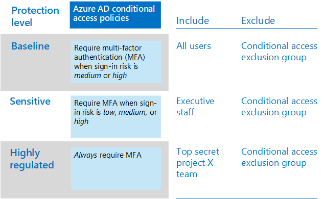

# Criteri comuni di identità e accesso dei dispositiviCommon identity and device access policies
In questo articolo vengono descritti i criteri comuni consigliati per garantire l'accesso ai servizi cloud, incluse le applicazioni locali pubblicate con il proxy di applicazione Azure AD.This article describes the common recommended policies for securing access to cloud services, including on-premises applications published with Azure AD Application Proxy. 

In questa guida viene descritto come distribuire i criteri consigliati in un ambiente di cui è stato eseguito un nuovo provisioning.This guidance discusses how to deploy the recommended policies in a newly-provisioned environment. La configurazione di questi criteri in un ambiente lab separato consente di comprendere e valutare i criteri consigliati prima di eseguire l'implementazione della distribuzione negli ambienti di preproduzione e di fabbricazione.Setting up these policies in a separate lab environment allows you to understand and evaluate the recommended policies before staging the rollout to your preproduction and production environments. Il nuovo ambiente di cui è stato effettuato il provisioning può essere solo cloud o ibrido.Your newly provisioned environment may be cloud-only or hybrid.  

## Set di criteriPolicy set 

Nel diagramma seguente viene illustrato il set di criteri consigliato.The following diagram illustrates the recommended set of policies. Indica il livello di protezione a cui si applica ogni criterio e se i criteri si applicano ai PC o ai telefoni e ai tablet oppure a entrambe le categorie di dispositivi.It shows which tier of protections each policy applies to and whether the policies apply to PCs or phones and tablets, or both categories of devices. Indica anche dove sono configurati questi criteri.It also indicates where these policies are configured.

Nella parte restante di questo articolo viene descritto come configurare questi criteri.The rest of this article describes how to configure these policies. 

L'utilizzo dell'autenticazione a più fattori è consigliato prima di registrare i dispositivi in Intune per garantire che il dispositivo sia in possesso dell'utente desiderato.Using multi-factor authentication is recommended before enrolling devices into Intune for assurance that the device is in the possession of the intended user. È inoltre necessario registrare i dispositivi in Intune prima di applicare i criteri di conformità del dispositivo.You must also enroll devices into Intune before enforcing device compliance policies.

Per ottenere il tempo necessario per eseguire queste attività, è consigliabile implementare i criteri di base nell'ordine indicato in questa tabella.To give you time to accomplish these tasks, we recommend implementing the baseline policies in the order listed in this table. Tuttavia, i criteri dell'AMF per la protezione sensibile e altamente regolamentata possono essere implementati in qualsiasi momento.However, the MFA policies for sensitive and highly regulated protection can be implemented at any time.

|Livello di protezioneProtection level|GeneraliPolicies|Altre informazioniMore information|
|:---------------|:-------|:----------------|
|**Base****Baseline**|[Richiedere l'AMF quando il rischio di accesso è *medio* o *elevato*Require MFA when sign-in risk is *medium* or *high*](#require-mfa-based-on-sign-in-risk)| |
|        |[Bloccare i client che non supportano l'autenticazione modernaBlock clients that don't support modern authentication](#block-clients-that-dont-support-modern-authentication)|I client che non utilizzano l'autenticazione moderna possono ignorare le regole di accesso condizionale, quindi è importante bloccarleClients that do not use modern authentication can bypass conditional access rules, so it's important to block these|
|        |[Gli utenti ad alto rischio devono modificare la passwordHigh risk users must change password](#high-risk-users-must-change-password)|Impone agli utenti di modificare la propria password al momento dell'accesso se viene rilevata un'attività ad alto rischio per il proprio accountForces users to change their password when signing in if high-risk activity is detected for their account|
|        |[Definire i criteri di protezione delle appDefine app protection policies](#define-app-protection-policies)|Un criterio per ogni piattaforma (iOS, Android, Windows).One policy per platform (iOS, Android, Windows).|
|        |[Richiedere applicazioni approvateRequire approved apps](#require-approved-apps)|Applicazione della protezione delle app per dispositivi mobili per telefoni e TabletEnforces mobile app protection for phones and tablets|
|        |[Definire i criteri di conformità del dispositivoDefine device compliance policies](#define-device-compliance-policies)|Un criterio per ogni piattaformaOne policy for each platform|
|        |[Richiedi PC conformiRequire compliant PCs](#require-compliant-pcs-but-not-compliant-phones-and-tablets)|Impone la gestione di Intune dei PCEnforces Intune management of PCs|
|**Dati sensibili****Sensitive**|[Richiedere l'AMF quando il rischio di accesso è *basso*, *medio* o *alto*Require MFA when sign-in risk is *low*, *medium* or *high*](#require-mfa-based-on-sign-in-risk)| |
|         |[Richiedere PC conformi *e* dispositivi mobiliRequire compliant PCs *and* mobile devices](#require-compliant-pcs-and-mobile-devices)|Impone la gestione di Intune per PC e telefono/tabletEnforces Intune management for PCs and phone/tablets|
|**Altamente regolamentato****Highly regulated**|[Richiede *sempre* l'autenticazione Master*Always* require MFA](#require-mfa-based-on-sign-in-risk)|
| | |

## Assegnazione di criteri agli utentiAssigning policies to users
Prima di configurare i criteri, identificare i gruppi di Azure AD che si sta utilizzando per ogni livello di protezione.Before configuring policies, identify the Azure AD groups you are using for each tier of protection. In genere, la protezione di base si applica a tutti gli altri nell'organizzazione.Typically, baseline protection applies to everybody in the organization. Un utente incluso sia per la linea di base che per la protezione riservata avrà tutti i criteri di base applicati oltre ai criteri sensibili.A user who is included for both baseline and sensitive protection will have all the baseline policies applied plus the sensitive policies. La protezione è cumulativa e viene applicato il criterio più restrittivo.Protection is cumulative and the most restrictive policy is enforced. 

Una procedura consigliata consiste nel creare un gruppo di Azure AD per l'esclusione dell'accesso condizionale.A recommended practice is to create an Azure AD group for conditional access exclusion. Aggiungere questo gruppo a tutte le regole di accesso condizionale in "Escludi".Add this group to all of your conditional access rules under "Exclude". In questo modo si ottiene un metodo per fornire l'accesso a un utente durante la risoluzione dei problemi di accesso.This gives you a method to provide access to a user while you troubleshoot access issues. Questa procedura è consigliata solo come soluzione temporanea.This is recommended as a temporary solution only. Monitorare questo gruppo per le modifiche e verificare che il gruppo di esclusione venga utilizzato solo come previsto.Monitor this group for changes and be sure the exclusion group is being used only as intended. 

Nel diagramma seguente viene fornito un esempio di assegnazione degli utenti ed esclusioni.The following diagram provides an example of user assignment and exclusions.

Nella figura "il team del progetto Top Secret X" viene assegnato un criterio di accesso condizionale che richiede *sempre*l'autenticazione master.In the illustration the "Top secret project X team" is assigned a conditional access policy that requires MFA *always*. Essere giudiziosi quando si applicano livelli di protezione superiori agli utenti.Be judicious when applying higher levels of protection to users. I membri del team di progetto saranno tenuti a fornire due forme di autenticazione ogni volta che accedono, anche se non visualizzano contenuto fortemente regolamentato.Members of this project team will be required to provide two forms of authentication every time they log on, even if they are not viewing highly-regulated content.  

Tutti i gruppi di Azure AD creati come parte di questi suggerimenti devono essere creati come gruppi di Office 365.All Azure AD groups created as part of these recommendations must be created as Office 365 groups. Questa impostazione è particolarmente importante per la distribuzione di Azure Information Protection (AIP) quando si proteggono i documenti in SharePoint Online.This is specifically important for the deployment of Azure Information Protection (AIP) when securing documents in SharePoint Online.

## Richiedere l'autenticazione a più fattori basata sul rischio di accessoRequire MFA based on sign-in risk
Prima di richiedere l'utilizzo dell'AMF, utilizzare prima un criterio di registrazione di Identity Protection AMF per registrare gli utenti per l'AMF.Before requiring MFA, first use an Identity Protection MFA registration policy to register users for MFA. Dopo la registrazione degli utenti, è possibile imporre l'autenticazione dell'utente per l'accesso.After users are registered you can enforce MFA for sign-in. Il [lavoro prerequisito](identity-access-prerequisites.md) include la registrazione di tutti gli utenti con AMF.The [prerequisite work](identity-access-prerequisites.md) includes registering all users with MFA.

Per creare nuovi criteri di accesso condizionale:To create a new conditional access policy: 

1. Andare nel [portale di Azure](https://portal.azure.com) e accedere con le proprie credenziali.Go to the [Azure portal](https://portal.azure.com), and sign in with your credentials. Dopo aver eseguito l'accesso, è possibile visualizzare il dashboard di Azure.After you've successfully signed in, you see the Azure dashboard.

2. Scegliere **Azure Active Directory** dal menu a sinistra.Choose **Azure Active Directory** from the left menu.

3. Nella sezione **Sicurezza** scegliere **Accesso condizionale**.Under the **Security** section, choose **Conditional access**.

4. Scegliere **Nuovo criterio**.Choose **New policy**.

 Nelle tabelle seguenti vengono descritte le impostazioni dei criteri di accesso condizionale da implementare per questo criterio.The following tables describes the conditional access policy settings to implement for this policy.

**Assegnazioni****Assignments**

|TipoType|ProprietàProperties|ValoriValues|NoteNotes|
|:---|:---------|:-----|:----|
|Utenti e gruppiUsers and groups|IncludiInclude|Seleziona utenti e gruppi - Selezionare il gruppo di sicurezza specifico in cui sono contenuti gli utenti di destinazioneSelect users and groups – Select specific security group containing targeted users|Iniziare con il gruppo di sicurezza che include utenti pilotaStart with security group including pilot users|
||ExcludeExclude|Exception security group; service accounts (app identities) (Gruppo di sicurezza eccezione account del servizio (identità applicazione)Exception security group; service accounts (app identities)|Appartenenza modificata su base temporanea necessariaMembership modified on an as-needed temporary basis|
|App cloudCloud apps|IncludiInclude|Selezionare le app a cui si desidera applicare la regola.Select the apps you want this rule to apply to. Ad esempio, selezionare Office 365 Exchange OnlineFor example, select Office 365 Exchange Online||
|CondizioniConditions|ConfigurataConfigured|SìYes|Configurare in base all'ambiente e alle necessità specificiConfigure specific to your environment and needs|
|Rischio di accessoSign-in risk|Livello di rischioRisk level||Vedere le istruzioni riportate nella tabella seguenteSee the guidance in the following table|

**Rischio di accesso****Sign-in risk**

Applicare le impostazioni in base al livello di protezione che si desidera assegnare.Apply the settings based on the protection level you are targeting.

|ProprietàProperty|Livello di protezioneLevel of protection|ValoriValues|NoteNotes|
|:---|:---------|:-----|:----|
|Livello di rischioRisk level|Versione di baseBaseline|Alto, medioHigh, medium|Controllare entrambiCheck both|
| |Dati sensibiliSensitive|Alto, medio e bassoHigh, medium, low|Controllare tutti e treCheck all three|
| |Protezione per ambienti altamente regolamentatiHighly regulated| |Lasciare deselezionata tutte le opzioni per applicare sempre il MasterLeave all options unchecked to always enforce MFA|

**Controlli di accesso****Access controls**

|TipoType|ProprietàProperties|ValoriValues|NoteNotes|
|:---|:---------|:-----|:----|
|ConcessioneGrant|Concedi accessoGrant access|TrueTrue|Opzione selezionataSelected|
||Richiedi MFARequire MFA|TrueTrue|CheckCheck|
||Richiede che il dispositivo venga contrassegnato come conformeRequire device to be marked as compliant|FalseFalse||
||Richiedere un dispositivo ibrido di Azure AD-joinRequire hybrid Azure AD-joined device|FalseFalse||
||Richiedi app client approvataRequire approved client app|FalseFalse||
||Richiedi tutti i controlli selezionatiRequire all the selected controls|TrueTrue|Opzione selezionataSelected|

> [!NOTE]
> Assicurarsi di abilitare questo criterio, scegliendo \*\*\*\* attivato.Be sure to enable this policy, by choosing **On**. È inoltre consigliabile utilizzare lo strumento [What If](https://docs.microsoft.com/azure/active-directory/active-directory-conditional-access-whatif) per testare il criterio.Also consider using the [What if](https://docs.microsoft.com/azure/active-directory/active-directory-conditional-access-whatif) tool to test the policy.

## Bloccare i client che non supportano l'autenticazione modernaBlock clients that don't support modern authentication
1. Andare nel [portale di Azure](https://portal.azure.com) e accedere con le proprie credenziali.Go to the [Azure portal](https://portal.azure.com), and sign in with your credentials. Dopo aver eseguito l'accesso, è possibile visualizzare il dashboard di Azure.After you've successfully signed in, you see the Azure dashboard.

2. Scegliere **Azure Active Directory** dal menu a sinistra.Choose **Azure Active Directory** from the left menu.

3. Nella sezione **Sicurezza** scegliere **Accesso condizionale**.Under the **Security** section, choose **Conditional access**.

4. Scegliere **Nuovo criterio**.Choose **New policy**.

Nelle tabelle seguenti vengono descritte le impostazioni dei criteri di accesso condizionale da implementare per questo criterio.The following tables describes the conditional access policy settings to implement for this policy.

**Assegnazioni****Assignments**

|TipoType|ProprietàProperties|ValoriValues|NoteNotes|
|:---|:---------|:-----|:----|
|Utenti e gruppiUsers and groups|IncludiInclude|Seleziona utenti e gruppi - Selezionare il gruppo di sicurezza specifico in cui sono contenuti gli utenti di destinazioneSelect users and groups – Select specific security group containing targeted users|Iniziare con il gruppo di sicurezza che include utenti pilotaStart with security group including pilot users|
||ExcludeExclude|Exception security group; service accounts (app identities) (Gruppo di sicurezza eccezione account del servizio (identità applicazione)Exception security group; service accounts (app identities)|Appartenenza modificata su base temporanea a seconda delle necessitàMembership modified on an as needed temporary basis|
|App cloudCloud apps|IncludiInclude|Selezionare le app a cui si desidera applicare la regola.Select the apps you want this rule to apply to. Ad esempio, selezionare Office 365 Exchange OnlineFor example, select Office 365 Exchange Online||
|CondizioniConditions|ConfigurataConfigured|SìYes|Configurare le app clientConfigure Client apps|
|App clientClient apps|ConfigurataConfigured|SìYes|App per dispositivi mobili e client desktop, altri client (seleziona entrambi)Mobile apps and desktop clients, Other clients (select both)|

**Controlli di accesso****Access controls**

|TipoType|ProprietàProperties|ValoriValues|NoteNotes|
|:---|:---------|:-----|:----|
|ConcessioneGrant|Blocca accessoBlock access|TrueTrue|Opzione selezionataSelected|
||Richiedi MFARequire MFA|FalseFalse||
||Richiede che il dispositivo venga contrassegnato come conformeRequire device to be marked as compliant|FalseFalse||
||Richiedere un dispositivo ibrido di Azure AD-joinRequire hybrid Azure AD-joined device|FalseFalse||
||Richiedi app client approvataRequire approved client app|FalseFalse||
||Richiedi tutti i controlli selezionatiRequire all the selected controls|TrueTrue|Opzione selezionataSelected|

> [!NOTE]
> Assicurarsi di abilitare questo criterio, scegliendo \*\*\*\* attivato.Be sure to enable this policy, by choosing **On**. È inoltre consigliabile utilizzare lo strumento [What If](https://docs.microsoft.com/azure/active-directory/active-directory-conditional-access-whatif) per testare il criterio.Also consider using the [What if](https://docs.microsoft.com/azure/active-directory/active-directory-conditional-access-whatif) tool to test the policy.

## Gli utenti ad alto rischio devono modificare la passwordHigh risk users must change password
Per assicurarsi che tutti gli account compromessi degli utenti a rischio elevato siano costretti a modificare la password durante l'accesso, è necessario applicare i criteri seguenti.To ensure that all high-risk users' compromised accounts are forced to perform a password change when signing-in, you must apply the following policy.

Accedere al [portale di Microsoft Azure (http://portal.azure.com)](http://portal.azure.com/) con le credenziali di amministratore e selezionare **Azure AD Identity Protection > Criteri di rischio utente**.Log in to the [Microsoft Azure portal (http://portal.azure.com)](http://portal.azure.com/) with your administrator credentials, and then navigate to **Azure AD Identity Protection > User Risk Policy**.

**Assegnazioni****Assignments**

|TipoType|ProprietàProperties|ValoriValues|NoteNotes|
|:---|:---------|:-----|:----|
|UsersUsers|IncludiInclude|Tutti gli utentiAll users|Opzione selezionataSelected|
||ExcludeExclude|NessunoNone||
|CondizioniConditions|Rischio utenteUser risk|AltaHigh|Opzione selezionataSelected|

**Controlli****Controls**

| TipoType | ProprietàProperties | ValoriValues                  | NoteNotes |
|:-----|:-----------|:------------------------|:------|
|      | AccessAccess     | Consenti l'accessoAllow access            | TrueTrue  |
|      | AccessAccess     | Richiedi modifica passwordRequire password change | TrueTrue  |

**Revisione:** non applicabile**Review:** not applicable

> [!NOTE]
> Assicurarsi di abilitare questo criterio, scegliendo \*\*\*\* attivato.Be sure to enable this policy, by choosing **On**. È inoltre consigliabile utilizzare lo strumento [What If](https://docs.microsoft.com/azure/active-directory/active-directory-conditional-access-whatif) per testare il criterioAlso consider using the [What if](https://docs.microsoft.com/azure/active-directory/active-directory-conditional-access-whatif) tool to test the policy

## Definire i criteri di protezione delle appDefine app protection policies
I criteri di protezione delle app definiscono le app consentite e le azioni che possono intraprendere con i dati dell'organizzazione.App protection policies define which apps are allowed and the actions they can take with your organization's data. Creare criteri di protezione delle app di Intune dall'interno del portale di Azure.Create Intune app protection policies from within the Azure portal. 

Creare un criterio per ogni piattaforma:Create a policy for each platform:
- iOSiOS
- AndroidAndroid
- Windows 10Windows 10

Per creare un nuovo criterio di protezione delle app, accedere al portale di Microsoft Azure con le credenziali di amministrazione e quindi passare a **criteri di protezione delle app per dispositivi mobili >**.To create a new app protection policy, log in to the Microsoft Azure portal with your administer credentials, and then navigate to **Mobile apps > App protection policies**. Scegliere **Add a Policy**.Choose **Add a policy**.

Le opzioni dei criteri per la protezione delle app sono leggermente diverse tra iOS e Android.There are slight differences in the app protection policy options between iOS and Android. Di seguito sono specificati i criteri per Android.The below policy is specifically for Android. Utilizzarla come guida per gli altri criteri.Use this as a guide for your other policies.

L'elenco consigliato delle app include gli elementi seguenti:The recommended list of apps includes the following:
- PowerPointPowerPoint
- ExcelExcel
- WordWord
- Microsoft TeamsMicrosoft Teams
- Microsoft SharePointMicrosoft SharePoint
- Visualizzatore di Microsoft VisioMicrosoft Visio Viewer
- OneDriveOneDrive
- OneNoteOneNote
- OutlookOutlook

Nelle tabelle seguenti vengono descritte le impostazioni consigliate:The following tables describe the recommended settings:

|TipoType|ProprietàProperties|ValoriValues|NoteNotes|
|:---|:---------|:-----|:----|
|Rilocazione datiData relocation|Impedisci backup in AndroidPrevent Android backup|SìYes|In iOS viene effettua una chiamata in iTunes e iCloudOn iOS this will specifically call out iTunes and iCloud|
||Consenti all'app di trasferire i dati ad altre appAllow app to transfer data to other apps|App gestite da criteriPolicy managed apps||
||Consenti all'app di ricevere i dati da altre appAllow app to receive data from other apps|App gestite da criteriPolicy managed apps||
||Impedisci Salva con nomePrevent "Save As"|SìYes||
||Selezionare i servizi di archiviazione in cui è possibile salvare i dati aziendaliSelect which storage services corporate data can be saved to|OneDrive for business, SharePointOneDrive for Business, SharePoint||
||Limita le operazioni taglia, copia e incolla con le altre appRestrict cut, copy, and paste with other apps|App gestite dai criteri con incolla inPolicy managed apps with paste in||
||Limita il contenuto Web per la visualizzazione in Managed BrowserRestrict web content to display in the managed browser|NoNo||
||Crittografa dati appEncrypt app data|SìYes|In iOS selezionare l'opzione Quando il dispositivo è bloccatoOn iOS select option: When device is locked|
||Disabilitare la crittografia delle app quando il dispositivo è abilitatoDisable app encryption when device is enabled|SìYes|Disabilitare questa impostazione per evitare la doppia crittografiaDisable this setting to avoid double encryption|
||Disabilita sincronizzazione contattiDisable contacts sync|NoNo||
||Disabilitare la stampaDisable printing|NoNo||
|AccessoAccess|Richiedi PIN per l'accessoRequire PIN for access|SìYes||
||Seleziona tipoSelect Type|NumericoNumeric||
||Consenti PIN sempliceAllow simple PIN|NoNo||
||Lunghezza PINPIN length|66||
||Consenti impronta digitale anziché PINAllow fingerprint instead of PIN|SìYes||
||Disabilitare il PIN dell'app quando il PIN del dispositivo è gestitoDisable app PIN when device PIN is managed|SìYes||
||Richiedi credenziali aziendali per l'accessoRequire corporate credentials for access|NoNo||
||Controlla di nuovo i requisiti di accesso dopo (minuti)Recheck the access requirement after (minutes)|3030||
||Blocca acquisizione schermo e Assistente per AndroidBlock screen capture and Android assistant|NoNo|In iOS questa opzione non è disponibileOn iOS this is not an available option|
|Requisiti di sicurezza per l'accessoSign-in security requirements|Tentativi massimi del PINMax PIN attempts|55|Reimposta PINReset Pin|
||Periodo di prova offlineOffline grace period|720720|Blocca accessoBlock access|
||Intervallo offline (giorni) prima della cancellazione dei dati dell'appOffline interval (days) before app data is wiped|9090|Cancellare i datiWipe data|
||Dispositivi jailbroken/rootedJailbroken/rooted devices| |Cancellare i datiWipe data|

Al termine, ricordarsi di selezionare "Crea".When complete, remember to select "Create". Ripetere i passaggi precedenti e sostituire la piattaforma selezionata (menu a discesa) con iOS.Repeat the above steps and replace the selected platform (dropdown) with iOS. In questo modo vengono creati due criteri per le app, quindi dopo aver creato i criteri, assegnare i gruppi ai criteri e distribuirli.This creates two app policies, so once you create the policy, then assign groups to the policy and deploy it.

Per modificare i criteri e assegnare questi criteri agli utenti, vedere [come creare e assegnare criteri di protezione delle app](https://docs.microsoft.com/intune/app-protection-policies).To edit the policies and assign these policies to users, see [How to create and assign app protection policies](https://docs.microsoft.com/intune/app-protection-policies). 

## Richiedere applicazioni approvateRequire approved apps
Per richiedere applicazioni approvate:To require approved apps:

1. Andare nel [portale di Azure](https://portal.azure.com) e accedere con le proprie credenziali.Go to the [Azure portal](https://portal.azure.com), and sign in with your credentials. Dopo aver eseguito l'accesso, è possibile visualizzare il dashboard di Azure.After you've successfully signed in, you see the Azure dashboard.

2. Scegliere **Azure Active Directory** dal menu a sinistra.Choose **Azure Active Directory** from the left menu.

3. Nella sezione **Sicurezza** scegliere **Accesso condizionale**.Under the **Security** section, choose **Conditional access**.

4. Scegliere **Nuovo criterio**.Choose **New policy**.

5. Immettere un nome per i criteri, quindi in **Utenti e gruppi** scegliere gli utenti e i gruppi ai quali applicare i criteri.Enter a policy name, then choose the **Users and groups** you want to apply the policy for.

6. Scegliere **App cloud**.Choose **Cloud apps**.

7. Scegliere **Seleziona app**, selezionare le app desiderate nell'elenco delle **app Cloud** .Choose **Select apps**, select the desired apps from the **Cloud apps** list. Ad esempio, selezionare Office 365 Exchange Online.For example, select Office 365 Exchange Online. Scegliere **Seleziona** e **Chiudi**.Choose **Select** and **Done**.

8. Scegliere **Concedi** nella sezione **Controlli di accesso**.Choose **Grant** from the **Access controls** section.

9. Scegliere **Concedi accesso**, selezionare **Richiedi applicazione client**approvata.Choose **Grant access**, select **Require approved client app**. Per più controlli, selezionare **Richiedi i controlli selezionati**, quindi scegliere **Seleziona**.For multiple controls, select **Require the selected controls**, then choose **Select**. 

10. 	Selezionare *\*Crea*\*.Choose **Create**.

## Definire i criteri di conformità del dispositivoDefine device-compliance policies

I criteri di conformità del dispositivo definiscono i requisiti ai quali i dispositivi devono attenersi per essere contrassegnati come conformi.Device-compliance policies define the requirements that devices must adhere to in order to be marked as compliant. Creare criteri di conformità del dispositivo Intune dall'interno del portale di Azure.Create Intune device compliance policies from within the Azure portal. 

Creare un criterio per ogni piattaforma:Create a policy for each platform:
- AndroidAndroid
- Android EnterpriseAndroid enterprise
- iOSiOS
- macOSmacOS
- Windows Phone 8.1Windows Phone 8.1
- Windows 8,1 e versioni successiveWindows 8.1 and later
- Windows 10 e versioni successiveWindows 10 and later

Per creare criteri di conformità dei dispositivi, accedere al portale di Microsoft Azure con le credenziali di amministrazione e quindi accedere a **Intune _GT_ Device Compliance**.To create device compliance policies, log in to the Microsoft Azure portal with your administer credentials, and then navigate to **Intune > Device compliance**. Selezionare **Crea criterio**.Select **Create policy**.

Le impostazioni seguenti sono consigliate per Windows 10.The following settings are recommended for Windows 10.

**Integrità del dispositivo: regole di valutazione del servizio di attestazione integrità di Windows****Device health: Windows Health Attestation Service evaluation rules**

|ProprietàProperties|ValoriValues|NoteNotes|
|:---------|:-----|:----|
|Richiedere BitLockerRequire BitLocker|RichiedonoRequire||
|Richiedi l'abilitazione dell'avvio sicuro sul dispositivoRequire Secure Boot to be enabled on the device|RichiedonoRequire||
|Richiedi integrità del codiceRequire code integrity|RichiedonoRequire||

**Proprietà del dispositivo****Device properties**

|TipoType|ProprietàProperties|ValoriValues|NoteNotes|
|:---|:---------|:-----|:----|
|Versione del sistema operativoOperating system version|TuttoAll|Non configurataNot configured||

Tutti i criteri descritti in precedenza vengono considerati distribuiti se assegnati a gruppi di utenti.For all the above policies to be considered deployed, they must be targeted at user groups. A tale scopo, è possibile creare i criteri (su salvataggio) o versioni successive selezionando **Gestisci distribuzione** nella sezione **policy** (stesso livello di Aggiungi).You can do this by creating the policy (on Save) or later by selecting **Manage Deployment** in the **Policy** section (same level as Add).

**Protezione del sistema****System security**

|TipoType|ProprietàProperties|ValoriValues|NoteNotes|
|:---|:---------|:-----|:----|
|PasswordPassword|Richiedere una password per sbloccare i dispositivi mobiliRequire a password to unlock mobile devices|RichiedonoRequire||
||Password sempliciSimple passwords|BloccoBlock||
||Tipo di passwordPassword type|Impostazione predefinita del dispositivoDevice default||
||Lunghezza minima passwordMinimum password length|66||
||Numero massimo di minuti di inattività prima che sia necessaria la passwordMaximum minutes of inactivity before password is required|1515|Questa impostazione è supportata per le versioni Android 4,0 e successive o per KNOX 4,0 o versione precedente.This setting is supported for Android versions 4.0 and above or KNOX 4.0 and above. Per i dispositivi iOS, è supportato per iOS 8,0 e superioriFor iOS devices, it’s supported for iOS 8.0 and above|
||Scadenza password (giorni)Password expiration (days)|4141||
||Numero di password precedenti per impedire il riutilizzoNumber of previous passwords to prevent reuse|55||
||Richiedi password quando il dispositivo ritorna dallo stato di inattività (mobile e olografico)Require password when device returns from idle state (Mobile and Holographic)|RichiedonoRequire|Disponibile per Windows 10 e versioni successiveAvailable for Windows 10 and later|
|CrittografiaEncryption|Crittografia dell'archiviazione dei dati nel dispositivoEncryption of data storage on device|RichiedonoRequire||
|Sicurezza del dispositivoDevice Security|FirewallFirewall|RichiedonoRequire||
||AntivirusAntivirus|RichiedonoRequire||
||AntispywareAntispyware|RichiedonoRequire|Questa impostazione richiede una soluzione anti-spyware registrata con Centro sicurezza WindowsThis setting requires an Anti-Spyware solution registered with Windows Security Center|
|DifensoreDefender|Windows Defender antimalwareWindows Defender Antimalware|RichiedonoRequire||
||Versione minima di Windows Defender antimalwareWindows Defender Antimalware minimum version||Supportato solo per il desktop di Windows 10.Only supported for Windows 10 desktop. Microsoft consiglia le versioni non superiori a cinque rispetto alla versione più recenteMicrosoft recommends versions no more than five behind from the most recent version|
||Windows Defender antimalware Signature aggiornatoWindows Defender Antimalware signature up to date|RichiedonoRequire||
||Protezione in tempo realeReal-time protection|RichiedonoRequire|Supportato solo per il desktop di Windows 10Only supported for Windows 10 desktop|

**Windows Defender ATP****Windows Defender ATP**

|TipoType|ProprietàProperties|ValoriValues|NoteNotes|
|:---|:---------|:-----|:----|
|Windows Defender Advanced Threat Protection RulesWindows Defender Advanced Threat Protection rules|Richiedere che il dispositivo sia a o sotto il Punteggio di rischio del computerRequire the device to be at or under the machine-risk score|MedioMedium||

## Richiedere PC conformi (ma non conformi a telefoni e Tablet)Require compliant PCs (but not compliant phones and tablets)
Prima di aggiungere un criterio per richiedere PC conformi, assicurarsi di registrare i dispositivi per la gestione in Intune.Before adding a policy to require compliant PCs, be sure to enroll devices for management into Intune. L'utilizzo dell'autenticazione a più fattori è consigliato prima di registrare i dispositivi in Intune per garantire che il dispositivo sia in possesso dell'utente desiderato.Using multi-factor authentication is recommended before enrolling devices into Intune for assurance that the device is in the possession of the intended user. 

Per richiedere PC conformi:To require compliant PCs:

1. Andare nel [portale di Azure](https://portal.azure.com) e accedere con le proprie credenziali.Go to the [Azure portal](https://portal.azure.com), and sign in with your credentials. Dopo aver eseguito l'accesso, è possibile visualizzare il dashboard di Azure.After you've successfully signed in, you see the Azure dashboard.

2. Scegliere **Azure Active Directory** dal menu a sinistra.Choose **Azure Active Directory** from the left menu.

3. Nella sezione **Sicurezza** scegliere **Accesso condizionale**.Under the **Security** section, choose **Conditional access**.

4. Scegliere **Nuovo criterio**.Choose **New policy**.

5. Immettere un nome per i criteri, quindi in **Utenti e gruppi** scegliere gli utenti e i gruppi ai quali applicare i criteri.Enter a policy name, then choose the **Users and groups** you want to apply the policy for.

6. Scegliere **App cloud**.Choose **Cloud apps**.

7. Scegliere **Seleziona app**, selezionare le app desiderate nell'elenco delle **app Cloud** .Choose **Select apps**, select the desired apps from the **Cloud apps** list. Ad esempio, selezionare Office 365 Exchange Online.For example, select Office 365 Exchange Online. Scegliere **Seleziona** e **Chiudi**.Choose **Select** and **Done**.

8. Per richiedere PC conformi, ma non conformi a telefoni e tablet, scegliere **condizioni** e **piattaforme dispositivo**.To require compliant PCs, but not compliant phones and tablets, choose **Conditions** and **Device platforms**. Scegliere **Seleziona piattaforme dispositivo** e selezionare **Windows** e **MacOS**.Choose **Select device platforms** and select **Windows** and **macOS**.

9. Scegliere **Concedi** nella sezione **Controlli di accesso**.Choose **Grant** from the **Access controls** section.

10. Scegliere **Concedi accesso**, selezionare **Richiedi dispositivo da contrassegnare come conforme**.Choose **Grant access**, select **Require device to be marked as compliant**. Per più controlli, selezionare **Richiedi tutti i controlli selezionati**, quindi scegliere **Seleziona**.For multiple controls, select **Require all the selected controls**, then choose **Select**. 

11. 	Selezionare *\*Crea*\*.Choose **Create**.

Se l'obiettivo è quello di richiedere PC conformi *e* dispositivi mobili, non selezionare piattaforme.If your objective is to require compliant PCs *and* mobile devices, do not select platforms. Questo impone la conformità per tutti i dispositivi.This enforces compliance for all devices. 

## Richiedere PC conformi *e* dispositivi mobiliRequire compliant PCs *and* mobile devices

Per richiedere la conformità per tutti i dispositivi:To require compliance for all devices:

1. Andare nel [portale di Azure](https://portal.azure.com) e accedere con le proprie credenziali.Go to the [Azure portal](https://portal.azure.com), and sign in with your credentials. Dopo aver eseguito l'accesso, è possibile visualizzare il dashboard di Azure.After you've successfully signed in, you see the Azure dashboard.

2. Scegliere **Azure Active Directory** dal menu a sinistra.Choose **Azure Active Directory** from the left menu.

3. Nella sezione **Sicurezza** scegliere **Accesso condizionale**.Under the **Security** section, choose **Conditional access**.

4. Scegliere **Nuovo criterio**.Choose **New policy**.

5. Immettere un nome per i criteri, quindi in **Utenti e gruppi** scegliere gli utenti e i gruppi ai quali applicare i criteri.Enter a policy name, then choose the **Users and groups** you want to apply the policy for.

6. Scegliere **App cloud**.Choose **Cloud apps**.

7. Scegliere **Seleziona app**, selezionare le app desiderate nell'elenco delle **app Cloud** .Choose **Select apps**, select the desired apps from the **Cloud apps** list. Ad esempio, selezionare Office 365 Exchange Online.For example, select Office 365 Exchange Online. Scegliere **Seleziona** e **Chiudi**.Choose **Select** and **Done**.

8. Scegliere **Concedi** nella sezione **Controlli di accesso**.Choose **Grant** from the **Access controls** section.

9. Scegliere **Concedi accesso**, selezionare **Richiedi dispositivo da contrassegnare come conforme**.Choose **Grant access**, select **Require device to be marked as compliant**. Per più controlli, selezionare **Richiedi tutti i controlli selezionati**, quindi scegliere **Seleziona**.For multiple controls, select **Require all the selected controls**, then choose **Select**. 

10. 	Selezionare *\*Crea*\*.Choose **Create**.

Quando si crea questo criterio, non selezionare piattaforme.When creating this policy, do not select platforms. Questo impone i dispositivi conformi.This enforces compliant devices.

## Passaggi successiviNext steps

[Learn about policy recommendations for securing email](secure-email-recommended-policies.md) (Informazioni sui criteri consigliati per la protezione della posta elettronica)[Learn about policy recommendations for securing email](secure-email-recommended-policies.md)
