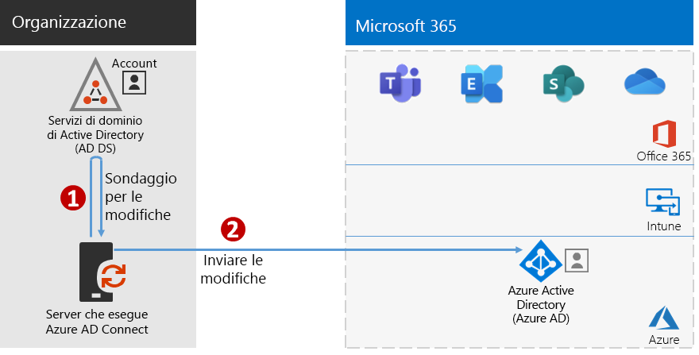
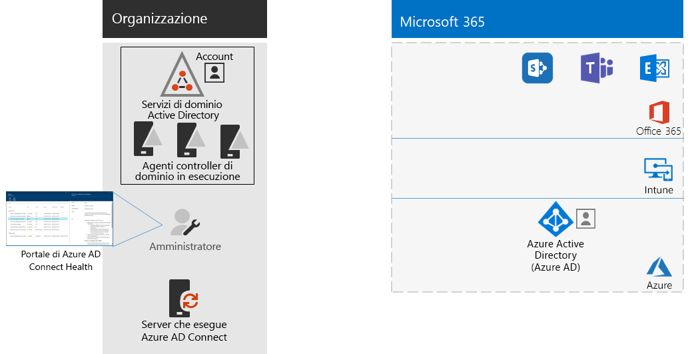

# Passaggio 4: Aggiungere gli account utente

## Creare gli account utente per l'identità solo cloud

Per l'identità solo cloud, creare gli utenti e i gruppi in Azure Active Directory (Azure AD). È possibile usare:

- L'interfaccia di amministrazione di Microsoft 365
- Il portale di Azure
- Azure PowerShell

## Sincronizzare le identità per l'identità ibrida

*Questo passaggio è obbligatorio per gli ambienti ibridi e si applica alle versioni E3 ed E5 di Microsoft 365 Enterprise*

In questa sezione si sincronizzerà l'ambiente Active Directory Domain Services (AD DS) locale con il tenant di Azure AD usato da Office 365, Microsoft Intune e altri servizi basati sul cloud inclusi in Microsoft 365 Enterprise.

Azure AD Connect è lo strumento Microsoft supportato che guida gli amministratori nel processo di sincronizzazione delle sole identità realmente necessarie degli ambienti Azure AD DS con una o più foreste con il proprio tenant di Azure AD. La figura seguente mostra il processo di base per la sincronizzazione di Azure AD Connect.

1. Quando Azure AD Connect viene avviato in un server, comunica con AD DS per rilevare le modifiche apportate ad account, gruppi e contatti.
2. Quindi Azure AD Connect invia le modifiche al tenant di Azure AD dell'abbonamento a Microsoft 365.

La prima decisione relativa alla soluzione delle identità ibride, riguarda i requisiti di autenticazione. Le opzioni sono le seguenti:

- Con l'**autenticazione gestita**, Azure AD gestisce il processo di autenticazione per l'accesso utente. Esistono due metodi di autenticazione gestita: 
    - **Sincronizzazione dell'hash delle password** [Opzione consigliata e obbligatoria per alcune funzionalità Premium]. Questo è il modo più semplice per abilitare l'autenticazione per gli oggetti directory locali in Azure AD. Azure AD Connect estrae la password con hash da Active Directory Domain Services, esegue ulteriori procedure di sicurezza sull'hash della password e la sincronizza con Azure AD. Per altre informazioni, vedere [Implementare la sincronizzazione dell'hash delle password con il servizio di sincronizzazione Azure AD Connect](https://docs.microsoft.com/azure/active-directory/hybrid/how-to-connect-password-hash-synchronization).
    - L'**autenticazione pass-through di Azure AD** offre una soluzione di convalida delle password semplice per i servizi basati su Azure AD. Usa un agente in esecuzione in uno o più server locali per convalidare le autenticazioni utente direttamente con Active Directory Domain Services locale. Per altre informazioni, vedere [Accesso utente con l'autenticazione pass-through di Azure Active Directory](https://docs.microsoft.com/azure/active-directory/connect/active-directory-aadconnect-pass-through-authentication).
- Con l'**autenticazione federata**, il processo di autenticazione viene reindirizzato a un altro provider di identità tramite un server federativo di identità, come Active Directory Federation Services (ADFS), per l'accesso utente. Il provider di identità può fornire altri metodi di autenticazione, ad esempio l'autenticazione basata su una smart card. Per ulteriori informazioni, vedere [Scegliere il giusto metodo di autenticazione per la soluzione delle identità ibride di Azure Active Directory](https://docs.microsoft.com/azure/security/azure-ad-choose-authn).

Guardare questo video per una panoramica dei modelli di identità e dell'autenticazione per Microsoft 365 Enterprise.

 

> [!VIDEO https://www.microsoft.com/videoplayer/embed/RE2Pjwu]

Una volta determinata la soluzione per le identità ibride, scaricare ed eseguire lo [Strumento IdFix DirSync Error Remediation Tool](https://www.microsoft.com/download/details.aspx?id=36832) per analizzare Active Directory Domain Services e cercare eventuali problemi.

Dopo aver risolto tutti i problemi identificati tramite lo strumento IdFix, vedere [Implementare la sincronizzazione dell'hash delle password](https://docs.microsoft.com/azure/active-directory/connect/active-directory-aadconnectsync-implement-password-hash-synchronization) per installare lo strumento Azure AD Connect e configurare la sincronizzazione delle directory tra Active Directory Domain Services locale e il tenant di Azure AD per l’abbonamento a Microsoft 365. Dopo l'inizio della sincronizzazione, sarà possibile mantenere gli account utente e i gruppi con il provider di identità locale, come Active Directory Domain Services.

Microsoft offre una serie di consigli per [identità e accesso ai dispositivi](microsoft-365-policies-configurations.md) per garantire un ambiente di lavoro protetto e produttivo. 

- Per i requisiti consigliati per gli ambienti ibridi, vedere la colonna **Active Directory con sincronizzazione delle password hash** in [Prerequisiti](identity-access-prerequisites.md#prerequisites). 

- Per i requisiti consigliati per gli ambienti solo cloud, vedere la colonna **Solo cloud** in [Prerequisiti](identity-access-prerequisites.md#prerequisites).

Quando gli utenti e i gruppi locali sono presenti in Azure AD, è possibile iniziare ad assegnare le licenze e a usare carichi di lavoro di produttività, ad esempio OneDrive for Business e Exchange Online.

|||
|:-------|:-----|
|| [Guida del laboratorio di testing: sincronizzazione hash delle password](password-hash-sync-m365-ent-test-environment.md)  [Guida del laboratorio di testing: autenticazione pass-through](pass-through-auth-m365-ent-test-environment.md) |
|||

Come checkpoint provvisorio, vedere i [criteri di uscita](identity-exit-criteria.md#crit-identity-sync) relativi a questa sezione.

## Monitorare l'integrità della sincronizzazione

*Questo passaggio è facoltativo e si applica alle versioni E3 ed E5 di Microsoft 365*

In questa sezione verrà installato un agente di Azure AD Connect Health in ogni controller di dominio AD DS locale per monitorare l'infrastruttura di gestione delle identità e i servizi di sincronizzazione forniti da Azure AD Connect. Le informazioni sul monitoraggio vengono rese disponibili nel portale di Azure AD Connect Health, dove è possibile visualizzare avvisi, il monitoraggio delle prestazioni, analisi sull'utilizzo e altre informazioni.

La decisione di progettazione chiave su come usare Azure AD Connect Health si basa sul modo in cui si utilizza Azure AD Connect:

- Se si usa l'opzione **autenticazione gestita** iniziare con [Uso di Azure AD Connect Health con la sincronizzazione](https://docs.microsoft.com/azure/active-directory/connect-health/active-directory-aadconnect-health-sync) per comprendere e configurare Azure AD Connect Health.
- Se si stanno sincronizzando soli i nomi di account e gruppi tramite l'**autenticazione federata** con Active Directory Federation Services (AD FS), iniziare con [Uso di Azure AD Connect Health con AD FS](https://docs.microsoft.com/azure/active-directory/connect-health/active-directory-aadconnect-health-adfs) per comprendere e configurare Azure AD Connect Health.

Dopo aver completato questa sezione:

- L'agente di Azure AD Connect Health è installato su ciascuno dei server del provider di identità locale.
- Il portale di Azure AD Connect Health mostra lo stato corrente dell'infrastruttura locale e delle attività di sincronizzazione con il tenant di Azure AD per l’abbonamento a Microsoft 365.

Come checkpoint provvisorio, è possibile vedere i [criteri di uscita](identity-exit-criteria.md#crit-identity-sync-health) per questa sezione.

## Semplificare gli aggiornamenti delle password

*Questo passaggio è facoltativo per gli ambienti ibridi e si applica alle versioni E3 ed E5 di Microsoft 365 Enterprise*

In questa sezione verrà consentito agli utenti di reimpostare la password con Azure Active Directory (Azure AD), che è poi replicata nei servizi di Dominio di Active Directory (AD DS) locali. Questo processo è noto come writeback delle password. Con il writeback delle password gli utenti non hanno bisogno di aggiornare le password tramite Active Directory Domain Services locale in cui vengono archiviati gli account utente e i relativi attributi. Questo risulta particolarmente utile per gli utenti remoti o mobili che non dispongono di una connessione remota alla rete locale.

Il writeback delle password è necessario per utilizzare al meglio le capacità di Azure AD Identity Protection, come la richiesta agli utenti di cambiare le password locali nel caso in cui sia stato rilevato un alto rischio di violazione dell'account.

Per ulteriori informazioni e istruzioni di configurazione, vedere [Reimpostazione password self-service di Azure AD con writeback delle password](https://docs.microsoft.com/azure/active-directory/active-directory-passwords-writeback).

>[!Note]
>Eseguire l'aggiornamento all'ultima versione di Azure AD Connect per poter usufruire della migliore esperienza possibile e delle nuove caratteristiche appena rilasciate. Per ulteriori informazioni, vedere [Istallazione personalizzata di Azure AD Connect](https://docs.microsoft.com/azure/active-directory/connect/active-directory-aadconnect-get-started-custom).
>

|||
|:-------|:-----|
|| [Guida al lab di test: writeback della password](password-writeback-m365-ent-test-environment.md) |
|||

Come checkpoint provvisorio, è possibile vedere i [criteri uscita](identity-exit-criteria.md#crit-identity-pw-writeback) per questa sezione.

|||
|:-------|:-----|
|| [Usare i gruppi per la gestione](identity-use-group-management.md) |
