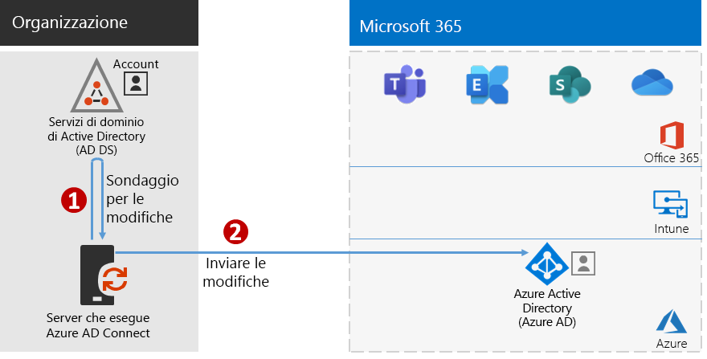
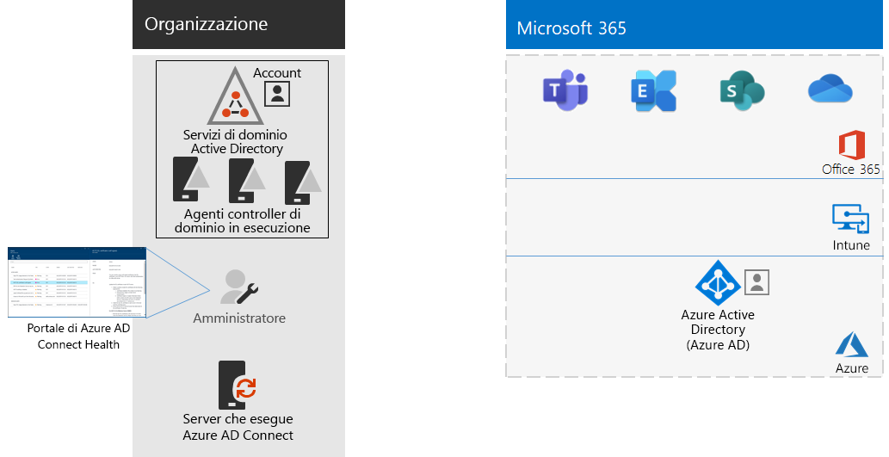

# Passaggio 4: Aggiungere gli account utenteStep 4: Add your user accounts

## Creare gli account utente per l'identità solo cloudCreate your user accounts for cloud-only identity

Per l'identità solo cloud, creare gli utenti e i gruppi in Azure Active Directory (Azure AD).For cloud-only identity, create your users and groups in Azure Active Directory (Azure AD). È possibile usare:You can use:

- L'interfaccia di amministrazione di Microsoft 365The Microsoft 365 admin center
- Il portale di AzureThe Azure portal
- Azure PowerShellAzure PowerShell

## Sincronizzare le identità per l'identità ibridaSynchronize identities for hybrid identity

*Questo passaggio è obbligatorio per gli ambienti ibridi e si applica alle versioni E3 ed E5 di Microsoft 365 Enterprise**This is required for hybrid environments and applies to both the E3 and E5 versions of Microsoft 365 Enterprise*

In questa sezione si sincronizzerà l'ambiente Active Directory Domain Services (AD DS) locale con il tenant di Azure AD usato da Office 365, Microsoft Intune e altri servizi basati sul cloud inclusi in Microsoft 365 Enterprise.In this section, you'll synchronize your on-premises Active Directory Domain Services (AD DS) with the Azure AD tenant used by Office 365, Microsoft Intune, and other cloud-based services included with Microsoft 365 Enterprise.

Azure AD Connect è lo strumento Microsoft supportato che guida gli amministratori nel processo di sincronizzazione delle sole identità realmente necessarie degli ambienti Azure AD DS con una o più foreste con il proprio tenant di Azure AD.Azure AD Connect is the supported Microsoft tool that guides you through synchronizing only the identities you really need from single or multi-forest AD DS environments to your Azure AD tenant. La figura seguente mostra il processo di base per la sincronizzazione di Azure AD Connect.The following figure shows the basic process for Azure AD Connect synchronization.

1. Quando Azure AD Connect viene avviato in un server, comunica con AD DS per rilevare le modifiche apportate ad account, gruppi e contatti.Azure AD Connect running on a server polls AD DS for changes in accounts, groups, and contacts.
2. Quindi Azure AD Connect invia le modifiche al tenant di Azure AD dell'abbonamento a Microsoft 365.Azure AD Connect sends those changes to the Azure AD tenant of your Microsoft 365 subscription.

The first decision in your hybrid identity solution is your authentication requirement.The first decision in your hybrid identity solution is your authentication requirement. The following options are options:The following options are options:

- With **managed authentication**, Azure AD handles the authentication process for user sign-in.With **managed authentication**, Azure AD handles the authentication process for user sign-in. There are two methods for managed authentication:There are two methods for managed authentication: 
    - **Sincronizzazione dell'hash delle password** [Opzione consigliata e obbligatoria per alcune funzionalità Premium].**Password Hash Sync (PHS)** [Recommended and required for some premium features]. Questo è il modo più semplice per abilitare l'autenticazione per gli oggetti directory locali in Azure AD.This is the simplest way to enable authentication for on-premises directory objects in Azure AD. Azure AD Connect estrae la password con hash da Active Directory Domain Services, esegue ulteriori procedure di sicurezza sull'hash della password e la sincronizza con Azure AD.Azure AD Connect extracts the hashed password from AD DS, does extra security processing on the password hash, and synchronizes it to Azure AD. Per altre informazioni, vedere [Implementare la sincronizzazione dell'hash delle password con il servizio di sincronizzazione Azure AD Connect](https://docs.microsoft.com/azure/active-directory/hybrid/how-to-connect-password-hash-synchronization).For more information, see [Implement password hash synchronization with Azure AD Connect sync](https://docs.microsoft.com/azure/active-directory/hybrid/how-to-connect-password-hash-synchronization).
    - L'**autenticazione pass-through di Azure AD** offre una soluzione di convalida delle password semplice per i servizi basati su Azure AD.**Pass-through Authentication (PTA)** provides a simple password validation solution for Azure AD-based services. Usa un agente in esecuzione in uno o più server locali per convalidare le autenticazioni utente direttamente con Active Directory Domain Services locale.PTA uses an agent running on one or more on-premises servers to validate the user authentications directly with your on-premises AD DS. Per altre informazioni, vedere [Accesso utente con l'autenticazione pass-through di Azure Active Directory](https://docs.microsoft.com/azure/active-directory/connect/active-directory-aadconnect-pass-through-authentication).For more information, see [User sign-in with Azure Active Directory Pass-through Authentication](https://docs.microsoft.com/azure/active-directory/connect/active-directory-aadconnect-pass-through-authentication).
- With **federated authentication**, the authentication process is redirected to another identity provider through an identity federation server, such as Active Directory Federation Services (AD FS), for a user’s sign-in.With **federated authentication**, the authentication process is redirected to another identity provider through an identity federation server, such as Active Directory Federation Services (AD FS), for a user’s sign-in. The identity provider can provide additional authentication methods, such as smartcard-based authentication.The identity provider can provide additional authentication methods, such as smartcard-based authentication. For more information, see [Choosing the right authentication method for your Azure Active Directory hybrid identity solution](https://docs.microsoft.com/azure/active-directory/hybrid/choose-ad-authn).For more information, see [Choosing the right authentication method for your Azure Active Directory hybrid identity solution](https://docs.microsoft.com/azure/active-directory/hybrid/choose-ad-authn).

Guardare questo video per una panoramica dei modelli di identità e dell'autenticazione per Microsoft 365 Enterprise.Watch this video for an overview of identity models and authentication for Microsoft 365 Enterprise.

 

 

> [!VIDEO https://www.microsoft.com/videoplayer/embed/RE2Pjwu]

Una volta determinata la soluzione per le identità ibride, scaricare ed eseguire lo [Strumento IdFix DirSync Error Remediation Tool](https://www.microsoft.com/download/details.aspx?id=36832) per analizzare Active Directory Domain Services e cercare eventuali problemi.After you've determined your hybrid identity solution, download and run the [IdFix Directory Synchronization Error Remediation Tool](https://www.microsoft.com/download/details.aspx?id=36832) to analyze your AD DS for issues.

Dopo aver risolto tutti i problemi identificati tramite lo strumento IdFix, vedere [Implementare la sincronizzazione dell'hash delle password](https://docs.microsoft.com/azure/active-directory/connect/active-directory-aadconnectsync-implement-password-hash-synchronization) per installare lo strumento Azure AD Connect e configurare la sincronizzazione delle directory tra Active Directory Domain Services locale e il tenant di Azure AD per l’abbonamento a Microsoft 365.After resolving all of the issues identified by the IdFix tool, see [Implement password hash synchronization](https://docs.microsoft.com/azure/active-directory/connect/active-directory-aadconnectsync-implement-password-hash-synchronization) for guidance on installing the Azure AD Connect tool and configuring directory synchronization between your on-premises AD DS and the Azure AD tenant for your Microsoft 365 subscription. Dopo l'inizio della sincronizzazione, sarà possibile mantenere gli account utente e i gruppi con il provider di identità locale, come Active Directory Domain Services.After synchronization starts, you'll maintain your user accounts and groups with your on-premises identity provider, such as AD DS.

Microsoft offre una serie di consigli per [identità e accesso ai dispositivi](microsoft-365-policies-configurations.md) per garantire un ambiente di lavoro protetto e produttivo.Microsoft provides a set of recommendations for [identity and device access](microsoft-365-policies-configurations.md) to ensure a secure and productive workforce. 

- Per i requisiti consigliati per gli ambienti ibridi, vedere la colonna **Active Directory con sincronizzazione delle password hash** in [Prerequisiti](identity-access-prerequisites.md#prerequisites).For recommended requirements for hybrid environments, see the **Active Directory with password hash sync** column in [prerequisites](identity-access-prerequisites.md#prerequisites). 

- Per i requisiti consigliati per gli ambienti solo cloud, vedere la colonna **Solo cloud** in [Prerequisiti](identity-access-prerequisites.md#prerequisites).For recommended requirements for cloud only environments, see the **Cloud only** column in [prerequisites](identity-access-prerequisites.md#prerequisites).

Quando gli utenti e i gruppi locali sono presenti in Azure AD, è possibile iniziare ad assegnare le licenze e a usare carichi di lavoro di produttività, ad esempio OneDrive for Business e Exchange Online.Once your on-premises users and groups are present in Azure AD, you can start assigning licenses and using productivity workloads such as OneDrive for Business and Exchange Online.

|||
|:-------|:-----|
|| [Guida del laboratorio di testing: sincronizzazione hash delle passwordTest Lab Guide: Password hash synchronization](password-hash-sync-m365-ent-test-environment.md)  [Guida del laboratorio di testing: autenticazione pass-throughTest Lab Guide: Pass-through authentication](pass-through-auth-m365-ent-test-environment.md) |
|||

Come checkpoint provvisorio, vedere i [criteri di uscita](identity-exit-criteria.md#crit-identity-sync) relativi a questa sezione.As an interim checkpoint, you can see the [exit criteria](identity-exit-criteria.md#crit-identity-sync) corresponding to this section.

## Monitorare l'integrità della sincronizzazioneMonitor synchronization health

*Questo passaggio è facoltativo e si applica alle versioni E3 ed E5 di Microsoft 365**This is optional and applies to both the E3 and E5 versions of Microsoft 365*

In questa sezione verrà installato un agente di Azure AD Connect Health in ogni controller di dominio AD DS locale per monitorare l'infrastruttura di gestione delle identità e i servizi di sincronizzazione forniti da Azure AD Connect.In this section, you'll install an Azure AD Connect Health agent on each of your on-premises AD DS domain controllers to monitor your identity infrastructure and the synchronization services provided by Azure AD Connect. Le informazioni sul monitoraggio vengono rese disponibili nel portale di Azure AD Connect Health, dove è possibile visualizzare avvisi, il monitoraggio delle prestazioni, analisi sull'utilizzo e altre informazioni.The monitoring information is made available in an Azure AD Connect Health portal, where you can view alerts, performance monitoring, usage analytics, and other information.

La decisione di progettazione chiave su come usare Azure AD Connect Health si basa sul modo in cui si utilizza Azure AD Connect:The key design decision of how to use Azure AD Connect Health is based on how you are using Azure AD Connect:

- Se si usa l'opzione **autenticazione gestita** iniziare con [Uso di Azure AD Connect Health con la sincronizzazione](https://docs.microsoft.com/azure/active-directory/connect-health/active-directory-aadconnect-health-sync) per comprendere e configurare Azure AD Connect Health.If you’re using the **managed authentication** option, start with [Using Azure AD Connect Health with sync](https://docs.microsoft.com/azure/active-directory/connect-health/active-directory-aadconnect-health-sync) to understand and configure Azure AD Connect Health.
- Se si stanno sincronizzando soli i nomi di account e gruppi tramite l'**autenticazione federata** con Active Directory Federation Services (AD FS), iniziare con [Uso di Azure AD Connect Health con AD FS](https://docs.microsoft.com/azure/active-directory/connect-health/active-directory-aadconnect-health-adfs) per comprendere e configurare Azure AD Connect Health.If you're synchronizing just the names of the accounts and groups using **federated authentication** with Active Directory Federation Services (AD FS), start with [Using Azure AD Connect Health with AD FS](https://docs.microsoft.com/azure/active-directory/connect-health/active-directory-aadconnect-health-adfs) to understand and configure Azure AD Connect Health.

Dopo aver completato questa sezione:When you complete this section, you’ll have:

- L'agente di Azure AD Connect Health è installato su ciascuno dei server del provider di identità locale.The Azure AD Connect Health agent installed on your on-premises identity provider servers.
- Il portale di Azure AD Connect Health mostra lo stato corrente dell'infrastruttura locale e delle attività di sincronizzazione con il tenant di Azure AD per l’abbonamento a Microsoft 365.The Azure AD Connect Health portal displaying the current state of your on-premises infrastructure and synchronization activities with the Azure AD tenant for your Microsoft 365 subscription.

Come checkpoint provvisorio, è possibile vedere i [criteri di uscita](identity-exit-criteria.md#crit-identity-sync-health) per questa sezione.As an interim checkpoint, you can see the [exit criteria](identity-exit-criteria.md#crit-identity-sync-health) for this section.

## Semplificare gli aggiornamenti delle passwordSimplify password updates

*Questo passaggio è facoltativo per gli ambienti ibridi e si applica alle versioni E3 ed E5 di Microsoft 365 Enterprise**This is optional for hybrid environments and applies to both the E3 and E5 versions of Microsoft 365 Enterprise*

In questa sezione verrà consentito agli utenti di reimpostare la password con Azure Active Directory (Azure AD), che è poi replicata nei servizi di Dominio di Active Directory (AD DS) locali.In this section, you'll allow users to reset their passwords through Azure Active Directory (Azure AD), which is then replicated to your local Active Directory Domain Services (AD DS). Questo processo è noto come writeback delle password.This process is known as password writeback. Con il writeback delle password gli utenti non hanno bisogno di aggiornare le password tramite Active Directory Domain Services locale in cui vengono archiviati gli account utente e i relativi attributi.With password writeback, users don’t need to update their passwords through the on-premises AD DS where user accounts and their attributes are stored. Questo risulta particolarmente utile per gli utenti remoti o mobili che non dispongono di una connessione remota alla rete locale.This is valuable to roaming or remote users who do not have a remote access connection to the on-premises network.

Il writeback delle password è necessario per utilizzare al meglio le capacità di Azure AD Identity Protection, come la richiesta agli utenti di cambiare le password locali nel caso in cui sia stato rilevato un alto rischio di violazione dell'account.Password writeback is required to fully utilize Azure AD Identity Protection capabilities, such as requiring users to change their on-premises passwords when there has been a high risk of account compromise detected.

Per ulteriori informazioni e istruzioni di configurazione, vedere [Reimpostazione password self-service di Azure AD con writeback delle password](https://docs.microsoft.com/azure/active-directory/active-directory-passwords-writeback).For additional information and configuration instructions, see [Azure AD SSPR with password writeback](https://docs.microsoft.com/azure/active-directory/active-directory-passwords-writeback).

>[!Note]
>Upgrade to the latest version of Azure AD Connect to ensure the best possible experience and new features as they are released.Upgrade to the latest version of Azure AD Connect to ensure the best possible experience and new features as they are released. For more information, see [Custom installation of Azure AD Connect](https://docs.microsoft.com/azure/active-directory/connect/active-directory-aadconnect-get-started-custom).For more information, see [Custom installation of Azure AD Connect](https://docs.microsoft.com/azure/active-directory/connect/active-directory-aadconnect-get-started-custom).
>

|||
|:-------|:-----|
|| [Guida al lab di test: writeback della passwordTest Lab Guide: Password writeback](password-writeback-m365-ent-test-environment.md) |
|||

Come checkpoint provvisorio, è possibile vedere i [criteri uscita](identity-exit-criteria.md#crit-identity-pw-writeback) per questa sezione.As an interim checkpoint, you can see the [exit criteria](identity-exit-criteria.md#crit-identity-pw-writeback) for this section.

|||
|:-------|:-----|
|| [Usare i gruppi per la gestioneUse groups for management](identity-use-group-management.md) |
