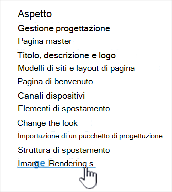
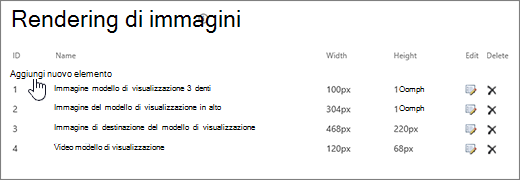
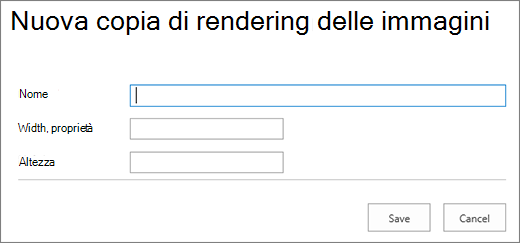

# Ottimizzazione delle immagini per i siti di pubblicazione classici di SharePoint Online

La velocità di caricamento di una pagina Web dipende dalle dimensioni combinate di tutti i componenti necessari per il rendering della pagina, tra cui immagini, HTML, JavaScript e CSS. Le immagini sono un ottimo modo per rendere il sito più accattivante, ma le loro dimensioni possono influire sulle prestazioni. Ottimizzando le immagini con compressione e ridimensionamento e usando sprite, puoi sfalsare gli effetti di immagini molto grandi. Utilizzando i rendering di immagini di SharePoint, è possibile caricare una singola immagine di grandi dimensioni e visualizzare sezioni dell'immagine che ne consentono il riutilizzo anziché il ricaricamento.

>[!NOTE]
>Questo argomento si applica ai siti di pubblicazione classici di SharePoint Online, non ai siti portale moderni. Per informazioni sull'ottimizzazione delle immagini nei siti portale moderni di SharePoint Online, vedere Ottimizzare le immagini nelle pagine [del portale moderno di SharePoint Online.](modern-image-optimization.md)
  
## Uso di sprite per velocizzare il caricamento delle immagini

|||
|:-----|:-----|
| Uno sprite immagine contiene molte immagini più piccole. Usando CSS puoi selezionare una parte dell'immagine composita da visualizzare in una determinata parte della pagina con posizionamento assoluto. Fondamentalmente, sposti una singola immagine intorno alla pagina invece di caricare più immagini e rendi visibile una piccola parte dell'immagine attraverso una piccola finestra in cui la parte necessaria dell'immagine sprite viene visualizzata all'utente finale. SharePoint Online utilizza gli sprite per visualizzare le varie icone nello sprite spcommon.png.     Cosa è stato trattato qui:     Compressione delle immagini     Ottimizzazione delle immagini     Rendering di immagini di SharePoint    ||
   
In questo modo è possibile migliorare le prestazioni perché si scarica solo un'immagine anziché più immagini e quindi si memorizza nella cache e si riutilizza l'immagine. Anche se l'immagine non rimane memorizzata nella cache, con una singola immagine anziché più immagini, questo metodo riduce il numero totale di richieste HTTP al server riducendo i tempi di caricamento delle pagine. Ciò rappresenta un vero e proprio tipo di creazione di bundle di immagini. È una tecnica molto utile se le immagini non vengono modificate molto spesso, ad esempio nel caso delle icone, come illustrato nell'esempio di SharePoint fornito in precedenza. Puoi usare [Web Essentials](https://vswebessentials.com/), un progetto di terze parti open source basato sulla community per ottenere questo risultato facilmente in Microsoft Visual Studio. Per ulteriori informazioni, vedere [Minification and bundling in SharePoint Online](./minification-and-bundling-in-sharepoint-online.md).
  
## Uso della compressione e dell'ottimizzazione delle immagini per velocizzare il caricamento delle pagine

Per quanto riguarda l'ottimizzazione e la compressione delle immagini, si tratta della riduzione delle dimensioni dei file di immagini utilizzate nel proprio sito. Spesso, la tecnica migliore per ridurre le dimensioni di un'immagine è riportare l'immagine alle dimensioni massime in cui verrà visualizzata nel sito. Non ha alcun senso disporre di un'immagine in dimensioni superiori rispetto a quelle in cui verrà mai visualizzata. Accertarsi che le immagini siano nelle dimensioni corrette utilizzando un editor di immagini è un modo rapido e facile per ridurre le dimensioni della propria pagina.
  
Una volta che le immagini sono nelle dimensioni appropriate, il passaggio successivo consiste nell'ottimizzare la compressione di tali immagini. Sono disponibili vari strumenti per la compressione e l'ottimizzazione, tra cui Raccolta foto e strumenti di terze parti. Per la compressione è fondamentale ridurre al minimo possibile le dimensioni del file senza compromettere la qualità visibile per gli utenti finali. Provare i file compressi su uno schermo ad alta definizione per accertarsi che siano ancora di buona qualità.
  
## Velocizzare i download delle pagine tramite rendering delle immagini di SharePoint

I rendering delle immagini sono una funzionalità di SharePoint Online che consente di gestire versioni diverse delle immagini in base alle dimensioni predefinite dell'immagine. Questo è particolarmente importante quando sono presenti contenuti di immagini generati dall'utente o dimensioni dell'immagine la cui larghezza e altezza vengono corrette tramite CSS nel sito. Anche se un'immagine è stata corretta mediante CSS, l'immagine ad alta risoluzione è ancora caricata. In questo caso, le dimensioni del file possono essere ridotte utilizzando il rendering di immagini.
  
> [!NOTE]
> I rendering sono disponibili solo per SharePoint quando la pubblicazione è abilitata. È possibile abilitare la pubblicazione in Impostazioni \> Impostazioni sito Gestisci caratteristiche sito Pubblicazione \> \> SharePoint Server. L'opzione non verrà visualizzata in caso contrario.
  
Il ridimensionamento del rendering delle immagini parte dalla dimensione minima definita dall'utente (larghezza o altezza), per poi ridimensionare l'immagine in modo che l'altra dimensione venga automaticamente ridimensionata in base alle proporzioni bloccate. Per impostazione predefinita, l'immagine verrà ritagliata dal centro alle dimensioni rimanenti. Ad esempio, se si definisce un rendering di 100 px di larghezza e 50 px di altezza e l'immagine originale è di 1000 px di larghezza e 800 px di altezza, verrà ridimensionata in modo che la dimensione di 800 px diventi 50 px e quella di 1000 px (ora 62,5 px) venga ritagliata dal centro dell'immagine.
  
La procedura è relativamente semplice ma, per utilizzare il rendering delle immagini, il rendering deve trovarsi nel sito di SharePoint prima di aggiungere le immagini. Inoltre, è necessario disporre anche dell'Infrastruttura di pubblicazione SharePoint Server (livello della raccolta siti) e la funzionalità Pubblicazione SharePoint Server (livello di sito) attivate.
  
### Aggiungere un rendering di immagine per velocizzare il caricamento delle pagine
  
1. Verificare che l'account utente che esegue questa procedura abbia almeno le autorizzazioni di progettazione per il sito principale della raccolta siti e che il sito venga pubblicato in una pagina Web.

2. In un browser Web, andare al sito principale della raccolta siti di pubblicazione.

3. Scegliere l'icona **Impostazioni**.

4. Nella pagina **Impostazioni sito**, nella sezione **Aspetto**, vengono visualizzati i rendering delle immagini incorporate.

    È possibile utilizzare la parte esterna dei rendering della casella oppure selezionare **Rendering di immagini** per crearne uno nuovo.

    
  
5. Nella pagina **Rendering di immagini**, selezionare **Aggiungi nuovo elemento**.

    
  
6. Nella pagina **Nuovo rendering immagine**, nella casella **Nome** immettere un nome per il rendering.

7. Nelle caselle di testo **Larghezza** e **Altezza** immettere le rispettive dimensioni in pixel del rendering, quindi selezionare **Salva**.

    
  
## Ritaglio personalizzato con rendering di immagini

Per impostazione predefinita, un rendering di immagini viene generato dal centro dell'immagine. È possibile modificare il rendering di immagini per singole immagini ritagliando la parte dell'immagine che si desidera utilizzare. È possibile ritagliare immagini su base individuale in base al rendering. Il ritaglio delle immagini velocizza il caricamento delle pagine utilizzando la cache BLOB di SharePoint per creare una versione dell'immagine per ogni rendering. In questo modo il carico del server viene ridotto perché l'immagine viene ridimensionata una sola volta ed è quindi pronta per essere servita agli utenti finali più volte. Per ulteriori informazioni su come ritagliare un rendering di immagine, vedi [Ritagliare un rendering di immagine.](/sharepoint/dev/general-development/sharepoint-design-manager-device-channels)
