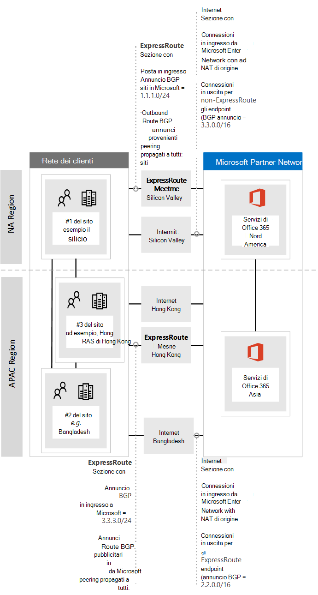
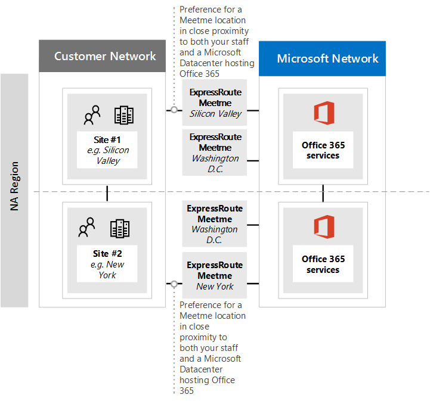
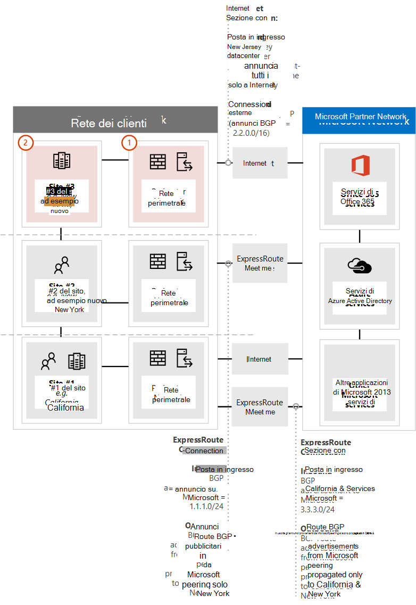
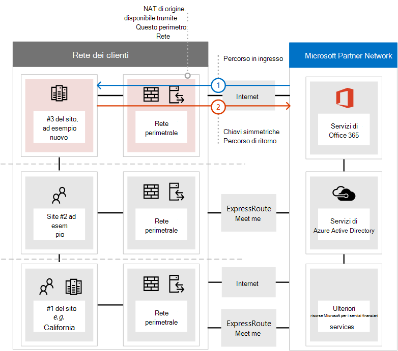
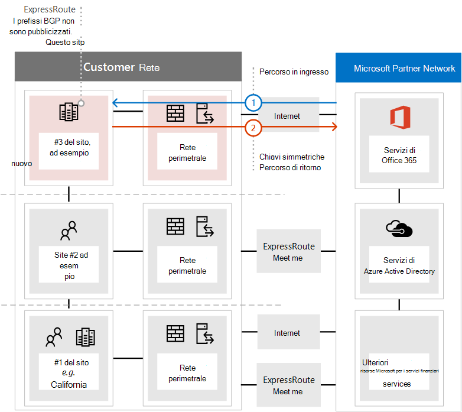
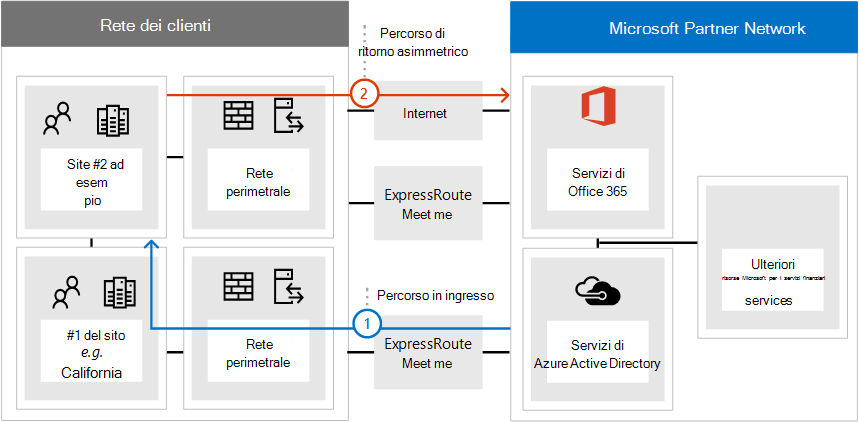

# <a name="implementing-expressroute-for-office-365"></a><span data-ttu-id="05bb2-103">Implementazione di ExpressRoute per Office 365</span><span class="sxs-lookup"><span data-stu-id="05bb2-103">Implementing ExpressRoute for Office 365</span></span>

<span data-ttu-id="05bb2-104">*Questo articolo si applica sia a Microsoft 365 Enterprise che a Office 365 Enterprise*.</span><span class="sxs-lookup"><span data-stu-id="05bb2-104">*This article applies to both Microsoft 365 Enterprise and Office 365 Enterprise.*</span></span>

<span data-ttu-id="05bb2-105">ExpressRoute per Office 365 fornisce un percorso di routing alternativo per molti servizi di Office 365 con connessione Internet.</span><span class="sxs-lookup"><span data-stu-id="05bb2-105">ExpressRoute for Office 365 provides an alternate routing path to many internet facing Office 365 services.</span></span> <span data-ttu-id="05bb2-106">L'architettura di ExpressRoute per Office 365 si basa sulla pubblicità dei prefissi IP pubblici dei servizi di Office 365 che sono già accessibili tramite Internet nei circuiti ExpressRoute di cui è stato eseguito il provisioning per la successiva ridistribuzione di tali prefissi IP nella rete.</span><span class="sxs-lookup"><span data-stu-id="05bb2-106">The architecture of ExpressRoute for Office 365 is based on advertising public IP prefixes of Office 365 services that are already accessible over the Internet into your provisioned ExpressRoute circuits for subsequent redistribution of those IP prefixes into your network.</span></span> <span data-ttu-id="05bb2-107">Con ExpressRoute è possibile abilitare in modo efficace diversi percorsi di routing, tramite Internet ed ExpressRoute, per molti servizi di Office 365.</span><span class="sxs-lookup"><span data-stu-id="05bb2-107">With ExpressRoute you effectively enable several different routing paths, through the internet and through ExpressRoute, for many Office 365 services.</span></span> <span data-ttu-id="05bb2-108">Questo stato di routing nella rete può rappresentare una modifica significativa alla modalità di progettazione della topologia di rete interna.</span><span class="sxs-lookup"><span data-stu-id="05bb2-108">This state of routing on your network may represent a significant change to how your internal network topology is designed.</span></span>
  
 <span data-ttu-id="05bb2-109">**Stato:** Guida completa v2</span><span class="sxs-lookup"><span data-stu-id="05bb2-109">**Status:** Complete Guide v2</span></span>
  
<span data-ttu-id="05bb2-110">È necessario pianificare attentamente l'implementazione di ExpressRoute per Office 365 in modo da soddisfare le complessità di rete associate alla disponibilità del routing tramite un circuito dedicato con route iniettate nella rete principale e in Internet.</span><span class="sxs-lookup"><span data-stu-id="05bb2-110">You must carefully plan your ExpressRoute for Office 365 implementation to accommodate for the network complexities of having routing available via both a dedicated circuit with routes injected into your core network and the internet.</span></span> <span data-ttu-id="05bb2-111">Se l'utente e il team non eseguono la pianificazione dettagliata e i test in questa guida, esiste un rischio elevato che si verifichi intermittente o una perdita totale di connettività ai servizi di Office 365 quando il circuito ExpressRoute è abilitato.</span><span class="sxs-lookup"><span data-stu-id="05bb2-111">If you and your team don't perform the detailed planning and testing in this guide, there is a high risk you'll experience intermittent or a total loss of connectivity to Office 365 services when the ExpressRoute circuit is enabled.</span></span>
  
<span data-ttu-id="05bb2-112">Per una corretta implementazione, è necessario analizzare i requisiti dell'infrastruttura, esaminare la valutazione e la progettazione dettagliate della rete, pianificare attentamente l'implementazione in modo a fasi e controllato e creare un piano di convalida e test dettagliato.</span><span class="sxs-lookup"><span data-stu-id="05bb2-112">To have a successful implementation, you will need to analyze your infrastructure requirements, go through detailed network assessment and design, carefully plan the rollout in a staged and controlled manner, and build a detailed validation and testing plan.</span></span> <span data-ttu-id="05bb2-113">Per un ambiente distribuito di grandi dimensioni non è raro che le implementazioni si estendono per diversi mesi.</span><span class="sxs-lookup"><span data-stu-id="05bb2-113">For a large, distributed environment it's not uncommon to see implementations span several months.</span></span> <span data-ttu-id="05bb2-114">Questa guida è progettata per aiutarti a pianificare in anticipo.</span><span class="sxs-lookup"><span data-stu-id="05bb2-114">This guide is designed to help you plan ahead.</span></span>
  
<span data-ttu-id="05bb2-115">Le distribuzioni con successo di grandi dimensioni possono richiedere sei mesi di pianificazione e spesso includono membri del team di molte aree dell'organizzazione, tra cui amministratori di rete, firewall e server proxy, amministratori di Office 365, sicurezza, supporto per gli utenti finali, gestione dei progetti e sponsorizzazione esecutiva.</span><span class="sxs-lookup"><span data-stu-id="05bb2-115">Large successful deployments may take six months in planning and often include team members from many areas in the organization including networking, Firewall and Proxy server administrators, Office 365 administrators, security, end-user support, project management, and executive sponsorship.</span></span> <span data-ttu-id="05bb2-116">L'investimento nel processo di pianificazione ridurrà la probabilità che si verifichino errori di distribuzione causando tempi di inattività o una risoluzione dei problemi complessa e costosa.</span><span class="sxs-lookup"><span data-stu-id="05bb2-116">Your investment in the planning process will reduce the likelihood that you'll experience deployment failures resulting in downtime or complex and expensive troubleshooting.</span></span>
  
<span data-ttu-id="05bb2-117">Ci aspettiamo che i prerequisiti seguenti siano completati prima dell'avvio di questa guida all'implementazione.</span><span class="sxs-lookup"><span data-stu-id="05bb2-117">We expect the following pre-requisites to be completed before this implementation guide is started.</span></span>
  
1. <span data-ttu-id="05bb2-118">È stata completata una valutazione di rete per determinare se ExpressRoute è consigliato e approvato.</span><span class="sxs-lookup"><span data-stu-id="05bb2-118">You've completed a network assessment to determine if ExpressRoute is recommended and approved.</span></span>

2. <span data-ttu-id="05bb2-119">È stato selezionato un provider di servizi di rete ExpressRoute.</span><span class="sxs-lookup"><span data-stu-id="05bb2-119">You've selected an ExpressRoute network service provider.</span></span> <span data-ttu-id="05bb2-120">Informazioni dettagliate sui [partner ExpressRoute e sulle posizioni di peering.](https://azure.microsoft.com/documentation/articles/expressroute-locations/)</span><span class="sxs-lookup"><span data-stu-id="05bb2-120">Find details about the [ExpressRoute partners and peering locations](https://azure.microsoft.com/documentation/articles/expressroute-locations/).</span></span>

3. <span data-ttu-id="05bb2-121">Hai già letto e compreso la documentazione [di ExpressRoute](https://azure.microsoft.com/documentation/services/expressroute/) e la rete interna è in grado di soddisfare i prerequisiti di ExpressRoute end-to-end.</span><span class="sxs-lookup"><span data-stu-id="05bb2-121">You've already read and understand the [ExpressRoute documentation](https://azure.microsoft.com/documentation/services/expressroute/) and your internal network is able to meet ExpressRoute pre-requisites end to end.</span></span>

4. <span data-ttu-id="05bb2-122">Il team ha letto tutte le indicazioni e la documentazione pubblica su , e ha seguito la serie di corsi di formazione di Azure ExpressRoute per [https://aka.ms/expressrouteoffice365](https://aka.ms/expressrouteoffice365) [https://aka.ms/ert](https://aka.ms/ert) Office [365](https://channel9.msdn.com/series/aer) su Channel 9 per comprendere i dettagli tecnici critici, tra cui:</span><span class="sxs-lookup"><span data-stu-id="05bb2-122">Your team has read all of the public guidance and documentation at [https://aka.ms/expressrouteoffice365](https://aka.ms/expressrouteoffice365), [https://aka.ms/ert](https://aka.ms/ert), and watched the [Azure ExpressRoute for Office 365 Training](https://channel9.msdn.com/series/aer) series on Channel 9 to gain an understanding of critical technical details including:</span></span>

      - <span data-ttu-id="05bb2-123">Le dipendenze Internet dei servizi SaaS.</span><span class="sxs-lookup"><span data-stu-id="05bb2-123">The internet dependencies of SaaS services.</span></span>

      - <span data-ttu-id="05bb2-124">Come evitare le route asimmetriche e gestire il routing complesso.</span><span class="sxs-lookup"><span data-stu-id="05bb2-124">How to avoid asymmetric routes and handle complex routing.</span></span>

      - <span data-ttu-id="05bb2-125">Come incorporare i controlli a livello di applicazione, disponibilità e sicurezza perimetrale.</span><span class="sxs-lookup"><span data-stu-id="05bb2-125">How to incorporate perimeter security, availability, and application level controls.</span></span>

## <a name="begin-by-gathering-requirements"></a><span data-ttu-id="05bb2-126">Iniziare raccogliendo i requisiti</span><span class="sxs-lookup"><span data-stu-id="05bb2-126">Begin by gathering requirements</span></span>
<span data-ttu-id="05bb2-127"><a name="requirements"> </a></span><span class="sxs-lookup"><span data-stu-id="05bb2-127"><a name="requirements"> </a></span></span>

<span data-ttu-id="05bb2-128">Iniziare determinando quali funzionalità e servizi si intende adottare all'interno dell'organizzazione.</span><span class="sxs-lookup"><span data-stu-id="05bb2-128">Start by determining which features and services you plan to adopt within your organization.</span></span> <span data-ttu-id="05bb2-129">È necessario determinare quali funzionalità dei diversi servizi di Office 365 verranno utilizzate e quali posizioni della rete ospiteranno gli utenti che usano tali funzionalità.</span><span class="sxs-lookup"><span data-stu-id="05bb2-129">You need to determine which features of the different Office 365 services will be used and which locations on your network will host people using those features.</span></span> <span data-ttu-id="05bb2-130">Con il catalogo di scenari, è necessario aggiungere gli attributi di rete richiesti da ognuno di questi scenari; ad esempio i flussi di traffico di rete in ingresso e in uscita e se gli endpoint di Office 365 sono disponibili su ExpressRoute o meno.</span><span class="sxs-lookup"><span data-stu-id="05bb2-130">With the catalog of scenarios, you need to add the network attributes that each of those scenarios require; such as inbound and outbound network traffic flows and if the Office 365 endpoints are available over ExpressRoute or not.</span></span>
  
<span data-ttu-id="05bb2-131">Per raccogliere i requisiti dell'organizzazione:</span><span class="sxs-lookup"><span data-stu-id="05bb2-131">To gather your organization's requirements:</span></span>
  
- <span data-ttu-id="05bb2-132">Catalogare il traffico di rete in ingresso e in uscita per i servizi di Office 365 in uso nell'organizzazione.</span><span class="sxs-lookup"><span data-stu-id="05bb2-132">Catalog the inbound and outbound network traffic for the Office 365 services your organization is using.</span></span> <span data-ttu-id="05bb2-133">Consultare la pagina degli URL e degli intervalli di indirizzi IP di Office 365 per la descrizione dei flussi richiesti da diversi scenari di Office 365.</span><span class="sxs-lookup"><span data-stu-id="05bb2-133">Consult Office 365 URLs and IP address ranges page for the description of flows that different Office 365 scenarios require.</span></span>

- <span data-ttu-id="05bb2-134">Raccogliere la documentazione relativa alla topologia di rete esistente che mostra i dettagli della backbone e della topologia WAN interna, la connettività dei siti satellite, la connettività utente dell'ultimo chilometro, il routing ai punti di uscita del perimetro della rete e i servizi proxy.</span><span class="sxs-lookup"><span data-stu-id="05bb2-134">Gather documentation of existing network topology showing details of your internal WAN backbone and topology, connectivity of satellite sites, last mile user connectivity, routing to network perimeter egress points, and proxy services.</span></span>

  - <span data-ttu-id="05bb2-135">Identificare gli endpoint del servizio in ingresso nei diagrammi di rete a cui si connetteranno Office 365 e altri servizi Microsoft, mostrando sia i percorsi di connessione Internet che i percorsi di connessione ExpressRoute proposti.</span><span class="sxs-lookup"><span data-stu-id="05bb2-135">Identify inbound service endpoints on the network diagrams that Office 365 and other Microsoft services will connect to, showing both internet and proposed ExpressRoute connection paths.</span></span>

  - <span data-ttu-id="05bb2-136">Identificare tutte le posizioni geografiche degli utenti e la connettività WAN tra le posizioni con le posizioni attualmente in uscita verso Internet e le posizioni proposte per l'uscita a una posizione peering ExpressRoute.</span><span class="sxs-lookup"><span data-stu-id="05bb2-136">Identify all geographic user locations and WAN connectivity between locations along with which locations currently have an egress to the internet and which locations are proposed to have an egress to an ExpressRoute peering location.</span></span>

  - <span data-ttu-id="05bb2-137">Identificare tutti i dispositivi perimetrali, ad esempio proxy, firewall e così via, e catalogare la relazione con i flussi che passano su Internet ed ExpressRoute.</span><span class="sxs-lookup"><span data-stu-id="05bb2-137">Identify all edge devices, such as proxies, firewalls, and so on and catalog their relationship to flows going over the Internet and ExpressRoute.</span></span>

  - <span data-ttu-id="05bb2-138">Documentare se gli utenti finali accederanno ai servizi di Office 365 tramite routing diretto o proxy di applicazione indiretto per i flussi Internet ed ExpressRoute.</span><span class="sxs-lookup"><span data-stu-id="05bb2-138">Document whether end users will access Office 365 services via direct routing or indirect application proxy for both Internet and ExpressRoute flows.</span></span>

- <span data-ttu-id="05bb2-139">Aggiungere la posizione dei percorsi tenant e meet-me al diagramma di rete.</span><span class="sxs-lookup"><span data-stu-id="05bb2-139">Add the location of your tenant and meet-me locations to your network diagram.</span></span>

- <span data-ttu-id="05bb2-140">Stimare le prestazioni di rete previste e osservate e le caratteristiche di latenza dalle principali posizioni degli utenti a Office 365.</span><span class="sxs-lookup"><span data-stu-id="05bb2-140">Estimate the expected and observed network performance and latency characteristics from major user locations to Office 365.</span></span> <span data-ttu-id="05bb2-141">Tenere presente che Office 365 è un set globale e distribuito di servizi e gli utenti si connetteranno a posizioni che potrebbero essere diverse dalla posizione del tenant.</span><span class="sxs-lookup"><span data-stu-id="05bb2-141">Keep in mind that Office 365 is a global and distributed set of services and users will be connecting to locations that may be different from the location of their tenant.</span></span> <span data-ttu-id="05bb2-142">Per questo motivo, è consigliabile misurare e ottimizzare la latenza tra l'utente e il perimetro più vicino della rete globale Microsoft tramite ExpressRoute e connessioni Internet.</span><span class="sxs-lookup"><span data-stu-id="05bb2-142">For this reason, it is recommended to measure and optimize for latency between the user and the closest edge of Microsoft global network over ExpressRoute and Internet connections.</span></span> <span data-ttu-id="05bb2-143">È possibile utilizzare i risultati della valutazione della rete per facilitare questa attività.</span><span class="sxs-lookup"><span data-stu-id="05bb2-143">You can use your findings from the network assessment to aid with this task.</span></span>

- <span data-ttu-id="05bb2-144">Elencare i requisiti di sicurezza della rete aziendale e disponibilità elevata che devono essere soddisfatti con la nuova connessione ExpressRoute.</span><span class="sxs-lookup"><span data-stu-id="05bb2-144">List company network security and high availability requirements that need to be met with the new ExpressRoute connection.</span></span> <span data-ttu-id="05bb2-145">Ad esempio, in che modo gli utenti continuano ad accedere a Office 365 in caso di uscita da Internet o errore del circuito ExpressRoute.</span><span class="sxs-lookup"><span data-stu-id="05bb2-145">For example, how do users continue to get access to Office 365 in the event of the Internet egress or ExpressRoute circuit failure.</span></span>

- <span data-ttu-id="05bb2-146">Documentare quali flussi di rete di Office 365 in ingresso e in uscita useranno il percorso Internet e che useranno ExpressRoute.</span><span class="sxs-lookup"><span data-stu-id="05bb2-146">Document which inbound and outbound Office 365 network flows will use the Internet path and which will use ExpressRoute.</span></span> <span data-ttu-id="05bb2-147">Le specifiche delle posizioni geografiche degli utenti e i dettagli della topologia di rete locale potrebbero richiedere che il piano sia diverso da una posizione utente a un'altra.</span><span class="sxs-lookup"><span data-stu-id="05bb2-147">The specifics of geographical locations of your users and details of your on-premises network topology may require the plan to be different from one user location to another.</span></span>

### <a name="catalog-your-outbound-and-inbound-network-traffic"></a><span data-ttu-id="05bb2-148">Catalogare il traffico di rete in ingresso e in uscita</span><span class="sxs-lookup"><span data-stu-id="05bb2-148">Catalog your outbound and inbound network traffic</span></span>
<span data-ttu-id="05bb2-149"><a name="trafficCatalog"> </a></span><span class="sxs-lookup"><span data-stu-id="05bb2-149"><a name="trafficCatalog"> </a></span></span>

<span data-ttu-id="05bb2-150">Per ridurre al minimo il routing e altre complessità di rete, è consigliabile usare ExpressRoute solo per Office 365 per i flussi di traffico di rete necessari per passare attraverso una connessione dedicata a causa di requisiti normativi o come risultato della valutazione della rete.</span><span class="sxs-lookup"><span data-stu-id="05bb2-150">To minimize routing and other network complexities, we recommend that you only use ExpressRoute for Office 365 for the network traffic flows that are required to go over a dedicated connection due to regulatory requirements or as the result of the network assessment.</span></span> <span data-ttu-id="05bb2-151">È inoltre consigliabile impostare l'ambito del routing ExpressRoute e affrontare i flussi di traffico di rete in ingresso e in uscita come fasi diverse e distinte del progetto di implementazione.</span><span class="sxs-lookup"><span data-stu-id="05bb2-151">Additionally, we recommend that you stage the scope of ExpressRoute routing and approach outbound and inbound network traffic flows as different and distinct stages of the implementation project.</span></span> <span data-ttu-id="05bb2-152">Distribuire ExpressRoute per Office 365 solo per i flussi di traffico di rete in uscita avviati dall'utente e lasciare i flussi di traffico di rete in ingresso su Internet può aiutare a controllare l'aumento della complessità topologica e i rischi derivanti dall'introduzione di ulteriori possibilità di routing asimmetrico.</span><span class="sxs-lookup"><span data-stu-id="05bb2-152">Deploy ExpressRoute for Office 365 for just user initiated outbound network traffic flows and leave inbound network traffic flows across the Internet can help to control the increase in topological complexity and risks of introducing additional asymmetric routing possibilities.</span></span>
  
<span data-ttu-id="05bb2-153">Il catalogo del traffico di rete deve contenere elenchi di tutte le connessioni di rete in ingresso e in uscita di cui si dispone tra la rete locale e Microsoft.</span><span class="sxs-lookup"><span data-stu-id="05bb2-153">Your network traffic catalog should contain listings of all the inbound and outbound network connections that you'll have between your on-premises network and Microsoft.</span></span>
  
- <span data-ttu-id="05bb2-154">I flussi di traffico di rete in uscita sono qualsiasi scenario in cui viene avviata una connessione dall'ambiente locale, ad esempio da client o server interni, con una destinazione dei servizi Microsoft.</span><span class="sxs-lookup"><span data-stu-id="05bb2-154">Outbound network traffic flows are any scenarios where a connection is initiated from your on-premises environment, such as from internal clients or servers, with a destination of the Microsoft services.</span></span> <span data-ttu-id="05bb2-155">Queste connessioni possono essere dirette a Office 365 o indirette, ad esempio quando la connessione passa attraverso server proxy, firewall o altri dispositivi di rete nel percorso di Office 365.</span><span class="sxs-lookup"><span data-stu-id="05bb2-155">These connections may be direct to Office 365 or indirect, such as when the connection goes through proxy servers, firewalls, or other networking devices on the path to Office 365.</span></span>

- <span data-ttu-id="05bb2-156">I flussi di traffico di rete in ingresso sono tutti gli scenari in cui viene avviata una connessione dal cloud Microsoft a un host locale.</span><span class="sxs-lookup"><span data-stu-id="05bb2-156">Inbound network traffic flows are any scenarios where a connection is initiated from the Microsoft cloud to an on-premises host.</span></span> <span data-ttu-id="05bb2-157">Queste connessioni in genere devono passare attraverso il firewall e altre infrastrutture di sicurezza necessarie ai criteri di sicurezza dei clienti per i flussi originati esternamente.</span><span class="sxs-lookup"><span data-stu-id="05bb2-157">These connections typically need to go through firewall and other security infrastructure that customer security policy requires for externally originated flows.</span></span>

<span data-ttu-id="05bb2-158">Leggere  la sezione Verifica della simmetria della route dell'articolo Routing con ExpressRoute per [Office 365](https://support.office.com/article/Routing-with-ExpressRoute-for-Office-365-e1da26c6-2d39-4379-af6f-4da213218408) per determinare quali servizi invieranno il traffico in ingresso e cercare la colonna contrassegnata come ExpressRoute per **Office 365** nell'articolo di riferimento sugli endpoint di [Office 365](https://support.office.com/article/Office-365-URLs-and-IP-address-ranges-8548a211-3fe7-47cb-abb1-355ea5aa88a2) per determinare il resto delle informazioni sulla connettività.</span><span class="sxs-lookup"><span data-stu-id="05bb2-158">Read the **Ensuring route symmetry** section of the article [Routing with ExpressRoute for Office 365](https://support.office.com/article/Routing-with-ExpressRoute-for-Office-365-e1da26c6-2d39-4379-af6f-4da213218408) to determine which services will send inbound traffic and look for the column marked **ExpressRoute for Office 365** in the [Office 365 endpoints](https://support.office.com/article/Office-365-URLs-and-IP-address-ranges-8548a211-3fe7-47cb-abb1-355ea5aa88a2) reference article to determine the rest of the connectivity information.</span></span>
  
<span data-ttu-id="05bb2-159">Per ogni servizio che richiede una connessione in uscita, è necessario descrivere la connettività pianificata per il servizio, inclusi routing di rete, configurazione proxy, ispezione dei pacchetti e esigenze di larghezza di banda.</span><span class="sxs-lookup"><span data-stu-id="05bb2-159">For each service that requires an outbound connection, you'll want to describe the planned connectivity for the service including network routing, proxy configuration, packet inspection, and bandwidth needs.</span></span>
  
<span data-ttu-id="05bb2-160">Per ogni servizio che richiede una connessione in ingresso, sono necessarie alcune informazioni aggiuntive.</span><span class="sxs-lookup"><span data-stu-id="05bb2-160">For each service that requires an inbound connection, you'll need some additional information.</span></span> <span data-ttu-id="05bb2-161">I server nel cloud Microsoft stabiliranno connessioni alla rete locale.</span><span class="sxs-lookup"><span data-stu-id="05bb2-161">Servers in the Microsoft cloud will establish connections to your on-premises network.</span></span> <span data-ttu-id="05bb2-162">per assicurarsi che le connessioni vengano effettuate correttamente, è necessario descrivere tutti gli aspetti di questa connettività, tra cui; le voci DNS pubbliche per i servizi che accetteranno queste connessioni in ingresso, gli indirizzi IP IPv4 formattati CIDR, le apparecchiature ISP coinvolte e la modalità di gestione di NAT in ingresso o NAT di origine per queste connessioni.</span><span class="sxs-lookup"><span data-stu-id="05bb2-162">to ensure the connections are made correctly, you'll want to describe all aspects of this connectivity, including; the public DNS entries for the services that will accept these inbound connections, the CIDR formatted IPv4 IP addresses, which ISP equipment is involved, and how inbound NAT or source NAT is handled for these connections.</span></span>
  
<span data-ttu-id="05bb2-163">Le connessioni in ingresso devono essere esaminate indipendentemente dal fatto che si connettono tramite Internet o ExpressRoute per garantire che il routing asimmetrico non sia stato introdotto.</span><span class="sxs-lookup"><span data-stu-id="05bb2-163">Inbound connections should be reviewed regardless of whether they're connecting over the internet or ExpressRoute to ensure asymmetric routing hasn't been introduced.</span></span> <span data-ttu-id="05bb2-164">In alcuni casi, gli endpoint locali a cui i servizi di Office 365 avviano le connessioni in ingresso potrebbero dover essere accessibili anche da altri servizi Microsoft e non Microsoft.</span><span class="sxs-lookup"><span data-stu-id="05bb2-164">In some cases, on-premises endpoints that Office 365 services initiate inbound connections to may also need to be accessed by other Microsoft and non-Microsoft services.</span></span> <span data-ttu-id="05bb2-165">È fondamentale che l'abilitazione del routing ExpressRoute a questi servizi per office 365 non interrompa altri scenari.</span><span class="sxs-lookup"><span data-stu-id="05bb2-165">It is paramount that enabling ExpressRoute routing to these services for Office 365 purposes doesn't break other scenarios.</span></span> <span data-ttu-id="05bb2-166">In molti casi, i clienti potrebbero dover implementare modifiche specifiche alla rete interna, ad esempio NAT basata sull'origine, per garantire che i flussi in ingresso da Microsoft rimangano simmetrici dopo l'a attivazione di ExpressRoute.</span><span class="sxs-lookup"><span data-stu-id="05bb2-166">In many cases, customers may need to implement specific changes to their internal network, such as source based NAT, to ensure that inbound flows from Microsoft remain symmetric after ExpressRoute is enabled.</span></span>
  
<span data-ttu-id="05bb2-167">Ecco un esempio del livello di dettaglio necessario.</span><span class="sxs-lookup"><span data-stu-id="05bb2-167">Here's a sample of the level of detail required.</span></span> <span data-ttu-id="05bb2-168">In questo caso, Exchange ibrido instraderebbe al sistema locale tramite ExpressRoute.</span><span class="sxs-lookup"><span data-stu-id="05bb2-168">In this case Exchange Hybrid would route to the on-premises system over ExpressRoute.</span></span>

|<span data-ttu-id="05bb2-169">**Proprietà Connection**</span><span class="sxs-lookup"><span data-stu-id="05bb2-169">**Connection property**</span></span>|<span data-ttu-id="05bb2-170">**Valore**</span><span class="sxs-lookup"><span data-stu-id="05bb2-170">**Value**</span></span>|
|:-----|:-----|
|<span data-ttu-id="05bb2-171">**Direzione del traffico di rete**</span><span class="sxs-lookup"><span data-stu-id="05bb2-171">**Network traffic direction**</span></span> <br/> |<span data-ttu-id="05bb2-172">In ingresso</span><span class="sxs-lookup"><span data-stu-id="05bb2-172">Inbound</span></span>  <br/> |
|<span data-ttu-id="05bb2-173">**Servizio**</span><span class="sxs-lookup"><span data-stu-id="05bb2-173">**Service**</span></span> <br/> |<span data-ttu-id="05bb2-174">Ambiente Exchange ibrido</span><span class="sxs-lookup"><span data-stu-id="05bb2-174">Exchange Hybrid</span></span>  <br/> |
|<span data-ttu-id="05bb2-175">**Endpoint pubblico di Office 365 (origine)**</span><span class="sxs-lookup"><span data-stu-id="05bb2-175">**Public Office 365 endpoint (source)**</span></span> <br/> |<span data-ttu-id="05bb2-176">Exchange Online (indirizzi IP)</span><span class="sxs-lookup"><span data-stu-id="05bb2-176">Exchange Online (IP addresses)</span></span>  <br/> |
|<span data-ttu-id="05bb2-177">**Endpoint locale pubblico (destinazione)**</span><span class="sxs-lookup"><span data-stu-id="05bb2-177">**Public On-Premises Endpoint (destination)**</span></span> <br/> |<span data-ttu-id="05bb2-178">5.5.5.5</span><span class="sxs-lookup"><span data-stu-id="05bb2-178">5.5.5.5</span></span>  <br/> |
|<span data-ttu-id="05bb2-179">**Voce DNS pubblica (Internet)**</span><span class="sxs-lookup"><span data-stu-id="05bb2-179">**Public (Internet) DNS entry**</span></span> <br/> |<span data-ttu-id="05bb2-180">Autodiscover.contoso.com</span><span class="sxs-lookup"><span data-stu-id="05bb2-180">Autodiscover.contoso.com</span></span>  <br/> |
|<span data-ttu-id="05bb2-181">**Questo endpoint locale verrà usato da altri servizi Microsoft (non Office 365)**</span><span class="sxs-lookup"><span data-stu-id="05bb2-181">**Will this on-premises endpoint be used for by other (non-Office 365) Microsoft services**</span></span> <br/> |<span data-ttu-id="05bb2-182">No</span><span class="sxs-lookup"><span data-stu-id="05bb2-182">No</span></span>  <br/> |
|<span data-ttu-id="05bb2-183">**Questo endpoint locale verrà utilizzato da utenti/sistemi su Internet**</span><span class="sxs-lookup"><span data-stu-id="05bb2-183">**Will this on-premises endpoint be used by users/systems on the Internet**</span></span> <br/> |<span data-ttu-id="05bb2-184">Sì</span><span class="sxs-lookup"><span data-stu-id="05bb2-184">Yes</span></span>  <br/> |
|<span data-ttu-id="05bb2-185">**Sistemi interni pubblicati tramite endpoint pubblici**</span><span class="sxs-lookup"><span data-stu-id="05bb2-185">**Internal systems published through public endpoints**</span></span> <br/> |<span data-ttu-id="05bb2-186">Exchange Server ruolo Accesso client (locale) 192.168.101, 192.168.102, 192.168.103</span><span class="sxs-lookup"><span data-stu-id="05bb2-186">Exchange Server client access role (on-premises) 192.168.101, 192.168.102, 192.168.103</span></span>  <br/> |
|<span data-ttu-id="05bb2-187">**Annuncio IP dell'endpoint pubblico**</span><span class="sxs-lookup"><span data-stu-id="05bb2-187">**IP advertisement of the public endpoint**</span></span> <br/> |<span data-ttu-id="05bb2-188">**A Internet**: 5.5.0.0/16</span><span class="sxs-lookup"><span data-stu-id="05bb2-188">**To Internet**: 5.5.0.0/16</span></span>  <br/> <span data-ttu-id="05bb2-189">**To ExpressRoute**: 5.5.5.0/24</span><span class="sxs-lookup"><span data-stu-id="05bb2-189">**To ExpressRoute**: 5.5.5.0/24</span></span>  <br/> |
|<span data-ttu-id="05bb2-190">**Controlli di sicurezza/perimetro**</span><span class="sxs-lookup"><span data-stu-id="05bb2-190">**Security/Perimeter Controls**</span></span> <br/> |<span data-ttu-id="05bb2-191">**Percorso Internet**: DeviceID_002</span><span class="sxs-lookup"><span data-stu-id="05bb2-191">**Internet path**: DeviceID_002</span></span>  <br/> <span data-ttu-id="05bb2-192">**Percorso ExpressRoute**: DeviceID_003</span><span class="sxs-lookup"><span data-stu-id="05bb2-192">**ExpressRoute path**: DeviceID_003</span></span>  <br/> |
|<span data-ttu-id="05bb2-193">**Disponibilità elevata**</span><span class="sxs-lookup"><span data-stu-id="05bb2-193">**High Availability**</span></span> <br/> |<span data-ttu-id="05bb2-194">Attivo/attivo su 2 con ridondanza geografica</span><span class="sxs-lookup"><span data-stu-id="05bb2-194">Active/Active across 2 geo-redundant</span></span>  <br/> <span data-ttu-id="05bb2-195">Circuiti ExpressRoute - Chicago e Dallas</span><span class="sxs-lookup"><span data-stu-id="05bb2-195">ExpressRoute circuits - Chicago and Dallas</span></span>  <br/> |
|<span data-ttu-id="05bb2-196">**Controllo della simmetria del percorso**</span><span class="sxs-lookup"><span data-stu-id="05bb2-196">**Path symmetry control**</span></span> <br/> |<span data-ttu-id="05bb2-197">**Metodo**: NAT di origine</span><span class="sxs-lookup"><span data-stu-id="05bb2-197">**Method**: Source NAT</span></span>  <br/> <span data-ttu-id="05bb2-198">**Percorso Internet:** connessioni NAT di origine in ingresso a 192.168.5.5</span><span class="sxs-lookup"><span data-stu-id="05bb2-198">**Internet path**: Source NAT inbound connections to 192.168.5.5</span></span>  <br/> |<span data-ttu-id="05bb2-199">**Percorso ExpressRoute**: connessioni NAT di origine a 192.168.1.0 (Chicago) e 192.168.2.0 (Dallas)</span><span class="sxs-lookup"><span data-stu-id="05bb2-199">**ExpressRoute path**: Source NAT connections to 192.168.1.0 (Chicago) and 192.168.2.0 (Dallas)</span></span>  <br/> |

<span data-ttu-id="05bb2-200">Ecco un esempio di un servizio solo in uscita:</span><span class="sxs-lookup"><span data-stu-id="05bb2-200">Here's a sample of a service that is outbound only:</span></span>

|<span data-ttu-id="05bb2-201">**Proprietà Connection**</span><span class="sxs-lookup"><span data-stu-id="05bb2-201">**Connection property**</span></span>|<span data-ttu-id="05bb2-202">**Valore**</span><span class="sxs-lookup"><span data-stu-id="05bb2-202">**Value**</span></span>|
|:-----|:-----|
|<span data-ttu-id="05bb2-203">**Direzione del traffico di rete**</span><span class="sxs-lookup"><span data-stu-id="05bb2-203">**Network traffic direction**</span></span> <br/> |<span data-ttu-id="05bb2-204">In uscita</span><span class="sxs-lookup"><span data-stu-id="05bb2-204">Outbound</span></span>  <br/> |
|<span data-ttu-id="05bb2-205">**Servizio**</span><span class="sxs-lookup"><span data-stu-id="05bb2-205">**Service**</span></span> <br/> |<span data-ttu-id="05bb2-206">SharePoint Online</span><span class="sxs-lookup"><span data-stu-id="05bb2-206">SharePoint Online</span></span>  <br/> |
|<span data-ttu-id="05bb2-207">**Endpoint locale (origine)**</span><span class="sxs-lookup"><span data-stu-id="05bb2-207">**On-premises endpoint (source)**</span></span> <br/> |<span data-ttu-id="05bb2-208">Workstation utente</span><span class="sxs-lookup"><span data-stu-id="05bb2-208">User workstation</span></span>  <br/> |
|<span data-ttu-id="05bb2-209">**Endpoint pubblico di Office 365 (destinazione)**</span><span class="sxs-lookup"><span data-stu-id="05bb2-209">**Public Office 365 endpoint (destination)**</span></span> <br/> |<span data-ttu-id="05bb2-210">SharePoint Online (indirizzi IP)</span><span class="sxs-lookup"><span data-stu-id="05bb2-210">SharePoint Online (IP addresses)</span></span>  <br/> |
|<span data-ttu-id="05bb2-211">**Voce DNS pubblica (Internet)**</span><span class="sxs-lookup"><span data-stu-id="05bb2-211">**Public (Internet) DNS entry**</span></span> <br/> |<span data-ttu-id="05bb2-212">\*.sharepoint.com (e FQDN aggiuntivi)</span><span class="sxs-lookup"><span data-stu-id="05bb2-212">\*.sharepoint.com (and additional FQDNs)</span></span>  <br/> |
|<span data-ttu-id="05bb2-213">**Riferimenti alla rete CDN**</span><span class="sxs-lookup"><span data-stu-id="05bb2-213">**CDN Referrals**</span></span> <br/> |<span data-ttu-id="05bb2-214">cdn.sharepointonline.com (e FQDN aggiuntivi) - Indirizzi IP gestiti dai provider della rete CDN</span><span class="sxs-lookup"><span data-stu-id="05bb2-214">cdn.sharepointonline.com (and additional FQDNs) - IP addresses maintained by CDN providers)</span></span>  <br/> |
|<span data-ttu-id="05bb2-215">**Annuncio IP e NAT in uso**</span><span class="sxs-lookup"><span data-stu-id="05bb2-215">**IP advertisement and NAT in use**</span></span> <br/> |<span data-ttu-id="05bb2-216">**Percorso Internet/NAT di origine**: 1.1.1.0/24</span><span class="sxs-lookup"><span data-stu-id="05bb2-216">**Internet path/Source NAT**: 1.1.1.0/24</span></span>  <br/> <span data-ttu-id="05bb2-217">**ExpressRoute path/Source NAT**: 1.1.2.0/24 (Chicago) e 1.1.3.0/24 (Dallas)</span><span class="sxs-lookup"><span data-stu-id="05bb2-217">**ExpressRoute path/Source NAT**: 1.1.2.0/24 (Chicago) and 1.1.3.0/24 (Dallas)</span></span>  <br/> |
|<span data-ttu-id="05bb2-218">**Metodo di connettività**</span><span class="sxs-lookup"><span data-stu-id="05bb2-218">**Connectivity method**</span></span> <br/> |<span data-ttu-id="05bb2-219">**Internet:** tramite proxy di livello 7 (file PAC)</span><span class="sxs-lookup"><span data-stu-id="05bb2-219">**Internet**: via layer 7 proxy (.pac file)</span></span>  <br/> <span data-ttu-id="05bb2-220">**ExpressRoute:** instradamento diretto (nessun proxy)</span><span class="sxs-lookup"><span data-stu-id="05bb2-220">**ExpressRoute**: direct routing (no proxy)</span></span>  <br/> |
|<span data-ttu-id="05bb2-221">**Controlli di sicurezza/perimetro**</span><span class="sxs-lookup"><span data-stu-id="05bb2-221">**Security/Perimeter Controls**</span></span> <br/> |<span data-ttu-id="05bb2-222">**Percorso Internet**: DeviceID_002</span><span class="sxs-lookup"><span data-stu-id="05bb2-222">**Internet path**: DeviceID_002</span></span>  <br/> <span data-ttu-id="05bb2-223">**Percorso ExpressRoute**: DeviceID_003</span><span class="sxs-lookup"><span data-stu-id="05bb2-223">**ExpressRoute path**: DeviceID_003</span></span>  <br/> |
|<span data-ttu-id="05bb2-224">**Disponibilità elevata**</span><span class="sxs-lookup"><span data-stu-id="05bb2-224">**High Availability**</span></span> <br/> |<span data-ttu-id="05bb2-225">**Percorso Internet**: uscita Internet ridondante</span><span class="sxs-lookup"><span data-stu-id="05bb2-225">**Internet path**: Redundant internet egress</span></span>  <br/> <span data-ttu-id="05bb2-226">**Percorso ExpressRoute**: routing attivo/attivo tra 2 circuiti ExpressRoute con ridondanza geografica - Chicago e Dallas</span><span class="sxs-lookup"><span data-stu-id="05bb2-226">**ExpressRoute path**: Active/Active 'hot potato' routing across 2 geo-redundant ExpressRoute circuits - Chicago and Dallas</span></span>  <br/> |
|<span data-ttu-id="05bb2-227">**Controllo della simmetria del percorso**</span><span class="sxs-lookup"><span data-stu-id="05bb2-227">**Path symmetry control**</span></span> <br/> |<span data-ttu-id="05bb2-228">**Metodo**: NAT di origine per tutte le connessioni</span><span class="sxs-lookup"><span data-stu-id="05bb2-228">**Method**: Source NAT for all connections</span></span>  <br/> |

### <a name="your-network-topology-design-with-regional-connectivity"></a><span data-ttu-id="05bb2-229">Progettazione della topologia di rete con connettività regionale</span><span class="sxs-lookup"><span data-stu-id="05bb2-229">Your network topology design with regional connectivity</span></span>
<span data-ttu-id="05bb2-230"><a name="topology"> </a></span><span class="sxs-lookup"><span data-stu-id="05bb2-230"><a name="topology"> </a></span></span>

<span data-ttu-id="05bb2-231">Dopo aver compreso i servizi e i flussi di traffico di rete associati, è possibile creare un diagramma di rete che incorpora questi nuovi requisiti di connettività e illustra le modifiche da apportare per usare ExpressRoute per Office 365.</span><span class="sxs-lookup"><span data-stu-id="05bb2-231">Once you understand the services and their associated network traffic flows, you can create a network diagram that incorporates these new connectivity requirements and illustrates the changes you'll make to use ExpressRoute for Office 365.</span></span> <span data-ttu-id="05bb2-232">Il diagramma deve includere:</span><span class="sxs-lookup"><span data-stu-id="05bb2-232">Your diagram should include:</span></span>
  
1. <span data-ttu-id="05bb2-233">Tutte le posizioni degli utenti da cui sarà possibile accedere a Office 365 e ad altri servizi.</span><span class="sxs-lookup"><span data-stu-id="05bb2-233">All user locations where Office 365 and other services will be accessed from.</span></span>

2. <span data-ttu-id="05bb2-234">Tutti i punti di uscita di Internet ed ExpressRoute.</span><span class="sxs-lookup"><span data-stu-id="05bb2-234">All internet and ExpressRoute egress points.</span></span>

3. <span data-ttu-id="05bb2-235">Tutti i dispositivi in ingresso e in uscita che gestiscono la connettività all'interno e all'esterno della rete, inclusi router, firewall, server proxy dell'applicazione e rilevamento/prevenzione delle intrusioni.</span><span class="sxs-lookup"><span data-stu-id="05bb2-235">All outbound and inbound devices that manage connectivity in and out of the network, including routers, firewalls, application proxy servers, and intrusion detection/prevention.</span></span>

4. <span data-ttu-id="05bb2-236">Destinazioni interne per tutto il traffico in ingresso, ad esempio server ADFS interni che accettano connessioni dai server proxy dell'applicazione Web ADFS.</span><span class="sxs-lookup"><span data-stu-id="05bb2-236">Internal destinations for all inbound traffic, such as internal ADFS servers that accept connections from the ADFS web application proxy servers.</span></span>

5. <span data-ttu-id="05bb2-237">Catalogo di tutte le subnet IP che verranno annunciate</span><span class="sxs-lookup"><span data-stu-id="05bb2-237">Catalog of all IP subnets that will be advertised</span></span>

6. <span data-ttu-id="05bb2-238">Identificare ogni posizione da cui gli utenti accederanno a Office 365 ed elencare le posizioni meet-me che verranno usate per ExpressRoute.</span><span class="sxs-lookup"><span data-stu-id="05bb2-238">Identify each location where people will access Office 365 from and list the meet-me locations that will be used for ExpressRoute.</span></span>

7. <span data-ttu-id="05bb2-239">I percorsi e le parti della topologia di rete interna, in cui i prefissi IP Microsoft appresi da ExpressRoute verranno accettati, filtrati e propagati.</span><span class="sxs-lookup"><span data-stu-id="05bb2-239">Locations and portions of your internal network topology, where Microsoft IP prefixes learned from ExpressRoute will be accepted, filtered and propagated to.</span></span>

8. <span data-ttu-id="05bb2-240">La topologia di rete deve illustrare la posizione geografica di ogni segmento di rete e il modo in cui si connette alla rete Microsoft tramite ExpressRoute e/o Internet.</span><span class="sxs-lookup"><span data-stu-id="05bb2-240">The network topology should illustrate the geographic location of each network segment and how it connects to the Microsoft network over ExpressRoute and/or the Internet.</span></span>

<span data-ttu-id="05bb2-241">Il diagramma seguente mostra ogni posizione in cui gli utenti usano Office 365 insieme agli annunci di routing in ingresso e in uscita a Office 365.</span><span class="sxs-lookup"><span data-stu-id="05bb2-241">The diagram below shows each location where people will be using Office 365 from along with the inbound and outbound routing advertisements to Office 365.</span></span>
  

  
<span data-ttu-id="05bb2-243">Per il traffico in uscita, gli utenti accedono a Office 365 in uno dei tre modi seguenti:</span><span class="sxs-lookup"><span data-stu-id="05bb2-243">For outbound traffic, the people access Office 365 in one of three ways:</span></span>
  
1. <span data-ttu-id="05bb2-244">Attraverso una sede di meet-me in Nord America per le persone in California.</span><span class="sxs-lookup"><span data-stu-id="05bb2-244">Through a meet-me location in North America for the people in California.</span></span>

2. <span data-ttu-id="05bb2-245">Attraverso una sede di meet-me a Hong Kong per gli utenti di Hong Kong.</span><span class="sxs-lookup"><span data-stu-id="05bb2-245">Through a meet-me location in Hong Kong for the people in Hong Kong.</span></span>

3. <span data-ttu-id="05bb2-246">Attraverso Internet in Bangladesh, dove ci sono meno persone e nessun circuito ExpressRoute è stato effettuato.</span><span class="sxs-lookup"><span data-stu-id="05bb2-246">Through the internet in Bangladesh where there are fewer people and no ExpressRoute circuit provisioned.</span></span>


  
<span data-ttu-id="05bb2-248">Analogamente, il traffico di rete in ingresso da Office 365 viene restituito in uno dei tre modi seguenti:</span><span class="sxs-lookup"><span data-stu-id="05bb2-248">Similarly, the inbound network traffic from Office 365 returns in one of three ways:</span></span>
  
1. <span data-ttu-id="05bb2-249">Attraverso una sede di meet-me in Nord America per le persone in California.</span><span class="sxs-lookup"><span data-stu-id="05bb2-249">Through a meet-me location in North America for the people in California.</span></span>

2. <span data-ttu-id="05bb2-250">Attraverso una sede di meet-me a Hong Kong per gli utenti di Hong Kong.</span><span class="sxs-lookup"><span data-stu-id="05bb2-250">Through a meet-me location in Hong Kong for the people in Hong Kong.</span></span>

3. <span data-ttu-id="05bb2-251">Attraverso Internet in Bangladesh, dove ci sono meno persone e nessun circuito ExpressRoute è stato effettuato.</span><span class="sxs-lookup"><span data-stu-id="05bb2-251">Through the internet in Bangladesh where there are fewer people and no ExpressRoute circuit provisioned.</span></span>


  
### <a name="determine-the-appropriate-meet-me-location"></a><span data-ttu-id="05bb2-253">Determinare la posizione di meet-me appropriata</span><span class="sxs-lookup"><span data-stu-id="05bb2-253">Determine the appropriate meet-me location</span></span>

<span data-ttu-id="05bb2-254">La selezione di posizioni meet-me, ovvero la posizione fisica da cui il circuito ExpressRoute connette la rete alla rete Microsoft, è influenzata dalle posizioni da cui gli utenti accederanno a Office 365.</span><span class="sxs-lookup"><span data-stu-id="05bb2-254">The selection of meet-me locations, which are the physical location where your ExpressRoute circuit connects your network to the Microsoft network, is influenced by the locations where people will access Office 365 from.</span></span> <span data-ttu-id="05bb2-255">Come offerta SaaS, Office 365 non funziona con il modello regionale IaaS o PaaS allo stesso modo di Azure.</span><span class="sxs-lookup"><span data-stu-id="05bb2-255">As a SaaS offering, Office 365 does not operate under the IaaS or PaaS regional model in the same way Azure does.</span></span> <span data-ttu-id="05bb2-256">Office 365 è invece un set distribuito di servizi di collaborazione, in cui gli utenti potrebbero dover connettersi agli endpoint in più data center e aree geografiche, che potrebbero non essere necessariamente nella stessa posizione o area geografica in cui è ospitato il tenant dell'utente.</span><span class="sxs-lookup"><span data-stu-id="05bb2-256">Instead, Office 365 is a distributed set of collaboration services, where users may need to connect to endpoints across multiple datacenters and regions, which may not necessarily be in the same location or region where the user's tenant is hosted.</span></span>
  
<span data-ttu-id="05bb2-257">Ciò significa che la considerazione più importante da prendere quando si selezionano le posizioni meet-me per ExpressRoute per Office 365 è la posizione da cui si connetteranno gli utenti dell'organizzazione.</span><span class="sxs-lookup"><span data-stu-id="05bb2-257">This means the most important consideration you need to make when selecting meet-me locations for ExpressRoute for Office 365 is where the people in your organization will be connecting from.</span></span> <span data-ttu-id="05bb2-258">Il consiglio generale per una connettività ottimale di Office 365 è implementare il routing, in modo che le richieste degli utenti ai servizi di Office 365 vengano inviate nella rete Microsoft attraverso il percorso di rete più breve, anche questo viene spesso definito routing a caldo.</span><span class="sxs-lookup"><span data-stu-id="05bb2-258">The general recommendation for optimal Office 365 connectivity is implement routing, so that user requests to Office 365 services are handed off into the Microsoft network over the shortest network path, this is also often being referred to as 'hot potato' routing.</span></span> <span data-ttu-id="05bb2-259">Ad esempio, se la maggior parte degli utenti di Office 365 si trova in una o due posizioni, la selezione di posizioni meet-me che si trovano nella prossimità più vicina alla posizione di tali utenti creerà la progettazione ottimale.</span><span class="sxs-lookup"><span data-stu-id="05bb2-259">For example, if most of the Office 365 users are in one or two locations, selecting meet-me locations that are in the closest proximity to the location of those users will create the optimal design.</span></span> <span data-ttu-id="05bb2-260">Se l'azienda ha una grande popolazione di utenti in molte aree geografiche diverse, è consigliabile avere più circuiti ExpressRoute e posizioni meet-me.</span><span class="sxs-lookup"><span data-stu-id="05bb2-260">If your company has large user populations in many different regions, you may want to consider having multiple ExpressRoute circuits and meet-me locations.</span></span> <span data-ttu-id="05bb2-261">Per alcune delle posizioni degli utenti, il percorso più breve/ottimale nella rete Microsoft e Office 365 potrebbe non essere attraverso la WAN interna e i punti meet-me di ExpressRoute, ma tramite Internet.</span><span class="sxs-lookup"><span data-stu-id="05bb2-261">For some of your user locations, the shortest/most optimal path into Microsoft network and Office 365, may not be through your internal WAN and ExpressRoute meet-me points, but via the Internet.</span></span>
  
<span data-ttu-id="05bb2-262">Spesso, esistono più posizioni meet-me che possono essere selezionate all'interno di un'area geografica con prossimità relativa agli utenti.</span><span class="sxs-lookup"><span data-stu-id="05bb2-262">Often times, there are multiple meet-me locations that could be selected within a region with relative proximity to your users.</span></span> <span data-ttu-id="05bb2-263">Compila la tabella seguente per guidare le tue decisioni.</span><span class="sxs-lookup"><span data-stu-id="05bb2-263">Fill out the following table to guide your decisions.</span></span>

|<span data-ttu-id="05bb2-264">**Sedi expressroute meet-me pianificate in California e New York**</span><span class="sxs-lookup"><span data-stu-id="05bb2-264">**Planned ExpressRoute meet-me locations in California and New York**</span></span>||
|:-----|:-----|
|<span data-ttu-id="05bb2-265">Posizione</span><span class="sxs-lookup"><span data-stu-id="05bb2-265">Location</span></span>  <br/> |<span data-ttu-id="05bb2-266">Numero di persone</span><span class="sxs-lookup"><span data-stu-id="05bb2-266">Number of people</span></span>  <br/> |<span data-ttu-id="05bb2-267">Latenza prevista per l'uscita dalla rete Microsoft tramite Internet</span><span class="sxs-lookup"><span data-stu-id="05bb2-267">Expected latency to Microsoft network over Internet egress</span></span>  <br/> |<span data-ttu-id="05bb2-268">Latenza prevista per la rete Microsoft su ExpressRoute</span><span class="sxs-lookup"><span data-stu-id="05bb2-268">Expected latency to Microsoft network over ExpressRoute</span></span>  <br/> |
|<span data-ttu-id="05bb2-269">Roma</span><span class="sxs-lookup"><span data-stu-id="05bb2-269">Los Angeles</span></span>  <br/> |<span data-ttu-id="05bb2-270">10.000</span><span class="sxs-lookup"><span data-stu-id="05bb2-270">10,000</span></span>  <br/> |<span data-ttu-id="05bb2-271">~15 ms</span><span class="sxs-lookup"><span data-stu-id="05bb2-271">~15ms</span></span>  <br/> |<span data-ttu-id="05bb2-272">~10 ms (tramite Silicon Valle)</span><span class="sxs-lookup"><span data-stu-id="05bb2-272">~10ms (via Silicon Valley)</span></span>  <br/> |
|<span data-ttu-id="05bb2-273">Washington DC</span><span class="sxs-lookup"><span data-stu-id="05bb2-273">Washington DC</span></span>  <br/> |<span data-ttu-id="05bb2-274">15,000</span><span class="sxs-lookup"><span data-stu-id="05bb2-274">15,000</span></span>  <br/> |<span data-ttu-id="05bb2-275">~20 ms</span><span class="sxs-lookup"><span data-stu-id="05bb2-275">~20ms</span></span>  <br/> |<span data-ttu-id="05bb2-276">~10 ms (via New York)</span><span class="sxs-lookup"><span data-stu-id="05bb2-276">~10ms (via New York)</span></span>  <br/> |
|<span data-ttu-id="05bb2-277">Dallas</span><span class="sxs-lookup"><span data-stu-id="05bb2-277">Dallas</span></span>  <br/> |<span data-ttu-id="05bb2-278">5,000</span><span class="sxs-lookup"><span data-stu-id="05bb2-278">5,000</span></span>  <br/> |<span data-ttu-id="05bb2-279">~15 ms</span><span class="sxs-lookup"><span data-stu-id="05bb2-279">~15ms</span></span>  <br/> |<span data-ttu-id="05bb2-280">~40 ms (via New York)</span><span class="sxs-lookup"><span data-stu-id="05bb2-280">~40ms (via New York)</span></span>  <br/> |

<span data-ttu-id="05bb2-281">Dopo aver sviluppato l'architettura di rete globale che mostra l'area di Office 365, le posizioni del provider di servizi di rete ExpressRoute e la quantità di persone in base alla posizione, può essere usata per identificare se è possibile eseguire ottimizzazioni.</span><span class="sxs-lookup"><span data-stu-id="05bb2-281">Once the global network architecture showing the Office 365 region, ExpressRoute network service provider meet-me locations, and the quantity of people by location has been developed, it can be used to identify if any optimizations can be made.</span></span> <span data-ttu-id="05bb2-282">Può anche mostrare connessioni di rete hairpin globali in cui il traffico instrada verso una posizione distante per ottenere la posizione meet-me.</span><span class="sxs-lookup"><span data-stu-id="05bb2-282">It may also show global hairpin network connections where traffic routes to a distant location in order to get the meet-me location.</span></span> <span data-ttu-id="05bb2-283">Se viene rilevato un hairpin nella rete globale, è necessario correggere l'errore prima di continuare.</span><span class="sxs-lookup"><span data-stu-id="05bb2-283">If a hairpin on the global network is discovered it should be remediated before continuing.</span></span> <span data-ttu-id="05bb2-284">Trova un'altra posizione di meet-me o usa punti di uscita internet selettivi per evitare l'hairpin.</span><span class="sxs-lookup"><span data-stu-id="05bb2-284">Either find another meet-me location, or use selective Internet breakout egress points to avoid the hairpin.</span></span>
  
<span data-ttu-id="05bb2-285">Il primo diagramma mostra un esempio di un cliente con due posizioni fisiche in Nord America.</span><span class="sxs-lookup"><span data-stu-id="05bb2-285">The first diagram, shows an example of a customer with two physical locations in North America.</span></span> <span data-ttu-id="05bb2-286">È possibile visualizzare le informazioni sulle posizioni degli uffici, le posizioni tenant di Office 365 e diverse scelte per le posizioni meet-me di ExpressRoute.</span><span class="sxs-lookup"><span data-stu-id="05bb2-286">You can see the information about office locations, Office 365 tenant locations, and several choices for ExpressRoute meet-me locations.</span></span> <span data-ttu-id="05bb2-287">In questo esempio, il cliente ha selezionato la posizione meet-me in base a due principi, in ordine:</span><span class="sxs-lookup"><span data-stu-id="05bb2-287">In this example, the customer has selected the meet-me location based on two principles, in order:</span></span>
  
1. <span data-ttu-id="05bb2-288">Prossimità più vicina alle persone dell'organizzazione.</span><span class="sxs-lookup"><span data-stu-id="05bb2-288">Closest proximity to the people in their organization.</span></span>

2. <span data-ttu-id="05bb2-289">Più vicino a un datacenter Microsoft in cui è ospitato Office 365.</span><span class="sxs-lookup"><span data-stu-id="05bb2-289">Closest in proximity to a Microsoft datacenter where Office 365 is hosted.</span></span>


  
<span data-ttu-id="05bb2-291">Espandendo leggermente questo concetto, il secondo diagramma mostra un esempio di cliente multi-nazionale che si trova ad affrontare informazioni e processi decisionali simili.</span><span class="sxs-lookup"><span data-stu-id="05bb2-291">Expanding this concept slightly further, the second diagram shows an example multi-national customer faced with similar information and decision making.</span></span> <span data-ttu-id="05bb2-292">Questo cliente ha un piccolo ufficio in Bangladesh con solo un piccolo team di dieci persone incentrato sulla crescita della propria impronta nella regione.</span><span class="sxs-lookup"><span data-stu-id="05bb2-292">This customer has a small office in Bangladesh with only a small team of ten people focused on growing their footprint in the region.</span></span> <span data-ttu-id="05bb2-293">C'è una posizione meet-me a Chennai e un datacenter Microsoft con Office 365 ospitato a Chennai, quindi una posizione meet-me avrebbe senso; Tuttavia, per dieci persone, i costi del circuito aggiuntivo sono oneri.</span><span class="sxs-lookup"><span data-stu-id="05bb2-293">There is a meet-me location in Chennai and a Microsoft datacenter with Office 365 hosted in Chennai so a meet-me location would make sense; however, for ten people, the expense of the additional circuit is burdensome.</span></span> <span data-ttu-id="05bb2-294">Quando si osserva la rete, è necessario determinare se la latenza coinvolta nell'invio del traffico di rete attraverso la rete è più efficace della spesa del capitale per acquisire un altro circuito ExpressRoute.</span><span class="sxs-lookup"><span data-stu-id="05bb2-294">As you look at your network, you'll need to determine if the latency involved in sending your network traffic across your network is more effective than spending the capital to acquire another ExpressRoute circuit.</span></span>
  
<span data-ttu-id="05bb2-295">In alternativa, le dieci persone in Bangladesh potrebbero avere prestazioni migliori con il traffico di rete inviato tramite Internet alla rete Microsoft rispetto al routing sulla rete interna, come illustrato nei diagrammi introduttivi e riprodotti di seguito.</span><span class="sxs-lookup"><span data-stu-id="05bb2-295">Alternatively, the ten people in Bangladesh may experience better performance with their network traffic sent over the internet to the Microsoft network than they would routing on their internal network as we showed in the introductory diagrams and reproduced below.</span></span>
  

  
## <a name="create-your-expressroute-for-office-365-implementation-plan"></a><span data-ttu-id="05bb2-297">Creare il piano di implementazione ExpressRoute per Office 365</span><span class="sxs-lookup"><span data-stu-id="05bb2-297">Create your ExpressRoute for Office 365 implementation plan</span></span>
<span data-ttu-id="05bb2-298"><a name="implementation"> </a></span><span class="sxs-lookup"><span data-stu-id="05bb2-298"><a name="implementation"> </a></span></span>

<span data-ttu-id="05bb2-299">Il piano di implementazione deve comprendere sia i dettagli tecnici della configurazione di ExpressRoute che i dettagli della configurazione di tutte le altre infrastrutture della rete, ad esempio:</span><span class="sxs-lookup"><span data-stu-id="05bb2-299">Your implementation plan should encompass both the technical details of configuring ExpressRoute as well as the details of configuring all the other infrastructure on your network, such as the following.</span></span>
  
- <span data-ttu-id="05bb2-300">Pianificare i servizi suddivisi tra ExpressRoute e Internet.</span><span class="sxs-lookup"><span data-stu-id="05bb2-300">Plan which services split between ExpressRoute and Internet.</span></span>

- <span data-ttu-id="05bb2-301">Pianificare larghezza di banda, sicurezza, disponibilità elevata e failover.</span><span class="sxs-lookup"><span data-stu-id="05bb2-301">Plan for bandwidth, security, high availability and failover.</span></span>

- <span data-ttu-id="05bb2-302">Progettare il routing in ingresso e in uscita, incluse le ottimizzazioni corrette del percorso di routing per posizioni diverse</span><span class="sxs-lookup"><span data-stu-id="05bb2-302">Design inbound and outbound routing, including proper routing path optimizations for different locations</span></span>

- <span data-ttu-id="05bb2-303">Decidere fino a dove verranno annunciate le route ExpressRoute nella rete e qual è il meccanismo per i client di selezionare internet o percorso ExpressRoute; ad esempio il routing diretto o il proxy dell'applicazione.</span><span class="sxs-lookup"><span data-stu-id="05bb2-303">Decide how far ExpressRoute routes will be advertised into your network and what is the mechanism for clients to select Internet or ExpressRoute path; for example, direct routing or application proxy.</span></span>

- <span data-ttu-id="05bb2-304">Pianificare le modifiche ai record DNS, incluse le [voci di Sender Policy Framework.](https://technet.microsoft.com/library/dn789058%28v=exchg.150%29.aspx)</span><span class="sxs-lookup"><span data-stu-id="05bb2-304">Plan DNS record changes, including [Sender Policy Framework](https://technet.microsoft.com/library/dn789058%28v=exchg.150%29.aspx) entries.</span></span>

- <span data-ttu-id="05bb2-305">Pianificare la strategia NAT, inclusa la nat di origine in ingresso e in uscita.</span><span class="sxs-lookup"><span data-stu-id="05bb2-305">Plan NAT strategy including outbound and inbound source NAT.</span></span>

### <a name="plan-your-routing-with-both-internet-and-expressroute-network-paths"></a><span data-ttu-id="05bb2-306">Pianificare il routing con percorsi di rete Sia Internet che ExpressRoute</span><span class="sxs-lookup"><span data-stu-id="05bb2-306">Plan your routing with both internet and ExpressRoute network paths</span></span>
<span data-ttu-id="05bb2-307"><a name="paths"> </a></span><span class="sxs-lookup"><span data-stu-id="05bb2-307"><a name="paths"> </a></span></span>

- <span data-ttu-id="05bb2-308">Per la distribuzione iniziale, tutti i servizi in ingresso, ad esempio la posta elettronica in ingresso o la connettività ibrida, sono consigliati per l'utilizzo di Internet.</span><span class="sxs-lookup"><span data-stu-id="05bb2-308">For your initial deployment, all inbound services, such as inbound email or hybrid connectivity, are recommended to use the internet.</span></span>

- <span data-ttu-id="05bb2-309">Pianificare il routing DELLAN client degli utenti finali, ad esempio la configurazione di [un file PAC/WPAD,](https://aka.ms/manageo365endpoints)una route predefinita, server proxy e annunci di route BGP.</span><span class="sxs-lookup"><span data-stu-id="05bb2-309">Plan end user client LAN routing, such as [configuring a PAC/WPAD file](https://aka.ms/manageo365endpoints), default route, proxy servers, and BGP route advertisements.</span></span>

- <span data-ttu-id="05bb2-310">Pianificare il routing perimetrale, inclusi server proxy, firewall e proxy cloud.</span><span class="sxs-lookup"><span data-stu-id="05bb2-310">Plan perimeter routing, including proxy servers, firewalls, and cloud proxies.</span></span>

### <a name="plan-your-bandwidth-security-high-availability-and-failover"></a><span data-ttu-id="05bb2-311">Pianificare larghezza di banda, sicurezza, disponibilità elevata e failover</span><span class="sxs-lookup"><span data-stu-id="05bb2-311">Plan your bandwidth, security, high availability and failover</span></span>
<span data-ttu-id="05bb2-312"><a name="availability"> </a></span><span class="sxs-lookup"><span data-stu-id="05bb2-312"><a name="availability"> </a></span></span>

<span data-ttu-id="05bb2-313">Creare un piano per la larghezza di banda necessaria per ogni carico di lavoro principale di Office 365.</span><span class="sxs-lookup"><span data-stu-id="05bb2-313">Create a plan for bandwidth required for each major Office 365 workload.</span></span> <span data-ttu-id="05bb2-314">Valutare separatamente i requisiti di larghezza di banda di Exchange Online, SharePoint Online e Skype for Business Online.</span><span class="sxs-lookup"><span data-stu-id="05bb2-314">Separately estimate Exchange Online, SharePoint Online, and Skype for Business Online bandwidth requirements.</span></span> <span data-ttu-id="05bb2-315">È possibile utilizzare i calcolatori di stima forniti per Exchange Online e Skype for Business come punto di partenza; Tuttavia, è necessario un test pilota con un campione rappresentativo dei profili utente e delle posizioni per comprendere appieno le esigenze di larghezza di banda dell'organizzazione.</span><span class="sxs-lookup"><span data-stu-id="05bb2-315">You can use the estimation calculators we've provided for Exchange Online and Skype for Business as a starting place; however, a pilot test with a representative sample of the user profiles and locations is required to fully understand the bandwidth needs of your organization.</span></span>
  
<span data-ttu-id="05bb2-316">Aggiungere il modo in cui la sicurezza viene gestita in ogni posizione internet ed ExpressRoute in uscita dal piano, ricordare che tutte le connessioni ExpressRoute a Office 365 usano il peering pubblico e devono comunque essere protette in conformità ai criteri di sicurezza aziendali per la connessione a reti esterne.</span><span class="sxs-lookup"><span data-stu-id="05bb2-316">Add how security is handled at each internet and ExpressRoute egress location to your plan, remember all ExpressRoute connections to Office 365 use public peering and must still be secured in accordance with your company security policies of connecting to external networks.</span></span>
  
<span data-ttu-id="05bb2-317">Aggiungere dettagli al piano su quali persone saranno interessate dal tipo di interruzione e in che modo tali persone saranno in grado di svolgere il proprio lavoro a piena capacità nel modo più semplice.</span><span class="sxs-lookup"><span data-stu-id="05bb2-317">Add details to your plan about which people will be affected by what type of outage and how those people will be able to perform their work at full capacity in the simplest manner.</span></span>
  
#### <a name="plan-bandwidth-requirements-including-skype-for-business-requirements-on-jitter-latency-congestion-and-headroom"></a><span data-ttu-id="05bb2-318">Pianificare i requisiti di larghezza di banda, inclusi i requisiti di Skype for Business su instabilità, latenza, congestione e headroom</span><span class="sxs-lookup"><span data-stu-id="05bb2-318">Plan bandwidth requirements including Skype for Business requirements on Jitter, Latency, Congestion, and Headroom</span></span>
  
<span data-ttu-id="05bb2-319">Skype for Business online ha anche requisiti di rete aggiuntivi specifici, che sono dettagliati nell'articolo Qualità multimediale e prestazioni della connettività di [rete in Skype for Business online.](https://support.office.com/article/Media-Quality-and-Network-Connectivity-Performance-in-Skype-for-Business-Online-5fe3e01b-34cf-44e0-b897-b0b2a83f0917)</span><span class="sxs-lookup"><span data-stu-id="05bb2-319">Skype for Business Online also has specific additional network requirements which are detailed in the article [Media Quality and Network Connectivity Performance in Skype for Business Online](https://support.office.com/article/Media-Quality-and-Network-Connectivity-Performance-in-Skype-for-Business-Online-5fe3e01b-34cf-44e0-b897-b0b2a83f0917).</span></span>
  
<span data-ttu-id="05bb2-320">Leggere la sezione **Pianificazione della larghezza di banda per Azure ExpressRoute** nella pianificazione della rete con [ExpressRoute per Office 365.](https://support.office.com/article/Network-planning-with-ExpressRoute-for-Office-365-103208f1-e788-4601-aa45-504f896511cd)</span><span class="sxs-lookup"><span data-stu-id="05bb2-320">Read the section **Bandwidth planning for Azure ExpressRoute** in [Network planning with ExpressRoute for Office 365](https://support.office.com/article/Network-planning-with-ExpressRoute-for-Office-365-103208f1-e788-4601-aa45-504f896511cd).</span></span>
  
<span data-ttu-id="05bb2-321">Quando si esegue una valutazione della larghezza di banda con gli utenti pilota, è possibile utilizzare la nostra guida; [Ottimizzazione delle prestazioni di Office 365 utilizzando le linee di base e la cronologia delle prestazioni.](https://support.office.com/article/Office-365-performance-tuning-using-baselines-and-performance-history-1492cb94-bd62-43e6-b8d0-2a61ed88ebae)</span><span class="sxs-lookup"><span data-stu-id="05bb2-321">When performing a bandwidth assessment with your pilot users, you can use our guide; [Office 365 performance tuning using baselines and performance history](https://support.office.com/article/Office-365-performance-tuning-using-baselines-and-performance-history-1492cb94-bd62-43e6-b8d0-2a61ed88ebae).</span></span>
  
#### <a name="plan-for-high-availability-requirements"></a><span data-ttu-id="05bb2-322">Pianificare i requisiti di disponibilità elevata</span><span class="sxs-lookup"><span data-stu-id="05bb2-322">Plan for high availability requirements</span></span>
  
<span data-ttu-id="05bb2-323">Creare un piano per la disponibilità elevata in base alle proprie esigenze e incorporarlo nel diagramma della topologia di rete aggiornato.</span><span class="sxs-lookup"><span data-stu-id="05bb2-323">Create a plan for high availability to meet your needs and incorporate this into your updated network topology diagram.</span></span> <span data-ttu-id="05bb2-324">Leggere la sezione **Disponibilità elevata e failover con Azure ExpressRoute** nella pianificazione della rete con [ExpressRoute per Office 365.](https://support.office.com/article/Network-planning-with-ExpressRoute-for-Office-365-103208f1-e788-4601-aa45-504f896511cd)</span><span class="sxs-lookup"><span data-stu-id="05bb2-324">Read the section **High availability and failover with Azure ExpressRoute** in [Network planning with ExpressRoute for Office 365](https://support.office.com/article/Network-planning-with-ExpressRoute-for-Office-365-103208f1-e788-4601-aa45-504f896511cd).</span></span>
  
#### <a name="plan-for-network-security-requirements"></a><span data-ttu-id="05bb2-325">Pianificare i requisiti di sicurezza di rete</span><span class="sxs-lookup"><span data-stu-id="05bb2-325">Plan for network security requirements</span></span>
  
<span data-ttu-id="05bb2-326">Creare un piano per soddisfare i requisiti di sicurezza della rete e incorporarlo nel diagramma della topologia di rete aggiornato.</span><span class="sxs-lookup"><span data-stu-id="05bb2-326">Create a plan to meet your network security requirements and incorporate this into your updated network topology diagram.</span></span> <span data-ttu-id="05bb2-327">Leggere la sezione Applicazione dei controlli di sicurezza agli scenari di Azure ExpressRoute per **Office 365** in Pianificazione della rete con [ExpressRoute per Office 365.](https://support.office.com/article/Network-planning-with-ExpressRoute-for-Office-365-103208f1-e788-4601-aa45-504f896511cd)</span><span class="sxs-lookup"><span data-stu-id="05bb2-327">Read the section **Applying security controls to Azure ExpressRoute for Office 365 scenarios** in [Network planning with ExpressRoute for Office 365](https://support.office.com/article/Network-planning-with-ExpressRoute-for-Office-365-103208f1-e788-4601-aa45-504f896511cd).</span></span>
  
### <a name="design-outbound-service-connectivity"></a><span data-ttu-id="05bb2-328">Progettare la connettività dei servizi in uscita</span><span class="sxs-lookup"><span data-stu-id="05bb2-328">Design outbound service connectivity</span></span>
<span data-ttu-id="05bb2-329"><a name="outbound"> </a></span><span class="sxs-lookup"><span data-stu-id="05bb2-329"><a name="outbound"> </a></span></span>

<span data-ttu-id="05bb2-330">ExpressRoute per Office 365 presenta requisiti  *di*  rete in uscita che potrebbero non essere familiari.</span><span class="sxs-lookup"><span data-stu-id="05bb2-330">ExpressRoute for Office 365 has  *outbound*  network requirements that may be unfamiliar.</span></span> <span data-ttu-id="05bb2-331">In particolare, gli indirizzi IP che rappresentano gli utenti e le reti verso Office 365 e agiscono come endpoint di origine per le connessioni di rete in uscita a Microsoft devono soddisfare requisiti specifici descritti di seguito.</span><span class="sxs-lookup"><span data-stu-id="05bb2-331">Specifically, the IP addresses that represent your users and networks to Office 365 and act as the source endpoints for outbound network connections to Microsoft must follow specific requirements outlined below.</span></span>
  
1. <span data-ttu-id="05bb2-332">Gli endpoint devono essere indirizzi IP pubblici, registrati nell'azienda o all'operatore che fornisce connettività ExpressRoute all'utente.</span><span class="sxs-lookup"><span data-stu-id="05bb2-332">The endpoints must be public IP addresses, that are registered to your company or to carrier providing ExpressRoute connectivity to you.</span></span>

2. <span data-ttu-id="05bb2-333">Gli endpoint devono essere annunciati a Microsoft e convalidati/accettati da ExpressRoute.</span><span class="sxs-lookup"><span data-stu-id="05bb2-333">The endpoints must be advertised to Microsoft and validated/accepted by ExpressRoute.</span></span>

3. <span data-ttu-id="05bb2-334">Gli endpoint non devono essere annunciati a Internet con la stessa o più metrica di routing preferita.</span><span class="sxs-lookup"><span data-stu-id="05bb2-334">The endpoints must not be advertised to the Internet with the same or more preferred routing metric.</span></span>

4. <span data-ttu-id="05bb2-335">Gli endpoint non devono essere utilizzati per la connettività ai servizi Microsoft non configurati su ExpressRoute.</span><span class="sxs-lookup"><span data-stu-id="05bb2-335">The endpoints must not be used for connectivity to Microsoft services that are not configured over ExpressRoute.</span></span>

<span data-ttu-id="05bb2-336">Se la progettazione della rete non soddisfa questi requisiti, esiste un rischio elevato per gli utenti che si verifichino errori di connettività a Office 365 e ad altri servizi Microsoft a causa dell'instradamento del black holing o del routing asimmetrico.</span><span class="sxs-lookup"><span data-stu-id="05bb2-336">If your network design doesn't meet these requirements, there is a high risk your users will experience connectivity failures to Office 365 and other Microsoft services due to route black holing or asymmetric routing.</span></span> <span data-ttu-id="05bb2-337">Ciò si verifica quando le richieste ai servizi Microsoft vengono instradati tramite ExpressRoute, ma le risposte vengono instradati attraverso Internet o viceversa e le risposte vengono eliminate dai dispositivi di rete con stato, ad esempio i firewall.</span><span class="sxs-lookup"><span data-stu-id="05bb2-337">This occurs when requests to Microsoft services are routed over ExpressRoute, but responses are routed back across the internet, or vice versa, and the responses are dropped by stateful network devices such as firewalls.</span></span>
  
<span data-ttu-id="05bb2-338">Il metodo più comune che puoi usare per soddisfare i requisiti precedenti è usare NAT di origine, implementato come parte della rete o fornito dal gestore di ExpressRoute.</span><span class="sxs-lookup"><span data-stu-id="05bb2-338">The most common method you can use to meet the above requirements is to use source NAT, either implemented as a part of your network or provided by your ExpressRoute carrier.</span></span> <span data-ttu-id="05bb2-339">Source NAT consente di astrarre i dettagli e l'indirizzamento IP privato della rete Internet da ExpressRoute e; Abbinato a annunci di route IP adeguati, fornisce un meccanismo semplice per garantire la simmetria del percorso.</span><span class="sxs-lookup"><span data-stu-id="05bb2-339">Source NAT allows you to abstract the details and private IP addressing of your internet network from ExpressRoute and; coupled with proper IP route advertisements, provide an easy mechanism to ensure path symmetry.</span></span> <span data-ttu-id="05bb2-340">Se si usano dispositivi di rete con stato specifici per le posizioni di peering ExpressRoute, è necessario implementare pool NAT separati per ogni peering ExpressRoute per garantire la simmetria del percorso.</span><span class="sxs-lookup"><span data-stu-id="05bb2-340">If you're using stateful network devices that are specific to ExpressRoute peering locations, you must implement separate NAT pools for each ExpressRoute peering to ensure path symmetry.</span></span>
  
<span data-ttu-id="05bb2-341">Altre informazioni sui requisiti [NAT di ExpressRoute.](https://azure.microsoft.com/documentation/articles/expressroute-nat/)</span><span class="sxs-lookup"><span data-stu-id="05bb2-341">Read more about the [ExpressRoute NAT requirements](https://azure.microsoft.com/documentation/articles/expressroute-nat/).</span></span>
  
<span data-ttu-id="05bb2-342">Aggiungere le modifiche per la connettività in uscita al diagramma della topologia di rete.</span><span class="sxs-lookup"><span data-stu-id="05bb2-342">Add the changes for the outbound connectivity to the network topology diagram.</span></span>
  
### <a name="design-inbound-service-connectivity"></a><span data-ttu-id="05bb2-343">Progettare la connettività dei servizi in ingresso</span><span class="sxs-lookup"><span data-stu-id="05bb2-343">Design inbound service connectivity</span></span>
<span data-ttu-id="05bb2-344"><a name="inbound"> </a></span><span class="sxs-lookup"><span data-stu-id="05bb2-344"><a name="inbound"> </a></span></span>

<span data-ttu-id="05bb2-345">La maggior parte delle distribuzioni aziendali di Office 365 presuppone una qualche forma di connettività in ingresso da Office 365 ai servizi locali, ad esempio per scenari ibridi di Exchange, SharePoint e Skype for Business, migrazioni delle cassette postali e autenticazione tramite l'infrastruttura ADFS.</span><span class="sxs-lookup"><span data-stu-id="05bb2-345">The majority of enterprise Office 365 deployments assume some form of inbound connectivity from Office 365 to on-premises services, such as for Exchange, SharePoint, and Skype for Business hybrid scenarios, mailbox migrations, and authentication using ADFS infrastructure.</span></span> <span data-ttu-id="05bb2-346">Quando ExpressRoute abilita un percorso di routing aggiuntivo tra la rete locale e Microsoft per la connettività in uscita, queste connessioni in ingresso potrebbero essere inavvertitamente influenzate dal routing asimmetrico, anche se si intende che tali flussi continuino a utilizzare Internet.</span><span class="sxs-lookup"><span data-stu-id="05bb2-346">When ExpressRoute you enable an additional routing path between your on-premises network and Microsoft for outbound connectivity, these inbound connections may inadvertently be impacted by asymmetric routing, even if you intend to have those flows continue to use the Internet.</span></span> <span data-ttu-id="05bb2-347">Alcune precauzioni descritte di seguito sono consigliate per garantire che non vi sia alcun impatto sui flussi in ingresso basati su Internet da Office 365 ai sistemi locali.</span><span class="sxs-lookup"><span data-stu-id="05bb2-347">A few precautions described below are recommended to ensure there is no impact to Internet based inbound flows from Office 365 to on-premises systems.</span></span>
  
<span data-ttu-id="05bb2-348">Per ridurre al minimo i rischi del routing asimmetrico per i flussi di traffico di rete in ingresso, tutte le connessioni in ingresso devono usare NAT di origine prima di essere instradate in segmenti della rete con visibilità di routing in ExpressRoute.</span><span class="sxs-lookup"><span data-stu-id="05bb2-348">To minimize the risks of asymmetric routing for inbound network traffic flows, all of the inbound connections should use source NAT before they're routed into segments of your network which have routing visibility into ExpressRoute.</span></span> <span data-ttu-id="05bb2-349">Se le connessioni in ingresso sono consentite su un segmento di rete con visibilità di routing in ExpressRoute senza NAT di origine, le richieste provenienti da Office 365 entrano da Internet, ma la risposta che torna a Office 365 preferirà il percorso di rete ExpressRoute alla rete Microsoft, causando il routing asimmetrico.</span><span class="sxs-lookup"><span data-stu-id="05bb2-349">If the incoming connections are allowed onto a network segment with routing visibility into ExpressRoute without source NAT, requests originating from Office 365 will enter from the internet, but the response going back to Office 365 will prefer the ExpressRoute network path back to the Microsoft network, causing asymmetric routing.</span></span>
  
<span data-ttu-id="05bb2-350">Puoi prendere in considerazione uno dei modelli di implementazione seguenti per soddisfare questo requisito:</span><span class="sxs-lookup"><span data-stu-id="05bb2-350">You may consider one of the following implementation patterns to satisfy this requirement:</span></span>
  
1. <span data-ttu-id="05bb2-351">Eseguire nat di origine prima che le richieste siano instradati nella rete interna utilizzando apparecchiature di rete come firewall o servizi di bilanciamento del carico nel percorso da Internet ai sistemi locali.</span><span class="sxs-lookup"><span data-stu-id="05bb2-351">Perform source NAT before requests are routed into your internal network using networking equipment such as firewalls or load balancers on the path from the Internet to your on-premises systems.</span></span>

2. <span data-ttu-id="05bb2-352">Assicurarsi che le route ExpressRoute non vengano propagate ai segmenti di rete in cui risiedono i servizi in ingresso, ad esempio server front-end o sistemi proxy inversi, che gestisce le connessioni Internet.</span><span class="sxs-lookup"><span data-stu-id="05bb2-352">Ensure that ExpressRoute routes are not propagated to the network segments where inbound services, such as front end servers or reverse proxy systems, handling Internet connections reside.</span></span>

<span data-ttu-id="05bb2-353">Tenere esplicitamente conto di questi scenari nella rete e mantenere tutti i flussi di traffico di rete in ingresso su Internet consente di ridurre al minimo il rischio di distribuzione e operativo del routing asimmetrico.</span><span class="sxs-lookup"><span data-stu-id="05bb2-353">Explicitly accounting for these scenarios in your network and keeping all inbound network traffic flows over the Internet helps to minimize deployment and operational risk of asymmetric routing.</span></span>
  
<span data-ttu-id="05bb2-354">In alcuni casi è possibile scegliere di indirizzare alcuni flussi in ingresso sulle connessioni ExpressRoute.</span><span class="sxs-lookup"><span data-stu-id="05bb2-354">There may be cases where you may choose to direct some inbound flows over ExpressRoute connections.</span></span> <span data-ttu-id="05bb2-355">Per questi scenari, tenere conto delle considerazioni aggiuntive seguenti.</span><span class="sxs-lookup"><span data-stu-id="05bb2-355">For these scenarios, take the following additional considerations into account.</span></span>
  
1. <span data-ttu-id="05bb2-356">Office 365 può essere utilizzato solo come destinazione degli endpoint locali che usano ip pubblici.</span><span class="sxs-lookup"><span data-stu-id="05bb2-356">Office 365 can only target on-premises endpoints that use public IPs.</span></span> <span data-ttu-id="05bb2-357">Ciò significa che anche se l'endpoint in ingresso locale è esposto solo a Office 365 tramite ExpressRoute, deve comunque avere un IP pubblico associato.</span><span class="sxs-lookup"><span data-stu-id="05bb2-357">This means that even if the on-premises inbound endpoint is only exposed to Office 365 over ExpressRoute, it still needs to have public IP associated with it.</span></span>

2. <span data-ttu-id="05bb2-358">Tutta la risoluzione dei nomi DNS eseguita dai servizi di Office 365 per risolvere gli endpoint locali avviene tramite DNS pubblico.</span><span class="sxs-lookup"><span data-stu-id="05bb2-358">All DNS name resolution that Office 365 services perform to resolve on-premises endpoints happen using public DNS.</span></span> <span data-ttu-id="05bb2-359">Ciò significa che è necessario registrare l'FQDN degli endpoint del servizio in ingresso nei mapping IP su Internet.</span><span class="sxs-lookup"><span data-stu-id="05bb2-359">This means that you must register inbound service endpoints' FQDN to IP mappings on the Internet.</span></span>

3. <span data-ttu-id="05bb2-360">Per ricevere connessioni di rete in ingresso tramite ExpressRoute, le subnet IP pubbliche per questi endpoint devono essere annunciate a Microsoft tramite ExpressRoute.</span><span class="sxs-lookup"><span data-stu-id="05bb2-360">In order to receive inbound network connections over ExpressRoute, the public IP subnets for these endpoints must to be advertised to Microsoft over ExpressRoute.</span></span>

4. <span data-ttu-id="05bb2-361">Valutare attentamente questi flussi di traffico di rete in ingresso per garantire che a tali flussi siano applicati controlli di rete e di sicurezza adeguati in base ai criteri di rete e di sicurezza della società.</span><span class="sxs-lookup"><span data-stu-id="05bb2-361">Carefully evaluate these inbound network traffic flows to ensure that proper security and network controls are applied to them in accordance with your company security and network policies.</span></span>

5. <span data-ttu-id="05bb2-362">Dopo che gli endpoint in ingresso locali sono stati annunciati a Microsoft tramite ExpressRoute, ExpressRoute diventerà effettivamente il percorso di routing preferito per tali endpoint per tutti i servizi Microsoft, incluso Office 365.</span><span class="sxs-lookup"><span data-stu-id="05bb2-362">Once your on-premises inbound endpoints are advertised to Microsoft over ExpressRoute, ExpressRoute will effectively become the preferred routing path to those endpoints for all Microsoft services, including Office 365.</span></span> <span data-ttu-id="05bb2-363">Ciò significa che queste subnet degli endpoint devono essere utilizzate solo per le comunicazioni con i servizi di Office 365 e nessun altro servizio nella rete Microsoft.</span><span class="sxs-lookup"><span data-stu-id="05bb2-363">This means that those endpoint subnets must only be used for communications with Office 365 services and no other services on the Microsoft network.</span></span> <span data-ttu-id="05bb2-364">In caso contrario, la progettazione causerà il routing asimmetrico in cui le connessioni in ingresso da altri servizi Microsoft preferiscono instradare l'ingresso su ExpressRoute, mentre il percorso di ritorno utilizzerà Internet.</span><span class="sxs-lookup"><span data-stu-id="05bb2-364">Otherwise, your design will cause asymmetric routing where inbound connections from other Microsoft services prefer to route inbound over ExpressRoute, while the return path will use the Internet.</span></span>

6. <span data-ttu-id="05bb2-365">Nel caso in cui un circuito ExpressRoute o una posizione meet-me non sia disponibile, è necessario assicurarsi che gli endpoint in ingresso locali siano ancora disponibili per accettare richieste su un percorso di rete separato.</span><span class="sxs-lookup"><span data-stu-id="05bb2-365">In the event an ExpressRoute circuit or meet-me location is down, you'll need to ensure the on-premises inbound endpoints are still available to accept requests over a separate network path.</span></span> <span data-ttu-id="05bb2-366">Ciò può indicare subnet pubblicitarie per tali endpoint tramite più circuiti ExpressRoute.</span><span class="sxs-lookup"><span data-stu-id="05bb2-366">This may mean advertising subnets for those endpoints through multiple ExpressRoute circuits.</span></span>

7. <span data-ttu-id="05bb2-367">È consigliabile applicare NAT di origine per tutti i flussi di traffico di rete in ingresso che entrano nella rete tramite ExpressRoute, soprattutto quando questi flussi attraversano dispositivi di rete con stato, ad esempio firewall.</span><span class="sxs-lookup"><span data-stu-id="05bb2-367">We recommend applying source NAT for all inbound network traffic flows entering your network through ExpressRoute, especially when these flows cross stateful network devices such as firewalls.</span></span>

8. <span data-ttu-id="05bb2-368">Alcuni servizi locali, ad esempio il proxy ADFS o l'individuazione automatica di Exchange, possono ricevere richieste in ingresso sia dai servizi di Office 365 che dagli utenti da Internet.</span><span class="sxs-lookup"><span data-stu-id="05bb2-368">Some on-premises services, such as ADFS proxy or Exchange autodiscover, may receive inbound requests from both Office 365 services and users from the Internet.</span></span> <span data-ttu-id="05bb2-369">Per queste richieste, Office 365 avrà come destinazione lo stesso FQDN delle richieste degli utenti su Internet.</span><span class="sxs-lookup"><span data-stu-id="05bb2-369">For these requests Office 365 will target the same FQDN as user requests over the Internet.</span></span> <span data-ttu-id="05bb2-370">Consentire le connessioni utente in ingresso da Internet a tali endpoint locali, forzando le connessioni di Office 365 all'uso di ExpressRoute, rappresenta una notevole complessità di routing.</span><span class="sxs-lookup"><span data-stu-id="05bb2-370">Allowing inbound user connections from the internet to those on-premises endpoints, while forcing Office 365 connections to use ExpressRoute, represents significant routing complexity.</span></span> <span data-ttu-id="05bb2-371">Per la maggior parte dei clienti, l'implementazione di scenari così complessi su ExpressRoute non è consigliata a causa di considerazioni operative.</span><span class="sxs-lookup"><span data-stu-id="05bb2-371">For the vast majority of customers implementing such complex scenarios over ExpressRoute is not recommended due to operational considerations.</span></span> <span data-ttu-id="05bb2-372">Questo sovraccarico aggiuntivo include la gestione dei rischi del routing asimmetrico e richiederà una gestione attentamente degli annunci e dei criteri di routing su più dimensioni.</span><span class="sxs-lookup"><span data-stu-id="05bb2-372">This additional overhead includes, managing risks of asymmetric routing and will require you to carefully manage routing advertisements and policies across multiple dimensions.</span></span>

### <a name="update-your-network-topology-plan-to-show-how-you-would-avoid-asymmetric-routes"></a><span data-ttu-id="05bb2-373">Aggiornare il piano della topologia di rete per mostrare come evitare le route asimmetriche</span><span class="sxs-lookup"><span data-stu-id="05bb2-373">Update your network topology plan to show how you would avoid asymmetric routes</span></span>
<span data-ttu-id="05bb2-374"><a name="asymmetric"> </a></span><span class="sxs-lookup"><span data-stu-id="05bb2-374"><a name="asymmetric"> </a></span></span>

<span data-ttu-id="05bb2-375">Si desidera evitare il routing asimmetrico per garantire che gli utenti dell'organizzazione possano usare facilmente Office 365 e altri servizi importanti su Internet.</span><span class="sxs-lookup"><span data-stu-id="05bb2-375">You want to avoid asymmetric routing to ensure people in your organization can seamlessly use Office 365 as well as other important services on the internet.</span></span> <span data-ttu-id="05bb2-376">Esistono due configurazioni comuni che causano il routing asimmetrico.</span><span class="sxs-lookup"><span data-stu-id="05bb2-376">There are two common configurations customers have that cause asymmetric routing.</span></span> <span data-ttu-id="05bb2-377">È il momento giusto per esaminare la configurazione di rete che si prevede di usare e verificare se potrebbe esistere uno di questi scenari di routing asimmetrico.</span><span class="sxs-lookup"><span data-stu-id="05bb2-377">Now's a good time to review the network configuration you're planning to use and check if one of these asymmetric routing scenarios could exist.</span></span>
  
<span data-ttu-id="05bb2-378">Per iniziare, verranno esaminate alcune situazioni diverse associate al diagramma reticolare seguente.</span><span class="sxs-lookup"><span data-stu-id="05bb2-378">To begin, we'll examine a few different situations associated with the following network diagram.</span></span> <span data-ttu-id="05bb2-379">In questo diagramma, tutti i server che ricevono richieste in ingresso, ad esempio ADFS o i server ibridi locali, sono nel data center del New Jersey e sono annunciati su Internet.</span><span class="sxs-lookup"><span data-stu-id="05bb2-379">In this diagram, all servers that receive inbound requests, such as ADFS or on-premises hybrid servers are in the New Jersey data center and are advertised to the internet.</span></span>
  
1. <span data-ttu-id="05bb2-380">Anche se la rete perimetrale è protetta, non è disponibile nat di origine per le richieste in ingresso.</span><span class="sxs-lookup"><span data-stu-id="05bb2-380">While the perimeter network is secure, there is no Source NAT available for incoming requests.</span></span>

2. <span data-ttu-id="05bb2-381">I server nel data center del New Jersey sono in grado di visualizzare sia le route Internet che le route ExpressRoute.</span><span class="sxs-lookup"><span data-stu-id="05bb2-381">The servers in the New Jersey data center are able to see both internet and ExpressRoute routes.</span></span>


  
<span data-ttu-id="05bb2-383">Sono inoltre disponibili suggerimenti su come correggerli.</span><span class="sxs-lookup"><span data-stu-id="05bb2-383">We also have suggestions on how to fix them.</span></span>
  
#### <a name="problem-1-cloud-to-on-premises-connection-over-the-internet"></a><span data-ttu-id="05bb2-384">Problema 1: connessione da cloud a locale tramite Internet</span><span class="sxs-lookup"><span data-stu-id="05bb2-384">Problem 1: Cloud to on-premises connection over the Internet</span></span>
  
<span data-ttu-id="05bb2-385">Il diagramma seguente illustra il percorso di rete asimmetrico intrapreso quando la configurazione di rete non fornisce NAT per le richieste in ingresso dal cloud Microsoft tramite Internet.</span><span class="sxs-lookup"><span data-stu-id="05bb2-385">The following diagram illustrates the asymmetric network path taken when your network configuration doesn't provide NAT for inbound requests from the Microsoft cloud over the internet.</span></span>
  
1. <span data-ttu-id="05bb2-386">La richiesta in ingresso da Office 365 recupera l'indirizzo IP dell'endpoint locale dal DNS pubblico e invia la richiesta alla rete perimetrale.</span><span class="sxs-lookup"><span data-stu-id="05bb2-386">The inbound request from Office 365 retrieves the IP address of the on-premises endpoint from public DNS and sends the request to your perimeter network.</span></span>

2. <span data-ttu-id="05bb2-387">In questa configurazione difettosa non è configurato o disponibile nat di origine nella rete perimetrale in cui viene inviato il traffico, con conseguente utilizzo dell'indirizzo IP di origine effettivo come destinazione di ritorno.</span><span class="sxs-lookup"><span data-stu-id="05bb2-387">In this faulty configuration, there is no Source NAT configured or available at the perimeter network where the traffic is sent resulting in the actual source IP address being used as the return destination.</span></span>

  - <span data-ttu-id="05bb2-388">Il server della rete instrada il traffico di ritorno a Office 365 tramite qualsiasi connessione di rete ExpressRoute disponibile.</span><span class="sxs-lookup"><span data-stu-id="05bb2-388">The server on your network routes the return traffic to Office 365 through any available ExpressRoute network connection.</span></span>

  - <span data-ttu-id="05bb2-389">Il risultato è un percorso asimmetrico per il flusso verso Office 365, causando una connessione interrotta.</span><span class="sxs-lookup"><span data-stu-id="05bb2-389">The result is an Asymmetric path for that flow to Office 365, resulting in a broken connection.</span></span>


  
##### <a name="solution-1a-source-nat"></a><span data-ttu-id="05bb2-391">Soluzione 1a: NAT di origine</span><span class="sxs-lookup"><span data-stu-id="05bb2-391">Solution 1a: Source NAT</span></span>
  
<span data-ttu-id="05bb2-392">La semplice aggiunta di un NAT di origine alla richiesta in ingresso risolve questa rete non configurata correttamente.</span><span class="sxs-lookup"><span data-stu-id="05bb2-392">Simply adding a source NAT to the inbound request resolves this misconfigured network.</span></span> <span data-ttu-id="05bb2-393">In questo diagramma:</span><span class="sxs-lookup"><span data-stu-id="05bb2-393">In this diagram:</span></span>
  
1. <span data-ttu-id="05bb2-394">La richiesta in arrivo continua a entrare attraverso la rete perimetrale del data center del New Jersey.</span><span class="sxs-lookup"><span data-stu-id="05bb2-394">The incoming request continues to enter through the New Jersey data center's perimeter network.</span></span> <span data-ttu-id="05bb2-395">Questa volta è disponibile Source NAT.</span><span class="sxs-lookup"><span data-stu-id="05bb2-395">This time Source NAT is available.</span></span>

2. <span data-ttu-id="05bb2-396">La risposta dal server instrada di nuovo verso l'IP associato al NAT di origine anziché all'indirizzo IP originale, determinando la restituzione della risposta lungo lo stesso percorso di rete.</span><span class="sxs-lookup"><span data-stu-id="05bb2-396">The response from the server routes back toward the IP associated with the Source NAT instead of the original IP address, resulting in the response returning along the same network path.</span></span>


  
##### <a name="solution-1b-route-scoping"></a><span data-ttu-id="05bb2-398">Soluzione 1b: ambito route</span><span class="sxs-lookup"><span data-stu-id="05bb2-398">Solution 1b: Route Scoping</span></span>
  
<span data-ttu-id="05bb2-399">In alternativa, è possibile scegliere di non consentire l'annuncio dei prefissi BGP ExpressRoute, rimuovendo il percorso di rete alternativo per tali computer.</span><span class="sxs-lookup"><span data-stu-id="05bb2-399">Alternatively, you can choose to not allow the ExpressRoute BGP prefixes to be advertised, removing the alternate network path for those computers.</span></span> <span data-ttu-id="05bb2-400">In questo diagramma:</span><span class="sxs-lookup"><span data-stu-id="05bb2-400">In this diagram:</span></span>
  
1. <span data-ttu-id="05bb2-401">La richiesta in arrivo continua a entrare attraverso la rete perimetrale del data center del New Jersey.</span><span class="sxs-lookup"><span data-stu-id="05bb2-401">The incoming request continues to enter through the New Jersey data center's perimeter network.</span></span> <span data-ttu-id="05bb2-402">Questa volta i prefissi annunciati da Microsoft sul circuito ExpressRoute non sono disponibili per il data center del New Jersey.</span><span class="sxs-lookup"><span data-stu-id="05bb2-402">This time the prefixes advertised from Microsoft over the ExpressRoute circuit are not available to the New Jersey data center.</span></span>

2. <span data-ttu-id="05bb2-403">La risposta del server instrada nuovamente verso l'IP associato all'indirizzo IP originale sull'unica route disponibile, determinando la restituzione della risposta lungo lo stesso percorso di rete.</span><span class="sxs-lookup"><span data-stu-id="05bb2-403">The response from the server routes back toward the IP associated with the original IP address over the only route available, resulting in the response returning along the same network path.</span></span>


  
#### <a name="problem-2-cloud-to-on-premises-connection-over-expressroute"></a><span data-ttu-id="05bb2-405">Problema 2: connessione da cloud a locale tramite ExpressRoute</span><span class="sxs-lookup"><span data-stu-id="05bb2-405">Problem 2: Cloud to on-premises connection over ExpressRoute</span></span>
  
<span data-ttu-id="05bb2-406">Il diagramma seguente illustra il percorso di rete asimmetrico effettuato quando la configurazione di rete non fornisce NAT per le richieste in ingresso dal cloud Microsoft tramite ExpressRoute.</span><span class="sxs-lookup"><span data-stu-id="05bb2-406">The following diagram illustrates the asymmetric network path taken when your network configuration doesn't provide NAT for inbound requests from the Microsoft cloud over ExpressRoute.</span></span>
  
1. <span data-ttu-id="05bb2-407">La richiesta in ingresso da Office 365 recupera l'indirizzo IP da DNS e invia la richiesta alla rete perimetrale.</span><span class="sxs-lookup"><span data-stu-id="05bb2-407">The inbound request from Office 365 retrieves the IP address from DNS and sends the request to your perimeter network.</span></span>

2. <span data-ttu-id="05bb2-408">In questa configurazione difettosa non è configurato o disponibile nat di origine nella rete perimetrale in cui viene inviato il traffico, con conseguente utilizzo dell'indirizzo IP di origine effettivo come destinazione di ritorno.</span><span class="sxs-lookup"><span data-stu-id="05bb2-408">In this faulty configuration, there is no Source NAT configured or available at the perimeter network where the traffic is sent resulting in the actual source IP address being used as the return destination.</span></span>

  - <span data-ttu-id="05bb2-409">Il computer nella rete instrada il traffico di ritorno a Office 365 tramite qualsiasi connessione di rete ExpressRoute disponibile.</span><span class="sxs-lookup"><span data-stu-id="05bb2-409">The computer on your network routes the return traffic to Office 365 through any available ExpressRoute network connection.</span></span>

  - <span data-ttu-id="05bb2-410">Il risultato è una connessione asimmetrica a Office 365.</span><span class="sxs-lookup"><span data-stu-id="05bb2-410">The result is an Asymmetric connection to Office 365.</span></span>


  
##### <a name="solution-2-source-nat"></a><span data-ttu-id="05bb2-412">Soluzione 2: NAT di origine</span><span class="sxs-lookup"><span data-stu-id="05bb2-412">Solution 2: Source NAT</span></span>
  
<span data-ttu-id="05bb2-413">La semplice aggiunta di un NAT di origine alla richiesta in ingresso risolve questa rete non configurata correttamente.</span><span class="sxs-lookup"><span data-stu-id="05bb2-413">Simply adding a source NAT to the inbound request resolves this misconfigured network.</span></span> <span data-ttu-id="05bb2-414">In questo diagramma:</span><span class="sxs-lookup"><span data-stu-id="05bb2-414">In this diagram:</span></span>
  
1. <span data-ttu-id="05bb2-415">La richiesta in arrivo continua a entrare attraverso la rete perimetrale del data center di New York.</span><span class="sxs-lookup"><span data-stu-id="05bb2-415">The incoming request continues to enter through the New York data center's perimeter network.</span></span> <span data-ttu-id="05bb2-416">Questa volta è disponibile Source NAT.</span><span class="sxs-lookup"><span data-stu-id="05bb2-416">This time Source NAT is available.</span></span>

2. <span data-ttu-id="05bb2-417">La risposta dal server instrada di nuovo verso l'IP associato al NAT di origine anziché all'indirizzo IP originale, determinando la restituzione della risposta lungo lo stesso percorso di rete.</span><span class="sxs-lookup"><span data-stu-id="05bb2-417">The response from the server routes back toward the IP associated with the Source NAT instead of the original IP address, resulting in the response returning along the same network path.</span></span>


  
### <a name="paper-verify-that-the-network-design-has-path-symmetry"></a><span data-ttu-id="05bb2-419">Verificare che la progettazione della rete abbia la simmetria del percorso</span><span class="sxs-lookup"><span data-stu-id="05bb2-419">Paper verify that the network design has path symmetry</span></span>

<span data-ttu-id="05bb2-420">A questo punto, è necessario verificare in formato cartaceo che il piano di implementazione offre la simmetria del percorso per i diversi scenari in cui verrà utilizzato Office 365.</span><span class="sxs-lookup"><span data-stu-id="05bb2-420">At this point, you need to verify on paper that your implementation plan offers route symmetry for the different scenarios in which you'll be using Office 365.</span></span> <span data-ttu-id="05bb2-421">Identificherai la route di rete specifica che dovrebbe essere intrapresa quando una persona usa funzionalità diverse del servizio.</span><span class="sxs-lookup"><span data-stu-id="05bb2-421">You'll identify the specific network route that is expected to be taken when a person uses different features of the service.</span></span> <span data-ttu-id="05bb2-422">Dalla rete locale e dal routing WAN, ai dispositivi perimetrali, al percorso di connettività; ExpressRoute o Internet e alla connessione all'endpoint online.</span><span class="sxs-lookup"><span data-stu-id="05bb2-422">From the on-premises network and WAN routing, to the perimeter devices, to the connectivity path; ExpressRoute or the internet, and on to the connection to the online endpoint.</span></span>
  
<span data-ttu-id="05bb2-423">È necessario eseguire questa operazione per tutti i servizi di rete di Office 365 precedentemente identificati come servizi che verranno adottati dall'organizzazione.</span><span class="sxs-lookup"><span data-stu-id="05bb2-423">You'll need to do this for all of the Office 365 network services that were previously identified as services that your organization will adopt.</span></span>
  
<span data-ttu-id="05bb2-424">Aiuta a fare questo documento a piedi attraverso gli itinerari con una seconda persona.</span><span class="sxs-lookup"><span data-stu-id="05bb2-424">It helps to do this paper walk through of routes with a second person.</span></span> <span data-ttu-id="05bb2-425">Spiegare loro da dove si prevede che ogni hop di rete otterrà la route successiva e assicurarsi di avere familiarità con i percorsi di routing.</span><span class="sxs-lookup"><span data-stu-id="05bb2-425">Explain to them where each network hop is expected to get its next route from and ensure that you're familiar with the routing paths.</span></span> <span data-ttu-id="05bb2-426">Tenere presente che ExpressRoute fornirà sempre una route con ambito maggiore agli indirizzi IP del server Microsoft, con un costo di route inferiore rispetto a una route predefinita internet.</span><span class="sxs-lookup"><span data-stu-id="05bb2-426">Remember that ExpressRoute will always provide a more scoped route to Microsoft server IP addresses giving it lower route cost than an Internet default route.</span></span>
  
### <a name="design-client-connectivity-configuration"></a><span data-ttu-id="05bb2-427">Progettare la configurazione della connettività client</span><span class="sxs-lookup"><span data-stu-id="05bb2-427">Design Client Connectivity Configuration</span></span>
<span data-ttu-id="05bb2-428"><a name="asymmetric"> </a></span><span class="sxs-lookup"><span data-stu-id="05bb2-428"><a name="asymmetric"> </a></span></span>


  
<span data-ttu-id="05bb2-430">Se si usa un server proxy per il traffico associato a Internet, è necessario modificare i file PAC o di configurazione client per assicurarsi che i computer client sulla rete siano configurati correttamente per inviare il traffico ExpressRoute desiderato a Office 365 senza transitare il server proxy e che il traffico rimanente, incluso il traffico di Office 365, venga inviato al proxy pertinente.</span><span class="sxs-lookup"><span data-stu-id="05bb2-430">If you're using a proxy server for internet bound traffic then you need to adjust any PAC or client configuration files to ensure client computers on your network are correctly configured to send the ExpressRoute traffic you desire to Office 365 without transiting your proxy server, and the remaining traffic, including some Office 365 traffic, is sent to the relevant proxy.</span></span> <span data-ttu-id="05bb2-431">Leggere la guida sulla [gestione degli endpoint di Office 365,](https://aka.ms/manageo365endpoints) ad esempio i file PAC.</span><span class="sxs-lookup"><span data-stu-id="05bb2-431">Read our guide on [managing Office 365 endpoints](https://aka.ms/manageo365endpoints) for example PAC files.</span></span>
  
> [!NOTE]
> <span data-ttu-id="05bb2-432">Gli endpoint cambiano frequentemente, ogni settimana.</span><span class="sxs-lookup"><span data-stu-id="05bb2-432">The endpoints change frequently, as often as weekly.</span></span> <span data-ttu-id="05bb2-433">È consigliabile apportare modifiche solo in base ai servizi e alle funzionalità adottati dall'organizzazione per ridurre il numero di modifiche da apportare per rimanere al corrente.</span><span class="sxs-lookup"><span data-stu-id="05bb2-433">You should only make changes based on the services and features your organization has adopted to reduce the number of changes you'll need to make to stay current.</span></span> <span data-ttu-id="05bb2-434">Prestare particolare attenzione alla data di validità nel feed RSS **in** cui vengono annunciate le modifiche e viene mantenuto un record di tutte le modifiche passate, gli indirizzi IP annunciati potrebbero non essere annunciati o rimossi dall'annuncio pubblicitario fino a quando non viene raggiunta la data di validità.</span><span class="sxs-lookup"><span data-stu-id="05bb2-434">Pay close attention to the **Effective Date** in the RSS feed where the changes are announced and a record is kept of all past changes, IP addresses that are announced may not be advertised, or removed from advertisement, until the effective date is reached.</span></span>
  
## <a name="build-your-deployment-and-testing-procedures"></a><span data-ttu-id="05bb2-435">Creare le procedure di distribuzione e test</span><span class="sxs-lookup"><span data-stu-id="05bb2-435">Build your deployment and testing procedures</span></span>
<span data-ttu-id="05bb2-436"><a name="testing"> </a></span><span class="sxs-lookup"><span data-stu-id="05bb2-436"><a name="testing"> </a></span></span>

<span data-ttu-id="05bb2-437">Il piano di implementazione deve includere sia la pianificazione di test che la pianificazione del rollback.</span><span class="sxs-lookup"><span data-stu-id="05bb2-437">Your implementation plan should include both testing and rollback planning.</span></span> <span data-ttu-id="05bb2-438">Se l'implementazione non funziona come previsto, il piano deve essere progettato per influire sul minor numero di persone prima di individuare i problemi.</span><span class="sxs-lookup"><span data-stu-id="05bb2-438">If your implementation isn't functioning as expected, the plan should be designed to affect the least number of people before problems are discovered.</span></span> <span data-ttu-id="05bb2-439">Di seguito sono riportati alcuni principi generali che il piano deve prendere in considerazione.</span><span class="sxs-lookup"><span data-stu-id="05bb2-439">The following are some high level principles your plan should consider.</span></span>
  
1. <span data-ttu-id="05bb2-440">Eseguire l'onboarding del segmento di rete e del servizio utente per ridurre al minimo l'interruzione.</span><span class="sxs-lookup"><span data-stu-id="05bb2-440">Stage the network segment and user service onboarding to minimize disruption.</span></span>

2. <span data-ttu-id="05bb2-441">Pianificare il test delle route con traceroute e la connessione TCP da un host connesso a Internet separato.</span><span class="sxs-lookup"><span data-stu-id="05bb2-441">Plan for testing routes with traceroute and TCP connect from a separate internet connected host.</span></span>

3. <span data-ttu-id="05bb2-442">Preferibilmente, il test dei servizi in ingresso e in uscita deve essere eseguito in una rete di test isolata con un tenant di Office 365 di prova.</span><span class="sxs-lookup"><span data-stu-id="05bb2-442">Preferably, testing of inbound and outbound services should be done on an isolated test network with a test Office 365 tenant.</span></span>

      - <span data-ttu-id="05bb2-443">In alternativa, i test possono essere eseguiti in una rete di produzione se il cliente non usa ancora Office 365 o è in fase pilota.</span><span class="sxs-lookup"><span data-stu-id="05bb2-443">Alternatively, testing can be performed on a production network if the customer is not yet using Office 365 or is in pilot.</span></span>

      - <span data-ttu-id="05bb2-444">In alternativa, i test possono essere eseguiti durante un'interruzione di produzione che viene messa da parte solo per il test e il monitoraggio.</span><span class="sxs-lookup"><span data-stu-id="05bb2-444">Alternatively, testing can be performed during a production outage that is set aside for test and monitoring only.</span></span>

      - <span data-ttu-id="05bb2-445">In alternativa, è possibile eseguire il test controllando le route per ogni servizio in ogni nodo di router di livello 3.</span><span class="sxs-lookup"><span data-stu-id="05bb2-445">Alternatively, testing can be done by checking routes for each service on each layer 3 router node.</span></span> <span data-ttu-id="05bb2-446">Questo fall back deve essere utilizzato solo se non sono possibili altri test poiché la mancanza di test fisici introduce rischi.</span><span class="sxs-lookup"><span data-stu-id="05bb2-446">This fall back should only be used if no other testing is possible since a lack of physical testing introduces risk.</span></span>

### <a name="build-your-deployment-procedures"></a><span data-ttu-id="05bb2-447">Creare le procedure di distribuzione</span><span class="sxs-lookup"><span data-stu-id="05bb2-447">Build your deployment procedures</span></span>

<span data-ttu-id="05bb2-448">Le procedure di distribuzione devono essere distribuite a piccoli gruppi di persone in fasi per consentire il testing prima della distribuzione in gruppi di persone più grandi.</span><span class="sxs-lookup"><span data-stu-id="05bb2-448">Your deployment procedures should roll out to small groups of people in stages to allow for testing before deploying to larger groups of people.</span></span> <span data-ttu-id="05bb2-449">Di seguito sono riportati diversi modi per eseguire in fasi la distribuzione di ExpressRoute.</span><span class="sxs-lookup"><span data-stu-id="05bb2-449">The following are several ways to stage the deployment of ExpressRoute.</span></span>
  
1. <span data-ttu-id="05bb2-450">Configurare ExpressRoute con peering Microsoft e inoltrare gli annunci di route a un singolo host solo a scopo di test a fasi.</span><span class="sxs-lookup"><span data-stu-id="05bb2-450">Set up ExpressRoute with Microsoft peering and have the route advertisements forwarded to a single host only for staged testing purposes.</span></span>

2. <span data-ttu-id="05bb2-451">Annunciare le route alla rete ExpressRoute a un singolo segmento di rete ed espandere gli annunci di route in base al segmento o all'area di rete.</span><span class="sxs-lookup"><span data-stu-id="05bb2-451">Advertise routes to the ExpressRoute network to a single network segment at first and expand route advertisements by network segment or region.</span></span>

3. <span data-ttu-id="05bb2-452">Se si distribuisce Office 365 per la prima volta, usare la distribuzione di rete ExpressRoute come progetto pilota per un numero limitato di persone.</span><span class="sxs-lookup"><span data-stu-id="05bb2-452">If deploying Office 365 for the first time, use the ExpressRoute network deployment as a pilot for a small number of people.</span></span>

4. <span data-ttu-id="05bb2-453">Se si usano server proxy, è possibile configurare in alternativa un file PAC di test per indirizzare un numero limitato di persone a ExpressRoute con test e feedback prima di aggiungervi altri elementi.</span><span class="sxs-lookup"><span data-stu-id="05bb2-453">If using proxy servers, you can alternatively configure a test PAC file to direct a small number of people to ExpressRoute with testing and feedback before adding more.</span></span>

<span data-ttu-id="05bb2-454">Il piano di implementazione deve elencare tutte le procedure di distribuzione da eseguire o i comandi da usare per distribuire la configurazione di rete.</span><span class="sxs-lookup"><span data-stu-id="05bb2-454">Your implementation plan should list each of the deployment procedures that must be taken or commands that need to be used to deploy the networking configuration.</span></span> <span data-ttu-id="05bb2-455">Quando arriva il tempo di interruzione della rete, tutte le modifiche apportate devono essere del piano di distribuzione scritto scritto in anticipo e esaminato da un peer.</span><span class="sxs-lookup"><span data-stu-id="05bb2-455">When the network outage time arrives all of the changes being made should be from the written deployment plan which was written in advance and peer reviewed.</span></span> <span data-ttu-id="05bb2-456">Vedere le indicazioni sulla configurazione tecnica di ExpressRoute.</span><span class="sxs-lookup"><span data-stu-id="05bb2-456">See our guidance on the technical configuration of ExpressRoute.</span></span>
  
- <span data-ttu-id="05bb2-457">Aggiornamento dei record TXT SPF se sono stati modificati gli indirizzi IP per i server locali che continueranno a inviare posta elettronica.</span><span class="sxs-lookup"><span data-stu-id="05bb2-457">Updating your SPF TXT records if you've changed IP addresses for any on-premises servers that will continue to send email.</span></span>

- <span data-ttu-id="05bb2-458">Aggiornamento di eventuali voci DNS per i server locali se sono stati modificati indirizzi IP per supportare una nuova configurazione NAT.</span><span class="sxs-lookup"><span data-stu-id="05bb2-458">Updating any DNS entries for on-premises servers if you've changed IP addresses to accommodate a new NAT configuration.</span></span>

- <span data-ttu-id="05bb2-459">Assicurarsi di aver sottoscritto il feed RSS per le notifiche degli endpoint di Office 365 per mantenere eventuali configurazioni di routing o proxy.</span><span class="sxs-lookup"><span data-stu-id="05bb2-459">Ensure you've subscribed to the RSS feed for Office 365 endpoint notifications to maintain any routing or proxy configurations.</span></span>

<span data-ttu-id="05bb2-460">Al termine della distribuzione di ExpressRoute, è necessario eseguire le procedure del piano di test.</span><span class="sxs-lookup"><span data-stu-id="05bb2-460">After your ExpressRoute deployment is complete the procedures in the test plan should be executed.</span></span> <span data-ttu-id="05bb2-461">I risultati per ogni procedura devono essere registrati.</span><span class="sxs-lookup"><span data-stu-id="05bb2-461">Results for each procedure should be logged.</span></span> <span data-ttu-id="05bb2-462">È necessario includere le procedure per il rollback nell'ambiente di produzione originale nel caso in cui i risultati del piano di test indichino che l'implementazione non è riuscita.</span><span class="sxs-lookup"><span data-stu-id="05bb2-462">You must include procedures for rolling back to the original production environment in the event the test plan results indicate the implementation was not successful.</span></span>
  
### <a name="build-your-test-procedures"></a><span data-ttu-id="05bb2-463">Creare le procedure di test</span><span class="sxs-lookup"><span data-stu-id="05bb2-463">Build your test procedures</span></span>

<span data-ttu-id="05bb2-464">Le procedure di test devono includere i test per ogni servizio di rete in ingresso e in uscita per Office 365 che verrà utilizzato ExpressRoute e quelli che non lo saranno.</span><span class="sxs-lookup"><span data-stu-id="05bb2-464">Your testing procedures should include tests for each outbound and inbound network service for Office 365 both that will be using ExpressRoute and ones that will not.</span></span> <span data-ttu-id="05bb2-465">Le procedure devono includere il test da ogni percorso di rete univoco, inclusi gli utenti che non sono locali nella rete LAN aziendale.</span><span class="sxs-lookup"><span data-stu-id="05bb2-465">The procedures should include testing from each unique network location including users who are not on-premises in the corporate LAN.</span></span>
  
<span data-ttu-id="05bb2-466">Di seguito sono riportati alcuni esempi di attività di test.</span><span class="sxs-lookup"><span data-stu-id="05bb2-466">Some examples of test activities include the following.</span></span>
  
1. <span data-ttu-id="05bb2-467">Eseguire il ping dal router locale al router dell'operatore di rete.</span><span class="sxs-lookup"><span data-stu-id="05bb2-467">Ping from your on-premises router to your network operator router.</span></span>

2. <span data-ttu-id="05bb2-468">Verificare che oltre 500 annunci di indirizzi IP di Office 365 e CRM Online siano ricevuti dal router locale.</span><span class="sxs-lookup"><span data-stu-id="05bb2-468">Validate the 500+ Office 365 and CRM Online IP address advertisements are received by your on-premises router.</span></span>

3. <span data-ttu-id="05bb2-469">Verificare che la NAT in ingresso e in uscita sia in funzione tra ExpressRoute e la rete interna.</span><span class="sxs-lookup"><span data-stu-id="05bb2-469">Validate your inbound and outbound NAT is operating between ExpressRoute and the internal network.</span></span>

4. <span data-ttu-id="05bb2-470">Verificare che le route verso nat vengano annunciate dal router.</span><span class="sxs-lookup"><span data-stu-id="05bb2-470">Validate that routes to your NAT are being advertised from your router.</span></span>

5. <span data-ttu-id="05bb2-471">Verificare che ExpressRoute abbia accettato i prefissi annunciati.</span><span class="sxs-lookup"><span data-stu-id="05bb2-471">Validate that ExpressRoute has accepted your advertised prefixes.</span></span>

      - <span data-ttu-id="05bb2-472">Utilizzare il cmdlet seguente per verificare gli annunci di peering:</span><span class="sxs-lookup"><span data-stu-id="05bb2-472">Use the following cmdlet to verify peering advertisements:</span></span>

      ```PowerShell
      Get-AzureRmExpressRouteCircuitRouteTable -DevicePath Primary -ExpressRouteCircuitName TestER -ResourceGroupName RG -PeeringType MicrosoftPeering
      ```

6. <span data-ttu-id="05bb2-473">Verificare che l'intervallo IP NAT pubblico non sia annunciato a Microsoft tramite altri circuiti ExpressRoute o internet pubblici, a meno che non si tratta di un sottoinsieme specifico di un intervallo più ampio, come nell'esempio precedente.</span><span class="sxs-lookup"><span data-stu-id="05bb2-473">Validate your public NAT IP range is not advertised to Microsoft through any other ExpressRoute or public Internet network circuit unless it is a specific subset of a larger range as in the previous example.</span></span>

7. <span data-ttu-id="05bb2-474">I circuiti ExpressRoute sono associati e verificano che entrambe le sessioni BGP siano in esecuzione.</span><span class="sxs-lookup"><span data-stu-id="05bb2-474">ExpressRoute circuits are paired, validate that both BGP sessions are running.</span></span>

8. <span data-ttu-id="05bb2-475">Configurare un singolo host all'interno del NAT e usare ping, tracert e tcpping per testare la connettività nel nuovo circuito all'host outlook.office365.com.</span><span class="sxs-lookup"><span data-stu-id="05bb2-475">Set up a single host on the inside of your NAT and use ping, tracert, and tcpping to test connectivity across the new circuit to the host outlook.office365.com.</span></span> <span data-ttu-id="05bb2-476">In alternativa, è possibile utilizzare uno strumento come Wireshark o Microsoft Network Monitor 3.4 su una porta con mirroring a MSEE per verificare che sia possibile connettersi all'indirizzo IP associato a outlook.office365.com.</span><span class="sxs-lookup"><span data-stu-id="05bb2-476">Alternatively, you could use a tool such as Wireshark or Microsoft Network Monitor 3.4 on a mirrored port to the MSEE to validate you're able to connect to the IP address associated with outlook.office365.com.</span></span>

9. <span data-ttu-id="05bb2-477">Verificare la funzionalità a livello di applicazione per Exchange Online.</span><span class="sxs-lookup"><span data-stu-id="05bb2-477">Test application level functionality for Exchange Online.</span></span>

  - <span data-ttu-id="05bb2-478">Verificare che Outlook sia in grado di connettersi a Exchange Online e inviare/ricevere messaggi di posta elettronica.</span><span class="sxs-lookup"><span data-stu-id="05bb2-478">Test Outlook is able to connect to Exchange Online and send/receive email.</span></span>

  - <span data-ttu-id="05bb2-479">Verificare che Outlook sia in grado di utilizzare la modalità online.</span><span class="sxs-lookup"><span data-stu-id="05bb2-479">Test Outlook is able to use online-mode.</span></span>

  - <span data-ttu-id="05bb2-480">Testare la connettività degli smartphone e la funzionalità di invio/ricezione.</span><span class="sxs-lookup"><span data-stu-id="05bb2-480">Test smartphone connectivity and send/receive capability.</span></span>

10. <span data-ttu-id="05bb2-481">Testare la funzionalità a livello di applicazione per SharePoint Online</span><span class="sxs-lookup"><span data-stu-id="05bb2-481">Test application level functionality for SharePoint Online</span></span>

  - <span data-ttu-id="05bb2-482">Testare il client di sincronizzazione di OneDrive for Business.</span><span class="sxs-lookup"><span data-stu-id="05bb2-482">Test OneDrive for Business sync client.</span></span>

  - <span data-ttu-id="05bb2-483">Testare l'accesso Web di SharePoint Online.</span><span class="sxs-lookup"><span data-stu-id="05bb2-483">Test SharePoint Online web access.</span></span>

11. <span data-ttu-id="05bb2-484">Testare la funzionalità a livello di applicazione per gli scenari di chiamata di Skype for Business:</span><span class="sxs-lookup"><span data-stu-id="05bb2-484">Test application level functionality for Skype for Business calling scenarios:</span></span>

  - <span data-ttu-id="05bb2-485">Partecipare alla conferenza telefonica come utente autenticato [invito avviato dall'utente finale].</span><span class="sxs-lookup"><span data-stu-id="05bb2-485">Join to conference call as authenticated user [invite initiated by end user].</span></span>

  - <span data-ttu-id="05bb2-486">Invitare l'utente alla conferenza telefonica [invito inviato da MCU].</span><span class="sxs-lookup"><span data-stu-id="05bb2-486">Invite user to conference call [invite sent from MCU].</span></span>

  - <span data-ttu-id="05bb2-487">Partecipare alla conferenza come utente anonimo usando l'applicazione Web Skype for Business.</span><span class="sxs-lookup"><span data-stu-id="05bb2-487">Join conference as anonymous user using the Skype for Business web application.</span></span>

  - <span data-ttu-id="05bb2-488">Partecipare alla chiamata dalla connessione pc cablata, dal telefono IP e dal dispositivo mobile.</span><span class="sxs-lookup"><span data-stu-id="05bb2-488">Join call from your wired PC connection, IP phone, and mobile device.</span></span>

  - <span data-ttu-id="05bb2-489">Chiamata all'utente federato o Chiamata alla convalida PSTN: chiamata completata, qualità della chiamata accettabile, tempo di connessione accettabile.</span><span class="sxs-lookup"><span data-stu-id="05bb2-489">Call to federated user o Call to PSTN Validation: call is completed, call quality is acceptable, connection time is acceptable.</span></span>

  - <span data-ttu-id="05bb2-490">Verificare che lo stato presenza per i contatti sia aggiornato per i membri del tenant e per gli utenti federati.</span><span class="sxs-lookup"><span data-stu-id="05bb2-490">Verify presence status for contacts is updated for both members of the tenant and federated users.</span></span>

### <a name="common-problems"></a><span data-ttu-id="05bb2-491">Problemi comuni</span><span class="sxs-lookup"><span data-stu-id="05bb2-491">Common problems</span></span>

<span data-ttu-id="05bb2-492">Il routing asimmetrico è il problema di implementazione più comune.</span><span class="sxs-lookup"><span data-stu-id="05bb2-492">Asymmetric routing is the most common implementation problem.</span></span> <span data-ttu-id="05bb2-493">Ecco alcune fonti comuni da cercare:</span><span class="sxs-lookup"><span data-stu-id="05bb2-493">Here are some common sources to look for:</span></span>
  
- <span data-ttu-id="05bb2-494">Utilizzo di una topologia di routing di rete aperta o piatta senza NAT di origine sul posto.</span><span class="sxs-lookup"><span data-stu-id="05bb2-494">Using an open or flat network routing topology without source NAT in place.</span></span>

- <span data-ttu-id="05bb2-495">Non utilizzare SNAT per instradare i servizi in ingresso tramite le connessioni Internet ed ExpressRoute.</span><span class="sxs-lookup"><span data-stu-id="05bb2-495">Not using SNAT to route to inbound services through both the internet and ExpressRoute connections.</span></span>

- <span data-ttu-id="05bb2-496">Non testare i servizi in ingresso su ExpressRoute in una rete di test prima della distribuzione su larga base.</span><span class="sxs-lookup"><span data-stu-id="05bb2-496">Not testing inbound services on ExpressRoute on a test network prior to deploying broadly.</span></span>

## <a name="deploying-expressroute-connectivity-through-your-network"></a><span data-ttu-id="05bb2-497">Distribuzione della connettività ExpressRoute tramite la rete</span><span class="sxs-lookup"><span data-stu-id="05bb2-497">Deploying ExpressRoute connectivity through your network</span></span>
<span data-ttu-id="05bb2-498"><a name="testing"> </a></span><span class="sxs-lookup"><span data-stu-id="05bb2-498"><a name="testing"> </a></span></span>

<span data-ttu-id="05bb2-499">Implementare gradualmente la distribuzione in un segmento della rete alla volta, stendando progressivamente la connettività a diverse parti della rete con un piano di rollback per ogni nuovo segmento di rete.</span><span class="sxs-lookup"><span data-stu-id="05bb2-499">Stage your deployment to one segment of the network at a time, progressively rolling out the connectivity to different parts of the network with a plan to roll back for each new network segment.</span></span> <span data-ttu-id="05bb2-500">Se la distribuzione è allineata a una distribuzione di Office 365, distribuire prima agli utenti pilota di Office 365 ed estendersi da qui.</span><span class="sxs-lookup"><span data-stu-id="05bb2-500">If your deployment is aligned with an Office 365 deployment, deploy to your Office 365 pilot users first and extend from there.</span></span>
  
<span data-ttu-id="05bb2-501">Prima per il test e poi per la produzione:</span><span class="sxs-lookup"><span data-stu-id="05bb2-501">First for your test and then for production:</span></span>
  
- <span data-ttu-id="05bb2-502">Eseguire i passaggi di distribuzione per abilitare ExpressRoute.</span><span class="sxs-lookup"><span data-stu-id="05bb2-502">Run the deployment steps to enable ExpressRoute.</span></span>

- <span data-ttu-id="05bb2-503">Verificare che le route di rete siano come previsto.</span><span class="sxs-lookup"><span data-stu-id="05bb2-503">Test your seeing the network routes are as expected.</span></span>

- <span data-ttu-id="05bb2-504">Eseguire test su ogni servizio in ingresso e in uscita.</span><span class="sxs-lookup"><span data-stu-id="05bb2-504">Perform testing on each inbound and outbound service.</span></span>

- <span data-ttu-id="05bb2-505">Eseguire il rollback in caso di problemi.</span><span class="sxs-lookup"><span data-stu-id="05bb2-505">Rollback if you discover any issues.</span></span>

### <a name="set-up-a-test-connection-to-expressroute-with-a-test-network-segment"></a><span data-ttu-id="05bb2-506">Configurare una connessione di prova a ExpressRoute con un segmento di rete di test</span><span class="sxs-lookup"><span data-stu-id="05bb2-506">Set up a test connection to ExpressRoute with a test network segment</span></span>

<span data-ttu-id="05bb2-507">Ora che hai completato il piano su carta, è il momento di testarlo su scala ridotta.</span><span class="sxs-lookup"><span data-stu-id="05bb2-507">Now that you have the completed plan on paper it is time to test at a small scale.</span></span> <span data-ttu-id="05bb2-508">In questo test verrà stabilita una singola connessione ExpressRoute con Peering Microsoft a una subnet di prova nella rete locale.</span><span class="sxs-lookup"><span data-stu-id="05bb2-508">In this test you will establish a single ExpressRoute connection with Microsoft Peering to a test subnet on your on-premises network.</span></span> <span data-ttu-id="05bb2-509">È possibile configurare un tenant di [valutazione di Office 365](https://go.microsoft.com/fwlink/p/?LinkID=403802) con connettività da e verso la subnet di test e includere tutti i servizi in ingresso e in uscita che verranno inclusi nell'ambiente di produzione nella subnet di test.</span><span class="sxs-lookup"><span data-stu-id="05bb2-509">You can configure a [trial Office 365 tenant](https://go.microsoft.com/fwlink/p/?LinkID=403802) with connectivity to and from the test subnet and include all outbound and inbound services that you will be using in production in the test subnet.</span></span> <span data-ttu-id="05bb2-510">Configurare DNS per il segmento di rete di test e stabilire tutti i servizi in ingresso e in uscita.</span><span class="sxs-lookup"><span data-stu-id="05bb2-510">Set up DNS for the test network segment and establish all inbound and outbound services.</span></span> <span data-ttu-id="05bb2-511">Eseguire il piano di test e assicurarsi di avere familiarità con il routing per ogni servizio e la propagazione della route.</span><span class="sxs-lookup"><span data-stu-id="05bb2-511">Execute your test plan and ensure that you are familiar with the routing for each service and the route propagation.</span></span>
  
### <a name="execute-the-deployment-and-test-plans"></a><span data-ttu-id="05bb2-512">Eseguire i piani di distribuzione e di test</span><span class="sxs-lookup"><span data-stu-id="05bb2-512">Execute the deployment and test plans</span></span>

<span data-ttu-id="05bb2-513">Una volta completati gli elementi descritti in precedenza, controllare le aree completate e assicurarsi che il team li abbia esaminati prima di eseguire i piani di distribuzione e test.</span><span class="sxs-lookup"><span data-stu-id="05bb2-513">As you complete the items described above, check off the areas you've completed and ensure you and your team have reviewed them before executing your deployment and testing plans.</span></span>
  
- <span data-ttu-id="05bb2-514">Elenco dei servizi in ingresso e in uscita coinvolti nella modifica della rete.</span><span class="sxs-lookup"><span data-stu-id="05bb2-514">List of outbound and inbound services that are involved in the network change.</span></span>

- <span data-ttu-id="05bb2-515">Diagramma dell'architettura di rete globale che mostra sia l'uscita internet che le posizioni meet-me di ExpressRoute.</span><span class="sxs-lookup"><span data-stu-id="05bb2-515">Global network architecture diagram showing both internet egress and ExpressRoute meet-me locations.</span></span>

- <span data-ttu-id="05bb2-516">Diagramma del routing di rete che mostra i diversi percorsi di rete utilizzati per ogni servizio distribuito.</span><span class="sxs-lookup"><span data-stu-id="05bb2-516">Network routing diagram demonstrating the different network paths used for each service deployed.</span></span>

- <span data-ttu-id="05bb2-517">Un piano di distribuzione con la procedura per implementare le modifiche e il rollback, se necessario.</span><span class="sxs-lookup"><span data-stu-id="05bb2-517">A deployment plan with steps to implement the changes and rollback if needed.</span></span>

- <span data-ttu-id="05bb2-518">Un piano di test per testare ogni servizio di rete e Office 365.</span><span class="sxs-lookup"><span data-stu-id="05bb2-518">A test plan for testing each Office 365 and network service.</span></span>

- <span data-ttu-id="05bb2-519">Convalida cartacea completata delle route di produzione per i servizi in ingresso e in uscita.</span><span class="sxs-lookup"><span data-stu-id="05bb2-519">Completed paper validation of production routes for inbound and outbound services.</span></span>

- <span data-ttu-id="05bb2-520">Test completato in un segmento di rete di test, incluso il test della disponibilità.</span><span class="sxs-lookup"><span data-stu-id="05bb2-520">A completed test across a test network segment including availability testing.</span></span>

<span data-ttu-id="05bb2-521">Scegliere una finestra di interruzione sufficientemente lunga da poter essere eseguita nell'intero piano di distribuzione e nel piano di test, ha a disposizione del tempo per la risoluzione dei problemi e il tempo necessario per il rollback, se necessario.</span><span class="sxs-lookup"><span data-stu-id="05bb2-521">Choose an outage window that is long enough to run through the entire deployment plan and the test plan, has some time available for troubleshooting and time for rolling back if required.</span></span>
  
> [!CAUTION]
> <span data-ttu-id="05bb2-522">A causa della natura complessa del routing su Internet ed ExpressRoute, è consigliabile aggiungere ulteriore tempo di buffer a questa finestra per gestire la risoluzione dei problemi di routing complesso.</span><span class="sxs-lookup"><span data-stu-id="05bb2-522">Due to the complex nature of routing over both the internet and ExpressRoute, it is recommended that additional buffer time is added to this window to handle troubleshooting complex routing.</span></span>
  
### <a name="configure-qos-for-skype-for-business-online"></a><span data-ttu-id="05bb2-523">Configurare QoS per Skype for Business online</span><span class="sxs-lookup"><span data-stu-id="05bb2-523">Configure QoS for Skype for Business Online</span></span>

<span data-ttu-id="05bb2-524">QoS è necessaria per ottenere i vantaggi vocali e per le riunioni per Skype for Business online.</span><span class="sxs-lookup"><span data-stu-id="05bb2-524">QoS is necessary to obtain voice and meeting benefits for Skype for Business Online.</span></span> <span data-ttu-id="05bb2-525">È possibile configurare QoS dopo aver garantito che la connessione di rete ExpressRoute non blocca alcun altro accesso al servizio Office 365.</span><span class="sxs-lookup"><span data-stu-id="05bb2-525">You can configure QoS after you have ensured that the ExpressRoute network connection does not block any of your other Office 365 service access.</span></span> <span data-ttu-id="05bb2-526">La configurazione per QoS è descritta nell'articolo [ExpressRoute e QoS in Skype for Business online.](https://support.office.com/article/ExpressRoute-and-QoS-in-Skype-for-Business-Online-20c654da-30ee-4e4f-a764-8b7d8844431d)</span><span class="sxs-lookup"><span data-stu-id="05bb2-526">Configuration for QoS is described in the article [ExpressRoute and QoS in Skype for Business Online](https://support.office.com/article/ExpressRoute-and-QoS-in-Skype-for-Business-Online-20c654da-30ee-4e4f-a764-8b7d8844431d) .</span></span>
  
## <a name="troubleshooting-your-implementation"></a><span data-ttu-id="05bb2-527">Risoluzione dei problemi relativi all'implementazione</span><span class="sxs-lookup"><span data-stu-id="05bb2-527">Troubleshooting your implementation</span></span>
<span data-ttu-id="05bb2-528"><a name="troubleshooting"> </a></span><span class="sxs-lookup"><span data-stu-id="05bb2-528"><a name="troubleshooting"> </a></span></span>

<span data-ttu-id="05bb2-529">Il primo punto da esaminare è la procedura descritta in questa guida all'implementazione, mancata nel piano di implementazione?</span><span class="sxs-lookup"><span data-stu-id="05bb2-529">The first place to look is at the steps in this implementation guide, were any missed in your implementation plan?</span></span> <span data-ttu-id="05bb2-530">Tornare indietro ed eseguire ulteriori test di rete di piccole dimensioni, se possibile, per replicare l'errore ed eseguirne il debug.</span><span class="sxs-lookup"><span data-stu-id="05bb2-530">Go back and run further small network testing if possible to replicate the error and debug it there.</span></span>
  
<span data-ttu-id="05bb2-531">Identificare i servizi in ingresso o in uscita non riusciti durante il test.</span><span class="sxs-lookup"><span data-stu-id="05bb2-531">Identify which inbound or outbound services failed during testing.</span></span> <span data-ttu-id="05bb2-532">Ottenere in modo specifico gli indirizzi IP e le subnet per ognuno dei servizi che hanno avuto esito negativo.</span><span class="sxs-lookup"><span data-stu-id="05bb2-532">Get specifically the IP addresses and subnets for each of the services which failed.</span></span> <span data-ttu-id="05bb2-533">Procedere e illustrare il diagramma della topologia di rete su carta e convalidare il routing.</span><span class="sxs-lookup"><span data-stu-id="05bb2-533">Go ahead and walk the network topology diagram on paper and validate the routing.</span></span> <span data-ttu-id="05bb2-534">Verificare in modo specifico dove viene annunciato il routing ExpressRoute, testarlo durante l'interruzione, se possibile, con le tracce.</span><span class="sxs-lookup"><span data-stu-id="05bb2-534">Validate specifically where the ExpressRoute routing is advertised to, Test that routing during the outage if possible with traces.</span></span>
  
<span data-ttu-id="05bb2-535">Eseguire PSPing con una traccia di rete per ogni endpoint del cliente e valutare gli indirizzi IP di origine e di destinazione per verificare che siano nel modo previsto.</span><span class="sxs-lookup"><span data-stu-id="05bb2-535">Run PSPing with a network trace to each customer endpoint and evaluate source and destination IP addresses to validate that they are as expected.</span></span> <span data-ttu-id="05bb2-536">Eseguire telnet su qualsiasi host di posta esposto sulla porta 25 e verificare che SNAT nasconde l'indirizzo IP di origine, se previsto.</span><span class="sxs-lookup"><span data-stu-id="05bb2-536">Run telnet to any mail host that you expose on port 25 and verify that SNAT is hiding the original source IP address if this is expected.</span></span>
  
<span data-ttu-id="05bb2-537">Tenere presente che durante la distribuzione di Office 365 con una connessione ExpressRoute è necessario verificare che sia la configurazione di rete per ExpressRoute sia progettata in modo ottimale e che siano stati ottimizzati anche gli altri componenti della rete, ad esempio i computer client.</span><span class="sxs-lookup"><span data-stu-id="05bb2-537">Keep in mind that while deploying Office 365 with an ExpressRoute connection you'll need to ensure both the network configuration for ExpressRoute is optimally designed and you've also optimized the other components on your network such as client computers.</span></span> <span data-ttu-id="05bb2-538">Oltre a usare questa guida alla pianificazione per risolvere i problemi relativi ai passaggi che potrebbero non essere stati evasi, è stato scritto anche un piano per la risoluzione dei problemi relativi alle prestazioni [per Office 365.](https://support.office.com/article/Performance-troubleshooting-plan-for-Office-365-e241e5d9-b1d8-4f1d-a5c8-4106b7325f8c)</span><span class="sxs-lookup"><span data-stu-id="05bb2-538">In addition to using this planning guide to troubleshoot the steps you may have missed, we also have written a [Performance troubleshooting plan for Office 365](https://support.office.com/article/Performance-troubleshooting-plan-for-Office-365-e241e5d9-b1d8-4f1d-a5c8-4106b7325f8c) .</span></span>
  
<span data-ttu-id="05bb2-539">Ecco un collegamento breve per tornare alla pagina: [https://aka.ms/implementexpressroute365](https://aka.ms/implementexpressroute365)</span><span class="sxs-lookup"><span data-stu-id="05bb2-539">Here's a short link you can use to come back: [https://aka.ms/implementexpressroute365](https://aka.ms/implementexpressroute365)</span></span>
  
## <a name="related-topics"></a><span data-ttu-id="05bb2-540">Argomenti correlati</span><span class="sxs-lookup"><span data-stu-id="05bb2-540">Related Topics</span></span>

[<span data-ttu-id="05bb2-541">Valutazione della connettività di rete di Office 365</span><span class="sxs-lookup"><span data-stu-id="05bb2-541">Assessing Office 365 network connectivity</span></span>](assessing-network-connectivity.md)
  
[<span data-ttu-id="05bb2-542">Azure ExpressRoute per Office 365</span><span class="sxs-lookup"><span data-stu-id="05bb2-542">Azure ExpressRoute for Office 365</span></span>](azure-expressroute.md)
  
[<span data-ttu-id="05bb2-543">Gestione di ExpressRoute per la connettività di Office 365</span><span class="sxs-lookup"><span data-stu-id="05bb2-543">Managing ExpressRoute for Office 365 connectivity</span></span>](managing-expressroute-for-connectivity.md)
  
[<span data-ttu-id="05bb2-544">Routing con ExpressRoute per Office 365</span><span class="sxs-lookup"><span data-stu-id="05bb2-544">Routing with ExpressRoute for Office 365</span></span>](routing-with-expressroute.md)
  
[<span data-ttu-id="05bb2-545">Pianificazione della rete con ExpressRoute per Office 365</span><span class="sxs-lookup"><span data-stu-id="05bb2-545">Network planning with ExpressRoute for Office 365</span></span>](network-planning-with-expressroute.md)
  
[<span data-ttu-id="05bb2-546">Uso delle community BGP in ExpressRoute per scenari di Office 365</span><span class="sxs-lookup"><span data-stu-id="05bb2-546">Using BGP communities in ExpressRoute for Office 365 scenarios</span></span>](bgp-communities-in-expressroute.md)
  
[<span data-ttu-id="05bb2-547">Qualità multimediale e prestazioni della connettività di rete in Skype for Business Online</span><span class="sxs-lookup"><span data-stu-id="05bb2-547">Media Quality and Network Connectivity Performance in Skype for Business Online</span></span>](https://support.office.com/article/5fe3e01b-34cf-44e0-b897-b0b2a83f0917)
  
[<span data-ttu-id="05bb2-548">Ottimizzazione della rete per Skype for Business Online</span><span class="sxs-lookup"><span data-stu-id="05bb2-548">Optimizing your network for Skype for Business Online</span></span>](https://support.office.com/article/b363bdca-b00d-4150-96c3-ec7eab5a8a43)
  
[<span data-ttu-id="05bb2-549">ExpressRoute e QoS in Skype for Business Online</span><span class="sxs-lookup"><span data-stu-id="05bb2-549">ExpressRoute and QoS in Skype for Business Online</span></span>](https://support.office.com/article/20c654da-30ee-4e4f-a764-8b7d8844431d)
  
[<span data-ttu-id="05bb2-550">Flusso di chiamata con ExpressRoute</span><span class="sxs-lookup"><span data-stu-id="05bb2-550">Call flow using ExpressRoute</span></span>](https://support.office.com/article/413acb29-ad83-4393-9402-51d88e7561ab)
  
[<span data-ttu-id="05bb2-551">Ottimizzazione delle prestazioni di Office 365 mediante l'uso della cronologia delle prestazioni e delle previsioni</span><span class="sxs-lookup"><span data-stu-id="05bb2-551">Office 365 performance tuning using baselines and performance history</span></span>](performance-tuning-using-baselines-and-history.md)
  
[<span data-ttu-id="05bb2-552">Piano di risoluzione dei problemi di prestazioni per Office 365</span><span class="sxs-lookup"><span data-stu-id="05bb2-552">Performance troubleshooting plan for Office 365</span></span>](performance-troubleshooting-plan.md)
  
[<span data-ttu-id="05bb2-553">URL e intervalli di indirizzi IP per Office 365</span><span class="sxs-lookup"><span data-stu-id="05bb2-553">Office 365 URLs and IP address ranges</span></span>](https://support.office.com/article/8548a211-3fe7-47cb-abb1-355ea5aa88a2)
  
[<span data-ttu-id="05bb2-554">Ottimizzazione delle prestazioni e della rete di Office 365</span><span class="sxs-lookup"><span data-stu-id="05bb2-554">Office 365 network and performance tuning</span></span>](network-planning-and-performance.md)
