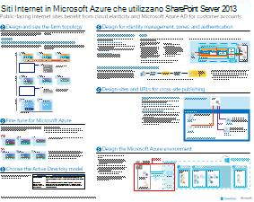
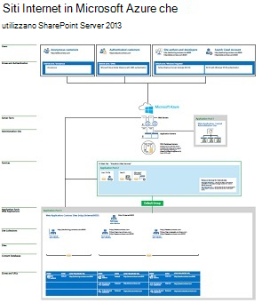

# Siti Internet in Microsoft Azure che utilizzano SharePoint Server 2013

 I siti Internet che utilizzano SharePoint Server 2013 sono avvantaggiati dall'hosting nei servizi di infrastruttura di Azure. In questo articolo sono disponibili risorse utili per progettare e implementare questa soluzione.

## Utilizzare i servizi infrastruttura di Azure per i siti Internet

Microsoft Azure fornisce un'opzione interessante per ospitare siti Internet basati su SharePoint Server 2013. I vantaggi includono quanto segue:

- Focalizzazione sullo sviluppo di un sito efficiente anziché sulla creazione dell'infrastruttura.

- Flessibilità per ridimensionare la soluzione basata su richiesta aumentando e riducendo.

- Pagare solo per le risorse necessarie e utilizzate.

- Sfruttare Azure Active Directory per gli account cliente.

- Aggiungere funzionalità che non sono attualmente disponibili in Microsoft 365, ad esempio report e analisi approfondite.

## Risorse

Le seguenti illustrazioni tecniche e i seguenti articoli forniscono informazioni su come progettare e implementare siti Internet in Azure utilizzando SharePoint Server 2013.

|Risorsa|Ulteriori informazioni|
|---|---|
|**Siti Internet SharePoint Server 2013 in Azure**      [PDF](https://go.microsoft.com/fwlink/p/?LinkId=392552) \| [Visio](https://go.microsoft.com/fwlink/p/?LinkId=392551)|Questo modello di architettura descrive le attività di progettazione e le scelte di architettura consigliate per i siti Internet in Azure.|
|**Esempio di progettazione: Siti Internet in Azure per SharePoint Server 2013**   [  ]   [PDF](https://go.microsoft.com/fwlink/p/?LinkId=392549)  \| [Visio](https://go.microsoft.com/fwlink/p/?LinkId=392548)|Utilizzare questo esempio di progettazione come punto di partenza per la propria architettura.|
|**[Microsoft Azure Architectures for SharePoint 2013](microsoft-azure-architectures-for-sharepoint-2013.md)**   |In questo articolo viene descritto come progettare le architetture Azure e ospitare le soluzioni SharePoint.|
|

## Vedere anche

[Microsoft 365 Solution and Architecture Center](../solutions/solution-architecture-center.md)
