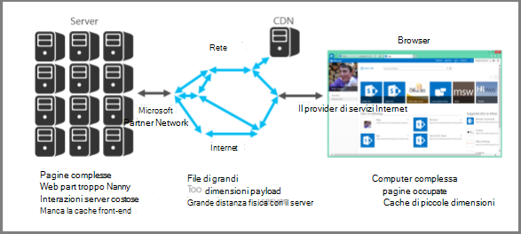

# Introduzione all'ottimizzazione delle prestazioni per SharePoint OnlineIntroduction to performance tuning for SharePoint Online

In questo articolo vengono illustrati gli aspetti specifici da considerare quando si progettano pagine per ottenere prestazioni ottimali in SharePoint Online.This article explains what specific aspects you need to consider when designing pages for best performance in SharePoint Online.
     
## Metriche di SharePoint OnlineSharePoint Online metrics

Le seguenti metriche generali per SharePoint Online forniscono dati reali sulle prestazioni:The following broad metrics for SharePoint Online provide real world data about performance:
  
- Velocità di caricamento delle pagineHow fast pages load
    
- Numero di round trip necessari per ogni paginaHow many round trips required per page
    
- Problemi con il servizioIssues with the service
    
- Altri aspetti che causano la riduzione delle prestazioniOther things that cause performance degradation
    
### Conclusioni in base ai datiConclusions reached because of the data

I dati dicono:The data tells us:
  
- La maggior parte delle pagine garantisce buone prestazioni con SharePoint Online.Most of the pages perform well on SharePoint Online.
    
- Le pagine non personalizzate si caricano molto rapidamente.Non-customized pages load very quickly.
    
- OneDrive for Business, i siti del team e le pagine di sistema, ad esempio _layouts e così via, si caricano tutti rapidamente.OneDrive for Business, team sites and system pages, such as _layouts, etc., are all quick to load.
    
- La pagina più lenta di 1% di SharePoint Online impiega più di 5.000 millisecondi per caricarsi.The slowest 1% of SharePoint Online pages take more than 5,000 milliseconds to load.
    
È possibile utilizzare un semplice test di benchmark per misurare le prestazioni confrontando il tempo di caricamento del proprio portale con il tempo di caricamento della home page di OneDrive for Business, perché utilizza alcune funzionalità personalizzate. Questo spesso sarà il primo passaggio che il supporto chiederà di completare durante la risoluzione dei problemi relativi alle prestazioni di rete.One simple benchmark test you can use would be to measure performance by comparing the load time of your own portal against the load time of the OneDrive for Business home page as it uses few customized features. This will often be the first step Support will ask you to complete when troubleshooting network performance issues.
  
## Usare un account utente standard per controllare le prestazioniUse a standard user account when checking performance

Un amministratore della raccolta siti, un proprietario del sito, un editor o un collaboratore appartengono a gruppi di sicurezza aggiuntivi, dispongono di autorizzazioni aggiuntive e pertanto dispongono di elementi aggiuntivi caricati da SharePoint in una pagina.A Site Collection Administrator, Site Owner, Editor, or Contributor belong to additional security groups, have additional permissions, and therefore have additional elements that SharePoint loads on a page.
  
Ciò è applicabile a SharePoint locale e SharePoint Online, ma in uno scenario locale le differenze non saranno così facilmente notate come in SharePoint Online.This is applicable to SharePoint on-premises and SharePoint Online but in an on-premises scenario the differences will not be as easily noticed as in SharePoint Online.
  
Per valutare correttamente le prestazioni di una pagina per gli utenti, è consigliabile utilizzare un account utente standard per evitare di caricare i controlli di creazione e modifica e il traffico aggiuntivo correlato ai gruppi di sicurezza.In order to correctly evaluate how a page will perform for users, you should use a standard user account to avoid loading the authoring controls and additional traffic related to security groups.
  
## Categorie di connessione per l'ottimizzazione delle prestazioniConnection categories for performance tuning

È possibile classificare le connessioni tra il server e l'utente in tre componenti principali. Prendere in considerazione tali componenti durante la progettazione delle pagine di SharePoint Online per comprendere i tempi di caricamento.You can categorize the connections between the server and the user into three main components. Consider these when designing SharePoint Online pages for insight into load times.
  
- **Server** Server ospitati da Microsoft nei datacenter.**Server** The servers that Microsoft hosts in datacenters.
    
- **Rete** La rete Microsoft, Internet e la rete locale tra il datacenter e gli utenti.**Network** The Microsoft network, the Internet, and your on-premises network between the datacenter and your users.
    
- **Browser** Posizione in cui viene caricata la pagina.**Browser** Where the page is loaded.
    
All'interno di queste tre connessioni in genere esistono cinque motivi che causano il 95% delle pagine lente. Ciascuna di queste situazioni è illustrata in questo articolo:Within these three connections there are typically five reasons that cause 95% of slow pages. Each of these reasons is discussed in this article:
  
- Problemi di navigazioneNavigation issues
    
- Rollup contenutoContent roll up
    
- File di grandi dimensioniLarge files
    
- Numero elevato di richieste al serverMany requests to the server
    
- Elaborazione di Web PartWeb Part processing
    
### Connessione al serverServer connection

Molti dei problemi che influiscono sulle prestazioni di SharePoint locale valgono anche per SharePoint Online.Many of the issues that affect performance with SharePoint on-premises also apply to SharePoint Online.
  
Come previsto, è necessario prestare maggiore controllo sul funzionamento dei server con SharePoint locale. Con SharePoint Online le cose sono leggermente diverse. Più lavoro si fa fare al server, maggiore sarà il tempo necessario per il rendering di una pagina. Con SharePoint, la causa principale a questo proposito sono le pagine complesse con più web part.As you would expect, you have far more control over how servers perform with on-premises SharePoint. With SharePoint Online things are a little different. The more work you make a server do, the longer it takes to render a page. With SharePoint, the biggest culprit in this respect are complex pages with multiple web parts.
  
SharePoint Server localeSharePoint Server on-premises
  

  
SharePoint OnlineSharePoint Online
  

  
Con SharePoint Online, alcune richieste di pagine potrebbero effettivamente finire per chiamare più server. Si potrebbe finire con una matrice di richieste tra i server per una singola richiesta. Tali interazioni sono costose da una prospettiva di caricamento della pagina e rendono le operazioni lente.With SharePoint Online, certain page requests may actually end up calling multiple servers. You could end up with a matrix of requests between servers for an individual request. These interactions are expensive from a page load perspective and will make things slow.
  
Esempi di tali interazioni da server a server sono:Examples of these server to server interactions are:
  
- Da Web a SQL ServerWeb to SQL Servers
    
- Da Web ai server applicazioniWeb to application servers
    
L'altra operazione che può rallentare le interazioni del server è la mancanza della cache. A differenza di SharePoint locale, esiste una possibilità molto piccola di raggiungere lo stesso server di una pagina visitata in precedenza. Ciò rende la memorizzazione degli oggetti nella cache obsoleta.The other thing that can slow down server interactions is cache misses. Unlike on-premises SharePoint, there is a very slim chance that you will hit the same server for a page that you have visited previously; this makes object caching obsolete.
  
### Connessione di reteNetwork connection

Con SharePoint locale che non utilizza una rete WAN, è possibile utilizzare una connessione ad alta velocità tra datacenter e utenti finali.With on-premises SharePoint that doesn't make use of a WAN, you may use a high-speed connection between datacenter and end-users. In genere, le operazioni sono facili da gestire da un punto di vista della rete.Generally, things are easy to manage from a network perspective.
  
Con SharePoint Online, esistono alcuni ulteriori fattori da considerare; ad esempio:With SharePoint Online, there are a few more factors to consider; for example:
  
- La rete MicrosoftThe Microsoft network
    
- InternetThe Internet
    
- Il provider di servizi InternetThe ISP
    
Indipendentemente dalla versione di SharePoint (e di rete) utilizzata, le operazioni che in genere rendono la rete occupata sono:Regardless of which version of SharePoint (and which network) you are using, things that will typically cause the network to be busy include:
  
- Payload di grandi dimensioniLarge payload
    
- Numero elevato di fileMany files
    
- Grande distanza fisica con il serverLarge physical distance to the server
    
Una funzionalità da sfruttare in SharePoint Online è Microsoft CDN (CDN, rete per la distribuzione di contenuti).One feature that you can leverage in SharePoint Online is the Microsoft CDN (Content Delivery Network). Una rete CDN è fondamentalmente un insieme di server distribuiti su più datacenter.A CDN is basically a distributed collection of servers deployed across multiple datacenters. Con una rete CDN, il contenuto delle pagine può essere ospitato su un server più vicino al client anche se il client è lontano dal server di SharePoint di origine.With a CDN, content on pages can be hosted on a server close to the client even if the client is far away from the originating SharePoint Server. Microsoft utilizzerà ancora questa funzionalità in futuro per l'archiviazione locale di istanze di pagine che non possono essere personalizzate, ad esempio la home page di amministrazione di SharePoint Online.Microsoft will be using this more in the future to store local instances of pages which cannot be customized, for example the SharePoint Online admin home page. Per ulteriori informazioni sulle reti CDN, vedere [Reti di recapito del contenuto.](content-delivery-networks.md)For more information about CDNs, see [Content delivery networks](content-delivery-networks.md).
  
Un elemento che è necessario tenere presente ma sul quale potrebbe non essere possibile agire, è la velocità della connessione del provider di servizi Internet. Uno strumento di test di velocità semplice indica la velocità della connessione.Something that you need to be aware of but may not be able to do much about is the connection speed of your ISP. A simple speed test tool will tell you the connection speed.
  
### Connessione del browserBrowser connection

Esistono alcuni fattori da considerare con il browser Web dal punto di vista delle prestazioni.There are a few factors to consider with web browsers from a performance perspective.
  
L'esplorazione pagine complesse influisce sulle prestazioni.Visiting complex pages will affect performance. La maggior parte dei browser presentano solo una piccola cache (circa 90 MB), mentre la media delle pagina Web in genere è di circa 1,6 MB.Most browsers only have a small cache (around 90MB), while the average web page is typically around 1.6MB. Questo non richiede molto tempo per abituarsi.This doesn't take long to get used up.
  
Anche la larghezza di banda potrebbe essere un problema.Bandwidth may also be an issue. Ad esempio, se un utente sta guardando video in un'altra sessione, ciò influirà sulle prestazioni della pagina SharePoint.For example, if a user is watching videos in another session, this will affect the performance of your SharePoint page. Anche se non puoi impedire agli utenti di trasmettere contenuti multimediali, puoi controllare il modo in cui una pagina verrà caricata per gli utenti.While you can't prevent users from streaming media, you can control the way a page will load for users.
  
Vedere gli articoli seguenti per le diverse tecniche di personalizzazione delle pagine di SharePoint Online e altre procedure consigliate per ottenere prestazioni ottimali.Check out the following articles for different SharePoint Online page customization techniques and other best practices to help you achieve optimal performance.
  
- [Opzioni di spostamento per SharePoint OnlineNavigation options for SharePoint Online](navigation-options-for-sharepoint-online.md)
    
- [Usare lo strumento Diagnostica pagine per SharePoint OnlineUse the Page Diagnostics tool for SharePoint Online](page-diagnostics-for-spo.md)
    
- [Ottimizzazione delle immagini per SharePoint OnlineImage optimization for SharePoint Online](image-optimization-for-sharepoint-online.md)
    
- [Ritardo caricamento immagini e JavaScript in SharePoint OnlineDelay loading images and JavaScript in SharePoint Online](delay-loading-images-and-javascript-in-sharepoint-online.md)
    
- [Minimizzazione e creazione di bundle in SharePoint OnlineMinification and bundling in SharePoint Online](minification-and-bundling-in-sharepoint-online.md)
    
- [Usare la rete per la distribuzione di contenuti di Office 365 con SharePoint OnlineUse the Office 365 Content Delivery Network (CDN) with SharePoint Online](use-microsoft-365-cdn-with-spo.md)
    
- [Utilizzo della web part Ricerca contenuto anziché della web part Query contenuto per migliorare le prestazioni in SharePoint OnlineUsing Content Search Web Part instead of Content Query Web Part to improve performance in SharePoint Online](using-content-search-web-part-instead-of-content-query-web-part-to-improve-perfo.md)
    
- [Pianificazione della capacità e test di carico di SharePoint OnlineCapacity planning and load testing SharePoint Online](capacity-planning-and-load-testing-sharepoint-online.md)
    
- [Diagnosi dei problemi delle prestazioni con SharePoint OnlineDiagnosing performance issues with SharePoint Online](diagnosing-performance-issues-with-sharepoint-online.md)
    
- [Utilizzo della cache oggetti con SharePoint OnlineUsing the object cache with SharePoint Online](using-the-object-cache-with-sharepoint-online.md)
    
- [Procedura: Evitare la limitazione o il blocco in SharePoint OnlineHow to: Avoid getting throttled or blocked in SharePoint Online](/sharepoint/dev/general-development/how-to-avoid-getting-throttled-or-blocked-in-sharepoint-online)
