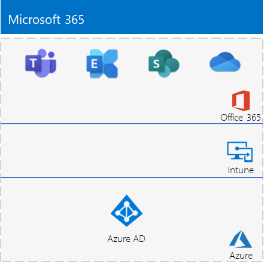

# <a name="the-lightweight-base-configuration"></a><span data-ttu-id="d8209-103">La configurazione di base</span><span class="sxs-lookup"><span data-stu-id="d8209-103">The lightweight base configuration</span></span>

<span data-ttu-id="d8209-104">*Questa guida al lab di test può essere usata sia per ambienti di testing di Microsoft 365 Enterprise che Office 365 Enterprise.*</span><span class="sxs-lookup"><span data-stu-id="d8209-104">*This Test Lab Guide can be used for both Microsoft 365 Enterprise and Office 365 Enterprise test environments.*</span></span>

<span data-ttu-id="d8209-105">Questo articolo fornisce istruzioni dettagliate su come creare un ambiente semplificato con un abbonamento Microsoft 365 E5 e un computer che esegue Windows 10 Enterprise.</span><span class="sxs-lookup"><span data-stu-id="d8209-105">This article provides you with step-by-step instructions to create a simplified environment with a Microsoft 365 E5 subscription and a computer running Windows 10 Enterprise.</span></span> 


<span data-ttu-id="d8209-107">Utilizzare l'ambiente risultante per testare le funzionalità di [Microsoft 365 Enterprise](https://www.microsoft.com/microsoft-365/enterprise).</span><span class="sxs-lookup"><span data-stu-id="d8209-107">Use the resulting environment to test the features and functionality of [Microsoft 365 Enterprise](https://www.microsoft.com/microsoft-365/enterprise).</span></span>


  
> [!TIP]
> <span data-ttu-id="d8209-109">Cliccare sulla [Guida al lab di test di Microsoft 365 Enterprise](../media/m365-enterprise-test-lab-guides/Microsoft365EnterpriseTLGStack.pdf) per consultare una mappa di tutti gli articoli della guida al lab test di Microsoft 365 Enterprise.</span><span class="sxs-lookup"><span data-stu-id="d8209-109">Click [Microsoft 365 Enterprise Test Lab Guide Stack](../media/m365-enterprise-test-lab-guides/Microsoft365EnterpriseTLGStack.pdf) for a visual map to all the articles in the Microsoft 365 Enterprise Test Lab Guide stack.</span></span>

## <a name="phase-1-create-your-office-365-e5-subscription"></a><span data-ttu-id="d8209-110">Fase 1: creare la sottoscrizione di Office 365 E5</span><span class="sxs-lookup"><span data-stu-id="d8209-110">Phase 1: Create your Office 365 E5 subscription</span></span>

<span data-ttu-id="d8209-111">Si inizia con un abbonamento di valutazione a Office 365 E5 e quindi si aggiunge l'abbonamento a Microsoft 365 E5.</span><span class="sxs-lookup"><span data-stu-id="d8209-111">We start with an Office 365 E5 trial subscription and then add the Microsoft 365 E5 subscription to it.</span></span>

<span data-ttu-id="d8209-112">Per avviare la sottoscrizione di valutazione di Office 365 E5, è necessario innanzitutto un nome di società fittizia e un nuovo account Microsoft.</span><span class="sxs-lookup"><span data-stu-id="d8209-112">To start your Office 365 E5 trial subscription, you first need a fictitious company name and a new Microsoft account.</span></span>
  
1. <span data-ttu-id="d8209-113">We recommend that you use a variant of the company name Contoso for your company name, which is a fictitious company used in Microsoft sample content, but it isn't required.</span><span class="sxs-lookup"><span data-stu-id="d8209-113">We recommend that you use a variant of the company name Contoso for your company name, which is a fictitious company used in Microsoft sample content, but it isn't required.</span></span> <span data-ttu-id="d8209-114">Record your fictitious company name here:</span><span class="sxs-lookup"><span data-stu-id="d8209-114">Record your fictitious company name here:</span></span> 
    
2. <span data-ttu-id="d8209-116">To sign up for a new Microsoft account, go to [https://outlook.com](https://outlook.com) and create an account with a new email account and address.</span><span class="sxs-lookup"><span data-stu-id="d8209-116">To sign up for a new Microsoft account, go to [https://outlook.com](https://outlook.com) and create an account with a new email account and address.</span></span> <span data-ttu-id="d8209-117">You will use this account to sign up for Office 365.</span><span class="sxs-lookup"><span data-stu-id="d8209-117">You will use this account to sign up for Office 365.</span></span>
    
  - <span data-ttu-id="d8209-118">Registrare il nome e cognome del nuovo account qui:</span><span class="sxs-lookup"><span data-stu-id="d8209-118">Record the first and last name of your new account here:</span></span> 
    
  - <span data-ttu-id="d8209-120">Registrare l'indirizzo di posta elettronica del nuovo account qui:</span><span class="sxs-lookup"><span data-stu-id="d8209-120">Record the new email account address here:</span></span> <span data-ttu-id="d8209-122">@outlook.com</span><span class="sxs-lookup"><span data-stu-id="d8209-122">@outlook.com</span></span>
    
### <a name="sign-up-for-an-office-365-e5-trial-subscription"></a><span data-ttu-id="d8209-123">Registrare un abbonamento di valutazione di Office 365 E5</span><span class="sxs-lookup"><span data-stu-id="d8209-123">Sign up for an Office 365 E5 trial subscription</span></span>

1. <span data-ttu-id="d8209-124">Aprire il browser Internet nel computer e passare a [https://aka.ms/e5trial](https://aka.ms/e5trial).</span><span class="sxs-lookup"><span data-stu-id="d8209-124">Open the Internet browser on your computer and go to [https://aka.ms/e5trial](https://aka.ms/e5trial).</span></span>
    
2. <span data-ttu-id="d8209-125">Nella pagina **Grazie per aver scelto Office 365 E5** specificare l'indirizzo e-mail del nuovo account al passaggio 1.</span><span class="sxs-lookup"><span data-stu-id="d8209-125">On the **Thank you for choosing Office 365 E5** page, specify, your new email account address in step 1.</span></span>
3. <span data-ttu-id="d8209-126">Nel passaggio 2 del processo dell'abbonamento di valutazione digitare le informazioni richieste e quindi eseguire la verifica.</span><span class="sxs-lookup"><span data-stu-id="d8209-126">In step 2 of the trail subscription process, type the requested information, and then perform the verification.</span></span>
4. <span data-ttu-id="d8209-127">Nel passaggio 3 digitare un nome di organizzazione e quindi il nome dell'account che sarà amministratore globale dell'abbonamento.</span><span class="sxs-lookup"><span data-stu-id="d8209-127">In step 3, type an organization name and then an account name that will be the global admin for the subscription.</span></span> 
5. <span data-ttu-id="d8209-128">Per il passaggio 4, registrare la pagina di accesso qui (selezionare e copiare):</span><span class="sxs-lookup"><span data-stu-id="d8209-128">For step 4, record the sign-in page here (select and copy):</span></span>  
6. <span data-ttu-id="d8209-130">Registrare l'ID utente qui: .onmicrosoft.com</span><span class="sxs-lookup"><span data-stu-id="d8209-130">Record the user ID here: .onmicrosoft.com</span></span>  
   <span data-ttu-id="d8209-131">Annotare la password in un posto sicuro.</span><span class="sxs-lookup"><span data-stu-id="d8209-131">Record the password that you typed in a secure location.</span></span>
   <span data-ttu-id="d8209-132">Questo valore verrà chiamato **Nome amministratore globale**.</span><span class="sxs-lookup"><span data-stu-id="d8209-132">This value will be referred to as the **global administrator name**.</span></span>
8. <span data-ttu-id="d8209-133">Fare clic su **Vai alla configurazione**.</span><span class="sxs-lookup"><span data-stu-id="d8209-133">Click **Go to Setup**.</span></span>
9. <span data-ttu-id="d8209-134">Nella configurazione di Office 365 E5 fare clic su **Continua a usare *nomeorganizzazione*.onmicrosoft.com per la posta elettronica e l'accesso** e quindi fare clic su **Esci e continua più tardi**.</span><span class="sxs-lookup"><span data-stu-id="d8209-134">In Office 365 E5 Setup, click **Continue using *your organization*.onmicrosoft.com for email and signing in**, and then click **Exit and continue later**.</span></span>

<span data-ttu-id="d8209-135">Dovrebbe essere visualizzata l'interfaccia di amministrazione di Microsoft 365.</span><span class="sxs-lookup"><span data-stu-id="d8209-135">You should see the Microsoft 365 admin center.</span></span>
  
<span data-ttu-id="d8209-136">È stato creato un abbonamento di valutazione a Office 365 in modo che l'ambiente di testing includa un tenant di Azure AD separato rispetto a quelli a pagamento attualmente in uso.</span><span class="sxs-lookup"><span data-stu-id="d8209-136">We have you create a trial subscription of Office 365 so that your test environment has a separate Azure AD tenant from any paid subscriptions you currently have.</span></span> <span data-ttu-id="d8209-137">Questa separazione indica che è possibile aggiungere e rimuovere utenti e gruppi nel tenant di test senza influire sugli abbonamenti di produzione.</span><span class="sxs-lookup"><span data-stu-id="d8209-137">This separation means you can add and remove users and groups in the test tenant without affecting your production subscriptions.</span></span>
    
## <a name="phase-2-configure-your-office-365-trial-subscription"></a><span data-ttu-id="d8209-138">Fase 2: configurare l'abbonamento di valutazione a Office 365</span><span class="sxs-lookup"><span data-stu-id="d8209-138">Phase 2: Configure your Office 365 trial subscription</span></span>

<span data-ttu-id="d8209-139">In questa fase è possibile configurare l'abbonamento con altri utenti e assegnare questi ultimi le licenze di Office 365 E5.</span><span class="sxs-lookup"><span data-stu-id="d8209-139">In this phase, you configure your subscription with additional users and assign them Office 365 E5 licenses.</span></span>
  
<span data-ttu-id="d8209-140">Seguire le istruzioni in [Connettersi a Office 365 PowerShell](https://docs.microsoft.com/office365/enterprise/powershell/connect-to-office-365-powershell#connect-with-the-azure-active-directory-powershell-for-graph-module) per connettersi all'abbonamento con il modulo Azure Active Directory PowerShell per Graph dal proprio computer.</span><span class="sxs-lookup"><span data-stu-id="d8209-140">Use the instructions in [Connect to Office 365 PowerShell](https://docs.microsoft.com/office365/enterprise/powershell/connect-to-office-365-powershell#connect-with-the-azure-active-directory-powershell-for-graph-module) to connect to your subscription with the Azure Active Directory PowerShell for Graph module from your computer.</span></span>
    
<span data-ttu-id="d8209-141">Nella finestra di dialogo **Richiesta credenziali di Windows PowerShell** digitare il nome dell'amministratore globale (ad esempio: jdoe@contosotoycompany.onmicrosoft.com) e la password.</span><span class="sxs-lookup"><span data-stu-id="d8209-141">In the **Windows PowerShell Credential Request** dialog box, type the global administrator name (example: jdoe@contosotoycompany.onmicrosoft.com) and password.</span></span>
  
<span data-ttu-id="d8209-142">Immettere il nome dell'organizzazione (ad esempio: contosotoycompany), il prefisso internazionale a due caratteri, una password comune di account e quindi eseguire i comandi seguenti dal prompt di PowerShell:</span><span class="sxs-lookup"><span data-stu-id="d8209-142">Fill in your organization name (example: contosotoycompany), the two-character country code for your location, a common account password, and then run the following commands from the PowerShell prompt:</span></span>

```powershell
$orgName="<organization name>"
$loc="<two-character country code, such as US>"
$commonPW="<common user account password>"
$PasswordProfile=New-Object -TypeName Microsoft.Open.AzureAD.Model.PasswordProfile
$PasswordProfile.Password=$commonPW

$userUPN= "user2@" + $orgName + ".onmicrosoft.com"
New-AzureADUser -DisplayName "User 2" -GivenName User -SurName 2 -UserPrincipalName $userUPN -UsageLocation $loc -AccountEnabled $true -PasswordProfile $PasswordProfile -MailNickName "user2"
$License = New-Object -TypeName Microsoft.Open.AzureAD.Model.AssignedLicense
$License.SkuId = (Get-AzureADSubscribedSku | Where-Object -Property SkuPartNumber -Value "ENTERPRISEPREMIUM" -EQ).SkuID
$LicensesToAssign = New-Object -TypeName Microsoft.Open.AzureAD.Model.AssignedLicenses
$LicensesToAssign.AddLicenses = $License
Set-AzureADUserLicense -ObjectId $userUPN -AssignedLicenses $LicensesToAssign

$userUPN= "user3@" + $orgName + ".onmicrosoft.com"
New-AzureADUser -DisplayName "User 3" -GivenName User -SurName 3 -UserPrincipalName $userUPN -UsageLocation $loc -AccountEnabled $true -PasswordProfile $PasswordProfile -MailNickName "user3"
$License = New-Object -TypeName Microsoft.Open.AzureAD.Model.AssignedLicense
$License.SkuId = (Get-AzureADSubscribedSku | Where-Object -Property SkuPartNumber -Value "ENTERPRISEPREMIUM" -EQ).SkuID
$LicensesToAssign = New-Object -TypeName Microsoft.Open.AzureAD.Model.AssignedLicenses
$LicensesToAssign.AddLicenses = $License
Set-AzureADUserLicense -ObjectId $userUPN -AssignedLicenses $LicensesToAssign

$userUPN= "user4@" + $orgName + ".onmicrosoft.com"
New-AzureADUser -DisplayName "User 4" -GivenName User -SurName 4 -UserPrincipalName $userUPN -UsageLocation $loc -AccountEnabled $true -PasswordProfile $PasswordProfile -MailNickName "user4"
$License = New-Object -TypeName Microsoft.Open.AzureAD.Model.AssignedLicense
$License.SkuId = (Get-AzureADSubscribedSku | Where-Object -Property SkuPartNumber -Value "ENTERPRISEPREMIUM" -EQ).SkuID
$LicensesToAssign = New-Object -TypeName Microsoft.Open.AzureAD.Model.AssignedLicenses
$LicensesToAssign.AddLicenses = $License
Set-AzureADUserLicense -ObjectId $userUPN -AssignedLicenses $LicensesToAssign
```
> [!NOTE]
> <span data-ttu-id="d8209-143">L'uso di una password comune qui consente l'automazione e agevola la configurazione per un ambiente di testing.</span><span class="sxs-lookup"><span data-stu-id="d8209-143">The use of a common password here is for automation and ease of configuration for a test environment.</span></span> <span data-ttu-id="d8209-144">Ovviamente, questo approccio è sconsigliato per le sottoscrizioni di produzione.</span><span class="sxs-lookup"><span data-stu-id="d8209-144">Obviously, this is highly discouraged for production subscriptions.</span></span> 

### <a name="record-key-information-for-future-reference"></a><span data-ttu-id="d8209-145">Registrare informazioni chiave per riferimenti futuri</span><span class="sxs-lookup"><span data-stu-id="d8209-145">Record key information for future reference</span></span>

<span data-ttu-id="d8209-146">Si consiglia di stampare questo articolo per registrare le informazioni specifiche necessarie per questo ambiente nei 30 giorni dell'abbonamento di valutazione a Office 365.</span><span class="sxs-lookup"><span data-stu-id="d8209-146">You might want to print this article to record the specific information that you will need for this environment over the 30 days of the Office 365 trial subscription.</span></span> <span data-ttu-id="d8209-147">È possibile estendere l'abbonamento di prova per altri 30 giorni.</span><span class="sxs-lookup"><span data-stu-id="d8209-147">You can easily extend the trail subscription for another 30 days.</span></span> <span data-ttu-id="d8209-148">Per un ambiente di testing permanente, creare un nuovo abbonamento a pagamento con un tenant di Azure AD separato e un numero limitato di licenze.</span><span class="sxs-lookup"><span data-stu-id="d8209-148">For a permanent test environment, create a new paid subscription with a separate Azure AD tenant and a small number of licenses.</span></span>

<span data-ttu-id="d8209-149">Registrare questi valori:</span><span class="sxs-lookup"><span data-stu-id="d8209-149">Record these values:</span></span>
  
- <span data-ttu-id="d8209-150">nome amministratore globale:</span><span class="sxs-lookup"><span data-stu-id="d8209-150">global administrator name:</span></span> <span data-ttu-id="d8209-152">.onmicrosoft.com (dal passaggio 6 della fase 1)</span><span class="sxs-lookup"><span data-stu-id="d8209-152">.onmicrosoft.com (from step 6 of Phase 1)</span></span>
    
    <span data-ttu-id="d8209-153">Annotare anche la password di questo account in una posizione sicura.</span><span class="sxs-lookup"><span data-stu-id="d8209-153">Also record the password for this account in a secure location.</span></span>
    
- <span data-ttu-id="d8209-154">Nome dell'organizzazione dell'abbonamento di valutazione:</span><span class="sxs-lookup"><span data-stu-id="d8209-154">Your trial subscription organization name:</span></span>  <span data-ttu-id="d8209-156">(dal passaggio 4 della fase 1)</span><span class="sxs-lookup"><span data-stu-id="d8209-156">(from step 4 of Phase 1)</span></span>
    
- <span data-ttu-id="d8209-157">Per elencare gli account di User 2, User 3, User 4, e User 5, eseguire i comandi seguenti dal modulo di Microsoft Azure Active Directory per il prompt di Windows PowerShell:</span><span class="sxs-lookup"><span data-stu-id="d8209-157">To list the accounts for User 2, User 3, User 4, and User 5, run the following command from the Windows Azure Active Directory Module for Windows PowerShell prompt:</span></span>
    
  ```powershell
  Get-AzureADUser | Sort UserPrincipalName | Select UserPrincipalName
  ```

    <span data-ttu-id="d8209-158">Registrare i nomi degli account qui:</span><span class="sxs-lookup"><span data-stu-id="d8209-158">Record the account names here:</span></span>
    
  - <span data-ttu-id="d8209-159">Nome account utente 2: user2@</span><span class="sxs-lookup"><span data-stu-id="d8209-159">User 2 account name: user2@</span></span><span data-ttu-id="d8209-161">.onmicrosoft.com</span><span class="sxs-lookup"><span data-stu-id="d8209-161">.onmicrosoft.com</span></span>
    
  - <span data-ttu-id="d8209-162">Nome account utente 3: user3@</span><span class="sxs-lookup"><span data-stu-id="d8209-162">User 3 account name: user3@</span></span><span data-ttu-id="d8209-164">.onmicrosoft.com</span><span class="sxs-lookup"><span data-stu-id="d8209-164">.onmicrosoft.com</span></span>
    
  - <span data-ttu-id="d8209-165">Nome account utente 4: user4@</span><span class="sxs-lookup"><span data-stu-id="d8209-165">User 4 account name: user4@</span></span><span data-ttu-id="d8209-167">.onmicrosoft.com</span><span class="sxs-lookup"><span data-stu-id="d8209-167">.onmicrosoft.com</span></span>
    
  - <span data-ttu-id="d8209-168">Nome account utente 5: user5@</span><span class="sxs-lookup"><span data-stu-id="d8209-168">User 5 account name: user5@</span></span><span data-ttu-id="d8209-170">.onmicrosoft.com</span><span class="sxs-lookup"><span data-stu-id="d8209-170">.onmicrosoft.com</span></span>
    
    <span data-ttu-id="d8209-171">Registrare anche la password comune degli account in un posto sicuro.</span><span class="sxs-lookup"><span data-stu-id="d8209-171">Also record the common password for these accounts in a secure location.</span></span>
   

### <a name="using-an-office-365-test-environment"></a><span data-ttu-id="d8209-172">Uso di un ambiente di testing di Office 365</span><span class="sxs-lookup"><span data-stu-id="d8209-172">Using an Office 365 test environment</span></span>

<span data-ttu-id="d8209-173">Se tutto ciò che serve è un ambiente di testing di Office 365, è possibile fermarsi qui.</span><span class="sxs-lookup"><span data-stu-id="d8209-173">If all you need is an Office 365 test environment, you can stop here.</span></span> 

<span data-ttu-id="d8209-174">Per altre guide al lab di test valide sia per Office 365 che per Microsoft 365, vedere [Guide al lab di test di Microsoft 365 Enterprise](m365-enterprise-test-lab-guides.md).</span><span class="sxs-lookup"><span data-stu-id="d8209-174">See [Microsoft 365 Enterprise Test Lab Guides](m365-enterprise-test-lab-guides.md) for additional Test Lab Guides that apply to both Office 365 and Microsoft 365.</span></span>
  
## <a name="phase-3-add-a-microsoft-365-e5-trial-subscription"></a><span data-ttu-id="d8209-175">Fase 3: aggiungere un abbonamento di valutazione a Microsoft 365 E5</span><span class="sxs-lookup"><span data-stu-id="d8209-175">Phase 3: Add a Microsoft 365 E5 trial subscription</span></span>

<span data-ttu-id="d8209-176">In questa fase è possibile sottoscrivere un abbonamento di valutazione a Microsoft 365 E5 e aggiungerlo alla stessa organizzazione dell'abbonamento di valutazione a Office 365 E5.</span><span class="sxs-lookup"><span data-stu-id="d8209-176">In this phase, you sign up for the Microsoft 365 E5 trial subscription and add it to the same organization as your Office 365 E5 trial subscription.</span></span>
  
<span data-ttu-id="d8209-177">Prima di tutto, aggiungere l'abbonamento di valutazione a Microsoft 365 E5 e assegnare la nuova licenza di Microsoft 365 all'account di amministratore globale.</span><span class="sxs-lookup"><span data-stu-id="d8209-177">First, add the Microsoft 365 E5 trial subscription and assign the new Microsoft 365 license to your global administrator account.</span></span>
  
1. <span data-ttu-id="d8209-178">Con un'istanza privata di un browser Internet, accedere all'interfaccia di amministrazione di Microsoft 365 all'indirizzo [https://admin.microsoft.com](https://admin.microsoft.com) con le credenziali dell'account di amministratore globale.</span><span class="sxs-lookup"><span data-stu-id="d8209-178">With a private instance of an Internet browser, sign in to the Microsoft 365 admin center at [https://admin.microsoft.com](https://admin.microsoft.com) with your global administrator account credentials.</span></span>
    
2. <span data-ttu-id="d8209-179">Nella pagina dell'**interfaccia di amministrazione di Microsoft 365** fare clic su **Fatturazione > Acquisto di servizi** nella barra di spostamento sinistra.</span><span class="sxs-lookup"><span data-stu-id="d8209-179">On the **Microsoft 365 admin center** page, in the left navigation, click **Billing > Purchase services**.</span></span>
    
3. <span data-ttu-id="d8209-180">Nella pagina **Acquisto di servizi** fare clic su **Microsoft 365 E5** e quindi fare clic su **Ottieni una versione di prova gratuita**.</span><span class="sxs-lookup"><span data-stu-id="d8209-180">On the **Purchase services** page, click **Microsoft 365 E5**, and then click **Get free trial**.</span></span>

4. <span data-ttu-id="d8209-181">Nella pagina **Valutazione di Microsoft 365 E5** scegliere di ricevere una chiamata o un SMS, immettere il numero di telefono, quindi fare clic su **Inviami un SMS** o **Chiamami**.</span><span class="sxs-lookup"><span data-stu-id="d8209-181">On the **Microsoft 365 E5 Trial** page, choose to receive a text or a call, enter your phone number, then click **Text me** or **Call me**.</span></span> <span data-ttu-id="d8209-182">Eseguire la verifica.</span><span class="sxs-lookup"><span data-stu-id="d8209-182">Perform the verification.</span></span>

5. <span data-ttu-id="d8209-183">Nella pagina **Conferma l'ordine**, fare clic su **Prova adesso**.</span><span class="sxs-lookup"><span data-stu-id="d8209-183">On the **Confirm your order** page, click **Try now**.</span></span>

6. <span data-ttu-id="d8209-184">Nella pagina **Ricevuta ordine**, fare clic su **Continua**.</span><span class="sxs-lookup"><span data-stu-id="d8209-184">On the **Order receipt** page, click **Continue**.</span></span>

7. <span data-ttu-id="d8209-185">Nell'interfaccia di amministrazione di Microsoft 365 fare clic su **Utenti > Utenti attivi**.</span><span class="sxs-lookup"><span data-stu-id="d8209-185">In the Microsoft 365 admin center, click **Users > Active users**.</span></span>

8. <span data-ttu-id="d8209-186">In **Utenti attivi**fare clic sull'account amministratore.</span><span class="sxs-lookup"><span data-stu-id="d8209-186">In **Active users**, click your administrator account.</span></span>

9. <span data-ttu-id="d8209-187">Fare clic su **Licenze e app**.</span><span class="sxs-lookup"><span data-stu-id="d8209-187">Click **Licenses and apps**.</span></span>

10. <span data-ttu-id="d8209-188">Disabilitare la licenza per Office 365 Enterprise E5 e abilitare la licenza per Microsoft 365 E5.</span><span class="sxs-lookup"><span data-stu-id="d8209-188">Disable the license for Office 365 Enterprise E5 and enable the license for Microsoft 365 E5.</span></span>

11. <span data-ttu-id="d8209-189">Fare clic su **Salva modifiche** e quindi chiudere il riquadro delle informazioni sull'account utente.</span><span class="sxs-lookup"><span data-stu-id="d8209-189">Click **Save changes** and then close the user account information pane.</span></span>

<span data-ttu-id="d8209-190">Successivamente, ripetere i passaggi da 8 a 11 della procedura precedente per tutti gli altri account (Utente 2, Utente 3, Utente 4 e Utente 5).</span><span class="sxs-lookup"><span data-stu-id="d8209-190">Next, repeat steps 8 through 11 of the previous procedure for all of your other accounts (User 2, User 3, User 4, and User 5).</span></span>
  
> [!NOTE]
> <span data-ttu-id="d8209-191">L'abbonamento di valutazione a Microsoft 365 E5 dura 30 giorni.</span><span class="sxs-lookup"><span data-stu-id="d8209-191">The Microsoft 365 E5 trial subscription is 30 days.</span></span> <span data-ttu-id="d8209-192">Per un ambiente di testing permanente, convertire questo abbonamento di valutazione in uno a pagamento con un numero limitato di licenze.</span><span class="sxs-lookup"><span data-stu-id="d8209-192">For a permanent test environment, convert this trial subscription into a paid subscription with a small number of licenses.</span></span> 
  
<span data-ttu-id="d8209-193">A questo punto, l'ambiente di test dispone di:</span><span class="sxs-lookup"><span data-stu-id="d8209-193">Your test environment now has:</span></span>
  
- <span data-ttu-id="d8209-194">Un abbonamento di valutazione a Microsoft 365 E5.</span><span class="sxs-lookup"><span data-stu-id="d8209-194">A Microsoft 365 E5 trial subscription.</span></span>
- <span data-ttu-id="d8209-195">Tutti gli account utente appropriati (solo l'amministratore globale o tutti e cinque gli account utente) sono abilitati per l'uso di Microsoft 365 E5.</span><span class="sxs-lookup"><span data-stu-id="d8209-195">All your appropriate user accounts (either just the global administrator or all five user accounts) are enabled to use Microsoft 365 E5.</span></span>
    
<span data-ttu-id="d8209-196">Di seguito è riportata la configurazione risultante che consente di aggiungere Microsoft 365 E5 e include sia Office 365 che Enterprise Security + Management (EMS).</span><span class="sxs-lookup"><span data-stu-id="d8209-196">Here is your resulting configuration, which adds Microsoft 365 E5, which includes both Office 365 and Enterprise Security + Management (EMS).</span></span>
  

  
## <a name="phase-4-create-a-windows-10-enterprise-computer"></a><span data-ttu-id="d8209-198">Fase 4: creare un computer con Windows 10 Enterprise</span><span class="sxs-lookup"><span data-stu-id="d8209-198">Phase 4: Create a Windows 10 Enterprise computer</span></span>

<span data-ttu-id="d8209-199">In questa fase è necessario creare un computer autonomo con sistema operativo Windows 10 Enterprise, come un computer fisico, una macchina virtuale o una macchina virtuale di Azure.</span><span class="sxs-lookup"><span data-stu-id="d8209-199">In this phase, you create a standalone computer running Windows 10 Enterprise as either a physical computer, a virtual machine, or an Azure virtual machine.</span></span>
  
### <a name="physical-computer"></a><span data-ttu-id="d8209-200">Computer fisico</span><span class="sxs-lookup"><span data-stu-id="d8209-200">Physical computer</span></span>

<span data-ttu-id="d8209-201">Obtain a personal computer and install Windows 10 Enterprise on it.</span><span class="sxs-lookup"><span data-stu-id="d8209-201">Obtain a personal computer and install Windows 10 Enterprise on it.</span></span> <span data-ttu-id="d8209-202">You can download the Windows 10 Enterprise trial [here](https://www.microsoft.com/evalcenter/evaluate-windows-10-enterprise).</span><span class="sxs-lookup"><span data-stu-id="d8209-202">You can download the Windows 10 Enterprise trial [here](https://www.microsoft.com/evalcenter/evaluate-windows-10-enterprise).</span></span>
  
### <a name="virtual-machine"></a><span data-ttu-id="d8209-203">Macchina virtuale</span><span class="sxs-lookup"><span data-stu-id="d8209-203">Virtual machine</span></span>

<span data-ttu-id="d8209-204">Create a virtual machine using the hypervisor of your choice and install Windows 10 Enterprise on it.</span><span class="sxs-lookup"><span data-stu-id="d8209-204">Create a virtual machine using the hypervisor of your choice and install Windows 10 Enterprise on it.</span></span> <span data-ttu-id="d8209-205">You can download the Windows 10 Enterprise trial [here](https://www.microsoft.com/evalcenter/evaluate-windows-10-enterprise).</span><span class="sxs-lookup"><span data-stu-id="d8209-205">You can download the Windows 10 Enterprise trial [here](https://www.microsoft.com/evalcenter/evaluate-windows-10-enterprise).</span></span>
  
### <a name="virtual-machine-in-azure"></a><span data-ttu-id="d8209-206">Macchina virtuale in Azure</span><span class="sxs-lookup"><span data-stu-id="d8209-206">Virtual machine in Azure</span></span>

<span data-ttu-id="d8209-207">To create a Windows 10 virtual machine in Microsoft Azure, ***you must have a Visual Studio-based subscription***, which has access to the image for Windows 10 Enterprise.</span><span class="sxs-lookup"><span data-stu-id="d8209-207">To create a Windows 10 virtual machine in Microsoft Azure, ***you must have a Visual Studio-based subscription***, which has access to the image for Windows 10 Enterprise.</span></span> <span data-ttu-id="d8209-208">Other types of Azure subscriptions, such as trial and paid subscriptions, do not have access to this image.</span><span class="sxs-lookup"><span data-stu-id="d8209-208">Other types of Azure subscriptions, such as trial and paid subscriptions, do not have access to this image.</span></span> <span data-ttu-id="d8209-209">For the latest information, see [Use Windows client in Azure for dev/test scenarios](https://docs.microsoft.com/azure/virtual-machines/windows/client-images).</span><span class="sxs-lookup"><span data-stu-id="d8209-209">For the latest information, see [Use Windows client in Azure for dev/test scenarios](https://docs.microsoft.com/azure/virtual-machines/windows/client-images).</span></span>
  
> [!NOTE]
> <span data-ttu-id="d8209-210">The following command sets use the latest version of Azure PowerShell.</span><span class="sxs-lookup"><span data-stu-id="d8209-210">The following command sets use the latest version of Azure PowerShell.</span></span> <span data-ttu-id="d8209-211">See [Get started with Azure PowerShell cmdlets](https://docs.microsoft.com/powershell/azureps-cmdlets-docs/).</span><span class="sxs-lookup"><span data-stu-id="d8209-211">See [Get started with Azure PowerShell cmdlets](https://docs.microsoft.com/powershell/azureps-cmdlets-docs/).</span></span> <span data-ttu-id="d8209-212">These command sets build a Windows 10 Enterprise virtual machine named WIN10 and all of its required infrastructure, including a resource group, a storage account, and a virtual network.</span><span class="sxs-lookup"><span data-stu-id="d8209-212">These command sets build a Windows 10 Enterprise virtual machine named WIN10 and all of its required infrastructure, including a resource group, a storage account, and a virtual network.</span></span> <span data-ttu-id="d8209-213">If you are already familiar with Azure infrastructure services, please adapt these instructions to suit your currently deployed infrastructure.</span><span class="sxs-lookup"><span data-stu-id="d8209-213">If you are already familiar with Azure infrastructure services, please adapt these instructions to suit your currently deployed infrastructure.</span></span> 
  
<span data-ttu-id="d8209-214">Innanzitutto, avviare un prompt di Microsoft PowerShell.</span><span class="sxs-lookup"><span data-stu-id="d8209-214">First, start a Microsoft PowerShell prompt.</span></span>
  
<span data-ttu-id="d8209-215">Accedere al proprio account Azure con il seguente comando.</span><span class="sxs-lookup"><span data-stu-id="d8209-215">Sign in to your Azure account with the following command.</span></span>
  
```powershell
Connect-AzAccount
```

<span data-ttu-id="d8209-216">Ottenere il nome della sottoscrizione utilizzando il comando seguente.</span><span class="sxs-lookup"><span data-stu-id="d8209-216">Get your subscription name using the following command.</span></span>
  
```powershell
Get-AzSubscription | Sort Name | Select Name
```

<span data-ttu-id="d8209-217">Set your Azure subscription.</span><span class="sxs-lookup"><span data-stu-id="d8209-217">Set your Azure subscription.</span></span> <span data-ttu-id="d8209-218">Replace everything within the quotes, including the \< and > characters, with the correct name.</span><span class="sxs-lookup"><span data-stu-id="d8209-218">Replace everything within the quotes, including the \< and > characters, with the correct name.</span></span>
  
```powershell
$subscr="<subscription name>"
Get-AzSubscription -SubscriptionName $subscr | Select-AzSubscription
```

<span data-ttu-id="d8209-219">Next, create a new resource group.</span><span class="sxs-lookup"><span data-stu-id="d8209-219">Next, create a new resource group.</span></span> <span data-ttu-id="d8209-220">To determine a unique resource group name, use this command to list your existing resource groups.</span><span class="sxs-lookup"><span data-stu-id="d8209-220">To determine a unique resource group name, use this command to list your existing resource groups.</span></span>
  
```powershell
Get-AzResourceGroup | Sort ResourceGroupName | Select ResourceGroupName
```

<span data-ttu-id="d8209-221">Create your new resource group with these commands.</span><span class="sxs-lookup"><span data-stu-id="d8209-221">Create your new resource group with these commands.</span></span> <span data-ttu-id="d8209-222">Replace everything within the quotes, including the \< and > characters, with the correct names.</span><span class="sxs-lookup"><span data-stu-id="d8209-222">Replace everything within the quotes, including the \< and > characters, with the correct names.</span></span>
  
```powershell
$rgName="<resource group name>"
$locName="<location name, such as West US>"
New-AzResourceGroup -Name $rgName -Location $locName
```

<span data-ttu-id="d8209-223">Next, you create a new virtual network and the WIN10 virtual machine with these commands.</span><span class="sxs-lookup"><span data-stu-id="d8209-223">Next, you create a new virtual network and the WIN10 virtual machine with these commands.</span></span> <span data-ttu-id="d8209-224">When prompted, provide the name and password of the local administrator account for WIN10 and store these in a secure location.</span><span class="sxs-lookup"><span data-stu-id="d8209-224">When prompted, provide the name and password of the local administrator account for WIN10 and store these in a secure location.</span></span>
  
```powershell
$corpnetSubnet=New-AzVirtualNetworkSubnetConfig -Name Corpnet -AddressPrefix 10.0.0.0/24
New-AzVirtualNetwork -Name "M365Ent-TestLab" -ResourceGroupName $rgName -Location $locName -AddressPrefix 10.0.0.0/8 -Subnet $corpnetSubnet
$rule1=New-AzNetworkSecurityRuleConfig -Name "RDPTraffic" -Description "Allow RDP to all VMs on the subnet" -Access Allow -Protocol Tcp -Direction Inbound -Priority 100 -SourceAddressPrefix Internet -SourcePortRange * -DestinationAddressPrefix * -DestinationPortRange 3389
New-AzNetworkSecurityGroup -Name Corpnet -ResourceGroupName $rgName -Location $locName -SecurityRules $rule1
$vnet=Get-AzVirtualNetwork -ResourceGroupName $rgName -Name "M365Ent-TestLab"
$nsg=Get-AzNetworkSecurityGroup -Name Corpnet -ResourceGroupName $rgName
Set-AzVirtualNetworkSubnetConfig -VirtualNetwork $vnet -Name Corpnet -AddressPrefix "10.0.0.0/24" -NetworkSecurityGroup $nsg
$vnet | Set-AzVirtualNetwork
$pip=New-AzPublicIpAddress -Name WIN10-PIP -ResourceGroupName $rgName -Location $locName -AllocationMethod Dynamic
$nic=New-AzNetworkInterface -Name WIN10-NIC -ResourceGroupName $rgName -Location $locName -SubnetId $vnet.Subnets[0].Id -PublicIpAddressId $pip.Id
$vm=New-AzVMConfig -VMName WIN10 -VMSize Standard_A2_V2
$cred=Get-Credential -Message "Type the name and password of the local administrator account for WIN10."
$vm=Set-AzVMOperatingSystem -VM $vm -Windows -ComputerName WIN10 -Credential $cred -ProvisionVMAgent -EnableAutoUpdate
$vm=Set-AzVMSourceImage -VM $vm -PublisherName MicrosoftWindowsDesktop -Offer Windows-10 -Skus RS3-Pro -Version "latest"
$vm=Add-AzVMNetworkInterface -VM $vm -Id $nic.Id
$vm=Set-AzVMOSDisk -VM $vm -Name WIN10-TestLab-OSDisk -DiskSizeInGB 128 -CreateOption FromImage
New-AzVM -ResourceGroupName $rgName -Location $locName -VM $vm
```

## <a name="phase-5-join-your-windows-10-computer-to-azure-ad"></a><span data-ttu-id="d8209-225">Fase 5: aggiungere il proprio computer con Windows 10 ad Azure AD</span><span class="sxs-lookup"><span data-stu-id="d8209-225">Phase 5: Join your Windows 10 computer to Azure AD</span></span>

<span data-ttu-id="d8209-226">Dopo che la macchina virtuale o fisica con Windows 10 Enterprise è stata creata, accedere con un account amministratore locale.</span><span class="sxs-lookup"><span data-stu-id="d8209-226">After the physical or virtual machine with Windows 10 Enterprise is created, sign in with a local administrator account.</span></span>
  
> [!NOTE]
> <span data-ttu-id="d8209-227">Per una macchina virtuale in Azure, connettersi seguendo [queste istruzioni](https://docs.microsoft.com/azure/virtual-machines/windows/connect-logon).</span><span class="sxs-lookup"><span data-stu-id="d8209-227">For a virtual machine in Azure, connect to it using [these instructions](https://docs.microsoft.com/azure/virtual-machines/windows/connect-logon).</span></span>
  
<span data-ttu-id="d8209-228">Successivamente, aggiungere il computer WIN10 al tenant di Azure AD dell'abbonamento a Microsoft 365 E5.</span><span class="sxs-lookup"><span data-stu-id="d8209-228">Next, join the WIN10 computer to the Azure AD tenant of your Microsoft 365 E5 subscription.</span></span>
  
1. <span data-ttu-id="d8209-229">Nel desktop del computer WIN10, fare clic su **Start > Impostazioni > Account > Accedi all'azienda o all'istituto di istruzione > Connetti**.</span><span class="sxs-lookup"><span data-stu-id="d8209-229">At the desktop of the WIN10 computer, click **Start > Settings > Accounts > Access work or school > Connect**.</span></span>
    
2. <span data-ttu-id="d8209-230">Nella finestra di dialogo **Configura un account aziendale o dell'istituto di istruzione**, fare clic su **Aggiungi il dispositivo ad Azure Active Directory**.</span><span class="sxs-lookup"><span data-stu-id="d8209-230">In the **Set up a work or school account** dialog box, click **Join this device to Azure Active Directory**.</span></span>
    
3. <span data-ttu-id="d8209-231">In **Account aziendale o dell'istituto di istruzione** digitare il nome dell'account di amministratore globale dell'abbonamento a Microsoft 365, quindi fare clic su **Avanti**.</span><span class="sxs-lookup"><span data-stu-id="d8209-231">In **Work or school account**, type the global administrator account name of your Microsoft 365 E5 subscription, and then click **Next**.</span></span>
    
4. <span data-ttu-id="d8209-232">In **Immettere la password**, digitare la password dell’account Administrator locale, quindi fare clic su **Accedi**.</span><span class="sxs-lookup"><span data-stu-id="d8209-232">In **Enter password**, type the password for your global administrator account, and then click **Sign in**.</span></span>
    
5. <span data-ttu-id="d8209-233">Quando viene richiesto di verificare che l’organizzazione sia la propria, fare clic su **Aggiungi**, quindi fare clic su **Fatto**.</span><span class="sxs-lookup"><span data-stu-id="d8209-233">When prompted to make sure this is your organization, click **Join**, and then click **Done**.</span></span>
    
6. <span data-ttu-id="d8209-234">Chiudere la finestra delle impostazioni.</span><span class="sxs-lookup"><span data-stu-id="d8209-234">Close the settings window.</span></span>
    
<span data-ttu-id="d8209-235">Quindi, installare Microsoft 365 Apps for enterprise nel computer WIN10.</span><span class="sxs-lookup"><span data-stu-id="d8209-235">Next, install Microsoft 365 Apps for enterprise on the WIN10 computer.</span></span>
  
1. <span data-ttu-id="d8209-236">Aprire il browser Microsoft Edge e accedere al portale di Office con le credenziali dell'account di amministratore globale.</span><span class="sxs-lookup"><span data-stu-id="d8209-236">Open the Microsoft Edge browser and sign in to the Office portal with your global administrator account credentials.</span></span> <span data-ttu-id="d8209-237">Per informazioni, vedere [Dove accedere a Office 365](https://support.office.com/Article/Where-to-sign-in-to-Office-365-e9eb7d51-5430-4929-91ab-6157c5a050b4).</span><span class="sxs-lookup"><span data-stu-id="d8209-237">For help, see [Where to sign in to Office 365](https://support.office.com/Article/Where-to-sign-in-to-Office-365-e9eb7d51-5430-4929-91ab-6157c5a050b4).</span></span>
    
2. <span data-ttu-id="d8209-238">Nella scheda **Microsoft Office Home** fare clic su **Installa Office**.</span><span class="sxs-lookup"><span data-stu-id="d8209-238">On the **Microsoft Office Home** tab, click **Install Office**.</span></span>
    
3. <span data-ttu-id="d8209-239">Quando viene richiesto di eseguire operazioni, fare clic su **Esegui**, quindi fare clic su **Sì** per **Controllo dell'account utente**.</span><span class="sxs-lookup"><span data-stu-id="d8209-239">When prompted with what to do, click **Run**, and then click **Yes** for **User Account Control**.</span></span>
    
4. <span data-ttu-id="d8209-240">Wait for Office to complete its installation.</span><span class="sxs-lookup"><span data-stu-id="d8209-240">Wait for Office to complete its installation.</span></span> <span data-ttu-id="d8209-241">When you see **You're all set!**, click **Close** twice.</span><span class="sxs-lookup"><span data-stu-id="d8209-241">When you see **You're all set!**, click **Close** twice.</span></span>
    
<span data-ttu-id="d8209-242">Di seguito è riportato l'ambiente risultante.</span><span class="sxs-lookup"><span data-stu-id="d8209-242">Here is your resulting environment.</span></span>


<span data-ttu-id="d8209-244">Comprende il computer WIN10 che:</span><span class="sxs-lookup"><span data-stu-id="d8209-244">This includes the WIN10 computer that has:</span></span>

- <span data-ttu-id="d8209-245">È stato aggiunto al tenant di Azure AD dell'abbonamento a Microsoft 365 E5.</span><span class="sxs-lookup"><span data-stu-id="d8209-245">Joined the Azure AD tenant of your Microsoft 365 E5 subscription.</span></span>
- <span data-ttu-id="d8209-246">È stato registrato come dispositivo Azure AD in Microsoft Intune (EMS).</span><span class="sxs-lookup"><span data-stu-id="d8209-246">Enrolled as an Azure AD device in Microsoft Intune (EMS).</span></span>
- <span data-ttu-id="d8209-247">Ha Microsoft 365 Apps for enterprise installato.</span><span class="sxs-lookup"><span data-stu-id="d8209-247">Has Microsoft 365 Apps for enterprise installed.</span></span>
  
<span data-ttu-id="d8209-248">A questo punto è possibile sperimentare le funzionalità aggiuntive di [Microsoft 365 Enterprise](https://www.microsoft.com/microsoft-365/enterprise).</span><span class="sxs-lookup"><span data-stu-id="d8209-248">You are now ready to experiment with additional features of [Microsoft 365 Enterprise](https://www.microsoft.com/microsoft-365/enterprise).</span></span>
  
## <a name="next-steps"></a><span data-ttu-id="d8209-249">Passaggi successivi</span><span class="sxs-lookup"><span data-stu-id="d8209-249">Next steps</span></span>

<span data-ttu-id="d8209-250">Esplorare questi altri insiemi di guide al lab test:</span><span class="sxs-lookup"><span data-stu-id="d8209-250">Explore these additional sets of Test Lab Guides:</span></span>
  
- [<span data-ttu-id="d8209-251">Identità</span><span class="sxs-lookup"><span data-stu-id="d8209-251">Identity</span></span>](m365-enterprise-test-lab-guides.md#identity)
- [<span data-ttu-id="d8209-252">Gestione dei dispositivi mobili</span><span class="sxs-lookup"><span data-stu-id="d8209-252">Mobile device management</span></span>](m365-enterprise-test-lab-guides.md#mobile-device-management)
- [<span data-ttu-id="d8209-253">Protezione delle informazioni</span><span class="sxs-lookup"><span data-stu-id="d8209-253">Information protection</span></span>](m365-enterprise-test-lab-guides.md#information-protection)
   

## <a name="see-also"></a><span data-ttu-id="d8209-254">Vedere anche</span><span class="sxs-lookup"><span data-stu-id="d8209-254">See also</span></span>

[<span data-ttu-id="d8209-255">Guide al lab di test di Microsoft 365 Enterprise</span><span class="sxs-lookup"><span data-stu-id="d8209-255">Microsoft 365 Enterprise Test Lab Guides</span></span>](m365-enterprise-test-lab-guides.md)

[<span data-ttu-id="d8209-256">Distribuzione di Microsoft 365 Enterprise</span><span class="sxs-lookup"><span data-stu-id="d8209-256">Deploy Microsoft 365 Enterprise</span></span>](deploy-microsoft-365-enterprise.md)

[<span data-ttu-id="d8209-257">Documentazione di Microsoft 365 Enterprise</span><span class="sxs-lookup"><span data-stu-id="d8209-257">Microsoft 365 Enterprise documentation</span></span>](https://docs.microsoft.com/microsoft-365-enterprise/)
